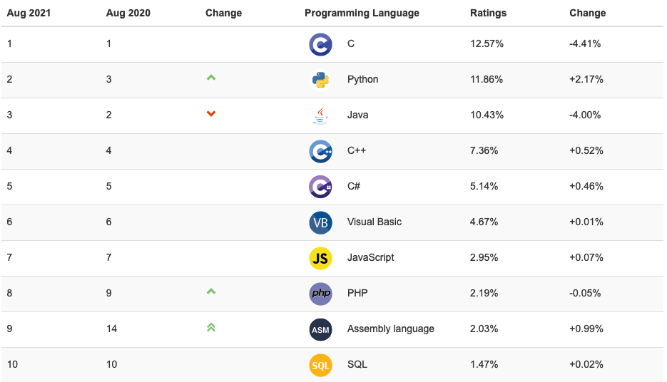
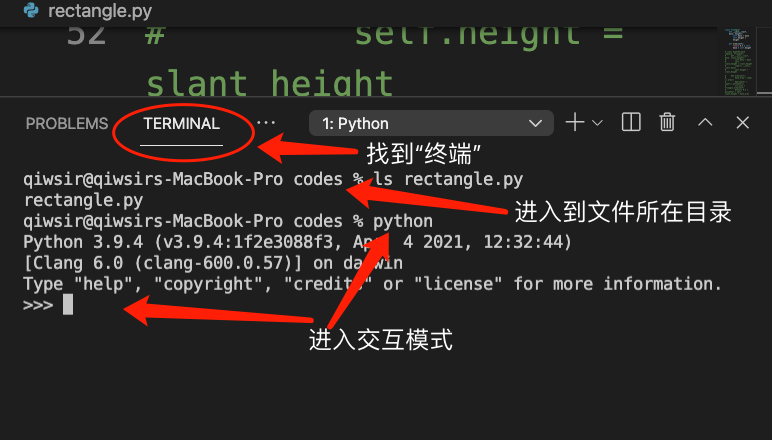
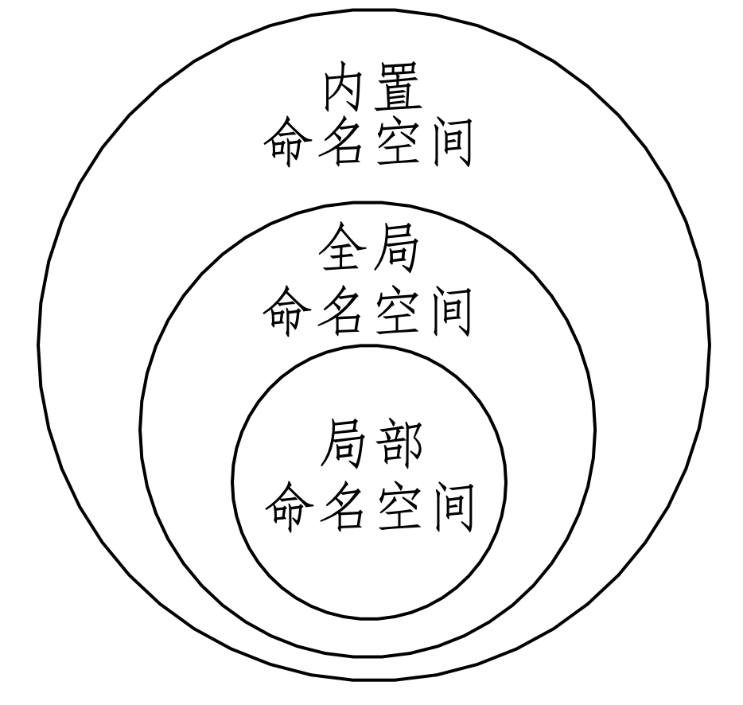
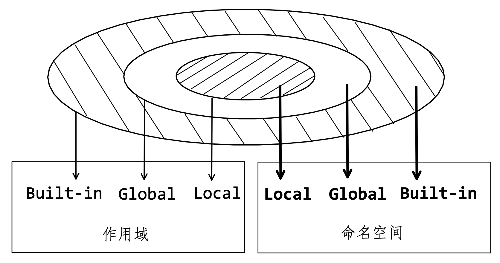
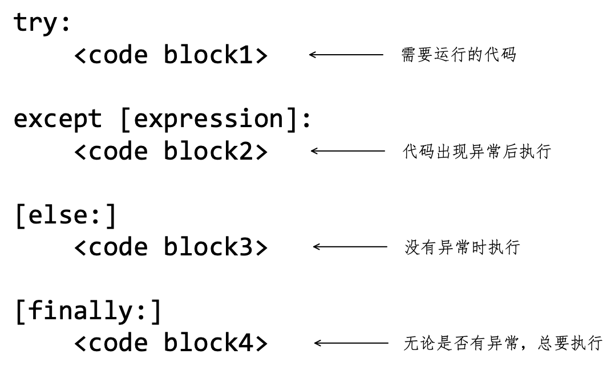

[TOC]

# 前言

> 是故学然后知不足，教然后知困。知不足然后能自反也，知困然后能自强也。故曰教学相长也。
>
> ——《礼记》

我曾出版过《跟老齐学 Python：轻松入门》和《Python 大学实用教程》两本面向初学者的图书，还在不同场合讲授相关课程，因此，有幸与很多读者和学习者进行交流，收获颇丰。为了将自己的收获与众多学习者分享，于是编写本书。

本书名称中的“自学”，就是要跟诸位分享的重要内容。不论是从软件技术的发展还是个人成长、能力构成等各个角度来说，“自学能力”都是必不可少的，这毋庸置疑，也不需要论证。一般地，此能力非“生而知之”，而是“学而知之”的。“学”必须要借助一定的材料，此处我们以 Python 语言作为自学的材料。同时，掌握该编程语言知识和运用技能，以期从事相关的开发工作或在其他工作中应用此技能。也有人会将自学过程作为一项“脑力体操”，据说可以防止老年痴呆——尚未验证，不得而知，仅是“据说”罢了。

除了强调自学的重要性之外——这是一般资料和一般的作者都能做到的，我在本书中还会将“如何自学”贯穿始终。读者在使用本书“自学”的过程中，时常就会看到【自学建议】。这些建议均是多年与学习者交流的收获，结合本书的内容加以提炼总结，分享给现在的读者。前事不忘，后事之师，希望这些学习建议能有助于学习。

本书依然是以“零基础”为学习起点，但并不停留在“入门”阶段，结合各个章节的内容，在适当的时候会引导读者“进阶”，夯实基础和开阔视野兼顾，认知和技能得以循环上升。特别是在第 12 章，以示例方式演示了 Python 在几个常见领域的应用，读者不仅能非常直观地感受到 Python 语言的魅力，更能借以权衡自己的擅长，从而确定后续发展方向。

学习编程语言，练习是必不可少的——不是“听会的”，是“练会的”，“非生而知之”的能力必须经过一定程度的刻意训练。为此编选了足够多的练习题，发布在网站上（www.itdiffer.com），读者可以一边自学、一边练习，“学、练”结合，熟能生巧。

在网站 www.itdiffer.com 上发布了关于本书的勘误、修改、源码等相关资料，敬请读者参考。此外，与本书配套的视频课程的链接，也可以通过网站获得。

尽管本书以开源形式发布，但并不意味着我会降低对错误的容忍度，如果读者在阅读本书时发现了错误，烦请通过以下任何一种渠道通知我，在此致谢。

- 微信公众号：老齐教室。在微信公众留言即可
- 读者交流 QQ 群：26913719 ，群名称是**Code Craft**

齐伟

2021年元旦

**注：**

此前我已经通过微信公众号（老齐教室）将本书内容全部开源，任何人均可以免费阅读。本文档是对所发布内容的整理，并修正了已发现的错误。

本文档以及微信公众号上发布的内容，不能用于其他商业行为或者出版和销售。


# 第1章 开始自学

> 自学并不是什么神秘的东西，一个人一辈子自学的时间总是比在学校学习的时间长，没有老师的时候总是比有老师的时候多。
> ——华罗庚

<center></center>

<center>华罗庚</center>

现在开始自学 Python ！

自学，也要有充足的准备：第一，认识到自学对个人职业生涯的重要性；第二，要有一台计算机（虽然在手机上也可以编程，但目前不推荐），并能熟练操作——不仅仅是用鼠标点来点去，还要掌握 1.5 节所述的技能；第三，能熟练使用搜索引擎，且有搜索的意识，遇到疑问能首先想到搜索。这些准备，有的项目对部分读者或许具有挑战性，可能是自学中的难点。

## 1.1 必须自学

自学，是成为一名优秀程序员的唯一途径，注意不是“途径之一”，而是“唯一途径”，舍此无他。

有幸遇到过很多优秀程序员，曾向他们请教有关个人发展的问题。这些青年才俊，毫无例外都谈到了“自学”。用不完全归纳法，可以认为优秀程序是“自学成才”的，或者说具有较强的自学能力。虽然此结论没有得到严格的证明，但它是多年的经验积累——人生经验不同于数学定理，通常难以证明。诚然，如果不认可，亦不能强求。

此外，我也接触了很多试图进入软件开发领域的初学者（多数是在校学生或者毕业不久者），总有一部分人希望老师“手把手”地教，希望老师讲解得更详细，希望老师把各种知识点总结好发给他，…… 。他们特别强调自己是初学者、自己是零基础。但他们忘记了，自己是成年人，是正在或者已经接受过大学教育的成年人。

> 收集了一些学习者的典型问题，可以通过下面的链接访问，供读者参考。有则改之，无则加勉。
>
> http://www.itdiffer.com/their-learning.html

通常而言，程序员的职业生涯不是三年五载就结束了。姑且按照当前某些媒体热炒的“三十五岁”危机来计算（这是无稽之谈），从大学毕业到危机时期，也大约十年。这十年中，软件开发技术相较于在学校所学，肯定会有很大变化——更何况在学校内的课堂上所学是否匹配于工作实际，也是值得探讨的；这十年中，软件开发技术相较于职业生涯初期也肯定会有很大变化；这十年中，更可能是“不在学校学习，没有老师教”。那么，应该如何应对这十年的变化？毫无疑问，必须自学！自学各种新知识、新技术，甚至于自学老知识、老技术。

如果没有自学，别说“三十五岁危机”，二十五岁也不会安全。如果从业的十年，是自学的十年，所谓“三十五岁”危机，也就迎刃而解了。

其实，不仅仅程序员需要自学，其他行业的从业者也需要。

>**自学建议**
>
>为了能让自学坚持长久，可以将"可视化管理"应用到自学过程中。在网站（www.itdiffer.com）中提供了一张针对本书内容的自学管理表，读者可以借用它管理自学过程。访问链接如下：
>
>http://www.itdiffer.com/self-learning.html

## 1.2 编程语言

可以将语言分为两类，一类是自然地随文化演化的语言，称为**自然语言**（Natural Language），如汉语、英语、法语等；另一类是根据特定目的、用途，人为创造的语言，称为**人造语言**（或“人工语言”，Constructed Language）。**编程语言**（或“程序设计语言”，Programming Language）是用来定义计算机程序的形式语言，属于人造语言。

通常，编程语言可以划分为：

* 机器语言
* 汇编语言
* 高级语言

### 1.2.1 机器语言

**机器语言**（Machine Language）是用二进制代码（ `0` 、`1` ）表示的计算机能够直接识别和执行的机器指令集合。如图1-2-1所示，就是用机器语言编写的表示字符串 `"Hello World"` 的程序（关于字符串，参阅第4章4.2节）。阅读它是不是很有挑战性？


<center>图1-2-1 "Hello World" 的二进制代码</center>

机器语言的最大优势是运行速度快，但它的劣势也很明显，比如图1-2-2所示的代码，如果不仔细地分辨，难以发现与图1-2-1所示内容是否有差异。


<center>图1-2-2 有错误的 "Hello World" 二进制代码</center>

曾有读者说，他一眼就看出了图1-2-1和图1-2-2的差别，此乃天赋异禀。但就普通人而言，显然，机器语言“不友好”。

又由于机器语言是计算机的设计生产者通过硬件结构赋予计算机的操作功能，所以，不同型号计算机的机器语言会有所差别。这就导致机器语言的通用性差。所以，除了少数专业人员之外，绝大多数程序员不需要学习机器语言。

### 1.2.2 汇编语言

**汇编语言**（Assembly Language）是二进制代码的文本形式，使用便于记忆的书写格式表达机器语言指令。如图1-2-3所示，是一段在 X86 计算机、64 位 Linux 操作系统运行的汇编语言程序。即使不理解这段程序，也能看出来，相对于机器语言，对人的友好度已经有了很大提高。


<center>图1-2-3 汇编语言示例</center>

但是，汇编语言非常靠近机器语言，仍然是一条指令对应着一条机器指令，并且某种汇编语言只专用于某类计算机系统，不能在不同系统之间移植。

现在，汇编语言依然有用武之地，因为它有一些独特之处，比如目标程序占用内存少、运行效率高等。当然，享用这些优点的代价就是必须接受较慢的开发速度。

### 1.2.3 高级语言

**高级编程语言**（或“高级语言”，High-level Programming Language）是面向人的编程语言—— It is for Humans ——这不是某一种语言，而是一类语言。一般我们把“机器语言”和“汇编语言”归类为“低级语言”，除此之外的都称为高级语言（如图1-2-4所示）

<center></center>

<center>图1-2-4 编程语言分类</center>

高级语言之“高级”的原因是使用了大量的英语单词，对开发者而言，更容易理解。最重要的，高级语言摆脱了“硬件的拖累”，不需要与机器语言的指令对应，借助操作系统实现了对硬件的抽象。即使开发者“对硬件一窍不通”，也能利用高级语言开发程序。

20世纪50年代，Fortran 语言发明，这是一种现在仍然使用的高级语言。至今，人类已经发明了好多种高级语言，它们各有千秋，而且这种不断产生新的编程语言的趋势还将持续下去。当然，也会有一些编程语言成为历史。维基百科上有一个词条，列出了当前已知的编程语言（[https://en.wikipedia.org/wiki/List_of_programming_languages](https://en.wikipedia.org/wiki/List_of_programming_languages?fileGuid=XKXg6qp9q36yXqPv)），建议读者浏览一番，从而体会编程语言的多样性。

>**自学建议**
>
>互联网是最大的参考资料库，为自学提供了应有尽有的资料。在自学过程中如果遇到不理解的概念、术语、名词等，都可以在互联网上找到相关解释说明。自学者，必善于搜索、勤于搜索。
>
>现在可用的搜索引擎很多，比如 google.com 、bing.com 、sogou.com 、baidu.com 等（排名分先后，请读者自行体会），不同的搜索引擎有不同的擅长，请恰当使用。

## 1.3 程序

**计算机程序**（Computer Program），也称为**程序**（Program），是一组指示计算机或其他具有信息处理能力的设备完成操作的指令集合。通常，程序是由某种编程语言编写而成。

程序编写出来之后，毫无疑问要在计算机上执行——俗称”跑“（run）起来。要达到这个目的，必须要让计算机能够“认识”程序，从而“知道”自己干什么。

如果程序是用机器语言编写的，那么计算机就能够直接“认识”了。如果程序是用高级语言编写的，要让计算机“认识”，必须先将程序“翻译”成机器语言。这与自然语言颇为类似。鲁迅在《阿Q正传》中写道：他却总说道 No!——这是洋话，你们不懂的。没有学过洋话的人要想听懂，必须要翻译。

对于程序而言，所使用的“翻译”方式有两种：编译和解释。在解释这两种方式之前，先了解几个常用术语：

- 源代码：用某种高级语言写的程序就称为“源代码”。

- 源文件：保存源代码的文件称为源文件。

- 本地代码：计算机（具体就是 CPU）能直接执行的机器语言的程序。用任何编程语言编写的源代码，最后都要翻译为本地代码。

再简要说明两种“翻译”方式：

**（1）编译**

用**编译器**（Complier ，也是一种程序）将源代码全部翻译为本地代码的过程，就是**编译**（Compile）。所谓编译器，则是执行这一过程的程序。

某些编程语言写的程序需要编译之后才能执行，这类语言常称为“编译型语言”，比如：C 语言。

**（2）解释**

有的程序，不需要编译，在运行它的时候，直接用**解释器**（Interpreter ，也是一种程序）对源代码进行**解释**（Interpretation）和执行。

同样，用于编写这类程序的编程语言，称为“解释型语言”，比如 BASIC 。

> **自学建议**
>
> 自学并不是坦途，但“踏平坎坷成大道”。
>
> 在网站 www.itdiffer.com 中“有则改之”页面，记录很多学习者与我的交流和提问，特别建议读者认真阅读一番，辨别其中哪些是真正的“困难”，哪些是自己给自己故意设置的所谓“困难”——有则改之，无则加勉。
>
> 如果学习中遇到了真正的困难——没有电脑之类的困难不在此列——自己应该庆幸，因为这是进步的阶梯。面对困难，不要烦躁、恼火——气大伤身，且不解决问题，而是要理智地分析困难，利用搜索引擎和其他网站，搜索相关资料——务必要认真地、完整地阅读，切忌走马观花。再结合当前问题，通过反复操作尝试，尽力解决困难——通常这样做必然能“成大道”。

## 1.4 Python 语言

在1.2节中已经简要介绍了编程语言，本书将要介绍的编程语言是一种名为 Python 的高级编程语言。为什么要学习这种编程语言，其解释是仁者见仁智者见智。先看看由 TIOBE 提供的2021年10月的编程语言排行榜（如图1-4-1所示，来源：https://www.tiobe.com/tiobe-index/ ）。



<center>图1-4-1 编程语言排行榜</center>

从榜单可见，Python 语言位列第一名（2021年10月）。读者查看此排行榜的时候，结果可能会与图1-4-1所示不同，但无论如何，Python 语言在工程、教学等领域，都是颇受欢迎的编程语言。

既来之，则安之。已经阅读到这里了，哪怕就是道听途说“ Python 语言好”，也算是一个学习理由吧。更何况，从当前流行的编程语言趋势来看，Python 语言也日益成为“大众编程语言”——业已走入中小学的计算机教材之中。

一种“已过而立之年”的编程语言，缘何有如此魅力？ 还要从“初心”开始谈起。


<center>图1-4-2 Guido van Rossum<br>（源自：https://zh.wikipedia.org/wiki/Python）</center>

Python 语言的发明人是**吉多·范罗苏姆**（Guido van Rossum）。关于他发明 Python 语言的过程有很多传奇地描写，例如在“维基百科”的中文词条“Python”中说他在圣诞节期间“为了打发时间，决心开发”此编程语言。这种写法无非是要表现非凡之人的非凡之处（类似于“是时雷电晦冥，……，则见蛟龙于其上。已而有身，遂产高祖”《史记·高祖本纪》）。

不论吉多的发明过程被描述得多么神奇，Python 语言终究是诞生了，它的主要特点和“初心”还被总结为《Zen of Python》（中文翻译为《 Python 之禅》）。下面列出英文和中文两个版本（中文翻译来自“维基百科”的“ Python 之禅”词条），读者可以对照阅读，从中初步了解 Python 语言的特点。在后续的学习过程中，还可以将所学 Python 语言知识与此处的诗句对照，感悟这些凝练的词语中所蕴含的深刻含义。

| 英文版                                                       | 中文版                                                       |
| ------------------------------------------------------------ | ------------------------------------------------------------ |
| Beautiful is better than ugly.<br/>Explicit is better than implicit.<br/>Simple is better than complex.<br/>Complex is better than complicated.<br/>Flat is better than nested.<br/>Sparse is better than dense.<br/>Readability counts.<br/>Special cases aren't special enough to break the rules.<br/>Although practicality beats purity.<br/>Errors should never pass silently.<br/>Unless explicitly silenced.<br/>In the face of ambiguity, refuse the temptation to guess.<br/>There should be one-- and preferably only one --obvious way to do it.<br/>Although that way may not be obvious at first unless you're Dutch.<br/>Now is better than never.<br/>Although never is often better than *right* now.<br/>If the implementation is hard to explain, it's a bad idea.<br/>If the implementation is easy to explain, it may be a good idea.<br/>Namespaces are one honking great idea -- let's do more of those! | 优美优于丑陋，<br/>明瞭优于隐晦；<br/>简单优于复杂，<br/>复杂优于凌乱，<br/>扁平优于嵌套，<br/>稀疏优于稠密，<br/>可读性很重要！<br/>即使实用比纯粹更优，<br/>特例亦不可违背原则。<br/>错误绝不能悄悄忽略，<br/>除非它明确需要如此。<br/>面对不确定性，拒绝妄加猜测。<br/>任何问题应有一种，且最好只有一种，<br/>显而易见的解决方法。<br/>尽管这方法一开始并非如此直观，除非你是荷兰人。<br/>做优于不做，<br/>然而不假思索还不如不做。<br/>很难解释的，必然是坏方法。<br/>很好解释的，可能是好方法。<br/>命名空间是个绝妙的主意，<br/>我们应好好利用它。 |

现在的 Python 编程语言，由于遵循着“开源、开放”的原则，已经发展成为一个覆盖诸多领域的开放生态系统，例如在人工智能领域，每个深度学习框架都要发布“ Python 版”——这是标准配置。

下图是 PyPI 网站的首页（ pypi.org ），这个网站专门发布开发者编写的 Python 第三方库（参阅第11章11.4节），至撰写这段内容为止，此网站上已经有 298,220 个项目（如图1-4-3所示，到第11章11.4节时，会看到此图的变化）。毫不夸张地说，PyPI 的第三方库几乎涵盖了常规开发的各个领域——需要开发什么，先来这里搜一下，看看有没有“轮子”。正是有如此庞大的生态系统，才让程序员用 Python 语言实现了“以人为本，节省开发者时间”的要求。


<center>图1-4-3 PyPI 首页</center>

 

> **自学建议**
>
> 就学什么编程语言而言，历来有很多争论，当然也没有定论——大家更愿意争论。比如有的认为应该学“程序执行速度快”的编程语言，有的认为应该学“用途广泛的”的编程语言，有的认为应该学“开发速度快”的编程语言，还有的认为应该学“简单易学”的编程语言，等等。不一而足。
>
> 读者对此如何决断？是听大师们教诲？还是听同学们劝导？还是看网上的帖子？亦或随大流，看招聘网站上招聘信息的多寡？或者看自媒体上的宣扬？
>
> “小马过河”是一个非常生动的故事，每个人都有自己的需要和境况。至于学习哪种编程语言，甚至于是否学习编程，都要结合自己的具体情况，独立思考，做出判断。而非人云亦云，更不能跟着感觉走。
>
> 顺便提醒，不要忘记，最“节省机器时间”“跑得快”的编程语言是机器语言。

## 1.5 操作系统

本节不是全面介绍操作系统知识，是提醒读者从开发者的角度认识自己的操作系统——至少要能熟练使用一些命令完成常见操作。

首先要声明硬件设备，本书所演示的代码都是基于个人计算机（ Personal Computer ，简称：PC，也翻译为：电脑、计算机，有的资料中亦称为“微机”），或许有的读者执着于要在手机或者其他移动智能终端设备上编写和调试程序，不是不可以—— Python 是跨平台的，但会与本书演示的内容有所差异，本书不兼顾非个人计算机。

就目前常见的计算机而言，其操作系统包括：Windows 、macOS 、Linux 。

### 1.5.1 Windows

Windows 操作系统的全称是“ Microsoft Windows ”，翻译为“视窗操作系统”，是当前个人计算机上应用最广泛的操作系统（没有之一）。

经过中小学的计算机课程学习，读者一定能够比较熟练地用鼠标在图形化界面上点来点去地完成各种操作。这只是 Windows 提供的一种操作模式，除此之外，Windows 还支持通过命令完成操作。虽然这种操作很不直观，现在也不“大众化”，但是在编写和调试程序的时候，倒是很方便。因此，未来的开发者对此要熟悉。

首先，打开能够输入命令的窗口——俗称“ CMD 窗口”。以 Windows 10 为例，可以有多种方法打开这个窗口。例如：在“开始菜单”中找到“ Windows 系统”里面的“命令提示符”，如图1-5-1所示：


<center>图1-5-1 开始菜单中的“命令提示符”</center>

用鼠标点击此项，打开如同图1-5-2所示的窗口，观察此时窗口界面中闪动的光标，提示我们可以在这里输入命令。


<center>图1-5-2 命令行输入窗口</center>

另外一种打开“CMD 窗口”的方法是使用快捷键“ Win + R ”，如图1-5-3所示。


<center>图1-5-3 快捷键 Win+R</center>

在弹出的对话框中（如图1-5-4所示）输入“ cmd ”后点击“ OK ”（或者是“确定”）按钮，也可以呈现“ CMD 窗口”（如图1-5-2所示）。


<center>图1-5-4 运行 cmd 命令</center>

打开了“ CMD 窗口”之后，即可输入命令完成某项操作。有哪些命令？

微软公司在推出 Windows 操作系统之前有一个名为“ DOS ”的操作系统，曾经在20世纪80、90年代，广泛安装在 IBM PC 兼容机上，乃至于后来 Windows 操作系统，也有几个版本至少部分地以 DOS 操作系统为基础。在图1-5-2所示的界面中所输入的命令，基本上就继承自 DOS 操作系统的各种命令。表1-5-1是部分常用的命令。

表1-5-1 几个 DOS 命令

| 命令 | 说明                                         |
| ---- | -------------------------------------------- |
| MD   | 创建子目录                                   |
| CD   | 改变当前目录，进入到指定的目录               |
| DIR  | 显示指定位置下的目录和文件（默认是当前位置） |
| TREE | 显示目录结构                                 |
| COPY | 复制文件                                     |
| REN  | 文件改名命令                                 |
| DEL  | 刪除文件命令                                 |
| DATE | 查看日期命令                                 |

注意，在 Windows 中输入命令，不区分大小写。如图1-5-5所示，以显示当前位置的目录和文件为例，当输入了 `DIR`（或者 `dir` ）之后，敲回车即可。


<center>图1-5-5 DIR 命令和结果</center>

由于对 Windows 命令的操作和说明已经超出了本书的范畴，请读者参考下述的【自学建议】，自行进行研究。

> **自学建议**
>
> 在搜索引擎中搜索“ DOS 操作系统”等有关内容，了解这种”古老“的操作系统，特别是常用的命令。如果自己所用的计算机是 Windows 操作系统，按照本节的介绍，在“ CMD 窗口”中练习用命令完成一些基本操作，比如：进入到指定目录、查看目录中的文件。
>
> 请读者务必熟练掌握基本的命令——这是开发者的基本功，在后续内容中会经常用到。

### 1.5.2 Linux


<center>图1-5-6 Linux 吉祥物 Tux</center>

Linux 是一种开源操作系统，它以 Unix 为基础，发明人是 Linus Torvalds（如图1-5-7所示）。这是一位令众多程序员膜拜的、为 IT 业做出卓越贡献的开发者，他除了发明 Linux 操作系统之外，还发明了一种源码管理系统 Git ，是目前广泛应用的源码管理工具。


<center>图1-5-7 Linux 操作系统的发明人 Linus Torvalds</center>

Linux 被认为是开源软件的典型案例，只要遵循 GNU 通用公共许可证（ GPL ），任何个人和机构均可以自由地使用 Linux 的所有源代码，也可以自由地修改和再发布。由此，就诞生了很多基于 Linux 的操作系统，一般称它们是 Linux 发行版，比如应用于个人计算机的 Ubuntu 、Linux Mint ，应用于服务器的 Red Hat 、CentOS 等。还有一个知名度很高的移动终端操作系统 Android ，也是基于 Linux 内核。

图1-5-8所示为一种比较常用的 Linux 发行版 Ubuntu（https://ubuntu.com/）的桌面，它同样提供了“所见即所得”的视窗操作——只需要点鼠标。也有很多桌面应用软件供用户选择，比如办公套件 LibreOffice 、浏览器 Firefox 、图像编辑器 GIMP 等。可以说，在 Windows 系统中常用的应用软件，在 Linux 系统中都有功能类似的替代品——除了杀毒软件，因为 Linux 的安全性高、病毒较少，乃至于没有必要再安装专门的杀毒软件。


<center>图1-5-8 Ubuntu桌面</center>

或许在个人计算机上使用 Linux 操作系统的数量不多——在专业的开发者群体中比例可能会高一点，但是要论及服务器上运行着的操作系统，Linux 则有一统江湖的趋势。对于服务器上运行的操作系统，我们不特别在意它的视觉体验，更关心的是“安全性”、“可靠性”等性能，当然，价格也是必须考虑的——不要忘记，Linux 是开源的。另外一项重要因素是围绕 Linux 已经建立起了非常完善的基于服务器的应用生态系统，这也是开源带来的好处。

作为专业开发者，必须要掌握一些 Linux 系统的基础知识。各位读者多以专业开发者为发展目标。专业选手和业余选手对待操作系统的最大区别是前者以提高工作效率为重点。又由于专业人士经过了专业训练，于是他们更喜欢用各种命令完成操作——手指不离开键盘，比用鼠标“点来点去”效率高很多——这是多么酷的场景，让很多业余人士和外行“虽不明，但觉厉”。

其实，只要摒弃恐惧心理，经过适当的练习，人人都可以成为专业人士，正所谓“人皆可以为尧舜”。

以 Ubuntu 为例，通常使用快捷键组合“ Ctrl + Alt + T ”，即可打开**终端**（如图1-5-9所示），然后在终端输入命令，即可完成相应操作。


<center>图1-5-9 Ubuntu 的终端</center>

表1-5-2列出了几个常用的 Linux 命令，建议与表1-5-1中的 DOS 命令对比，了解它们的差异，并对其中部分 Linux 命令按照【自学建议】中的方法进行练习。

表1-5-2 几个常用的 Linux 命令

| 命令     | 说明                                         |
| -------- | -------------------------------------------- |
| mkdir    | 创建子目录                                   |
| cd       | 改变当前目录，进入到指定的目录               |
| ls       | 显示指定位置下的目录和文件（默认是当前位置） |
| cp       | 复制文件                                     |
| rm       | 刪除文件命令                                 |
| cat      | 在显示器上查看文件内容                       |
| mv       | 移动文件或目录，还可以对其重命名             |
| find     | 在给定位置按照条件进行搜索                   |
| shutdown | 关闭计算机                                   |

特别提醒，在 Linux 中，区分命令名称字母的大小写，表1-5-2中所列命令，在使用中都要求小写字母。

> **自学建议**
>
> 如果读者现在用的计算机是 Windows 操作系统，建议从以下方式中选择一种，在自己的计算机上安装 Ubuntu 操作系统，并力争将其作为开发和学习的主要环境，至少要有所体验。
>
> 方式1：卸载 Windows 操作系统后安装 Ubuntu 系统。特别是针对“老旧”计算机，运行 Windows 系统及应用软件，已经“慢吞吞”了，如果改为 Ubuntu 系统，立刻会实现“飞一般”的操作。除了卸载原有 Windows 操作系统之外，还可以在性能较好的计算机上安装双系统，开机时选择将要使用的操作系统。具体安装方法请参阅 Ubuntu 官方网站的安装指南（https://ubuntu.com/tutorials/install-ubuntu-desktop#1-overview）或者其他网络资料安装。
>
> 方式2：在计算机上安装虚拟机软件，比如 VMware 、VirtualBox ，然后在虚拟机上安装 Ubuntu系统。
>
> 方式3：由于 Linux 系统对开发者的友好性，Windows 10 操作系统已经支持内置的 Linux 子系统，可以参阅相关资料，开启并使用子系统。
>
> 读者若有计划在软件开发这个方向上有所深入，就不得不摆脱貌似简单实则低效的用鼠标“点来点去”的操作习惯，改为貌似复杂实则便捷高效的“命令行”。不论是1.5.1节的 DOS 命令，还是此处介绍的 Linux 命令，至少要熟悉一种。

### 1.5.3 macOS

macOS 是美国苹果公司推出的操作系统（注意，历史上这个操作系统的名称有所变更，2011年及之前称为 Mac OS X ，2012年至2015年称 OS X ），主要用于其 Macintosh（简称 Mac）系列的个人计算机上。

macOS 具有非常友好的视窗操作界面，并且与硬件配合堪称天衣无缝（毕竟是同一家生产的），这赢得了大众的欢迎（只是价格不怎么亲民）。对于开发者而言，图形化操作当然是必须的。除此之外，前述的“手指不离开键盘”完成各种操作，在 macOS 中也能轻松实现，因为 macOS 是基于 Uninx 的，它与 Linux 同宗同源，所以常用的 Linux 命令可以用在 macOS 上。

> **自学建议**
>
> 如果读者现在使用的就是苹果公司生产的个人计算机，比如 MacBook Pro 等，那么就请打开 Launchpad（启动板），找到 Terminal（终端），打开之后，显示了输入命令的窗口，但这个窗口内的视觉效果不好，所以，多数人更喜欢另外一个名为 iTerm 2 的应用（如图1-5-10所示）。


<center>图1-5-10 iTerm 2 窗口</center>

> 如果读者尚未拥有此类计算机，也不用懊恼和羡慕，在认真学习了本书内容之后，特别是充分理解本书所倡导的“自学”，将来一定能够凭借个人能力拥有一台你喜欢的最好的计算机。

## 1.6 Python 官方网站

关于 Python 编程语言最权威的资料当然来自其官方网站，因此，要对该网站有所了解。

网址：**python.org**

网站首页如图1-6-1所示，先注意观察网站的结构。在最醒目的 logo 之上有一行栏目（称为第一行）：Python、PSF、Docs、PyPI、Jobs、Community ，并且用倒三角形的符号指示当前位置是“ Python ”。在 logo 之下还有一行栏目（称为第二行）：About 、Downloads 、Documentation 、Community 、Success Stories 、News 、Events 。


<center>图1-6-1 Python官网首页</center>

本节将重点浏览第二行栏目中的部分内容，第一行栏目中的内容建议读者自行翻阅。

### 1.6.1 About

将鼠标移动到“ About ”上面，暂不要点击，即可看到图1-6-2所示内容，这里以最简洁的语言概述了 Python 语言特点：Python is a programming language that lets you work more quickly and integrate your systems more effectively 。


<center>图1-6-2 介绍 Python</center>

再将将鼠标向下滑动到“ Applications ”，并点击，即打开网址为 https://www.python.org/about/apps/ 的页面，在这个页面中列举了 Python 语言的一些应用领域，以及 Python 对该领域所提供的各种支持（专用的模块、库等工具），以下所列各项皆来自此页面，借此可以初步了解 Python 的基本应用（第12章会演示部分应用示例）。

- Web 开发框架，常用的有 Django 、Flask 等。
- 科学计算库，这是 Python 的重要应用领域，如 SciPy 、Pandans 等。
- 机器学习和深度学习库，比如 Scikit learn 、PyTorch 、TensorFlow 等。
- 桌面 GUI 开发框架，如 Tkinter 、kivy 等。
- 嵌入式应用开发框架，如 MicroPython 。
- ERP 应用框架，如 Odoo、Tryton 。

“ About ”栏目下的其他项，建议自行查阅。

### 1.6.2 Downloads

这个栏目中的内容将在1.7节中使用，所以请务必认真阅读。

把鼠标滑动到“ Downloads ”栏目上（不点击鼠标），会自动出现如图1-6-3所示的效果，显示“ Download for Mac OS X ”及下面的下载按钮和有关说明。但是，若读者亲自操作，所看到的很可能与图示不同，因为此处所显示的内容是网站根据访问者所用的操作系统，显示当前可下载的最新版本的 Python 安装程序。图1-6-3所显示的内容，即表示我在编写本书的时候，使用的是 macOS 操作系统（参阅1.5.3节），网站针对此操作系统，提供当前可下载的最新的 Python 版本是“ Python 3.9.4 ”。点击写有“ Python 3.9.4 ”字样的按钮，就可以下载此版本的 Python 安装程序。也就是说，读者如果按照本书建议进行学习，通过此操作能够下载到与自己所用操作系统相匹配的最新发布的 Python 安装程序（不一定是 Python 3.9.4 ，可能会高于此版本）。


<center>图1-6-3 下载 Python 安装程序</center>

- **All releases**

当把鼠标滑动到“ Downlloads ”栏目的下拉菜单中的“ All releases ”，并点击之，会打开网址 https://www.python.org/downloads/ ，这里列出了所有已经发布的各个版本的 Python 安装程序，图1-6-4即为我在编写本书时从此页面上得到的截图，其中显示了不同状态下的 Python 版本。请读者特别关注 Python 2.7 ，这是 Python 2.x  的最高版，已经在2020年元旦停止支持（end-of-life），但是，这并不意味着此版本不可用。


<center>图1-6-4 维护着的 Python 版本</center>

Python 的版本可能会成为初学者的困扰，在1.7节会就此有比较完整的阐述。

- **Windows**

如果在图1-6-3所示的下拉菜单中，进入“ Windows ”，即打开网址 https://www.python.org/downloads/windows/ ，显示所有针对 Windows 操作系统的各个版本的 Python 安装程序。图1-6-5是从此网页中获得的部分截图（读者打开此网址时，可能与截图显示的版本不同），其中显示了当前最新发布版本——包含 Python 3 和 Python 2 两类。对于 Python 3.9.4 版，在列表中显示了不同的安装程序文件，点击超级链接即可下载。其中的“ embeddable package ”表示压缩文件；“ installer ”表示安装程序的可执行文件；“ 32-bit ”和“ 64-bit ”表示适用于不同位操作系统。


<center>图1-6-5 适用于 Windows 的 Python 各版本安装程序</center>

> **自学建议**
>
> 以 Windows 10 为例，右键点击“此电脑”，然后选择“属性”，即可看到图1-6-6所示窗口，从中可知：本计算机的“系统类型”是“64位操作系统，基于 x64 的处理器”，也就是此台计算机中的 Windows 10 即为64位操作系统。


<center>图1-6-6 64位操作系统</center>

> 如果你所用计算机比较陈旧，也可能上面运行的操作系统是32位的。所谓32位和64位，表示的是该计算机 CPU 一次能处理的最大位数。在安装应用程序的时候，要注意区分，以便能最大限度发挥计算机的计算能力。

- **Mac OS X**

使用 macOS 操作系统的读者，自然要从图1-6-3所示的下拉菜单中进入“ Mac OS X ”项，打开 https://www.python.org/downloads/mac-osx/ ，该页面的部分截图如图1-6-7所示（此截图为读者编写本书时所见，与读者所见页面可能有异）。


<center>图1-6-7 适用于 macOS 的 Python 各版本安装程序</center>

如果读者使用的是苹果公司生产的个人计算机，就必须要关注一条信息，2020年11月苹果公司发布了 M1 芯片，并用于 Mac 系列的个人计算机上，这标志着苹果公司已经着手将 CPU 从 Intel 公司的迁移到自行设计的芯片。Python 语言为了适应此变化，在发布的安装程序中，就兼顾了当前的两种 CPU 。以图1-6-7所示的 Python 3.9.4 为例，列表中的：

- Download macOS 64-bit Intel installer：对应的是应用于 Intel 公司 CPU 的安装程序；
- Download macOS 64-bit universal2 installer：对应的是应用于苹果公司自研 CPU 的安装程序（如图1-6-8所示，即为一款应用了苹果 M1 芯片的 MacBook Pro 计算机的“ Finder - About This Mac ”截图）。


<center>图1-6-8 使用了苹果 M1 芯片的计算机</center>

- **Source code**

进入图1-6-3所示的“ Downloads ”下拉菜单“ Source code ”项，打开 https://www.python.org/downloads/source/ 网址（图1-6-9为编写本节时页面的部分截图），即可得到各个 Python 版本的源代码下载列表。


<center>图1-6-9 Python 各版本源码</center>

要源码有什么用？

在开发领域，经常听到一些人声称“他要阅读源码”，也会有不少人附和。而实际上不少人甚至不晓得从哪里能搞到源码。现在找到了 Python 源码了，至少可以有点“附和的信心”了。

读者可以已经注意到，在“ Downloads ”的下拉菜单中，没有看到针对 Linux 操作系统的安装程序，用 Ubuntu 的读者是不是有点迷惑，难道被区别对待了吗？非也。在1.7节会对此有详细阐述。

对于“ Downloads ”下拉菜单中的其他项不再逐个说明了，可以自行了解。

### 1.6.3 Documentation

图1-6-10所示的是鼠标滑动到“ Documentation ”栏目的显示效果，在其下拉菜单中，对学习者而言，最重要也是最常用的就是“ Docs ”项，它是本书——也是所有关于 Python 语言的图书——的唯一权威参考资料，其他各项是为开发者、学习者提供的有关资料，读者可以参考。


<center>图1-6-10 Documentation 栏目及其下拉菜单</center>

在图1-6-10所示的菜单中点击“ Docs ”，即打开网址 https://www.python.org/doc/ ，可以根据 Python 的版本查看到相应的文档。后面还有其他四个栏目，请读者自行查看，此处不再赘述。

对 Python 官方网站有了基本了解之后，就开始尝试在自己的计算机上配置 Python 开发环境。

> **自学建议**
>
> 学习编程语言，肯定离不开英语，刚刚浏览过的 Python 官网网站，就是英语为主要语言。作为一名理性的、有追求的读者，肯定不会因为语言问题而对本书或者 Python 语言给予某种偏激的评论。
>
> 就编程语言中的英文而言，通常语法难度不高，或许会有个别单词不认识，凭借翻译工具也能很快理解。就此，向读者提供如下参考方案：
>
> - 建立信心，破除恐惧。阅读本书的读者，至少在初中、高中、大学中的两个阶段学过英语，很可能不少人通过了大学四级或者六级英语考试。凭此基础，足以阅读学习中所遇到的英文资料。之所以还觉得困难，是因为首次接触，对其中的表达规律尚未掌握，或者某些词汇还感陌生而已。
> - 水滴石穿，坚持不懈。在“完全自学”的学习进程中，不得不经常阅读英文资料，可以用翻译工具帮助理解个别词汇，但是不建议全文翻译，而是要坚持阅读原文。开始可能慢，只要“硬着头皮”坚持，光明的未来就属于你了。
>
> 最后，要郑重声明：本书中会引用很多来自 Python 官网或者帮助文档的内容，对于这些内容，也不会进行逐字逐句的翻译。若因此引起读者不适，本作者不对此负责。

## 1.7 安装 Python

由上一节对 Python 官方网站的浏览可知，可以从网站上下载适用于各种操作系统的 Python 安装程序。只有在计算机上安装了从官方网站下载的对应安装程序（特别声明，此处强调：“从官方网站下载”），才能在那台计算机上使用 Python 编程语言编写程序，这就是常说的“配置开发环境”。

> **注意事项：**
>
> 有的人不记忆网址，习惯于在搜索引擎上搜索。但是，根据经验，必要的或者重要的网址还是应当记忆的，比如 Python 官方网站的地址：python.org。这是因为，有的搜索引擎从自己的利益出发，并不会在比较靠前的搜索结果中显示官方网站，甚至可能将用户引导至其他网站，下载经过“做手脚”的安装程序。

### 1.7.1 Python 的版本

在浏览1.6.2节有关内容的时候，特别是图1-6-4，显示了 Python 语言目前的两大版本：Python 2 和 Python 3 。这两个大版本有比较明显的差别，并且互不兼容——用 Python 2 编写的程序，无法用 Python 3 直接运行，反之亦然。至于两者的差异到底在哪里？不是本书重点阐述的内容。在学习编程语言上，我们秉承着“喜新厌旧”的原则，因为新版本会相对旧版本在语法、性能等方面有所改善。所以，编程语言无所谓“经典永流传”，总是“长江后浪推前浪，一辈新人胜旧人”。

故，建议学习 Python 3 。

但是 Python 3 还有那么多小版本呢，那就选择最新发布的。本书演示所用的是 Python 3.9.4 ，如果读者使用的是其他小版本——统称为 Python 3.x.y ，也均适用于本书的学习要求。也就是说，只要在 Python 3 这个大版本范畴内，各个小版本之间的差异不很大，对于初学者而言，甚至可以忽略——不可忽略的部分，会在书中提醒。

当读者学成之后，在实际项目中如果遇到了 Python 2 ——处理古老的代码，也是开发者经常要遇到的工作内容。怎么办？不必惶恐！若读者严格遵循本书要求，勤学苦练，到那时已经练就了处理各种难题的能力，现在不必杞人忧天，只需痛下决心，学起来。

最后总结，推荐使用的 Python 版本是在官方网站所看到的 Python 3 最新正式发布版本，即执行了1.6.2节中图1-6-3所示的操作后看到的最新发布版。如果未来有了 Python 4，则另当别论。

选定了 Python 版本之后，如何在计算机上安装？基本方式与安装其他软件类似。

### 1.7.2 Windows

此处以 Windows 10 作为演示用操作系统，其他型号的 Windows 操作系统与这里演示的过程大同小异。

首先，从 Python 官方网站下载安装程序，如1.6.2节图1-6-5所示，点击图示的下载列表中“ Python 3.9.4 ”下的“ Download Windows installer(64-bit) ”下载该程序（由于此网站服务器在国外，国内有些地区下载速度可能会稍慢，请耐心等待。若遇到连接超时等情况而下载失败，请自行更换网络多次尝试）。

下载完成，在本地能够看到一个名为 python-3.9.4-amd64.exe 的文件（如果读者下载其它版本的安装程序，同样会显示带有版本号的文件），然后开始安装。

1. 双击已经下载的安装文件，显示如图1-7-1所示的窗口，开始安装。

   

   <center>图1-7-1 开始安装</center>

   注意，当看到图1-7-1所示界面时，不要贸然点击“ Install Now ”，而是要先将下面的复选框“ Add Python 3.9 to PATH ”选上（如图1-7-2所示），这样就意味着此时安装的 Python 程序会自动增加到系统的环境变量中。

   

   <center>图1-7-2 增选复选框</center>

   然后点击图1-7-2所示的“ Customize installation ”（自定义安装），进入到下一步。

2. 图1-7-3是点击“ Customize installation ”后的显示界面，现在可以自定义安装的项目，一般情况建议选中所有项目，除非读者有特别需要或者有能力后期安装有关项目。

   

   <center>图1-7-3 自定义安装项目</center>

   然后点击“ Next ”按钮。

3. 承接上一步，进入“ Advanced Options ”界面（如图1-7-4所示）。

   

   <center>图1-7-4 高级选项</center>

   在此建议读者按照图1-7-5所示选中几个项目，并且要牢记程序的安装位置（可以自行指定，本示例的安装路径是：`C:\Program Files\Python39`）。

   

   <center>图1-7-5 选中的高级选项</center>

   然后点击“ Install ”按钮。

4. 安装过程大概需要几分钟（如图1-7-6所示）。

   

   <center>图1-7-6 安装过程</center>

   如果幸运，会顺顺利利地完成安装，并最终出现图1-7-7所示结果：安装成功。然后点击“ Close ”按钮。

   

   <center>图1-7-7 安装成功</center>

   但是，由于计算机系统的环境复杂，如果没有出现图1-7-7所示效果，或者安装中途出现某种错误等，都不稀奇，亦不要为此绝望，这些都是正常情况——“古来贤俊多坎坷”，代码人生就是在克服困难中成长。常用的解决方法就是利用搜索引擎，查找针对所出现错误的解决方法。

5. 不论是一帆风顺，还是历尽千辛万苦，最终安装成功了，就可以在安装目录（前面提示要牢记的目录）中看到图1-7-8所示的内容。

   

   <center>图1-7-8 Python39 目录内容</center>

   打开其中的子目录“ Scripts ”，显示的内容如果是图1-7-9所示的文件列表，说明按照前述过程操作后，已经将 `pip` 这个重要工具已经安装上了，这就为第11章11.4节的学习奠定了基础，否则那时还要遇到点麻烦。

   

   <center>图1-7-9 pip 工具文件</center>

   打开图1-7-8中的子目录“ Doc ”，如图1-7-10所示，此处显示的文件 python394.chm 即为当前所安装的 Python 3.9.4 的文档，其内容与1.6.3节所看到的在线文档相当。

   

   <center>图1-7-10 安装在本地的文档</center>

6. 在说明图1-7-2所示的操作时，特别提醒要将“ Add Python 3.9 to PATH ”项选中，如果当时没有按照建议操作，下面还有补救机会；如果选了，也建议按照下面的流程了解操作效果。在计算机的桌面或者开始菜单中找到“此电脑”，单击鼠标右键（图1-7-11是开始菜单中的”此电脑“），选择“属性”，进入图1-7-12所示的界面。

   

   <center>图1-7-11 Windows 10 开始菜单的“此电脑”</center>

   

   <center>图1-7-12 高级系统设置</center>

   点击图中的“高级系统设置”，进入图1-7-13所示界面，点击其中的“环境变量(N)”按钮，打开图1-7-14所示的界面。

   

   <center>图1-7-13 环境变量</center>

   

   <center>图1-7-14 编辑系统变量的 Path</center>

   在图1-7-14中，选中“系统变量”中的“ Path ”，并点击“编辑”按钮，显示图1-7-15界面，从中看到已经添加的环境变量“ C:\Program Files\Python39\”和“C:\Program Files\Python39\Scripts\ ”——这就是执行了图1-7-2所示操作的效果，如果没有看到这两个环境变量，可以点击其中的“新建”按钮，将这两个路径添加到环境变量。

   

   <center>图1-7-15 查看和新建环境变量</center>

经过上述操作，在计算机中已经配置好了 Python 环境。如果要检查一下是否成功，可以用下面两种途径启动 Python 交互模式——第2章开始会经常使用“ Python 交互模式”。

途径一，从“开始”菜单中找到刚刚安装的 Python 程序，如图1-7-16所示，点击其中的“ IDLE(Python 3.9 64-bit) ”，即可显示图1-7-17所示的界面。


<center>图1-7-16 “开始”菜单中的 Python</center>


<center>图1-7-17 IDLE 的交互模式界面</center>

途径二，按照1.5.1节所述，进入到“ CMD 窗口”（如图1-5-2所示的界面），不论当前位置在哪个目录，都可以输入 `python` ，并敲回车键，显示如图1-7-18所示的界面，也意味着进入到了 Python 交互模式中。


<center>图1-7-18 在 CMD 窗口进入交互模式</center> 

### 1.7.3 Linux

在1.5.2节中以 Ubuntu 为例简介了 Linux ，此处继续以其为例，演示如何在它上面安装和运行 Python 。

以下演示所用的是 Ubuntu 20.04 。

Ubuntu 操作系统的最大特点是不需要单独安装 Python ，只要此操作系统在计算机上安装好了，Python 开发环境作为默认的配置项已经安装好，正所谓“开箱即用”。打开1.5.2节中的图1-5-9所示的终端，直接输入 `python3` 指令并回车（注意输入的内容），显示效果图1-7-19所示，从图示中可以看到 Ubuntu 20.04 中默认支持的 Python 3.8.5 。不同版本 Ubuntu 系统中默认安装的 Python 版本会有差异，在使用的时候要注意分辨。


<center>图1-7-19 Ubuntu 默认的 Python</center>

不论所使用的是什么版本的 Ubuntu 操作系统，都可以将其中的 Python 环境进行重新配置。下面演示两种更新 Python 版本的方法，即满足“求新求变”的愿望，也能训练使用 Linux 命令配置开发环境的能力。

**方法1：用 `apt` 安装**

**`apt`** 的全称是“ Advanced Packaging Tool ”，是 Linux 系统下的一款安装包管理工具。在 Ubuntu 的终端中（如图1-5-9所示，注意不是图1-7-19所示的 Python 交互模式。在图1-7-19的交互模式中输入`exit()`，并敲回车，就回到了图1-5-9所示的状态）输入如下指令，目的是更新当前系统的软件并安装一个组件 `software-properties-common`。

```
sudo apt update
sudo apt install software-properties-common
```

Ubuntu 自带软件源的 Python 版本不是我们所要求的——当读者阅读本书的时候，也可能自带软件源的版本已经更新到此处演示的 Python3.9.4 ，但那时 Python 也有更新的版本了，此法依然适用，只是版本号要修改。

为了安装最新发布的 Python，需要增加一个软件源，下面增加的是由第三方维护的软件源“ deadsnakes ”（https://launchpad.net/~deadsnakes/+archive/ubuntu/ppa），到编写本节内容为止，此软件源的 Python 版本更新到了 Python 3.9.4 。继续在终端输入如下指令，为 Ubuntu 增加一个软件源。

```
sudo add-apt-repository ppa:deadsnakes/ppa
```

在执行上述指令的过程中，会出现提示，敲击“回车”键即可。

然后用下面的指令安装指定版本的 Python 。

```
sudo apt install python3.9
```

图1-7-20是上述指令的执行过程截图。


<center>图1-7-20 Python3.9 安装过程</center>

如果一帆风顺，就意味着 Python 3.9.4 已经在此 Ubuntu 系统上安装好了，按照如图1-7-21所示的方式，可以进入到交互模式——注意，如果使用`python`还不能进入到图示的交互模式，这是因为 Ubuntu 的软连接还没有修改。


 <center>图1-7-21 Python3.9.4 的交互模式</center>

**方法2：用源码安装**

打开 Ubuntu 的终端之后，首先要对已有软件进行升级，并安装 Python 环境所需要的依赖项。

```
sudo apt update
sudo apt install build-essential zlib1g-dev libncurses5-dev libgdbm-dev libnss3-dev libssl-dev libreadline-dev libffi-dev libsqlite3-dev wget libbz2-dev
```

然后从1.6.2节的图1-6-9显示的源码列表中下载 Python 源码。下面的指令是从 https://www.python.org/ftp/python/3.9.4/Python-3.9.4.tgz 下载源码的压缩文档，并保存在当前目录中。

```
wget https://www.python.org/ftp/python/3.9.4/Python-3.9.4.tgz
```

下载完成后，从下载的压缩包中提取存档文件。

```
tar -xf Python-3.9.4.tgz
```

而后在当前目录中即出现名为“ Python-3.9.4 ”的子目录，进入此子目录：

```
cd Python-3.9.4
```

然后执行：

```
sudo ./configure --prefix=/usr/python
```

这样就规定了即将安装的 Python 3.9.4 的目录。然后执行：

```
make -j 12
```

开始编译 Python 3.9.4 。上述命令中的参数`-j`表示并行编译，数字`12`表示允许同时执行的编译命令的数量。这个命令之后，终端会显得非常“繁忙”，要耐心地等待一段时间。完成之后执行：

```
sudo make altinstall
```

完成安装过程。但是，此时的 Python 3.9.4 只能进入到`/usr/python/bin/`目录执行才能有效，为了能够实现在任何地方只要键入命令`python`，就能执行 Python 3.9.4 ，还必须重新设置软连接。

```
sudo ln -s /usr/python/bin/python3.9 /usr/bin/python
sudo ln -s /usr/python/bin/pip3.9 /usr/bin/pip
```

这也是解决图1-7-21所示问题（如何不必输入 `python3.9` ）的方法。此后，不论在什么位置，只要执行`python`，即可启动 Python 3.9.4（如图1-7-22所示）。


<center>图1-7-22 在 Ubuntu 中启用 Python 3.9.4</center>

### 1.7.4 macOS

根据1.6.2节的内容可知，Python 官方网站提供了针对 macOS 的安装程序（如图1-6-7所示）——特别提醒，下载安装程序之前要知道本地计算机所采用的芯片型号。

下载了安装程序之后，与安装其他应用类似，双击安装文件（本示例是“ python-3.9.4-macosx10.9.pkg ”），显示图1-7-23所示窗口，点击“ Continue ”按钮开始安装。


<center>图1-7-23 开始安装 Python</center>

随后就是继续“ Continue ”，直到最后安装成功（如图1-7-25所示）——如果遇到异常现象而未能正常安装，请参阅本节的【自学建议】。


 <center>图1-7-24 正在安装</center>


<center>图1-7-25 安装成功</center>

打开 Launchpad（启动板），会看到如图1-7-26所示的 IDLE 应用，点击它，即可进入与图1-7-17雷同的界面。


<center>图1-7-26 IDLE</center>

当然，通常专业人员很少使用上面的方法，一般是打开终端——常用的是 iTerm-2 ，输入命令 `python`启动交互模式（如图1-7-27所示）


<center>图1-7-27 在 iTerm-2 中进入交互模式</center> 

至此，不论读者使用任何操作系统，都应该已经安装好 Python 编程语言的最基本开发环境了——这里没有介绍在移动终端如何配置此环境，至少到本书编写之时，移动终端尚不是作为软件开发的主流设备。

接下里，是不是就可以开始学习编写程序了呢？可以了。有的资料就是基于前面所介绍的 IDLE 面向初学者讲授的。但是，我不准备那样做，因为有志于自学的读者将来必会鹏程万里，那么起飞的装备就不能是“玩具”，而是要专业的。

> **自学建议**
>
> 任何人在任何操作系统中安装软件（或应用），都有可能遇到不顺利。这主要是因为每个人所用的计算机由于一直在执行各种操作，安装、卸载、删除、移动、复制等，难免会导致操作系统的标准配置发生变化，又恰逢所安装的软件对此敏感，故而安装失败。
>
> 如果万一遇到了“安装失败”，不要烦躁、气馁，任何不理智的、情绪化的行为只能导致心情更糟，计算机不会因为“怕惹你生气”而不“报错”。以下经验，请读者参考：
>
> 经验一：认真阅读提示信息。这需要读者气定神闲、不烦躁，从提示信息中了解失败的原因。
>
> 经验二：使用1.2节自学建议中提到的搜索引擎，耐心地到网上搜索解决方案——“日光之下并无新事”，你所遇到的，其他人已经解决，并很大方地把方案放到网上，但需要你亲自动手去找一找。
>
> 经验三：对网上提供的解决方案，要认真阅读，并与自己所遇到的情况进行比较，判断其是否适用。如果是一种可能的方案，必须要勇敢地动手尝试——尝试过程中要牢记自己的所有操作，甚至于做笔记，这样就能逐步提升自己解决实际问题的能力了。
>
> “人非生而知之者，孰能无惑”，互联网是解决自学者之“惑”的最佳选择，无他。请抛弃“我是初学者，所以我不会”的心理（这与“我弱我有理”、“不跟我玩我就哭”有相通之处）。
>
> 诚然，除了上述方法之外，还可以到学习群里问一问。本书的学习讨论群已经发布到网站上：http://www.itdiffer.com/self-learning.html ；亦或请教身边的高人。

## 1.8 IDE 简介

所谓 **IDE** ，全称是 Integrated Development Environment ，或者 Integration Design Environment、Integration Debugging Environment ，中文翻译为“**集成开发环境**”。一般来讲，它跟编程语言无关。“维基百科”的“集成开发环境”词条，对 IDE 如此解释：集成开发环境（ IDE ）是一种软件应用程序，为开发者提供软件开发所需的代码编写、自动化构建和调试等功能。

很早的程序是不需要用 IDE 开发的，因为那时是通过打孔卡给计算机编程（如图1-8-1所示）。


<center>图1-8-1 IBM 的80列标准打孔卡<br>图片源自“维基百科”的“打孔卡”词条</center>

1964年发明的 BASIC 编程语言是第一个有 IDE 的编程语言，只是那时的 IDE 是命令行界面（ Command-Line Interface，CLI ），类似的 IDE 现在仍然存在，比如 Vim 和 Emacs 。如今流行的 IDE 多是图形用户界面（ Graphical User Interface，GUI ），比如 Visual Studio Code、Eclipse 等。

一款适合的 IDE 能够提升开发者的生产力，将开发工作的各个环节密切地整合起来，例如编辑代码同时检查语法错误、代码自动补全；将源码管理工具（比如 Git ）融入到 IDE 等。

不同的开发者有不同的偏好，不同的项目有不同的需要，因此，一般而言没有哪一个 IDE 能够“一统江湖”，尽管有的 IDE 号称“普遍适用于”各种场景，也只能是在某个领域或者文化范围中的应用比例相对较高罢了。

即使是维基百科对 IDE 的描述也并非是严格定义，或者说现在很难用一个严谨的标准来判定某款编辑代码的软件程序是或者不是 IDE，也没有必要为此而争论——除非要做一个针对此概念的“科研课题”。所以，接下来所介绍的几种可以用来编写代码的应用程序，并非所有人都认为是 IDE ，我没有兴趣对此进行严格的辨析，读者如果认为将它们放在“ IDE ”之下不适合，就权当是介绍几个与编程有关的工具软件吧。

### 1.8.1 Vim

Vim 是一个文本编辑器，它是从另外一个名为 vi（ visual 的不正规缩写）的文本编辑器发展而来，最初的作者是布拉姆·米勒（ Bram Moolenaar ）。1991年11月份发布了初始版本——此时 Vim 是 Vi IMitation 的简称。后来，被移植到 UNIX 和 MS-DOS 上——其全称又变成了 Vi IMproved 。自此之后，Vim 就跟 UNIX 形影不离，乃至于此后发展出来的 Linux 上，Vim 也是标配的文本编辑器。

随着时代的发展，Vim 也在不断增加新功能，比如 Vim 4.0 开始实现 GUI ，Vim 5.0 实现了语法高亮，Vim 6.0 增加了代码折叠、分割视窗等，Vim 7.0 有了拼写检查、代码自动补全，编写本书时的最新版 Vim 8.2 ，有了更丰富的插件。在依然保持“小巧”的情况下，越来越向 Emacs 靠近（参阅1.8.2节），可以说 Vim 8.x 已经“现代化”了（如图1-8-2所示）。


<center>图1-8-2 Vim 8.0 界面</center>

Vim 很受 Python 开发者欢迎——更准确地说是早期的 Python 开发者，此间原因未加探讨，有兴趣者可以分析。

如果使用 Vim ，可以到其官方网站 vim.org 下载与操作系统匹配的安装程序（如图1-8-3所示）。


<center>图1-8-3 Vim 下载界面部分截图</center>

在 Vim 官方网站的首页，有一幅有意思的漫画，摘抄于此（如图1-8-4所示）。


<center>图1-8-4 关于 Vim 漫画</center>

漫画中，第一幅图就指出 Emacs 虽然功能强悍，但是“太重了”；第二幅图则指出 Vi 是一个奇怪的家伙——不符合人体工学的要求；最好的就是 Vim ：短小精悍，还免费。

在开发者中，也流传着很多关于 Vim 和 Emacs 逸闻趣事。

### 1.8.2 Emacs

严格地说，Emacs 不是一个编辑器，而是一个编辑器家族。它自诞生以来，演化出了众多分支，比如 GNU Emacs、XEmacs ，而且在这两个分支基础上还有更多变种。

 Emacs 的拥趸常说它“像个操作系统”，这是因为 Emacs 除了具有文本编辑和其他编程常用的功能之外，还有这些（以下所列仅仅是部分，内容参考“维基百科”的“ Emacs ”词条）：

- 收发电子邮件、新闻组

- 登录远程主机

- 访问 Twitter

- 编辑电子表格

- 模拟其他编辑器，如 vi、WordStar、EDT、TPU 等

- 编辑维基百科

- 计算器

- 记笔记、日记

- 管理日程

- 浏览网站

等等。

当然，每个功能都由插件实现。通过此列表，就可以理解图1-8-4中第一幅的含义了。Emacs  “像个操作系统”，的确“太重了”。但是，这并不能挡住拥趸们的狂热，冒昧揣测，或许是出身高贵——1970年诞生于 MIT 人工智能实验室。若要体验 Emacs 的强悍，可以到官方网站 https://www.gnu.org/software/emacs/ 下载最新版本（如图1-8-5所示）


<center>图1-8-5 Emacs 下载页面部分截图</center>

已经了解 Vim 和 Emacs ，应该如何选用？不要着急做出决策，再看一幅令人不寒而栗的“学习曲线图”。图1-8-6是网络上流传的这两款编辑器的学习曲线图对比：

- Vim ，起步就是山顶，但是后面一马平川。这意味着只要入门，以后轻松——只是入门的门槛高。
- Emacs ，可以“零基础”起步，但要不停地“自我内卷”——用到老，学到老。


<center>图1-8-6 学习曲线对比</center>

所以，流传着这样说法：Vim 是“编辑器之神”——精悍、高效，Linux 必备；Emacs 是“神的编辑器”——“凡人”不能熟练应用所有功能。

对于这两款编辑器，如果读者望而生畏，也不为过。是否尝试，请自己决断。

> **自学建议**
>
> 此处抄录王安石的散文《游褒禅山记》的部分内容：
>
> *夫夷以近，则游者众；险以远，则至者少。而世之奇伟、瑰怪，非常之观，常在于险远，而人之所罕至焉，故非有志者不能至也。有志矣，不随以止也，然力不足者，亦不能至也。有志与力，而又不随以怠，至于幽暗昏惑而无物以相之，亦不能至也。然力足以至焉，于人为可讥，而在己为有悔；尽吾志也而不能至者，可以无悔矣，其孰能讥之乎？此余之所得也！*

### 1.8.3 其他

除了 Vim 和 Emacs 之外的代码编辑器，都归类到本节，也有人认为它们才是真正的或狭义的 IDE  。这类 IDE 都是 GUI 类型，并且基本操作方法雷同——用“鼠标+菜单”能完成所有操作。

**1. Visual Studio Code**

Visual Studio Code（简称：VS Code ）是微软出品的免费代码编辑器，默认支持 JavaScript、TypeScript、CSS 和 HTML，通过下载扩展插件支持 Python、C/C++、Java 等多种编程语言，还具有语法高亮、代码自动补全、代码折叠等常用功能。

VS Code 的官方网站是：https://code.visualstudio.com/ ，可以根据自己的操作系统下载相应安装程序，图1-8-7所示的是其编辑界面。


<center>图1-8-7 VS Code 界面</center>

VS Code 的诱人之处在于任何人都可以开发扩展，并且背靠微软的大树，颇受开发者欢迎（2019年 Stack Overflow 调查显示，在87317的受访者中有50.7%的声称正在使用 VS Code ），安装了 VS Code 之后，可以在 https://marketplace.visualstudio.com/VSCode 查看所需扩展，或者在 VS Code 内部进行搜索，如图1-8-8所示，确认本地计算机已经连接到国际互联网，根据需要，点击“ Install ”按钮即可安装该项。


<center>图1-8-8 搜索 Python 语言的扩展</center>

**2. PyCharm**

有一家捷克软件公司（特别声明：本书作者与此公司无任何利益关系），它生产了很多面向开发者的工具：

- IntelliJ IDEA：Java 语言的 IDE；
- GoLand：Go 语言的 IDE；
- AppCode：Swfit 和 Objective-C 的 IDE；
- RubyMine：Ruby 的 IDE；
- PyCharm：Python 的 IDE；
- ……

PyCharm 就是 JetBrains 公司研发的主要用于 Python 语言的 IDE，它具有 Windows、macOS 和 Linux 版本，并且发行有社区版和专业版。除了具有常规 IDE 的功能，如：代码分析、程序调试等之外， PyCharm 还特别对 Django、Flask 等常用的 Python 网络开发框架给予支持。

PyCharm 官方网站是 https://www.jetbrains.com/pycharm/ ，读者可以根据自己的需要至此下载。

**3. Jupyter**

很多人并不将 Jupyter 视为 IDE，特别是做软件开发工作的程序员，他们往往依据 Eclipse（一款 IDE 软件） 或 VS Code 等来判断别人家的是不是 IDE 。然而，在如火如荼的数据科学领域，Jupyter 是最受欢迎的代码编辑工具——从狭义的角度讲，可以加上“之一”。

Jupyter 是一个基于 Web 的交互式计算环境，当创建一个 Jupyter Notebook 文档（简称： Notebook，以`.ipynb`为扩展名）后，即可在其中编写程序代码，并基于浏览器运行代码和返回运行结果。

目前，Jupyter 官方网站 https://jupyter.org/ 提供针对各种常用操作系统的安装程序，以及对应的安装方法、使用文档等。图1-8-9所示为已经运行并创建了Jupyter Notebook 文档后的效果。


<center>图1-8-9 Jupyter Notebook 截图</center>

如果读者想深入了解 Jupyter 在数据科学中应用，可以参阅第12章12.4节示例内容，更完整的学习内容则请阅读拙作《跟老齐学Python：数据分析》（电子工业出版社出版）。

**4. Anaconda**

Anaconda 是另外一款在数据科学中常用的软件程序，其官方网站是 https://www.anaconda.com/ ，关于它的详细内容，读者可以自行浏览网页，此处不进行介绍。

> **自学建议**
>
> 阅读了本节内容之后，读者对 IDE 有了初步了解，就要至少选择并安装一种代码编辑软件。
>
> 有的学习者喜欢在这方面花费较大的精力，追求“大而全”、“完全自动化”、“最先进”、“更多绚烂技法”等，看到或听到某种新奇的功能，也总想在 IDE 上实现。
>
> 至少对于初学者，我不赞成如上追求和做法。要认识到，IDE 终究只是写代码的工具，不能代替代码本身。在本书中，我不会使用任何 IDE 的花样技法演示代码的编写和调试——甚至于使用最笨拙的方法——而是要聚焦于编程语言本身。
>
> 至于应该选择哪种 IDE ，此处也不替读者决策，仅建议读者不要在 IDE 上花费太多精力。

# 第2章 第一行代码

> 昨夜西风凋碧树，独上高楼，望尽天涯路。
>
> ——晏殊

经过上一章的自学，已经为编写代码做好了准备。现在即将开启编程的生涯，尽管“路漫漫其修远兮”，凭着内心对它的爱，一路走来，也无风雨也无晴。

## 2.1 Hello World

如果哪一本讲解编程语言、特别是面向初学者的书，不是从打印“ Hello World ”开始，可以说它忘记了“初心”。自从1978年出版的经典名著《The C Programming Language》开始（如图2-1-1所示），学习编程语言的第一行代码就是打印“ Hello World ”，这已经成为代代相传的光荣传统。


<center>图2-1-1 The C Programming Language</center>

### 2.1.1 在交互模式中打印

根据第1章1.7节所学技能，在本地计算机启动 **Python 交互模式**（ Interactive Mode ），如图2-1-2所示，出现 `>>>` 提示符，即为 Python 交互模式（请区别于 Windows 的 CMD 窗口 或者 Linux 和 macOS 的终端中所显示的命令行，参阅第1章1.5节）。


<center>图2-1-2 启动 Python 交互模式</center>

然后在光标所在位置，输入如下内容——请读者先阅读此内容以及对输入操作的解释，而后依法操作。

```python
>>> print("Hello World")
```

- 一定要将输入法切换为英文——牢记：编程语言中的任何符号都是在英文状态下输入的。
- 先输入 `print` ，它是一个 Python 内置函数——注意不要出现拼写错误，貌似多余的提醒，但经验表明很多初学者对拼写错误浑然不知，还会以“我就按照你书上的内容敲的，为什么会报错？！”来诘难。
- 然后在英文状态下——重要的要反复强调——输入圆括号 `( )` 。注意，圆括号 `( )` 与 `print` 之间没有空格——编程中的空格不能随便用，它是一个有意义的字符。因为所输入的圆括号是成对出现的，为了避免丢三落四，可以在输入了左边的 `(` 之后，立即就把右半边的 `)` 也输入。
- 圆括号里面的内容 `"Hello World"` 是用英文的一对双引号——关键词：“英文”、“一对”、“双引号”——包裹着两个单词。一般的输入流程是先写上英文的一对双引号 `""` ，然后将光标移动到两个引号之间，写上两个单词 `Hello World` ，此时两个单词之间的空格是单词与单词之间的分割—— `"Hello World"` 是一个字符串（参阅第4章4.2节）。
- 最后敲回车键，意味着将输入的内容提交给 Python 解释器，Python 解释器接收到这条指令之后，在当前行的下面呈现执行结果，如图2-1-3所示。


<center>图2-1-3 返回 Hello World</center>

> **自学建议**
>
> 用自然语言书写，如果行文中有错误，读者有可能根据上下文“猜到”作者的意图，比如本书中如果你看到“计酸机”，就会猜到本应是“计算机”，因为用汉语拼音输入法，误写为“计酸机”了。但是，用编程语言写程序，“读者”是计算机，如果将 `print` 拼写成 `pirnt` ，它不会推测出“作者”本意写的是 `print` 。
>
> 所以，在编写程序的时候一定要非常仔细，每一个通过键盘输入的字符，都会对程序产生影响。

若从交互模式退回到命令行状态，可以输入 `exit()` 函数，如图2-1-4所示——请注意区分两种状态：命令行和交互模式。


<center>图2-1-4 退出“交互模式”，返回到命令行</center>

### 2.1.2 在程序文件中打印

现在要利用第1章1.8节自学的技能，打开所选定的 IDE，并创建一个文件，将其命名为 `hello.py` ，这是一个 Python 程序文件。特别提醒：文件名用数字，如`1.py`，不是好习惯。如图2-1-5所示，用 VS Code 创建了此文件。


<center>图2-1-5 创建文件</center>

然后在文件中输入与2.1.1节在交互模式下所输入的同样内容：

```
print("Hello World")
```

其效果如图2-1-6所示，并保存此文件。


<center>图2-1-6 输入代码后的文件</center>

如此即编写好了一个 Python 程序的文件，下面就要让此程序运行起来。以下两种运行或调试程序的方法，读者可任选。

**方法1：利用 IDE 调试**

如图2-1-7所示，点击 VS Code 的菜单项中的“ Run ”，在下拉菜单选项中点击“ Start Debugging ”。


<center>图2-1-7 选择 Strat Debugging 项</center>

随即可以看到图2-1-8所示窗口，此处应该选择“ Python File ”项。


<center>图2-1-8 选择 Python File 项</center>

之后就会自动运行 `hello.py` 文件，其效果如图2-1-9所示，并在 VS Code 的 TERMINAL（终端）显示运行结果——打印出了“ Hello World ”字样。


<center>图2-1-9 程序运行结果</center>

如果读者使用的是其他 IDE，也有类似的操作，甚至于执行调试命令的快捷键（F5）都是一样的。

**方法2：利用命令行运行**

进入到命令行状态——注意不是交互模式，请参阅2.1.1节中的说明（如果用 Windows 操作系统，就要打开 CMD 窗口），然后进入到保存 `hello.py` 文件的目录（如果不进入该目录，应在文件名之前写明路径），如图2-1-10所示（提示：图示中的命令`ls`不是 Windows 的指令，请读者知悉）。


<center>图2-1-10 程序文件所在目录</center>

在图2-1-10所示状态，输入如下指令：

```
python hello.py
```

即可运行 `hello.py` 文件，其效果如图2-1-11所示，显示了运行效果——打印出“Hello World”字样。


<center>图2-1-11 运行 Python 程序文件</center>

> **自学建议**
>
> Debugging 或 Debug，翻译为“调试”，其目的是找出程序中的错误，进而对错误进行定位。而后研究产生错误的原因，提出解决方法。对于行数少的程序而言，用“观察法”即可轻易地确定错误的位置，但是，如果行数多就没那么简单了，所以，一般的 IDE 为了帮助开发者更容易地“找 bug ”，提供了一些专门针对 Debugging 的配置，例如下面的链接，就是 VS Code 关于 Debugging 的配置方法：https://code.visualstudio.com/docs/editor/debugging 。如果读者使用其他 IDE，亦有类似的配置方式。第10章10.4节会对调试程序的方法给予适当介绍，但不会兼顾各类 IDE 的调试工具。

### 2.1.3 解释器

自学了第1章的1.2节和1.3节后，已经知道计算机能“认识”的是机器语言，2.1.2节所编写的 `hello.py` 程序，是用高级语言编写而成，计算机不能直接“认识”，为此要经过“翻译”过程。对于 Python 程序而言，用于“翻译”的叫做 Python **解释器**（ Interpreter ）。目前常见的 Python 解释器包括：CPython、JPython、IPython、PyPy、IronPython 五个版本。当读者按照第1章1.4节所述，在本地计算机配置好了 Python 开发环境之后（参阅第1章1.7节），就已经将最常用的一个解释器 CPython 安装好了。CPython  是使用 C语言开发的 Python 解释器，也是标准的 Python 解释器，是使用最广泛的 Python 解释器。

解释器执行程序的方法有三种：

1. 直接执行程序；
2. 将高级语言编写的程序转化为字节码（ Bytecode ），并执行字节码；
3. 用解释器包含的编译器对程序进行编译，并执行编译后的程序。

Python 语言的解释器采用的是第2种方法，如2.1.2节中所编写的 `hello.py` 文件，不论通过 IDE 还是在命令行中执行 `python hello.py` ，Python 解释器都会将源代码转化为字节码，生成扩展名为`.pyc`的文件，此即为字节码文件，然后解释器执行字节码。

但是，如果按照图2-1-11的方式执行了该 Python 程序之后，并没有在当前目录中看到 `.pyc` 类型的字节码文件。这是因为用 `python hello.py` 的方式运行此程序，`.pyc` 文件运行之后并没有保存在硬盘中。需要换一种执行程序的方式。

```
qiwsir@qiwsirs-MBP codes % ls
hello.py
```

当前目录下只有一个 Python 文件 `hello.py` ，再执行：

```
qiwsir@qiwsirs-MBP codes % python -m py_compile hello.py
```

此指令的作用就是要生成 `hello.py` 对应的 `.pyc` 文件，并保存到硬盘中。

```
qiwsir@qiwsirs-MBP codes % ls
__pycache__	hello.py
```

比之前多了一个目录`__pycache__`，进入到此目录中。

```
qiwsir@qiwsirs-MBP codes % cd __pycache__
qiwsir@qiwsirs-MBP __pycache__ % ls
hello.cpython-39.pyc
```

这里有一个 `hello.cpython-39.pyc` 文件，就是前面所说的由 Python 解释器生成的字节码文件。

```
qiwsir@qiwsirs-MBP __pycache__ % python hello.cpython-39.pyc
Hello World
```

再执行这个字节码文件，打印出了“ Hello World ”字样，与图2-1-11的运行效果相同。

下面做一个有意思的探索。如果将 `hello.py` 中增加一行，其完整代码是：

```python
print("Hello World")
print("Life is short. You need Python.")
```

保存文件后，如果执行`python hello.py`，会打印出什么？先猜，后操作，看结果：

```shell
qiwsir@qiwsirs-MacBook-Pro codes % python hello.py
Hello World
Life is short. You need Python.
```

此结果当然不会出乎意料。

再执行那个`.pyc`文件，会是什么结果？

```shell
qiwsir@qiwsirs-MBP __pycache__ % python hello.cpython-39.pyc
Hello World
```

还是老样子。为什么？

虽然刚才修改了 `hello.py` 文件，在执行 `python hello.py` 的时候，肯定会生成新的 `.pyc` 文件，但是该文件并没有保存在硬盘中，现在所看到的 `hello.cpython-39.pyc` 还是未修改 `hello.py` 时生成的，故执行结果仍同以往。

再走一遍前面的流程，生成新的 `.pyc` 文件并保存，就会看到期望的结果了。

```
qiwsir@qiwsirs-MBP codes % python -m py_compile hello.py
qiwsir@qiwsirs-MBP codes % cd __pycache__
qiwsir@qiwsirs-MBP __pycache__ % ls
hello.cpython-39.pyc
qiwsir@qiwsirs-MBP __pycache__ % python hello.cpython-39.pyc
Hello World
Life is short. You need Python.
```

Python 解释器执行字节码文件的速度要快于执行源代码文件，因此有的时候会发布 `.pyc` 文件——当然，如果源代码修改了，还需要重新发布。例如将 `hello.cpython-39.pyc` 文件移动到上一级目录，并更名为`fasthello.pyc` （下面在命令行中使用的 `mv` 命令，不能用于 Windows 系统中）。

```
qiwsir@qiwsirs-MBP __pycache__ % mv ./hello.cpython-39.pyc ../fasthello.pyc
qiwsir@qiwsirs-MBP __pycache__ % cd ..
qiwsir@qiwsirs-MBP codes % ls
__pycache__	fasthello.pyc	hello.py
```

然后执行它：

```
qiwsir@qiwsirs-MBP codes % python fasthello.pyc
Hello World
Life is short. You need Python.
```

觉察到 `python fasthello.pyc` 的运行速度快于执行 `python hello.py` 了吗？如果能觉察到，不用阅读本书了——你就是超人。

> **自学建议**
>
> “循环上升”是一种比较好的学习方法，即开始接触该知识的时候，从浅显的入手，随着能力和知识的积累，再对同样的内容深入学习。这种学习方法在中小学教育中体现得非常明显，比如初中物理中讲到“力”的概念，往往比较直观、简单；到高中物理再讲到“力”时，引入了初等数学的方法来解决部分问题；在大学物理中，对“力”的认知就更复杂了，比如 $\pmb{F}=-\pmb{U} = -\left(\frac{\partial U}{\partial x}\pmb{e}_x+\frac{\partial U}{\partial y}\pmb{e}_y+\frac{\partial U}{\partial z}\pmb{e}_z\right)$​ ，用标量场 $U$​​ 的负梯度表示保守力。
>
> 本书第1章1.3节以及本节所介绍的关于高级语言的“编译”、“解释”等知识，并非严谨且全面，读者在这里接触到的仅仅是一个最基本的认识。在此基础上，如果读者学有余力，可以借助其他学习资料或者网络，对与此有关的知识进行系统化整理，并形成专题的学习笔记或者综述。

## 2.2 注释

之所以要学习高级编程语言，而不学习机器语言，是因为高级编程语言“对人友好”。现在高级编程语言的演化方向也是“对人更友好”、“更节省开发者时间”。

如今的软件开发实践，也不再是纯粹的“个体劳动”，已经越来越“流水线化”——偶尔也会有报道某软件是某个人凭一己之力开发的，事实上如今的孤胆英雄也仅存在于宣传稿或者自我介绍中，更多的是多人协作开发。既然如此，那么就要让写的程序更便于人“看懂”，为此要涉及到高级编程语言的变量、函数等的命名，以及代码的组织结构等等多方面问题，这些内容在本书后续内容中会逐步学习。本节先学习一种简单且非常重要的方法：写**注释**（ comment ）。

注释是程序的重要组成部分，良好的注释有助于增强程序的可读性、可维护性。注释是“给人看的”，所以，一定要用自然语言编写（至于用哪种自然语言，要根据项目的统一规定和人员的组成状况而定）。

以2.1节所创建的 `hello.py` 文件为例，在其中增加如下所示的内容：

```python
print("Hello World")    # print a string.
print("Life is short. You need Python.")    # 打印一行英文字符。
```

所增加的内容就是注释，其中：

- `#`是英文状态下输入的注释开始符号，表示此符号之后的内容都是注释，直到本行结束。
- “ `print a tring` ”和“ `打印一行英文字符。` ”是注释的具体内容，此内容与 `#` 符号之间的空格不是强制的，有此空格更便于阅读。

如此形式的注释，也称为“行注释”——从注释符号开始到本行结束，都是注释。

在上面的示例中，一行注释使用的是英文，另一行是中文。然后调试上述代码，正常地显示了打印的结果（如图2-2-1所示），这说明 Python 解释器在执行此程序的时候，并没有受到所增加的注释影响——注释是给人看的，“机器不看”。


<center>图2-2-1 调试增加注释后的程序</center>

可能有的读者在调试上述代码的时候报错，比如类似下面的错误提示：

```
SyntaxError: Non-UTF-8 code starting with '\xb4' in file /Users/qiwsir/codes/hello.py on line 2, but no encoding declared; see http://python.org/dev/peps/pep-0263/ for details
```

这是字符编码所致，如果删除了程序中的中文注释，就会消除此错误——这是方法之一。由报错信息可知，此问题是所用 IDE 编码类型导致的。不论读者使用哪一款 IDE 软件，通常都应当将其编码设置为 UTF-8 （参见第4章4.1节）。图2-2-2所示是 VS Code 中显示的编码配置。所以，将 IDE 编码设置为 UTF-8 也是一种解决方法。


<center>图2-2-2 VS Code 中设置 UTF-8 编码</center>

还有一个方法，就是在文件的顶部声明使用 UTF-8  编码。

```python
#coding:utf-8
print("Hello World")    # print a string.
print("Life is short. You need Python.")    # 打印一行英文字符。
```

新增 `#coding:utf-8`之后，调试此程序，就不再报错了。除了如上所示的写法之外，读者在其他资料中还会看到 `# -*- coding:utf-8 -*-` 和 `#coding=utf-8` ，都是声明本文件使用 UTF-8 编码，如此即可在文件中使用中文等非英文字符。

符号 `#` 发起的注释，可以如前面那样，在某行代码之后，用于注释该行；也可以单独占据一行，多用于说明下面若干行代码的含义，如：

```python
# This is my first Python program.
print("Hello World")
```

另外，在调试程序的时候，有可能要暂时不让计算机“看到”某些代码，也可以在该行代码前面加上 `#` ，将其暂时转换为注释，等需要的时候再转换回来。例如将 `hello.py` 文件中的代码修改为：

```python
#coding:utf-8
print("Hello World")    # print a string.
# print("Life is short. You need Python.") 
```

此时调试该程序，则会只打印“ `Hello World` ”字样。

常用的 IDE 提供了实现多行“注释”以及取消的快捷操作。以 VS Code 为例，如图2-2-3所示，将第6、7、8、9三行代码选中之后，使用快捷键组合“ COMMAND + / ”（或“ CTRL + / ”），即可将选中的多行“注释”了（此处的“注释”是动词，或者说是“名词用作动词”，意思是“将多行代码变成了注释”。如图2-2-4所示）。这个组合键可以实现“注释”和“取消注释”的切换，即选中多个已注释的行之后，通过此组合键可以取消注释。


<center>图2-2-3 选中多行</center>


<center>图2-2-4 实现对多行的注释</center>

除了 `#` 发起的是单行注释之外，还有多行注释。如下代码所示，使用三对英文状态的下输入的双引号或者单引号，能够实现多行注释，下面的代码依然是在 `hello.py` 中编辑，从第2行开始，输入了多行注释内容。

```python
#coding:utf-8
"""
This is my first Python program.
I like it.
I am learning it myself.
"""

print("Hello World")    # print a string.
# print("Life is short. You need Python.")    
```

这种注释是针对文件的，常称为“模块注释”（一个 `.py`文件，可以看做一个模块，关于模块的内容，参阅第11章11.1节）。

虽然代码的注释能够增强可读性，而且操作上简单易行，但是，对注释的争论向来没有消停，比如有的人说“好代码”不需要写注释（其本意是通过代码中变量、函数、类等命名以及恰当的代码组织实现高可读性），更多的争论则围绕着什么时候写注释、注释的内容是什么等展开。尽管很多所争论的话题没有标准答案，但是在开发实践中，也逐渐达成了一些经验性共识，比如：

- 注释内容不要重复代码。下面的注释就不提倡。

  ```python
  print('Hello World')   # print hello world
  ```

- 不要用注释替代丑陋的变量命名。例如打算创建一个表示我已经出版的图书的列表（列表，是 Python 的一类内置对象，参阅第4章4.3节），如果用下面的方式：

  ```python
  # a list of books
  a = ["机器学习数学基础", "数据准备和特征工程"]
  ```

  虽然用注释的方式说明变量 `a` 的含义（关于变量，请参阅2.3节），但此注释实则是丑陋代码的遮羞布，丝毫无法改变所命名变量致使程序的可读性降低的本质。如果改为：

  ```python
  books = ["机器学习数学基础", "数据准备和特征工程"]
  ```

  即使不用注释，代码的含义也一目了然。故首要的是写“好代码”，注释是对代码的辅助，而不要用注释替代晦涩的代码。

- 注释的用语简单明了，表达准确，且讲究文明礼貌。这是对开发者表达能力的基本要求。

> **自学建议**
>
> 编程是一类实践性非常强的工作，以本节介绍的“注释”为例，读者可以在网络上搜索到更多的相关内容，比如某些较知名机构发布的编程规范等，这些内容都可以作为工作实践的参考，但不能机械地奉为不可违背的金科玉律。

## 2.3 变量

如果本书是读者所阅读的第一本编程语言的书籍，我对此倍感荣幸。下面就以此类读者为对象，介绍 Python 中的**变量**（ Variable ）。

### 2.3.1 Python 语言中的变量

曾记否，在初等数学中，就引入了变量这个术语，例如函数式：$y=3x$​​​ ，这里的 $x$​​​ 是自变量（简称“变量”），常用它表示任意实数；$y$​​​ 是因变量，根据函数式得到的与 $x$​​​ 对应的值。此处的变量，通常是一个用来表示数的符号（在函数中，变量实则不仅仅可以表示数）。

那么，Python 中的变量是什么意思呢？请读者进入到本地计算机的 Python 交互模式中（参阅2.1.1节），按照如下方式输入：

```python
>>> x = 3.14    # (1)
>>> x           # (2)
3.14            # (3)
```

注释（1）和（2）是输入的内容（其中 `# (1)` 和 `# (2)` 不必输入，本书中用这种方式标记相应的行，即“注释（1）”是指注释（1）所标记的一个代码逻辑行 `x = 3.14` ）。

输入注释（1）之后，敲回车键，进入下一个命令行，再输入注释（2），敲回车键，返回了注释（3）所示的值（称为“返回值”）。同样方法，还可以令 `x` “等于”其他数，也均可以用注释（2）得到该数字。

这里的 `x` 就是 Python 中的变量，是不是跟数学中学过的变量一样呢？只能说貌似一样。为何？在数学中，变量用来表示一个数（ $x=3$ 的含义是当前变量 $x$ 是整数 $3$ ）， $x+1$ 的意思是 $x$ 所表示那个数与另外一个整数 $1$ 求和（即为 $4$ ），如果比较 $x$ 和 $x + 1$ ，显然不相等（即 $3\ne 4$ ）。

而在 Python 中，变量 `x` 引用了一个数字，注意这个词语：“引用”。此处需要发挥个人的想象力，形象地理解“引用”的含义。以上述代码中的注释（1）为例，如果将 `3.14` 看做为一个东西（严格术语是“对象”，请参阅2.4节。“东西”是一种通俗的说法，但不严谨，只适用于此处的初步理解），而变量就是一枚标签，注释（1）的作用效果就是将这枚标签贴到 `3.14` 这个东西上。注释（2）的作用就是通过这枚标签，找到它对应的东西，即得到了返回值。

接续上述代码，继续执行如下操作：

```python
>>> x + 2.1
5.24
```

如前所述，变量 `x` 引用了 `3.14` ，那么 `x + 2.1` 就实现了 `3.14` 和 `2.1` 的求和，返回值是 `5.24`——注意，在上述操作中，如果用其他数字与 `x` 相加，得到了莫名其妙的结果，暂时不用理会，后面会详解（参阅第3章3.4.2节）。

那么，这时候变量 `x` 是否还在引用 `3.14` 呢？从逻辑上看，没有对它做任何操作——将标签贴在了那个东西上，并没有对它执行“摘下来”的动作——应该维持原样。

```python
>>> x
3.14
```

果真如此。

继续下述操作，并尝试用“ Python 中的变量与对象之间是引用关系”这一认识解释操作结果。

```python
>>> x = 3    # (4)
>>> x + 1    # (5)
4
>>> x        # (6)
3
```

注释（4）表示变量 `x` 引用了 `3` ；注释（5）完成的实则是 `3 + 1` ；执行注释（6），返回的是 `3` ，而不是前面的 `3.14` 。

如果在交互模式中输入 `x = x + 1` 会是什么结果？从数学角度看，这个式子是不成立的，然而在 Python 中，会看到别样风景。

```python
>>> x = x + 1    # (7)
>>> x            # (8)
4
```

注释（7）是接续前面的注释（6）进行的操作，先看注释（8）返回的结果，变量 `x` 引用的东西不再是注释（6）中的 `3` ，而是 `4` ，这个变化是怎么发生的？应用“ Python 中的变量与对象之间是引用关系”的认识，结合图2-3-1来理解注释（7）的奥妙之处：

1. 计算 `x + 1` ，它的返回值是 `4`，如图2-3-1中的①所示；
2. 变量 `x` 引用上面计算结果，如图2-3-1中的②所示，相当于执行 `x =  4` ；
3. 所以，注释（8）的执行结果是 `4`。


<center>图2-3-1 变量与对象的关系</center>

Python 的变量除了可以引用数字之外，还可以引用其他任何 Python 对象，读者会随着本书的学习不断深入理解这句话的含义。

> **自学建议**
>
> 不同编程语言，有不同的创建变量方式。有的编程语言要求先声明变量（同时要指出其类型）；有的编程语言不用声明变量，而是“拿过来就用”。这是不同类型编程语言的规定，请读者在学习的时候进行分辨，但无所谓谁“好”谁“坏”。
>
> 有些 Python 语言的学习资料中，认为变量是一个“容器”，例如 `x = 4`，解释为创建了一个变量——就像一个容器，将 `4` 放到里面（或者说传给它）。本书没有采信这种说法，而是使用了“引用”的概念。

特别注意，Python 中的变量不能脱离所引用的对象（即前面所说的“东西”）而单独存在，比如创建一个变量 `y` ，试图以备后用，就会爆出 `NameError` 异常（关于异常，参阅第10章）。

```python
>>> y
Traceback (most recent call last):
  File "<stdin>", line 1, in <module>
NameError: name 'y' is not defined
```

这是 Python 中变量的一个特点，请读者使用的时候务必小心。

本节中特别强调的一个认识是“ Python 中的变量与对象之间是引用关系”，在牢固地树立了此观念之后，本书的行文表述中可能会用一些比较简略的说法，比如注释（8）中，变量 `x` 引用了整数 `4` ，简化为“ `x` 变量的值是 `4` ”，或者用 `x` 指代所引用的对象等。

### 2.3.2 变量命名

如果在 Python 语言中套用数学中变量的命名规则，就会出现2.2节中 `a = ["机器学习数学基础", "Python完全自学手册", "数据准备和特征工程"]` 这样可读性很差的“丑陋的变量名称”。在 Python 语言中——所有高级编程语言都如此，习惯于用意义明确的英文单词或者单词组合来命名变量，这样做的好处是可读性强——通过名称可知道其含义，胜过任何注释；坏处是拼写的字母多一些，不要吝惜为此而付出的更多次敲击键盘的时间，与可读性相比，那是值得的。

如果使用多个单词，这些单词如何连接也是一个问题，比如：

```python
mywebsite = "www.itdiffer.com"
```

这里的变量 `mywebsite` 虽然符合上述的命名建议，但可读性并没有增强，或者说不太“增强”。从自然语言的角度来说，“my website”的可读性才强呢，但是 Python 不允许在名称中有空格：

```python
>>> my website = "www.itdiffer.com"
  File "<stdin>", line 1
    my website = "www.itdiffer.com"
       ^
SyntaxError: invalid syntax
```

禁止有空格是有道理的，观察上面的代码是，能唯一确定写代码的人所命名的变量是`my website` 还是 `website` 吗？如果我们不能唯一确定，计算机也如此，故“面对不确定性，拒绝妄加猜测。”（参阅第1章1.4节的“ Python 之禅”）

为了解决这个问题——既要使用多个单词，又要有可读性，还不引入歧义，在编程语言中（包括 Python）通常有如下推荐命名形式（注意，是推荐，而非强制）：

- 驼峰式（ Camel Case ）：第一个单词首字母小写，第二个及其后的每个单词的首字母大写，其余字母均为小写，例如： `myWebsite` 、`firstUniveristyName` 。
- 帕斯卡式（ Pascal Case ）：每个单词首字母大写，其余字母小写，例如：`MyWebsite`、`FirstUniversityName` 。这种命名形式又称为“大驼峰式”，对应着上面的“驼峰式”则称为“小驼峰式”。
- 蛇形式（ Snake Case ）：每个单词的字母均为小写，单词之间用一个下划线 `_` 连接（注意，是英文输入法下的下划线，在英文状态下，按住“ shift ”键，再按“ - ”键），例如： `my_website` 、 `first_unviersity_name` 。
- 烤串式（ Kebab Case ）：每个单词的字母均为小写，单词之间用一个减号 `-` 连接（注意，是英文输入法下的减号），例如：`my-website`、`first-university-name`。

以上常见的四种变量命名形式，不同的开发团队会根据自己的喜好选择，开发者应该服从团队的规定——内部统一。在本书中，选择使用“蛇形式”，这也是 Python 中比较流行的命名普通变量的形式（ Python，即“蟒蛇”，图2-3-2为其图标）。


<center>图2-3-2 Python 语言的图标</center>

了解了变量的命名形式之后，其名称必须符合如下要求：

- 变量名称不以数字开头；

- 变量名称中可以包含英文字母（大写和小写）、数字以及下划线 `_` 。不允许有其他英文状态下的字符，如“+、-、#、!、@”等，也不能有空格。

- 一般不使用单个的`l`（字母 `L` 的小写）、`O`（字母 `o` 的大写）、`I`（字母 `i` 的大写）作为变量名称，这也是为了提高可读性，避免误解。

- 一般不用内置的 Python 函数来命名，这样会导致以后调用该函数的时候无法使用（关于内置函数，参阅第3章3.3.1节）。

- 变量名称的长度可以任意，但不宜太长。

- 不使用 Python 关键词命名。在交互模式，执行下述操作，查看关键词（或称“保留字”）。

  ```python
  >>> import keyword
  >>> print(keyword.kwlist)
  ['False', 'None', 'True', '__peg_parser__', 'and', 'as', 'assert', 'async', 'await', 'break', 'class', 'continue', 'def', 'del', 'elif', 'else', 'except', 'finally', 'for', 'from', 'global', 'if', 'import', 'in', 'is', 'lambda', 'nonlocal', 'not', 'or', 'pass', 'raise', 'return', 'try', 'while', 'with', 'yield']
  ```

下表列出若干个变量名称，读者可以自行在交互模式里测试，如此命名会出现什么结果。

| 变量名称        | 正确与否 | 说明                           |
| --------------- | -------- | ------------------------------ |
| `1abc`          | 错误     | 不能用数字开头                 |
| `__book__`      | 正确     | 允许以下划线开头               |
| `__book&code__` | 错误     | 不能含有`&`符号                |
| `int`           | 错误     | 不能用 Python 内置对象类型命名 |
| `class`         | 错误     | 不能用 Python 关键词           |

按照以上的要求和建议，是不是就能命名出非常“好”的变量了呢？非也。以上仅仅是形式上和个别字符、词语的规定，具体到一个变量怎么“取名字”，还要靠个人或者团队的其他规定，比如颇受一部分开发者推崇的“匈牙利命名法”，就规定了一些命名规则（开发者对“匈牙利命名法”并没有完全达成共识，仁者见仁智者见智，此处不单独对此进行介绍，供读者自行探究）。

前面所讨论的是 Python 中的普通变量，后续还会遇到其他变量，比如全局变量，其命名形式会有所差别，主要是为了突出它不是普通变量。命名的问题不仅仅局限于变量，还有函数、类、模块等，这些内容在本书后续章节中会逐步介绍。

> **自学建议**
>
> 对变量、函数、类、模块等命名，是一个兼有科学性和艺术性的问题，关系到代码的可读性。对于初学者而言，以下几点请注意：
>
> - 自己为自己的学习制定命名方案，并遵守；
> - 不推荐使用汉语拼音或者汉字命名；
> - 阅读其他代码的时候，注意体会别人的命名风格；
> - 搜索一些其他开发团队的命名规范，并参考；
> - 了解“匈牙利命名法”。

## 2.4 初识对象

物理学一直在探索着世界是由什么组成的，从眼睛看到的一些物体追究到了分子、原子、原子核以及电子、中子和质子，乃至于夸克等微小粒子。迄今为止，物理学家还没有确定组成物质的最小单元是什么——是否无限可分，是科学问题，也是哲学问题。

Python 没有背负寻找微观粒子的重任，虽然它通常解决的是各类现实问题，但同样要研究“物质组成”。比如，要写一个用于学生上学报到缴费的程序。这个现实问题涉及到哪些“组成”？不可缺少的“组成”包括：学生、学校、教师，每个“组成”有自己特征。例如：

- 学生：有钱（至少有学费钱）、有姓名、会支付、会乘车、会说话、……
- 学校：有名称、有地址、有收费标准、有教师名录、有学生名录、……
- 教师：有姓名、会说话、会收钱、……

如果把上述三个“组成”的特征描述清楚了，就如同制造了三个模型，那么剩下的事情只需要把三个“模型”组合起来，即能完成“上学报到缴费”的业务流程。

因此，Python 也研究“世界的组成”，并且，把这些组成统一命名为“**对象**”（ Object ），即在 Python 的语境中，“世界是由对象组成的” —— 2.3节曾用一个有点粗俗的词语“东西”来指代“对象”。

还是以刚才的问题为例。如果考察一下“学生”、“学校”、“教师”这三个对象，发现可以按照一定的规则划分为不同的“类型”。比如把“学生”和“教师”归为同一个类型，并且可以把此类型取名为“人类”。这样，要做的“模型”个数也就是有限的了——不是有多少个对象做多少个“模型”。可以先制作“类型”，根据类型可以得到具体的某“对象”。

为了使用方便，Python 中预先制作了一些对象的类型，称为“内置对象类型”。由这些对象类型直接产生的对象，就称为“内置对象”。

现在还没有给“对象”下一个严格的定义——此定义会在后续内容中阐明。但是读者通过上述例子也能总结出对象应该具有：

- 属性——描述对象是什么。
- 方法——描述对象能干什么。

关于对象，是一个听起来很复杂的概念，随着学习的深入，读者会在不知不觉中接受并使用它。本书的后续内容都会围绕“对象”展开。

# 第3章 数字和计算

> 古人学问无遗力，少壮工夫老始成。纸上得来终觉浅，绝知此事要躬行。
>
> ——陆游

电子计算机，从这个名称上就知道，它是用来进行计算的，只是到后来，才承担了一般的文字处理、图形处理等工作——底层仍然是计算。这或许是它的另外一个名字“电脑”日渐普及的原因吧。所以，学习编程语言，通常都是从数字和计算开始，特别是对于 Python ，它还是目前正火热的“数据科学”、“人工智能”的主流编程语言，这就更要学习如何用它计算了。本章不会探讨非常深奥的计算，所需要的数学基础仅限于初等数学，如果读者有兴趣在此基础上更上一层楼，可以参考拙作《机器学习的数学基础》（电子工业出版社，关于本书的详细内容，请参阅：http://math.itdiffer.com）。

## 3.1 整数和浮点数

小学数学已经学习过整数和小数——注意，数学中没有“浮点数”。现在还是要从这个基础开始，学习用 Python 语言如何表示它们。

### 3.1.1 整数

进入到 Python 交互模式中，输入一个整数：

```python
>>> 3
3
```

就返回了所输入的数字，这说明 Python 解释器接受了所输入的那个数字，并且“认识”了它。

```python
>>> x = 3
>>> x
3
```

对此也不陌生，在第2章2.3节已经自学过变量，此处的 `x` 即为一个变量，它引用了 `3` ——这是一个对象。

上面的操作中，不论是单独输入 `3` 还是输入 `x = 3`，都是用 Python 语言创建了一个对象，它就是整数 `3` 。何以见得？可以用下面的方式来检验：

```python
>>> type(3)    # (1)
<class 'int'>
>>> type(x)    # (2)
<class 'int'>
```

其中 `type()` 是 Python 的内置函数（Built-in Functions，先记住这个名词，在3.3.1节会有详细介绍），以注释（1）为例，`3` 作为该函数的参数，返回值 `<class 'int'>` 说明此对象的类型是 `'int'` ，即**整数**（integer）类型，简称“整数”。

由此可知，在 Python 中定义一个整数类型的对象非常简单，只要通过键盘输入整数即可。

如果定义 `0` 和负数，也是用同样的方法：

```python
>>> zero = 0
>>> type(zero)
<class 'int'>
>>> negative_int = -9
>>> type(negative_int)
<class 'int'>
```

此处，之所以能如此简单地创建整数或者说整数类型的对象，完全得益于 Python 语言的开发环境已经为我们定义了名为 `int` 的对象类型——称为“内置对象类型”或“内置对象”，即当 Python 环境配置好之后，本地就已经存在，可以直接使用，不需要开发者来定义。

在 Python 中，与每种内置对象相对应，定义了一个同名的内置函数，通过此内置函数也可以定义该对象。以创建整数为例：

```python
>>> a = int()
>>> a
0
>>> type(a)
<class 'int'>
>>> b = int(9)
>>> b
9
>>> type(b)
<class 'int'>
```

不过，如此创建整数的方式较少应用，`int()` 内置函数更多地应用于类型转换（参阅3.3.1节）。

在日常生活中，我们还会看到这样书写的整数：

- “005”：在整数“5”前面有两个“0”，依然表示整数“5”，那两个“0”仅仅是占位罢了；
- “6,371”：在数字中用一个英文的逗号作为分隔符（叫做“千位分隔符”，每三位数加一个逗号。这种做法比较适合于英语的语言习惯）。

但是，在 Python 中如果直接输入它们，不会如愿以偿：

```python
>>> x = 005            
  File "<stdin>", line 1
    x = 005
          ^
SyntaxError: leading zeros in decimal integer literals are not permitted; use an 0o prefix for octal integers
```

Python 解释器不认识 `005` ，强行输入就会出现上述异常，通过上述报错信息可知，整数不能用 `0` 开头 ——认真阅读报错信息，是自学者和未来的优秀开发者必备意识和能力。

```
>>> y = 6,371
>>> y
(6, 371)
```

这里没有报错，但是，所得到的对象并不是整数，是另外一类 Python 对象，详见第4章4.4节。

> **自学建议**
>
> 如果读者对计算机的基本原理有所了解，会知道这样一个结论：在计算机上，存储的数字并非是无限大或者无限小的。例如，64 位的中央处理器所能存储的无符号整数范围是 $0\sim 2^{64}-1$ ，如果超过此范围，就会发生算术溢出（ arithmetic overflow ）——此内容的详细解释不在本书范围，请读者自行参阅“计算机原理”的相关资料深入学习。
>
> 但是，在 Python 中如果创建超出上述理论范围的整数——注意是“整数”，不会出现溢出现象。
>
> ```python
> >>> 2**1000
> 10715086071862673209484250490600018105614048117055336074437503883703510511249361224931983788156958581275946729175531468251871452856923140435984577574698574803934567774824230985421074605062371141877954182153046474983581941267398767559165543946077062914571196477686542167660429831652624386837205668069376
> >>> -2**1000
> -10715086071862673209484250490600018105614048117055336074437503883703510511249361224931983788156958581275946729175531468251871452856923140435984577574698574803934567774824230985421074605062371141877954182153046474983581941267398767559165543946077062914571196477686542167660429831652624386837205668069376
> ```
>
> `2**1000` 表示 $2^{1000}$ ，显然这是一个非常非常大的整数，但是在上述计算中，没有出现溢出现象。
>
> 这是什么原因？难道 Python 神奇到能超越硬件限制吗？非也！
>
> 读者如果对这种现象感兴趣，不妨在网上搜索，能找到有关说明资料。
>
> 如果读者按照上述过程思考，并动手搜索，通过阅读有关资料对问题的缘由有所了解，就是在实践着自学中一个重要的环节：将所学内容与已有知识进行联系，并利用网络解决其中的疑问。

### 3.1.2 浮点数

数学中的“小数”，在 Python 中一般用“浮点数类型”表示（与浮点数对应的是“定点数”，建议读者参考3.1.1节【自学建议】的方法研究此概念），按照下面的方式，即可创建一个浮点数对象：

```python
>>> pi = 3.14
>>> type(pi)
<class 'float'>
```

通过键盘输入`3.14`，然后用内置函数 `type()` 得到了此对象的类型 `<class 'float'>` ，即 `float` 类型，翻译为“**浮点数**”（floating-point number）类型。

3.1.1节中提到过 `int` 类型有与之对应的内置函数 `int()`，同样，`float` 类型也有与之对应的内置函数 `float()`，通过它也能够创建浮点数。

```python
>>> f = float()
>>> f
0.0
>>> type(f)
<class 'float'>
```

此处用 `float()` 创建的浮点数是 `0.0` （用变量 `f` 引用），它跟 `0` 有区别吗？类似的问题还可以是 `1.0` （浮点数），与 `1` （整数），有区别吗？

从纯粹数学角度看，$0.0 = 0,\quad 1.0=1$​ ，注意：这是数学上的比较结果，如果搬到 Python 中，会这样：

```python
>>> 1.0 = 1
  File "<stdin>", line 1
    1.0 = 1
    ^
SyntaxError: cannot assign to literal
```

为什么会这样？

数学中的 $=$ 表示两个数值相等，而 Python 语言中的 `=` 符号则表示的是一个变量与一个对象建立引用关系（详见第2章2.3节），如 `pi = 3.14` 。所以在 Python 语言中，如果判断两个值是否相等，不得不使用另外一个符号：`==` 。输入方法：连续输入两个英文状态下的`=`符号，中间不能有空格和其他符号。

```python
>>> 0.0 == 0
True
>>> 1.0 == 1
True
```

返回值是 `True` （这是“布尔值”，参阅3.7节），说明 `==` 符号两侧的数字是相等的（在 `==` 两侧，与数字之间不论是否有空格，均不影响计算结果，但有空格更“好看”）。但是，`1.0` 和 `1` 不是同一种类型（一个是浮点数类型，另外一个是整数类型），也就是说它们不是“同一个”对象。

在 Python 语言中，要想判断“两个”对象是不是“同一个”——有点拗口的说辞，用代码来说话就容易理解了：

```python
>>> id(1)
140696716712240
>>> id(1.0)
140696719619056
```

这里使用了一个内置函数 `id()`，它的返回值是参数对象的内存地址——形象地理解，就是对象（上述例子中是数字 `1` ）在内存中的存储位置编号，并且用十进制数字的形式显示给我们。如果“两个”对象的内存地址一样，那么它们是“同一个”对象。这就如同在软件系统中，用身份证号作为注册用户的唯一标识，如果身份证号相同，就认为是同一个用户（通常假设身份证号与个人是一对一的关系）。

尽管 `1.0` 和 `1` 不是同一对象，但从数学和日常习惯的角度看，“ `1.0` 就是 `1`”，比如财务人员填写金额的时候，通常将 $1$ 元人民币，一般会写成 $1.00$ 元人民币。于是乎就有一种需要，判断 `1.00` 这个浮点数是不是 `1` ——有点绕，慢慢读，你能明白我的意思。

```python
>>> num = 1.23
>>> num
1.23
>>> num.is_integer()   # (3)
False
>>> fee = 1.00
>>> fee
1.0
>>> fee.is_integer()    # (4)
True
```

在上述操作中，$1.23$​ 这个浮点数显然“不是” $1$​ 。注释（3）的含义是调用了浮点数对象 `num` （完整地表述，应该是“变量 `num` 所引用的浮点数对象”，可以简化为“浮点数对象 `num` ”）的 `is_integer()` 方法，来判断该浮点数“是不是”对应的整数，返回值是 `False`，说明“不是”；注释（4）的返回值是 `True` ，说明变量 `fee` 引用的浮点数 `1.00` “就是”整数 `1` 。

请读者在阅读上文的时候注意，“是”、“不是”、“就是”等均用了引号，旨在表明其判断根据是数学中的法则，而非 Python 中根据该对象的内存地址判断是否为同一个对象。

## 3.2 算术运算

所谓算术运算，是指初等数学中常见的计算，如加、减、乘、除、乘方等。在数学上，每种计算都使用规定的符号实现，形式上简洁明了，Python 语言也继承了此光荣传统。表3-2-1中列出了 Python 实现算术运算所使用的运算符。

表3-2-1 算术运算符

| 运算符 | 描述                                       | 示例      |
| ------ | ------------------------------------------ | --------- |
| `+`    | 两个对象相加                               | `1+2=3`   |
| `-`    | 得到负数或是一个数减去另一个数             | `2-3=-1`  |
| `*`    | 两个数相乘或是返回一个被重复若干次的字符串 | `2*3=6`   |
| `/`    | 两个数相除                                 | `5/2=2.5` |
| `%`    | 两个数相除后所得的余数                     | `5%2=1`   |
| `//`   | 向下取整，返回两个数相除的整数             | `5//2=2`  |
| `**`   | 计算一个数的幂运算                         | `5**2=25` |

**1. 加法**

对于数字而言，`+` 能实现两个数字按照数学运算法则相加，例如：

```python
>>> 2 + 3
5
>>> 2.3 + 3.1
5.4
>>> a = 4
>>> b = 6.2
>>> a + b
10.2
```

不论是 `2 + 3` ，还是 `a + b` 哪种形式的运算，结果都是得到另外一个新的数字。再强调，以上均是按照数学运算法则计算的。但是，在后续的内容中会看到，运算符 `+` 在 Python 中的用途不局限于上述示例所演示的数学运算范围内。

到目前为止，加法运算应该没有超出所学过的数学知识范畴。

**2. 减法**

如果没有特别定义，运算符 `-` 实现的两个数字相减——这里所说的数字，目前暂且是浮点数、整数，如下操作：

```python
>>> a = 4
>>> b = 6.2
>>> a - b
-2.2
```

运算符 `-` 的另外一个作用就是对某个数字取相反数：

```python
>>> -4
-4
>>> -(-4)
4
```

这些都符合数学中的运算法则。

**3. 乘法**

在数学中，实现乘法的运算符是 $\times$ ，但在编程语言中，使用的是键盘上的 `*` 。如果相乘的是两个数字——目前讨论的是浮点数、整数，那么与数学中的运算结果一致。

```python
>>> 3 * 2
6
>>> 3.6 * 2.3
8.28
```

在表3-2-1中，对运算符 `*` 的描述中还有“返回一个被重复若干次的字符串”，在第4章4.2节会给予解释。

**4. 除法**

数学中表示两个数相除，有多种形式，比如 $5÷2、5/2、\frac{5}{2}$​​ 。在 Python 语言中只能选用一种符号，对于 Python 3.x ，使用 `/` 符号作为除法运算符，计算结果与数学中的除法运算符 ÷ 计算结果相同。

```python
>>> 5 / 2
2.5
>>> 4.2 / 2
2.1
```

表3-2-1中与除法有关的符号除了 `/` 之外，还有 `%` 和 `//` 。

运算符 `//` 的含义是“向下取整”。如图3-2-1所示，对于数轴，不论它如何放置，均以其箭头所指方向——数值变大的方向——为“上”。以 $x$​ 轴上的点 B 为例，假设它所表示的值是 $0 + r$​ ，其中 $0\le r \le 1$​ ，比如是 $0.7$​ 。所谓向下取整，即取 B 点所在位置“下边”紧邻的整数，据此并结合图示可知，应该是 $0$​ ，可以记作 $\lfloor0.7\rfloor=0$​ 。再来观察 D 点，其“下”的整数是 $-2$​ ，若 $D=-1.6$​ ，则 $\lfloor-1.6\rfloor = -2$​ 。 


<center>图3-2-1 “向下取整”的含义</center>

根据上述“向下取整”的解释，请读者在交互模式中执行下述操作，并结合返回值，理解 `//` 的含义。

```python
>>> 5 / 2
2.5
>>> 5 // 2
2
```

`5 / 2` 的值是 `2.5` ，结合图3-2-1所示的“向下取整”含义，$2.5$ “下边”的整数是 $2$ ，故 `5 // 2` 的结果是 `2`。

再来看负数情况：

```python
>>> -5 / 2
-2.5
>>> -5 // 2
-3
```

显然 $-2.5$ “下边”的整数是 $-3$ ，所以 `-5 // 2` 的结果为 `-3` 。

用 `//` 按照“向下取整”原则得到的结果，也就是两个数字相除所得的商。

理解了 `//` 的计算方法之后，再理解 `%` 的含义——两个数相除后所得的余数。

设 $a、d$​ 两个数相除，以数学的形式表示为：$a ÷ d = q\cdots r$​ ，其中 $q$​ 为商，$r$​ 为余数，且 $0\le |r| \le |d|$​ 。根据数学知识可知：$a = qd + r$​ 。商 $q$​ 已经能够通过 `//` 得到，所以余数 $r = a-qd$​ 。

根据上述原理，下面通过操作，理解 `%` 运算符的计算结果。

```python
>>> 5 % 2
1
```

根据前述计算余数的原理，在 $5÷2$​ 的计算中，$q=2$​ ，那么余数 $r = a-qd=5-2\times2=1$​ ，即上述返回值。再如：

```python
>>> 7 // -9
-1
>>> 7 % -9
-2
```

计算 $7÷(-9)$​ 的余数，首先得到 $q=-1$​ ，根据前述计算余数的公式，$r=7-(-1)\times(-9)=-2$​ ，理论分析与 Python 计算结果相同。

**5. 幂**

在数学中，若干个数相乘可以写成该数字的几次幂，如 $2\times2\times2$ 即为 $2^3$ 。在 Python 中用 `**` 运算符——两个乘法运算符，中间不能有空格——表示幂运算。

```python
>>> 2 ** 3
8
>>> 2 ** -3
0.125
```

读者运用所学的数学知识，理解上述运算结果应不会遇到困难。

**6. 科学计数法**

虽然表3-2-1中没有列出科学计数法的符号——其实它不是一个运算符，但由于在科学计算中会经常用到，所以此处单独作为一项。在数学上，一个实数可以写成实数 $a$ 与 $10^n$ 的积： $a\times10^n$ ，其中：

- $n$ 必须是整数；
- $a$​ 是实数，通常 $1\le|a|\le 10$​ ，有时 $a$​ 也会不在此范围，届时要调整 $n$​ 的大小。

这种表示数字的方法称为**科学计数法**（Scientific Notation），由阿基米德提出。

在 Python 中，为科学计数法设计了专有表示方式：

```python
>>> 1e10
10000000000.0
>>> 1E10
10000000000.0
```

上面两种表示方法，均为 $1\times10^{10}$​ ——其中符号 `e` 不区分大小写。特别要注意，这是 Python 中比较特殊的现象，在其他方面通常要求区分大小写。

`E` 后面如果是负整数，例如：

```python
>>> 2.3E-4
0.00023
```

`2.3E-4` 即表示 $2.3\times10^{-4}$ 。

任何用科学记数法表示的数，都是浮点数类型。

```python
>>> a = 2.3E-4
>>> type(a)
<class 'float'>
>>> b = 1E1
>>> b
10.0
>>> type(b)
<class 'float'>
```

如果表示 $10^8$ ，符号`E`前面是不是也可以省略数字 $1$ 呢？

```python
>>> E8
Traceback (most recent call last):
  File "<stdin>", line 1, in <module>
NameError: name 'E8' is not defined
```

不行。为什么？请参考第2章2.3节关于变量的命名规则。

在一个数学算式中，如果有多个表3-2-1中的运算符，在数学称为“混合运算”。用 Python 能实现混合运算，且运算优先级与数学上的规定保持一致。

```python
>>> 3 ** 2 + 4 / 2 - 3 + 2
10.0
```

在数学运算中，会用圆括号 $(\cdot)$​​ 明确优先运算的部分，它也被引入到了 Python 语言中，而且在 Python 中还特别提倡使用圆括号，这样能提高表达式的可读性——代码的可读性强，是编程的第一原则。

```python
>>> 3 ** 2 + 4 / 2 - (3 + 2)
6.0
```

需要提醒读者注意，3.1.1节【自学建议】演示了 Python 中的“大整数”不溢出现象，但是对于浮点数运算而言，若超出了中央处理器所能允许浮点数范围，会出现算术溢出。

```python
>>> 1.9 ** 10000
Traceback (most recent call last):
  File "<stdin>", line 1, in <module>
OverflowError: (34, 'Result too large')
```

所以，在进行浮点数运算的时候要注意了。

但是，如果是一个用科学计数法表示的浮点数超出了系统的浮点数范围，Python 会给出另外一种处理，例如：

```python
>>> n = 2E400
>>> n
inf
>>> type(n)
<class 'float'>
>>> 10 ** 400
10000000000000000000000000000000000000000000000000000000000000000000000000000000000000000000000000000000000000000000000000000000000000000000000000000000000000000000000000000000000000000000000000000000000000000000000000000000000000000000000000000000000000000000000000000000000000000000000000000000000000000000000000000000000000000000000000000000000000000000000000000000000000000000000000000000000000000
>>> 10.0 ** 400
Traceback (most recent call last):
  File "<stdin>", line 1, in <module>
OverflowError: (34, 'Result too large')
```

此处的 `2E400` 即 $2\times 10^{400}$ ，这个数字已经大于了宇宙中原子的总数（按照目前理论估算，在可观测宇宙中的原子总数大约是 $10^{80}$ ），但是 Python 没有针对 `2E400` 出现算术溢出，而是令其值为 `inf`，它表示“无穷大”，并且是一个浮点数——这是 Python 的规定，请勿用数学上的规定来评判。

顺便比较 `10 ** 400` 与 `10.0 ** 400`的区别：前者返回的是整数——不会溢出，后者返回结果应该是浮点数，溢出了。

为了巩固所学，必须做个练习，当然，此练习还“另有深意”。假设两个人，一个人的质量是 $70kg$​​ ，另外一个人的质量是 $50kg$​​ ，当两人相距 $0.5m$​​ 的时候，他们之间的引力大小是多少？（ $G=6.67\times10^{-11}m^3kg^{-1}s^{-2}$​​）

显然，直接使用万有引力定理的公式 $F=G\frac{m_1m_2}{r^2}$ 即可计算：

```python
>>> G = 6.67E-11
>>> F = G * 70 * 50 / (0.5 ** 2)
>>> F
9.338000000000001e-07
```

计算表明，相距 $0.5m$​ 时，这两个人之间的引力大小是 $9.3\times10^{-7}N$​ ，仅相当于大约质量为 $0.095$​ 毫克的物体的重力。牛顿或许深谙此理，故终身未娶——引力仅分毫，余者又皆身外物，何必牵肠挂肚，格物穷理不孤独。


<center>图3-2-2 艾萨克·牛顿爵士</center>

> **自学建议**
>
> 编程语言与数学之间有着密切的关系，本节内容仅仅是皮毛而已。如果读者有意在编程这个领域深入发展，特别建议将数学列为长期学习的内容。不是如同应付考试那样学习，而是如同刷手机那样，经常浏览一些数学内容。常见面，不陌生，用到就能想到。
>
> 《机器学习数学基础》的专题网站：http://math.itdiffer.com ，有很多数学资料，供参考。

## 3.3 用函数计算

算术运算符能完成的是基本运算，为了便于计算，数学上还定义了其他一些常见函数，比如三角函数、对数函数等。Python 语言中，有多种方式能够实现对常见函数计算，本节仅以内置函数和标准库中的 `math` 模块为例给予这方面的简要介绍，更多有关数学计算问题，请参阅《机器学习数学基础》（电子工业出版社，支持网站：http://math.itdiffer.com ），在这本书中，除了讲解有关数学知识之外，还专门说明了用 Python 语言完成数学计算的方法。

### 3.3.1 内置函数

在3.1.1节曾使用过内置函数 `type()` ，那时只是为了当时需要而引出了这个术语，未详细解释，下面对此术语进行完整地描述：Python **内置函数**（Built-in Functions）是在本地计算机中配置好 Python 开发环境之后就已经可以使用的函数，不需要单独定义。在第7章会学习定义函数的方法，而内置函数是已经定义好了的，拿过来就可使用，正所谓“开箱即用”，但数量有限，表3-3-1列出了 Python 的所有内置函数。

表3-3-1 Python 内置函数

| [`abs()`](https://docs.python.org/3/library/functions.html#abs) | [`delattr()`](https://docs.python.org/3/library/functions.html#delattr) | [`hash()`](https://docs.python.org/3/library/functions.html#hash) | [`memoryview()`](https://docs.python.org/3/library/functions.html#func-memoryview) | [`set()`](https://docs.python.org/3/library/functions.html#func-set) |
| ------------------------------------------------------------ | ------------------------------------------------------------ | ------------------------------------------------------------ | ------------------------------------------------------------ | ------------------------------------------------------------ |
| [`all()`](https://docs.python.org/3/library/functions.html#all) | [`dict()`](https://docs.python.org/3/library/functions.html#func-dict) | [`help()`](https://docs.python.org/3/library/functions.html#help) | [`min()`](https://docs.python.org/3/library/functions.html#min) | [`setattr()`](https://docs.python.org/3/library/functions.html#setattr) |
| [`any()`](https://docs.python.org/3/library/functions.html#any) | [`dir()`](https://docs.python.org/3/library/functions.html#dir) | [`hex()`](https://docs.python.org/3/library/functions.html#hex) | [`next()`](https://docs.python.org/3/library/functions.html#next) | [`slice()`](https://docs.python.org/3/library/functions.html#slice) |
| [`ascii()`](https://docs.python.org/3/library/functions.html#ascii) | [`divmod()`](https://docs.python.org/3/library/functions.html#divmod) | [`id()`](https://docs.python.org/3/library/functions.html#id) | [`object()`](https://docs.python.org/3/library/functions.html#object) | [`sorted()`](https://docs.python.org/3/library/functions.html#sorted) |
| [`bin()`](https://docs.python.org/3/library/functions.html#bin) | [`enumerate()`](https://docs.python.org/3/library/functions.html#enumerate) | [`input()`](https://docs.python.org/3/library/functions.html#input) | [`oct()`](https://docs.python.org/3/library/functions.html#oct) | [`staticmethod()`](https://docs.python.org/3/library/functions.html#staticmethod) |
| [`bool()`](https://docs.python.org/3/library/functions.html#bool) | [`eval()`](https://docs.python.org/3/library/functions.html#eval) | [`int()`](https://docs.python.org/3/library/functions.html#int) | [`open()`](https://docs.python.org/3/library/functions.html#open) | [`str()`](https://docs.python.org/3/library/functions.html#func-str) |
| [`breakpoint()`](https://docs.python.org/3/library/functions.html#breakpoint) | [`exec()`](https://docs.python.org/3/library/functions.html#exec) | [`isinstance()`](https://docs.python.org/3/library/functions.html#isinstance) | [`ord()`](https://docs.python.org/3/library/functions.html#ord) | [`sum()`](https://docs.python.org/3/library/functions.html#sum) |
| [`bytearray()`](https://docs.python.org/3/library/functions.html#func-bytearray) | [`filter()`](https://docs.python.org/3/library/functions.html#filter) | [`issubclass()`](https://docs.python.org/3/library/functions.html#issubclass) | [`pow()`](https://docs.python.org/3/library/functions.html#pow) | [`super()`](https://docs.python.org/3/library/functions.html#super) |
| [`bytes()`](https://docs.python.org/3/library/functions.html#func-bytes) | [`float()`](https://docs.python.org/3/library/functions.html#float) | [`iter()`](https://docs.python.org/3/library/functions.html#iter) | [`print()`](https://docs.python.org/3/library/functions.html#print) | [`tuple()`](https://docs.python.org/3/library/functions.html#func-tuple) |
| [`callable()`](https://docs.python.org/3/library/functions.html#callable) | [`format()`](https://docs.python.org/3/library/functions.html#format) | [`len()`](https://docs.python.org/3/library/functions.html#len) | [`property()`](https://docs.python.org/3/library/functions.html#property) | [`type()`](https://docs.python.org/3/library/functions.html#type) |
| [`chr()`](https://docs.python.org/3/library/functions.html#chr) | [`frozenset()`](https://docs.python.org/3/library/functions.html#func-frozenset) | [`list()`](https://docs.python.org/3/library/functions.html#func-list) | [`range()`](https://docs.python.org/3/library/functions.html#func-range) | [`vars()`](https://docs.python.org/3/library/functions.html#vars) |
| [`classmethod()`](https://docs.python.org/3/library/functions.html#classmethod) | [`getattr()`](https://docs.python.org/3/library/functions.html#getattr) | [`locals()`](https://docs.python.org/3/library/functions.html#locals) | [`repr()`](https://docs.python.org/3/library/functions.html#repr) | [`zip()`](https://docs.python.org/3/library/functions.html#zip) |
| [`compile()`](https://docs.python.org/3/library/functions.html#compile) | [`globals()`](https://docs.python.org/3/library/functions.html#globals) | [`map()`](https://docs.python.org/3/library/functions.html#map) | [`reversed()`](https://docs.python.org/3/library/functions.html#reversed) | [`__import__()`](https://docs.python.org/3/library/functions.html#__import__) |
| [`complex()`](https://docs.python.org/3/library/functions.html#complex) | [`hasattr()`](https://docs.python.org/3/library/functions.html#hasattr) | [`max()`](https://docs.python.org/3/library/functions.html#max) | [`round()`](https://docs.python.org/3/library/functions.html#round) |                                                              |

表3-3-1中的内容来自官方网站（https://docs.python.org/3/library/functions.html），图3-3-1是官方文档的截图。


<center>图3-3-1 内置函数的官方文档</center>

下面简要介绍其中与计算有关的几个函数，建议读者不仅仅了解这些函数的具体用法，更要从中体会自学之法。

**`int()` 和 `float()`**

`int()` 和 `float()` 两个内置函数与3.1节所学习过的两个内置对象类型同名，用它们能够创建相应对象或实现对象类型转化——“创建”的方法见3.1节，此处仅讨论“类型转化”。

```python
>>> int(3.14)
3
>>> int(-3.14)
-3
>>> int(3.56)
3
>>> int(-3.56)
-3
```

从上述操作结果不难总结出如下结论：

- `int()` 可以将浮点数转化为整数；
- `int()` 只是截取整数部分，不是“向下取整”，也不是“四舍五入”。

看来这个函数不复杂，但“麻雀虽小五脏俱全”，解剖它就能够对所有内置函数有基本了解。请继续按照下述方式输入代码：

```python
>>> help(int)
```

这里所用的 `help()` 也是一个内置函数，可以在表3-3-1中找到。其参数是 `int` 。注意，`int` 后面没有 `()` ，此时表示的是函数 `int()` 对象（关于“函数是对象”的话题，请参阅第7章7.3节）。

然后敲回车键，会呈现如图3-3-2所示的内容（图中是部分内容截取），按向下键或滚动鼠标，可以查看没有显示的部分。


<center>图3-3-2 int() 的帮助文档</center>

如果读者是如同上述演示那样，在终端或 CMD 窗口进入了交互模式，并用 `help(int)` 打开了图3-3-2所示的帮助文档，阅读完毕可以按键盘上的 `q` 键（英文状态下，且不区分大小写）返回到交互模式（显示 `>>>` 的状态）。

打开图3-3-2所示的帮助文档同时，在图3-3-1对应的 Python 官方文档的内置函数列表中，找到 `int()` 函数，点击该超链接，即打开网址 https://docs.python.org/3/library/functions.html#int ，可以看到如图3-3-3所示（部分截图）的内容。


<center>图3-3-3 int() 的官方文档</center>

比较两段文档，会发现其所言之意相同，都是对 `int()` 的含义和用法的解释说明。区别在于图3-3-2所示的内容，已经随着本地 Python 开发环境的配置安装到了本地（如第1章1.7.2节中的图1-7-10所示文档），可以随时查看，通常称为“帮助文档”——可以用帮助函数 `help()` 查看。图3-3-3所示的文档，是发布在官方网站，可以随着版本的更新随时迭代，通常称之为“官方文档”。两者本质相同。

以图3-3-2所示的帮助文档为例，解释说明其部分内容：

- `int([x]) -> integer`：`int([x])` 表示函数 `int()` 的调用方法，其中参数为 `[x]` ，用 `[ ]` 符号将 `x` 包裹，表示该参数可以省略，即 `int()` （参阅3.1.1节有关操作）；`-> integer` 表示此函数返回值是整数。
- `int(x, base=10) -> integer`：这是此函数的另外一种调用方式，其中参数 `x` 不能省略（不再用 `[ ]` 符号包裹）。在 `x` 后面跟着英文的逗号，之后是此函数的第二个参数 `base`，它同样也不能省略，并且以 `base=10`的形式规定了默认值。关于这种调用方法，会在3.4.1节详细介绍。
- 不论是图3-3-2所示的帮助文档，还是图3-3-3所示的官方文档，均有“`class int(object)`”或“`class int()`”的形式，这里的 `class` 是 Python 语言中的一个关键词，关于它的有关内容请参阅第9章9.1节。

与查看 `int()` 函数的帮助文档的操作一样，在交互模式中输入 `help(float)` 即可查看 `float()` 函数的帮助文档，亦或在 Python 官方文档中查看该内容。建议读者认真阅读该文档，并对照如下操作理解其含义：

```python
>>> float(3)
3.0
```

此处仅仅讨论了浮点数和整数对象之间的转化，在 `int()` 和 `float()` 的文档中，还指明它们也支持对字符串的转化（参阅第4章4.2节）。

**`divmod()`**

函数 `divmod()` 会同时返回两个数相除所得的商和余数。在交互模式中查看其帮助文档（输入 `help(divmod)` ），会看到如下所示的简洁描述：

```python
divmod(x, y, /)
    Return the tuple (x//y, x%y).  Invariant: div*y + mod == x.
```

`divmod()` 的参数是两个实数 `x` 和 `y` ，返回的是 `tuple`类型对象（关于 `tuple` 请参阅第4章4.4节），其中包括两部分，第一部分是 `x//y` ——表示商，第二部分是 `x%y` ——表示余数。在文档中的式子： `div*y + mod == x` ，其中 `div` 是商，`mod` 是余数，这与3.2节说明 `//` 和 `%` 运算符是完全一致，请对照阅读。用以下操作熟悉这个函数的调用方法。

```python
>>> divmod(5, 2)
(2, 1)
>>> divmod(-5, 2)
(-3, 1)
>>> divmod(7, -9)
(-1, -2)
```

**`pow()`**

一般情况下，函数 `pow()` 的作用与运算符 `**` 相同，即计算某个数的幂，例如：

```python
>>> 2 ** 3
8
>>> pow(2, 3)
8
```

其中 `pow()` 的第一个参数 `2` 是底数，第二个参数 `3` 是指数。

> $$a^n$$ ：其中 $$a$$ 叫做底数，$$n$$ 叫做指数，$$a^n$$ 的结果叫做幂。

如果读者查看其文档，会发现对 `pow()`参数的描述方式有如下两种：

- 帮助文档中：`pow(base, exp, mod=None)` ；
- 官方文档中：`pow(base, exp[, mod])` 。

其中的 `base` 和 `exp` 没有什么异议，重点看第三个参数： `mod=None` 表示此参数默认值是 `None` ，（ `None` 是一个 Python 对象，表示没有定义或者没有值）；`[, mod]` 表示此参数可以省略，当省略的时候与 `mod=None` 等效。

如果对参数 `mod` 赋值， 函数 `pow()` 与 `**` 运算符就有差别了。当 `mod` 不为 `None` 时，则计算 `base ** exp % mod` ，并返回表达式的值（`mod` 为非零整数，`exp`大于零。建议读者通过文档理解 `exp`小于零时的计算过程）。

```python
>>> 2 ** 3 % 5
3
>>> pow(2, 3, 5)
3
```

以上得到了 $$2^3=8$$ 再除以 $$5$$ ，所得到的余数。 

与运算符 `***` 相比，通常 `pow()` 函数计算性能更好。

**`round()`**

使用 `round()` 函数能够实现对一个实数的四舍五入——针对十进制数字而言。在交互模式中完成如下操作，并结合数学中的“四舍五入”含义理解操作结果。

```python
>>> round(3.14, 1)
3.1
>>> round(3.56)
4
>>> round(3.56, 0)
4.0
>>> round(356, -2)
400
>>> round(356, -1)
360
>>> round(-3.56, 1)
-3.6
>>> round(-356, -1)
-360
```

如果读者阅读官方文档（https://docs.python.org/3/library/functions.html#round），会看到如下示例：

```python
>>> round(2.675, 2)
2.67
```

根据数学知识，$2.675$​ 按照四舍五入原则保留两位小数，结果应为 $2.68$​​​ ，然而此处返回值是 `2.67` 。在官方文档中明确说明：“This is not a bug”，并且给出了解释（参阅3.4.2节）。

**`max()` 和 `min()`**

内置函数 `max()` 能够选出若干个数中的最大值，例如：

```python
>>> max(3, 3.14, 7, 28)
28
```

注意 `manx()` 的参数，每个数字之间用英文的逗号 `,` 隔开。同理，`min()` 函数则返回一系列数字中的最小值。

```python
>>> min(3, 3.14, 7, 28)
3
```

这两个函数，除了可以如同以上那样使用，其参数还可以是“可迭代对象”（iterable），在后续内容中，会对此给予详解。

Python 内置函数仅仅是编程中可能会用到的使用频率较高的少数几个函数，本节遴选几个，向读者演示了如何了解内置函数的使用方法。仅这几个函数还远未涵盖初等数学中常用函数，所以必须有新的工具，才能彰显 Python 在计算上的优势。

### 3.3.2 标准库的数学模块

Python 的发明者吉多·范罗苏姆说：Python 有“自带电池”的理念，从它的庞大软件包复杂而又可靠的能力中可见端倪（英文：Python has a "batteries included" philosophy. This is best seen through  the sophisticated and robust capabilities of its larger packages. 参阅：https://en.wikipedia.org/wiki/Standard_library）。所谓“自带电池”就是指 **Python 标准库**（Python Standard Library，官方文档地址是 https://docs.python.org/3/library/index.html），标准库的有关程序在安装本地 Python 开发环境时已经随之安装好，与内置函数类似，也能“开箱即用”。

Python 标准库非常庞大，此处仅介绍与初等数学计算相关的模块（更多内容，参阅第11章11.3节）。

**1. math 模块**

标准库中的 `math` 模块主要提供初等数学中常用函数，官方文档地址是 https://docs.python.org/3/library/math.html。请在本地交互模式中，输入 `import math` ，然后敲回车键，如下所示：

```python
>>> import math    # (1)
>>>
```

输入注释（1）并敲回车键后，光标停在了下一行，且没有任何返回内容——关键是没有报错，这说明本地已经正确安装了 `math` 模块。注释（1）的作用是将标准库中的 `math` 模块引入到当前环境——标准库不是内置函数，其模块都必须用关键词 `import` 引入之后才能使用（参阅第11章11.1节）。

接着注释（1），继续执行如下操作：

```python
>>> dir(math)
['__doc__', '__file__', '__loader__', '__name__', '__package__', '__spec__', 'acos', 'acosh', 'asin', 'asinh', 'atan', 'atan2', 'atanh', 'ceil', 'comb', 'copysign', 'cos', 'cosh', 'degrees', 'dist', 'e', 'erf', 'erfc', 'exp', 'expm1', 'fabs', 'factorial', 'floor', 'fmod', 'frexp', 'fsum', 'gamma', 'gcd', 'hypot', 'inf', 'isclose', 'isfinite', 'isinf', 'isnan', 'isqrt', 'lcm', 'ldexp', 'lgamma', 'log', 'log10', 'log1p', 'log2', 'modf', 'nan', 'nextafter', 'perm', 'pi', 'pow', 'prod', 'radians', 'remainder', 'sin', 'sinh', 'sqrt', 'tan', 'tanh', 'tau', 'trunc', 'ulp']
```

这里使用了内置函数 `dir()` ，它能够返回参数对象的属性和方法——在第2章2.4节初步接触了对象的“属性”和“方法”，更详细的内容请参阅第8章。对于 `dir(math)` 的返回结果，也可以理解为模块 `math` 里面提供的函数。不妨浏览一番这些函数名称，并与记忆中的初等数学常用函数对比，是不是觉得这里已经基本涵盖了常用的函数呢？

这些函数怎么用？以余弦函数 `cos` 为例，根据自学经验，应该先看一看这个函数的文档：

```python
>>> help(math.cos)
```

注意上述写法，不能直接写 `help(cos)` ，因为函数 `cos` 是模块 `math` 的一员，注释（1）引入的是这个模块，当调用其中的函数时，必须借助模块的名称（可用图3-3-4所示帮助记忆和理解。这是调用模块内的函数的一种方式，更多内容参阅第11章11.1节）。


<center>图3-3-4 调用模块里的函数</center>

执行上述语句，可以看到 `math.cos` 的帮助文档：

```python
cos(x, /)
    Return the cosine of x (measured in radians).
```

由此可知，`math.cos()` 函数的中的参数 `x` 是以弧度（ $rad$ ）为单位，并返回该值的余弦。

下面以计算 $\cos(60^\circ)$ 为例演示 `math.cos()` 的使用方法：

```python
>>> alpha = 60 / 180 * math.pi    # (2)
>>> math.cos(alpha)               # (3)
0.5000000000000001
```

注释（2）将以角度为单位的 $60^\circ$ 转化为以弧度为单位的 $\frac{1}{3}\pi$ ，但此处用浮点数表示。其中还使用了 `math.pi` ，其值即为：

```python
>>> math.pi
3.141592653589793
```

注释（3）即为调用余弦函数，并得到了返回值——有点奇怪，暂不用管太多。

通过上述介绍，如果理解了 `math` 模块的使用方法，结合此前已经学得的知识，就已经能完成绝大多数初等数学中的计算了，例如计算 $\cos\left(\frac{1}{4}\pi\right)+\lg5\times e^2$ ，且要求保留 $2$ 位小数。读者不妨自己先试试，然后与下面的代码对照。

```python
>>> round(math.cos(math.pi/4) + math.log10(5) * math.exp(2), 2)
5.87
```

**2. fractions 模块**

根据之前所学，如果在 Python 中表示 $\frac{1}{3}$ ，只能用 `1/3` 实现，即以浮点数近似地表示。

```python
>>> 1/3
0.3333333333333333
```

有没有实现精确表示的方法呢？必须得有！这就是标准库中的 `fractions` 模块所要解决的问题。

```python
>>> import fractions                  # (4)
>>> a = fractions.Fraction(60, 180)   # (5)
>>> a
Fraction(1, 3)
```

注释（4）引入模块 `fractions` ，注释（5）使用 `fractions.Fraction()` 创建分数——注意大小写，其参数中的第一个 `60` 是分数的分子，第二个 `180` 是分数的分母，即 $\frac{60}{180}$ 。返回值是 `Fraction(1, 3)` ，表示分数 $\frac{1}{3}$ 。由此可见，注释（5）创建分数的时候，会自动化简，以最简分数作为结果。

```python
>>> 1 / 3 + 1 / 2
0.8333333333333333
```

这是用浮点数形式计算 $\frac{1}{3} + \frac{1}{2}$ 的结果，现在可以这样做：

```python
>>> b = fractions.Fraction(1, 2)
>>> a + b
Fraction(5, 6)
```

如此就实现了分数的精确计算。

除了用注释（5）创建分数之外，还有其他的创建方式，此处不再赘述，请读者自行参考官方文档（https://docs.python.org/3/library/fractions.html）中的示例。下面要对注释（2）和（3）重新计算，用分数得到精确结果。

```python
>>> alpha = fractions.Fraction('60/180') * math.pi            # (6)
>>> fractions.Fraction(math.cos(alpha)).limit_denominator()   # (7)
Fraction(1, 2)
```

先看结果，得到了 $\cos\left(\frac{1}{3}\pi\right)$ 的精确值是 $\frac{1}{2}$ 。不过，注释（6）中使用了另外一种创建分数的方法——参数形式与（5）不同（建议读者参阅官方文档示例）。注释（7）比较长，可以分为两部分，第一部分是 ` fractions.Fraction(math.cos(alpha))` ，这其实是第三种创建分数的方法——参数是浮点数。

```python
>>> fractions.Fraction(0.5)
Fraction(1, 2)
```

如注释（3）所示，`math.cos(alpha)`的值是一个浮点数，再以它为参数，创建分数：

```python
>>> fractions.Fraction(math.cos(alpha))    # (8)
Fraction(4503599627370497, 9007199254740992)
```

注意，`math.cos(alpha)` 的浮点数结果并非严格等于 `0.5`（如注释（3）的返回值所示），因此在注释（8）中看到所得分数只能很接近于 `Fraction(1, 2)` 。为此，注释（7）调用了该对象的方法 `limit_denominator()` ，它的作用是返回最近似的分数——需要注意此方法的默认参数 `max_denominator=1000000` ，最近似的分数是以此分母计算，例如：

```python
>>> fractions.Fraction('3.1415926535897932').limit_denominator(1000)
Fraction(355, 113)
>>> fractions.Fraction('3.1415926535897932').limit_denominator(100)
Fraction(311, 99)
>>> fractions.Fraction('3.1415926535897932').limit_denominator(10)
Fraction(22, 7)
```

当然，此处所创建的分数，也可以和浮点数、整数进行算术运算，或者作为函数的参数。

```python
>>> a
Fraction(1, 3)
>>> a + 2
Fraction(7, 3)
>>> a + 0.5
0.8333333333333333
>>> a ** 2
Fraction(1, 9)
>>> pow(a, 3)
Fraction(1, 27)
>>> math.sin(a)
0.3271946967961522
```

问题来了，既然用分数对象能够精确计算，还要浮点数有什么用？有用！在 Python 中，运算 `float` 类型的对象要比运算 `fractions.Fraction` 类型的对象速度快，并且在一般情况下，浮点数运算的精度已经足够了。如果不是“一般情况”呢？就“鱼和熊掌不可兼得”，只能忍受“速度慢”了吗？也不是。Python 是一个开放的生态系统，除了标准库之外，还有更庞大的“第三方库”（参阅第11章），其中就有解决此问题的模块，比如 `quicktions`（https://github.com/scoder/quicktions）。倘若真的找不到满足需要的工具，那就是创新的机遇，一定要抓住。

针对本节内容，建议读者自己设计一些计算题进行练习——可以帮助中小学生解题。

> **自学建议**
>
> 本节的学习中，使用了“帮助文档”和“官方文档”，这些文档是关于编程语言的最权威资料。但是，如何使用这些文档，是一个需要探讨的问题。以下是我的个人经验，供读者参考：
>
> - 将文档当做《新华字典》那样的工具，有问题时去查询。一般地，语文学科的主要学习资料是课本，字典是必不可少的辅助学习的工具。但很少有人用《新华字典》来学习语文。有人号称“看文档就能掌握编程语言”，他一定是聪明人。
> - 如果文档的原初语言是英文，尽可能看英文的文档（虽然有的文档翻译为中文了，但有的译文并没有完全表达本意）。在第1章1.6节的【自学建议】中已经就本书引用英文文档的问题给予了解释说明，这里再次强调，旨在避免读者误解。凡是有志于自学，并以成为某领域翘楚为目标者，均不会畏惧各类文档中的英文。
>
> 在本书后续内容，我会经常提醒读者查看文档，根据以往经验，会有的学习者对此破不耐烦——曾有学习者在我的课程中对这种建议给予了“狂喷”。但我不会由于他的不满而改变此风格，真正有追求的读者能理解我的建议和要求。

## 3.4 进制转换

前面诸节所用到的整数、浮点数、分数，均是“十进制”的数，这符合数学和日常生产生活的多数习惯。而计算机则不然，它使用的是二进制（参阅第1章1.2节）。从数学角度看，用于实现记数方式的进位制除了十进制、二进制之外，还有八进制、十六进制、六十进制等（读者也可以创建任何其他进制，比如三进制、四进制等）。同一个数字，可以用不同的进位制表示。在数学和计算机原理的资料中，会讲解如何用手工的方式实现各种进位制之间的转换——这些内容不在本书范畴，此处重点介绍使用 Python 内置函数实现进制转换，并由此观察一个貌似“ bug ”的现象。

### 3.4.1 转换函数

在 Python 内置函数中（如3.3节中的表3-3-1所示）提供了实现数字进制转换的函数，下面依次介绍。

**1. 十进制转换为二进制**

内置函数 `bin()` 能将十进制的整数转换为二进制，例如：

```python
>>> bin(2)
'0b10'
>>> bin(255)
'0b11111111'
>>> bin(-3)
'-0b11'
```

`bin()` 只能对十进制的整数进行转换，所返回值是用字符串（参阅第4章4.2节）表示的二进制数字（简称“二进制字符串”），如图3-4-1所示，其中 `0b` 是二进制字符串前缀。


<center>图3-4-1 返回结果组成</center>

若将十进制的浮点数转化为二进制，是否可以用 `bin()`？不能！官方文档中很明确地指出：Convert an integer number to a binary string prefixed with “0b”.（https://docs.python.org/3/library/functions.html#bin）。可以试试：

```python
>>> bin(0.1)
Traceback (most recent call last):
  File "<stdin>", line 1, in <module>
TypeError: 'float' object cannot be interpreted as an integer
```

不能使用 `bin()` 函数将十进制浮点数转化为二进制，但可以用别的方法实现，只不过此处暂不探讨，可以作为读者的一个思考题。

**2. 十进制转换为八进制**

内置函数 `oct()` 可以将整数转化为以 `0o` 为前缀的八进制字符串，如：

```python
>>> oct(8)
'0o10'
>>> oct(256)
'0o400'
```

注意参数依然必须是整数。

**3. 十进制转换为十六进制**

内置函数 `hex()` 可以将整数转化为以 `0x` 为前缀的十六进制字符串，如：

```python
>>> hex(16)
'0x10'
>>> hex(255)
'0xff'
```

十六进制的数会用数字 $0$ 到 $9$ 和字母 $A$ 到 $F$ 表示。在 `hex()` 返回的十六进制字符串中，所用的 $A$ 到 $F$ 的字母均为小写。

对于十进制的浮点数，虽然不能用于 `hex()` ，但浮点数对象有一个方法可以实现向十六进制的转换。

```python
>>> float.hex(0.1)
'0x1.999999999999ap-4'
>>> 0.1.hex()
'0x1.999999999999ap-4'
```

其实，这里得到的十六进制字符串与十进制浮点数 `0.1` 并非严格相等（参考3.4.2节）。

**4. 二进制转换为十进制**

如果在交互模式中直接输入二进制数，比如 `01`，Python 解释器并不接受——所接受的是十进制数。

```python
>>> 01
  File "<stdin>", line 1
    01
     ^
SyntaxError: leading zeros in decimal integer literals are not permitted; use an 0o prefix for octal integers
```

当然，有的读者可能输入的是 `11` ，不会报错，但 Python 把它看做二进制 `11` 了吗？没有！它显然被 Python 认定为十进制的整数了。

```python
>>> 11
11
>>> type(11)
<class 'int'>
```

 但是，如果在交互模式中这样输入二进制数字：

```python
>>> 0b11
3
>>> 0b10
2
>>> 0b11111111
255
```

注意，输入的不是“二进制字符串”，而是在二进制数前面写上了前缀 `0b`，表示当前所输入的是二进制数，返回值则是对应的十进制整数。这种方式仅限于交互模式，在程序文件中不能这样做——千万不要将 `>>> 0b11` 复制到 `.py` 文件中。

更常用的方法是使用内置函数 `int()` ，在3.3.1节中提到过， `int(x, base=10) -> integer` 会在本节介绍，就是这里：

```python
>>> int('0b10', 2)
2
>>> int('11111111', 2)
255
```

其中的`'0b10'` 和 `'11111111'` 都是二进制字符串，并且要设置参数 `base=2` ，即说明参数中的数字是二进制数字——不明确“告诉” Python ，它不知道 `'0b10'` 和 `'11111111'` 表示的是二进制字符串。

同样用 `int()` 函数，也能表示八进制、十六进制的整数，并返回所对应的十进制整数。

```python
>>> int('0xff', base=16)
255
>>> int('0o10', base=8)
8
```

### 3.4.2 不是 bug

在3.3.1节介绍内置函数 `round()` 时引用了官方文档的一个示例：

```python
>>> round(2.675, 2)
2.67
```

该文档中明确说明：“This is not a bug”。那是什么呢？

类似的现象，其实还有，比如：

```python
>>> 0.1 + 0.2
0.30000000000000004
>>> 0.1 + 0.1 + 0.1 - 0.3
5.551115123125783e-17
>>> 0.1 + 0.1 + 0.1 - 0.2
0.10000000000000003
```

这些计算中都有一些“误差”，也不是 Python 的 bug。

由于计算机是执行二进制计算的，要完成十进制数字的计算，不得不将十进制数字转化为二进制。对于十进制的整数而言，都有精确的二进制数对应。但是，对于浮点数就不总有精确的二进制数对应了。

例如，$0.1$ 转化为二进制是：$0.0001100110011001100110011001100110011001100110011...$ 。这个二进制数不精确等于十进制数 $0.1$ 。同时，计算机存储的位数是有限制的，所以，就出现了上述“误差”。

这种问题不仅在 Python 中会遇到，在所有支持浮点数运算的编程语言中都会遇到，所以它不是  Python 的 bug 。

明白了原因后，该怎么解决呢？就 Python 的浮点数运算而言，大多数计算机每次计算误差不超过 $\frac{1}{2^{53}}$ 。对于大多数任务来说，通过“四舍五入”（`round()` 函数，参阅3.3.1节）即能得到期望的结果。

但是，如果遇到“较真”的要求，怎么办？

```python
>>> import decimal
>>> a = decimal.Decimal('0.1')
>>> b = decimal.Decimal('0.2')
>>> a + b
Decimal('0.3')
>>> float(a + b)
0.3
```

`decimal` 是 Python 标准库的一个模块，官方地址是 https://docs.python.org/3/library/decimal.html 。如上述代码示例，分别创建了与浮点数 $0.1$ 和 $0.2$ 对应的两个对象（ `decimal.Decimal` 类型），它们之间相加，所得结果即为准确的 $0.3$​ 。但是这样计算的速度要低于浮点数运算。

`decimal` 模块不仅能解决上述计算“误差”问题，还有很多用途，比如某个业务要求所有计算结果必须有 $3$​​ 位有效数字（注意与“四舍五入”不同），可以这样实现：

```python
>>> from decimal import Decimal, getcontext
>>> getcontext().prec = 3
>>> Decimal(1) / Decimal(7)
Decimal('0.143')
>>> Decimal(3) * Decimal(math.pi) ** 2
Decimal('29.6')
```

此外，`decimal.Decimal` 对象亦有支持常见计算的方法。建议读者在学习完第8章和第9章，再认真阅读此模块的官方文档，并练习使用其中的各个方法。

> **自学建议**
>
> 编程语言是基于计算机基本原理而存在的，因此，建议读者在学习本书之余——学有余力，阅读有关计算机基本原理的书籍，这样不仅对编程语言，乃至于以后的工作实际都会大有裨益。例如对于本节提到的“进制转换带来的计算误差”问题，要想“知其所以然”，就不得不求助于计算机基本原理的知识。
>
> 我在网站 www.itdiffer.com 和微信公众号【老齐教室】都会发布有关计算机原理的内容，读者可查阅参考。

## 3.5 复数

数学中的复数是用虚数单位 $\rm{i}$ 创建的一类数，其中 $\rm{i}^2=-1$ ，通常的形式为 $a + b\rm{i}$ 。在 Python 中也能定义复数，但表示虚数单位的字母与数学中的习惯有别。

```python
>>> c = 3 + 4j    # (1)
>>> type(c)
<class 'complex'>
```

按照复数的数学形式，使用注释（1）创建了 Python 中的**复数**（ Complex ），注意，其中 `4j` 并不是表示 `4 * j` 。Python 中的复数与前面所学习的浮点数、整数都是一种对象类型。

如果创建只有一个虚数单位的复数，即数学上的 $\text{i}$ ，不能这样做（这是什么原因？读者是否能根据已经学过的知识给予解答）：

```
>>> j
Traceback (most recent call last):
  File "<stdin>", line 1, in <module>
NameError: name 'j' is not defined
```

必须要写上虚数单位前面的系数，即：

```python
>>> 1j
1j
>>> type(1j)
<class 'complex'>
```

此外，在 Python 内置函数中有与类型同名的 `complex()` 函数，可以用来创建复数对象。

```python
>>> complex(3, 4)
(3+4j)
>>> complex(0, 0)
0j
```

在数学上，复数、浮点数、整数，能够依据算术运算的法则进行运算，在 Python 中也一样。

```python
>>> a = complex(2, 5)
>>> a
(2+5j)
>>> (a + 3.4) * 2
(10.8+10j)
>>> a / 3
(0.6666666666666666+1.6666666666666667j)
>>> a ** 2
(-21+20j)
>>> pow(a, 2)
(-21+20j)
```

上面的演示中，内置函数 `pow()` 的参数可以是复数，但不是所有的内置函数都接受复数，请读者特别注意其文档中的说明。在3.3.2节所学习过的 `math` 模块的函数，都不支持复数。若要对复数使用初等函数，可以用另外一个名为 `cmath` 的模块（官方文档：https://docs.python.org/3/library/cmath.html ）。

```python
>>> import cmath
>>> dir(cmath)
['__doc__', '__file__', '__loader__', '__name__', '__package__', '__spec__', 'acos', 'acosh', 'asin', 'asinh', 'atan', 'atanh', 'cos', 'cosh', 'e', 'exp', 'inf', 'infj', 'isclose', 'isfinite', 'isinf', 'isnan', 'log', 'log10', 'nan', 'nanj', 'phase', 'pi', 'polar', 'rect', 'sin', 'sinh', 'sqrt', 'tan', 'tanh', 'tau']
```

用 `dir()` 函数列出了 `cmath` 中的函数和常数名称，这里的函数接受整数、浮点数、复数作为其参数。

```python
>>> cmath.sin(a)
(67.47891523845588-30.879431343588244j)
>>> cmath.sin(1)
(0.8414709848078965+0j)
```

还可以通过复数对象的 `conjugate` 方法和 `imag, real` 属性，分别得到相应的共轭、虚部和实部：

```python
>>> a.imag    # 虚部
5.0
>>> a.real    # 实部
2.0
>>> a.conjugate()    # 共轭
(2-5j)
```

最后，留个读者思考一个小问题：

```python
>>> abs(-7)
7
>>> abs(3.14)
3.14
>>> abs(3 + 4j)
5.0
>>> abs(3 - 4j)
5.0
```

内置函数 `abs()` 的参数如果是浮点数或整数，则返回其绝对值；如果是复数，返回值是什么含义？

## 3.6 比较

数学中的“比较”是很单纯的，就是衡量两个数字哪个大、哪个小。但是 Python 语言中，除了兼顾数学上的“比较”之外，还把事情搞得复杂了一些，且看本节揭示其复杂性。

### 3.6.1 比较运算符

3.2节学了算术运算符，除此之外，数学中还有“比较运算符”，在 Python 中如何实现？也很直接，请读者观察键盘（如图3-6-1所示），其中有输入比较运算符的键，按下“ Shift ”键，然后按下标有“ < ”或“ > ”的键，即可输入小于号或大于号——要在英文状态。


<center>图3-6-1 比较运算符的键</center>

 比如，在 Python 交互模式中输入：

```python
>>> 3.14 < 2.72   # (1)
False
>>> 3.14 > 2.72   # (2)
True
```

注释（1）和（2）是比较表达式，即两个数字对象进行比较的不等式。如果不等式成立，就返回`True` ，否则返回 `False` 。

除了注释（1）（2）表达式中的小于号和大于号之外，其他比较运算符列在表3-6-1中，请读者参考。

 表3-6-1 比较运算符

| 运算符 | 描述                            | 实例  （设 `a=10，b=20`） |
| ------ | ------------------------------- | ------------------------- |
| ==     | 等于，比较对象是否相等          | (a == b) 返回 False       |
| !=     | 不等于，比较两个对象是否不相等  | (a != b) 返回 True        |
| >      | 大于，返回 a 是否大于 b         | (a > b) 返回 False        |
| <      | 小于，返回 a 是否小于 b         | (a < b) 返回 True         |
| >=     | 大于等于，返回 a 是否大于等于 b | (a >= b) 返回 False       |
| <=     | 小于等于，返回 a 是否小于等于 b | (a <= b) 返回 True        |
| is     | 判断对象的同一性                | (a is b) 返回 False       |
| Is not | 对象同一性判断的否定            | (a is not b) 返回 True    |

表3-6-1中所列的各项比较运算符，不仅能够用于比较数字，还能应用于后续的其他对象类型的比较——这就是 Python 中“比较”的一种复杂性体现。

### 3.6.2 相等和同一

表3-6-1中显示的“ == ”符号，是用来比较两个对象是否相等，请注意区别于数学中习惯的“ = ”符号。在高级编程语言，“ = ”用于赋值语句（参阅第6章6.1.1节）。

```python
>>> a = 9    # 赋值语句，变量和对象建立引用关系
>>> b = 9.0
>>> a == b   
True
```

`a == b` 即比较变量 `a` 引用的对象与变量 `b` 引用的对象是否相等。

在3.1.2节业已学习到了 `==` 的含义，并且同时提到了“相等”并不意味着是“同一个对象”，如上述示例中的整数 `9` 和浮点数 `9.0` 。下面再通过演示，深入理解“相等”和“同一”的区别。

如3.1.2节所述，在 Python 中两个对象是否“同一”，可以看它们的内存地址是否相同，比如：

```python
>>> a = 256
>>> b = 256
>>> id(a) == id(b)    # (3)
True
```

内置函数 `id()` 返回了参数对象的内存地址，注释（3）的表达式返回了 `Ture` ，说明 `a` 和 `b` 引用的对象内存地址相同——这就是重复3.1.2节的内容，读者不要急躁，看下面的：

```python
>>> c = 257
>>> d = 257
>>> id(c) == id(d)
False
>>> id(c)
140374295342960
>>> id(d)
140374295340752
```

是不是很神奇？同样是整数，这时候两个变量分别引用了两个不同的对象。

如果查看浮点数——所有浮点数都如此。例如：

```python
>>> f = 3.14
>>> g = 3.14
>>> id(f)
140374295339504
>>> id(g)
140374295339312
```

变量 `f` 引用了浮点数对象 `3.14` ，Python 在内存中创建了该对象；变量 `g` 再引用一个浮点数对象，只不过此对象的值还是 `3.14`，Python 在内存中又创建了一个新对象，而没有将变量 `g` 指向前面那个 `3.14` 对象。前面看到的变量 `c` 和 `d` 也如此，分别引用两个不同的 `257` 对象。但是变量 `a` 和 `b` 则不然，虽然操作与后面的二者类似，但它们引用了同一个 `256` 对象。

这是因为 Python 中做了一个规定，将常用的值（整数 `-5` 到 `256`）默认保存在内存中，从而节省内存开支。如果变量引用这些值，就直接指向内存中已有的，不再新建。所以，才出现上面的操作结果。

判断两个对象是否相等，使用 `==` 符号。虽然注释（3）的表达式也能判断两个对象是否“同一”，但显得不那么“近乎自然”——编程语言的发展方向就是越来越趋近自然语言。于是，Python 提供了一个用于判断对象是否“同一”的关键词 `is` 。

```python
>>> c is d
False
>>> a is b
True
```

 `is` 用于判断两侧的对象是否是同一个，返回 `False`，说明不是同一个对象，否则返回 `True` 。因此 `is` 也被称为**身份运算符**。

> **自学建议**
>
> “内存”，全称“内部存储器”。计算机的存储系统可以分为两大类：内部存储器和外部存储器。其中内部存储器接受 CPU 的控制与管理，只能暂存数据信息。
>
> 此外，“内存”这个词在某些语境下，还是“主板上的RAM”的代称。
>
> 请读者查阅有关资料，了解存储器知识。

“相等”和“同一”的上述探讨，不仅仅存在于数字对象，后续要学习的其他类型的对象，也有同样问题，请读者届时要特别注意辨识 `is`、`==` 的作用效果。

## 3.7 逻辑运算符

对 `True` 和 `False` 应该不陌生了，前面已屡次出现，但是我们还没有对这两个对象深入探讨过，在交互模式中可以检验它们的类型：

```python
>>> type(True)
<class 'bool'>
>>> type(False)
<class 'bool'>
```

由返回结果可知，这两个对象属于 `bool` 类型，翻译为“布尔”类型。布尔类型的对象只有两个：`True` 和 `False`，也称为“**布尔值**”（Boolean value）。

在学习布尔型对象的有关知识之前，必须了解与此相关的一名数学家：**乔治·布尔**（George Boole）——“布尔”类型即以这位数学家的姓氏命名。


<center>图3-7-1 乔治·布尔</center>

乔治·布尔出生于英格兰，父亲是一名鞋匠。布尔接受过小学教育，此后由于家境贫寒，不能在正规的教育系统中学习，只能依靠自学——注意是“自学”。16岁时谋得一个初级教学的职位（junior teaching position） ，由此开启了他的教育教学和学术生涯。在教学中，布尔对当时的数学课本不满意，就开始研读数学家的论文，并且在变分法方面有了新的发现——是我辈后生的榜样。

1847年，出版了《The Mathematical Analysis of Logic》；1854年，出版了著名的《The Laws of Thought》，这本书中介绍了现在以他的名字命名的布尔代数。由于布尔在符号逻辑运算中的特殊贡献，编程语言中逻辑运算也称为布尔运算，将其结果称为布尔值。

Python 中有与 `bool` 类型同名的 `bool()` 内置函数，以某个对象作为它的参数，可以得知“真、假”，即返回布尔值 `True` 或 `False` 。

```python
>>> bool(0)
False
>>> bool(1)
True
>>> bool(-1)
True
```

对于数字而言，`0` 为“假”，非零为“真”。在 Python 中，还有其他对象是“假”（有的对象还没有学到，在后续内容会介绍），列举如下：

- `None` 和 `False`；
- `0`，`0.0`，`Decimal(0)`，`Fraction(0, 1)`；
- 空序列和集合：`'', (), [], {}, set(), range(0)` 。

在 Python 中，还有如此结果：

```python
>>> True == 1
True
>>> False == 0
True
```

两个布尔值分别与两个整数对应相等，所以：

```python
>>> True + False
1
>>> 2 + True
3
>>> 3 * False
0
>>> True / False
Traceback (most recent call last):
  File "<stdin>", line 1, in <module>
ZeroDivisionError: division by zero
```

当然，通常我们不会用 `True` 和 `False` 直接替代算术运算中的 `1` 和 `0` 。

实现布尔值之间的运算，称为逻辑运算，其中的运算符号叫做逻辑运算符。Python 中的逻辑运算符有 `and`、`or` 、`not` 三个。

**(1) and**

`and` ，翻译为“与”运算，其运算过程如图3-7-2所示——特别注意，可能与读者在数学中所学不同，也可能与某些其他资料中的讲述不同，但这是 Python 中逻辑运算的真实过程。


<center>图3-7-2 and 运算</center>

例如：

```python
>>> 0 and 1    # (1)
0
```

依照图3-7-2所示的过程，注释（1）的计算过程如下：

1. 计算 `bool(0)` ，其值为 `False` ；
2. 显然 `bool(0) == False` 成立，即此式的值是 `True`；
3. 于是返回 `0` 。

在此计算过程中，没有计算 `bool(1)` 即得到了返回值，将此计算过程形象地称为“短路计算”，显然，短路计算节省了计算资源。

```python
>>> 2 and 1    # (2)
1
```

对于注释（2），因为 `bool(2)` 的返回值是 `True`，即 `bool(2) == False` 不成立，按照图3-7-2所示的过程，则返回 `1` ——不需要计算 `bool(1)` ，而是直接返回 `and` 右边的对象。

请务必理解上述运算过程。虽然有的资料中坚持要看 `and` 的两侧的对象的布尔值，并且与图3-7-2所示的过程得到同样的结果，但所耗费的“能源”不同，“节能减排”已是共识，Python 也不例外。

再看如下运算：

```python
>>> 4 < 3 and 4 < 9   # (3)
False
```

并没有返回 `4 < 3` ，而是返回了 `False` 。不妨还用图3-7-2所示的运算过程理解注释（3）：

1. 计算 `bool(4 < 3)` ，其值为 `False`；
2. `bool(4 < 3) == False` 成立；
3. 返回 `4 < 3` ，注意这是一个比较运算表达式，Python 会计算它的结果 `False`；
4. 最终得到了注释（3）的返回值 `False` 。

**(2) or**

or，翻译为“或”运算。其运算过程如图3-7-3所示：


<center>图3-7-3 or 运算</center>

根据对 `and` 的自学经验，再学习 `or` 就顺风顺水了。首先观察图3-7-3所示的运算过程，再按照如下所示在交互模式中操作，并请读者自行解释运算过程（仿照 `and` 中的解释）。

```python
>>> 0 or 1
1
>>> 1 or 2
1
>>> 4 > 3 or 4 > 9
True
```

**(3) not**

`not` ，翻译成“非”，返回对象的布尔值的相反值，如：

```python
>>> not(2)    # 或写成 not 2
False
>>> not(0)
True
>>> not(4 < 3)
True
```

对于整数 `2` ，`bool(2)` 的值为 `True` ，其相反值为 `False` ；对于 `0` ，`bool(0)` 的值为 `False` ，其相反值为 `True` ；对于 `4 < 3` ，`bool(4 < 3)` 的值为 `False` ，其相反值为 `True` 。

在3.6.1节的表3-6-1中有一个运算符 `is not` ，用它可以判断两个对象的“不同一性”：

```python
>>> a = 257
>>> b = 257
>>> a is b
False
>>> a is not b    # (4)
True
```

提醒注意，注释（4）中的 `not` 不是逻辑运算符，是 `is not` 的组成部分。

如果在一个表达式中出现了以上三个逻辑运算符中的两个或更多，那么它们之间就有运算优先级的问题了，表3-7-1按照从高到低列出了这三个逻辑运算符的优先级。

表3-7-1 逻辑运算的优先级（从高到低）

| 顺  序 | 符  号  |
| ------ | ------- |
| 1      | not x   |
| 2      | x and y |
| 3      | x or y  |

例如：

```python
>>> not 2 and 1
False
>>> 2 and not 0
True
```

第一个表达式中，先计算 `not 2` ，返回值是 `False` ；再计算 `False and 1` ，返回值为 `False` 。第二个表达式请读者自行解释。

从可读性和准确性的角度看，在复杂的表达式中，最好使用括号——用括号指定计算单元，意义非常明确，不易出错。

```python
>>> 4 > 3 and (3 > 9 or 5 < 6)
True
>>> not(True and True)
False
```

在某些故意刁难人的考试中，有可能让你判断 ` 0 < 0 == 0` 的结果——不让用计算机调试，在空白处写出答案。

如果把这个式子写入到 Python 交互模式中：

```python
>>> 0 < 0 == 0   # (5)
False
```

你猜对了吗？

先做一个郑重声明，我不推荐使用类似注释（5）那样的写法。

注释（5）本质上是：

```python
>>> (0 < 0) and (0 == 0)    # (6)
False
```

我认为写代码不是炫酷。

至此我们学习了算术运算、比较运算和逻辑运算，此外，还有位运算及其运算符，但是，本书不打算对此内容给予介绍，有兴趣的读者可以自行查阅有关资料。

> **自学建议**
>
> 从本章开始，代码量明显增加了。如果你觉得这么多内容记不住而略有焦虑或者担心自己学会不会，大可不必。因为编程是一个实践性非常强的工作，通过大量的实践后，常用的东西自然就熟练，不常用的也知道怎么查找了。所以，关键在于“实践”。学习过程的“实践”，首先将学习过的内容反复练习，而不是因为觉得“很简单”就不练习。“看看似乎明白，敲敲常出错误”，可以说编程技能是“练”出来的，不是“教”、“看”出来的。

# 第4章 序列

> 拟把疏狂图一醉，对酒当歌，强乐还无味。衣带渐宽终不悔，为伊消得人憔悴。
>
> ——柳永

第2章敲出了第一行代码 `print('Hello World')` ，其中的 `Hello World` 是书面自然语言（英文）中的两个单词，且这些单词中各个字母是按照指定次序排列——次序不能乱，“Heoll” 与 “Hello” 显然不同。除了自然语言之外，生活中讲究“次序”的也比比皆是，如“长幼有序、论资排辈”等皆为“次序现象”。编程语言一定要能够解决现实问题，所以，必然回应“次序现象”。Python 语言中为此设置了一些内置对象类型，通常将这些内置对象类型统称为**序列**（Sequence）——序列是一些 Python 对象的统称。本章将介绍三类典型的序列：字符串和列表、元组——此三者均为 Python 内置对象。

## 4.1 字符编码

使用本书自学的最佳方法是一边阅读、一边调试书中的代码（参阅第3章3.7节的【自学建议】）。为此必然离不开键盘，通过键盘输入给计算机的，就是本节将要讨论的**字符**（ Character ）——包括但不限于字母和数字。此外，对于汉字而言，一个汉字也构成了一个字符。可以说，字符是书面自然语言的基本单位。然而，人类发明的电子计算机不能直接认识字符，它直接认识的是二进制数字。为了解决这个问题，需要对字符进行编码。

所谓**编码**（ Encoding ），是信息从一种形式或格式转换为另一种形式或格式的过程。例如“山雪河冰野萧瑟，青是烽烟白人骨”中的“烽烟”，就是古代将敌人入侵的信息，转换为“烽烟”（即“编码”），得以快速传递——古老的长途通讯方式之一。看到“烽烟”的将士们，根据之前的约定，能够正确理解“烽烟”的其含义——没有理解为烧柴做饭，此即编码的逆过程，称为**解码**（ Decoding ）。

在互联网广泛使用之前，电报曾是一种重要的长途通讯方式，它能将字符转化为电信号，例如著名的摩尔斯电码（ Morse code ）中用点（`·`）和划（`-`）对字符编码，表4-1-1是对英文字母的编码。点和划可以通过电键敲击对应为不同的电信号，从而将字符组成的文本内容通过有线或无线的电磁波发送到远端。远端接收到此信号之后，通过解码还原出文本内容。

表4-1-1 英文字母和摩尔斯电码

| 字符 | 代码   | 字符 | 代码   | 字符 | 代码   | 字符 | 代码   | 字符 | 代码   | 字符 | 代码   | 字符 | 代码  |
| ---- | ------ | ---- | ------ | ---- | ------ | ---- | ------ | ---- | ------ | ---- | ------ | ---- | ----- |
| A    | `·-`   | B    | `-···` | C    | `-·-·` | D    | `-··`  | E    | `·`    | F    | `··-·` | G    | `--·` |
| H    | `····` | I    | `··`   | J    | `·---` | K    | `-·-`  | L    | `·-··` | M    | `--`   | N    | `-·`  |
| O    | `---`  | P    | `·--·` | Q    | `--·-` | R    | `·-·`  | S    | `···`  | T    | `-`    | U    | `··-` |
| V    | `···-` | W    | `·--`  | X    | `-··-` | Y    | `-·--` | Z    | `--··` |      |        |      |       |

（表4-1-1源自《维基百科》的“摩尔斯电码”词条，https://zh.wikipedia.org/wiki/摩尔斯电码）

据不太可靠的消息，泰坦尼克号首航遇险时，曾通过电报发出了如今我们熟知的求救信号“SOS”，其摩尔斯电码是“`···---···`”，听起来就是“滴滴滴”（三短音）、“答答答”（三长音）、“滴滴滴”（三短音），辨识度非常高，而且容易记忆和操作，甚至于普通民众利用一些器物敲击也可以传达此信息，故被定为国际通用的求救信号（1991年9月22日，国际海事机关决定从1992年2月开始废除SOS信号，改用新的国际海事卫星电子通信设备，只要一按电钮，所有关于事故发生及位置数据将自动地通报救援机关。这比采用莫尔斯电信设备要快速、准确、方便得多）。很可惜，当时在泰坦尼克号附近的一艘名为“加州人号”邮轮的电报员关了电报机睡觉去了，该求救信号第二天早上才被收到。

可以说，电报是一种早期的近似于“数字化”的通信方式。尽管摩尔斯电码的方案不能直接搬用到计算机上，但让计算机“认识”字符的原理与之近似，区别在于要将字符转换为“二进制的数字”形式，从而建立起字符与二进制的位（ Bit ，最小的信息单位，或译为“位元”、“比特”。词汇“ Bit ”是由“ Binary digit ”而来）之间的对应关系，此即为**字符编码**（ Character Encoding ）。

1960年代，美国发布了“美国信息交换标准代码”（American Standard Code for Information Interchange，简写 ASCII ）。在 ASCII 中，主要规定了英语字符在计算机中的编码，1986年发布的最新版一共规定了128个字符的编码。

利用 Python 中的内置函数 `ord()` 可以得到 ASCII 中某个字符编码的十进制表示（在 Python 交互模式中调试）。

```python
>>> ord("A")
65
```

这个十进制数字对应的二进制数字可以用 `bin()` 函数得到（参阅第3章3.4.1节）。

```python
>>> bin(65)
'0b1000001'
```

十进制整数 `65` 对应的二进制数是 `1000001` 。只不过在 ASCII 中，每个字符的编码只占用了一个字节的后 $7$ 位（字节：Byte ，$8$ 个位（ bit ）表示一个字节），最前面的一位统一规定为 `0`，即为 `01000001`。

ASCII 对于英语而言已经足够了，而世界上存在许多种自然语言，当然也需要对它们编码，例如 ISO 8859（全称 ISO/IEC 8859 ，是国际标准化组织（ ISO ）及国际电工委员会（ IEC ）联合制定的一系列8位字符集的标准）针对希腊语提出了 ISO 8859-7 编码字符集。尽管如此，尚有很多自然语言没有与 ISO 8859 兼容或它没有涵盖其他自然语言的字符，于是在显示上经常出现所谓的“乱码”，例如用 KOI-8 对俄文单词“ кракозбббры ”进行编码，然后使用 ISO 8859-1 解码，将看到“ ËÒÁËÏÚÒÙ ”。

随着互联网的发展，不同语言之间的交流更加密切，迫切需要涵盖所有语言字符的编码方案。于是，20世纪80年代末出现了两个相互独立的方案：一个是 ISO 10646 ，另一个是 Unicode 。这两个项目有共同的目标：用一个涵盖所有正在广泛使用的语言的通用编码替换数百个相互冲突的字符编码。并且这两个项目在1991年合并，统一为 Unicode 字符集，即如今被广泛采用的字符集。

Unicode（译为：统一码）是目前计算机科学领域的编码标准，它涵盖了世界上绝大部分的文字系统，至今仍在不断更新，编写本节内容时 Unicode 的最新版是2020年3月公布的 13.0.0 ，已经收录了超过13万个字符。Unicode 包括视觉上的字形、编码方法、标准的字符编码、字符特性（大小写字母）。

Unicode 使用16位的编码空间，每个字符占用2个字节，这样理论上一共最多可以表示 $2^{16}$（即 $65536$ ）个字符——每个汉字是一个字符，常用汉字在 3000~4000 个，用汉字来衡量，Unicode 基本满足需要。也不用担心这种编码方式无法涵盖其他语言或者符号，因为 Unicode 还保留了大量空间以作为将来扩展，并且未来的版本会涵盖 UCS-4（通用字符集的一个版本）的所有字符，届时理论上能表示 $2^{31}$​ 个字符，完全可以涵盖所有语言中的符号了。

当一个字符的 Unicode 编码确定之后，在实际传输过程中，由于不同系统的设计差异，并且要节省空间，于是对 Unicode 编码的实现方式会有所不同。Unicode 的实现方式称为 **Unicode 转换格式**（  Unicode Transformation Format ，简称为 UTF ）。例如字符 `A` ，按照 ASCII 只要编码为 `1000001` （7位）即可，若使用 Unicode 编码需要用两个字节，第一个字节全是 `0` 。这显然造成了比较大的浪费，所以需要“变长编码”，即 ASCII 字符用一个字节（仍用7位编码，首位补 `0`），其他字符用两个、三个，乃至四个字节。 这种 Unicode 的实现方式就是当前普遍采用的 UTF-8（ 8-bit Unicode Transformation Format ），类似地还有 UTF-16 和 UTF-32 。截止到2019年11月， 在所有网页中，UTF-8 编码应用率高达94.3%（其中一些仅是 ASCII 编码，因为它是 UTF-8 的子集），而在排名最高的1000个网页中占96％（参考【维基百科】的“UTF-8”词条）——请读者再次阅读第2章2.2节，进一步理解该节的内容。

在交互模式中，执行如下操作：

 ```python
>>> import sys
>>> sys.getdefaultencoding()
'utf-8'
 ```

这说明我所配置的 Python 开发环境默认的编码方式是 `UTF-8` ——注意在 Python 中常常用小写字母 `utf-8` 。 

在第1章1.7节，已经约定了本书使用的是 Python 3.9.4 ，对于此版本的 Python ，全面支持 Unicode —— 之所以强调这一点，是因为 Python 2.x 并没有支持 Unicode ，例如：

```python
# 以下是在 Python 2.7 下执行，读者不必操作
>>> s = '学'
>>> s          # (1)
'\xe5\xad\xa6'
```

这里的 `s` 变量引用了一个对象——汉字，但是注释（1）不能显示这个汉字。

而在 Python 3.9 中，因为它支持 Unicode ，一个汉字就是一个字符。所以学习和使用 Python 3.x 的读者和开发者，再不用为“编码”“解码”而忧愁了——有的时候还要为此而愁，那是因为原始数据没有使用 UTF-8，与本地的字符编码格式不同。

```python
Python 3.9.4 (v3.9.4:1f2e3088f3, Apr  4 2021, 12:32:44)
[Clang 6.0 (clang-600.0.57)] on darwin
Type "help", "copyright", "credits" or "license" for more information.
>>> s = '学'
>>> s
'学'
>>> ord(s)    # (2)
23398
```

前面提到了 `ord()`函数，如果查看它的帮助文档信息，会看到：

```python
ord(c, /)
    Return the Unicode code point for a one-character string.
```

即返回的实际上是 Unicode 编码（如上述代码中的注释（2）所示），只不过因为前面所述的“变长编码”原因，对于 `ord(A)` 得到了 ASCII 编码。

此外，还有一个实现 `ord()` 反向操作的 `chr()` 函数：

```python
>>> chr(ord("A"))
'A'
>>> chr(ord(s))
'学'
```

> **自学建议**
>
> 本节简要介绍了“字符编码”的历史发展，但是并非“字符编码”就这么简单。如果读者有意对此进行深入研究，建议阅读相关的专门资料。
>
> 在本书中，经常建议“阅读相关的专门资料”，专门资料哪里来？对大多数读者而言，可能是在网络上搜索，找到几篇有关文章阅读（再多找，也都是差不多，因为网上的文章多数是彼此转载）。不可否认这是一种比较快速地“阅读相关专门资料”的方法——甚至于囫囵吞枣。
>
> 我在此重点推荐的是阅读相关的书籍，因为书籍的内容承载量往往要多于网上的文章，以本节的”字符编码“为例，这不是本书的重点，所以未加详解。如果某本书是以此为重点，则会将编码阐述得洞鉴古今、鞭辟入里，如电子工业出版社的《编码：隐匿在计算机软硬件背后的语言》——“旧书不厌百回读，熟读深思子自知”（苏轼）。

## 4.2 字符串

顾名思义，“字符串”就是由一个或多个字符“串”起来—— Python 3.x 中的才是真正字符串，Python 2.x 中的严格称呼应为“字节串”。不过，现在读者暂不用关注历史。

### 4.2.1 创建字符串

其实，前面已经出现了的 `'Hello,World'`，就是一个**字符串**（ String ）。在 Python 中创建字符串的方法非常简单。

```python
>>> s = 'python'                        # (3)
>>> book = "learn python with laoqi"    # (4)
>>> poem = """我住长江头，
... 君住长江尾。"""                       # (5)
>>> type(s)
<class 'str'>
>>> type(book)
<class 'str'>
>>> type(poem)
<class 'str'>
```

注释（3）（4）（5）分别演示了三种用于定义字符串的引号：

- 注释（3）使用一对单引号（英文状态）包裹若干字符，定义了字符串对象。如图4-2-1所示，以此为例显示了定义字符串的形式。


<center>图4-2-1 定义字符串的形式</center>

- 注释（4）使用一对双引号（英文状态）定义字符串。
- 注释（5）使用一对“三引号”——此处使用的是三个“双引号”，用三个“单引号”亦然——定义字符串，俗称“多行字符串”，其内部允许使用换行（敲“回车键”），如图4-2-2所示。


<center>图4-2-2 输入多行字符串</center>

注意，作为字符串的标志，包裹字符串的“单引号”、“双引号”和“三引号”，在键盘输入的时候必须是英文状态，并且要成对出现，否则无法定义字符串对象。

```python
>>> "I am learning Python'
  File "<stdin>", line 1
    "I am learning Python'
                          ^
SyntaxError: EOL while scanning string literal
```

在注释（5）之后使用内置函数 `type()` 查看三个对象的类型，返回值 `str` 即表示 Python 中字符串类型，与之前所学对象类型同理，存在同名的内置函数 `str()` ，通过它也能创建字符串——但有局限。

```python
>>> sint = str(250)
>>> type(sint)
<class 'str'>
>>> sint
'250'
```

以整数为 `str()` 的参数，返回值是一个字符串 `'250'`——也可以理解为将整数 `250` 用函数 `str()` 转化为了字符串 `'250'` 。

像 `'250'` 这样的完全由数字组成的字符串，可以用 `int()` 函数将其转化为整数。

```python
>>> result = int('250')
>>> result
250
>>> type(result)
<class 'int'>
```

类似地，`float()` 则可以将数字构成的字符串转化为浮点数。

```python
>>> float('3.14')
3.14
>>> float('250')
250.0
>>> float('1e2')
100.0
>>> int('1e2')
Traceback (most recent call last):
  File "<stdin>", line 1, in <module>
ValueError: invalid literal for int() with base 10: '1e2'
```

注意上面的报错信息，对于 `int()` 函数而言，其参数必须是 0 到 9 的数字构成的字符串。

```python
>>> int('a45')
Traceback (most recent call last):
  File "<stdin>", line 1, in <module>
ValueError: invalid literal for int() with base 10: 'a45'
>>> int('hello')
Traceback (most recent call last):
  File "<stdin>", line 1, in <module>
ValueError: invalid literal for int() with base 10: 'hello'
```

下面还要提醒读者注意两个貌似“差不多”的字符串：

```python
>>> empty_str = str()    # (6)
>>> empty_str
''
>>> spacing = " "        # (7)
>>> spacing
' '
>>> bool(empty_str)      
False
>>> bool(spacing)        
True
```

注释（6）定义了一个“空字符串”，其结果与直接输入 `''` （注意输入方法，连续输入两个单引号，在两个单引号之间，没有任何符号）效果一致；注释（7）则是在两个引号之间，输入了一个空格。虽然 `empty_str` 和 `spacing` 有点类似，但它们是完全不同的对象。空字符串的布尔值是 `False` ，而“空格”是通过键盘输入的一个字符——所有通过键盘输入的都是字符，包括不可见的和可见的，所以 `spacing` 的布尔值是 `True` 。

### 4.2.2 转义符

如果在交互模式中这样输入：

```python
>>> print('what's your name?')
  File "<stdin>", line 1
    print('what's your name?')
                ^
SyntaxError: invalid syntax
```

出现了 `SyntaxError`（语法错误）引导的提示， `SyntaxError` 是一种错误类型（参阅第10章10.1节），其后的内容是对此错误的解释：“invalid syntax”（无效的语法）。

产生错误的原因是 `'what's your name?'` 中出现了三个“单引号”。如果学过英语者理解此字符串，第二个“引号”（“`what's`”）是“ what is ”的缩写，不是构成字符串的引号的组成部分。但是，Python 解释器无法分辨。解决此错误的方法之一是使用双引号和单引号的嵌套。

```python
>>> print("what's your name?")
what's your name?
```

用双引号来包裹，双引号里面允许出现单引号。其实，反过来，单引号里面也可以包裹双引号。

```python
>>> print('you are learning "Python Book"')
you are learning "Python Book"
```

此外，还有一种解决方法：使用**转义符**（ Escape Character ）。

```python
>>> print('what\'s your name?')                # (8)
what's your name?
>>> print("you are learning \"Pthon Book\"")   # (9)
you are learning "Pthon Book"
```

注释（8）中第二个“引号”前面增加了反斜杠（ `\` ），就得到了想要的输出结果。此处所用的反斜杠（ `\` ）就是转义符，它的作用是令后面的单引号（`'`）不再具有其单独出现的语义。注释（9）中则用转义符分别使两个双引号（`"`） 不再具有其单独出现的语义。

以上是转义符的一种作用，它的另一种作用是表示无法从键盘录入的字符，例如4.2.1节中的注释（5）所定义的“多行字符串” `poem` ：

```python
>>> poem
'我住长江头，\n君住长江尾。'
>>> print(poem)
我住长江头，
君住长江尾。
```

在变量 `poem` 所引用的字符串中出现了一个 `\n` ，它就是换行符。如果不用4.2.1节注释（5）那种输入方式，也可以这样创建“多行字符串”：

```python
>>> poem2 = "日日思君不见君，\n共饮长江水。"
>>> print(poem2)
日日思君不见君，
共饮长江水。
```

此处在定义字符串 `poem2` 时并未使用“三引号”，只是在其中增加了换行符（ `\n`），`print(poem2)` 的输出结果中就在 `\n` 的位置换行。表4-2-1中列出了 Python 中常用的转义字符及其说明，供应用时查阅。

表4-2-1 转义字符

| 转义字符 | 描述                                                |
| -------- | --------------------------------------------------- |
| `\`      | （在行尾时）续行符，即一行未完，转下一行            |
| `\`      | 反斜杠符号                                          |
| `\'`     | 单引号                                              |
| `\"`     | 双引号                                              |
| `\a`     | 响铃                                                |
| `\b`     | 退格（Backspace）                                   |
| `\e`     | 转义                                                |
| `\000`   | 空                                                  |
| `\n`     | 换行                                                |
| `\v`     | 纵向制表符                                          |
| `\t`     | 横向制表符                                          |
| `\r`     | 回车                                                |
| `\f`     | 换页                                                |
| `\yyy`   | 八进制数。yyy 代表的字符，例如：`'\112'` 代表 `'J'` |
| `\xyy`   | 十六进制数。yy 代表的字符，例如：0a 代表换行        |
| `\other` | 其他的字符以普通格式输出                            |

建议读者测试上述转义符的显示效果。

使用 Windows 系统的读者要特别注意了，在该操作系统中，文件和目录的路径写法与类 Unix 系统不同。

```shell
# 以下是 MacOS 系统的路径，Linux与此一致

/Users/qiwsir/Documents

# 以下是 Windows 系统的路径

C:\new_books\python
```

如果在 Python 中建立 Windows 路径的字符串：

```python
>>> pth = 'c:\new_books\python'    # (10)
>>> print(pth)
c:
ew_books\python
```

`print(pth)` 的结果则是被分割为两行，且路径名称与原始内容不同，这是因为注释（10）的字符串中，Python 解释器将其中的 `\n` 作为“换行”转义符了。为此，可修改为：

```python
>>> pth = 'c:\\new_books\python'    # (11)
>>> print(pth)
c:\new_books\python
```

比较注释（11）和（10）的差异，在（11）中用转义符 `\` 将其后的 `\n` 符号“转义”，令其不再具有表4-2-1中的含义。

此外，还有一种方法：

```python
>>> pth = r'c:\new_books\python'    # (12)
>>> print(pth)
c:\new_books\python
>>> pth
'c:\\new_books\\python'
>>> type(pth)
<class 'str'>
```

注释（12）中以字母 `r` 作为字符串的前缀，这样所定义的对象称为**原始字符串**（ raw string ）——依然是字符串类型。字符串的引号所包裹着的内容，常称为**字面量**（ literal ）。前缀 `r` 的作用效果就是自动在字面量中的 `\` 符号前面再添加 `\` 符号，从而达到令字面量中的 `\` 符号转义之目的。

但是，原始字符串并非总能实现上面的效果，例如：

```python
>>> pth = r'c:\new_books\python\'    # (13)
  File "<stdin>", line 1
    pth = r'c:\new_books\python\'
                                 ^
SyntaxError: EOL while scanning string literal
```

在报错信息中出现的 `EOL`  ，完整表述为“ End of Line ”，即行结尾处出现了错误。后面还有一个状语 `while scanning string literal` ，即告诉我们 Python 解释器在“扫描”字符串字面量时，结尾处有错误。有点疑惑！？

从注释（13）的创建来看，其字符串字面量是“ c:\new_books\python\ ”，结尾处的 `\` 符号是这个 Windows 路径的组成部分。但是，当写成注释（13）那样的时候，Python 解释器会把“ `\' `”组合起来视为表4-2-1中所示的单引号，且是字面量的组成部分。这样，作为字符串的标志的单引号就少了一半，于是出现了 `SyntaxError` 异常。类似于：

```python
>>> p = 'python
  File "<stdin>", line 1
    p = 'python
               ^
SyntaxError: EOL while scanning string literal
```

因此，官方网站的文档中特别提示：Specifically, *a raw literal cannot end in a single backslash* (since the backslash would escape the following quote character).

如何修改？

```python
>>> pth = 'c:\\new_books\\python\\'        # (14)
>>> print(pth)
c:\new_books\python\
>>> pth = r'c:\new_books\python' + '\\'    # (15)
>>> pth
'c:\\new_books\\python\\'
>>> print(pth)
c:\new_books\python\
```

注释（14）没有使用原始字符串，毫无疑问可以打印得到字符串字面量；注释（15）中则是原始字符串和字符串“相加”，也得到了同样效果——虽然解决了前面的报错，但是又出现了“字符串相加”这样一个令人迷茫的操作，正可谓“才下眉头，却上心头”。

### 4.2.3 基本操作

并非“此情无计可消除”，作为序列一员的 Python 内置对象字符串，被定义为支持如下基本操作：

**1. 连接**

注释（15）将两个字符串连接起来，最终得到了一个新的字符串。符号 `+` 的作用是实现这个操作——不同于两个数字相加。

```python
>>> a = 'machine learning'
>>> b = 'mathematics'
>>> book = b + " for " + a
>>> book
'mathematics for machine learning'
>>> id(a), id(b), id(book)         # (16)
(140230753895728, 140230753892848, 140230751832656)
```

从注释（16）的返回值中可知，以上代码中的 `a`、`b` 和 `book` 三个字符串是三个不同的对象（注意注释（16）的写法，返回值是4.4节要介绍的另外一个 Python 内置对象，它的三个成员分别对应三个对象的内存地址）。 

虽然数字之间支持 `+` 符号、字符串之间也支持 `+` 符号，但是不能将 `+` 符号用于数字和字符串之间。

```python
>>> book + 2
Traceback (most recent call last):
  File "<stdin>", line 1, in <module>
TypeError: can only concatenate str (not "int") to str
```

符号 `+` 所连接的对象必须是同种类型的，否则要报错。如果要修改上面的错误，可以将 `2` 转化为字符串类型。

```python
>>> book + str(2)
'mathematics for machine learning2'
```

**2. 重复成员**

在第3章3.2节学习算术运算符时，用符号 `*` 表示两个数字相乘——注意乘法的意义：$5\times 3 = 5+5+5$​​ 。对于字符串，也能用“乘法”实现类似的含义：“ 'A' × 3='A'+'A'+'A' ”，结合前面字符串的 `+` 符号的作用，即得：“ 'A' × 3 = 'AAA' ”。当然，这种写法无非是为了以类比方式理解符号 `*` 对于字符串的作用，用 Python 中的严格说法，符号 `*` 令组成字符串的成员重复相应次数。

```python
>>> "A" * 3
'AAA'
```

经 `*` 表达式返回的字符串相对于原来的字符串而言，是一个新的对象。

```python
>>> book = 'self learning'
>>> mul_book = book * 2
>>> mul_book
'self learningself learning'

# 注意比较两个字符串的内存地址
>>> id(book)
140230753893552
>>> id(mul_book)
140230753895728
```

能不能让上述演示中的字符串的成员重复“2.5”次？想得到并非整数次数的重复，比如“ `self learningself` ”，是否可以将 `*` 后面的整数改为浮点数？

 ```python
>>> book * 2.5
Traceback (most recent call last):
  File "<stdin>", line 1, in <module>
TypeError: can't multiply sequence by non-int of type 'float'
 ```

Python 不允许这么做。从报错信息中可知，序列必须用整数“乘”。

> **自学建议**
>
> 编程语言是一种人工语言，对于初学者而言，可能会觉得有时“不能直接地随心所欲实现某些功能”，这是因为我们还没有完全掌握它。完全掌握它后，还觉得有很多需要改进的地方，那才是发现了创新之处。
>
> 在学习过程中，应该有一些比较“大胆、诡异、刁难”的想法，要勇敢地试一试——尝试的成本很低，仅仅是像上面那样报错，收获却很大。之所以强调“勇敢”，是因为曾遇到过学习者或怯于、或羞于、或懒于动手尝试。

**3. 长度**

毋庸置疑，字符串中的成员数量是非负整数，此数值也称为**字符串的长度**。 Python 中提供了一个内置函数 `len()` ，用于测量字符串的长度。

```python
>>> book
'self learning'
>>> len(book)
13
>>> empty_str = ''
>>> len(empty_str)
0
```

请读者认真数一数，`book` 中包含多少个英文字母？与函数 `len()` 的返回值是否一致？

表4-2-2 字符数量

| 个数   | 1    | 2    | 3    | 4    | 5    | 6    | 7    | 8    | 9    | 10   | 11   | 12   | 13   |
| ------ | ---- | ---- | ---- | ---- | ---- | ---- | ---- | ---- | ---- | ---- | ---- | ---- | ---- |
| 字符串 | s    | e    | l    | f    |      | l    | e    | a    | r    | n    | i    | n    | g    |

表4-2-2表示了字符串 `book` 的所有字符，不仅仅包括英文字母，还有一个空格——4.2.1节特别对此进行了说明，“空格”非“空”，它是一个字符。所以 `book` 共计由 $13$ 个字符组成，即其长度是整数 `13` 。

上面的演示中还特别将 `empty_str` 作为 `len()` 的参数，返回值是整数 `0` ——“空”才是空。读者不妨阅读 `len()` 的帮助文档，进一步理解上述操作结果。

```python
len(obj, /)
    Return the number of items in a container.
```

有没有注意到文档中的一个单词“ container ”，中文译为“容器”。这说明 `len()` 函数不仅仅可以用字符串作为其参数，还能用“容器”作为其参数——“容器”是什么，请参见第5章。

**4. 成员检测**

字符串的**成员**（ Membership ）是指该字符串的子集——也是一个字符串，Python 提供了检测字符串中是否含有某成员的关键词 `in` 和 `not in` 。

```python
>>> 'p' in 'python'    # (17)
True
```

注释（17）表示字符串 `'p'` 是字符串 `'python'` 中的一员，返回 `True` 则说明此表达式成立。如果是：

```python
>>> 'j' in 'python'    # (18)
False
```

返回了 `False` 则说明注释（18）所标记的表达式不成立。若用 `not in` ——注意写法，不是 `in not`。

```python
>>> 'j' not in 'python'
True
```

前面特别强调字符串的“成员”是字符串的子集，所以 `in` 就不局限于检验一个字符是否在字符串中。

```python
>>> 'py' in 'python'
True
>>> 'Py' in 'python'       # (19)
False
>>> 'thon' in 'python'
True
>>> 'python' in 'python'
True
>>> 'po' in 'python'       # (20)
False
```

注释（19）的返回值是 `False` ，是因为 Python 语言区分大小写，`py` 和 `Py` 是两个不同的字符串。

注释（20）所标记的表达式也不成立，是因为 `'python'` 中虽然有 `'p'` 和 `'o'` ，但没有 `'po'` 这个字符串。

此外，Python 中将空字符串作为任何字符串的子集（这与数学中规定“空集是任何集合的子集”相统一），所以：

```python
>>> '' in 'python'
True
>>> '' in 'laoqi'
True
```

成员检测是检测“有没有”，但不回答“在哪里”——`'p'` 在 `'python'` 的开头、结尾还是中间？这个问题要留待4.2.4节解决。

**5. 最大和最小成员**

以字符串 `'laoqi'` 为例，其成员分别是字符 `'l'、'a'、'o'、'q'、'i'` ，这些字符在 ACSII（参阅4.1节） 中是按照一定顺序排列，可以认为排在前面“小于”排在后面的，于是就可以找出构成字符串的成员中“最大”的字符——即顺序在最后的，同样也可以找出“最小”的字符。

寻找“最大”、“最小”字符的函数，可以用 Python 的内置函数 `max()` 和 `min()` ——这两个函数曾经在第3章3.3.1节使用过。

```python
>>> max('laoqi')
'q'
>>> min('laoqi')
'a'
```

### 4.2.4 索引

如果读者从来没有学习过编程、数据库等方面的知识，对“索引”这个词的理解可能更原汁原味。“索引”原本是指将书刊中的主要内容，比如章节名称、重要名词等列出来，并标示出它们相应的页码，以便于查阅——本书的目录就是索引。由此可知，能够创建索引的前提是相关内容必须具备稳定的排序，比如书的目录，对一本书而言，其顺序是确定的。与书的目录类比，字符串中成员的位置，对于一个字符串而言，也是确定不变的，因此就可以对其成员的位置创建**索引**（Index）。

在 Python 中，依据字符串中各个成员的位置创建索引的方法有如下两种，如图4-2-3所示：

- 方法1：从左边开始依据成员位置创建索引，依次为 `0` 、`1` 、`2` 、…，直到最右边的字符串结束。特别注意，此时第一个成员的索引编号为 `0` ，而不是 `1` ，这是 Python 语言的规定（很多其他编程语言也这样规定，但是，也有的编程语言规定从 `1` 开始计数）。
- 方法2：从右边开始依据成员位置创建索引，依次是 `-1` 、`-2` 、`-3` 、…，直到最左边为止。


<center>图4-2-3 字符串中的索引</center>

如图4-2-3所示，对字符串中的所有成员建立了索引。因为以上两种创建索引的方法，于是字符串中每个成员可以有两个索引数字，例如索引 `5` 和索引 `-6` 都指向了 `n`。

字符的索引建立好了，自然就可以通过索引“查”到相应成员了——就如同通过书的页码找到相应的页面。在 Python 中实现这种操作的方式是使用 `[ ]` 符号。在交互模式中完成如下操作：

```python
>>> book = 'python book'
>>> book[0]      
'p'
>>> book[-11]
'p' 
```

变量 `book` 引用了图4-2-3所示的字符串对象，`book[0]` 的方括号 `[ ]`里面的整数 `0` 就是一个成员的索引——显然此索引是按照方法1创建的，返回值为索引 `0` 所对应的 `'p'` 。在 `book[-11]` 中所使用的索引是 `-11`——按照方法2创建的，对照图4-2-3，返回值也是 `'p'` 。读者不妨再做几个练习，熟悉以索引得到对应成员的操作方法。

```python
>>> book[7]
'b'
>>> book[11]
Traceback (most recent call last):
  File "<stdin>", line 1, in <module>
IndexError: string index out of range
```

执行 `book[11]` 后出现 `IndexError` 异常，从提示信息中可知，是索引 `11` 超出了字符串的索引范围。根据图4-2-3，此字符串的最大索引是 `10` ——但是字符串共计 $11$​ 个字符，请读者注意区分图4-2-3和表4-2-2的差异：字符串的长度不等于最大索引值。为了避免此错误，可以用下面方法得到最大索引：

```python
>>> max_idx = len(book) - 1
>>> max_idx
10
>>> book[max_idx]
'k'
```

上面实现了“从索引到成员”的操作，反过来，根据成员“找到”索引，是否可以？

Python 字符串有一个方法能够实现（关于“方法”，参见4.2.6节）。

```python
>>> book.index('k')
10
>>> book.index('o')
4
```

 `index()` 就是字符串对象 `book` 的一个方法，其参数 `'k'` 是字符串中的一个成员，返回值为该成员对应的索引——按照方法1创建的索引。

在 `book.index('o')` ，返回的是 `book` 字符串（ `'python book'` ）中按照从左向右顺序第一个 `'o'` 的索引。

如果方法 `index()` 的参数不在字符串中，例如：

```python
>>> book.index('m')
Traceback (most recent call last):
  File "<stdin>", line 1, in <module>
ValueError: substring not found
```

会抛出异常。

以上是字符串的 `index()` 简单应用，若看一看它的帮助文档（参阅第3章3.3节【自学建议】），不仅仅会有新发现，而且对前面所述的操作也有高屋建瓴地理解。

在交互模式中按照下面的方法操作，查看 `book.index()` 的帮助文档：

 ```python
>>> help(book.index)
 ```

显示如下内容：

```python
index(...) method of builtins.str instance
    S.index(sub[, start[, end]]) -> int

    Return the lowest index in S where substring sub is found,
    such that sub is contained within S[start:end].  Optional
    arguments start and end are interpreted as in slice notation.

    Raises ValueError when the substring is not found.
```

`S.index(sub[, start[, end]])` 是此方法的调用方式，其中参数解释如下：

- `sub` ：全称是“ substring ”，即字符串的子集，在4.2.3节曾介绍过，字符串的某个成员或部分成员组成的字符串和空字符串都是字符串的子集，也就是说这些都可以作为 `index()` 的参数。例如：

  ```python
  >>> book.index("python")
  0
  >>> book.index("")
  0
  >>> book.index("oo")
  8
  ```

- `[, start[, end]]`：此处的 `[ ]` 含义不是对象的索引操作符号，其含义详见第3章3.3.1节有关内容。`start` 和 `end` 是检索 `sub` 的索引范围（但不包含 `end` 所对应字符），比如：

  ```python
  >>> book.index('o')
  4
  >>> book.index('o', 7, 9)
  8
  >>> book.index('o', 5, 8)
  Traceback (most recent call last):
    File "<stdin>", line 1, in <module>
  ValueError: substring not found
  ```

  为了直观地理解上述操作结果，用图4-2-4指明每个表达式中检索的索引范围。

  

  <center>图4-2-4 索引范围示意</center>

### 4.2.5 切片

通过字符串某个成员的索引，可以得到该成员，此外，还可以通过指定索引范围，得到多个成员，此操作称为**切片**（ Slicing ）。

Python 语言中关于字符串切片的一般操作形式如图4-2-5所示——这种形式适用于所有的序列类对象。


<center>图4-2-5 切片的形式</center>

图4-2-5中的各个符号含义如下：

- `S` ：字符串或者引用字符串的变量；
- `start` ：切片开始位置索引。如果是从第一个字符开始，可以省略；
- `end` ：切片结束位置索引（切片中不含此索引对应的成员）。如果是到最后一个成员结束（含最后一个），可以省略；
- `step` ：切片的步长，如果省略则为默认值 `step=1`。可为正整数，也可以为负整数。

下面就按照此操作形式，了解字符串的切片。

首先，考虑 `step=1` 的情形，即省略步长值。

```python
>>> book
'python book'
>>> book[1: 8]      # (21)
'ython b'
>>> book[1: 8: 1]   # (22)
'ython b'
```

注释（21）没有声明 `step` 的值，其效果与（22）中声明 `step=1` 一样。

以注释（21）的切片为例，得到了字符串 `'python book'` 的部分字符组成的字符串——就如同从原来字符串上“切”下来“片段”一样，故曰“切片”。如图4-2-6所示，从索引是 `1` （含）的位置开始，依次将索引是 `1、2、3、4、5、6、7` 的字符“切”出来，到索引是 `8` （不含）的位置之前结束。


<center>图4-2-6 字符串切片示意</center> 

从结果中可以看出，结束索引 `8` 所对应的字符没有在“被切”之列，这是 Python 中的普遍规则，为了便于记忆，可以概括为“前包括，后不包括”。

再观察图4-2-6，根据4.2.4节所学可知，字符串中每个字符对应着两个索引，例如字符 `'y'` 的索引是 `1` 和 `-10` 。按照图4-2-5所示的操作形式，`start` 对应的是切片开始位置的索引，但并未要求是“从左向右”还是“从右向左”创建的索引，因此，可以尝试 `book[-10: 8]` 等操作是否可行，结果如何？勇敢地尝试：

```python
>>> book[-10: 8]
'ython b'
>>> book[1: -3]
'ython b'
>>> book[-10: -3]
'ython b'
```

以上三项以及注释（21），实现的最终效果都一样，请读者通过这些操作理解图4-2-5中 `start` 和 `end` 的含义。

当原字符串被“切”出了一部分，是否因此而被“破坏”了？

```python
>>> book
'python book'
```

这说明所谓的“切片”，就是比照着索引在原字符串中所对应的成员，重新创建了一个字符串对象。从最终结果看，貌似是从原字符串上“切下来的一部分”。

如果切片开始的索引是 `0` ，可以不写该索引：

```python
>>> book[: 8]
'python b'
>>> book[0: 8]
'python b'
```

如果切片结束的索引是字符串的最后一个，例如图4-2-6所示的字符串，最后一个字符的索引是 `10` 或 `-1` ，也可以省略：

```python
>>> book[7:]       # (23)
'book'
>>> book[7: 11]    # (24)
'book'
>>> book[7: 10]    # (25)
'boo'
```

仔细对比上述三种操作及其结果，并理解：

- 注释（23）中省略了表示切片结束的索引，意思是要到该字符串右边的最后一个成员结束，并包含它。
- 注释（24）中切片结束的索引已经超过了字符串的最大索引值，但是 Python 语言允许这种操作，并按照注释（23）的方式处理——注意，`book[11]` 是不允许的，详见4.2.4节。
- 注释（25）中切片结束的索引是 `10` ，根据前述“前包括，后不包括”的原则，索引 `10` 所对应的成员不在“切片”之内。

如果 `book[ : ]` 又会如何？

```python
>>> book[:]
'python book'
```

读者能否解释上述结果？

省略了切片开始的索引，则意味着从第一个成员开始“切”；省略了切片结束的索引，则意味着“切”到最后一个成员。故得到了“整个”字符串。

再进一步，现在得到的“整个”字符串与原来的字符串相比，是否是同一个对象——请参见第3章3.6.2节中对“相等”和“同一”的讨论。

```python
>>> book2 = book[:]
>>> book2 == book
True
>>> book2 is book
True
```

变量 `book2` 和 `book` 引用了同一个对象，所以，`book2 = book[:]` 并不是将原字符串复制了一份，没有生成新的字符串，这点请读者注意。

以上各项操作，均没有声明 `step` 的值，即默认步长是 `1` ，下面尝试修改步长的值。

```python
>>> book[::2]
'pto ok'
>>> book[1: 10: 3]
'yob'
```

对照图4-2-6，不难理解上述操作，此处不再赘述。不过，在前面解释 `step` 时，曾指出它的值还可以是负整数——“迈出 `-1` 步，难道是向后走吗？”，说对了。


<center>图4-2-7 步长是正整数</center>

如果把字符串看做“一维”的“向量”，如图4-2-7那样以箭头所指方向为正方向——这种规定非常符合习惯，沿着正方向“切”的步长就是“正整数”——图示中步长是 `2` 。图4-2-7所示的切片操作即可理解为：沿着正方向“从左向右”，“先看到”字符 `'y'`，其索引是 `1` 或 `-10`——作为 `start` 的值，“后看到”字符 `'o'` ，其索引是 `8` 或 `-3`——作为 `end` 的值。

```python
>>> book[1: 8: 2]
'yhnb'
>>> book[1: -3: 2]
'yhnb'
>>> book[-10: 8: 2]
'yhnb'
>>> book[-10: -3: 2]
'yhnb'
```

有向量知识的读者肯定知道（关于向量的知识请参阅拙作《机器学习数学基础》），在一维空间中，正数常常表示与规定正方向同向的向量，负数常常表示与规定正方向反向的向量。在图4-2-7中，已经规定了正方向，如果步长是正整数，则意味着“切”的方向与正方向同向；如果步长是负整数，显然意味着“切”的方向与正方向反向，即“从右开始，向左切”，此时“先看到”的是字符 `'o'` ，其索引是 `8` 或 `-3`——作为 `start` 的值；“后看到”的是字符 `'y'`，其索引是 `1` 或 `-10`——作为 `end` 的值，如图4-2-8所示，并按照“从右向左”的顺序将成员从字符串中“切”出来。


<center>图4-2-8 步长是负整数</center>

 ```python
>>> book[8: 1: -2]
'o ot'
>>> book[-3: 1: -2]
'o ot'
>>> book[8: -10: -2]
'o ot'
>>> book[-3: -10: -2]
'o ot'
 ```

至此，请读者稍作停留，对照图4-2-7和图4-2-8以及相关操作，再次理解图4-2-5中的 `start、end、step` 的含义，并做适当总结。

为了进一步检验自己对切片操作的理解，可以在交互模式中执行如下表达式：

```python
>>> book[: : -1]
'koob nohtyp'
>>> book
'python book'
```

将切片 `book[: : -1]` 返回的结果与原字符串对比，会发现此结果是对原字符串的反序——一般来讲，反序之后的字符串会与原字符串不同，除非是“回文”，比如字符串 `noon` ，正序和反序都一样。这是一种文字游戏，不仅仅见于英文，在中文中也有不少，比如“口罩罩口”等（在第7章7.5节专门编写函数来判断字符串是否为“回文”）。

> 自古以来，就有“回文诗”，即“正读”、“倒读”都能成诗，毫无违和感，比如苏轼的诗《记梦》：“空花落尽酒倾漾，日上山融雪涨江。红焙浅瓯新火活，龙团小辗斗晴窗。”就是一首回文诗。

```python
>>> first = '空花落尽酒倾漾'
>>> second = '日上山融雪涨江'
>>> third = '红焙浅瓯新火活'
>>> fourth = '龙团小辗斗晴窗'
>>> poem = first + "，" + second + "。\n" + third + "，" + fourth + "。"
>>> print(poem)
空花落尽酒倾漾，日上山融雪涨江。
红焙浅瓯新火活，龙团小辗斗晴窗。
>>> poem2 = fourth[::-1] + "，" + third[::-1] + "。\n" + second[::-1] + "，" + first[::-1] + "。"
>>> print(poem2)
窗晴斗辗小团龙，活火新瓯浅焙红。
江涨雪融山上日，漾倾酒尽落花空。
```

### 4.2.6 常用方法

第2章2.4节中曾提到对象的“方法”，并且在第3章3.1.2节中使用了浮点数的一个方法。现在学习的字符串是对象类型，也是对象，那么它具有哪些方法？

```python
>>> dir(str)
['__add__', '__class__', '__contains__', '__delattr__', '__dir__', '__doc__', '__eq__', '__format__', '__ge__', '__getattribute__', '__getitem__', '__getnewargs__', '__gt__', '__hash__', '__init__', '__init_subclass__', '__iter__', '__le__', '__len__', '__lt__', '__mod__', '__mul__', '__ne__', '__new__', '__reduce__', '__reduce_ex__', '__repr__', '__rmod__', '__rmul__', '__setattr__', '__sizeof__', '__str__', '__subclasshook__', 'capitalize', 'casefold', 'center', 'count', 'encode', 'endswith', 'expandtabs', 'find', 'format', 'format_map', 'index', 'isalnum', 'isalpha', 'isascii', 'isdecimal', 'isdigit', 'isidentifier', 'islower', 'isnumeric', 'isprintable', 'isspace', 'istitle', 'isupper', 'join', 'ljust', 'lower', 'lstrip', 'maketrans', 'partition', 'removeprefix', 'removesuffix', 'replace', 'rfind', 'rindex', 'rjust', 'rpartition', 'rsplit', 'rstrip', 'split', 'splitlines', 'startswith', 'strip', 'swapcase', 'title', 'translate', 'upper', 'zfill'] 
```

通过 `dir(str)` 看到了字符串对象的所有属性和方法，根据命名的形式，可以粗略地划分为两类，一类是名称以双下滑线 `__` 开始和结束的，称它们为“特殊方法”和“特殊属性”，例如 `__add__`；另一类就是用英文单词命名的，比如 `capitalize` ，称为“方法”和“属性”（也可以称为“普通方法”、“普通属性”）。

`str` 是字符串对象类型，符合此类型的字符串，比如 `'python'` 是具体的一个字符串，在面向对象编程中通常称之为“实例”（参阅第8章8.2.2节）。`dir(str)` 所呈现的各种方法和属性，不仅仅是 `str` 所具有的，也是它的实例所具有的。

```python
>>> book = 'python book'
>>> dir(book)
['__add__', '__class__', '__contains__', '__delattr__', '__dir__', '__doc__', '__eq__', '__format__', '__ge__', '__getattribute__', '__getitem__', '__getnewargs__', '__gt__', '__hash__', '__init__', '__init_subclass__', '__iter__', '__le__', '__len__', '__lt__', '__mod__', '__mul__', '__ne__', '__new__', '__reduce__', '__reduce_ex__', '__repr__', '__rmod__', '__rmul__', '__setattr__', '__sizeof__', '__str__', '__subclasshook__', 'capitalize', 'casefold', 'center', 'count', 'encode', 'endswith', 'expandtabs', 'find', 'format', 'format_map', 'index', 'isalnum', 'isalpha', 'isascii', 'isdecimal', 'isdigit', 'isidentifier', 'islower', 'isnumeric', 'isprintable', 'isspace', 'istitle', 'isupper', 'join', 'ljust', 'lower', 'lstrip', 'maketrans', 'partition', 'removeprefix', 'removesuffix', 'replace', 'rfind', 'rindex', 'rjust', 'rpartition', 'rsplit', 'rstrip', 'split', 'splitlines', 'startswith', 'strip', 'swapcase', 'title', 'translate', 'upper', 'zfill']
```

在 Python 中，调用任何对象的方法都使用图4-2-9所示的形式。


<center>图4-2-9 对象的方法</center>

例如：

```python
>>> book.upper()
'PYTHON BOOK'
```

直观地，是不是很像函数？的确方法与函数有很多类似之处，在第8章8.4.1节会专门对二者进行比较。

从 `dir(str)` 的结果可知，字符串的方法有不少，这里不会一一介绍，仅选几个，希望通过这几个让读者理解字符串方法的基本调用形式，并学会阅读帮助文档，拥有“打渔的能力”——授人以鱼不如授人以渔。

**1. 判断**

字符串的方法中，有若干个以单词“ is ”命名的方法：`'isalnum', 'isalpha', 'isascii', 'isdecimal', 'isdigit', 'isidentifier', 'islower', 'isnumeric', 'isprintable', 'isspace', 'istitle', 'isupper' ` 。下面所显示的内容是在交互模式中执行 `help(book.isalnum)` 的结果。

```python
Help on built-in function isalnum:

isalnum() method of builtins.str instance
    Return True if the string is an alpha-numeric string, False otherwise.

    A string is alpha-numeric if all characters in the string are alpha-numeric and there is at least one character in the string.
```

通过帮助文档可知，`isalnum()` 方法用于判断字符串是否是由字母和数字组成的，如果是返回 `True` ，否则返回 `False`。

```python
>>> "abc".isalnum()
True
>>> ''.isalnum()
False
>>> "123".isalnum()
True
>>> "1+2".isalnum()
False
>>> "a\nb".isalnum()
False
```

结合上述操作以及变量的名称和帮助文档，就可以理解前面列出的以 `is` 命名的各个方法。由此可见，“取一个好名字”是多么重要，比如相声大师“马三立”为“立德、立功、立言”之意，不是如同老先生自我调侃：“我的名字不好，这马剩三条腿，还凑合立着。”

```python
>>> '123'.isnumeric()    # 字符串是否由数字组成
True
>>> 'a123'.isnumeric()
False
>>> 'abc'.islower()      # 是否小写字母
True
>>> 'ABC'.islower()     
False
>>> 'ABC'.isupper()      # 是否大写字母
True
```

**2. 大小写转换**

对于含字母的字符串，转换其字母的大小写是一种常见的操作，在字符串的方法中，有以下几个方法会与此相关：`'capitalize', 'lower', 'swapcase', 'title', 'upper'`，例如：

```python
>>> 'python BOOK'.capitalize()
'Python book'
```

如果字符串的第一个字符是字母，则返回字符串的第一个字符为大写字母，其他均为小写字母。

其他方法，顾名思义也能猜个八九不离十，留待读者自己练习。

**3. 搜索和替换**

在对文本进行操作时，“搜索”和“替换”是少不了的，字符串的中也有实现此功能的方法—— Python 把最常用的方法都写好了，使用的时候信手捏来，这正是它广受青睐的原因之一。与搜索和替换相关的方法：`'count', 'endswith', 'find', 'index', 'replace', 'rfind', 'rindex', 'startswith'` 。例如：

```python
>>> "python book".count('o')         # 搜索整个字符串
3
>>> "python book".count('o', 5)      # 搜索索引 5 以后
2
>>> "python book".count('o', 1, 6)   # 在索引 1 到 6（不含）范围内搜索
1
```

`s.count()` 方法返回了在规定范围内参数对象的个数。

4.2.4节曾使用过方法 `index()` ，如果查看 `find()` 的帮助文档，会发现它们两个几乎一样，都会返回搜索对象在字符串中的最小索引。

```
find(...)
    S.find(sub[, start[, end]]) -> int

    Return the lowest index in S where substring sub is found,
    such that sub is contained within S[start:end].  Optional
    arguments start and end are interpreted as in slice notation.

    Return -1 on failure.
```

```python
>>> 'python book'.index('oo')
8
>>> 'python book'.find('oo')
8
```

但是，要注意细节。

```python
>>> 'python book'.index('m')
Traceback (most recent call last):
  File "<stdin>", line 1, in <module>
ValueError: substring not found
>>> 'python book'.find('m')
-1
```

如果没有搜到结果，`find()` 方法会返回 `-1`，而不是像 `index()` 那样报错，这样对程序是非常友好的——报错意味着程序中断执行。

**4. 格式**

在文本编辑中，格式是很重要的，所以，字符串的方法应该对此给予支持。在 `dir(str)` 的返回值中，`'center', 'expandtabs', 'ljust', 'lstrip', 'rjust', 'rstrip', 'strip', 'zfill'` 都是与字符串格式有关的方法。例如：

```python
>>> 'python'.center(20, '*')
'*******python*******'
```

输出结果显示，将原字符串 `'python'` 放到在了长度为 `20` 的字符串中且居中，其他空位用 `'*'` 填充——在视觉上进行了美化。

除了居中之外，也可以左对齐和右对齐，分别对应方法 `ljust()` 和 `rjust()` 。

```python
>>> 'python'.ljust(20, '*')
'python**************'
>>> 'python'.rjust(20, '*')
'**************python'
```

在自然语言处理的业务中，常常会清除字符串中的某些字符——这是“数据清洗”的一个环节，Python  字符串为这类业务提供了内置方法，用于解决一些简单问题。比如从字符串 `www.python.org` 中提取 `python` ，可以使用 `strip()` 方法实现：

```python
>>> 'www.python.org'.strip('w.org')
'python'
```

 其实，`strip()` 的真正作用不是“提取”，而是删除，删除字符串中指定的字符（以上操作就是删除参数中指定字符，剩下的就是要“提取”内容），默认是删除字符串两侧的空格。

```python
>>> '  book  '.strip()
'book'
```

另外两个名称类似的方法 `lstrip()` 和 `rstrip()` 则分别删除字符串左侧和右侧的字符。

**5. 分隔和组合**

下面一段内容：

> You raise me up, so I can stand on mountains
> You raise me up, to walk on stormy seas
> I am strong, when I am on your shoulders
> You raise me up to more than I can be

问：组成这段内容的单词都有哪些？

我们可以将这段内容看做一个字符串，要想知道其中包括哪些单词——不是字符，必须要将单词一个一个“区分”出来——分词，是自然语言处理（ Natural Language Processing，NLP，是人工智能领域的一个分支）中的一项技术。对于结构简单的字符串，比如“ you raise me up ”，这个字符串中用空格作为单词之间的分隔符，这样的字符串结构就比较简单。Python 针对结构简单的字符串提供了实现“分割”的内置方法——不仅仅是为了分词。

```python
>>> s = 'you raise me up'
>>> s.split()
['you', 'raise', 'me', 'up']
```

字符串的 `split()` 方法能够根据指定分隔符对字符串进行分割，默认分隔符是空格，再如：

```python
>>> email = 'laoqi@python.org'
>>> email.split('@')
['laoqi', 'python.org']
>>> email.split('.')
['laoqi@python', 'org']
```

返回值是4.3节将要介绍的列表对象——列表是一种 Python 内置对象。

如此就实现了最简单地分词。与 `split()` 方法类似的还有 `partition, 'rpartition', rsplit, splitlines` ，建议读者自行尝试。

有“分割”，就应该有“合并”，与 `split()` 功能相反的是字符串的 `join()` 方法，其帮助文档内容如下：

```python
join(self, iterable, /)
    Concatenate any number of strings.

    The string whose method is called is inserted in between each given string.
    The result is returned as a new string.

    Example: '.'.join(['ab', 'pq', 'rs']) -> 'ab.pq.rs'
```

在 `join()` 方法的参数中出现了 `iterable` ，其含义为“可迭代的”，这是某些对象所具有的特征，具有此特征的对象称为**可迭代对象**（Iterable Object，参阅第9章9.6节），字符串类型的对象就是一种可迭代对象。字符串的 `split()` 方法返回的列表对象，也是可迭代对象。

```python
>>> s = 'You raise me up to more than I can be'
>>> r = s.split()
>>> r
['You', 'raise', 'me', 'up', 'to', 'more', 'than', 'I', 'can', 'be']
>>> "*".join(r)          # (26)
'You*raise*me*up*to*more*than*I*can*be'
```

注释（26）使用了字符串 `"*"` 的方法 `join()` ，参数是前面得到的列表 `r` ，意图是要用 `'*'` 符号把列表 `r` 中的成员连接起来，并且返回一个字符串。

```python
>>> "--".join("python")
'p--y--t--h--o--n'
```

除了列表，字符串也是“可迭代的”，所以 `join()` 方法的参数也可以用字符串。字符串 `"python"` 的成员是字符 `'p'、'y'、't'、'h'、'o'、'n'`，所以，用 `"--"` 的 `join()` 方法得到如上述操作所示的结果。

字符串的方法众多，此处选几个做为示例，从中了解了调用方法的基本规律。在后续学习中，如果用到没有学过的对象方法，可以仿照上述方式研习调用之法。

### 4.2.7 格式化输出

输出的字符串是给人看的，于是就需要有各种样式，弄得好看一些——子曰：“已矣乎！吾未见好德如好色者也。”——形式工作还得做。

**1. 字符串的 `format()` 方法**

根据一贯提倡的自学方法，应该先看看帮助文档，执行 `help(str.format)` 会看到如下内容：

```
format(...)
    S.format(*args, **kwargs) -> str

    Return a formatted version of S, using substitutions from args and kwargs.
    The substitutions are identified by braces ('{' and '}').
```

读者在这里看到了 `format()` 参数中有此前未曾出现的符号 `*args, **kwargs` ，其中 `*args` 负责收集“位置参数”，`**kwargs` 负责收集“关键词参数”——不需要对这句话进行深究，第7章7.2.1节会详解。例如：

```python
>>> "I like {0} and {1}".format("python", "physics")
'I like python and physics'
```

在交互模式中，输入了字符串 `"I like {0} and {1}"` ，其中用 `{0}` 和 `{1}` 占据了两个位置，称之为**占位符**——这种说法有点古老了，比较新潮的可以说成**替代域**（ Replacement Field ）。不论叫什么，对应的位置要被 `format()` 的参数引用的对象替代。

对于 `format("python", "physics")` 中作为参数的两个字符串，按照4.2.4节的索引思想，也给它们“编号”。第一个字符串编号为 `0`——这是 Python 的惯例，从“0”开始计数——这个位置的字符串 ` "python"` 对应于替代域 `{0}` ；同理，第二个字符串 `"physics"` 对应于替代域 `{1}` 。像这样，根据位置给方法“传入”的参数称为**位置参数**（ positional argument ）。替代域中的数字 `0、1` 分别对应于位置参数的顺序“编号”（如图4-2-10所示）。


<center>图4-2-10 format() 的位置参数</center>  

显然，如果更换 `format()` 中的参数，所得到的输出结果会有不同，但基本结构一样，都符合 `"I like {0} and {1}"` 所规定的样式，因此这个字符串被称为**模板**（ Template ）——可以直观地理解为：用模板建立了输出格式。

下面的操作，是用另外一种方式给 `format()` “传入”参数（如图4-2-11所示），即为每个将要“传入”的字符串命名一个“变量”——称为**关键词参数**（ Keyword Argument ）：

```python
>>> "I like {subject} and {lang}".format(lang="python", subject="physics")
'I like physics and python'
```


<center>图4-2-11 format() 的关键词参数</center>

下面以位置参数为例，对格式化输出做更深入探讨。

首先，在模板中，可以根据位置参数的顺序编号，将该参数放置在任何位置，即替代域中的数字并非一定从左向右排序，例如：

```python
>>> "I like {1} and {0}. {0} is a programming language".format("python", "physics")
'I like physics and python. python is a programming language' 
```

“格式化输出”的格式不仅仅是“位置”，还包含“样式”。使用 `format()` 方法可以实现多种输出“样式”。

```python
>>> "I like {0:10} and {1:>15}".format("python", "physics")
'I like python     and         physics'
>>> "I like {0:^10} and {1:^15}".format("python", "physics")
'I like   python   and     physics    '
```

上述代码中的格式含义如下：

- `{0:10}` 表示该位置的宽度是10个字符，并且放在这个位置的字符串是左对齐；
- `{1:>15}` 表示该位置的宽度是15个字符，并且放在这个位置的字符串是右对齐；
- `{0:^10}` 和 `{1:^15}` 表示字符串在该位置的对齐方式是居中。

除了规定字符串的对齐方式之外，还可以限制显示的字符个数。

```python
>>> "I like {0:.2} and {1:^15.3}".format("python", "physics")
'I like py and       phy      '
```

- `{0:.2}` 中的 `.2` 表示对于传入的字符串，截取前两个字符。需要注意的是，在冒号 `:` 后面和句点 `.` 前面，没有任何数字，意思是该位置的宽度自动适应即将放到该位置的字符串。

- `{1:^15.3}` 中的 `15.3` 表示该位置的宽度是15个字符，但即将放入该位置的字符串应该仅仅有3个字符，也就是要从传入的字符串 `"physics"` 中截取前3个字符，即为 `"phy"` 。

`format()` 的参数，不仅是字符串，还可以是数字（包括整数和浮点数），而且也能有各种花样。

```python
>>> "She is {0:d} years old and {1:f}m in height.".format(28, 1.68)
'She is 28 years old and 1.680000m in height.' 
```

- `{0:d}` 表示在该位置放第一个参数，且为整数；
- `{1:f}` 表示该位置放第二个参数，且为浮点数，此处浮点数的小数位数是默认的。

```python
>>> "She is {0:4d} years old and {1:.1f}m in height.".format(28, 1.68)
'She is   28 years old and 1.7m in height.'
```

-  `{0:4d}` 表示此位置的宽度是4个字符，并且在其中应该放置整数。默认状态下，整数是右对齐；
-  `{1:.1f}` 表示该位置的浮点数的小数位数为1位，并且自动采用四舍五入方式对参数的进行位数截取操作，默认也是右对齐。

```python
>>> "She is {0:04d} years old and {1:06.1f}m in height.".format(28, 1.68)
'She is 0028 years old and 0001.7m in height.' 
```

`{0:04d}` 和 `{1:06.1f}` 则表示在该位置的空位，用 `0` 填充。

如果使用关键词参数，输出格式控制方法同上，例如：

```python
>>> "{name:^10} is {age:04d} years old and is a {job:>20}.".format(
                                                              name="DaVinci", 
                                                              job='painter', 
                                                              age=30)
' DaVinci   is 0030 years old and is a              painter.'
```

对此的更多练习，请读者自行仿照前述内容实施。

是否可以在 `format()` 的参数中混合使用关键词参数和位置参数呢？可以，但必须将位置参数放在前面。

```python
>>> a = 'python'
>>> b = 'book'
>>> c = 'laoqi'
>>> '{}--{}--{name}'.format(a, b, name=c)
'python--book--laoqi'

# 这样写就报错了
>>> '{}--{}--{name}'.format(name=c, a, b)
  File "<stdin>", line 1
    '{}--{}--{name}'.format(name=c, a, b)
                                        ^
SyntaxError: positional argument follows keyword argument
```

通过上述几个简单的示例，说明了利用字符串的 `format()` 方法实现格式化输出的基本方式。通过替代域冒号右侧的各种格式设置，能够实现多种格式输出样式。下面列出的是通用格式：

```
:[[<fill>]<align>][<sign>][#][0][<width>][<group>][.<prec>][<type>]
```

表4-2-3中对各个组成部分给予详细说明，请读者参考，并作为备查资料。

表4-2-4 格式组成说明

| 组成      | 说明                                                         |
| --------- | ------------------------------------------------------------ |
| `:`       | 与前面的索引或关键词分割                                     |
| `<fill>`  | 在 `<width>` 不空时生效，并与 `<align>` 配合使用。指定未被对象占据的位置填充字符。 |
| `<align>` | 在 `<width>` 不空时生效。控制对象的显示位置： `<` （左对齐）；`>` （右对齐）；`^` （居中）。 |
| `<sign>`  | 当输出数字时，用于控制数字前是否符号。若用 `+`，不论输出正数还是负数，均在输出结果中有符号；若用 `-`，仅在输出负数时有符号，正数则无（如下面代码中演示1）。 |
| `#`       | 用于强制显示某些字符（如下面代码中演示2）。                  |
| `0`       | 输出对象宽度小于位置宽度，空位填充 `0` 。                    |
| `<width>` | 指定该位置的最小宽度（以字符为单位）。如果参数长度大于此值，则此约束失效。 |
| `<group>` | 数字分隔符，可以使用 `,` 和 `_` （如下面代码中演示3）。      |
| `.<prec>` | 声明浮点数的小数位数或者字符串的最大长度（注意英文的句号不要丢掉）。 |
| `<type>`  | 指定格式化输出的对象类型。常用类型如表4-2-4所示（如下面代码中演示4）。 |

表4-2-4 输出类型

| 类型符号   | 说明               |
| ---------- | ------------------ |
| `b`        | 二进制整数         |
| `c`        | 单个字符           |
| `d`        | 十进制整数         |
| `e` 或 `E` | 科学计数法         |
| `f` 或 `F` | 浮点数             |
| `g` 或 `G` | 浮点数或科学计数法 |
| `o`        | 八进制整数         |
| `s`        | 字符串             |
| `x` 或 `X` | 十六进制整数       |
| `%`        | 百分数             |

```python
# 演示 1
>>> '{0:+6d}'.format(314)
'  +314'
>>> '{0:+6d}'.format(-314)
'  -314'
>>> '{0:-6d}'.format(-314)
'  -314'
>>> '{0:-6d}'.format(314)
'   314'

# 演示 2
>>> '{0:.0f}'.format(3.14)   # 输出的浮点数没有小数
'3'
>>> '{0:#.0f}'.format(3.14)  # 输出的浮点数没有小数，强制输出小数点
'3.'

# 演示 3
>>> '{0:,}'.format(31415926)
'31,415,926'
>>> '{0:_}'.format(31415926)
'31_415_926'

# 演示 4
>>> '{0:b}'.format(255)
'11111111'
>>> '{0:o}'.format(255)
'377'
>>> '{0:x}'.format(255)
'ff'
>>> '{0:f}'.format(255)
'255.000000'
>>> '{0:%}'.format(0.314)
'31.400000%'
```

依照通用格式，将表4-2-4以及相关设置综合运用，能够让 `format()` 实现多样化格式输出，甚至让人眼花缭乱，不过要想熟练掌握，还需要读者多多练习，绝非读了本书寥寥数语即可获得神功。

**2. f-字符串**

自 Python 3.6 ，在格式化输出上推出了**格式化字符串字面量**（formatted string literal），简称 **f-字符串**（f-string）。其基本语法格式为： `f` 或 `F` 后面紧跟一个字符串（可以用单引号、双引号、三引号），所得到的的对象还是一个字符串，如下述操作：

```python
>>> s = f'python book'
>>> type(s)
<class 'str'>
>>> p = F"人面桃花相映红"
>>> type(p)
<class 'str'>
>>> p
'人面桃花相映红'
```

如果仅仅如此，则 f-字符串简直是画蛇添足，它的魔幻之处在于可以在字面量中加入 `{ }` ，而 `{ }` 里面则可以容纳变量，从而 f-字符串变成了一个“类表达式”，这也是其全称“格式化字符串字面量”的含义。

```python
>>> f'poem is {p}'
'poem is 人面桃花相映红'
```

甚至于直接在 `{ }` 中嵌入其他表达式——不仅仅是变量。

```python
>>> f'the book is about {s[:6]}'
'the book is about python'
>>> f'诗句的字数是{len(p)}'
'诗句的字数是7'

>>> import math
>>> alpha = 60
>>> f"the sine of alpha is {math.sin(alpha*math.pi/180)}"
'the sine of alpha is 0.8660254037844386'
>>> alpha = 90
>>> f"the sine of alpha is {math.sin(alpha*math.pi/180)}"
'the sine of alpha is 1.0'

>>> z = 3 + 5j
>>> print(f'value = {z}, real = {z.real}, imag = {z.imag}')
value = (3+5j), real = 3.0, imag = 5.0
```

f-字符串也同样能按照规定的模板样式输出，并且，照搬前面介绍 `format()` 方法时的模板书写样式即可——前面苦学后，现在就轻松了。

```python
>>> alpha = 30
>>> f"the sine of alpha is {math.sin(alpha*math.pi/180):10.3f}"
'the sine of alpha is      0.500'
```

所以，此处不再赘述，但是要给出 f-字符串的一般语法格式，以供读者参照前面的内容进行练习。

```shell
f"string_statements{variable_name[:{width}.{precision}]}"
```

除了本节重点介绍的这两种格式化输出方法之外，在 Python 历史上还曾使用 `%` 实现格式化输出，例如：

```python
>>> "My name is %s" % "laoqi"
'My name is laoqi'
```

只是这种形式在现在的 Python 编程中已经很少使用，读者见到时亦不必大惊小怪。

> **自学建议**
>
> “学而不思则罔，思而不学则殆”。在自学编程的过程中，不但要理解书中所讲，还要亲自动手调试相应代码——不能只看不动手。除此之外，更重要的是要利用已经掌握的知识进行思考。不要担心所学有限，因为在思考过程中，能将新的知识通过“同化”和“顺应”融入自己的认知体系（同化、顺应是皮亚杰认知发展理论中的两个基本概念）。
>
> 例如4.2.6节介绍了两种实现字符串格式化的方法（也简略地提及了第三种正在废弃的方法），它们有很多相同之处，而我在行文中没有提及为什么在有了 `.format()` 方法之后，还要再弄一个 f-字符串，难道说就是为了彰显 Python 在进步吗？它们之间的区别是什么？这些书中没有讲，并不意味着对读者而言不必思考。如果读者也这么思考了，就应该即刻行动起来，查阅资料（特别是官方文档），找到答案。

## 4.3 列表

**列表**（ List ）是本章介绍的另一种序列，它与4.2节的字符串同为序列，故二者有相似之处。列表是 Python 的一类内置对象（或者对象类型），故必有自己的特点。

列表在 Python 中地位非常重要，开始学习之前，先牢记一句“码谚”：列表是个筐，什么都能装（“农谚”是农民在长期生产实践中总结的关于农业生产的谚语。此处发明一个新词：码谚，是关于敲代码编程序的谚语，也是程序员们——俗称“码农”——在长期的生产实践中总结出来的经验，比如“基础不牢，地动山摇”等）。下面就由浅入深、按部就班地研习这个“筐”的作用。

### 4.3.1 基础知识

列表的基础知识与字符串类似，包括创建方法、索引和切片、基本操作、常用方法等（这几项也是所有 Python 序列类对象都要学习的内容）。所以，在4.2节基础上，学习本节会轻松很多——此情此景，不禁吟诵“子曰：温故而知新，可以为师矣。”

**1. 创建列表**

Python 中的列表，可以用方括号表示，即 `[ ]` ，其创建方法如下：

```python
>>> lst = []    # 创建了空列表
>>> type(lst)
<class 'list'> 
```

列表对象（或对象类型，关于对象和对象类型的关系，参阅第9章9.1节）用 `list` 表示，因此如果命名引用列表的对象时，就不要使用单词 `list` 。在上述操作中，我使用的变量名称为 `lst` 。务必牢记：变量的名称要不要与类型名称一样（参阅第2章2.3.2节）。

有了名为 `list` 的对象类型，根据经验，就一定有同名的内置函数 `list()` ，并且用它可以定义列表。下面仍然定义一个空列表：

```python
>>> empty_lst = list()
>>> empty_lst
[]
>>> bool(empty_lst)    # 空列表的布尔值是 False
False
```

还是根据经验，内置函数 `list()` 的另外作用就是将其他对象类型转换为列表（此时请读者温习 `int()` 、`float()` 、`str()` 的作用）。

```python
>>> list('python')
['p', 'y', 't', 'h', 'o', 'n']
>>> list(123)
Traceback (most recent call last):
  File "<stdin>", line 1, in <module>
TypeError: 'int' object is not iterable
```

将字符串转化为列表，是以字符串的成员为列表的成员。但 `list(123)` 不能执行，因为 `list()` 函数的参数必须是可迭代对象（参阅第9章9.6节），即 `list(iterable=(), /)` （来自帮助文档）。

前面提到的“码谚”中说了，列表是个“筐”，那么“筐”里面可以装什么？

```python
>>> lst = [1, 2.2, "python", [], [1, 2], True, False, 3+5j]    # (1)
>>> type(lst)
<class 'list'>
>>> lst
[1, 2.2, 'python', [], [1, 2], True, False, (3+5j)]
```

注释（1）中创建了一个列表，列表里面用英文状态下的符号“ `,`”作为分隔符，用以分割列表中的成员。再仔细观察其中的每个成员及其类型，包括： `int` 、`float` 、`str` 、`list` 、`bool` 、`complex` 等到目前为止所学过的各种 Python 内置对象。

“码谚”云“列表是个筐，什么都能装”，指的是 Python 规定，任何 Python 对象都可以作为列表的成员，不仅是内置对象，还包括第8章开始的各种自定义对象。

注意，在本书中将组成序列的基本单元称为“成员”，如字符串的组成单元是字符，即成员是字符；列表的组成单元是任何类型的 Python 对象，即成员是 Python 对象。在有的资料中用其他术语，比如“元素”、“单位/单元”、“成分”等。

**2. 索引**

列表既然是序列，也就跟字符串一样，其中的每个成员都有索引，而且索引的建立方式和字符串中所学习过的也一样。在交互模式中调试下面的各项操作，并回忆字符串中索引的特点——温故知新。

```python
>>> lst = ['A', 'B', 'C', 'D', 'E']
>>> lst[0]
'A'
>>> lst[-1]
'E'
>>> lst[-5]
'A'
>>> lst.index('A')
0
>>> lst.index('E')
4
```

总而言之，4.2.4节的所有关于索引的内容都可搬过来使用。

**3. 切片**

列表的索引如同4.2.4节，切片就毫无疑问如同4.2.5节了。是的，毋庸置疑。

进入到 Python 交互模式，按照下面的示例，练习列表的切片操作——本质是复习。

```python
>>> lst[1: 3]
['B', 'C']
>>> lst[-4: 3]
['B', 'C']
>>> lst[: 3
... ]
['A', 'B', 'C']
>>> lst[1:]
['B', 'C', 'D', 'E']
>>> lst[: : 2]
['A', 'C', 'E']
>>> lst[: : -1]
['E', 'D', 'C', 'B', 'A']
```

如果对上述操作有不理解之处，请复习4.2.5节。 

至此，我们看到的是列表和字符串作为序列的共同之处。那么，列表有没有自己的特点呢？“应该有”。

```python
>>> lst
['A', 'B', 'C', 'D', 'E']
>>> lst[0] = 3.14         # (2)
>>> lst
[3.14, 'B', 'C', 'D', 'E']
```

注释（2）通过索引修改了列表中对应位置的成员，原来的 `lst[0]` 是 `'A'`，经过注释（2）之后，该位置的成员变为了新的对象。这种操作在字符串中是不能实现的。

```python
>>> s = "abc"
>>> s[0]
'a'

# 字符串不可修改
>>> s[0] = 'f'
Traceback (most recent call last):
  File "<stdin>", line 1, in <module>
TypeError: 'str' object does not support item assignment
>>> s[0] = 3.14
Traceback (most recent call last):
  File "<stdin>", line 1, in <module>
TypeError: 'str' object does not support item assignment
```

这就显示了列表和字符串的最大区别：列表类型的对象创建之后，可以修改；字符串则不能修改。

**4. 基本操作**

还是继续从序列的角度学习列表，将4.2.3节针对字符串的基本操作搬到列表上来。

```python
>>> lst
[3.14, 'B', 'C', 'D', 'E']
>>> lst2 = [1, 2, 3]
# 连接
>>> lst + lst2
[3.14, 'B', 'C', 'D', 'E', 1, 2, 3]
# 重复成员
>>> lst2 * 3
[1, 2, 3, 1, 2, 3, 1, 2, 3]
# 长度
>>> len(lst)
5
# 成员检测
>>> "B" in lst
True
# 极值
>>> max(['python', 'book', 'laoqi'])
'python'
>>> min(['python', 'book', 'laoqi'])
'book'
```

列表和字符串都是序列，它们有相同的之处；列表和字符串又是两种类型的对象，必然存在不同，这应该是学习中特别关注的：

- 列表中的成员可以是任何 Python 对象，字符串中的成员是字符；
- 列表是可变的，而字符串是不可变的。

> **自学建议**
>
> 读者可能觉得本节文字太少，但其内涵很丰富，涉及到列表的创建方法以及索引、切片和基本操作，只不过因为列表和4.2节已经学过的字符串同属序列，在这些方面表现一致，本节就不再重复。然而从自学的角度看，并不意味着读者也一带而过。我在本书中已经反复强调过，编程是一项实践性非常强的工作，务必要勤加练习，才能掌握。所以，建议读者依照本节的标题，参考4.2节，再结合自己的理解和设想，对本节内容进行扩充练习。
>
> 阅读编程方面的书籍，不同于阅读一般的故事性书籍，后者看过之后，基本有个印象，可供茶余饭后夸夸其谈；前者看过之后，如果不动手练习，便无法深刻理解其含义。所以，阅读本书，必须一边“看”，一边“敲”，一边“思考”，方能得其精要，悟得真道。

### 4.3.2 常用方法

根据已经有的经验，列表作为 Python 的内置对象，如同字符串那样，也会有自己的属性和方法。在交互模式中，执行 `dir(list)` 之后显示：

```python
>>> dir(list)
['__add__', '__class__', '__class_getitem__', '__contains__', '__delattr__', '__delitem__', '__dir__', '__doc__', '__eq__', '__format__', '__ge__', '__getattribute__', '__getitem__', '__gt__', '__hash__', '__iadd__', '__imul__', '__init__', '__init_subclass__', '__iter__', '__le__', '__len__', '__lt__', '__mul__', '__ne__', '__new__', '__reduce__', '__reduce_ex__', '__repr__', '__reversed__', '__rmul__', '__setattr__', '__setitem__', '__sizeof__', '__str__', '__subclasshook__', 'append', 'clear', 'copy', 'count', 'extend', 'index', 'insert', 'pop', 'remove', 'reverse', 'sort']
```

仍然暂且不讨论双下划线开始和结尾的特殊方法和属性，只看下面这几个：

```
'append', 'clear', 'copy', 'count', 'extend', 'index', 'insert', 'pop', 'remove', 'reverse', 'sort'
```

因为列表在 Python 语言中的特殊地位，所以要逐一介绍这些方法的含义和调用方式。

首先回顾4.3.1节提到的修改列表成员的方法：

```python
>>> university = ['Soochow', 'Yenching']
>>> university[1] = "Nanking"
>>> university
['Soochow', 'Nanking']
```

通过列表的索引，能够修改相应的成员，这说明列表是可修改的——字符串则不可修改。

那么，能不能通过给列表增加索引的方式增加新的成员呢？比如 `university` 这个列表，最大索引值是 `1` ，用下面的方法，再增加一个索引，并同时增加一个成员：

```python
>>> university[2] = 'Hangchow'
Traceback (most recent call last):
  File "<stdin>", line 1, in <module>
IndexError: list assignment index out of range
```

类似的错误信息在4.2.4节也看到过，不允许使用超过范围的索引。

列表的成员还能增加吗？能，必须用列表的方法。

**1. 增加成员**

与增加列表成员有关的方法是 `append() 、extend() 、insert()` ，这三个方法各有各的用途，读者从其名称上也能了解一二，不过要想知道它们的调用方法，须用 `help()` 查看帮助文档——此处不再演示查看结果，请读者在学习过程中自行查看。

首先记录列表 `university` 的内存地址，留待后用。

```python
>>> university
['Soochow', 'Nanking']
>>> id(university)
140686307594496
```

然后，使用 `append()` 方法对列表从尾部（通常以列表的左端为开始，右端为尾部）追加一个成员。

```python
>>> university.append('Hangchow')     # (3)
>>> university
['Soochow', 'Nanking', 'Hangchow']
>>> id(university)
140686307594496 
```

注释（3）就是 `append()` 的调用方法，如此即向 `university` 列表中追加了一个字符串 `'Hangchow'` 。

之后，请仔细观察列表 `university` 的内存地址，它没变！当给列表追加了元素之后，列表的内存地址没有改变，也就说明没有生成新的列表，`university` 还是原来的列表。如果通俗地按照本节开头“码谚”类比，“列表是个筐”，现在向“筐”里增加了东西，“筐”没有变，还是原来那个“筐”——很符合常识。

再观察注释（3），当执行了该语句之后，它没有返回值——这个现象不同以往，以往我们的经验是，执行了某个表达式之后，会有返回结果，此处却没有。或者说，返回值为`None` ，这个值必须用 `print()` 函数才能显示出来。

```python
>>> result = university.append("Lingnan")    # (4)
>>> result                                   # (5)
>>> print(result)
None
```

注释（4），将 `university.append("Lingnan")` 的返回值用变量 `result` 引用，但是在注释（5）中无法显示该值，必须用 `print()` 函数才能显示它是 `None` 。在后续所的列表方法中，还会有方法具备这样的返回值。

> 码谚：Python 中万物皆对象。`None` 是 Python 中用来表示“没有”、“无”等含义的对象。
>
> 在程序中如果使用 `append()` 或者其他没有返回值的方法，切记不要使用注释（4）形式。

像列表的 `append()` 方法这样，能够令列表中的成员变化，但列表对象的内存地址没有改变，也就是没有生成新的列表，称这种现象为列表**原地修改**——“筐”没变，变得是里面的东西。这也是列表作为可修改对象的特征表现，即里面的成员可修改。

再来看 `insert()` 方法，也能实现列表原地修改。

```python
>>> university
['Soochow', 'Nanking', 'Hangchow', 'Lingnan']

>>> university.insert(1, 'Shanghai')      # (6)
>>> id(university)
140686307594496
>>> university
['Soochow', 'Shanghai', 'Nanking', 'Hangchow', 'Lingnan']
```

注释（6）中 `insert()` 的第一个参数 `1` 是 `university` 的索引，第二个参数 `'Shanghai'` 为插入到索引位置之前的对象。执行之后，也是对列表原地修改——没有返回值是表象，本质是其内存地址未变。

```python
>>> university.insert(5, [3, 5])
>>> university
['Soochow', 'Shanghai', 'Nanking', 'Hangchow', 'Lingnan', [3, 5]]
```

仔细观察上面的操作，是否能发现与之前经验貌似相悖之处？在 `insert()`  参数中，`5` 是 `university` 列表的索引吗？不是！执行了注释（6）之后，列表 `university` 的索引最大值是 `4` ，索引 `5` 已经超过了其范围，然而没有如以前那样报错，非常稳妥地将第二个参数插入到了列表中，只是放到了最后一个。对此，可以理解为：既然 `5` 已经超过了索引范围，那么它“前面”的位置就应该在列表的“最后”，于是乎将对象插入到“最后”，这与追加方法 `append()` 等效。

> 提示：在编程中，坚决禁止使用超出索引范围的索引。上述操作此处仅仅是为了理解 `insert()` 方法的特点，不能将该操作用于真正的编程中。

不知道至此读者是否已经查看过列表的 `append()` 和 `insert()` 两个方法的帮助文档了，如果仍然未动手查看，请务必暂停，待查看之后再学——不养成好习惯，不提升能力，唯有叹息“早生华发，人生如梦”，“只是当时已惘然”。更何况，下面就要用到。

列表的 `extend()` 方法虽然在效果上能够增加列表中的成员，但其内涵与 `append()` 和 `insert()` 不同。`extend()` 方法的参数要求传入的对象必须是 iterable——可迭代对象（参阅第9章9.6节）。到目前为止仅知道字符串和列表是可迭代对象，所以，现在只能用这两个对象作为 `extend()` 的参数（注意，是“现在只能”，以后学习了其他可迭代对象，也能用于此方法）。

```python
>>> lst = [1, 2, 3]
>>> ex_lst = [3.14, 7.28]
>>> lst.extend(ex_lst)      # (7)
>>> lst
[1, 2, 3, 3.14, 7.28]
>>> ex_lst
[3.14, 7.28]
```

注释（7）以列表 `ex_lst` 作为 `extend()` 的参数，将其中的成员分别添加到列表 `lst` 中，或者说，用 `ex_lst` 的成员“扩充”（ extend ）了 `lst` 的成员——还是列表原地修改，并且原列表 `ex_lst` 也没有变化。

如果用字符串作为参数，结果如何？

```python
>>> lst.extend('py')
>>> lst
[1, 2, 3, 3.14, 7.28, 'p', 'y']
```

由于字符串是以字符为成员，于是就将 `'py'` 中的两个字符作为两个成员依次用于“扩充”列表 `lst` 。

列表的 `extend()` 方法不难理解和使用，但它的参数必须是可迭代对象。目前我们知道的可迭代对象只有字符串和列表这两个，还算好记忆，如果将来遇到的对象多了，怎么知道某个对象是不是可迭代的？有没有判断方法？必须得有！下面演示一种方法（事实上还有其他方式，参阅第9章9.6节）：

```python
>>> s = 'python'
>>> hasattr(s, '__iter__')   # 注意双下划线
True
```

Python 内置函数 `hasattr()` 可以判断对象是否具有某属性或方法，此处用它来判断字符串是否有 `__iter__` ，返回了 `True` ，则说明字符串对象是可迭代的。也就是说，`__inter__` 是一个对象是否可迭代的标志（参阅第9章9.6节）

用同样的方式可以判断：

```python
>>> hasattr([1, 2], '__iter__')
True
>>> hasattr(123, '__iter__')
False
```

至此，已经了解了增加列表成员的三个方法。如果读者学有余力，不妨再认真比较 `append()` 和 `extend()` 两个方法有何区别。从比较中会初步体会到参数 `object` 和 `interable` 的差异。

**2. 删除成员**

列表删除成员的方法有三个， `remove()` 和 `pop()` 用于删除某个成员，`clear()` 用于清除所有成员。

```python
>>> university    # 承接之前的操作
['Soochow', 'Shanghai', 'Nanking', 'Hangchow', 'Lingnan', [3, 5]]

>>> university.remove([3, 5])     # (8)
>>> university
['Soochow', 'Shanghai', 'Nanking', 'Hangchow', 'Lingnan']
```

`remove()` 的参数是列表中的成员对象，即删除该成员，注释（8）将列表 `university` 中原有的成员 `[3, 5]` 给予删除，且列表原地修改——如何确认是原地修改？请参照前述内容。

如果 `remove()` 的参数不是列表的成员，会抛出异常信息。

```python
>>> university.remove([3, 5])
Traceback (most recent call last):
  File "<stdin>", line 1, in <module>
ValueError: list.remove(x): x not in list
```

所以，最好是提前进行判断：要删除的元素是否在列表中。

```python
>>> 'Shanghai' in university
True
>>> university.remove('Shanghai')
>>> university
['Soochow', 'Nanking', 'Hangchow', 'Lingnan']
```

另外一个能够删除列表成员的方法：`list.pop([i])`（来自官方文档3.9），以 `[i]` 形式表示参数，其意是以索引为参数，且此参数可选。

```python
>>> university
['Soochow', 'Nanking', 'Hangchow', 'Lingnan']

>>> university.pop()    # (9)
'Lingnan'
>>> university
['Soochow', 'Nanking', 'Hangchow']
```

注释（9）中没有向 `pop()` 提供任何参数，则默认删除列表的最后一个成员，并且以删除了的成员对象作为返回值——提醒读者注意，它有返回值。那么，还是不是对列表原地修改呢？是！——请读者自行验证。不能用是否有返回值来判断是否原地修改，而是要查看其内存地址。

如果参数不为空，可以删除指定索引的成员。

```python
>>> university.pop(1)
'Nanking'
>>> university
['Soochow', 'Hangchow']
```

对这两个删除方法简要总结如下：

- `remove(x)` 的参数 `x` 是列表中的成员，不可省略，对列表原地修改，无返回值。
- `pop([i])` 中的 `i` 是列表中成员的索引，省略则删除列表最后一个成员，否则删除索引为 `i` 的成员，且返回删除对象，亦是原地修改。

第三个要介绍的是 `clear()` 方法，它的作用是将列表中成员“清扫干净”，只剩下一个空列表。

```python
>>> lst = [1, 2, 3]
>>> id(lst)
140442363810560
>>> lst.clear()
>>> lst
[]
>>> id(lst)
140442363810560
```

调用方法很简单，值得注意的是，在执行了列表的 `clear()` 方法之后，当前列表变成了空列表，且列表的内存地址没有改变——仍然是原地修改。

如果按照下面的操作，也得到空列表，请读者思考，与上面的操作有何不同？

```python
>>> temp = ['a', 'b']
>>> temp = []
>>> temp
[]
```

提示，若要解决上述问题，需要结合 Python 中对变量的认识，即第2章2.3节中已经自学过的内容——Python 中变量与对象之间是引用关系。

**3. 成员排序**

假设有一组学生考试成绩，可以用列表类型表示：

```python
>>> scores = [99, 100, 92, 78, 83]
```

对于考试成绩，最常见的一种需求是“排序”，那么，列表类型的对象能不能实现此需求？

对列表中有一个实现排序的方法： `sort()` ：

```python
>>> scores.sort()
>>> scores
[78, 83, 92, 99, 100]
```

列表的 `sort()` 方法让列表中的成员重新排序——原地修改，且没有返回值。在默认情况下，上面的操作实现的是从小到大的排序（称为“升序排列”，反之为“降序排列”）。

如果要降序排列，只需在 `sort()` 方法中设置 `reverse=True` 即可：

```python
>>> lst = [6, 1, 5, 3]
>>> lst.sort(reverse=True)
>>> lst
[6, 5, 3, 1]
```

这些都是 `sort()` 方法的简单应用。排序，还有更复杂的方式。如果读者查看 `sort()` 的帮助文档，会发现它的完整格式为：

```python
sort(self, /, *, key=None, reverse=False)
```

这里要重点说明参数 `key` ，它的默认值是 `None` ，如果要给它提供有意义的值，是什么效果？

```python
>>> lst = ['python', 'java', 'pascal', 'c', 'basic']
>>> lst.sort(key=len)     # (10)
>>> lst
['c', 'java', 'basic', 'python', 'pascal']
```

注释（10）中的 `len` 是 Python 内置函数 `len()` 的函数名称，`key = len` 的含义为参数 `key` 引用此函数对象——在 Python 中，名称即代表对象，函数也是对象（参阅第7章7.3.1节）。`len()` 函数可以得到对象的长度，注释（10）即根据列表中成员的长度进行升序排列。如果不指定排序关键词，是按照字母顺序排序。对比如下结果：

```python
>>> lst = ['python', 'java', 'pascal', 'c', 'basic']
>>> lst.sort()
>>> lst
['basic', 'c', 'java', 'pascal', 'python']
```

对排序而言，Python中还提供了一个内置函数 `sorted()` ——请注意拼写。

```python
>>> lst = ['python', 'java', 'pascal', 'c', 'basic']
>>> sorted(lst)
['basic', 'c', 'java', 'pascal', 'python']
>>> lst
['python', 'java', 'pascal', 'c', 'basic'] 
```

是否能看出 `sorted()` 函数与列表的 `sort()` 方法之间的差异？用 `sorted()` 函数对列表排序之后，得到了一个新的列表对象，原列表没有变化。

不仅如此，`sorted()` 函数的参数可以是任何可迭代对象，比如：

```python
>>> sorted('python')
['h', 'n', 'o', 'p', 't', 'y']
```

**4. 反转**

读者在4.3.1节已经熟知了一种实现成员反转的方法：

```python
>>> a = [3, 2, 5, 7]
>>> a[: : -1]
[7, 5, 2, 3]
>>> a
[3, 2, 5, 7]
```

这并不对原来的列表产生任何影响。除了如此实现“成员反转”之外，列表也提供了一种方法 `reverse()`，其调用方式比较简单。

```python
>>> a.reverse()
>>> a
[7, 5, 2, 3]
```

注意，依然是原地修改，它没有返回值。

Python 的内置函数 `reversed()` 其实也能实现同样效果——注意函数名称拼写。

```python
>>> reversed(a)
<list_reverseiterator object at 0x7fbb494642b0>
```

返回值是此前没有遇到过的，在此后会经常遇到，请读者务必耐心地阅读：`list_reverseiterator object` ，其意思是说返回了一个迭代器对象（参阅第9章9.6节），且此对象是由对列表反转生成的。

可以用 `list()` 函数将 `reversed(a)` 的返回值转换为列表，即可“看到”其内容：

```python
>>> a
[7, 5, 2, 3]
>>> list(reversed(a))
[3, 2, 5, 7]
>>> a
[7, 5, 2, 3]
```

以上所介绍的有关列表的方法，共同特点是实现列表原地修改——“筐”不变，里面的成员变化：重新排序、增加、删除，也包括通过列表索引修改对应的成员。此外， `index()` 和 `count()` 两个方法，因为与4.2.6节曾经介绍过的字符串的方法雷同，不再单独演示，请读者自行探究。还有一个留待后面介绍的方法 `copy()` ，它会涉及到一个较为隐蔽的问题，此处暂不泄露天机。

>**自学建议**
>
>在学校里学习的时候，“做笔记”被公认为是一种好的学习方法，现在自学编程语言亦然。“不动笔墨不读书”同样适用于电子产品泛滥的今天，只不过现在“笔墨”选择更多了，不再局限于纸、笔，可以把学习笔记写在博客、电脑中的文档或者某个笔记应用中。曾经有一名读者，在阅读《跟老齐学Python：轻松入门》那本书时，对每个专题内容都做了非常完整的笔记，并发布到网络上，其中不仅包括从书中所学，还包括查阅其他资料所得。这不仅仅是知识的积累，也是他学习历程的记载。
>
>建议读者边学边做笔记，积累经验，提升能力，增长见识。

## 4.4 元组

**元组**（ Tuple ）是 Python 内置对象（类型），跟列表很相似，从外表看它们的差别就在于 `[ ]` 和 `()`——列表是用方括号包裹，元组是用圆括号包裹——里面的成员要求完全一样，可以是任何 Python 对象，包括各种内置对象和自定义对象。

```python
>>> t = (1, "a", [1,2])
>>> type(t)
<class 'tuple'>
```

这样就创建了一个元组对象，依照惯例，Python 中也会有同名的内置函数 `tuple()` ，通过它也可以得到元组类型的对象。

```python
>>> t2 = tuple()
>>> t2
()
>>> type(t2)
<class 'tuple'>
>>> t3 = tuple([1, 2, 3])
>>> t3
(1, 2, 3)
>>> t4 = tuple('book')
>>> t4
('b', 'o', 'o', 'k')
```

从外形上看，除了 `()` 符号与列表的不同，其它与列表一样，但是，如果定义的元组中只有一个成员的话，需要特别注意。

```python
>>> one = (1,)    # (11)
>>> type(one)
<class 'tuple'>
>>> one2 = (1)    # (12)
>>> type(one2)
<class 'int'>
```

认真观察注释（11）和（12）的差别，都使用了 `()` ，注释（11）比（12）在 `1` 后面多了有一个“ `,` ”符号，结果 `one` 引用了元组，`one2` 引用了整数。这个细节可能是以后开发中产生 BUG 的原因。

元组和列表、字符串一样，同属于序列，因此它具有序列的所有特点：“基本操作”、“索引”、“切片”——详见4.2.3、4.2.4、4.2.5节。下面简要演示，更多操作练习，请读者仿照4.2节有关内容自行实施。

```python
# 基本操作
>>> t1 = (1, 2, 3)
>>> t2 = ('a', 'b', 'c')
>>> t1 + t2
(1, 2, 3, 'a', 'b', 'c')
>>> t1 * 2
(1, 2, 3, 1, 2, 3)
>>> len(t1)
3
>>> 1 in t1
True

# 索引和切片
>>> t2[1]
'b'
>>> t2[1:]
('b', 'c')
>>> t2[::-1]
('c', 'b', 'a')
```

元组和列表，除了形式上的差异，在内涵上也有不同。 

```python
>>> t = (3.14, 'book', 'python')
>>> t[0] = 'laoqi'
Traceback (most recent call last):
  File "<stdin>", line 1, in <module>
TypeError: 'tuple' object does not support item assignment
```

这就显示了元组和列表的最大差别。列表可以通过索引修改某个成员，但是元组不能如此操作，这说明元组是不可修改的——是不可变对象，这个特点很类似于字符串。

如果非要修改元组中的成员，可以用 `list()` 函数将元组转换为列表：

```python
>>> tlst = list(t)
>>> tlst
[3.14, 'book', 'python']
>>> tlst[0] = 'laoqi'
>>> tlst
['laoqi', 'book', 'python']
>>> t2 = tuple(tlst)
>>> t2
('laoqi', 'book', 'python')
```

按照对列表和字符串两个对象的学习经验，也应该了解一下元组的属性和方法了：

```python
>>> dir(tuple)
['__add__', '__class__', '__class_getitem__', '__contains__', '__delattr__', '__dir__', '__doc__', '__eq__', '__format__', '__ge__', '__getattribute__', '__getitem__', '__getnewargs__', '__gt__', '__hash__', '__init__', '__init_subclass__', '__iter__', '__le__', '__len__', '__lt__', '__mul__', '__ne__', '__new__', '__reduce__', '__reduce_ex__', '__repr__', '__rmul__', '__setattr__', '__sizeof__', '__str__', '__subclasshook__', 'count', 'index']
```

略去双下滑开始和结尾的特殊属性和特殊方法，仅有 `count()` 和 `index()` 两个方法，其原因就在于元组是不可变对象，列表中那些能够对列表进行修改的方法在此处都不适用。

至此，我们对元组有了初步了解，读者可能很怀疑元组这种对象存在必要性——它类似列表，还不能修改，为什么还要用它呢？Python 不会做“无用功”，一般认为元组有如下使用情景：

- 元组比列表操作速度快。如果定义了一个值，并且唯一要用它做的是不断地遍历它（关于“遍历”，参与第6章6.3节），那么请用元组代替列表。
- 如果对不需要修改的数据进行“写保护”，即该数据是常量，也要使用元组。
- 元组可以在字典（一种 Python 内置对象类型，参阅第5章5.1节）中作为键，列表不可以。

所以，元组自有其用武之地，既然已经存在于Python中，必然是合乎理性的——“What is rational is real; And what is real is rational.”（黑格尔《Elements of the Philosophy of Right》）。

> **自学建议**
>
> 有一个读者向我反馈，她已经在财会岗位上工作了十多年了，因为孩子要学习编程，于是乎母子一起学习，相互启发，坚持了一年多，不仅孩子入门编程了，自己还将所学到的技能运用到了本职工作中，提高了工作效率。
>
> 这则事例启示我们，如果感到自学枯燥无味，可以“结对学习”（在软件开发中，有“结对编程”的开发方法），若再能学以致用，学习的目标明确、动力强大——不要把焦点放在“有个孩子”上。

# 第5章 容器

> 莫听穿林打叶声，何妨吟啸且徐行。竹杖芒鞋轻胜马，谁怕？ 一蓑烟雨任平生。
>
> ——苏轼

将字符串、列表和元组视为序列，是因为组成它们的成员具有顺序。这是对 Python 内置对象归类的一种方式。在有的资料中，还提出了“基础对象类型”的类别，包括整数类型、浮点数类型、字符串类型和布尔类型。所以，根据对象的不同特点，可以有不同的聚类结果。本章中的“容器”，也是一种归类方式，一般认为包括列表、元组和字典、集合（含可变集合和不变集合），前两种对象已经在第4章学习过，这里将开始学习后两种。诚然，读者也可以创造其他的归类方式。

## 5.1 字典

假设有一种需求，要存储城市和电话区号，用前面已经学习过的知识，可以这么做：

```python
>>> cities = ['soochow', 'hangzhou', 'shagnhai']
>>> phones = ['0512', '0571', '021']
```

为了让城市和区号能对应起来，在创建列表的时候必须按照同样的索引顺序。若要显示 `'soochow'` 的电话号码，必须通过每个列表的索引获取：

````python
>>> print(f"{cities[0]}: {phones[0]}")
soochow: 0512
````

类似这样，一个对象与另外一个对象之间建立对应关系，也是日常生活和生产中常见的事情，比如建立员工的姓名和工资、奖金之间的对应关系，建立学生和各个科目考试成绩之间的对应关系等等。既然如此司空见惯，Python 必然要有内置对象类型，这就是**字典**（ Dictionary ）——印刷的字典（比如《新华字典》）就是对应关系的典型代表。 

### 5.1.1 创建字典

在此之前，已经用引号创建了字符串、用圆括号创建了元组，用方括号创建了列表，低头看看键盘，按照此思路发展，并且排除在其他地方已经使用的符号——比如 `*` 等，如果选用一个用于创建字典的符号，最可能用哪一个？

Python 发明人选择了 `{ }` ，你是否也想到了这个？如果是，则英雄所见略同；如果不是，也要认可此规定。

```python
>>> d = {"name": "laoqi", "age": 29}    # (1)
>>> type(d)
<class 'dict'>
>>> d
{'name': 'laoqi', 'age': 29}
```

注释（1）创建了一个字典对象，并用变量 `d` 引用此对象。从 `type(d)` 的返回值可知，Python 中以 `dict` 表示字典（或字典类型）。下面参照图5-1-1，理解字典的组成和要求：

- 字典对象用英文状态下的符号 `{ }` 包裹。
- 符号 `{}` 里面的成员是“**键值对**”（*key: value* pairs），键值对与键值对之间用英文状态的逗号分割。
- 所谓键值对，即两个对象之间建立对应关系，并以英文冒号作为分隔符，冒号左侧的称为**键**（ Key ），右侧的称为此键所对应的**值**（ Value ）。键与值配对，组成一个字典中的单元，称为“键值对”。


<center>图5-1-1 字典的组成</center>

字典中的键值对，不能随心所欲地创立——本书的目录和页码之间也是一种对应关系，不能乱写——有如下要求：

- “键”必须唯一，不能重复——参考本书目录理解，目录名称不能重复。
- “键”必须是不可变对象——如果书的目录名称会变化，那就不仅仅是眼花缭乱，而是手忙脚乱了。
- “值”可以是 Python 中任何类型对象。
- “值”可以重复。“键”已经作为“键值对”的唯一标识了，对“值”就不做唯一性要求。

比如，创建这样的字典：

```python
>>> {'name': 'laoqi', 'name': 'zhangsan'}
{'name': 'zhangsan'}
```

不会报错，但是结果会“最后一个有效”——“键”是键值对的唯一标识。

至此，在已经学过的 Python 内置对象类型中，能够作为键值对中“键”的对象有：数字（整数、浮点数、复数）、字符串、元组。

```python
>>> {1: 'first', (1,2,3): [1,2,3], 3.14: {} }
{1: 'first', (1, 2, 3): [1, 2, 3], 3.14: {}}
```

 如果用列表作为键，会怎样呢？

```python
>>> {[1, 2, 3]: "python"}
Traceback (most recent call last):
  File "<stdin>", line 1, in <module>
TypeError: unhashable type: 'list'
```

出现了 `TypeError` 异常，特别注意看提示信息，告诉我们出问题的根源在于列表是 `unhashable` 类型。这是什么意思？简要说明：

- hash：翻译为“散列”或“哈希”，“hashable”意即“可散列”、“可哈希”。截止目前，已经学习过的 Python 内置对象中，数字、字符串、元组都是可散列的，也是不可变对象。
- unhasable：翻译为“不可散列”、“不可哈希”，此前学过的列表和现在学习的字典，都是此类型的对象，同时为可变对象。

所以，字典也不能作为键值对的键。

```python
>>> {{1:2}:"python"}
Traceback (most recent call last):
  File "<stdin>", line 1, in <module>
TypeError: unhashable type: 'dict'
```

特别提醒，如果用元组作为键值对的键，其成员只能是数字、字符串或者元组，不能包括任何可变对象。例如下面的示例，要仔细观察。

```python
>>> {([1,2],3,4): 'tuple'}
Traceback (most recent call last):
  File "<stdin>", line 1, in <module>
TypeError: unhashable type: 'list'
    
>>> {(([1,2],),3,4): 'tuple'}
Traceback (most recent call last):
  File "<stdin>", line 1, in <module>
TypeError: unhashable type: 'list'
```

成员的成员，并且照此循环，都不能包括可变对象。

老生常谈，既然字典类型的名称是 `dict` ，Python 的内置函数就会有 `dict()` 。

```python
>>> dct = dict()    # (2)
>>> dct
{}
>>> bool(dct)
False
```

用注释（2）创建一个空字典（直接用 `dct = {}` 也能创建空字典），其布尔值是 `False` 。特别观察，注释（2）中的变量名称，千万不要使用 `dict` ，否则后患无穷、自食其果。

如果用 `dict()` 函数创建非空字典，必须使用关键词参数的形式声明对应关系（关键词参数，详见第4章4.2.6节或第7章7.2.1节）。比如：

```python
>>> dict(name='laoqi', age=38)
{'name': 'laoqi', 'age': 38}
```

所得字典的键就是 `dict()` 中的关键词参数 `name` 和 `age` ——虽然键是字符串，在 `dict()` 中不要将 `name` 和 `age` 写成 `'name'`、`'age'` ，特别要注意此细节。

此外，`dict()` 还支持以可迭代对象为参数创建字典，例如：

```python
>>> dict([('a', 1), ('lang', 'python')])
{'a': 1, 'lang': 'python'}
```

此处以列表 `[('a', 1), ('lang', 'python')]` 为参数，列表中的成员是元组，每个元组内有两个对象，用这种方式约定了两个对象之间的对应关系。

在理解了字典的创建方法之后，读者也应该初步理解“容器”的含义。不论列表，元组还是字典，里面的可以放很多个成员（容器里面的“东西”），每个成员之间用逗号分隔。第4章曾经提到过“列表是个筐”，“筐”就是容器——容器更显得文雅一些。

### 5.1.2 字典的基本操作

不同于序列中的列表、字符串等，字典有着特有的基本操作——有的在形式上与列表近似。

**1. 键值对数量**

Python 内置函数 `len()` 能够返回字符串、列表和元组——都是序列——中的成员数量，且在第4章4.2.3节阅读过它的帮助文档，其中明确指出：“Return the number of items in a container”。毫无疑问，字典是 “container”，所以可以作为 `len()` 的参数，并返回字典中的成员数量，即键值对的数量。

```python
>>> cities_phone = {"soochow": "0512", "shanghai": "021", "hangzhou": "0571"}
>>> len(cities_phone)
3
```

字典中键值对的数量，通俗地说，就是“字典的长度”。

**2. 键值对的读写**

如果从数学角度来理解字典中的“键”和“值”之间的对应关系，可称之为是“映射”，且属于“单射”，即 $\rm{key}\to\rm{value}$​ ，反之不一定成立（关于“映射”的概念，参阅拙作《机器学习数学基础》）。其实，将“映射”的概念也可以用于列表、元组和字符串，它们的索引和成员之间的对应关系也是映射，且可以认为是“双射”，即“一一对应”。由此总结，不论是之前的序列中的索引与成员之间，还是现在的键值对中的键与值之间，都存在着 $index/key \to value$​ 的关系。在序列类对象中，通过索引读取到对应的成员，使用了 `[]` 符号，既然字典与它们存在上述一样的映射关系，符号 `[]` 也可用于字典中，通过“键”读取相应的“值”。

```python
>>> cities_phone['soochow']
'0512'
```

除了“读取”之外，还可以通过键修改值。

```python
>>> cities_phone['shanghai'] = '011'
>>> cities_phone
{'soochow': '0512', 'shanghai': '011', 'hangzhou': '0571'}
```

以上操作，跟列表中通过索引读取成员、修改成员的操作在形式上很类似。但是，下面的就不同了：

```python
>>> cities_phone['beijing'] = '010'     # (3)
>>> cities_phone
{'soochow': '0512', 'shanghai': '011', 'hangzhou': '0571', 'beijing': '010'}
```

原来的字典 `cities_phone` 没有键值对 `'beijing': '010'` ，现在用注释（3）的方式，为它增加了这个键值对——列表中能用类似的形式增加成员吗？试一试便知：

```python
>>> lst = [1, 2, 3]
>>> lst[4] = 99
Traceback (most recent call last):
  File "<stdin>", line 1, in <module>
IndexError: list assignment index out of range
```

再思考一个问题，执行了注释（3）之后，字典 `cities_phone` 的内存地址是否变化了？也就是变量 `cities_phone` 所引用的对象还是不是先前的？读者应该能自行回答此问题——答案：执行注释（3）后字典原地修改。

**3. 成员检测**

在字符串、列表的基本操作中，使用关键词 `in` 可以检测其中是否有某个成员（参阅第4章4.2.3节）。对于字典，其成员是键值对，如前所述，键值对是以键作为唯一标识——键不可重复，所以，只要判断键是否在字典中，即可实现成员检测。

```python
>>> cities_phone
{'soochow': '0512', 'shanghai': '011', 'hangzhou': '0571', 'beijing': '010'}
>>> 'hangzhou' in cities_phone
True
>>> 'suzhou' in cities_phone
False
```

> **自学建议**
>
> 读者细心体会一番上述学习过程，不断地将字典和列表进行对比，从而发现它们的异同。在比较中，不难体会到编程语言中各种规则的设计是非常符合逻辑的，比如“ `[ ]` ”符号在列表、字典等对象中应用的原因。这种逻辑还可以推广到更大范围，凡是操作 Python 对象中的成员，都应该用“ `[ ]` ”符号（参阅第9章9.3节）。Numpy 中的数组对象、Pandas 中的 DataFrame 对象都如此（关于 Numpy 和 Pandas ，参阅第12章12.4节）——若不如此，才是“反 Python”的。
>
> 由此，就提示我们要掌握一种重要的自学方法：比较。将现在学习的知识，与已经掌握的知识进行对比，找出异同，重点理解差异之处，这样就能快速掌握一种新的知识。如果你已经完全掌握了一种编程语言，比如 Python ，再学习另外一种编程语言，遵循此方法，会学得非常快。所以，学得越多学得越快。如此，“老年”程序员依然可以“老夫聊发少年狂”。

### 5.1.3 字典的方法

字典，作为 Python 内置对象，当然也会有很多方法，请读者在交互模式中输入 `dir(dict)` 查看，下面分类别举例演示几个常用方法。

**1. 读取值的方法**

在5.1.2节中，曾使用 `d[k]` 读取了字典中已经存在的键值对的值，例如：

```python
>>> d = {"name": "laoqi", "city": ['shanghai', 'soochow', 'hangzhou']}
>>> d['city']
['shanghai', 'soochow', 'hangzhou']
```

如果 `d[k]` 中的 `k` 不在字典中，会怎样？

```python
>>> 'age' in d
False
>>> d['age']
Traceback (most recent call last):
  File "<stdin>", line 1, in <module>
KeyError: 'age'
```

在程序中，如果遇到这个错误，程序就会中止运行。能不能避免出现此情况？Python 的字典方法中给出两种处理方案。

- 字典的 `get()` 方法

字典的 `get()` 方法帮助文档这样描述：

```python
get(key, default=None, /) method of builtins.dict instance
    Return the value for key if key is in the dictionary, else default.
```

在 `get()` 的参数中，`key` 表示键——对此很好理解，要根据键读取“值”，必然要告诉此方法“键”是什么；还有一个关键词参数 `default=None` ，默认值是 `None` ，也可以设置为任何其他值。

```python
>>> d.get('name')    # (4)
'laoqi'
```

键 `'name'` 存在于字典 `d` 中，注释（4）理所应当返回它所在键值对的值，这就是帮助文档中所说的“ Return the value for key if key is in the dictionary ”。

```python
>>> d.get('age')
```

字典中没有键 `'age'` ，但这里没有报错，也没有返回值——根据以往的经验，应该是返回了 `None` 。这就是帮助文档中后半句“else default”的含义，且 `default` 的默认值是 `None` 。

```python
>>> d.get('age', 28)   # (5)
28
```

注释（5）中设置 `default` 的值是 `28` ，于是返回了此值。

- 字典的 `setdefault()` 方法

还是先看 `setdefault()` 方法的帮助文档：

```python
setdefault(key, default=None, /) method of builtins.dict instance
    Insert key with a value of default if key is not in the dictionary.

    Return the value for key if key is in the dictionary, else default.
```

与 `get()` 方法的文档比较：两个方法的参数形式一致； `setdefault()` 方法说明中的第二句与 `get()` 方法中的说明一致；下面就重点看看 `get()` 方法中没有的第一句。但是，在此之前，先要解决一个非常严峻的问题：官方文档都是英文的，如果英文比较差，看不懂怎么办？下面就向读者秘密地介绍一项绝技——之所以将这个绝技很隐蔽地在这里介绍，是因为只有真正的读者才能认真地看到此处。

此绝技就是两个字：翻译。不要急着评论，不是让你打开某个翻译软件进行翻译，而是要非常“程序地”翻译。

首先从交互模式中退回到终端，并执行图5-1-2所示的操作。输入指令并执行后，会自动安装，一般需要等待一会。


<center>图5-1-2 安装 translate 库</center>

如果最终看到了下面的内容，则说明安装成功：

```shell
Successfully installed appdirs-1.4.4 certifi-2021.5.30 cfgv-3.3.0 chardet-4.0.0 click-8.0.1 distlib-0.3.2 filelock-3.0.12 identify-2.2.7 idna-2.10 lxml-4.6.3 nodeenv-1.6.0 packaging-20.9 pluggy-0.13.1 pre-commit-2.13.0 py-1.10.0 pyparsing-2.4.7 pyyaml-5.4.1 requests-2.25.1 toml-0.10.2 tox-3.23.1 translate-3.5.0 urllib3-1.26.5 virtualenv-20.4.7
```

然后，继续在终端（不要进入到交互模式），按照下面的方式执行一条翻译指令：

```shell
 % translate-cli -t zh "Insert key with a value of default if key is not in the dictionary."
```

返回内容为：

```shell
Translation: 如果键不在字典中，则插入值为 default 的键。
-------------------------
Translated by: MyMemory
```

这种非常“程序地”翻译，非本书真正读者是不告诉他的——请守口如瓶。

这样，我们就全面理解了 `setdefault()` 的含义。下面通过操作体会一番（进入到交互模式）：

```python
>>> d = {"name": "laoqi", "city": ['shanghai', 'soochow', 'hangzhou']}
>>> d.setdefault('name')    # 同 get() 方法
'laoqi'
>>> d.setdefault('age')     # (6)
```

对于注释（6），按照帮助文档中的描述，应该返回了 `default` 的值 `None` ，并且将以 `'age'` 为“键” `default` 的值为“值”的键值对“ `'age': None` ”插入到字典中。所以，此时字典成为：

```python
>>> d
{'name': 'laoqi', 'city': ['shanghai', 'soochow', 'hangzhou'], 'age': None}
```

如果 `default` 的值不为 `None` ，则：

```python
>>> d.setdefault('years', 28)
28
>>> d
{'name': 'laoqi', 'city': ['shanghai', 'soochow', 'hangzhou'], 'age': None, 'years': 28}
```

**2. 视图对象**

Python 字典对象有三个分别读取键、值和键值对的方法：

```python
>>> dct = {"book": "learn python", "price": 99}
>>> dct.keys()
dict_keys(['book', 'price'])
>>> dct.values()
dict_values(['learn python', 99])
>>> dct.items()
dict_items([('book', 'learn python'), ('price', 99)])
```

 以上操作的返回值，不是前面学过的列表，在 Python 中称之为**视图对象**（ View Object ）——这是 Python 3 中才引入的，在 Python 2 中没有此名词。它有什么特点呢？请特别观察如下操作：

```python
>>> v = dct.values()
>>> v
dict_values(['learn python', 99])
```

变量 `v` 引用了 `dct.values()` 返回的视图对象。下面修改字典 `dct` 中键值对 `"price": 99` 的值，将 `99` 改为 `89` ：

```python
>>> dct['price'] = 89
>>> dct
{'book': 'learn python', 'price': 89}
```

变量 `dct` 引用的字典对象中的键值对已经改为“ `'price': 89` ”，再来看此时变量 `v` 所引用的对象中，原来的 `99` 是否会变成 `89` ——注意，没有再次执行 `v = dct.values()` 。

```python
>>> v
dict_values(['learn python', 89])
```

由此，显示了视图对象的特点，即字典改变，视图也随之变化。 

能不能通过修改视图对象的成员来改变字典呢？可以试试：

```python
>>> v[1] = 79    # (7)
Traceback (most recent call last):
  File "<stdin>", line 1, in <module>
TypeError: 'dict_values' object does not support item assignment
```

试一试的结果说明，不能使用注释（7）的方式修改视图内的成员。但是，可以用 `list()` 函数将视图对象转化为列表：

```python
>>> vlst = list(v)
>>> vlst
['learn python', 89]
>>> vlst[1] = 79
>>> vlst
['learn python', 79]
>>> v
dict_values(['learn python', 89])
```

变量 `vlst` 引用的列表相对原来的视图对象而言是一个新的对象，固然能够通过它修改其成员，但不会影响原来的视图对象。

建议读者仿照上述内容，再对字典的 `items()` 和 `keys()` 两方法进行操练。三者含义相同，不赘述。

字典的这三个方法所得到的视图对象，也是可迭代对象，在第6章6.3.1节还会用到它们。

**3. 增加键值对**

向字典中增加键值对的一种常用方法是前面已经介绍过的“ `d[k] = v` ”，但这种方式只能一次增加一个键值对。

字典中还有一个名为 `update()` 的方法，它则能实现批量“更新”字典。以如下两个字典为例：

```python
>>> dct
{'book': 'learn python', 'price': 89}
>>> author = {'name': 'laoqi', 'age': 28}
>>> id(dct)
140554197614336
```

并且提醒读者注意观察 `dct` 所引用字典对象的内存地址。然后执行：

```python
>>> dct.update(author)    # (8)
>>> id(dct)
140554197614336
>>> dct
{'book': 'learn python', 'price': 89, 'name': 'laoqi', 'age': 28}
```

注释（8）以字典 `author` 为参数，用它“更新”了字典 `dct` ——只是“更新”，并没有生成新的对象，还要注意，注释（8）没有返回值。

除了像注释（8）那样用字典作为 `update()` 方法的参数之外，还可以使用如下参数“更新”字典。

```python
>>> dct.update([('lang', 'python'), ('pub', 'PHEI')])    # (9)
>>> dct
{'book': 'learn python', 'price': 89, 'name': 'laoqi', 
 'age': 28, 'lang': 'python', 'pub': 'PHEI'}
```

注释（9）中以 `[('lang', 'python'), ('pub', 'PHEI')]` 为 `update()` 的参数，仔细观察此参数的结构，它也表示了一种对应关系，等效于 `{'lang': 'python', 'pub': 'PHEI'}` 。把它们作为 `dict()` 函数的参数，同样能创建字典。

```python
>>> dict([('lang', 'python'), ('pub', 'PHEI')])
{'lang': 'python', 'pub': 'PHEI'}
```

用来表示对应关系的形式，除了字典和形如 `[('lang', 'python'), ('pub', 'PHEI')]` 的结构之外，还可以使用“关键词参数”，所以方法 `update()` 的参数也能用如下代码所示的方式提供。

```python
>>> d = {'a': 10}
>>> d.update(b=100, c=200)    # (10)
>>> d
{'a': 10, 'b': 100, 'c': 200}
```

注释（10）中用关键词参数表示了对应关系，也能实现对原字典的“更新”。

经过以上操作之后，再来阅读 `update()` 方法的帮助文档，定会对其含义有了深刻的理解。

```python
update(...) method of builtins.dict instance
    D.update([E, ]**F) -> None.  Update D from dict/iterable E and F.
    If E is present and has a .keys() method, then does:  for k in E: D[k] = E[k]
    If E is present and lacks a .keys() method, then does:  for k, v in E: D[k] = v
    In either case, this is followed by: for k in F:  D[k] = F[k]
```

注释（8）（9）（10）的三个操作，正好对应帮助文档中所说的三种情况：

- 注释（8）中的参数是字典，字典有 `keys()` 方法；
- 注释（9）中的参数是列表（列表的成员是元组），且可迭代，但没有 `keys()` 方法；
- 注释（10）的关键词参数，对应于帮助文档中的“ `**F` ”（这里的 `**` 不是数学运算符号，表示 `F` 收集关键词参数，参阅第7章7.2.1节）。

所以，认真地、耐心的读文档是多么重要呀，无怪乎子曰：“我非生而知之者，好古，敏以求之者也。”

**4. 删除键值对**

列表中的 `pop()` 、`remove()` 和 `clear()` 可以用于删除列表成员（参阅第4章4.3.2节）。对字典而言，其成员是键值对，能够实现删除成员的方法有 `pop()` 、`popitem()` 、`clear()` ，这些方法在完成了删除操作之后，字典（容器）还是原来的对象，内存地址不变，也就是常说的“原地修改”。

因为列表和字典中都有 `pop()`方法，根据“温故而知新”的教诲，建议读者复习第4章4.3.2节中对此方法的介绍，并理解下述操作。

```python
>>> lst = ['a', 'b', 'c']
>>> lst.pop(1)
'b'
>>> lst
['a', 'c']
>>> lst.pop()
'c'
>>> lst
['a']
```

与之对比，字典的 `pop()` 方法肯定不会以“索引”为参数——字典没有索引，根据5.1.1节所学知识，读者肯定能想到，其参数必然是键值对的键。下面就检验此猜测：

```python
>>> dct    # 注释（9）使用过的字典，读者在调试的时候，内存中若没有，可以新建
{'book': 'learn python', 'price': 89, 'name': 'laoqi', 
 'age': 28, 'lang': 'python', 'pub': 'PHEI'}
>>> dct.pop('price')    # (11)
89
```

注释（11）的操作结果证实了猜测。继续与列表中的同名方法类比，能不能如同 `lst.pop()` 那样，不提供任何参数的时候，删除“最后一个”成员呢？

```python
>>> dct.pop()              # (12)
Traceback (most recent call last):
  File "<stdin>", line 1, in <module>
TypeError: pop expected at least 1 argument, got 0
```

不能。并且错误提示告诉我们，字典的 `pop()` 方法最少要有一个参数——言外之意，除了像注释（11）那样提供一个键作为参数之外，还可以有别的参数。看来光凭猜测，还不能解决深层次问题，必须要认真地、耐心地阅读文档。

```shell
pop(...) method of builtins.dict instance
    D.pop(k[,d]) -> v, remove specified key and return the corresponding value.

    If key is not found, default is returned if given, otherwise KeyError is raised
```

由此文档可知，使用字典的 `pop()` 方法必须知悉如下事项：

-  `D.pop(k[,d])` 中的 `k` 说明必须以键为参数，且不可省略，所以注释（12）的操作是不被允许的。
-  `D.pop(k[,d])` 中的 `d` 是可选项。如果提供值，当字典中没有要删除的 `k` 时，就会返回 `d` 的值（If key is not found, default is returned if given）；如果不提供 `d` 的值，此时就会返抛出 `KeyError` 异常（otherwise KeyError is raised）。例如下面的注释（13）（14）的操作。

```python
>>> dct.pop('price')         # (13)
Traceback (most recent call last):
  File "<stdin>", line 1, in <module>
KeyError: 'price'
>>> dct.pop('pirce', 314)    # (14)
314
>>> dct
{'book': 'learn python', 'name': 'laoqi', 
 'age': 28, 'lang': 'python', 'pub': 'PHEI'}
```

注释（12）显示了字典和列表的 `pop()` 方法的差异，但是字典中的另外一个方法则酷似列表中的 `lst.pop()` 删除最后一个成员。

```python
>>> dct
{'book': 'learn python', 'name': 'laoqi', 
 'age': 28, 'lang': 'python', 'pub': 'PHEI'}
>>> dct.popitem()             # (15)
('pub', 'PHEI')
>>> dct
{'book': 'learn python', 'name': 'laoqi', 'age': 28, 'lang': 'python'}
```

字典的 `popitem()` 方法，如注释（15），调用的时候参数为空，删除了原字典最后一对键值对，且将其以元组的形式返回。此方法的帮助文档很值得我们阅读，因为其中提到了一个新的术语：LIFO。

```
popitem() method of builtins.dict instance
    Remove and return a (key, value) pair as a 2-tuple.

    Pairs are returned in LIFO (last-in, first-out) order.
    Raises KeyError if the dict is empty.
```

**LIFO** ，即“Last in, First out”，译为“后进先出”，这是计算机科学中插入、删除数据一种原则，例如，一种名为**栈**（ Stack ）的数据结构，只能在栈顶执行插入和删除操作。先进入的数据就被压入到栈底，后进入的在栈顶；执行删除操作时，就要先删除位于栈顶的后进入的操作，故“后进先出”（如图5-1-3所示）。


<center>图5-1-3 栈示意图</center>

虽然 Python 的字典与栈不同，但它也遵循了 LIFO 原则。读者观察之前所有创建字典和向字典中增加成员的操作，是不是先加入的键值对在左侧，后加入的在右侧？这种排序，其实是从 Python 3.6 开始具有的，在 Python 3.6 之前，字典中的键值对是“无序”的。按照本书学习要求，使用的是 Python 3.9 ，如果读者所用 Python 版本高于此，亦然。

借着顺序问题，顺便看看字典作为内置函数 `sorted()` 参数的结果：

```python
>>> dct
{'book': 'learn python', 'name': 'laoqi', 'age': 28, 'lang': 'python'}
>>> sorted(dct)               # (16)
['age', 'book', 'lang', 'name']
```

注释（16）返回了排序结果：字典中键的顺序。有了键的顺序，就可以更进一步得到对应的值了。在第4章4.3.2节将 `sorted()` 函数用之于列表，对于序列进行排序是顺理成章的事情。而字典，固然它的成员符合 LIFO 原则，毕竟是“键值对的集合”——集合没有顺序（参阅5.2节）。字典之所以能作为 `sorted()` 的参数，原因就是字典是可迭代对象（请思考，怎么判断字典是不是可迭代对象。参阅第4章4.3.2节），`sorted()` 函数对参数的要求即如此。注意，字典没有 `sort()` 方法——不同于列表。

第三个字典对象删除成员的方法 `clear()` ，和列表中同名方法无差别，都是将容器清空。

```python
>>> dct
{'book': 'learn python', 'name': 'laoqi', 'age': 28, 'lang': 'python'}
>>> id(dct)
140554197614336
>>> dct.clear()    # 注意观察此方法前后字典的内存地址
>>> id(dct)
140554197614336
```

> **自学建议**
>
> 本节内容是继第3章3.3节的【自学建议】之后，进一步以实际学习过程为例，演示了如何边学习边理解帮助文档，依靠帮助文档加深对操作的理解。
>
> 这不是“手把手”“保姆式”的教授方法，会有人对本节内容非常反感——按照常理推断，数量不会很少，毕竟被“灌输”会有一种省时省力地接受所谓“干货”的虚假愉悦感和虚假满足感。那么，本书或许很不适合此类读者，恭请尽快寻找其他读物，以免耽误锦绣前程。 

## 5.2 集合

在数学中，**集合**（ Set ）有“无序性”、“互异性”和“确定性”三个特性。在 Python 中，作为内置对象（也是对象类型）的集合，同样具有这些特性，也能实现数学中集合的运算。可以说，Python 中的“集合”就是数学中“集合”在编程中的实现。

### 5.2.1 创建集合

Python 的内置函数 `set()` ，可用于创建集合：

```python
>>> s = set([1, 2, 1, 2])       # (1)
>>> s
{1, 2}
>>> type(s)
<class 'set'>
```

注释（1）中以列表 `[1, 2, 1, 2]` 为参数创建了集合——变量 `s` 引用的对象。如果读者查看 `set()` 的帮助文档，会发现其参数必须是可迭代对象（这很重要）。至此，我们已经学过的 Python 内置对象中，符合此要求的有：字符串、列表、元组、字典，还有这里正在学习的集合。这些对象类型均可作为 `set()` 的参数。

```python
>>> set((1, 2, 1, 2))
{1, 2}
>>> set("book")
{'b', 'o', 'k'}
>>> set({'name': 'laoqi', 'age':28})
{'name', 'age'}
```

从上述各项操作不难看出，所得到的集合中的成员是组成可迭代对象的成员（字典则是成员的键），且它们不能重复，即“互异”。

再观察返回的集合对象的“形状”，跟列表类似，但是用符号 `{ }` 包裹。所以，通常也可以这样创建集合：

```python
>>> s2 = {1, 2, 'python'}
>>> type(s2)
<class 'set'>
```

注意某些特殊情况，毕竟字典和集合使用了同样的包裹符号。

```python
>>> s3 = {}       # (2)
>>> type(s3)
<class 'dict'>
>>> s4 = set()    # (3)
>>> type(s4)
<class 'set'>
```

注释（2）所创建的对象，不是空集合，是一个空字典，如果要创建空集合，须使用注释（3）的方式。

与字典一样，集合没有索引，或者说它不属于序列，其中的成员本“无序”，不需要用序列中的索引为每个成员建立映射关系，故不支持诸如列表中的索引、切片和其他序列特有的操作。

```python
>>> s = set("python")
>>> s
{'p', 't', 'n', 'o', 'y', 'h'}
>>> s[1]
Traceback (most recent call last):
  File "<stdin>", line 1, in <module>
TypeError: 'set' object is not subscriptable
```

但是，有些基本操作对于集合而言是许可的：

```python
>>> 'p' in s   # 成员检测
True
>>> len(s)     # 成员数量
6
```

并且，集合也是可迭代对象：

```python
>>> hasattr(s, "__iter__")
True
```

于是乎，凡是要求以可迭代对象为参数的函数，均可以用之于集合，例如：

```python
>>> sorted(s)
['h', 'n', 'o', 'p', 't', 'y']
>>> list(s)
['p', 't', 'n', 'o', 'y', 'h']
```

最后要说明的，不论用 `set()` 还是用符号 `{ }` 创建集合对象，其成员必须是“不可变对象”——在5.1.1节中解释字典的键值对的键时曾使用过这个术语。再总结一下，到现在所学的 Python 内置对象类型中，属于“不可变对象”的有：浮点数、整数、复数、字符串、元组；属于“可变对象”的有：列表、字典。

```python
>>> set([[1,2], 3, 4])    # (4)
Traceback (most recent call last):
  File "<stdin>", line 1, in <module>
TypeError: unhashable type: 'list'
```

注意区分注释（4）和（1），在注释（4）中，试图得到一个成员分别是 `[1 ,2]`、`3`、`4` 的集合，而不是 `{1, 2, 3, 4}` 。但是未果，因为 `[1, 2]` 是可变对象，它不能作为集合的成员。

注释（4）执行后的报错信息中，在此出现 `unhashable` ，相关说明参阅5.1.1节。

同样，字典也不能成为集合的成员。

```python
>>> set([{1: 2}, 3, 4])
Traceback (most recent call last):
  File "<stdin>", line 1, in <module>
TypeError: unhashable type: 'dict'
```

假设，集合中的成员是列表，当对这个列表内的成员进行增、删、改操作时，该列表本身没有变（内存地址不变），但其中的成员变化了。这在逻辑上就与集合的“确定性”不和谐了。故，假设不成立。编程语言中的规定必然要符合逻辑。

最后，请读者执行并思考下面的操作：

```python
>>> {(1,2), 1, 2}
{1, 2, (1, 2)}

>>> {([1,2],), 1, 2}
Traceback (most recent call last):
  File "<stdin>", line 1, in <module>
TypeError: unhashable type: 'list'
```

能不能发现什么奥妙？请参考5.1.1节的有关内容。

### 5.2.2 集合的方法

在交互模式中执行 `dir(set)` ，观察返回的方法名称，会立刻得到一个结论，5.2.1节中所创建的集合是可变的。

**1. 增加成员**

创建一个空集合，然后用 `add()` 方法向其中增加成员，注意观察下述操作中集合的内存地址，从而体会“容器”的特点。

```python
>>> s = set()
>>> id(s)
140554232026048
>>> s.add(1)
>>> s
{1}
>>> id(s)
140554232026048
```

执行了集合的方法 `add()` 后，其参数就成为了集合的成员，如：

```python
>>> s.add('python')
>>> s
{1, 'python'}
```

如果参数与集合中已有成员一样，则什么也不会发生——不报异常。

```python
>>> s.add(1)
```

集合也有一个名为 `update()` 的方法——类似字典中的 `update()` 方法，但参数不同。

```python
>>> s
{1, 'python'}
>>> s2 = {1, 2, 3}
>>> s.update(s2)
>>> s
{1, 2, 'python', 3}
```

其实，任何可以用于 `set()` 的参数对象均可作为 `update()` 的参数。如：

```python
>>> s.update("py")
>>> s
{1, 2, 'python', 3, 'p', 'y'}
>>> s.update([5, 6])
>>> s
{1, 2, 'python', 3, 'p', 'y', 5, 6} 
```

**2. 删除成员**

能够实现删除集合成员的方法有 `pop()` 、 `remove()` 、`discard()` 和 `clear()` ，其中部分与列表中的同名，所以在学习的时候，也要注意比较。

由于集合没有索引——与列表的区别，所以 `pop()` 方法不可能像列表那样能够删除任何指定的成员，只能不提供任何参数，删除一个成员。特别注意，不是随机删除，但是，关于其删除规则，已经超出本书的范畴，有兴趣的读者可以在网上搜索，相关探讨很多。

````python
>>> sp = {"book", "web", "machine learnging"}
>>> sp
{'web', 'machine learnging', 'book'}
>>> sp.pop()
'web'
>>> sp
{'machine learnging', 'book'}
>>> sp.pop()
'machine learnging'
>>> sp
{'book'}
>>> sp.pop()
'book'
>>> sp
set()
>>> sp.pop()
Traceback (most recent call last):
  File "<stdin>", line 1, in <module>
KeyError: 'pop from an empty set'4
````

每执行一次 `pop()` 方法，就从集合中删除一个成员，并将该成员作为返回值。直到成为空集合后，再执行 `pop()` 方法就会抛出 `KeyError` 异常。

如果要删除指定的成员，可以使用 `remove()` 方法——与列表的 `remove()` 方法雷同。

 ```python
>>> s = set('book')
>>> s.remove("b")
>>> s
{'o', 'k'}
>>> s.remove('k')
>>> s
{'o'}
>>> s.remove('k')    # (5)
Traceback (most recent call last):
  File "<stdin>", line 1, in <module>
KeyError: 'k'
 ```

`remove()` 方法的参数是指定删除的成员，注意没有返回值。如果参数所引用的对象不是集合的成员，则报错，如注释（5）操作的结果。

还有一个与 `remove()` 方法在某些方面等效，但亦有差异的方法 `discard()` ，首先它也用于删除指定的集合中的成员。

```python
>>> s
{'o'}
>>> s.discard('o')    # (6)
```

注释（6）的操作执行完毕，此集合已经是空集合了。

```python
>>> s
set()
>>> s.discard('o')    # (7)
```

注释（7）再执行删除，显然 `'o'` 不是集合中的成员，但是执行之后并不报异常，这是与前述 `remove()` 方法的显著区别。

集合的方法 `clear()` 与字典、列表中同名方法的调用方式和效果完全一样，即“Remove all elements from this set”（引用自帮助文档）。

```python
>>> s = set("yourself")
>>> s
{'u', 's', 'e', 'r', 'o', 'f', 'y', 'l'}
>>> s.clear()
>>> s
set()
```

对照列表和字典，集合对象不支持符号 `[ ]` 的有关操作，比如：

```python
>>> lst = ["python", "java", "rust"]
>>> lst[1]
'java'
>>> lst[1] = 'php'
>>> lst
['python', 'php', 'rust']

>>> dct = {'lang': 'php', 'order':1}
>>> dct['lang']
'php'
>>> dct['lang'] = 'python'
>>> dct
{'lang': 'python', 'order': 1}
```

集合中没有类似的操作，这是符合集合特点的——既没有索引，也没有键值对。

### 5.2.3 不变的集合

5.2.1节所创建的集合是可变的，在5.2.2节中有关方法的介绍业已体现了——读者可以用已经学过的方法自行验证5.2.2节的各个方法是否改变了容器对象。

除了“可变集合”之外，还有一种集合是“不可变的”，创建这种集合要使用 `frozenset()` 函数。

```python
>>> fs = frozenset([1,2,3])    # (8)
>>> fs
frozenset({1, 2, 3})           # (9)
>>> type(fs)
<class 'frozenset'>            # (10)
>>> dir(fs)
['__and__', '__class__', '__class_getitem__', '__contains__', '__delattr__', '__dir__', '__doc__', '__eq__', '__format__', '__ge__', '__getattribute__', '__gt__', '__hash__', '__init__', '__init_subclass__', '__iter__', '__le__', '__len__', '__lt__', '__ne__', '__new__', '__or__', '__rand__', '__reduce__', '__reduce_ex__', '__repr__', '__ror__', '__rsub__', '__rxor__', '__setattr__', '__sizeof__', '__str__', '__sub__', '__subclasshook__', '__xor__', 'copy', 'difference', 'intersection', 'isdisjoint', 'issubset', 'issuperset', 'symmetric_difference', 'union']
```

注释（8）用 `frozenset()` 函数创建了不可变集合对象，其参数要求与 `set()` 函数的一样（参阅5.2.1节）。注释（9）是不可变集合对象的形式，注释（10）是它的类型，这些与可变集合均有所不同。

由于注释（8）所创建的集合 `fs` 是不可变集合，于是在5.2.1节中曾介绍的针对可变集合的一些方法，在这里难觅其踪。

```python
>>> fs.add(4)
Traceback (most recent call last):
  File "<stdin>", line 1, in <module>
AttributeError: 'frozenset' object has no attribute 'add'
```

不可变集合和可变集合之间，可以通过内置函数 `set()` 和 `frozenset()` 进行相互转换。

```python
>>> fs
frozenset({1, 2, 3})
>>> set(fs)        # fs 转换为可变集合
{1, 2, 3}
>>> s = set((1,2))
>>> s
{1, 2}
>>> frozenset(s)    # s 转换为不可变集合
frozenset({1, 2})
```

### 5.2.4 集合的关系和运算

在数学上，集合之间有“子集”、“超集”的关系和“交、差、并”等运算，Python 中也提供了完成集合运算的方法，在程序中恰当使用，可以优化代码。

**1. 成员与集合的关系**

成员与集合只有一种关系，要么属于某个集合，要么不属于。这种关系可以用 `in` 判断。

```python
>>> s = set("learn")
>>> s
{'a', 'e', 'r', 'n', 'l'}
>>> 'a' in s
True
>>> 'b' not in s
True
>>> 'b' in s
False
```

**2. 集合与集合的关系**

如果两个集合的成员完全一样，那么这两个集合则相等，否则不等——这是集合与集合之间的一种关系。

```python
>>> a = set([2, 4, 6, 8])
>>> b = set([1, 3, 5, 7])
>>> a == b
False

>>> c = set([2, 4, 6, 8])
>>> a is c
False
>>> a == c
True
```

此外，还有一种子集（或超集）的关系，如图5-2-1所示，如果集合 A 的所有成员也是集合 B 的，那么 A 是 B 的子集，或者说 B 是 A 的超集。


<center>图5-2-1 子集（超集）</center>

```python
>>> a
{8, 2, 4, 6}
>>> b = set([2, 4, 6, 8, 10])
>>> a.issubset(b)      # a 是 b 的子集
True
>>> b.issuperset(a)    # b 是 a 的超集
True
```

从方法命名的角度看， `issubset()` 和 `issuperset()` 表达明确，可读性强。但是，如果有读者非常习惯于数学中的运算符号 $\subset$ 、$\subseteq$ 等，会觉得这些符号更简洁明了，为此 Python 也有“同感”，所以提供了如下符号：

```python
>>> a < b
True
>>> a <= b
True
>>> b > a
True
>>> b >= a
True
```

这里的 `<` 、`<=` 不应视为比较运算符，而是集合运算中的 $\subset$ 和 $\subseteq$ 符号，相应地，`>` 表示 $\supset$ ，`>=` 表示 $\supseteq$ 。

**3. 集合间的运算**

在数学上，集合之间有并（符号 $\cup$ ）、交（符号 $\cap$ ）、差（符号 $-$ ）、对称差（符号 $\vartriangle$​ ）等运算，在 Python 的集合对象上，也支持这些运算，且有可读性很强的方法以及对应的符号两套方式。

**并**

给定集合 $A$ 、$B$ ，定义运算 $\cup$ 为：

$$A\cup B = \{e|e\in A 或 e \in B\}$$

$A\cup B$ 称为 $A$ 和 $B$ 的并集。

Python 中支持运算符号“ `|` ” 表示数学中的 $\cup$ ，也可以使用方法 `union()` 。

```python
>>> a = set([1, 3, 5])
>>> b = set([3, 6, 9])
>>> a | b
{1, 3, 5, 6, 9}
>>> a.union(b)
{1, 3, 5, 6, 9}
>>> a
{1, 3, 5}
>>> b
{9, 3, 6}
```

从上述示例可知，集合的并运算生成了一个新的集合对象，且没有修改原有集合对象——下述各项运算均有此特点。

利用符号 `|` 或者方法 `union()` 还可以实现多个集合之间的运算。

```
>>> c = set([2, 4, 6])
>>> a | b | c
{1, 2, 3, 4, 5, 6, 9}
>>> a.union(b, c)
{1, 2, 3, 4, 5, 6, 9}
```

**交**

给定集合 $A$ 、$B$ ，定义运算 $\cap$ 为：

$A\cap B = \{e | e\in A 且 e \in B \}$

$A\cap B$ 称为 $A$ 和 $B$ 的交集。 

Python 中支持运算符号“ `&` ”表示数学中的 $\cap$ ，也可以使用方法 `intersection()` 。

```python
>>> a
{1, 3, 5}
>>> b
{9, 3, 6}
>>> c
{2, 4, 6}
>>> a & b
{3}
>>> a & b & c
set()
>>> a.intersection(b)
{3}
>>> a.intersection(b, c)
set()
```

**差**

给定集合 $A$ 、$B$ ，定义运算 $-$ 为：

$A - B = \{e|e\in A 且 e \notin B\}$

$A-B$ 称为 $B$ 对于 $A$ 的差集，或相对补集。

如果有全集 $U$ ，对于 $U$ 的一个子集 $A$ ，通常称 $U-A$ 为 $A$ 的补集。

Python 中支持运算符“ `-` ” 表示数学中的 $-$ （都是键盘中的 `-` 键所对应的符号），也可以使用方法 `difference()` 。

```python
>>> a
{1, 3, 5}
>>> b
{9, 3, 6}
>>> a - b
{1, 5}
>>> b - a    # a - b 不等于 b - a
{9, 6}
>>> a.difference(b)
{1, 5}
>>> b.difference(a)
{9, 6}
```

**对称差**

给定集合 $A$ 、$B$ ，定义运算 $\vartriangle$ 为：

$A\vartriangle B = (A-B)\cup(B-A)$

Python 中支持运算符“ `^` ”表示数学中的 $\vartriangle$ ，也可以使用方法 `symmetric_difference()` 。

```python
>>> a
{1, 3, 5}
>>> b
{9, 3, 6}
>>> a ^ b
{1, 5, 6, 9}
>>> a.symmetric_difference(b)
{1, 5, 6, 9}
```

在使用运算符进行有关集合运算时，参与运算的必须是集合——可变集合或者不可变集合。

```python
>>> a
{1, 3, 5}
>>> fs = frozenset([2,3,4])
>>> a & fs    # (11)
{3}
```

注释（11）计算了可变集合与不可变集合的交集 。

但是，如果使用集合的方法 `union()`、 `intersection()` 、 `difference()` 、 `symmetric_difference()` 、 `issubset()` 、 `issuperset()` ，它们的参数除了集合对象之外，可以是其他可迭代对象——任何可用 `set()` 创建集合的 Python 对象。

```python
>>> a
{1, 3, 5}
>>> a.union([5, 6, 7])
{1, 3, 5, 6, 7}
>>> a.union({5:'a', 6:'b'})
{1, 3, 5, 6}
>>> a.union("255")
{1, 3, 5, '5', '2'}
```

> **自学建议**
>
> 从开始自学到现在，一直在学 Python 的内置对象类型，有的读者可能会质疑：这些东西怎么用？甚至有的人会认为，这样的自学方式太慢了。
>
> 现代社会生活节奏比较快，为了迎合我们的这种感觉，就有了诸如“X天学会某某”的广告满天飞——其中 X 是不能大于21的，因为有人说21天会改掉一个坏习惯并养成一个好习惯，虽然这并未得到严格证实，但很多人相信——这无疑对本来焦虑的人们雪上加霜。
>
> 不过，我们还是要理智地思考：学习能不能“快餐化”？或许有的内容可以。根据我个人经验，至少在编程语言的学习中，“快餐化”地学习，貌似在较短时间内入门，实则只是照葫芦画瓢——以所谓的实战项目自欺欺人。所以，请读者稍安勿躁，打牢基础，养成独立研习的习惯，掌握学习方法，假以时日，必能厚积薄发，前途无量。

## 5.3 引用和拷贝

在第2章2.3节学习变量的时候曾强调过 Python 中的变量与对象之间是引用关系。以列表为例：

```python
>>> lst1 = [1, 2, 3]
>>> lst2 = lst1
>>> id(lst1)
140425588751424
>>> id(lst2)
140425588751424
```

变量 `lst1` 和 `lst2` 引用了同一个对象，如果借用 `lst1` 修改该对象成员，会发现 `lst1` 和 `lst2` “同步变化”——本质上是同一个列表对象内的成员变化。

```python
>>> lst1.append(4)
>>> lst1
[1, 2, 3, 4]
>>> lst2
[1, 2, 3, 4]
```

同样的情况也适用于字典和集合。

```python
# 变量引用字典
>>> dct1 = {'lang':'python'}
>>> dct2 = dct1
>>> dct2 is dct1
True
>>> dct1['name'] = 'laoqi'
>>> dct1
{'lang': 'python', 'name': 'laoqi'}
>>> dct2
{'lang': 'python', 'name': 'laoqi'}

# 变量引用集合
>>> s1 = set('book')
>>> s2 = s1
>>> s1 is s2
True
>>> s1.add('hello')
>>> s1
{'o', 'b', 'k', 'hello'}
>>> s2
{'o', 'b', 'k', 'hello'}
```

复习了变量与对象之间的“引用”关系之后，再来探讨列表、字典、集合都有的一个方法：`copy()` ，先观察它们的帮助文档是如何描述这个方法的：

- 列表： `Return a shallow copy of the list` 。
- 字典： `D.copy() -> a shallow copy of D` 。
- 集合： `Return a shallow copy of a set` 。

在帮助文档中都用到了“ shallow copy ”这个词语，中文翻译为“浅拷贝”，所谓“浅”是如何体现的？以列表为例：

```python
>>> lst1 = [1, 2, 3]
>>> lst2 = lst1.copy()    # (1)
>>> lst2 is lst1          # (2)
False
>>> lst2 == lst1          # (3)
True
```

注释（1）执行了列表的 `copy()` 方法，得到了变量 `lst2` 引用的一个新对象，注释（2）的结果显示 `lst1` 和 `lst2` 分别引用了两个不同的列表，但是它们的内容完全一样，所以注释（3）的结果为 `True` 。这符合我们通常理解的“copy”含义：复制一次之后有了两个完全一样的对象。此时，如果修改 `lst1` 引用的对象，`lst2` 引用的对象则不会随之改变。

```python
>>> lst1.append(4)
>>> lst1
[1, 2, 3, 4]
>>> lst2
[1, 2, 3]
```

通过上面操作，我们已经明确，运用其 `copy()` 方法，得到了一个新的对象。然而，再向下考察：两个不同容器里的“东西”是否不同？——直觉上，应该是不同的对象，即 `lst1` 中的 `1` 与 `lst2` 中的 `1` 不是同一个对象。

```python
>>> lst1[0] is lst2[0]
True
>>> lst1[1] is lst2[1]
True
>>> lst1[2] is lst2[2]
True
```

仅以每个列表中的前三个为例，所发现的结果是不是有点“反直觉”：当注释（1）执行完之后，两个不同的容器里面居然“装着”同一个对象。如果用更严谨但稍显啰嗦的语言表述：执行了注释（1）的 `copy()`  方法之后，得到的用变量 `lst2` 引用的列表与 `lst1` 引用的列表不是同一个对象，但两个列表中的成员，是同一个对象（如图5-3-1所示）。


<center>图5-3-1 列表浅拷贝后对象关系</center>

`copy()` 方法的这个效果最大好处是节省了内存空间，一个对象被两个不同“筐”里面的“位置”引用——现实生活中是无法做到同一个苹果既在这个筐也在那个筐里的。

```python
>>> lst1[0] = 9    # (4)
>>> lst1
[9, 2, 3]
>>> lst2
[1, 2, 3]
```

注释（4）令列表 `list1` 的第一个位置引用对象 `9` ，其他不变，如图5-3-2所示。


<center>图5-3-2 更改列表中成员</center>

由此可见，`copy()` 方法“一点也不浪费”。固然“节约光荣”，但是，不小心也会容易遇到令人迷惑之处，例如：

```python
>>> lst3 = [1, 2, [3, 4]]
>>> lst4 = lst1.copy()
>>> lst3 is lst4
False
```

变量 `lst3` 引用的列表与 `lst1` 的不同之处在于列表里面有一个成员还是列表，即“容器套容器”。再执行 `copy()` 后得到 `lst4` 引用的另外一个对象。

```python
>>> lst3[2].append(9)    # (5)
>>> lst3
[1, 2, [3, 4, 9]]
```

注释（5）旨在对列表 `lst3` 中的索引是 `2` 的列表成员追加一个对象。请思考，执行此操作之后，`lst4` 引用的列表是否还是 `[1, 2, [3, 4]]` ？

继续延续前面的思想——列表中的成员位置引用了对象。如图5-3-3所示，列表 `lst3` 和 `lst4` 的索引 `2` 的位置都引用了同一个列表对象。


<center>图5-3-3 列表中含列表</center>

当执行注释（5）之后，向该列表对象 `[3, 4]` 中追加了一个整数 `9` ，且此列表对象原地修改，即 `lst3` 和 `lst4` 的索引 `2` 的位置所引用的对象没有变——变的是它里面的成员。因此，列表 `lst4` 不再是 `[1, 2, [3, 4]]` ，而是：

```python
>>> lst4
[1, 2, [3, 4, 9]]
```

与此类似，字典、集合中的成员与相应的对象之间都是“引用”关系，在执行 `cop()` 方法时也会看到类似以上列表的现象，例如：

```python
>>> d1 = {'name':"laoqi", 'city':['shanghai', 'soochow']}
>>> d2 = d1.copy()
>>> d1 is d2
False
>>> d2
{'name': 'laoqi', 'city': ['shanghai', 'soochow']}
>>> d1['name'] = '老齐'
>>> d1
{'name': '老齐', 'city': ['shanghai', 'soochow']}
>>> d2
{'name': 'laoqi', 'city': ['shanghai', 'soochow']}
>>> d1['city'].append('hangzhou')
>>> d1
{'name': '老齐', 'city': ['shanghai', 'soochow', 'hangzhou']}
>>> d2
{'name': 'laoqi', 'city': ['shanghai', 'soochow', 'hangzhou']}
```

运用归纳法，可以将 `copy()` 方法理解为：

- 新建一个容器对象；
- 新的容器对象相对于原来的容器对象，只复制了“最外层”容器对象；
- 新容器内的成员与旧容器内的相应的成员，都引用同一个对象。

这就是帮助文档中的“shallow copy”——“浅拷贝”之含义。

下面用 `for` 循环语句（参阅第6章6.3节）将列表、字典、集合三个容器“浅拷贝”前后的成员对象的内存地址打印出来，从中进一步理解上述“浅拷贝”的含义。

```python
# 列表
>>> lst1 = [1, 2, [3, 4]]
>>> lst2 = lst1.copy()
>>> id1 = {id(e):e for e in lst1}
>>> id2 = {id(e):e for e in lst2}
>>> print(f'{id(lst1)}:lst1 => {id1}')
140425643229312:lst1 => {140425563347248: 1, 
                         140425563347280: 2, 
                         140425643297088: [3, 4]}
>>> print(f'{id(lst2)}:lst2 => {id2}')
140425643230080:lst2 => {140425563347248: 1, 
                         140425563347280: 2, 
                         140425643297088: [3, 4]}
  
# 字典
>>> d1 = {'name':"laoqi", "city":["shanghai", "soochow"]}
>>> d2 = d1.copy()
>>> id1 = {id(v):v for _,v in d1.items()}
>>> id2 = {id(v):v for _,v in d2.items()}
>>> print(f"{id(d1)}:d1 ==> {id1}")
140425643232704:d1 ==> {140425643295152: 'laoqi', 
                        140425588845120: ['shanghai', 'soochow']}
>>> print(f"{id(d2)}:d2 ==> {id2}")
140425643283776:d2 ==> {140425643295152: 'laoqi', 
                        140425588845120: ['shanghai', 'soochow']}
  
# 集合
>>> s1 = {1, 2}
>>> s2 = s1.copy()
>>> id1 = {id(e):e for e in s1}
>>> id2 = {id(e):e for e in s2}
>>> print(f"{id(s1)}:s1 ==> {id1}")
140425588735776:s1 ==> {140425563347248: 1, 
                        140425563347280: 2}
>>> print(f"{id(s2)}:s2 ==> {id2}")
140425588770176:s2 ==> {140425563347248: 1, 
                        140425563347280: 2}
```

“浅拷贝”仅仅拷贝了容器的“最外层”，如果想得到容器内所有成员的“拷贝”，`copy()` 方法就无能为力了，必须使用另外一个专门工具。

```python
>>> import copy                  # (6)
>>> lst1
[1, 2, [3, 4]]
>>> lst3 = copy.deepcopy(lst1)    # (7)
>>> lst1 is lst3
False
```

注释（6）引入了标准库中的模块 `copy` ，注释（7）使用 `copy.deepcopy()` 函数得到了 `lst1` 的“一份拷贝” `lst3` ，它与 `lst1` 不是同一个对象，但这还不能说明它是否连同容器内部的对象都复制了一份。

```python
>>> {id(e):e for e in lst1}
{140425563347248: 1, 140425563347280: 2, 140425643297088: [3, 4]}
>>> {id(e):e for e in lst3}
{140425563347248: 1, 140425563347280: 2, 140425643296384: [3, 4]}
```

比较以上所显示的每个成员对象的内存地址，会发现，注释（7）中的 `copy.deepcopy()` 不仅仅“拷贝了最外层容器”，也“拷贝了内层的容器”，这就是“深拷贝”。

建议读者将注释（7）的深拷贝操作也应用于字典，并检查内存地址，从而深刻理解深拷贝和浅拷贝的不同。

> **自学建议**
>
> 到现在为止，已经学完了 Python 内置对象，它们是以后编写程序的基础，务必要熟练掌握。为此，提出以下建议供读者参考：
>
> - 根据本书内容，对每一种内置对象类型进行总结，最好能绘制思维导图。
> - 阅读每种内置对象的普通方法的官方文档或帮助文档，从而加深对其调用方式的理解。
> - 完成本书在线资料中提供的练习题（访问 http://www.itdiffer.com/self-learning.html 查阅练习题）。

# 第6章 语句

> 故不积跬步，无以至千里；不积小流，无以成江海。骐骥一跃，不能十步；驽马十驾，功在不舍。锲而舍之，朽木不折；锲而不舍，金石可镂。
>
> ——荀子

**语句**（Statement）是程序中的最小独立单元，多个语句形成了一段可执行代码，即程序。本章将学习 Python 语言中的常见的部分语句，并综合运用学过的 Python 内置对象（类型）知识，逐步掌握用程序解决实际问题的方法。

## 6.1 简单语句

在编程中，常常遇到**表达式**（Expression）和**语句**（Statement）这两个概念，有很多资料对二者的区别进行了阐述，不一而足。根据数学知识可知，编程语言中的“表达式”应该是借鉴了或者延续了数学的同名概念。数学中的表达式是由数字、变量、算符、括号等依据上下文的规则而得的定义良好的组合，例如：$9x-5$​​ 、$\int_0^1\frac{2}{x}dx$​​​ 等等。显然，从数值计算的角度看，数学表达式最终可以得到相应计算结果。将此概念延续到编程语言中，则认为编程语言中的表达式也具有类似的特点，即能够执行并返回执行结果的一条指令。

编程语言中的语句，是指要执行的“动作”，它具有内部结构和语法要求。在 Python 语言中，有的语句比较简单，只需要一个逻辑行，称此类语句为**简单语句**；有的会包含多个简单语句，称之为**复合语句**。本节将要学习几个常见的简单语句，有部分内容之前已经在使用。

### 6.1.1 赋值语句

我们对**赋值语句**（Assignment Statement）已经不陌生，从第2章开始已经使用了，如：

```python
>>> book = 'Python Self-learning Tutorial by Qiwei'
>>> book
'Python Self-learning Tutorial by Qiwei'
```

更一般化地表述，Python 中的赋值语句就是将名称（如变量 `book` )与对象绑定——建立引用关系，这是自学习变量以来一直强调的。

在 Python 中，赋值语句还有其他表现形式，例如：

```python
>>> x, y, z = 1, "python", ["hello", "world"]
>>> x
1
>>> y
'python'
>>> z
['hello', 'world']
>>> x, *y = 1, "python", ["hello", "world"]    # (1)
>>> x
1
>>> y
['python', ['hello', 'world']]
>>> x = 1, "python", ["hello", "world"]        # (2)
>>> x
(1, 'python', ['hello', 'world'])
```

注释（1）中的 `*y` 表示“收集”除了第一对象（ `1` 被 `x` 引用或绑定）之外所有的对象，并“收集到”一个“容器”中—— `y` 引用列表（ `*y` 中的 `*` 符号此处不是“乘法”符号，关于它的介绍请参阅第7章7.2节）。注释（2）则用一个变量与等号右侧的三个对象“绑定”——将它们作为元组的成员，变量 `x` 引用此元组。

不同的编程语言，通过赋值语句所建立的名称与对象的关系略有不同，通常可以分为两类，用比较形象地方式说明，一类是“标签”型；另外一类是“盒子”型。下面一个典型示例来说明这两种类型的不同：假设有两个变量，其中 `a = 2` ，`b = 9` 。现在想让这两个变量的值对调，即最终得到 `a = 9` ，`b = 2` 。

对于“盒子”型语言，必须先创建两个整数类型的变量，就如同两个“盒子”，然后把数字 `2` 和 `9` 分别“装入”这两个盒子——每个“盒子”能且仅能装一个数字，伪代码如下：

```java
int a = 2；
int b = 9
```

要实现两个“盒子”中的对象对调，必须再创建一个中间的过度“盒子”，用于“中转”对象（因为每个盒子仅能装一个数字）：

```java
int temp;
temp = a    # 2 转到 temp
a = b       # a 中的值为 9
b = temp    # b 中的值为 2
```

这样才实现了数值对调的要求。

此问题如果用 Python 语言实现，就简洁多了。

```python
>>> a, b = 2, 9
>>> a
2
>>> b
9
>>> a, b = b, a    # (3)
>>> a
9
>>> b
2
```

核心代码就是注释（3），通过赋值语句，实现了变量所引用对象的对调——像“标签”那样，分别贴在不同物体上。

上述是为了叙述形象而给编程语言划分为“盒子”型和“标签”型两个类别，用专业的术语应该是“静态编程语言”和“动态编程语言”。有兴趣对这两个专业术语深入了解的读者，可以自行查找资料，本书点到为止。借用上面的示例，我们可以深入理解 Python 中的赋值语句特点和应用。

Python 中的赋值语句还有一种被称为“链式赋值”的形式。

```python
>>> you = me = 'life is short'    # (4)
>>> you
'life is short'
>>> me
'life is short'
```

注释（4）的“链式赋值”就是变量 `you` 和 `me` 同时引用同一个对象。

在第3章3.2节学习过算术运算，如：

```python
>>> a = 2        # (5)
>>> a = a + 3    # (6)
>>> a
5
```

按照现在所学，注释（5）（6）都是赋值语句。注释（5）中变量 `a` 引用整数 `2` ；注释（6）中先计算表达式 `a + 3` ，即 `2 + 3` ，然后变量 `a` 引用计算结果 `5` 。如果从表象上看，注释（6）实现的是“在变量 `a` 的原有值基础上增加 `3` ”，形象地说成“自增”。Python 语言为这种情况专门提供了一类新的实现形式：

```python
>>> a = 2
>>> a += 3    # (7)
>>> a
5
```

注释（7）与注释（6）等效。注意，有的语言提供的 `++` 操作符，至少在目前的 Python 版本（ Python 3.9 ）中不支持。

其他的算术运算符：`-` 、 `*` 、`/` 、`%` 也支持类似这种形式操作。

```
>>> b = 10
>>> b /= 2
>>> b
5.0
```

通过赋值语句，建立了“变量”和对象的引用关系——更一般地说，是“名称”与对象之间的引用关系。但是，在实际的编程中并非总是像此前所学那么简单，比如在第7章会遇到“作用域”问题，在第8章中还会出现对象属性与值之间的绑定问题。随着学习的深入，对赋值语句的理解也会不断深化。

### 6.1.2 import 语句

用 Python 关键词（保留字） `import` 发起的语句，即为 import 语句。对此我们不陌生，比如：

```python
>>> import math       # (8)
>>> math.pow(2, 3)    # (9)
8.0
```

 注释（8）将名为 `math` 的模块引入到当前环境，这是最常用的一种写法。注释（9）的可读性也很强，明确显示了 `pow()` 是 `math` 模块里的函数。由于用模块名称对其后的函数做了限定，如果不同模块有同名的函数，用这样的方式可以避免冲突。

虽然注释（8）已经很完美了，但如果某个程序中大量地反复使用 `math` 模块的函数，每次都输入全称是不是有点繁琐？特别是在很多专门领域中，已经对某些模块名称的简称的有了共识，于是就可以为引入的模块名称设置一个别称。

```python
>>> import math as mh   # (10)
>>> mh.pow(2, 3)
8.0
```

注释（10）的关键词 `as` 后面的 `mh` 就是模块 `math` 的别称，此后它就代表了 `math` 模块。这种用法在数据科学、机器学习业务中司空见惯（参阅第12章12.4节），例如：

```python
>>> import numpy as np                 # 引入 numpy 别称 np
>>> import torch as t                  # 引入 PyTorch 别称 t
>>> import matplotlib.pyplot as plt    # 引入 matplotlib 别称 plt
```

在某些情境中，还可能引入模块中某个特定对象，比如，常数 $\pi$​ 在程序中使用次数非常多，则可以这样引入：

```python
>>> from math import pi    # (11)
>>> pi
3.141592653589793
```

注释（11）将 `math` 模块的 `pi` 引入到当前环境中，这就意味着在当前程序中，规定 `pi` 作为专指常数 $\pi$​​​​ 的变量——此时，当前环境中通常不能再用名称 `pi` 引用其他对象。

```python
>>> from math import pow, e, pi
>>> pow(e, pi)
23.140692632779263
```

上面的代码从模块中同时引入多个对象。如果程序中所使用的模块比较单一，比如某程序仅使用来自 `math` 模块的函数，还可以用最“省事”的方法：

```python
>>> from math import *
>>> sqrt(9)
3.0
```

将 `math` 中的所有函数都引如到当前程序环境。不过，这种方式的结果是令可读性降低，比较适用于程序代码量较少，且不容易引起混淆的情况。

### 6.1.3 del 语句

由 Python 关键词 `del` 发起的语句，能解除名称和对象之间的引用关系。例如：

```python
>>> my_name = "laoqi"   
>>> del my_name           # (12)
>>> my_name               # (13)
Traceback (most recent call last):
  File "<stdin>", line 1, in <module>
NameError: name 'my_name' is not defined
```

注释（12）删除了 `my_name` ，其本质是解除了变量 `my_name` 与字符串 `'laoqi'` 之间的引用关系，而 Python 中不允许存在“游离”的变量，从表象上，就出现了注释（13）的结果——抛出异常：变量 `my_name` 没有定义。那个字符串呢？它由于不被变量引用，我们也无法得到它，就变成了“垃圾”。Python 语言有默认的垃圾收集器，能够自动地将成为垃圾的对象从内存中删除。

```python
>>> book = lang = ['python', 'java', 'rust', 'php']
>>> del book
>>> book
Traceback (most recent call last):
  File "<stdin>", line 1, in <module>
NameError: name 'book' is not defined
>>> lang
['python', 'java', 'rust', 'php']
```

这里有两个变量 `book` 和 `lang` 引用了同一个列表对象，当执行 `del book` 后，变量 `book` 与列表对象的引用关系被解除，但是引用列表的变量并未清零（还有 `lang` 引用），所以它不会被视为“垃圾”。

`del` 不仅能解除变量和对象间的引用关系，还能解除列表中成员位置索引与对象之间的引用关系——结合第5章5.3节内容理解。

```python
>>> del lang[0]
>>> lang
['java', 'rust', 'php']
>>> lang = ['java', 'rust', 'php']
>>> del lang[:2]
>>> lang
['php']
```

此处 `del` 语句与列表的 `pop()` 方法操作结果等效，但是 `pop()` 方法有返回值。

```python
>>> lst1 = [1, 2, 3]
>>> lst2 = lst1.copy()
>>> del lst1[0]      # (14)
>>> lst1
[2, 3]
>>> lst2
[1, 2, 3]
```

`lst2` 是 `lst1` 的浅拷贝（参阅第5章5.3节），注释（14）解除了 `lst1` 中索引为 `0` 的位置与对象的引用关系，从而使得它所引用的列表变成了 `[2, 3]` ，但注释（14）并没有解除 `lst2` 中索引为 `0` 的位置与整数 `1` 的引用关系，故其所引用列表依然是 `[1, 2, 3]`。

类似的操作也可用于字典对象：

```python
>>> dct = {'name': "laoqi", 'lang': 'python'}
>>> del dct['name']    # (15)
>>> dct
{'lang': 'python'}
```

注释（15）的效果是“删除”了一个键值对。

Python 的简单语句，不只是本节所介绍的三个，比如还有 return 语句、yield 语句等，在后续内容中我们会依次学习。

> **自学建议**
>
> 先把书“读厚”，是一种很重要的自学方法。以本节所学习的赋值语句、import 语句和 del 语句为例，这些都与之前所学的内容有关联，在学习的时候，既复习旧的，又学习新的，并且用各种方式验证某个语法规则的适用对象和使用方法。这样做虽然不能在 X  $(X\le 21)$​ 天内“翻完”所有书页，但可以保证每读过一页就能有所收获。这也是以后把书“读薄”的前提。
>
> 在这方面，我做了一个尝试，针对2022年出版的《机器学习数学基础》，创建了一个针对该书的拓展资料网站：http://math.itdiffer.com ，旨在帮助阅读该书的读者“读厚”。

## 6.2 条件语句

所谓**条件语句**（Conditional Statement），顾名思义，就是依据某个条件来执行指定的程序。

首先看只有一个条件分支的语句结构，如图6-2-1所示：

- `if` ：发起条件语句的关键词，注意只能是小写字母。

- `bool(expression)` 如果表达式的布尔值是 `True` ，就执行此条件分支下面的语句块；否则不执行。

- `:` ，英文状态下的冒号，表示条件判断的逻辑行结束。

- **语句块**（Statement Block）是由至少一条语句组成的、为了实现某个特定目的的代码。不同的编程语言中会使用不同的符号定义语句块，比如 C 中使用 `{ }` 。Python 使用缩进定义语句块，根据 PEP（ PEP 是 Python Enhancement Proposals 的缩写。即增强功能的建议），通常缩进四个空格：

  - 代码块开始的逻辑行缩进四个空格；

  - 此后每个逻辑行与第一行左对齐；

  - 代码块最后一逻辑行结束后停止缩进。

  如此就实现了一个语句块（或代码块）。

  在此，特别建议读者老老实实地敲四次空格键实现“缩进四个空格”的要求，而不是用 `tab` 键实现缩进——这个建议是根据经验而来，当你调试过更多别人的代码之后，就会越来越觉得“敲四次空格键”是多么朴实无华，且稳健有效了。


<center>图6-2-1 if 条件语句结构</center>

打开自己选定的 IDE 软件（参阅第1章1.8节），创建名为 `myage.py` 的文件，按照上述结构说明，输入如下代码，体会条件语句的书写过程。

```python
#coding:utf-8
"""
filename: myage.py
"""
age = input('please input your age:')  # (1)
age = int(age)                         # (2)
if age < 60:                           # (3)
    print('你还没退休')                  # (4)
    delta = 60 - age
    print(f'再过{delta}年就退休了')       # (5)
centenarian = 100 - age                 # (6)
print(f'距离人瑞尚有{centenarian}年')
```

注释（1）使用了 Python 内置函数 `input()`，程序通过它可以得到由键盘输入的字符——在本程序中要求用键盘输入年龄。由于 `input()` 的返回值是字符串，注释（3）的比较表达式要用到的是整数，所以注释（2）使用 `int()` 函数将字符串转化为整数。

注释（3）使用了条件语句，当 `age < 60` 的返回值是 `True` 时，执行注释（4）到注释（5）的代码块。注意这里没有写成 `bool(age < 60)` ，`if` 会自动判断其后的表达式的布尔值，所以一般情况下只需要写一个表达式即可。

注释（4）是条件语句下所执行的语句块开始的逻辑行，相对左侧缩进四个空格，直到注释（5）的逻辑行，此语句块结束，下一逻辑行注释（6）不再缩进。如此就定义了从注释（4）到注释（5）的三条语句为一个语句块。当注释（3）中条件成立时执行此语句块。

编写好代码之后，保存文件，程序执行的效果如下（执行程序的方法，请参阅第2章2.1.2节）：

```shell
% python myage.py
please input your age:30
你还没退休
再过30年就退休了
距离人瑞尚有70年
```

或许你感到上面程序中的注释（3）所设立的条件太宽泛了，例如满足该条件的人还可以划分为成年人和儿童，是否可以在注释（3）之下再进行年龄的判断呢？即在条件语句的语句块内是否可以使用条件语句？将程序改写为：

```python
#coding:utf-8
"""
filename: myage.py
"""
age = input('please input your age:')  
age = int(age)                         
if age < 60:                           
    if age < 18:                       # (7)
        print("good good study")
    if age >= 18 and age < 50:         # (8)
        print("work hard")
    print('你还没退休')                
    delta = 60 - age
    print(f'再过{delta}年就退休了')    
centenarian = 100 - age                
print(f'距离人瑞尚有{centenarian}年')
```

条件 `age < 60` 的语句块自注释（7）开始，并且其中包括注释（7）（8）两个条件语句及其下面的语句块。用此例说明，条件语句可以进行嵌套。特别注意，在实际编程中不要嵌套太多层。

就上述程序而言，也可以改为没有嵌套的，那就是要使用条件语句的多分支的结构：

```python
if expression_1:
    statement block 1
elif expression_2:
    statement block 2
elif expression_3:
    statement block 3
...
else:
    statement block n
```

在这个多分支的结构中，除了 `if` 分支外，其他分支都是可选项，根据实际需要取舍。继续以前述程序为例，注释（1）获得了通过键盘输入的年龄，注释（2）将得到的 `age` 转换为整数类型。请注意，`int()` 要求参数必须全是由数字组成的字符串，如果注释（1）返回的字符串不满足此条件，程序执行到注释（2）就会报异常。

在真实的场景中，即使程序向用户提示操作规范，也会经常出现用户违反规范的现象。所以，读者务必要建立一个信念：用户的所有输入都不可信。既然如此，就要对用户的输入信息进行检查。在这里我们姑且用条件语句检查用户输入的年龄是否符合要求。继续修改上述程序：

```python
#coding:utf-8
"""
filename: myage.py
"""
age = input('please input your age:') 
if age.isnumeric():                       # (9)
    age = int(age)
    if age < 7:
        print('还没上学呢')
    elif age >=7 and age < 25:
        print('莫等闲，白了少年头，空悲切')
    elif age >= 25 and age < 35:
        print('关关雎鸠，在河之洲')
    elif age >=35 and age < 60:
        print('会当凌绝顶')
    else:
        print('廉颇老矣，尚能饭否')
else:                                     # (10)
    print("请输入数字")
```

上述程序中，注释（9）如果成立，则说明 `input()` 函数所得到的对象是由数字组成的字符串，否则，执行注释（10），这样就用一种比较简单的方式检查了用户输入的信息——这种方法仅用于此处练习条件语句，在真正的开发中，一般不这么做，开发实践中使用第10章所述之方法。

在注释（9）之下的代码中，使用了条件语句的多分支结构。在多分支结构中，要特别注意各个分支之间的逻辑关系（读者自行完成修改后的程序调试）。

条件语句除了可以在 IDE 中编写，还可以在交互模式中编写。此前在交互模式中写的语句或表达式都是一行的，现在要写多行了，请注意如下所示的操作。进入到交互模式中，按照说明输入以下代码：

```python
>>> name = "laoqi"
>>> if name == "laoqi":                                # (11)
...     print(f"Hi, {name}. I am reading your book.")  # (12)
... else:
...     print(f"Hi, who are you?")                     # (13)
...
Hi, laoqi. I am reading your book.                     # (14)
```

输入注释（11）的条件语句之后，敲回车，光标到注释（12）所在逻辑行的开头（前面的三个点，不用理会，是我的终端自带的，读者的终端不一定有），然后敲四个空格键缩进，再输入注释（12）所示的代码。当注释（13）输入完毕，敲回车键到下一行（注释（13）下面只显示三个小点的那一行）。如果在此处打算结束条件语句，且要立刻执行以上输入的代码，再敲回车键。注释（14）是执行结果。

显然，在交互模式内写这么多代码，是有很大风险的，稍有不慎，前功尽弃。不过，如果是单行的，交互模式用起来还是很方便的，哪怕是条件语句，也有写成单行的形式——**三元操作**，只不过条件分支不能太多。

```python
>>> page = 300
>>> price = 60 if page <= 300 else 100
>>> price
60

>>> page = 400
>>> price = 60 if page <= 300 else 100
>>> price
100
```

概括一下，“三元操作”的基本写法是：`Y if X else Z` ，可以把它看做一个表达式，如果 `X` 为 `True` ，则返回 `Y` ，否则返回 `Z` 。

条件语句结构简单，应用广泛，在后续的学习中，会经常出现。

> **自学方法**
>
> 从本章开始，要大量编写 Python 程序文件（ `.py` 文件），只有通过大量练习，才能熟练应用所学知识，除此没有其他方法。
>
> 为了给以后的自己留下美好的回忆，顺便再增加一项重要的技能——管理源码，建议读者在提供源码管理的网站注册（比如 github.com 、gitee.com 、gitlab.com 等等），并创建仓库，将自己在练习过程中创建的文件都托管到远程仓库中。如果你的源码仓库是公开的，更能为自己的学习生涯锦上添花。

## 6.3 for 循环语句

 for 循环语句普遍存在多种常见的高级编程语言，在 Python 中地位尤为重要，何以见得？学然后即知。

### 6.3.1 初步应用

很多编程语言都继承了 C 语言的 for 循环风格，例如 JavaScript 中这样实现（以下代码不需调试）：

```javascript
var numbers = [1, 2, 3, 5, 7]; 
for (var i = 0; i < numbers.length; i += 1) {
    print(numbers[i]) }
```

像这样的还有 Java、PHP 等编程语言。如果把这种类型的称为“传统”风格的话，Python 中的 for 循环则显得特立独行，它不是 C 语言风格的，它是 Python 风格的——别具一格。

```python
numbers = [1, 2, 3, 5, 7] 
for n in numbers:          # (1)
    print(n)
```

比较以上两段代码，后者是 Python 风格的 for 循环语句，与“传统”风格相比：

- 不需要创建索引变量、不需要对索引变量初始化，没有 `var i = 0` ；
- 不需要边界检查，没有 `i < numbers.length` ；
- 不需要索引递增，没有 `i += 1` 。

Python 的 for 循环不仅形式上与 C 语言风格的不同，工作原理也不同，但下面还是先从形式上学习，原理内容留给以后探究。

下面以注释（1）为例，结合图6-3-1，说明 Python 的 for 循环基本用法：

- `for` ：发起 for 循环的关键词；
- `n` ：引用被循环对象中成员的变量，注释（1）中的变量 `n` 依次引用列表中的每个成员；
- `in` ：关键词，右侧的 `numbers` 变量引用了被循环对象。

如果将 `for n in numbers` 看做自然语言中的一句话，其字面含义即意味着 `n` 引用 `numbers` 中的成员。


<center>图6-3-1 for 循环语句结构</center>

将注释（1）的循环语句在交互模式中执行，效果如下：

```python
>>> numbers = [1, 2, 3, 5, 7]
>>> for n in numbers:
...     print(n)
...
1
2
3
5
7
```

在 Python 中，只有可迭代对象才能够作为 for 循环语句中的被循环对象。关于可迭代对象，在第4章和第5章都有所介绍，第9章9.6节还会详细说明。

相传，高斯9岁时就证明了快速计算等差数列求和的技巧，即 $1+2+3+\cdots+99+100$ 。这里我们用 Python 程序计算，并向大师致敬。

```python
#coding:utf-8
'''
filename: sumhundred.py
'''
sum = 0
for i in range(1, 101):    # (2)
    sum += i               # (3)

print(f"the sum of 1 to 100 is: {sum}")
```

先看执行效果，再分析程序中的重点代码：

```python
% python sumhundred.py
the sum of 1 to 100 is: 5050
```

此结果与高斯计算的结果相同——是不是充满了成就感。不过，此处的方法和高斯的明显不同，高斯使用了等差数列求和公式，这里是逐个做加法——方法虽笨，但有计算机这个好工具，所以速度很快。下面就分解这个“笨方法”，理解每一部分含义：

- `range()` 是 Python 的内置函数，它的调用方式是 `rang(stop)` 或者 `range(start, stop[, step])` ，参数均为整数，生成由整数组成的等差数列——返回的对象不是列表，是 range 类型对象，这种类型的对象是一种“类列表”的序列，可以用 `list()` 函数将其转换为列表。

  ```python
  >>> range(10)
  range(0, 10)
  >>> list(range(10))
  [0, 1, 2, 3, 4, 5, 6, 7, 8, 9]
  >>> list(range(1, 20, 2))
  [1, 3, 5, 7, 9, 11, 13, 15, 17, 19]
  >>> 9 in range(10)
  True
  ```

  注释（2）中以 `range(1, 101)` 得到了由整数 $1,2,\cdots, 100$ 作为“潜在成员”的 range 对象，它是可迭代的，用于 for 循环（之所以是“潜在成员”，是因为如果没有读取某个数据，该数据不会存在于内存，详细解释请参阅第9章9.6节）。

- 变量 `i` 依次引用 `range(1, 101)` 中的每个整数，通过注释（3）实现“自增”计算（见6.1.1节），即完成 $1+2+3+\cdots+99+100$ 计算。

利用 `range()` 函数，可以解决一些与等差数列有关的问题。例如，要求选出 $50$ 以内能被 $3$ 整除的非负整数，可以这样实现：

```python
#coding:utf-8
"""
filename: divisibility.py
"""
lst = []
for i in range(50):
    if i % 3 == 0:
        lst.append(i)

print(f"numbers divisible by 3: {lst}")
```

执行结果是：

```shell
% python divisibility.py 
numbers divisible by 3: [0, 3, 6, 9, 12, 15, 18, 21, 24, 27, 30, 33, 36, 39, 42, 45, 48]
```

其实，如果读者认真阅读 `range()` 官方文档，还会找到另外一种更直接的方法：

```python
>>> list(range(0, 50, 3))
[0, 3, 6, 9, 12, 15, 18, 21, 24, 27, 30, 33, 36, 39, 42, 45, 48]
```

在慨叹其简洁之余，更要认识到阅读官方文档的重要性。

再来看一个将字符串作为 for 循环对象的示例。在这个示例中，要统计一个单词中每个字母的出现次数。

```python
#coding:utf-8
'''
filename: countchar.py
'''
word = input('please input an english word:')
result = {}                        # (4)
for e in word:                     # (5)
    if e in result:                # (6)
        result[e] += 1
    else:
        result[e] = 1
print(f'the word is: {word}')
print(f'count letter: {result}')
```

先看执行结果，再分析代码。

```python
% python countletter.py 
please input an english word:zoom
the word is: zoom
count letter: {'z': 1, 'o': 2, 'm': 1}
```

按照“用户的输入都不可信”原则，上述程序还有待优化。但是，这里我们要将注意力放在 for 循环语句，姑且认为“人之初，性本善”的假设是成立的。

统计单词中每个字母出现的次数，显然要建立字母与出现次数的对应关系——立刻想到了“键值对”，最适合的就是用字典类型的对象保存统计结果，于是注释（4）创建一个空字典。

注释（5）循环单词（字符串对象）中的每个成员——字母，然后在循环语句的语句块内，判断该字母是否已经是 `result` 的键：如果是，说明此前已经对该字母计数，所以让它对应的值“自增” `1` ；否则，在 `result` 中增加一个以该字母为键的键值对，并设置初始的值为 `1` 。

这样，就实现了记录对象出现次数的统计，这种方法在后续示例中还会用到。

列表和字符串都是序列，也都是可迭代对象，此外，字典虽然不是序列，但是可迭代对象，故也可以作为 for 循环语句中的被循环对象。

```python
>>> d = dict([("website", "www.itdiffer.com"), ("lang", "python"), ("author", "laoqi")])
>>> for k in d: print(k)    # (7)
...
website
lang
author
```

注释（7）是一种“偷懒”的写法，如果语句块中只有一行语句，就可以在冒号 `:` 后面跟一个空格，然后写上该语句（如 `print(k)` ）。注意：这种写法仅适用于语句块中只有一条语句的情况。当然，将 `print(k)` 写在下一行（前面有四个空格）依然可行，且效果相同。

从代码的运行结果可知，注释（7）中的变量 `k` 依次引用了字典 `d` 的键值对的键（key）。

```python
>>> for k in d.keys(): print(k)
...
website
lang
author
```

这段代码中使用了字典的方法 `keys()` （参阅第5章5.1.3节），与注释（7）等效，不过常用的还是注释（7）。

若要通过循环得到键值对中的值（value），不难想到字典的另外一个方法 `values()` 。

```python
>>> for v in d.values(): print(v)
...
www.itdiffer.com
python
laoqi
```

自然还会想到字典的 `items()` 方法返回值也可以用于被循环对象，但是要注意，`d.items()` 返回值有点特别。

```python
>>> d.items()
dict_items([('website', 'www.itdiffer.com'), ('lang', 'python'), ('author', 'laoqi')])
```

循环此种形式的对象，得到每组键值对的键和值：

```python
>>> for k, v in d.items():    # (8)
...     print(f'key:{k} --> value:{v}')
...
key:website --> value:www.itdiffer.com
key:lang --> value:python
key:author --> value:laoqi
```

注释（8）中 `(k, v)` 与 `d.items()` 返回值的每个成员依次循环对应引用，即 `k` 引用键值对的键，`v` 引用键值对的值。

此外，用注释（7）的循环方式，也能实现注释（8）的结果：

```python
>>> for k in d:
...     print(f'key:{k} --> value:{d[k]}')
...
key:website --> value:www.itdiffer.com
key:lang --> value:python
key:author --> value:laoqi
```

以上初步了解了 for 循环的基本应用。为了让 for 循环用得更妙，Python 中的两个内置函数必须要了解。 

### 6.3.2 zip() 和 enumerate() 

这两个函数不是仅供循环语句使用，但它们可以帮助循环语句更容易实现某些功能。

**1. zip()**

Python 内置函数 `zip()` 的基本调用形式是 `zip(*iterables)` ，其参数应为可迭代对象，且用符号 `*` 表示可以是多个可迭代对象（参阅第7章7.2节），例如：

```python
>>> zip("abc", "def")
<zip object at 0x7f8293d44f40>
```

函数的返回值是迭代器对象（ `zip object` 。关于迭代器，请参阅第9章9.6节），该对象的成员是由参数中的可迭代对象的成员依次对应地组成的元组。可以用 `list()` 函数将其转化为列表，从而显示迭代器对象的内部成员。

```python
>>> list(zip("abc", "def"))
[('a', 'd'), ('b', 'e'), ('c', 'f')]
```

由此可见，`zip()` 的作用就是将可迭代对象的成员进行“配对”，即：将可迭代对象中的成员相对应地建立映射关系。

如果长度不同，则“以短的为准”（帮助文档中表述为“This continues until the  shortest argument is exhausted”）。

```python
>>> a = ['python', 'ml']
>>> list(zip(a, range(4), {'name':'laoqi', 'age':30, 'book':'python'}))  # (9)
[('python', 0, 'name'), ('ml', 1, 'age')]
```

注释（9）中 `zip()` 的参数是不同类型的可迭代对象，并且每个可迭代对象的长度也不同。请认真观察返回结果。

理解了基本应用方法之后，用它来解决这样一个问题：分别有数列 `a = range(1, 6)` 和 `b = range(9, 4, -1)` ，计算两个数列中对应项的乘积。

```python
>>> a = range(1, 6)
>>> b = range(9, 4, -1)
>>> c = []
>>> for x, y in zip(a, b):    # (10)
...     c.append(x * y)
...
>>> c
[9, 16, 21, 24, 25]
```

注释（10）中以 `zip(a, b)` 得到 `a` 和 `b` 的对应项的“配对组合”，经循环语句之后，逐个求积，并追加到前面已经创建的空列表 `c` 中——在6.4节会对这种写法进行优化。

仿照上面的方法，再做一个练习：将字典 `myinfor = {"publish":"phei", "site":"itdiffer.com", "lang":"python"}` 变换成 `infor = {"phei":"publish", "itdiffer.com":"site", "python":"lang"}` ，即原字典的键值对中的键、值位置互换。

```python
# 方法 1
>>> myinfor = {"publish":"phei", "site":"itdiffer.com", "lang":"python"}
>>> infor = dict()
>>> for k, v in myinfor.items():
...     infor[v] = k
...
>>> infor
{'phei': 'publish', 'itdiffer.com': 'site', 'python': 'lang'}

# 方法 2
>>> dict(zip(myinfor.values(), myinfor.keys()))
{'phei': 'publish', 'itdiffer.com': 'site', 'python': 'lang'}
```

是否能理解方法2 ？如果有疑问，请参考 `dict()` 函数的使用方法，并结合 `zip()` 函数返回结果。除了上述两个方法之外，6.4节还会提供第三种。 

**2. enumerate()**

在学习使用这个函数之前，先做个练习——还是强调“温故而知新”的学习方法：使用标准库中的 random 模块，生成一个含有 20 个成员的列表，其成员从由 1 到 10 的整数中随机抽取，然后将此列表中的偶数用字符串 `even` 替换。

暂时不要看下面的代码，请读者自己尝试，是否能解决这个问题。

```python
#coding:utf-8
'''
filename: even.py
'''
import random

lst = []
for i in range(20):
    lst.append(random.randint(1, 10))    # (11)

print(lst)

for i in range(len(lst)):
    if lst[i] % 2 == 0:
        lst[i] = 'even'                  # (12)

print(lst) 
```

先看执行结果，再解释部分代码。

```shell
% python even.py
[3, 10, 9, 4, 2, 2, 4, 6, 1, 3, 3, 10, 1, 4, 4, 2, 9, 4, 1, 5]
[3, 'even', 9, 'even', 'even', 'even', 'even', 'even', 1, 3, 3, 'even', 1, 'even', 'even', 'even', 9, 'even', 1, 5]
```

从执行结果上看，上述代码已经解决了练习中的问题。下面对程序中的两处注释给予说明：

- 注释（11），`random.randint(1, 10)` 可以生成一个随机数——本质上是伪随机，并将该随机数追加到列表中（6.4节会有更优化的方法实现此操作）。
- 注释（12），通过条件语句判断某个索引所对应的数是不是偶数，如果是，则将该索引位置对应的对象更换为字符串 `'even'` 。

在理解了上面的程序之后，再介绍的函数 `enumerae()` ，并将其用于优化上述程序，从而体验此函数的作用。

```python
>>> seasons = ['Spring', 'Summer', 'Fall', 'Winter']
>>> enumerate(seasons)                # (13) 
<enumerate object at 0x7f82960069c0>
>>> list(enumerate(seasons))          # (14)
[(0, 'Spring'), (1, 'Summer'), (2, 'Fall'), (3, 'Winter')]
```

函数 `enumerate()` 的返回值是可迭代的 enumerate 对象（如注释（13）的返回对象），依据学习 `zip()` 的经验，按照注释（14）那样，用 `list()` 函数将其转化为列表，就能看到此对象里面的成员，是由原列表 `seasons` 的索引及其对应成员构成的元组——表示二者的映射关系。下面在循环语句中使用它：

```python
>>> for i, item in enumerate(seasons):
...     print(f"index: {i}, item: {item}")
...
index: 0, item: Spring
index: 1, item: Summer
index: 2, item: Fall
index: 3, item: Winter
```

用这个方法，优化注释（12），该程序可以修改为：

```python
#coding:utf-8
'''
filename: even.py
'''
import random

lst = []
for i in range(20):
    lst.append(random.randint(1, 10))

print(lst)

# for n in lst:
for idx, n in enumerate(lst):
    if n % 2 == 0:
#        idx = lst.index(n)
        lst[idx] = 'even'

print(lst) 
```

最后，建议读者认真阅读 `enumerate()` 函数的文档，将操作结果与文档叙述进行对照。

> **自学建议**
>
> 第4章4.4节的【自学建议】中曾建议读者“结对学习”，“独学而无友，则孤陋而寡闻”（《礼记·学记》），除了与周边人结对学习外，还可以加入学习讨论群。一般讨论群是基于社交软件建立的，有意愿学习的同道中人聚集在一起，一来可以通过观看其他人的讨论，了解大家的学习进度和遇到的问题，并反思自己是否能“有则改之无则加勉”；二来可以跟“同学”进行讨论，帮助“同学”解决问题，既能助人为乐，又能提升自己的水平。
>
> 最后要提醒诸位读者，不论是提问还是回答问题，都要注意“语言美”，《会说话的人运气都不会太差》（（日）矢野香 著，王军 译）。
>
> 我为本书也建立了一个供学习讨论的 QQ 群，群号是：26913719，名称是：Code Craft 。

## 6.4 解析

**解析**（Comprehension，或翻译为“推导”）是一种典型的 Python 语法，可以在列表、字典、元组、集合等可迭代的内置对象上使用（注意，Python 2 只有列表解析）。更广泛地讲，解析可以针对任何可迭代对象，即用一行代码，完成循环语句中多行代码的任务。

### 6.4.1 列表解析

创建列表并在其中添加某些成员，这是一种比较常见的操作，比如创建一个列表，其中的成员要求是1~9的整数的平方，用6.3节中学过的 for 循环，可以这样实现：

```python
>>> lst = []
>>> for i in range(1, 10):
...     lst.append(i * i)
...
>>> lst
[1, 4, 9, 16, 25, 36, 49, 64, 81]
```

如果用本节所要介绍的列表解析，就变成了：

```python
>>> [i * i for i in range(1, 10)]   # (1)
[1, 4, 9, 16, 25, 36, 49, 64, 81]
```

对比两部分代码，后者更简洁，此外，后者运行时间还更短。对此，可以写个程序检验一下。

```python
#coding:utf-8
'''
testcomprehension.py
'''
import time

start = time.time()
lst = [i * i for i in range(100000)]
end = time.time()
delta = end - start

print(f"list comprehension time: {delta}")

start2 = time.time()
lst2 = []
for i in range(100000):
    lst.append(i * i)
end2 = time.time()
delta2 = end2 - start2

print(f"for loop time: {delta2}")
print(f"(list comprehension) / (for loop) = {delta/delta2:.3f}")
```

执行程序，结果如下：

```shell
% python testcomprehension.py
list comprehension time: 0.01116490364074707
for loop time: 0.02745819091796875
(list comprehension) / (for loop) = 0.407
```

不同的机器，上述结果会有所差异。在我的机器上，如果要生成一个由 $100000$ 以内的正整数的平方为成员的列表，使用列表解析要比使用 for 循环速度快，而且还快不少。

所以，非常有必要认真学习这个强大的工具。

以注释（1）为例，列表解析的基本结构是：

```shell
[expression for member in iterable]
```

其中的“expression”意为表达式，不仅仅可以是注释（1）中所示的数学算式，还可以有其他形式，比如：

```python
>>> str_int = [str(i) for i in range(10)]
>>> str_int
['0', '1', '2', '3', '4', '5', '6', '7', '8', '9']
>>> [i for i in '521']
['5', '2', '1']
```

此外，也可以在列表解析中增加条件，语法结构为：

```python
[expression for member in iterable (if conditional)]
```

例如，选出列表 `['anwang', 'microsoft', 'ibm', 'compaq', 'lenovo', 'dell']` 中含有字母 `'a'` 的单词：

```python
>>> lst = ['anwang', 'microsoft', 'ibm', 'compaq', 'lenovo', 'dell']
>>> [word for word in lst if 'a' in word]    # (2)
['anwang', 'compaq']
```

特别注意，注释（2）中的列表解析，将条件判断放在了最后的位置，不要放在 `for` 关键词之前。

读者可以用此方法重写此前 for 循环中很多程序，比如6.3.1节的 `divisibility.py` ，求 $50$ 以内能被 $3$ 整除的非负整数：

```python
lst = [i for i in range(50) if i % 3 == 0]
print(f"numbers divisible by 3: {lst}")
```

以上介绍的是列表解析的基本形式，在此基础上，还可以有很多变化，比如嵌套列表解析。

```python
>>> matrix = [
... [1,2,3,4],
... [5,6,7,8],
... [9,10,11,12]]
>>> matrix
[[1, 2, 3, 4], [5, 6, 7, 8], [9, 10, 11, 12]]
```

变量 `matrix` 引用了一个嵌套列表，我们可以把它看做一个 $3\times4$​ 的矩阵，如果用已学过的知识，将这个矩阵转置，即实现：

$\begin{bmatrix}1&2&3&4\\5&6&7&8\\9&10&11&12\end{bmatrix}^{\rm{T}}=\begin{bmatrix}1&5&9\\2&6&10\\3&7&11\\4&8&12\end{bmatrix}$

在数据科学和机器学习中，对此类操作都有专用工具（如 Numpy ，参阅第12章12.4节），在真实的工程项目中，也一定要用专用工具。下面的代码仅仅是为了演示如何实现嵌套列表解析，故称之为“玩具代码”，勿要搬用到实际工作中。

```python
>>> [[row[i] for row in matrix] for i in range(4)]    # (3)
[[1, 5, 9], [2, 6, 10], [3, 7, 11], [4, 8, 12]]
```

注释（3）的列表解析有两层，`for row in matrix` 循环 `matrix` 的列表成员，相当于矩阵的行；`for i in range(4)` 依次得到每行——是一个列表——的成员索引。

同样的问题，常常有多个解决方法——真实世界的问题不是只有一个答案。

```python
>>> list(zip(*matrix))
[(1, 5, 9), (2, 6, 10), (3, 7, 11), (4, 8, 12)]
```

请读者结合6.3.2节中学过的 `zip()` 函数理解上述操作——又是“温故而知新”。

再看这样一个问题，更要读者熟练掌握已学知识。

```python
>>> gender = ['male', 'female', 'male', 'female', 'female', 'female']
>>> [0 if gen == 'female' else 1 for gen in gender]    # (4)
[1, 0, 1, 0, 0, 0]
```

列表 `gender` 由 `'male'` 和 `'female'` 组成，若将这类数据用于机器学习，必须转化为数字。通常用 `0` 表示 `'female'` ，`1` 表示 `'male'` 。注释（4）的列表解析就是要实现此目的。可能觉得它有点违背前述列表解析的结构，为什么 `if` 放在了 `for` 的前面？请务必仔细观察，在注释（4）中，“ `0 if gen == 'female' else 1` ”是一个单元，即6.2节中学过的“三元操作”，本质上它是一个表达式，对应着列表解析结构中的 expression 。

> 在数据科学和机器学习中，上述 `gender` 所引用的列表可以表示为某个特征（或属性）的数据，这种类型的数据通常要转化为数字，但这里的数字之间并没有大小之分。在机器学习中，对这类数据的处理方法通常不使用注释（4）的方法，相关内容请参阅拙作《数据准备和特征工程》（电子工业出版社，http://www.itdiffer.com/feature.html）

### 6.4.2 字典和集合解析

除了列表解析之外，字典、集合也能应用于解析，例如：

```python
>>> lst = [random.randint(1, 10) for _ in range(100)]
>>> lst
[10, 4, 4, 1, 2, 5, 2, 2, 4, 3, 10, 4, 5, 6, 7, 6, 3, 4, 1, 6, 2, 9, 1, 5, 4, 4, 5, 6, 2, 10, 1, 9, 8, 5, 6, 7, 1, 1, 3, 10, 9, 4, 2, 5, 5, 9, 4, 7, 7, 8, 2, 6, 6, 8, 8, 10, 3, 9, 2, 3, 10, 1, 3, 5, 5, 5, 4, 6, 8, 5, 2, 4, 5, 7, 9, 6, 5, 4, 4, 7, 2, 5, 8, 2, 6, 2, 10, 2, 5, 4, 8, 8, 2, 4, 7, 1, 4, 8, 10, 6]
```

用列表解析得到了 100 个从 1~10 中随机选出的整数，其中 `for _ in range(100)` 表示重复 100 次，因为此过程中用不到循环语句中的变量，所以用下划线 `_` 表示——这是习惯写法。下面从列表中挑出大于 5 的数字，并组成一个集合。

```python
>>> {n for n in lst if n > 5}    # (5)
{6, 7, 8, 9, 10}
```

注释（5）即为集合解析，与列表解析相比，不同之处仅为外面包裹的符号变为了“ `{ }` ”，里面的结构完全一样。

字典解析亦与之类似。以6.3.2节中将 `myinfor = {"publish":"phei", "site":"itdiffer.com", "lang":"python"}` 的键、值对调练习为例：

```python
>>> myinfor = {"publish":"phei", "site":"itdiffer.com", "lang":"python"}
>>> {v: k for k, v in myinfor.items()}
{'phei': 'publish', 'itdiffer.com': 'site', 'python': 'lang'}
```

本节开头提到过，元组也可以用于解析，但是，此处不对此给予介绍，留待第9章9.7节学习，因为它还另有深意。

> **自学建议**
>
> 一口整洁坚硬牙齿，就能享受到很多人间美味——羡慕。本书倡导的自学能力，就是“啃”知识的牙，“一口一口”，通过咀嚼品味，才能将知识消化吸收，并且体会到它的魅力，从而增强自己的“力量”——知识就是力量。狼吞虎咽式学习，貌似进度很快，学得很多，实则容易“消化不良”，基础不牢。
>
> 怎么才能做到“一口一口”地“啃”呢？以代码为例，如果实现了如下所言，就能品味到“美味”了。
>
> - 代码中的每个字符，都是一个一个纯手工敲出来的，不是用“复制”、“粘贴”这种无脑操作完成的。
>
> - 耐心地调试代码，特别是遇到异常或错误时，能认真检查每个字符。
>
> - 理解代码中的蕴含的意义，能够用已经学过的知识解释代码中的每行语句、每个表达式。

## 6.5 while 循环语句

for 循环必须以可迭代对象作为被循环对象，while 循环则不同，它是依据一定的条件进行循环，即只要满足某条件，循环体中的语句“总跑着”。

### 6.5.1 基本格式

while 循环语句的基本格式是：

```shell
while <expression>:
    <statements>
```

如果 `<expression>` 的布尔值是 `True` ，则执行循环体内的语句块 `<statements>`——依然是以缩进标记语句块。

```python
>>> n = 3
>>> while n > 0:
...     n -= 1
...     print(n)
...
2
1
0
```

在这段代码中，`n` 的初始值是 `3` ，则 `while` 后的表达式 `n > 0` 的布尔值是 `True` ，于是执行下面的语句块。执行 `n -= 1` 后 `n` 的值为 `2` （见 `print(n)` 结果），`n > 0` 的布尔值还是 `True` ，继续执行循环体中的语句块，直到 `n = 0` ，表达式 `n > 0` 的布尔值是 `False` ，停止循环。

再如：

```python
>>> lst = ['java', 'python', 'julia']
>>> while lst:
...     print(lst.pop())
...
julia
python
java
```

依然要判断 `while` 后面的表达式 `lst` 的布尔值，因为在上一行定义了该列表不为空，故其布尔值是 `True` ，于是执行循环体中的语句块。`lst.pop()` 的功能是删除列表中最后的成员并返回删除对象，直到列表为空，其布尔值为 `False` ，则终止循环。

如果有兴趣在交互模式中输入下面的代码，会发现一个“神奇”的现象：

```python
>>> while 1:
...     print("laoqi")
...
```

观察到了吗？不看到终端不停地打印 `'laoqi'` ，就很难体会到什么叫做“死循环”——“循环到死”，无法靠程序自身的控制终止循环，也称“无限循环”。要停止上述“死循环”，最简单的方法就是关掉终端窗口。

### 6.5.2 break 和 continue 语句

在 Python 关键词中，`break` 和 `continue` 两个关键词构成了两个语句：

- break 语句：终止循环，并跳转到循环语句下面的语句；
- continue 语句：跳过此语句后面的循环体中的其他语句，回到循环的开始，并评估是否满足循环条件。

这两个语句可以用于 while 循环，也可以用于 for 循环。以 while 循环为例，其作用效果如图6-5-1所示。


<center>图6-5-1 brak 和 continue 语句</center>

用 break 语句改造前述“死循环”的程序，代码如下：

```python
#coding:utf-8
'''
whileloop.py
'''
n = 0
while 1:
    n += 1
    if n >= 3:       # (1)
        break
    print('laoqi')

print('loop end')    # (2)
```

执行效果：

```shell
% python whileloop.py 
laoqi
laoqi
loop end
```

对照程序代码和执行结果，当满足注释（1）时，即执行其下的 `break` ，从而避免无限循环，并跳转到循环语句下面的注释（2）。

下面写一个“猜数游戏”的程序，要求：（1）计算机随机生成一个100以内的正整数；（2）用户通过键盘输入数字，猜测计算机所生成的随机数。注意，用户的输入次数不进行限制。

相较于前述写过的程序，现在这个要求比较复杂，算是一个“大型程序”了。不过，不论面对多么复杂的程序，都要将需求分析清楚——本程序需求已明确，再针对需求制定实现策略。

- 生成随机数：用标准库的 random 模块；
- 获得用户输入的数字：用 `input()` 函数；
- 实现不限次数的操作：用 while 循环语句；
- 判断用户的输入是否等于生成的随机数：用 if 语句；
- 猜中了终止循环：用 break 语句。

接下来的工作，就是运用已经学过的知识，将上述策略编写成可执行的程序。建议读者先自己编写，而后与下面的示例代码进行对照，取长补短。此处的代码示例仅仅是一种实现方式，并不是标准答案。

```python
#coding:utf-8
'''
guessnumber.py
'''

import random
number = random.randint(1,100)
guess = 0
while True: 
    num_input = input("please input one integer that is in 1~100:") 
    guess += 1
    if not num_input.isdigit():
        print("Please input interger.") 
    elif int(num_input) < 0 or int(num_input) >= 100:
        print("The number should be in 1 to 100.") 
    else:
        if number == int(num_input): 
            print(f"OK, you’ve done well.It is only {guess} times.") 
            break
        elif number > int(num_input): 
            print("your number is smaller.") 
        else: 
            print("your number is bigger.")
```

 执行此程序，想一想怎么猜？观察我的猜测过程：

```python
% python guessnumber.py
please input one integer that is in 1~100:50
your number is bigger.
please input one integer that is in 1~100:25
your number is smaller.
please input one integer that is in 1~100:37
your number is smaller.
please input one integer that is in 1~100:44
your number is smaller.
please input one integer that is in 1~100:47
your number is bigger.
please input one integer that is in 1~100:46
your number is bigger.
please input one integer that is in 1~100:45
OK, you’ve done well.It is only 7 times.
```

这个猜的过程，其实运用了一种简单的算法——二分查找算法（Binary Search Algorithm）。当然，运气好了，随便输入一个就能猜中，“蒙着猜”毕竟耗费的时间不稳定，而运用二分查找算法，你可以估计出最坏的时间复杂度。

理解了 `break` 的作用之后，再看另外一个关键词发起的 continue 语句，由图6-5-1可知，它的作用是略过此后的语句，回到循环的初始判断行，例如：

```python
#coding:utf-8
'''
whilecontinue.py
'''
a = 11
while a > 0:
    a -= 1
    if a % 2 == 0:
        continue  # (3)
        print(a)  # (4)
    else:
        print(a)  # (5)
```

还是先看调试结果，再解释必要的部分。

```shell
% python whilecontinue.py
9
7
5
3
1
```

在 while 循环语句块内，当 `a` 是偶数时，执行注释（3）的 continue 语句，依据图6-5-1所示，略过其后的注释（4），即不打印偶数，然后转到 while 循环的开始，满足条件即再自减 `1` ，则 `a` 变为奇数，执行注释（5），将奇数打印出来。于是得到了上述只显示奇数的执行结果。

break 语句和 continue 语句不仅仅可以用在 while 循环中，也能用于 for 循环，其作用亦然。

```python
>>> for i in range(10):
...     if i % 2 == 0:
...         continue
...         print(i)
...     else:
...         print(i)
...
1
3
5
7
9
```

这是 continue 语句在 for 循环中的应用举例，读者可以对照前述 `whilecontinue.py` 中的程序理解。

```python
>>> for i in range(1, 10):
...     if i % 5 == 0:
...         break
...     else:
...         print(i)
...
1
2
3
4
```

注意，上述代码中的 `range(1, 10)` ——如果是 `rang(10)` 会是什么结果？为什么？

### 6.5.3 else 分支

在6.3.1节的图6-3-1中，显示 for 循环有一个可选的 else 分支。对于 while 循环，也可以有此分支，语法格式为：

```shell
while <expression>:
    statements
else:
    additional_statements
```

下面以 while 循环为例，理解 else 分支的作用。例如：

```python
>>> n = 5
>>> while n > 0:
...     n -= 1
...     print(n)
... else:
...     print("this is else")
...
4
3
2
1
0
this is else
```

对照程序和上面的语法格式，当 `n` 自减到 `0` 时，`n > 0` 的布尔值是 `False` ，即不再执行 while 循环，则开始执行 else 分支下的语句。这段程序中没有 `break` 中断循环——循环是寿终正寝的。不然，使用 break 语句让循环“夭折”，会如何？

```python
>>> n = 5
>>> while n > 0:
...     n -= 1
...     print(n)
...     if n == 2:
...         break
... else:
...     print('this is else')
...
4
3
2
```

在6.5.2节中学习 break 语句的时候，图6-5-1中显示，遇到 `break` 后就跳出 while 循环体，执行后面的语句（如果有）。上述程序结果说明，如果 while 后面有 else 分支， `break` 也会跳过它。

通过上述对比，了解了 else 分支的作用，但是，另外一个问题就来了，如果写成：

```python
while <expression>:
    statements

additional_statements
```

与上面包含 else 分支的语法有什么区别？

通过含有 `break` 的程序，就能看出区别：如果不使用 else 分支，`additional_statements` 的语句会总被执行，哪怕循环“夭折”也会执行。

事实上， else 分支在 while 循环中并非必要，Python 发明者吉多·范罗索姆甚至想剔除 while 的 else 分支。

在 for 循环中，else 分支会有如何表现？看下面的示例：

```python
#coding:utf-8
'''
filename: forelse.py
'''
nums = [60, 70, 30, 110, 90]
found = False
for n in nums:
    if n > 100:
        found = True
        print("There is a number bigger than 100")
        break

if not found:          # (6)
    print("Not found!")
```

判断列表 `nums` 中是否有大于 `100` 的整数，若有，则 `found = True` ，并执行 `break` 结束循环。那么，此时注释（6）的条件就不满足了。否则，如果列表 `nums` 中没有使 `n > 100` 成立的整数，则 `found = Fasle` ，注释（6）的条件语句就会执行。显然，程序中的 `found` 就相当于一个“开关”（常说的“flag”）。如果用 else 分支，则可以省掉这个“开关”。

```python
nums = [60, 70, 30, 110, 90]
for n in nums:
    if n > 100:
        print("There is a number bigger than 100")
        break
else:
    print("Not found!")
```

之所以能省掉 `found` ，也是因为循环被 `break` 后，else 分支不再执行。若修改 `nums` 中的数值，使 `if n > 100` 语句不执行，当循环完毕，则执行 else 分支——读者可以自行测试。 由此可见，else 分支不论在 while 循环还是 for 循环，执行它的条件都是一样的。

> **自学建议**
>
> 有的人惧怕自学或者自学失败，重要原因是遇到“不理解”、“看不懂”的地方，便不知如何是好。这里向能够用本书坚持自学的读者提供一个妙招：将不理解、看不懂等所有疑惑不解之处的前因后果用文字写出来——最好是写在纸上，然后自己反复看看，是不是准确地表达了自己的“不理解”、“看不懂”。如果没有，则反复修改，直到准确地表达出了自己头脑中模模糊糊的那些疑惑为止。经过此过程，甚至于自己就已经把疑惑之处解决了。如果还没有解决，则可以根据“准确地表达”去查找有关资料，或者与人讨论，届时只要稍加提示，定能豁然开朗。

## 6.6 嵌套循环

所谓嵌套循环，就是在循环语句的语句块里面还有循环语句，理论上说可以无限嵌套下去——但在实践中绝对不能这么做，甚至于嵌套很多层的代码都应该优化。

下面以常见的“打印九九乘方表”为例，演示嵌套 for 循环的基本写法。

```python
#coding:utf-8
"""
filename: multitable.py
"""
for i in range(1, 10):                    # (1)
    for j in range(1, i+1):               # (2)
        print(f"{j}x{i}={i*j}", end=" ")  # (3) 注意 end 的值是空格，不是空字符串
    print()
```

程序执行结果为：

```shell
% python multitable.py
1x1=1 
1x2=2 2x2=4 
1x3=3 2x3=6 3x3=9 
1x4=4 2x4=8 3x4=12 4x4=16 
1x5=5 2x5=10 3x5=15 4x5=20 5x5=25 
1x6=6 2x6=12 3x6=18 4x6=24 5x6=30 6x6=36 
1x7=7 2x7=14 3x7=21 4x7=28 5x7=35 6x7=42 7x7=49 
1x8=8 2x8=16 3x8=24 4x8=32 5x8=40 6x8=48 7x8=56 8x8=64 
1x9=9 2x9=18 3x9=27 4x9=36 5x9=45 6x9=54 7x9=63 8x9=72 9x9=81 
```

在注释（1）的 for 循环之内，还有注释（16）所示的 for 循环，这就是针对 for 循环的嵌套。对照输出结果，不难理解嵌套循环发生了如下过程：

1. 执行注释（1），从 `i = 1` 开始；
2. 执行注释（2），即 `for j in range(1, 2)` ，只有 `j = 1` 的情况，并执行注释（3），即 `print(f"1x1=1", end=" ")`。第一轮循环结束。
3. 执行注释（1），`i = 2` ；
4. 执行注释（2），即 `for j in range(1, 3)` ：
   1. 当 `j = 1` 时，执行注释（3），即  `print(f"1x2=2")` ;
   2. 当 `j = 2` 时，执行注释（3），即 `print(f"2x2=4")` 。执行完毕，第二轮循环结束。
5. 按照上面的循环方式，持续进行下去，直到循环结束。

在数学领域，找质数是貌似简单但蕴含着深刻数学原理的工作，也是学习编程语言常用的示例。质数（Prime number，又称为素数）是指在大于 1 的自然数中，除了 1 和它本身外，不能被其他自然数整除的数。比如 2、3、5、7 等。根据定义，用嵌套 for 循环，写出下面的程序：

```python
#coding:utf-8
'''
filename: nestfor.py
'''
num = []
i = 2
for i in range(2, 30):
    for j in range(2, i):
        if i % j == 0:
            break
    else:
        num.append(i)

print(num)
```

执行结果：

```python
% python nestfor.py
[2, 3, 5, 7, 11, 13, 17, 19, 23, 29]
```

建议读者利用已经学过的知识，解读此程序。诚然，这并非是唯一方法，如果就这个问题在网上搜索，可以找到很多其他方法，建议读者参考并编写其他有关质数的程序。

除了嵌套 for 循环之外，嵌套 while 循环也是许可的，仍然以找质数为例，程序如下：

```python
#coding:utf-8
'''
filename: nestwhile.py
'''
num = []
i = 2
while (i < 30):
    j = 2
    while j <= (i / j):
        if not (i % j):
            break
        j += 1
    if (j > i / j):
        num.append(i)
    i += 1

print(num)
```

执行结果：

```python
% python nestwhile.py
[2, 3, 5, 7, 11, 13, 17, 19, 23, 29]
```

甚至于还可以将 for 循环和 while 循环嵌套，比如打印九九乘法表的程序，还可以写成：

```python
#coding:utf-8
"""
filename: multitable2.py
"""
for i in range(1, 10):
    j = 1
    while j <= i:
        print(f"{j}x{i}={i*j}", end=' ')
        j += 1
    print()
```

执行结果：

```shell
% python multitable2.py
1x1=1 
1x2=2 2x2=4 
1x3=3 2x3=6 3x3=9 
1x4=4 2x4=8 3x4=12 4x4=16 
1x5=5 2x5=10 3x5=15 4x5=20 5x5=25 
1x6=6 2x6=12 3x6=18 4x6=24 5x6=30 6x6=36 
1x7=7 2x7=14 3x7=21 4x7=28 5x7=35 6x7=42 7x7=49 
1x8=8 2x8=16 3x8=24 4x8=32 5x8=40 6x8=48 7x8=56 8x8=64 
1x9=9 2x9=18 3x9=27 4x9=36 5x9=45 6x9=54 7x9=63 8x9=72 9x9=81 
```

通过上述几个示例可知，嵌套循环的规则是：执行一次外部循环之后，等待内部循环执行终止，再执行下一次外部循环。显然，如果“嵌套”的层级越多，执行程序所耗费的时间就越长。所以，通常不要多层嵌套。根据一般的经验，超过了三层嵌套，代码就应该结合实际业务进行优化了——这仅仅是经验，非金科玉律。

> **自学建议**
>
> 初学者总会有一种感觉：基础知识似乎已经学会了，但是遇到问题时自己仍然不知从何下手，还是写不出程序来。其实这个过程在小学阶段就经历过。当你学习了很多字、词、句之后，开始写作文，也会头脑空白，不知从何写起。或许由于时间久远，已经忘记了曾经的痛苦经历，不过“读书破万卷下笔如有神”的谆谆教诲肯定没忘记。写程序，与此类似，也要经过“读书破万卷”的过程，只是在这里变成了“阅读代码”。怎么“阅读代码”？一种“笨办法”是逐行给代码做注释，检查自己是否理解该逻辑行的含义。随着编程技能的提升，“读过的”“写过的”代码越多，“阅读代码”的速度越快，甚至于“一目十行”。这与读书是同样的道理。

## 6.7 海象运算符

Python3.8 引入了一种叫做**海象运算符**（Walrus Operator）的新语法，它其实是一种赋值语句，用于解决 Python 语言中长期存在的、可能导致代码重复的问题。

正常的赋值语句是 `a = b` ，海象赋值语句是

```shell
a := b
```

符号 `:=` 看起来像一对眼球和两只獠牙，类似于海象，故命名之。

先用一个简单示例，了解海象运算符的应用方法。

```python
>>> print(b=3.14)
Traceback (most recent call last):
  File "<stdin>", line 1, in <module>
TypeError: 'b' is an invalid keyword argument for print()
```

这样做报错，不能在 `print()` 函数里面进行赋值操作，必须先赋值，然后执行 `print()` 函数，即：

```python
>>> b = 3.14
>>> print(b)
3.14
```

但是，这样做，就多了一行赋值语句，本来这也没有什么大不了的，但是 Python 3.8 开始对这个不大不小的事情提供了另外一种解决方案：海象运算符——在原来不能实现赋值的地方能够进行赋值。

```python
>>> print(w := 3.14)
3.14
```

将此代码与前述代码比较，观察其差异。再次声明，这种海象运算符必须用于 Python 3.8 及更高版本中。

也许上面的示例太简单了，没有感觉到海象运算符的魅力——必须声明，不用它也能够完成程序，它的作用主要在于减少程序的行数。

```python
#coding:utf-8
'''
filename: whilewalrus.py
'''
value = input('please enter something:')        # (1)
while value != "":
    print('Nice! Again.')
    value = input('please enter something:')    # (2)
```

这段程序的意图是让用户输入一些内容，如果输入的不是“空”（直接敲回车，即输入了“空”），就允许继续不断地输入。注释（1）通过赋值语句得到了用户输入的字符串（用变量 `value` 引用），然后在 while 循环语句中进行判断，如果 `value != ""` 成立，则在注释（2）中继续让用户输入，并用变量 `value` 引用 `input()` 的返回值；再通过 while 循环语句判断，……，如此循环。其中，注释（1）和注释（2）是两行完全一样的赋值语句，只是位置不同。如果没有海象运算符，上述程序是说得过去的——至少能实现意图。然而，现在我们可以用海象运算法，将其改造得更优雅。

```python
while value := input('please enter something:') != "":    # (3)
    print('Nice! Agian.')
```

两行实现！在 while 循环中不能使用普通的赋值语句，但是能够像注释（3）那样使用有海象运算符的赋值语句，从而减少了代码行数。

类似的应用场景还很多，再比如：

```python
>>> lst = [-1, -2, -3, 1, 2, 3]
>>> [abs(x) for x in lst if abs(x) <= 2]    # (4)
[1, 2, 1, 2]
>>> [y for x in lst if (y := abs(x)) <= 2]  # (5)
[1, 2, 1, 2]
```

注释（4）的列表解析中，要计算两次 `abs(x)` ，在注释（5）中，使用海象运算符，只要计算一次即可。

```python
>>> a = [1, 2, 3, 4]
>>> n = len(a)
>>> if n > 3:
...     print(f"list is too long ({n} elements, expected <= 3)")
...
list is too long (4 elements, expected <= 3)

# 使用海象运算符
>>> if (m := len(a)) > 3:
...     print(f"list is too long ({m} elements, expected <= 3)")
...
list is too long (4 elements, expected <= 3)
```

上述示例显示了在 if 条件语句中使用海象运算符。

6.3.1节的程序 `sumhundred.py` 也可以用海象运算符改造。

```python
sum = 0
result = [sum := sum + i for i in range(1, 101)]
print(f"the sum of 1 to 100 is: {result[-1]}")
```

程序中的 `result` 是一个列表，它的最后一项 `result[-1]` 即为 1~100 的整数和，其它项是依次叠加的结果。

在许多情况下，海象运算符的赋值表达式可以消除代码中的冗余。通常，在多行中多次重复同一个表达式或赋值时，可以考虑使用海象运算符来提高可读性。当然，不用它也不会影响程序运行。

> **自学建议**
>
> Python 的软件版本号分 3 段：`A.B.C` ，其含义为：
>
> - `A` 表示大版本号。通常标志着 Python 整体有较大变化，甚至出现不向后兼容的改变。到目前就经历的大版本号为：1994年发布 Python 1.0 ，2000年发布 Python 2.0 ，2008年发布 Python 3.0 。
> - `B` 表示在大版本的范围内的功能更新，比如 Python 3.8 相对此前的 Python 3.x 版本，就增加了本节的海象运算符。
> - `C` 表示更小的修改，如修复某些 Bug 等。以本书演示用的版本 Python 3.9.4 为例，解决了 Python 3.9.3 中 ABI 不兼容的问题。
>
> 就学习者而言，通常建议在大版本的范畴内，尽可能以最新版本作为学习对象。如果在使用本书学习的时候，读者使用了其他 Python 3.8+ 的版本，一般而言对学习不会有影响。但是，如果使用的是 Python 3.8 以下的版本，除了如本节这样对版本做特别声明的，其他章节内容也不受影响。
>
> 如果读者还想了解每个版本的改进细节，可以参考官方网站发布的信息。

# 第7章 函数

> 子曰：三人行，必有我师焉。择其善者而从之，则其不善而改之。
>
> ——《论语》

函数是编程中应用非常多的一类对象（请注意这里的宾语“对象”，在本章7.3节会专门探讨）。此前我们已经多次使用过 Python 的内置函数，现在要亲自动手编写更有个性的函数。这是一件很有意思的事情，也伴随着一定的挑战。相信已经自学至此的读者能够攻克本章所遇到的难关。

## 7.1 定义函数

不论 Python 的内置函数还是模块中提供的函数（比如 `math.pow()` ），都是“别人”创造的，我们施行“拿来主义”，只是应用。但是，当“别人”定义的函数不能满足自己的需要时，就要“自力更生”，自己定义函数了。

### 7.1.1 基本格式

如图7-1-1所示，是自定义**函数**（Function）的基本格式。


<center>图7-1-1 定义函数</center>

按照此格式，写一个非常简单的函数（在 Python 交互模式中）：

```python
>>> def my_fun():       # (1)
...     print("this is a function")
...
>>> my_fun()
this is a function
```

注释（1）定义了一个名为 `my_fun` 的函数，此函数的功能非常简单，就是打印一行字符串。接下来的 `my_fun()` 是执行或者调用此函数，在 Python 交互模式中就显示了打印的结果。

有了初步体验之后，再对图7-1-1所示的定义函数的格式给予说明：

- `def` 是定义函数的关键词（英文 define 的前三个字母）。当 Python 解释器看到了这个关键词，就知道此处开始定义函数了。
- `function_name` 是函数的名称。按照 PEP 的要求，函数名称的命名方式与变量的命名方式和格式一样（参阅第2章2.3.2节）。
- 函数名称之后紧跟着 `([parameters])` ，函数名称和圆括号之间不能有空格，圆括号也不能省略。圆括号里面是这个函数的参数列表，如果此函数不需要参数，则可为空。例如注释（1）中定义的函数，就只有圆括号，其内部没有参数。
- 圆括号后面是英文状态下的冒号，表示此逻辑行结束，下面即将开始函数的语句块。
- 函数内部的语句块，由 Python 语句组成。

注释（1）所定义的函数的语句块只有一条语句，下面再定义一个有多条语句的函数。

```python
#coding:utf-8
"""
filename: myadd.py
"""
def add(x, y):
    '''
    This is an addition function.
    add(3, 4) -> 7
    '''
    r = x + y
    return float(r)
```

将这里定义的函数 `add()` 与图7-1-1所示的基本格式相对照，以下两点应特别注意：

- 在 `add()` 函数里面，用三个引号包裹的多行注释，称之为**函数的文档**。通常函数文档中编写对本函数的有关说明，如函数的作用、调用方法及返回值等——类似于 `.py` 程序文件开头的文档。

- 函数 `add()` 的语句块中有两个语句，其中 `return float(r)` 称为 **return 语句**。`return` 是 Python 的关键词，它的作用是将其后面的表达式的值返回到调用函数的位置。有的函数没有显示地写出 renturn 语句，Python 解释器会默认为 `return None` 。例如前面编写的函数 `my_func()` ：

  ```python
  >>> r = my_fun()
  this is a function
  >>> print(r)
  None
  ```

  注意，不要误认为 `my_fun()` 函数返回的是 `this is a function` ，这个字符串是 `print()` 的执行结果，不是 `my_fun()` 的返回值。上述代码已经显示，`my_fun()` 的返回值是 `None` 。

继续编写 `myadd.py` 程序，在前述函数的后面，编写如下代码：

```python
if __name__ == "__main__":    # (2)
    sum = add(2, 4)           # (3)
    print(sum)
```

注释（2）的内容姑且照抄（注意，`__name__` 和 `__main__` 中的下划线都是各侧有两个），在第11章11.1节中会给予解释。注释（3）中以 `add(2, 4)` 的方式调用所定义的函数，并且函数的返回值被变量 `sum` 引用。执行程序，结果如下：

```shell
% python myadd.py
6.0
```

初步了解了定义函数的基本格式之后，要想能熟练地写出自己所需要的函数，唯有多练习。

下面编写一个函数，实现字符串中字母大小写转化，即将某字符串中的大写字母，转化为小写字母；原来的小写字母则转化为大写字母。例如字符串 `'Python'` ，经此函数后转化为 `'pYTHON'` 。

请读者先按照要求自己尝试编写并调试，再参考下面的示例。

```python
#coding:utf-8
'''
filename: convertletter.py
'''
def convert(s):
    """
    convert upper and lower in a string.
    convert(string) -> string
    """
    lst = [e.upper() if e.islower() else e.lower() for e in s]
    return "".join(lst)

if __name__=="__main__":
    word = "Python"
    new_word = convert(word)
    print(f"{word} --> {new_word}")
```

程序执行效果：

```python
% python convertletter.py
Python --> pYTHON
```

当然，上述函数并非是实现需求的最佳选择，如果使用位运算（本书略去此内容，有兴趣的读者可以深入研究），会得到一个有点魔幻的函数：

```python
>>> def toggle(s):
...     return ''.join(chr(ord(c) ^ 32) for c in s)
...
>>> toggle("Python")
'pYTHON'
```

此处并不要求读者理解上述函数，只是想传达一个信息：本书中的代码，不是最优，希望读者能在学习过程中，探索优化方法——“尽信书，不如无书”（《孟子》）

> **自学建议**
>
> 编写函数，是对各类知识的综合运用，包括但不限于 Python 编程语言的知识、与问题相关的专业知识等。一般来讲，每个函数都是具有一定的抽象性，能够满足某一类常见的操作，比如前面所定义的加法函数 `add()` ，针对所有能够相加的两个对象并且所得的和能转化为浮点数的都适用。所以，在编写函数的时候，需要我们从具体的问题中抽象出一般的情况，分别设置好参数（数学中的的自变量）和返回值，在此基础上，编写“由参数到返回值”的语句。
>
> 说起来容易，要想真正掌握，必须要经过大量练习——熟能生巧。一定要避免“眼高手低”。

### 7.1.2 return 语句

了解了定义函数的基本格式之后，对其中的某些细节进行深入分析、透彻了解，才能定义出具有强大功能的函数。

以关键词 `return` 发起的语句，主要作用是终止当前函数，并返回指定的对象。

```python
>>> def foo():
...     print('before return')
...     return
...     print('after return')
...
>>> foo()
before return
```

在函数 `foo()` 中，关键词 `return` 后没有写任何对象，也构成了 return 语句，其作用与 `return None` 等效。观察对此函数的调用结果，发现 `return` 之前的语句被执行，之后的没有被执行。正如前所述，return 语句终止了当前函数，其后的语句不执行。

再看它能返回的对象，理论上说可以返回任意多个任何 Python 对象，当然，具体的数量以及对象类型要视实际情况而定。

```python
>>> def bar():
...     return 1, 2, 3
...
>>> a = bar()         # (4) 
>>> a
(1, 2, 3)
>>> b, c, d = bar()   # (5)
>>> b
1
>>> c
2
>>> d
3
```

这里定义的 `bar()` 函数返回了三个整数对象，以注释（4）的方式，变量 `a` 引用返回对象——自动将三个整数对象组装成元组，并通过赋值语句被变量 `a` 引用。注释（5）则使用三个变量，通过赋值语句依次对应引用 `bar()` 返回的每个整数对象。

```python
>>> def laoqi():
...     return dict(work='coder', age=30, gender='male')
...
>>> laoqi()['work']    # (6)
'coder'
```

函数 `laoqi()` 的 `return` 关键词后面是一个字典对象，注释（6）中 `laoqi()` 即调用此函数，并将字典对象返回到此位置，即得到了 `{'work': 'coder', 'age': 30, 'gender': 'male'}['work']` ，从而读取到键 `'work'` 的值 `'coder'` 。

高德纳（Donald Ervin Knuth）的名著《计算机程序设计艺术》（*The Art of Computer Programming*）被开发者奉为经典，其中记载了古老的斐波那契数列。1150年印度数学家 Gopala 首先描述了这个数列。在西方，最先研究这个数列的人是比萨的列奥那多（全名为： Leonardo Fibonacci ），他借用描述兔子生长的数目介绍了这个数列。

第一个月初有一对刚诞生的兔子， 第二个月之后（第三个月初）它们可以生育，每月每对可生育的兔子会诞生下一对新兔子（假设兔子永不死去）。假设在 $n$ 月总共有 $a$ 对兔子，$n+1$月总共有 $b$ 对兔子。那么在 $n+2$ 月必定总共有 $a+b$ 对兔子：因为在 $n+2$ 月的时候，前一月（ $n+1$ 月）的 $b$ 对兔子可以存留至第 $n+2$ 月（在当月属于新诞生的兔子，尚不能生育）；而新生育出的兔子对数等于所有在 $n$ 月就已存在的 $a$ 对。

将此过程写成数学式，即：

$\begin{split}\begin{cases}a_0 = 0&(n=0)\\a_1=1&(n=1)\\a_n=a_{n-1}+a_{n-2}&(n\ge2)\end{cases}\end{split}$

根据此数学式得到的数列，如：$0,1,1,2,3,5,8,13,21,\cdots$​​​ ，就是斐波那契数列。接下来的任务是研究如何用 Python 编写计算斐波那契数列的函数。

此问题相对之前的函数，显然有了一点点难度，但仍然希望读者能首先独立思考并尝试，之后再参考下文中的代码。

关于斐波那契数列的函数，本书中结合不同的学习内容给出多种写法，此处暂且提供其中的一个，请参考。

```python
#coding:utf-8
'''
filename: fibonacci.py
'''

def fibo_loop(n):
    result = [0, 1]
    for i in range(n-2):
        result.append(result[-2] + result[-1])
    return result

if __name__ == "__main__":
    fib_lst = fibo_loop(10)
    print(fib_lst)
```

程序调试结果：

```shell
% python fibonacci.py
[0, 1, 1, 2, 3, 5, 8, 13, 21, 34]
```

函数 `fibo_loop()` 中用循环语句实现了斐波那契数列（读者也可以将其中的 for 循环改为 while 循环）。这种方法简单，而且直接与数学表达式对应，容易理解。除了此方法之外，更常见的或许是用“递归”的方法来实现。

```python
def fibo_recur(n):
    if n <= 1:
        return n
    else:
        return (fibo_recur(n-1) + fibo_recur(n-2))

if __name__ == "__main__":
    fib_lst = [fibo_recur(i) for i in range(10)]
    print(fib_lst)
```

**递归**（Recursion）是一种算法，在函数的定义中使用函数自身，如上面定义的函数 `fibo_recur()` 所示，在函数体内的语句中使用本函数。虽然只要讲解递归算法，必然会以斐波那契数列函数为例，但不能由此认为斐波那契数列只能用递归方法实现，也不能认为用递归方法所实现的斐波那契数列函数就是最好的——恰恰相反。更何况，Python 发明人吉多·范罗索姆更讨厌在 Python 中使用递归（http://neopythonic.blogspot.com/2009/04/tail-recursion-elimination.html）。当然，对他的观点，业界也是有争论的。从学习者的角度看，以上列举的两种方法都应当理解和掌握——艺不压身，为此本书在7.5节专门介绍递归。

### 7.1.3 参数

图7-1-1所示的函数基本格式中，圆括号里面的参数是可选项。如果为空，即没有参数，如前面使用过的函数 `laoqi()` 那样。如果不为空，如7.1.2节中定义的 `fibo_loop()` 函数那样，在调用它的时候就要“向函数传对象”——注意带有引号的说法。在 Python 中，“向函数传对象”或者“向函数传值”、“向函数传参数”，这些说法的含义都是一样的，也都是简化了的俗语——不严格，但形象直接。

**1. 位置参数**

根据位置“向函数传值”是最常见的一种方式，并且也非常直接、简单——简称**位置参数**。例如：

```python
>>> def foo(a, b, c):
...     print(f"a = {a}, b = {b}, c = {c}")
...
>>> foo(1, "python", [9, 8, 7])
a = 1, b = python, c = [9, 8, 7]
```

函数 `foo()` 有多个参数，每个参数之间用逗号（英文状态）隔开。在 `foo(1, "python", [9, 8, 7])` 的圆括号内，有多个成员对象，每个对象依次与 `foo(a, b, c)` 中的 `a, b, c` 对应，即：

| Parameter |      | Argument    |
| --------- | ---- | ----------- |
| `a`       | ←    | `1`         |
| `b`       | ←    | `'python'`  |
| `c`       | ←    | `[9, 8, 7]` |

**Parameter**（参数）列中的是函数 `foo()` 的“参数”，**Argument**（论据）列中的是“对象”（或者称“实例”），通过位置对应关系，将 Parameter 与 Argument 建立映射关系。换个角度，函数中的 Parameter（参数）就是变量，所谓“向函数传值”就是将这些变量与对象建立引用关系——还是变量与对象的关系。诸如下面的说法都是在具体语境中的一种形象、简便且不很严谨的表述：

- “将 `1` 传给函数 `foo()` ”；
- “向函数 `foo()` 传入列表”；
- “给函数 `foo()` 传参数”；
- ……

类似的表述在本书中还会使用，但读者要了解其本质：建立参数（变量）与对象的引用关系。

```python
>>> lst = [1, 2, 3]       
>>> def bar(a):
...     print(f"a is {a}, id is {id(a)}")
...     a.append(99)                         # (7)
...     print(f"a is {a}, id is {id(a)}")
...
>>> bar(lst)
a is [1, 2, 3, 99], id is 140374963517312
a is [1, 2, 3, 99, 99], id is 140374963517312
>>> id(lst)
140374963517312
>>> lst
[1, 2, 3, 99, 99]
```

以上操作示例中，充分体现了“变量与对象之间的引用关系”：

- 在函数 `bar()` 外面创建了一个列表对象 `lst` ——这也是一种简化说法，本质是变量 `lst` 引用列表对象。
- 在函数 `bar()` 里面对参数 `a` 追加一个对象（如注释（7）所示）——实质上是调用参数或变量 `a` 所引用的对象的 `append()` 方法。
- “将 `lst` 传给函数 `bar(a)` ”的本质就是参数 `a` 与变量 `lst` 都引用了列表对象 `[1, 2, 3]` （如图7-1-2所示），因此，当函数内部注释（7）向该列表追加成员之后，函数外面的 `lst` 引用的列表内的成员也随之变化——内外列表本质是同一个对象。


<center>图7-1-2 参数与对象关系</center>

显然，“位置参数”强调位置对应关系，例如 `foo(1, [9, 8, 7], 'python')` 与前述示例的结果必然不同。

```python
>>> foo(1, [9, 8, 7], 'python')
a = 1, b = [9, 8, 7], c = python
```

不仅强调位置的顺序，对于类似于 `foo()` 那种形式的参数而言，对应的对象一个都不能少。

```python
>>> foo(1, [9, 8, 7])
Traceback (most recent call last):
  File "<stdin>", line 1, in <module>
TypeError: foo() missing 1 required positional argument: 'c'
```

读者如果阅读更多关于编程语言函数资料，常会看到**形参**（Formal Parameter）和**实参**（Actual Parameter）这两个术语。以函数 `foo()` 为例，如图7-1-3所示，当调用它时，圆括号内的对象就是函数的实参，即 Arguments（论据、实例）；定义它时，圆括号内的就是形参，即 Parameters（参数）。


<center>图7-1-3 形参与实参</center>

**2. 关键词参数**

如果像下面这样调用函数 `foo()` ：

```python
>>> foo(a=1, b='python', c=[9,8,7])
a = 1, b = python, c = [9, 8, 7]
>>> foo(a=1, c=[9,8,7], b='python')
a = 1, b = python, c = [9, 8, 7]
```

将形参与实参绑定，则不论次序如何，对象的引用关系不受影响。像这样“向函数传参数”的方式简称为**关键词参数**。注意，在关键词参数中，不能使用函数中不存在的形参，比如：

```python
>>> foo(a=1, c=[9,8,7], d='book')
Traceback (most recent call last):
  File "<stdin>", line 1, in <module>
TypeError: foo() got an unexpected keyword argument 'd'
```

并且数量也不能少。

```python
>>> foo(a=1, c=[9,8,7])
Traceback (most recent call last):
  File "<stdin>", line 1, in <module>
TypeError: foo() missing 1 required positional argument: 'b'
```

此外，关键词参数和位置参数可以混用。

```python
>>> foo(1, 'python', c=[9,8,7])
a = 1, b = python, c = [9, 8, 7]
```

特别要注意，在既有位置参数，又有关键词参数时，务必要将位置参数放在关键词参数前面，否则就会报错。

```python
>>> foo(1, b='python', [9,8,7])
  File "<stdin>", line 1
    foo(1, b='python', [9,8,7])
                              ^
SyntaxError: positional argument follows keyword argument
```

关键词参数的本质与前述一样，依然是建立了“参数（变量）与对象的引用关系”。

**3. 设置默认参数**

有的情况下，在定义函数的同时为形参设置一个默认的值，例如：

```python
>>> def bar(book, age, name='laoqi'):
...    print(f"{name}, a {age}-year-old coder, his book is {book}.")
...
>>> bar('ML', 30)
laoqi, a 30-year-old coder, his book is ML.
>>> bar('ML', 30, 'zhangsan')
zhangsan, a 30-year-old coder, his book is ML.
```

为 `bar()` 的形参 `name` 设置了默认值——注意，要放在未赋值的参数后面。如果以 `bar('ML', 30)` 的方式调用此函数，则使用此默认值。也可以用 `bar('ML', 30, 'zhangsan')` 修改 `name` 的默认值。

### 7.1.4 不检查类型

读者是否发现，在前述所写过的函数中，对参数的类型——形参应该引用什么类型的实参——没有要求声明，也没有在函数中检查类型。比如编写一个实现加法的函数：

```python
>>> def add(x, y): return x+y
...
```

因为在函数体内只有一条语句，所以可以写成一行。

用下面的方式调用此函数：

```python
>>> add(3, 4)
7
>>> add('learn', 'python')
'learnpython'
>>> add([1,2,3], [4,5,6])
[1, 2, 3, 4, 5, 6]
```

分别让 `add()` 的形参 `x, y` 引用了不同类型的 Python 对象，只要它们能够执行 “ `+` ” 运算符，函数就能正常执行，且返回值的类型也各不相同。这就是 Python 中函数的特点（这种特征在第8章8.6节会深入探讨）：

- 在定义函数的时候，不强制要求形参类型和返回值类型；
- 在调用函数的时候，不强制检查实参类型。

当然，这个特点有时候会带来一点点麻烦，比如：

```python
>>> add(4, 'book')
Traceback (most recent call last):
  File "<stdin>", line 1, in <module>
  File "<stdin>", line 1, in add
TypeError: unsupported operand type(s) for +: 'int' and 'str'
```

由于不强制参数类型，如果按照上述方式调用函数，就会报出异常。此类问题将运用第10章10.2节中所介绍的方法给予处理。

Python 为了照顾有其他编程语言习惯的开发者，以及“追求明确的强迫症”开发者，允许在定义函数的时候，对参数和函数返回值的类型给予说明。

```python
>>> def new_add(x:int, y:int)->int:
...     return x + y
...
>>> new_add(2, 4)
6
```

但是，这也只是“君子协定”和必要注释，旨在告知或者提醒开发者，而非强制执行，即使不遵守“君子协定”，只要符合 Python 语法，也依然“通行无阻”。

```python
>>> new_add('book', 'python')
'bookpython'
```

更甚者，还可以在定义函数时用类似形式对各参数及返回值给予更多注释，这并非总是画蛇添足，例如：

```python
>>> def kinetic_energy(m:'in kg', v:'in m/s')->'Joules':
...     return (m*v**2)/2
...
>>> kinetic_energy(10, 2)
20.0
```

这里定义了一个计算物体动能的函数 `kinetic_energy()` 。在物理量的计算中，特别强调单位。在定义此函数时，就以 `m:'in kg'` 的方式明确声明物体质量的单位——虽然也不是强制，但是提醒使用此函数的人，只有按照此处规定的单位制，才得到以焦耳（ Joules ）为单位的动能。

最后声明，是否要在函数中使用上述形式注释，根据具体情形而定。

> **自学建议**
>
> “以为上了书的就是对的，文化落后的中国农民至今还存着这种心理”（毛泽东，《反对本本主义》）。开发者亦如此，也很容易认为“权威”说的都是对的——某“大厂”的人说算法才是开发者的命根子，于是天天捧着一本漫画的入门读物；某“知名教授”说要知道前沿研究成果，于是装模作样读论文；某“大牛”说汇编语言才能让你懂得底层原理，于是自己就晕头转向了；……；这些都是应该反对的“本本主义”。
>
> 从更小的范畴来说，定义函数也要反对本本主义。自己所定义的函数，只要符合函数定义的基本格式，只要符合开发规范（不同开发团队会有各自的开发规范），只要能解决问题，就是一个“好”函数——“好”函数首先是可以用的、可以解决问题的函数，在此基础上，若能优化，再给予优化。

## 7.2 星号的作用

星号（ `*` ）已经在此前的学习中出现过，它可以作为乘法和乘方的运算符，也可以实现序列中的成员重复。对于函数而言，它的作用则体现在收集参数上。

### 7.2.1 收集参数

如果函数的参数个数是确定的，就用7.1节中的方式定义函数，但这个假设并不总成立。例如写一个计算人体一天所摄入能量的函数，参数为这一天所吃的东西，显然每一天所吃的食物的种类数并不都一样，即不能确定要提供多少个参数。这种情况下，就要“收集参数”。

**1. 收集位置参数**

定义函数时，参数前用一个星号（ `*` ）表示收集位置参数。

```python
>>> def computer_language(*lang):
...     print(lang)
...
>>> computer_language('python', 'java', 'rust', 'php')
('python', 'java', 'rust', 'php')
>>> computer_language('pascal', 'python')
('pascal', 'python')
```

函数 `computer_language()` 的参数 `lang` 前面有一个星号，当调用此函数时，可以输入任意多个位置参数——实参，这些实参都被收集到一个元组中，并被变量 `lang` 引用。

还可以这样：

```python
>>> def computer_language(lang, *others):
...     print(f"lang={lang}")
...     print(f"others = {others}")
...
>>> computer_language('python', 'php', 'c#')     # (1)
lang=python
others = ('php', 'c#')
```

函数 `computer_language()` 的形参由两部分组成，`lang` 同之前的参数含义，`*others` 则表示用 `others` 收集其余的实参。从注释（1）的调用中可知，`lang` 对应第一个对象 `'python'` ，其余对象则被收集到元组中，并被 `others` 引用。

下面编写一个函数，用它来挑选诸多数字中的质数（第6章6.6节曾编写了一个关于质数的程序，此处则使用另外一种判断质数的方法）。“诸多”表明个数不确定——当然，可以放到序列中循环，一个一个地判断。

```python
#coding:utf-8
'''
filename: choiceprime.py
'''
import math

def is_prime(n):
    if n <= 1:
        return False
    for i in range(2, int(math.sqrt(n))+1):
        if n % i == 0:
            return False
    return True

def choice(*args):
    return [i for i in args if is_prime(i)]

if __name__ == "__main__":
    prime_number = choice(1,3,5,7,9,11,13,15,17,19,21,23)
    print(prime_number)
```

函数 `is_prime()` 用于判断一个自然数是否为质数，参数的个数很明确（此函数的数学原理，请读者自行解决，此处不赘述）。函数 `choice()` 用于从若干个自然数中选择质数，备选的自然数的个数不确定，故使用 `*args` 收集参数。

执行程序，结果如下：

```shell
% python choiceprime.py 
[3, 5, 7, 11, 13, 17, 19, 23]
```

**2. 收集关键词参数**

对于关键词参数，可以使用两个星号 `**kwargs` 的形式收集。

```python
>>> def foo(**kwargs):
...     print(kwargs)
...
>>> foo(name='laoqi', age=30)
{'name': 'laoqi', 'age': 30}
>>> foo(a=1, b=2, c=3)
{'a': 1, 'b': 2, 'c': 3}
```

对函数 `foo()` 不论传入多少个关键词参数，均能收集为一个字典类对象——关键词参数创建了变量与对象的对应关系，并用两个星号后面的变量引用。

如果定义这样一个函数：

```python
>>> def bar(*args, **kwargs):
...     print(f"args = {args}")
...     print(f"kwargs = {kwargs}")
...
>>> bar(1, 2, 3, lang="python", author="laoqi")
args = (1, 2, 3)
kwargs = {'lang': 'python', 'author': 'laoqi'}
```

是不是囊括一切，很“万能”了。的确能够收集任何多个位置参数和关键词参数，但是不要认为这种“万能法宝”可以肆无忌惮地使用。在很多函数中，我们能够明确知道参数的个数，就不需要这种“万能”方式，毕竟在函数体内如果要用到那些对象，还必须给元组或字典“解包”（见7.2.2节）。

用一个星号或者两个星号收集参数，并不一定非要提供数量大于等于 $1$​ 的实参，也可以这样做：

```python
>>> bar(1, 2, 3)
args = (1, 2, 3)
kwargs = {}
>>> bar()
args = ()
kwargs = {}
```

不会报错，只是元组或字典为空罢了。

特别注意，下面的定义方式是错误的：

```python
>>> def bar(**kwargs, *args):
  File "<stdin>", line 1
    def bar(**kwargs, *args):
                      ^
SyntaxError: invalid syntax
```

7.1.3节提到过，位置参数必须在关键词参数之前，收集参数的写法也遵循这个原则。

### 7.2.2 解包

所谓**解包**，就是获得容器类对象中的成员。星号用于对容器的解包，其方法与7.2.1的收集参数类似。

```python
>>> lst = [1, 2, 3, 4, 5]
>>> *a = lst               # (2)
  File "<stdin>", line 1
SyntaxError: starred assignment target must be in a list or tuple
```

注释（2）的写法不正确，请注意如何修改：

```python
>>> *a, = lst
>>> a
[1, 2, 3, 4, 5]
```

虽然这么写没有报错，但根本没有实现“解包”的目的。“天生我材必有用”，它可以用在这里：

```python
>>> range(10)
range(0, 10)
>>> *r, = range(10)    # (3)
>>> r
[0, 1, 2, 3, 4, 5, 6, 7, 8, 9]
```

Python 内置函数 `range()` 返回的是可迭代的 range 对象，第6章6.3.1节曾用 `list()` 函数对其进行类型转换，才能读取到成员，这里使用注释（3）也可得到 range 对象中的成员。

根据列表的知识，如果要截取列表中的部分项，可以用切片操作实现，此外，还可以用下面的方式完成：

```python
>>> a, *b, c = lst    # (4)
>>> a
1
>>> b
[2, 3, 4]
>>> c
5
```

注释（4）分别用变量 `a` 和 `c` 引用了列表中第一项和最后一项，其余成员用 `b` 引用。

以此前写过的加法函数为例，会看到更精彩的解包操作：

```python
>>> def add(x, y):
...     return x + y
...
>>> num = [2, 3]
>>> add(*num)     # (5)
5
```

函数 `add()` 用以实现两个对象的 `+` 运算，列表 `num` 中有两个整数，如果让它们两个相加，一种解决方案是通过索引分别得到这两个数，即 `add(num[0], num[1])` 。现在用星号对这个容器解包，以注释（5）中的 `*num` 作为函数的实参，即可将其中的两个成员从序列中提取出来，作为函数 `add()` 的位置参数。

此外，还能以 `add()` 中的形参名称为键，创建一个字典，然后以下述代码中注释（6）的形式调用函数，从字典中解包出键值对，实现以关键词参数形式向函数传值。

```python
>>> d = {"x": 2, "y": 3}
>>> add(**d)    # (6)
5
```

在第4章4.2.7节学过字符串的一个方法 `format()` ，用于字符串格式化输出，其参数也可以用两个星号对字典解包（如下述代码注释（7）所示）。

```python
>>> painter = {'name': 'Laoqi', 'city': "Soochow"}
>>> "{name} is from {city}".format(**painter)    # (7)
'Laoqi is from Soochow'
```

此外，在容器的合并上，也能使用星号，让代码显得更简洁紧凑。

```python
>>> lst1 = [1, 2, 3]
>>> lst2 = [4, 5, 6]
>>> new_lst = [*lst1, *lst2]    # (8)
>>> new_lst
[1, 2, 3, 4, 5, 6]
```

将列表 `lst1` 和 `list2` 合并为同一个列表，可以使用 “ `+` ” 将两个列表链接起来，也可以使用注释（8）实现同样的操作。对于其他类型的容器，也可以：

```python
>>> t1 = (1, 2, 3)
>>> t2 = (3, 4, 5)
>>> (*t1, * t2)
(1, 2, 3, 3, 4, 5)
>>> s1 = {1,2,3}
>>> s2 = {3,4,5}
>>> {*s1, *s2}
{1, 2, 3, 4, 5}
```

对于字典，当然要用两个星号：

```python
>>> d1 = {'author': 'laoqi', 'lang':'python'}
>>> d2 = {'price': 66, 'age': 30}
>>> d = {**d1, **d2}
>>> d
{'author': 'laoqi', 'lang': 'python', 'price': 66, 'age': 30}
```

> **自学建议**
>
> 适时总结，是一种非常重要的自学方法。以本节所学习的“星号”为例，从乘法到解包操作，本书中都零零散散介绍过了。在学习过程中，如果觉得内容有点凌乱，很希望有人能将所有的东西总结到一张纸上的话，那么本书的读者就不要期望别人做这件事，要自己动手，才能构建起完整的、清晰的、能更新的知识结构。

## 7.3 函数是对象

从本书一开始，就在使用“对象”这个术语，并且前面几章一直在学习 Python 内置对象。本章学习的函数，在 Python 中也是对象。也正是由于这个特点，使得 Python 中的函数有很多更优异的表现，减少了编程的苦恼——保持秀发。


<center>图7-3-1 几种编程语言发明者</center>

### 7.3.1 第一类对象

**第一类对象**（First-class Object）这个术语是英国的计算机科学家克里斯托弗·斯特雷奇（Christopher Strachey）于20世纪60年代提出来的，意指能够作为参数传给其他函数或者“存入”一个变量的对象（对于 Python 语言就是能够被变量引用的对象）。前面所学习过的数字、字符串等内置类型的对象，都是第一类对象。而对于函数，在 Python 语言中是第一类对象，但在其他语言中，比如 C、C++语言中就不是第一类对象。

**1. 函数名称引用函数对象**

下面定义一个极简函数：

```python
>>> def foo(): pass  
...
```

函数 `bar()` 的函数体中只有 `pass` ，这是一个 Python 关键词，它也形成一个语句，表示在当前函数体中什么事情也不做。

```python
>>> foo
<function foo at 0x7fe70c6424c0>
```

`foo` 是函数名称，从上述返回结果可知，这个名称就引用（代表）了函数对象，`<function foo at 0x7fe70c6424c0>` 说明函数作为一个对象存在于内存之中，其内存地址是 `0x7fe70c6424c0` （以十六进制表示）。如果与一种内置对象对比，比如 `x = 3` ，其中的 `3` 是对象，变量 `x` 引用了此对象；此处的 `foo` 的作用与 `x` 相当，它是函数的名称，引用了函数对象。

**2. 函数对象用于赋值语句**

```python
>>> y = foo    # (1)
>>> y
<function foo at 0x7fe70c6424c0>
```

通过注释（1）的赋值语句——注意，不能写成 `y = foo()` ——变量 `y` 也引用了 `foo` 所引用的函数对象。下面是我们熟知的验证方法：

```python
>>> id(foo)
140630322062528
>>> id(y)
140630322062528
>>> hex(id(foo))    # 转化为十六进制
'0x7fe70c6424c0'
>>> hex(id(y))
'0x7fe70c6424c0'

>>> type(foo)
<class 'function'>
>>> type(y)
<class 'function'>
```

由此我们可以进一步理解“名称引用对象”的提法，不论是变量名称还是定义函数时所用的函数名称，在注释（1）中，它们引用了同样的对象，并且该对象能够被调用（关于对象的“可调用”，参阅第9章9.5.1节）。为了更清晰地理解“对象能够被调用”的效果，写一个能够打印信息的函数。

```python
>>> def bar():
...     print('calling a function')
...
>>> bar()
calling a function
```

再通过赋值语句，用另外一个变量引用上述定义的函数对象。

```python
>>> z = bar
```

名称 `z` 与名称 `bar` 引用了同一个函数对象，既然前面用 `bar()` 执行了此函数对象，那么 `z()` 也应该实现同样的操作效果。

```python
>>> z()
calling a function
```

果然如此。

在 Python 里有个统一的规定，只要在对象后面写上圆括号 `( )` ——有的时候圆括号中需要提供参数，就表示调用或者执行该对象。

当然，并非所有对象多能被调用，例如：

```python
>>> 3()
<stdin>:1: SyntaxWarning: 'int' object is not callable; perhaps you missed a comma?
Traceback (most recent call last):
  File "<stdin>", line 1, in <module>
TypeError: 'int' object is not callable
```

在异常信息中就明确告知，整数 `3` 这个对象不能调用——其原因请参阅第9章9.5.1节。

在本书中，通常用 `bar()` 这种形式表示函数，除了是跟普通变量名称区别之外，也是为了表示该对象可调用。

**3. 函数对象作为实参**

函数的实参，可以是任何 Python 对象，那么作为第一类对象的函数，自然也可以作为实参。

```python
>>> def inner_func():
...     print("this is inner function.")
...
>>> def out_func(f):
...     f()
...
```

函数 `inner_func()` 很平常，函数 `out_func()` 则不同以往，特殊之处就是函数内的 `f()` ，根据7.3.1所学可知，这是表示要执行 `f` 引用的对象。那么，在调用 `out_func()` 函数的时候，必须让 `f` 引用一个能够像这样 `f()` 执行的对象，否则就会报错，比如：

```python
>>> out_func(3)
Traceback (most recent call last):
  File "<stdin>", line 1, in <module>
  File "<stdin>", line 2, in out_func
TypeError: 'int' object is not callable
```

哪个函数适合呢？近在眼前：

```python
>>> inner_func()
this is inner function.
```

于是将此函数对象传给 `out_func()` ，即 `inner_func` 引用的函数对象做实参。

```python
>>> out_func(inner_func)    # (2)
this is inner function.
```

注释（2）中，将 `inner_func` 作为函数 `out_func()` 的实参——不要写成 `inner_func()` 。

不仅可以用自己定义的函数对象，还可用任何其他对象，只要能够用 `f()` 样式调用即可。

```python
>>> lst = [1, 2, 3, 4]
>>> out_func(lst.pop)    # (3)
>>> lst
[1, 2, 3]
```

`lst.pop` 也是函数对象——严格说是列表的方法，类似函数，也是对象。`lst.pop()` 能够删除列表最后一个成员，注释（3）就执行了此对象（没有显示返回值，是因为函数中没有将返回值用变量引用和打印），将列表的最后一个成员删除了。

还可以：

```python
>>> out_func(list)
```

函数 `list()` 是内置函数，它的名称 `list` 也同样引用的是该函数对象，`list()` 则是执行此函数对象，并创建空列表。

上述示例说明，函数对象可以作为函数的参数。

### 7.3.2 嵌套函数

嵌套函数，也是函数作为对象的体现：可以作为函数返回值，即 return 语句中的对象。

```python
>>> def out():
...     def inner():
...         print("this is inner.")
...     print("this is out.")
...     return inner
...
```

这里定义了两个函数：`out()` 和 `inner()` 。只不过这两个函数不是并列关系，而是函数 `inner()` 在函数 `out()` 里面，像这样的称为**嵌套函数**（Nested Function）。

```python
>>> inner()
Traceback (most recent call last):
  File "<stdin>", line 1, in <module>
NameError: name 'inner' is not defined
```

函数 `inner()` 没有在当前位置被定义（其原因参阅7.3.3节）。

```python
>>> out()
this is out.
<function out.<locals>.inner at 0x7fe70f9430d0>
```

执行了 `out()` 函数之后，将其内部定义的函数对象作为返回值返回到当前位置。跟其他函数返回值一样，也可以用一个变量引用返回的函数对象 `inner` 。

```python
>>> f = out()
this is out.
>>> f
<function out.<locals>.inner at 0x7fe70f9431f0>
>>> f()
this is inner.
```

变量 `f` 引用了函数对象 `inner` ，通过 `f()` 就可以调用（或执行）该对象，这样被定义在函数 `out()` 内部的 `inner()` 就能在当前位置执行了。

嵌套函数除了能说明函数是对象之外，还有别的什么用途吗？

有一类函数，能够产生其他函数，我们形象地称之为**工厂函数**（Factory Functions）。显然，嵌套函数就是工厂函数。

```python
#coding:utf-8
'''
filename: nestfunc.py
'''

def power_generator(num):
    def power_n(power):
        return num ** power
    return power_n

if __name__ == "__main__":
    power_two = power_generator(2)    # (4)
    power_three = power_generator(3)  # (5)
    print(power_two(8))               # (6)
    print(power_three(2))
```

此处定义了一个嵌套函数，函数 `power_n()` 实现了指数运算，但底数 `num` 是由外层函数 `power_generator()` 决定的，通过执行 `power_generator()` 能够得到计算指定底数的乘方运算函数，例如：

- 注释（4）生成了以 $2$​​ 为底的函数，即通过函数 `power_two()` 计算 $2^n$​​ ，其中 $n$​​ 是 `power_two()` 的参数，也就是 `power_n()` 的参数 `power` 。如 `power_two(8)` 计算 $2^8$ ；`power_two(10)` 计算 $2^{10}$ 等。 
- 同理，注释（5）生成了以 $3$​​ 为底的函数，专门用于计算 $3^n$​​ 。

当然，纯粹的指数运算，别的方法也可行。

如果再深入分析这个工厂函数，还会发现“与众不同”之处。例如注释（4），形参 `num` 引用了整数 `2` ，当该函数执行完毕，`num` 依然存在，体现在注释（6）的 `pwoer_two(8)` 中。这是因为嵌套在 `power_generator()` 内部的函数 `power_n()` 引用了 `num` 。用一种形象的方法描述此过程，注释（4）得到了一个包裹——函数对象 `power_n` ，`num` 是一个封闭在此包裹中的变量，不论包裹被快递送到哪里——比如注释（6），`num` 都会形影不离（因为被封闭在里面了）。像 `num` 这样的变量（即参数），称之为**自由变量**——随着包裹可以自由移动。像 `power_n()` 这样的类似于包裹的函数，称之为**闭包**（Closure）。

闭包这个术语是由英国计算机科学家彼得·约翰·兰丁（Peter John Landin）于1964年提出，后来因为在 Scheme 语言中的应用而广为流传。在现代编程语言中，所有将函数作为第一类对象的都可以实现闭包，Python 语言就是典型代表。其他没有将函数作为第一类对象的语言，比如 Java ，若要使用闭包，则需要通过类或者接口。

> **自学建议**
>
> 编程语言中有很多专门术语和概念，有的或许“望文生义”，能理解得差不多，有的则无法通过字面正确理解其含义。出现这种情况的原因，根本在于这些术语都是翻译过来的，由于历史、文化，特别是语言演变造成了“词不达意”的现象。比如最常见的“有理数”，是不是指“有道理的数”？，那么“无理数”就是“没道理的数”吗？显然不能如此望文生义。
>
> 所以，在学习的时候，务必要弄清楚每个术语的准确含义，理解其内涵。建议读者可以在学习的同时，在网上搜索有关术语的中文和英文，多阅读一些其他人对该术语的解读，特别是要阅读更接近于原始地、准确地表述的资料（多数是英文资料）。例如前面提到的“参数”，在中文资料中，“Parameter”和“Argument”都会翻译为“参数”，而其内涵则大相径庭（参阅7.1.3节）。

### 7.3.3 作用域

以7.3.2节定义的 `out()` 函数内的 `inner()` 函数为例，在 `out()` 函数所在的区域不能调用 `inner()` 函数（见7.3.2节中的报错信息），其根源即为这里介绍的**作用域**（Scope）。每个名称所引用的对象，都有各自的创建位置，也都有各自能够产生作用的区域，此区域称为作用域——在 Python 中，名称的作用域由其所在位置决定。Python 解释器会根据名称定义的位置和及其在代码中的引用位置来确定作用域，以下按照搜索顺序列出各个作用域（如图7-3-2所示）：

1. 本地作用域（或称“局部作用域”）：假设在一个函数中引用 `x`，解释器首先在该函数本地的最内部作用域内搜索它。
2. 闭包作用域（或称“嵌套作用域”）：如果 `x` 不在本地作用域中，Python 解释器将会在嵌套函数内部的函数中，即闭包作用域中搜索。
3. 全局作用域：姑且简单理解为一个 `.py` 文件中顶层所声明的变量能产生作用的区域。如果以上两个搜索都没有结果，那么解释器接下来会查看全局作用域。
4. 内置作用域：是由 Python 解释器定义的内置对象，Python 解释器启动时直接创建，结束时终止。如果在上述三个作用域找不到 `x` ，那么解释器将尝试搜索内置作用域。


<center>图7-3-2 作用域</center>

这就是 Python 语言中关于作用域搜索的 LEGB 规则。按照此顺序，如果找不到该变量或名称，则会抛出 `NameError` 异常。比如：

```python
>>> wo_xihuan_kan_laoqi_xiede_book
Traceback (most recent call last):
  File "<stdin>", line 1, in <module>
NameError: name 'wo_xihuan_kan_laoqi_xiede_book' is not defined
```

变量 `wo_xihuan_kan_laoqi_xiede_book` 肯定不会出现在当前的交互模式中的任何地方，Python 解释器依照 LEGB 规则找不到它。

又如：

```python
>>> x = 'global'
>>> def f():
...     print(x)    # (7)
...
>>> f()
global
```

根据 LEGB 规则，注释（7）中的 `x` 能在全局作用域中搜索到，故打印出 `'global'` 。如果创建一个嵌套函数，其内部的变量与全局作用域变量同名，如下述代码：

```python
>>> x = 'global'
>>> def f():
...     x = 'enclosing'
...     def g():
...         print(x)    # (8)
...     return g
...
>>> out = f()
>>> out()
enclosing
```

按照 LEGB 规则在闭包作用域中搜索到变量 `x` ，则 注释（8）打印的结果是 `'enclosing'` ，而不是 `'global'` 。

如果在 `g()` 里面再定义 `x` ，结果会如何？

```python
>>> def f():
...     x = 'enclosing'
...     def g():
...         x = 'local'    # (9)
...         print(x)
...     return g
...
>>> out = f()
>>> out()
local
```

在 `g()` 内部增加了注释（9），搜索的时候，先在本地作用域内找到了它，于是打印的结果为 `'local'` 。

理解了 Python 解释器对名称的搜索规则之后，再看如下示例：

```python
>>> a = 1
>>> def foo():
...     print(a + 1)    # (10)
...
>>> foo()
2
>>> a
1
```

毫无疑问，注释（10）中的变量 `a` 即为全局作用域中的 `a = 1` 。但是，如果这样做：

```python
>>> a = 1
>>> def bar():
...     a = a + 1
...     return a
...
>>> bar()
Traceback (most recent call last):
  File "<stdin>", line 1, in <module>
  File "<stdin>", line 2, in bar
UnboundLocalError: local variable 'a' referenced before assignment
```

对比函数 `foo()` 和 `bar()` ，逻辑上似乎没有什么差别，都是要将 `a` 增加 `1` ，在这里却报错了。

情节还会继续反转，稍加改动，就免除了异常（请仔细观察下面代码与上述代码的异同）：

```python
>>> def bar():
...     a = 1
...     a = a + 1
...     return a
...
>>> bar()
2
```

要想知其所以然，必须要从两个内置函数 `globals()` 和 `locals()` 说起。先看对这两个函数的最权威说明（分别来自之后 `help(globals)` 和 `help(locals)` 后的帮助文档）。

```
globals()
    Return the dictionary containing the current scope's global variables.
    # 返回含有当前作用域全局变量的字典
locals()
    Return a dictionary containing the current scope's local variables.
    # 返回含有当前作用域的局部（本地）变量的字典
```

下面就用这两函数一探究竟。为了看得清爽，请重启交互模式，再按照如下演示进行操作：

```python
Python 3.9.4 (v3.9.4:1f2e3088f3, Apr  4 2021, 12:32:44)
[Clang 6.0 (clang-600.0.57)] on darwin
Type "help", "copyright", "credits" or "license" for more information.
>>> x = 'foo'
>>> globals()
{'__name__': '__main__', '__doc__': None, '__package__': None, '__loader__': <class '_frozen_importlib.BuiltinImporter'>, '__spec__': None, '__annotations__': {}, '__builtins__': <module 'builtins' (built-in)>, 'x': 'foo'}
```

首先创建一个名为 `x` 的变量，然后执行 `globals()` 函数，返回的是一个字典，在这个字典中包含了刚才创建的变量及其所引用的对象。这就是 `globals()` 的作用，它以字典的形式返回当前全局作用域的成员（除了 `x` 之外，其他都是 Python 默认生成的）。

通常，我们通过变量的名称 `x` 访问它引用的对象，现在看到了上述返回的字典，可以通过它间接得到：

```python
>>> x
'foo'
>>> globals()['x']
'foo'
```

当然，一般的代码中是不会用 `globals()['x']` 的，这里只是在说明 `globals()` 函数的返回值。由此肯定会想到，如果给这个字典增加一个键值对，是不是相当于增加了一个全局作用域的变量?

```python
>>> globals()['y'] = 1000
>>> globals()
{'__name__': '__main__', '__doc__': None, '__package__': None, '__loader__': <class '_frozen_importlib.BuiltinImporter'>, '__spec__': None, '__annotations__': {}, '__builtins__': <module 'builtins' (built-in)>, 'x': 'foo', 'y': 1000}
>>> y
1000
```

的确如此。因为 `globals()` 的返回值就是字典，甚至于还可以通过它修改全局作用域变量的值（建议读者自己尝试）。

另外一个内置函数 `locals()` ，与 `globals()` 类似：

```python
>>> def f(p, q):
...     s = "python"
...     print(locals())
...
>>> m, n = 1, 2
>>> f(m, n)
{'p': 1, 'q': 2, 's': 'python'}
```

在函数 `f()` 中调用 `locals()` 时，`locals()` 返回了表示函数的本地作用域的字典。注意，除了本地定义的变量 `s` 之外，本地作用域还包括函数参数 `p` 和 `q` ，它们也在 `f()` 的本地作用域内。

现在回到前面反复反转的问题上：

```python
>>> a = 1
>>> def bar():
...     a = 1
...     print(locals())    # (11)
...     a = a + 1
...     print(locals())    # (12)
...     return a
...
>>> bar()
{'a': 1}
{'a': 2}
2
>>> globals()
{'__name__': '__main__', '__doc__': None, '__package__': None, '__loader__': <class '_frozen_importlib.BuiltinImporter'>, '__spec__': None, '__annotations__': {}, '__builtins__': <module 'builtins' (built-in)>, 'a': 1, 'bar': <function bar at 0x7fc34c65d430>}
```

为了观察方便，增加了注释（11）和（12）两行，分别打印出执行到该行时的本地作用域字典。从输出结果中可知，在 `bar()` 函数内的本地作用域中有变量 `a` 及其相应的值。此外，`globals()` 的返回值显示，在全局作用域中有 `a = 1` 。这说明，在本地作用域不能修改全局作用域中的变量。

如果去掉注释（11）前面 `a = 1` ，即成为执行后会报错的那个函数：

```python
>>> def bar():
...     print(locals())
...     a = a + 1        # (13)
...     print(locals())
...     return a
...
>>> bar()
{}
Traceback (most recent call last):
  File "<stdin>", line 1, in <module>
  File "<stdin>", line 3, in bar
UnboundLocalError: local variable 'a' referenced before assignment
```

注释（13）之前，在本地作用域中没有变量 `a` ，注释（13）试图通过赋值语句创建一个本地作用域的变量 `a` ，然而该赋值语句右侧又用到变量 `a` ，由于与在本地试图创建的变量同名，故将它视为本地作用域的变量，又因为这个变量此前没有定义，这就相当于用一个没有定义的变量与整数 `1` 做加法。故必然报错。

或许读者会说，“我的意思是注释（13）中等号右侧的变量 `a` 是全局作用域中定义的 `a = 1`”，可惜 Python “不懂我的心”。《Python 之禅》中有这样一句：“明瞭优于隐晦”（参阅第1章1.4节），所以那些“你懂得我的意思就是意思意思”的表述，不要出现在程序中。

```python
>>> a = 1
>>> def bar():
...     global a        # (14)
...     print(locals())
...     a = a + 1
...     print(locals())
...     return a
...
>>> bar()
{}
{}
2
>>> globals()
{'__name__': '__main__', '__doc__': None, '__package__': None, '__loader__': <class '_frozen_importlib.BuiltinImporter'>, '__spec__': None, '__annotations__': {}, '__builtins__': <module 'builtins' (built-in)>, 'a': 2, 'bar': <function bar at 0x7fc34c65d430>}
>>> a
2
```

注释（14）是一条语句，用以声明在 `bar()` 中出现的变量 `a` 指向全局作用域中的变量 `a`。虽然本地作用域中依然没有变量 `a` ，也不会影响 `a = a + 1` 的执行。并且，当使用 `globals()` 查看全局作用域时，发现 `a` 的值已经是 `2` 。

`global` 是 Python 关键词，它的作用就是声明某变量为全局作用域变量。再如：

```python
>>> name
Traceback (most recent call last):
  File "<stdin>", line 1, in <module>
NameError: name 'name' is not defined
>>> def book():
...     global name
...     name = 'learn python'
...
>>> book()
>>> name
'learn python'
```

本来全局作用域中不存在变量 `name` ，但是在函数 `book()` 中用 global 语句声明了一个名为 `name` 的全局作用域变量，当此函数执行之后，在全局作用域中就有 `name` 了。这说明 `global` 语句可以在任何需要的地方指定全局作用域的变量。

```python
>>> def f():
...     x = 20      # (15)
...     def g():
...         x = 40  # (16)
...     g()
...     print(x)
...
>>> f()
20
```

注释（15）的变量 `x` 在 `f()` 内（闭包作用域），不是全局作用域内。注释（16）的 `x = 40`（本地作用域）不会对注释（15）中的同名变量做出修改。当 `g()` 执行之后，闭包作用域中的 `x` 仍然是 `20` 。即使在注释（16）前面增加 `global x` 也不能修改 `x` 的值。

```python
>>> def f():
...     global x
...     x = 20
...     def g():
...         x = 40
...     g()
...     print(x)
...
>>> f()
20

>>> def f():
...     x = 20
...     def g():
...         global x
...         x = 40
...     g()
...     print(x)
...
>>> f()
20
```

有没有办法在 `g()` 内部修改闭包作用域中的 `x` 呢？当然有，使用另外一个关键字 `nonlocal` ，用它发起一个语句。

```python
>>> def f():
...     x = 20
...     def g():
...         nonlocal x    # (17)
...         x = 40
...     g()
...     print(x)
...
>>> f()
40
```

在注释（17）之后，当 `g()` 中创建 `x` 时，它指的是最近的闭包作用域内的 `x` ，其定义在 `f()` 中。于是 `print()` 的结果显示为 `40` 。

必须要说明，在程序中使用 `global` 或 `nonlocal` 一定要谨慎，因为它们都会产生副作用。一般认为修改全局作用域中的变量不是明智之举，这不仅针对 Python ，其他编程语言亦如此。

### 7.3.4 装饰器

在理解了嵌套函数的基础上，请读者耐心阅读以下代码。

```python
#coding:utf-8
'''
filename: decorate.py
'''

def book(name):
    return f"the name of my book is {name}"

def p_decorate(func):
    def wrapper(name):
        return f"<p>{func(name)}</p>"
    return wrapper

if __name__ == "__main__":
    my_book = p_decorate(book)    # (18)
    result = my_book("PYTHON")    # (19)
    print(result)
```

先看执行结果，再解释程序。

```shell
% python decorate.py 
<p>the name of my book is PYTHON</p>
```

函数 `book()` 是一个普通的函数，函数 `p_decorate()` 是嵌套函数，外层函数的参数 `func` 所引用的对象必须可执行，并且是 `func(name)` 形式，正好 `book()` 函数可以满足（其它满足要求的函数亦可，这里仅以 `book()` 为例）。根据对嵌套函数的理解，注释（18）得到了闭包，注释（19）执行写在 `p_decorate()` 函数里面的 `wrapper()` 函数对象。最后打印返回值。

注意观察注释（19）执行后的返回值，已经与 `book()` 函数中的返值不同。由此结果可以说，函数 `book()` 的行为（例如返回对象）经过注释（18）后发生了改变，即被函数 `p_decorate()` 改变了——这种改变并不是重写 `book()` 函数，而是基于该函数原内容的变化。就如同一个女子或是“对镜贴花黄”或是“云鬓蓬松眉黛浅”，皆因化妆不同而看起来有不同的状态。于是可将函数 `p_decorate()` 类比于“花黄”，也给它取了一个形象的名字，称它是 `book()` 函数的**装饰器**（Decorator）。根据注释（18）可知，装饰器包裹一个函数之后，即改变其行为。

英国计算机科学家彼得·约翰·兰丁在研究闭包的同时（参阅7.3.2节），发明了**语法糖**（Syntactic Sugar）这个术语，意指编程语言中的一种语法，该语法只是让程序更简洁，可读性更强，并不影响功能。Python 语言中有以 `@symbol` 的形式实现装饰器语法糖。

将 `decorate.py` 中的程序修订如下，注意其中语法糖的运用。

```python
#coding:utf-8
'''
filename: decorate.py
'''

def p_decorate(func):
    def wrapper(name):
        return f"<p>{func(name)}</p>"
    return wrapper

@p_decorate                         # (20)
def book(name):
    return f"the name of my book is {name}"

if __name__ == "__main__":
    # my_book = p_decorate(book)
    # result = my_book("PYTHON")
    result = book("Learn Python")    # (21)
    print(result)
```

函数 `p_decorate()` 必须在 `book()` 之前，然后在函数 `book()` 上面增加了注释（20），即装饰器语法糖，再用注释（21）调用 `book()` 函数，其效果与修改前的程序等同。

```python
% python decorate.py
<p>the name of my book is Learn Python</p>
```

甚至于可以编写多个装饰器，以语法糖的形式，将其作用于一个函数，例如：

```python
#coding:utf-8
'''
filename: moresugar.py
'''
def p_decorate(func):
    def wrapper(name):
        return f"<p>{func(name)}</p>"
    return wrapper

def div_decorate(func):
    def wrapper(name):
        return f"<div>{func(name)}</div>"
    return wrapper

@div_decorate
@p_decorate
def book(name):
    return f"the name of my book is {name}"

if __name__ == "__main__":
    result = book("PYTHON")
    print(result)
```

执行结果是：

```python
% python moresugar.py 
<div><p>the name of my book is PYTHON</p></div>
```

学习了装饰器和语法糖的基本用法之后，就要看看它们在实践中如何使用。下面就编写一个用于测量函数执行时间的装饰器。

```python
#coding:utf-8
'''
filename: timing.py
'''
import time

def timing_func(func):
    def wrapper():
        start = time.time()
        func()
        stop = time.time()
        return (stop - start)
    return wrapper

@timing_func
def test_list_append():
    lst = []
    for i in range(0, 100000):
        lst.append(i)

@timing_func
def test_list_compre():
    [i for i in range(0, 100000)]

if __name__ == "__main__":
    a = test_list_append()
    c = test_list_compre()
    print("test list append time:", a)
    print("test list comprehension time:", c)
    print("append/compre:", round(a/c, 3))
```

程序执行结果（不同性能的计算机，以下结果的数值可能有所不同）：

```python
% python timing.py 
test list append time: 0.012425422668457031
test list comprehension time: 0.004575967788696289
append/compre: 2.715
```

将装饰器语法糖分别作用于两个函数，测量它们的执行时间。不仅程序显得简洁，且可读性强。另外，执行结果再次说明列表解析是必须要掌握的（参阅第6章6.4节）。

虽然我们是在嵌套函数的基础上引入了装饰器，但装饰器并不完全等同于嵌套函数，普通函数也能够作为装饰器，比如：

```python
#coding:utf-8
'''
filename: decosimplyfunc.py
'''

import random
PLUGINS = dict()     # (22)

def register(func):
    PLUGINS[func.__name__] = func
    return func

@register
def say_hello(name):
    return f"Hello {name}"

@register
def be_awesome(name):
    return f"Yo {name}, together we are the awesomest!"

def randomly_greet(name):
    greeter, greeter_func = random.choice(list(PLUGINS.items()))
    print(f"Using {greeter!r}")
    return greeter_func(name)

print(PLUGINS)
calling_func = randomly_greet('laoqi')
print(calling_func)
```

先看执行结果，再解释代码：

```shell
% python decosimplyfunc.py
{'say_hello': <function say_hello at 0x7ff4b2d52700>, 'be_awesome': <function be_awesome at 0x7ff4b2d52790>}
Using 'say_hello'
Hello laoqi

# 再次执行
% python decosimplyfunc.py
{'say_hello': <function say_hello at 0x7fb36d652700>, 'be_awesome': <function be_awesome at 0x7fb36d652790>}
Using 'be_awesome'
Yo laoqi, together we are the awesomest!
```

注释（22）中以 `PLUGINS` 命名变量，通常用它表示“全局变量”，即在整个程序中都使用的变量。这也是约定俗成，并非强制。

以函数 `register()` 为装饰器，用语法糖的形式“装饰”了函数 `say_hello()` 和 `be_awesom()` ，则 `PLUGINS` 引用的字典中含有这两个函数对象（请观察执行结果）。函数`randomly_greet()` 从字典中随机选出一个函数，并执行。

这里仅介绍了装饰器的初步知识，读者在理解本节内容基础上，可以于此后对相关应用进行深入研究。

> **自学建议**
>
> 回想以前学习数学、物理的时候，对于基本概念、定理、定律，以及老师讲解的例题，都能听懂，但自己解题的时候，总是错不少，可以概括为“一听就懂，一做就错”（天才除外）。现在学习编程，也有会有类似的经历（天才除外）。基本语法容易掌握，但面对实际问题时总感觉不知所措。
>
> 如何破解？
>
> 方法就是师长们谆谆教诲“要努力、要勤奋”——他们没有打诳语，倒是我们总觉得会有“成功的捷径”，甚至觉得那些都是陈词滥调，不如“名人”们热销的“我的成功可以复制”。除了天才、神童和有奇遇者之外，一般都要“闻鸡起舞奏晨曲，悬梁刺股伴灯黄”，才能对某个方向的知识“了然于胸”，并运用自如。

## 7.4 函数式编程

**函数式编程**（Functional Programming）是一种编程范式，虽然不是本书重点阐述的内容，但 Python 语言很早就已经采用了一些函数式编程的概念，如1994年发布的 Python 版本中就已经有了 `map()`、`reduce()`、`filter()` 和 `lambda` 运算。之所以 Python 能支持函数式编程，是因为函数在 Python 中是第一类对象（参阅7.3.1节）。

本书不会深入介绍函数式编程（本节的命名显然有所夸大），如果对这种编程范式有兴趣，或者今后工作中会用到，建议自行阅读有关专业资料。下面只介绍与 Python 函数式编程有关的几个函数，这些函数在通常的程序中也较为常见。

### 7.4.1 lambda 函数

Python 语言中用 `def` 定义的函数无一例外都有函数名称（也可以用于函数式编程），而用关键词 `lambda` 所创建的函数是一个匿名函数，可以把它看做是一个 lambda 表达式。其语法如下：

```shell
lambda <parameter_list>: <expression>
```

- `lambda` ：关键词；
- `<parameter_list>` ：用逗号（英文）分割的参数（即形参）；
- `:` ，英文状态下的冒号，分割参数与表达式；
- `<expression>` ：使用参数的表达式。

例如，有这样的函数（用 `def` 创建）：

```python
>>> def add(x, y): return x + y
...
>>> add
<function add at 0x7fae31d44550>
>>> add(2, 3)
5
```

根据 lambda 表达式的语法，将函数 `add()` 改写为：

```python
>>> lambda x, y: x + y
<function <lambda> at 0x7fae31d44430>
```

由此可知，由 `lambda` 关键词所创建的所谓表达式，实际上是一个函数对象，称为 **lambda 函数**，只不过由于它没有名字，我们不能像 `add()` 函数那样，使用其名称 `add` 来引用它。但是，既然它是对象，就可以通过赋值语句将它用变量引用。所以：

```python
>>> add_lam = lambda x, y: x + y
>>> add_lam
<function <lambda> at 0x7fae31d44430>
```

现在变量 `add_lam` 引用了一个 lambda 函数对象，如果调用该对象，与之前调用函数的方法则无异。

```python
>>> add_lam(2, 3)
5
```

此外，也可以这样给 lambda 函数传实参。

```python
>>> (lambda x, y: x + y)(2, 3)
5
```

显然，第一组圆括号内的就是 lambda 函数对象本身。

lambda 函数的最大特点就是以一个逻辑行代码创建了匿名函数。在某些应用中这样的代码会更简洁，应用得当可读性也很好。 

例如判断 `range(-5, 5)` 中每个数是否大于 `0` ，用 lambda 函数可以写成：

```python
>>> [(lambda x: x>0)(n) for n in range(-5, 5)]
[False, False, False, False, False, False, True, True, True, True]
```

如果这样写：

```python
>>> [x > 0 for x in range(-5, 5)]
[False, False, False, False, False, False, True, True, True, True]
```

会显得更简洁，可读性更强。

所以，不要有了锤子，看任何东西都是钉子。

关于 lambda 函数，后续还会用到。

### 7.4.2 map() 函数 

`map()` 是 Python 内置函数，它的基本调用格式是（来自于帮助文档）：

```shell
map(func, *iterables) --> map object
```

- 参数 `func` 引用一个函数对象；
- 参数 `*iterables` 收集多个可迭代对象，对象的成员依次作为 `func` 的实参。
- 返回值 `map object` 是一个迭代器对象（关于迭代器对象，请参见第9章9.6节）。 

例如7.4.1节中演示过的一个并不太好的写法：

```python
>>> [(lambda x: x>0)(n) for n in range(-5, 5)]
[False, False, False, False, False, False, True, True, True, True]
```

用 `map()` 函数改写，会显得更紧凑简洁。

```
>>> m = map(lambda x: x > 0, range(-5, 5))
>>> m
<map object at 0x7fe1585559a0>
>>> list(m)
[False, False, False, False, False, False, True, True, True, True]
```

变量 `m` 引用的对象即为 `map()` 函数的返回值——迭代器对象，通过 `list(m)` 可以查看迭代器对象的成员，与之前所得一样。类似的操作还可以有：

```python
>>> r = map(lambda x: x**2, range(0, 20, 2))
>>> list(r)
[0, 4, 16, 36, 64, 100, 144, 196, 256, 324]
```

显然，上述结果也可以使用列表解析的方式得到：

```python
>>> [i ** 2 for i in range(0, 20, 2)]
[0, 4, 16, 36, 64, 100, 144, 196, 256, 324]
```

很多时候，列表解析与 `map()` 函数可以互相替代，在实际应用时读者可以根据情况选择。

再举一个例子，假设有三个列表，`lst1 = [1, 2, 3, 4, 5],  lst2 = [6, 7, 8, 9, 0], lst3 = [7, 8, 9, 2, 1]` ，将这三个列表中对应成员相加。根据前面的经验，至少可以有两种实现方式（请读者自行先尝试，再看下面的代码）。

```python
>>> lst1 = [1, 2, 3, 4, 5]
>>> lst2 = [6, 7, 8, 9, 0]
>>> lst3 = [7, 8, 9, 2, 1]

# 列表解析
>>> [x + y + z for x, y, z in zip(lst1, lst2, lst3)]
[14, 17, 20, 15, 6]

# map() 函数
>>> r = map(lambda x, y, z : x + y + z, lst1, lst2, lst3)
>>> list(r)
[14, 17, 20, 15, 6]
```

这个示例中 `map()` 函数的 `*iterables` 参数收集了三个可迭代对象。

此外，参数 `func` 不一定总是 lambda 函数，任何函数对象均可以。

```python
>>> def add(x):
...     return x ** 2
...
>>> list(map(add, range(0, 10)))
[0, 1, 4, 9, 16, 25, 36, 49, 64, 81]
```

### 7.4.3 filter() 函数

单词 filter 的中文含义是“过滤器”，在 Python 中，内置 `fileter()` 函数的作用也是如此，其帮助文档显示：

```shell
filter(function or None, iterable) --> filter object
```

第一个参数是函数对象或者 `None` ，第二个参数是可迭代对象。执行 `filter()` 函数，可迭代对象中的成员传给前面的函数对象，作为其实参。如果该函数返回的是 `True` ，那么这个成员就被放到一个名为“filter object”的迭代器中， `filter()` 函数最后返回的就是这个迭代器对象。

例如：

```python
>>> f = filter(lambda x: x > 0, range(-5, 5))
>>> f
<filter object at 0x7fe15822a700>
>>> list(f)
[1, 2, 3, 4]
```

 变量 `f` 引用的对象就是 `filter()` 函数返回的 filter 对象，通过 `list()` 转化之后看到所包含的成员，的确是根据所定义的 lambda 函数筛选之后的数值。

当然，时刻不要忘记，列表解析还是继续可用。

```python
>>> [i for i in range(-5, 5) if i > 0]
[1, 2, 3, 4]
```

 对于 `filter()` 的 `function` 的实参，除了 lambda 函数之外，也可以是任何函数对象。

```python
>>> langs = ['python', 'PHP', 'Java', 'PER', 'Go']
>>> def all_caps(s):
...     return s.isupper()
...
>>> list(filter(all_caps, langs))
['PHP', 'PER']
```

当然，上面的代码也可以用 lambda 函数改写，请读者自行尝试。

本节借用函数式编程的名义，介绍了 `map()` 和 `filter()` 两个内置函数以及 lambda 函数。从内容中读者也能认识到，这些函数均可以用以往学过的函数、列表解析等替代。所以，它们并非编程中的必须，只是可选项。

### 7.4.4 运用内置函数

第3章3.3.1节曾简要介绍了与数学运算相关的 Python 内置函数，其实本节中的 `map()` 和 `filter()` 也是内置函数的一员。Python 内置函数所针对的通常是一些基础需求，在自定义函数中，如果恰当使用内置函数，不仅能缩短代码行数，更能增强可读性，乃至于优化性能。例如写一个函数判断列表容器中的字符串成员是否有回文（关于回文，请参阅第4章4.2.5节)，下面的函数 `contains_palindrome()` 是一种可行的方法：

```python
#coding:utf-8
'''
filename: palindrome.py
'''

def contains_palindrome(words):
    for word in words:
        if word == ''.join(reversed(word)):
            return True
    return False

if __name__ == '__main__':
    lst = ['why', 'your', 'eye', 'is', 'large']
    print(contains_palindrome(lst))
```

程序的执行结果：

```shell
% python palindrome.py
True
```

字符串 `lst` 中的成员 `'eye'` 是回文，因此 `contains_palindrome()` 返回了 `True` 。下面要用内置函数 `any()` 改造 `contains_palindrome()` 函数内的代码。

```python
def contains_palindrome_s(words):
    return any(word == ''.join(reversed(word)) for word in words)
```

读者通过 `help(any)` 不难理解 `any()` 的作用。

```python
>>> lst = ['why', 'your', 'eye', 'is', 'large']
>>> b = [word == ''.join(reversed(word)) for word in lst]
>>> b
[False, False, True, False, False]
>>> any(b)
True
```

`[word == ''.join(reversed(word)) for word in lst]` 以列表解析得到了一个用布尔值标识 `lst` 中的成员是否是回文的列表，并可以将此列表作为 `any()` 的参数。

但是，在函数 `contains_palindrome_s()` 中并没有使用列表解析，而是使用了第9章9.7节将要学习的生成器解析，其中道理请参阅该节内容。

与 `any()` 函数类似的另外一个内置函数是 `all()` ，留个读者探索使用它的时机。

除了这两个内置函数之外，其他内置函数也当然要在编程中恰当应用。

> **自学建议**
>
> 不使用本节的内容，也可以完成编程任务。为什么还要单独用一节来介绍呢？首先是给读者们以“装酷”的工具，本节的所介绍的这三个函数在形式上都非常简洁，能够让你的代码看起来更紧凑。再有，在编程实践中也经常用到，这些内容即使你不用，别人可能会用，特别是阅读一些代码的时候，看到了这三个函数不应诧异。
>
> 还要注意，代码写出来之后，很多时候是给人看的，所以，其“可读性”永远占据重要地位的，不能追求让人“不明白但觉得很厉害”。

## 7.5 递归

在7.1.2节编写斐波那契数列函数的时候，使用了 Python 中的**递归**（Recursion）。固然 Python 创始人对递归有个人的看法，此处还是要用单独一节专门给予介绍。等读者阅读完本节内容，也能理解之所以如此重视递归的原因了。

### 7.5.1 了解递归

递归的英文单词 “recursion” 来自拉丁语中的 recurre，意思是：匆匆而归、返回、还原或重现。各类资料中对递归的定义虽有所不同，但综合来看，都有“在被定义的对象中使用定义本身”的含义，例如：

```python
>>> def func():
...     x = 7
...     func()
...
```

在所定义的函数 `func()` 内调用 `func()` 自身，这就是递归的表现形式。运用7.3.3节有关变量作用域的知识来理解函数 `func()` 的执行过程，第一次执行的时候，会创建 `x = 7` ；然后调用 `func()` 自身，这是第二次运行，再次创建 `x = 7` ，但是与前面的 `x` 处于不同的作用域，所以二者不会发生冲突。

不幸的是，如果真的执行执行上面的所定义的 `func()` 函数，会得到不太好的结果，如下所示：

```python
>>> func()
Traceback (most recent call last):
  File "<stdin>", line 1, in <module>
  File "<stdin>", line 3, in func
  File "<stdin>", line 3, in func
  File "<stdin>", line 3, in func
  [Previous line repeated 996 more times]
RecursionError: maximum recursion depth exceeded
```

理论上讲，`func()` 函数会永远执行，一遍又一遍地调用自己，而没有任何返回值。在实践中，绝对不允许出现这样的递归。Python 解释器会自动限制递归的深度，当达到该极限值时，会引发 `RecursionError` 异常，如上所示。如果想了解当前 Python 解释器的限制是多少，可以使用 sys 模块中的 `getrecursionlimit()` 函数。

```python
>>> from sys import getrecursionlimit
>>> getrecursionlimit()
1000
```

以上所得到的返回值 `1000` 是 Python 解释器默认的对递归次数的限制值，即最多能够重复调用 `func()` 函数自身的次数。也可以用此模块中的 `setrecursionlimit()` 函数修改此值。

```python
>>> from sys import setrecursionlimit
>>> setrecursionlimit(200)
>>> getrecursionlimit()
200
>>> func()
Traceback (most recent call last):
  File "<stdin>", line 1, in <module>
  File "<stdin>", line 3, in func
  File "<stdin>", line 3, in func
  File "<stdin>", line 3, in func
  [Previous line repeated 196 more times]
RecursionError: maximum recursion depth exceeded
```

从返回的异常信息中，可以看到修改后的效果。

在真正的递归算法中，如同7.1.2节的斐波那契数列函数那样，必须有一个终止条件，即不需要进一步递归，就可以直接得到结果。在不满足终止条件时，每次递归都要逐渐接近此终止条件。例如编写一个“倒数计数”的函数——所谓“倒计时”，如： `5, 4, 3, 2, 1, 0` 。

```python
>>> def count_down(n):
...     print(n)
...     if n == 0: return     # (1)
...     else:
...         count_down(n-1)   # (2)
...
>>> count_down(5)
5
4
3
2
1
0
```

其中，注释（1）就是终止条件，当 `n` 为 `0` 时停止递归；否则，如注释（2），调用所定义的函数，其参数为 `n-1` ，逐渐接近终止条件。

注意，上面的写法纯粹是为了突出递归和终止条件，还可以有一种更简洁的表达方式：

```python
>>> def count_down(n):
...     print(n)
...     if n > 0: count_down(n-1)
...
>>> count_down(5)
5
4
3
2
1
0
```

当然，因为以上函数中没有对 `n` 做任何检查和限制，如果执行 `count_down(-5)` ，则不会执行“倒计时”。读者如果有兴趣，可以继续对上述函数进行优化。

其实，在大多数情况下，编程中可以不用递归，即递归通常是不必须的——所以会有“递归已死”的观点。比如上面的“倒计时”，也可以用 while 循环实现。

```python
>>> def count_down(n):
...     while n >= 0:
...         print(n)
...         n -= 1
...
>>> count_down(5)
5
4
3
2
1
0
```

比较两种不同的实现方式，从可读性角度来看，都一样清晰直观。

### 7.5.2 阶乘

阶乘是所有介绍递归的资料中都必须要选择的案例，本书也不免俗。其数学定义如下：

$$n! = 1\times2\times\cdots\times n$$

如果用适合于应用递归的方式表示，则为：

$$n!=\begin{cases}1 & n=0,1\\n\times(n-1)! & n\ge 2\end{cases}$$

与上面的示例一样，基本事件是不需要递归就可以实现的；更复杂的事件则可简化，也就是将其简化为基本事件之一:

其中：

- $n = 0$​ 或 $n = 1$​ 时是终止条件，此时不需要递归就可以得到阶乘的结果。

- 如果 $n\ge2$​ ，要调用 $(n - 1)!$​  ，通过递归逐步接近终止条件。

例如计算 $4!$​​ ，用递归算法，其过程如图7-5-1所示。依次计算 $4!$​​ 、$3!$​​ 和 $2!$​​  ，直到 $n = 1$​​ 时的终止条件，无需进一步递归就可以计算 $1!$​​ 。


<center>图7-5-1 4! 递归计算过程</center>

根据上述分析，编写如下实现函数：

```python
>>> def factorial(n):
...     return 1 if n <= 1 else n * factorial(n-1)
...
>>> factorial(4)
24
```

在 `factorial()` 函数中使用了第6章6.2节的“三元操作”，将条件语句写成了一行。要想看到函数内部的执行过程，可以增加 `print()` 函数，将参数 `n` 以及返回值打印出来。

```python
>>> def factorial(n):
...     print(f"factorial() called with n = {n}")
...     value = 1 if n <= 1 else n * factorial(n-1)
...     print(f"--> factorial({n}) returns {value}")
...     return value
...
>>> factorial(4)
factorial() called with n = 4
factorial() called with n = 3
factorial() called with n = 2
factorial() called with n = 1
--> factorial(1) returns 1
--> factorial(2) returns 2
--> factorial(3) returns 6
--> factorial(4) returns 24
24
```

将上述输出结果与图7-5-1进行对比，从而理解此函数中的递归过程。

同样，不用递归，也能实现阶乘，下面的示例就是用 for 循环编写的阶乘函数。

```python
>>> def factorial_for(n):
...     value = 1
...     for i in range(2, n+1):
...         value *= i
...     return value
...
>>> factorial_for(4)
24
```

除此之外，还可以用一个名为 `reduce()` 的函数实现阶乘——注意，`reduce()` 在当前版本的 Python 中已经不是内置函数，它在模块 `functools` 内。

```python
>>> from functools import reduce
>>> reduce(lambda x, y: x+y, [1, 2, 3, 4, 5])
15
```

在上述示例中，使用 `reduce()` 函数，将列表 `[1, 2, 3, 4, 5]` 中的各项从左向右，依次累加，即实现计算 ` ((((1+2)+3)+4)+5)` 的结果。将之用于阶乘函数：

```python
>>> def factorial_reduce(n):
...     return reduce(lambda x, y: x*y, range(1, n+1) or [1])
...
>>> factorial_reduce(4)
24
```

一个阶乘问题，可以有多个解决方案——现实世界没有标准答案，如何选择？要具体问题具体分析。如要从函数的执行速度角度进行选择，可以使用7.3.4节中创建的文件 `timing.py` 中的装饰器 `timing_func()` 测量以上三种实现阶乘的函数的性能——这仅仅是一种方法。测量程序执行速度也有多种方法，下面介绍另外一种：使用 `timeit` 模块中的 `timeit()` 的函数，这个函数支持多种不同的调用形式，此处用下面的方式调用:

```python
timeit(<command>, setup=<setup_string>, number=<iterations>)
```

执行 `timeit() ` 函数时，首先调用 `setup` 参数的值 `<setup_string>` 中的指令，然后按照 `number` 参数的值执行 `<command>` 操作  `<iterations>` 次，并报告累计的执行时间（以秒为单位）。

```python
>>> timeit('print(s)', setup="s='python'", number=3)
python
python
python
2.855300044757314e-05
```

不同的本地计算机，所显示的执行时间会有所差异。上述代码中，`setup` 参数实现了对变量 `s` 赋值为字符串 `'python'` 的操作。然后将 `print(s)` 指令执行 `number=3` 次。最终显示执行时间是 `2.855300044757314e-05` s （大于 $2.8553\times 10^{-5} s$​​ ）。

如下所示，用 `timeit()` 来比较实现阶乘的三种方式的性能。

```python
>>> setup_string = """
... print("recursive:")
... def factorial(n):
...     return 1 if n <= 1 else n * factorial(n-1)
... """
>>> timeit("factorial(4)", setup=setup_string, number=10000000)
recursive:
5.70697866699993
```

变量 `setup_string` 是字符串，其中定义了相关的 ` factorial()` 函数。然后，`timeit()` 执行 `factorial(4)` 总共1000万次，得到上述结果（不同计算机会有差异）。

再用同样的形式，测试另外两个实现阶乘的函数。

```python
# for 循环
>>> setup_string = """
... print('for loop:')
... def factorial(n):
...     value = 1
...     for i in range(2, n+1):
...         value *= 1
...     return value
... """
>>> timeit("factorial(4)", setup=setup_string, number=10000000)
for loop:
4.367680199000461

# reduce() 函数
>>> setup_string = """
... from functools import reduce
... print("reduce():")
... def factorial(n):
...     return reduce(lambda x, y: x*y, range(1, n+1) or [1])
... """
>>> timeit("factorial(4)", setup=setup_string, number=10000000)
reduce():
8.28644317600265
```

从上述测试可知，用 for 循环的最快，递归解决方案也不算太慢，倒是 `reduce()` 的实现是最慢的。当然，必须要注意，上述测试是在执行了1000万次 `factorial(4)` 才显现出来的。是否以此为编程实际中的取舍依据，是值得讨论的。毕竟在编程实践中，“可读性”的原则要优先于“执行速度”（也有的开发者不认同此观点）。

总而言之，递归可能会导致代码执行时间变长。

其实，真正的 Python 开发中，根本不需要我们编写一个实现阶乘的函数，因为标准库的 `math` 模块中已经提供了。

```python
>>> from math import factorial
>>> factorial(4)
24
>>> setup_string = "from math import factorial"
>>> timeit("factorial(4)", setup=setup_string, number=10000000)
0.4651583060003759
```

是不是很惊讶，`math.factorial()` 的运行时间大约是 for 循环的十分之一，因为用 C 语言实现的函数几乎总是比用纯 Python 实现的相应函数运行速度更快。

### 7.5.3 快速排序算法

算法，对于编程而言，其重要性不言而喻，只是不在本书的范畴之内。由于本节旨在介绍递归，用递归理解快速排序算法又是一件顺手牵羊的事情，故安排本小节。

**快速排序**（Quicksort）是英国计算机科学家 Tony Hoare 于1959年提出的。下面通过一个示例理解这个算法的基本步骤。假设有列表  `lst = [1, 3, 9, 7, 2, 5, 4, 8]` ，根据快速排序算法：

1. 从列表中选出一项，称之为**基准**（Pivot）。基准可以是列表中的任何一项，理论上可以任意选择，但实践中有一定的规则——留待后话。此处先从 `lst` 列表中任选一项，假设是 `lst[5]` ，其所对应的成员 `5` 。

2. 根据基准 `5` ，可以将列表 `lst` 分为三个子列表，一个子列表中的成员都小于 `5` ，另一个子列表的成员都大于 `5` ，将这两个列表称为**分区**（Partition）；第三个是由基准 `5` 组成的列表。

   1. `lst_1 = [1, 3, 2, 4]`

      继续使用前述方法，从 `lst_1` 中选定基准（假设是 `3`），并生成如下列表：

      1. `lst_11 = [1, 2]`

         继续使用前述方法，从 `lst_11` 中选定基准（假设是 `1` ），并生成如下列表：

         1. `lst_111 = []`
         2. `lst_112 = [1]`
         3. `lst_113 = [2]`

      2. `lst_12 = [3]`

      3. `lst_13 = [4]`

   2. `lst_2 = [5]`

   3. `lst_3 = [9, 7, 8]`

      继续使用前述方法，从 `lst_3` 中选定基准（假设是 `8` ），并生成如下列表：

      1. `lst_31 = [7]`
      2. `lst_32 = [8]`
      3. `lst_33 = [9]`

当最终得到的子列表中为空或只有一个成员时，就达到了递归的终止条件。然后将所有达到终止条件的非空子列表连接起来，即得到了对 `lst` 的排序结果：`lst_112 + lst_113 + lst_12 + lst_13 + lst_2 + lst_31 + lst_32 + lst_33 = [1, 2, 3, 4, 5, 7, 8, 9]` 。

由上述演示过程可知：

- 快速排序中使用了递归；

- 基准的选择，关系到递归的次数，不能太任性。比如 `lst_3` ，如果用 `9` 做基准，在得到了子列表之后，还要再次迭代，才能最终达到终止条件。

  `lst_3 = [9, 7, 8]` ，以 `9` 为基准，生成子列表：

  1. `lst_31 = [7, 8]`

     以 `7` 为基准，生成子列表：

     1. `lst_311 = []`
     2. `lst_312 = [7]`
     3. `lst_313 = [8]`

  2. `lst_32 = [9]`

  3. `lst_33 = []`

在快速排序中，基准往往“只有更好，没有最好”，但也不意味着可以随意选。如果待排序的数据是随机分布的，以第一项与最后一项为基准是常见的选择；如果数据已经或者几乎已经有一定的顺序，通常会选择中间项作为基准。如果无法提前预知，则可以用一种较为常用的方法：找到数据序列中第一项、最后一项和中间项，计算这三项的中位数，并以其作为基准（参考下面的程序）。

理解了快速排序基本原理之后，就可以编写实现程序了。

```python
#coding:utf-8
'''
filename: quicksort.py
'''
import statistics

def quick_sort(numbers):
    if len(numbers) <= 1:                        # (3)
        return numbers
    else:
        pivot = statistics.median([
            numbers[0], 
            numbers[len(numbers)//2], 
            numbers[-1]])                        # (4)
        items_less, pivot_items, items_greater = (
            [n for n in numbers if n < pivot],
            [n for n in numbers if n == pivot],
            [n for n in numbers if n > pivot])    # (5)
        return (
            quick_sort(items_less) + \
                pivot_items + \
                    quick_sort(items_greater))    # (6)
```

上述程序中定义的函数 `quick_sort()` 就是按照前述快速排序算法编写，有关解释如下：

- 注释（3）判断实参的序列长度，如果为空或者只有一个元组，则到达了递归的终止条件，返回该序列。
- 注释（4）的逻辑行，通过计算序列的第一项、中间项、最后一项三个成员的中值，确定基准的值。
- 注释（5）的逻辑行，根据基准对序列分区。
- 注释（6）的逻辑行，对分区所得到的序列进行递归，然后组合成排好序的序列

注意，以上只是为了与前述快速排序算法保持一致而编写的代码，其本身还有继续优化的空间，比如注释（5）的逻辑行就不是最佳方案——有兴趣的读者可以深入研究。总之，从 `quick_sort()` 函数中已经看到递归的身影了。

为了便于测试，可以定义一个简短的函数来生成一个由 `1` 到 `100` 的随机数字列表（继续在 `quicksort.py` 文件中写入下述代码）。

```python
import random

def get_random_numbers(length, minimum=1, maximum=100):
    return [random.randint(minimum, maximum) for _ in range(length)]

if __name__=='__main__':
    nums = get_random_numbers(10, -50, 50)
    print(nums)
    nums_sorted = quick_sort(nums)
    print(nums_sorted)
```

执行程序，查看输出结果。

```shell
% python quicksort.py
[-18, 31, 23, -14, -31, 25, -28, 16, -13, -41]
[-41, -31, -28, -18, -14, -13, 16, 23, 25, 31]
```

用简短的语言概括递归：对自身的调用。

最后要强调，递归并非对所有的任务都适用。如果递归能够让程序的可读性非常好，这时应该毫不犹豫地使用——递归没有死。如果与循环等相比较，递归并没有显示出很高的可读性，那么就要谨慎从事了，它毕竟牺牲了执行速度并占用了更多内存。

> **自学建议**
>
> 瑞士计算机科学家维尔特（德语姓名：Niklaus Emil Wirth）有一本书，书名比较奇特：*Algorithms + Data Structures = Programs* 。很多讲授算法的资料也都借用此形式以彰显算法在编程中的重要性。
>
> 维尔特是著名的 Pascal 语言发明者，他还设计过 Algol W、Modula、Oberon、Euler 等编程语言，1984年获得图领奖。如此大师关于算法的名言，当然值得我等后辈谨记，并在学习和工作实践中践行其思想。
>
> 维尔特在1995年还提出了一条“幽默”定律：“软件变慢的速度永远快过硬件变快的速度”。

# 第8章 类基础

> 众里寻他千百度，蓦然回首，那人却在灯火阑珊处
>
> ——辛弃疾

有的资料将这一章内容命名为“面向对象”，虽然没有错误，但这并不很“Pythonic” ，因为 Python 中的函数是第一类对象，在前一章中已经开始“面向对象”了。其实不仅仅是第7章，本书从一开始，就在“面向对象”。那么，本章的类与对象有什么关系？为什么很多自学者会在学到本章的时候遇到困难？如何跨过这个难关？请读者满怀信心地认真学习本章和第9章，严格地执行各项学习建议。“漫卷诗书喜欲狂”的成功愉悦就在不远的将来。

## 8.1 面向对象

在第2章2.4节曾初步了解过“对象”的概念，并且通过前面各章节的学习，读者已经对 Python 中的对象，比如内置对象和作为第一类对象的函数有了初步认识。从现在开始，将要在原有基础上，更深入地理解对象。

### 8.1.1 对象和面向对象

**对象**（Object）虽然是计算机科学中的专业术语，但不同的资料对其表述略有不同，例如《维基百科》中关于“对象”的词条内容是：

> 对象（Object），台湾译作物件，是**面向对象**（Object Oriented）中的术语，既表示客观世界问题空间中的某个具体的事物，又表示软件系统解空间中的基本元素。

计算机科学家 Grandy Booch（被业界尊为“面向对象”领域中的大师）所定义的“对象”包括以下要点：

- **对象**：一个对象有自己的状态、行为和唯一的标识；所有相同类型的对象所具有的结构和行为在它们共同的类中被定义。
- **状态**（State）：包括这个对象已有的属性（通常是类里面已经定义好的），再加上对象具有的当前属性值（这些属性往往是动态的）。
- **行为**（Behavior）：是指一个对象如何影响外界及被外界影响，表现为对象自身状态的改变和信息的传递。
- **标识**（Identity）：是指一个对象所具有的区别于所有其他对象的属性。

将上述要点可以概括为：对象应该具有属性（即“状态”）、方法（即“行为”）和标识。Python 中对象的标识即在创建对象的时候自动在内存空间提供存储地址，所以，平时编写程序主要关注的是属性和方法。在第2章2.4节曾通俗地说明了对象的属性和方法的含义：

- 属性——描述对象“是什么”。
- 方法——描述对象“能干什么”。

再来看“面向对象”是什么意思，这是现在编程的主流思潮。还是引用《维基百科》中词条内容：

> **面向对象程序设计**（Object-oriented Programming，OOP）是一种程序设计范式，同时也是一种程序开发的方法。对象指的是类的实例。它将对象作为程序的基本单元，将程序和数据封装其中，以提高软件的重用性、灵活性和扩展性。

在此，对“面向对象”的理解姑且局限于这个表述。既然它是一种编程方法，就必须在编程实践中才能理解其真谛——实践出真知。所以，在后续的内容中，我们所学习和练习的，都是以“面向对象”为基本思想和方法——其实前面的学习和练习也如此，只是没有特别强调罢了。

### 8.1.2 类

编程语言中所说的“**类**”，其英文是“class”，“类”是中文翻译名称。对于初学者而言，听到这个名词会感觉怪怪的，因为不是很符合现代汉语的习惯。在汉语中，常说“鸟类”、“人类”等词语。当然，作为专门术语，不是不行，只是不太习惯罢了。诚然，在计算机科学中，类似的翻译还有不少，造成这种现象的原因很多，建议读者以“英汉结合”的方式来理解。

在目前流行的高级编程语言中，类是必须的。借用《维基百科》的定义：

> 在面向对象程序设计中，**类**（class）是一种面向对象计算机编程语言的构造，是创建对象的蓝图，描述了所创建的对象共同的属性和方法。

据此定义，重点理解：

- “蓝图”，一种比喻说法，意思是根据“类”可以得到对象。这就好比一个汽车制造工厂，有了一个生产汽车的设计（包含图纸和生产线），根据这个设计就可以生产出很多汽车。“设计”（或“蓝图”）就相当于“类”，而“汽车”就相当于根据“类”而创建的“对象”——也称之为“实例”，这个过程叫做“实例化”或者“创建实例”（如图8-1-1所示）。
- 在“类”中，要定义“属性”和“方法”。


<center>图8-1-1 类与蓝图的对比</center>

“工厂中汽车的设计”绝对不是白纸一张，其中规定很多关于未来要造出来的“汽车对象”的“属性”和“方法”，比如车的颜色、车的性能等。如果抽象来看“类”，也是如此，要在类中规定好将来“造出来”的“实例们”所共有的属性和方法。

例如，把江湖上的一等一的大侠高手们的特点总结一下，发现他们有很多共同之处（以下皆为杜撰，若有雷同，纯属巧合，请勿对号入座）：

- 都会“九阴真经”；
- 都吃过毒蛤蟆或者被毒蛇咬过，因此“百毒不侵”；
- 都不是单身；
- 都是男的；
- 都不使用阴招。

假设达到这个标准——“蓝图”——就是大侠，那么在写小说的时候，给某个人物赋予上述各项内容——创建实例，就塑造出来了一位大侠。

为了让生产“大侠”的过程更“数学”化，需要在表述上精准，所以把上述大侠的各项特征写到“类”里面——设计“蓝图”。用类似 Python语言的代码可以这样写：

```python
class 大侠：
    性别 = 男
    是否单身 = 否
    中毒 = 百毒不侵
    是否阴狠 = 否
    九阴真经()
```

在这个名为“大侠”的类中，有属性——描述大侠的特征，即“是什么”，如：`性别 = 男` 。“性别”是属性，“男”是此属性的值。还有“方法”——描述大侠会什么功夫，即“做什么”，用形如“`九阴真功()`”的方式表示，类似前面学习过的函数，表示它可以被调用——功夫当然是要用来执行的。

接下来就可以用所定义的类“生产”大侠——不是文学作品中塑造大侠，而是用编程语言创建大侠“实例”。

```python
laoqi = 大侠()
```

我们所使用的符号体系与上一章中函数雷同，`大侠` 也是名称——类的名称——后面紧跟一对圆括号 `()` ，表示要执行这个名称所引用的对象，即“执行类”，可以形象地理解为让“工厂的生产线按照蓝图运行起来”，结果就应该是生产出产品了。于是由 `大侠()` 可得到“一个具体的大侠”——实例，并将该实例对象用变量 `laoqi` 引用，也可以简单说成实例 `laoqi` 。

如此，在程序中创建了一个符合“大侠类”中设计规范的“真实的大侠”实例——`laoqi` 。那么这个大侠的属性怎么访问？先想想以前学过的内置对象属性怎么访问？基本格式是“对象.属性”（注意中间的英文状态的符号），然后得到它的值。对实例 `laoqi` 也是如此，例如：

```python
>>> laoqi.中毒    # (1)
百毒不侵
```

注释（1）表示请求属性“中毒”的值，所返回的“百毒不侵”即是类中规定的此属性的值。任何用这个类所创建的大侠，其“中毒”的属性默认值都是“百毒不侵”。

还可以使用大侠具有的武功：

```python
>>> laoqi.九阴真经()
```

上述只是“伪装成”代码来演示。真正在 Python 中定义类，自有其严格规定。

> **自学建议**
>
> 从本章开始，读者会感到所学内容的抽象性更强了，可能略有不适应。“行百里者半九十”，这是最容易放弃的时候，请读者务必坚持，再坚持一会儿，就能在编程之路上跨出一大步。如何坚持学习？以下建议供参考：
>
> - 反复阅读和练习。由于内容更抽象了，不能“阅读”后立即理解，建议对每部分内容反复阅读，对其中的代码反复调试，在反复琢磨中领悟其含义，“欣然忘食”。
> - “发展是硬道理”。即使用了上面的方法，也难免有不理解之处，对这些内容可以暂时“不求甚解”，继续向后学习，很可能后面的知识能有助于解决前面的疑惑。

## 8.2 简单的类

请读者务必注意，本书讲述的是 Python 3 中类的创建方法，与 Python 2 相比，两个版本在定义类的时候稍有差别，如果看到了 Python 2 写的代码，注意区分。

### 8.2.1 创建类

打开你已经熟练使用的 IDE，用真正的 Python 程序实现8.1.2节中的“大侠”。

```python
#coding:utf-8
"""
filename: superman.py
"""

class SuperMan:                      # (1)
    '''                              # (2)
    A class of superman
    '''
    def __init__(self, name):        # (3)
        self.name = name             # (4)
        self.gender = 1              # (5)
        self.single = False    
        self.illness = False
    def nine_negative_kungfu(self):  # (6)
        return "Ya! You have to die."
```

结合代码和图8-2-1，学习简单的、常见的类如何定义。


<center>图8-2-1 简单类的结构</center>

注释（1）逻辑行是类的头部，其组成部分是：

- `class` 是定义类的关键词；
- `SuperMan` 是这个类的名称。通常，类名称中每个单词的首字母要大写，如果是多个单词组合，单词之间不插入其它符号。切记，“代码通常是给人看的”，类的名称也尽可能本着“望文生义”的原则命名。
- 类的名称后面紧跟着是英文半角状态下的冒号 “ `:` ”。注意，与定义函数不同，这里没有圆括号。在8.5节会介绍什么时候用到圆括号。

从注释（2）的逻辑行开始是类的语句块，依然是用四个空格的缩进表示语句块。

注释（2）的三引号以及后面的配对三引号，这之间是关于当前类的说明文档，不是必须的。在通常的工程项目中，都要写，原因依然是“代码通常是给人看的”。

注释（3）和（6）定义了**方法**（Method）。它们都是由 `def` 这个关键词定义的，形式上与函数雷同，8.4.1节会将函数与方法给予比较。

以类 `SuperMan` 中的方法 `nine_negative_kungfu()` 为例，其参数有特别的要求，第一个参数必须是 `self` ，而且它必须要有——至少要有一个名为`self` 的参数。另外，并非强制使用 `self` 参数名称，可以用别的名称，但使用 `self` 是惯例。

其他关于编写方法的要求，比如名称的命名、内部语句块的要求等，与函数一样，此处不赘述，读者可以复习第7章关于函数的知识。

比较注释（3）和注释（6）两个逻辑行，虽然都是定义了方法，但形式和命名还有差别。

注意“ `__init__()` ”的名称写法，是以双下划线为前缀和后缀。除了这个方法之外，在后续学习中，还会看到很多其他以双下划线为前缀和后缀的方法名称，Python 语言中将这些方法统称为**特殊方法**（Special Method），或者称为**魔法方法**（Magic Method，第9章中会介绍更多这类方法）。根据英文知识容易知晓，`__init__()` 方法的名称中的 “init” 来自单词 “initial” 。当用类创建实例的时候，会访问这个方法，通过这个方法让实例具有其中所规定的属性。比如注释（4）的逻辑行：

- `self` 表示实例化时创建的实例对象（8.2.2节会详细介绍）；
- `self.name` 表示实例对象具有名称为`name` 的属性；
- `self.name = name` 表示实例对象的 `name` 属性（左侧的 `name` ）的值是实例化时参数 `name` 的实参（引用对象）。注意，符号 `=` 左侧所表示的实例属性的名称和右侧的参数（变量）名称不是非要求一样的。也可以使用注释（5）所示的那样，直接给实例属性赋值。

由于 `__init__()` 方法是在创建实例时被调用，再结合“initial”这个单词，于是将这个方法称为“**初始化方法**”。

请读者注意，在有的中文资料中，把 `__init__()` 方法称为“构造方法”。本书作者认为这种命名易引起混乱，误导读者。因为在 Python 的类中，真正具有“构造”作用的方法是 `__new__()` 方法，不是 `__init__()` 。因此本书使用“初始化方法”与 `__init__()` 对应，而“构造方法”则是 `__new__()` 的中文名称（参阅第9章9.4节）。

还要提示读者注意，“初始化方法”的最后不要写 return 语句（如果非要写，就写 `return None` ）。

注释（6）所定义的是一个普通方法（相对“特殊方法”而言的“普通”，名称的命名上不用双下划线为前缀和后缀），除了参数列表中的 `self` 参数有前述规定和惯例之外，其他方面与第7章学过的函数没有差别。

创建了 `SuperMan` 类之后，就可以用它创建实例——形象地说，“类是实例的工厂”，用它可以塑造无限多个“超人”。

### 8.2.2 实例

承接8.2.1所创建的 `superman.py` 文件中的 `SuperMan` 类，将它实例化，如下述代码：

```python
#coding:utf-8
"""
filename: superman.py
"""

class SuperMan:                
    '''                        
    A class of superman
    '''
    def __init__(self, name):  
        self.name = name       
        self.gender = 1              
        self.single = False    
        self.illness = False
    def nine_negative_kungfu(self):  
        return "Ya! You have to die."

zhangsan = SuperMan("zhangsan")                           # (7)
print("superman's name is:", zhangsan.name)               # (8)
print("superman is:(0-female, 1-male) ",zhangsan.gender)  # (9)

result = zhangsan.nine_negative_kungfu()                  # (10)
print("If superman play nine negative kungfu, the result is:")
print(result)
```

程序中注释（7）的语句即依据 `SuperMan` 类创建一个实例，或说成“**实例化**”。所生成的实例是一个对象，或称为“实例对象”，并用变量 `zhangsan` 引用此对象。

在第7章7.3.1节曾借函数说明了对象后面紧跟圆括号的作用，可概括为“名称引用对象，圆括号才是执行”。对于类 `SuperMan` 而言，它也是一个对象——类也是对象，Python 中万物皆对象。例如：

```python
>>> class Foo:
...     def __init__(self):
...         self.f = 'foo'
...
>>> Foo                 # (11)
<class '__main__.Foo'>
>>> type(Foo)
<class 'type'>
>>> id(Foo)
140693620290736
```

定义一个比较简单的类 `Foo` ——`Foo` 是类的名称。观察注释（11）及后续的操作，结合已学知识，可以总结出，与函数的名称引用函数对象类似，类的名称也引用了类对象。

既然如此，如果要在后面增加一个圆括号，就应该表示“执行类”了。“类是实例的工厂”、“类是实例的蓝图”，执行类，就意味着产生实例。

```python
>>> fo = Foo()
>>> fo
<__main__.Foo object at 0x7ff5c9622700>
>>> type(fo)
<class '__main__.Foo'>
```

由操作结果可知，`Foo()` 是一个实例对象。

再回到注释（7），执行类 `SuperMan` ，从而得到实例对象。注意，后面的圆括号中要有参数。这是因为 `SuperMan` 类的初始化方法的参数（形参）除了 `self` 之外，还有一个 `name` ，那么实例化（或者说“创建实例”）的时候，要为参数 `name` 传一个对象引用（实参）。

在实例化的时候，不需要给初始化方法中的 `self` 参数传对象引用。注释（7）执行之后，Python 解释器以“隐式传递”的方式，令 `self` 引用刚刚所创立的实例（参阅8.3.3节）。

在执行注释（7）即创建实例时，首先要调用类 `SuperMan` 里面所定义的初始化方法，执行其内部程序。本例中，创建了实例对象的一些属性并完成赋值。例如实例的 `name` 属性值是 `'zhangsan'` ，`gender` 属性值是 `1` 。注释（8）和（9）中，读取了所创建的实例 `zhangsan` 的两个属性 `zhangsan.name` 和 `zhangsan.gender` 的值。

注释（10）的 `zhangsan.nine_negative_kungfu()` 表示调用了实例 `zhangsan` 的 `nine_negative_kungfu()` 方法，调用方式和函数一样。但是要注意参数，在类 `SuperMan` 中，每个方法的第一参数是 `self` ，通过实例调用方法的时候，不需要在圆括号中为 `self` 提供对象引用，这是因为 Python 解释器以“隐式传递”的方式向 `self` 参数传了 `zhangsan` 这个实例对象的引用（严格说法是变量 `zhangsan` 引用的实例对象，参阅8.3.3节）。

很容易理解，以注释（7）的方式，通过修改形参 `name` 的值，还可以创建无数个 `SuperMan` 类的实例，这些实例之间的差别在于其 `name` 属性的值不同。此即“类是实例工厂”的含义，工厂可以根据一个模型生产出很多产品，例如汽车制造厂生产汽车。

构建简单的类之后，下面要对其重要组成部分——属性和方法——分别进行详细说明。

> **自学建议**
>
> 有人将“学问”解释为“学会提问”，在学习过程中，能够将自己不会的东西，整理成别人能理解的问题并准确地表达出来，对学习者的确是一项挑战。特别是通过网络在社交媒体中提问，比如微信群、QQ群、论坛中，大家彼此之间不甚了解，如果问题问得不好，别人即便是有意回答也爱莫能助。那么，如何能提出别人能理解并愿意回答的问题呢？
>
> - 用语要委婉，“会说话的人运气总不会太差”；
> - 问题背景、前因后果要描述清楚；
> - 自己的疑问或者诉求不要太大、不要笼统、不要模糊。比如有人问我“怎么进行数据清洗”，这就不是一两句能说清楚的问题，而社交媒体中也不适合长篇大论，所以这个问题充其量会得到这样的回复：“去看老齐写的《数据准备和特征工程》（电子工业出版社）”——除非提问者就想要这个答案。
>
> 最后特别提醒，会思考的学习者不会在网上“乱喷”和“打唾沫仗”，“不争论”，静下心来敲代码，必能“直挂云帆济沧海”。

## 8.3 属性

Python 语言中对象的属性，可以分为**类属性**（Class Attribute）和**实例属性**（Instance Attribute）。在8.2节所演示的初始化方法中定义的属性，都属于实例属性。本节要对类属性和实例属性分别进行深入阐述。

### 8.3.1 类属性

在交互模式下，创建一个简单的类。

```python
>>> class Foo:
...     lang = 'python'       # (1)
...     def __init__(self, name):
...         self.name = name
...
```

这里定义的类 `Foo` 中有一个独立于方法之外的赋值语句（注释（1）所示），这个赋值语句中的变量 `lang` 称为类 `Foo` 的类属性。顾名思义，“类属性”就是“从属于类的属性”，可以通过类名称访问。

```python
>>> Foo.lang
'python'
```

从本质上看，注释（1）就是赋值语句，因此可以理解为 `Foo.lang` 这个变量引用了字符串对象 `'python'` 。

不妨将“类属性”类比于产品的标准配置——每个产品在生产出来之后都具有的特性。在创建实例的时候，类属性会自动配置到每个实例中，即：通过实例也可以访问该属性——但它不是从属于实例的属性，切记！。

```python
# 第一个实例
>>> j = Foo('java')
>>> j.lang
'python'
# 第二个实例
>>> r = Foo('ruby')
>>> r.lang
'python'
```

而在初始化方法 `__init__()` 中所创建的 `self.name` 属性，则会因为实例化时提供不同的实参，其值不相同，即这个属性会随实例而改变，故称之为实例属性——从属于实例的属性。

```python
>>> j.name
'java'
>>> r.name
'ruby'
```

但 `name` 属性不能用类名称访问：

```python
>>> Foo.name
Traceback (most recent call last):
  File "<stdin>", line 1, in <module>
AttributeError: type object 'Foo' has no attribute 'name'
```

类属性可以通过类名称访问，也可以通过类名称进行修改，如：

```python
>>> Foo.lang = 'pascal'    # (2)
>>> Foo.lang
'pascal'
```

注释（2）是一个赋值语句——参考注释（1），所谓“修改”，本质上变量 `Foo.lang` 引用了另外一个对象。

通过类名称（或者说类对象）修改了类属性的值，如果再用实例访问这个属性，发现其值也已经改变。

```python
>>> j.lang
'pascal'
>>> r.lang
'pascal'
```

这再次说明，属性 `lang` 不是在实例化的时候创建的，而是随着类的创建存在的。

还可以通过类名称增加类属性。

```python
>>> Foo.author = 'laoqi'
>>> hasattr(Foo, 'author')    # 判断对象 Foo 是否有属性 author
True
>>> Foo.author
'laoqi'
>>> j.author
'laoqi'
>>> r.author
'laoqi'
```

如果删除类属性，可以使用 del 语句（参阅第6章6.1.3节）。

```python
>>> del Foo.author
>>> hasattr(Foo, 'author')
False
```

`Foo.author` 属性已经删除，不论是类名称还是实例名称，都不能访问到此属性。

```python
>>> j.author
Traceback (most recent call last):
  File "<stdin>", line 1, in <module>
AttributeError: 'Foo' object has no attribute 'author'
```

在 Python 中，不论什么对象，其属性都在该对象的 `__dict__` 属性中—— `__dict__` 名称是双下划线为前缀和后缀。

```python
>>> Foo.__dict__
mappingproxy({'__module__': '__main__', 'lang': 'pascal', '__init__': <function Foo.__init__ at 0x7ff5cae445e0>, '__dict__': <attribute '__dict__' of 'Foo' objects>, '__weakref__': <attribute '__weakref__' of 'Foo' objects>, '__doc__': None})
```

在返回结果中，以类字典的方式列出了对象 `Foo` 的所有属性——类属性， `'lang': 'pascal'` 也在其中。而如果访问实例的 `__dict__` 属性，所得结果有所不同。

```python
>>> j.__dict__
{'name': 'java'}
```

这里只有在实例化时创建的属性——实例属性，下面就重点研习它。

### 8.3.2 实例属性

继续使用上一节定义的类 `Foo` 及所创建的两个实例 `j` 和 `r`，来探讨实例属性。

在类 `Foo` 实例化时，通过类的初始化方法 `__init__()` 所创建的实例属性，因实例不同而不同，故此属性也称为**动态属性**，对应于类属性的“静态”特征——类属性也称为**静态属性**。

```python
>>> r.name
'ruby'
>>> j.name
'java'
```

若无特别规定（第9章9.2节介绍针对属性的操作），实例属性也能修改和增加、删除。

```python
>>> j.name = 'javascirpt'
>>> j.name
'javascirpt'
```

还是用赋值语句修改 `j.name` 的值。此处修改了 `j.name` 的值，`r.name` 的值是否因此而变化？

```python
>>> r.name
'ruby'
```

因为 `j` 和 `r` 是两个对象，只是从同一个类实例化而得，它们具有同样名称的 `name` 属性罢了，而此属性的值互不影响。

继续使用赋值语句，也能为实例增加属性。

```python
>>> j.__dict__    # 已有属性
{'name': 'javascirpt'}
>>> j.book = 'learn python'
>>> j.__dict__
{'name': 'javascirpt', 'book': 'learn python'}
>>> r.__dict__    # 未受影响
{'name': 'ruby'}
```

使用 del 语句能删除实例属性。

```python
>>> del j.name
>>> j.__dict__
{'book': 'learn python'}
>>> r.__dict__
{'name': 'ruby'}
```

通过实例名称能对该实例的属性进行修改、增加、删除操作。在8.3.1节已经看到，通过实例名称也能访问到类属性名称。那么，是否可以对该类属性的值进行修改呢？比如：

```python
>>> j.lang
'pascal'
```

若做如下操作，结果会如何？

```python
>>> j.lang = 'c++'    # (3)
```

未出现异常，说明上述操作是允许进行的。这是不是意味着 `Foo.lang` 的值因此而被修改了呢？非也！

```python
>>> Foo.lang
'pascal'
>>> Foo.__dict__
mappingproxy({'__module__': '__main__', 'lang': 'pascal', '__init__': <function Foo.__init__ at 0x7ff5cae445e0>, '__dict__': <attribute '__dict__' of 'Foo' objects>, '__weakref__': <attribute '__weakref__' of 'Foo' objects>, '__doc__': None})
```

注释（3）并没有影响到类属性，真实的情况是：

```python
>>> j.__dict__
{'book': 'learn python', 'lang': 'c++'}
```

建立了一个与类属性 `lang` 同名的实例属性 `lang` ，当使用实例名称访问 `lang` 属性的时候，就返回了此实例属性的值。

对于实例而言，它的属性通常按照图8-3-1所示的顺序读取。首先要检查 `j.__dict__` 中是否含有 `lang` 属性，如果有则返回相应的值；否则检查 `Foo.__dict__` 。


<center>图8-3-1 搜索实例属性</center>

再用 del 语句，将 `j.lang` 删除，若再次读取 `j.lang` ，则会返回 `Foo.__dict__` 中的值。

```python
>>> del j.lang
>>> j.__dict__
{'book': 'learn python'}
>>> Foo.__dict__
mappingproxy({'__module__': '__main__', 'lang': 'pascal', '__init__': <function Foo.__init__ at 0x7ff5cae445e0>, '__dict__': <attribute '__dict__' of 'Foo' objects>, '__weakref__': <attribute '__weakref__' of 'Foo' objects>, '__doc__': None})
>>> j.lang
'pascal'
```

由以上操作，可以认为，不论类属性还是实例属性，都可以视为“变量”——只不过变量的命名方式有点特别，这些变量引用了某个对象。

还要注意，前面演示中所引用的对象是不可变对象。如果引用了可变对象，结果会不一样。

```python
>>> class Bar:
...     lst = []
...
>>> m, n = Bar(), Bar()
>>> m is n
False
>>> Bar.__dict__
mappingproxy({'__module__': '__main__', 'lst': [], '__dict__': <attribute '__dict__' of 'Bar' objects>, '__weakref__': <attribute '__weakref__' of 'Bar' objects>, '__doc__': None})
>>> m.__dict__
{}
>>> n.__dict__
{}
```

两次实例化类 `Bar` ，分别得到了变量 `m` 和 `n` 引用的两个实例对象，且这两个实例下均没有名为 `lst` 的属性。按照图8-3-1所示的搜索顺序，`m.lst` 的值应该是 `Bar.__dict__['lst']` 的值：

```python
>>> m.lst is Bar.lst
True
```

如果执行：

```python
>>> m.lst.append(9)
```

并不会修改 `m.__dict__` 的值：

```python
>>> m.__dict__
{}
```

但 `Bar.__dict__` 中 `lst` 的值不再是空列表了，即 `Bar.lst` 的值发生了变化。

```python
>>> Bar.__dict__
mappingproxy({'__module__': '__main__', 'lst': [9], '__dict__': <attribute '__dict__' of 'Bar' objects>, '__weakref__': <attribute '__weakref__' of 'Bar' objects>, '__doc__': None})
>>> Bar.lst
[9]
>>> m.lst
[9]
```

不仅如此，还有受到影响的：

```python
>>> n.__dict__
{}
>>> n.lst
[9]
```

这也不难理解，根据图8-3-1的所示，`n.lst` 的返回值也是 `Bar.__dict__['lst']` 。

遵照“循环上升”学习方法，关于对象属性问题，至此暂告一段，到第9章9.2节还会再次提及它，那将是更高层次的探讨。

### 8.3.3 关于 self

在8.2.1节说明类的基本结构时，特别强调过，若在类里面定义方法，其第一个参数必须是 `self`，并且是不可或缺的（除了8.4.2和8.4.3节的之外）。当然，也可以不使用这个名称，`self` 只是 Python 中的惯例。但是，惯例还是要遵守，这样才能让别人也能容易阅读你的代码。

下面写一个专门研究 `self` 是什么的类。

```python
>>> class P:
...     def __init__(self, name):
...         self.name = name
...         print(self)
...         print(type(self))
...         print(f'id of self:{id(self)}')
...
```

用类 `P` 创建实例，会同时执行 `__init__()` 方法，就能看到上述 `print()` 函数的执行结果：

```python
>>> a = P('Assembly')
<__main__.P object at 0x7ff5cad34be0>    # (4)
<class '__main__.P'>                     # (5)
id of self:140693646560224               # (6)
```

由此结果可知：

- 注释（4）所示的返回值说明 `self` 引用的对象是类 `P` 的实例，其内存地址的十六进制形式是 `0x7ff5cad34be0` ；
- 注释（5）所示的返回值说明 `self` 引用的对象类型是 `P` （类也是类型）；
- 注释（6）所示的结果说明 `self` 引用的对象的内存地址的十进制形式是 `140693646560224` 。

```python
>>> a
<__main__.P object at 0x7ff5cad34be0>
>>> type(a)
<class '__main__.P'>
>>> id(a)
140693646560224
>>> hex(id(a))
'0x7ff5cad34be0'
```

以上显示的是实例 `a` 的有关内容，并将十进制表示的内存地址转换为了十六进制表示。经过对比，可以下结论：`self` 与 `a` 引用了同一个实例对象——类 `P` 的实例。简化地说：“ `self` 就是实例对象。”

当创建实例的时候，实例变量作为第一个参数，被 Python 解释器传给了 `self` ，即8.2.2节所说过的“隐式传递”，所以初始化方法 `__init__()` 中的 `self.name` 是实例的属性。如下 `a.__dict__` 即查看到实例 `a` 的属性。

```python
>>> a.__dict__
{'name': 'Assembly'}
```

重写类 `P` ，增加一个方法，通过此方法的调用进一步理解 `self` 的作用。

```python
>>> class P:
...     def __init__(self, name):
...         self.name = name
...     def get_name(self):
...         return self.name
...
>>> a = P('BASIC')
>>> a.get_name()
'BASIC'
```

结合图8-3-2，理解执行 `a.get_name()` 时实例对象通过 `self` “传递”的过程。


<center>图8-3-2 关于 self </center>

创建实例的时，`'BASIC'` 传给了参数 `name` （如图示中的①）。实例对象（实例名称所引用）传给了参数 `self` ，如图示中的②所示。当用执行 `a.get_name()` 时，实例也被隐式地作为第一个参数传给该方法，如图示中的③和④所示。

总之，读者应该理解，定义类的时候，参数 `self` 就是预备用来实例化后引用实例的变量（或“参数”）。

下面通过一个练习，理解类在编程实践中的应用。

假设有一个网上书店，商家根据买家购物的金额多少确定快递费（“包邮区”除外）。我们为这个网上书店编写程序，要求能够根据图书的单价、消费者购买数量以及快递费，计算买家应支付总金额——为了突出体现当前已经学过的知识，此问题已被简化。

老生常谈，请读者自行尝试后再看下面的代码示例。

```python
#coding:utf-8
'''
filename: bookshop.py
'''

class Book:
    prices = {"A":45.7, "B":56.7, "C":67.8, "D":78.9, "E":90.1}  # 书与单价
    shipping = 5    # 快递费：5元
    
    def __init__(self, book_name, num, free_ship):
        self.book_name = book_name
        self.num = num
        self.free_ship = free_ship    # 免快递费的阈值

    # 计算总价
    def totals(self):
        price = Book.prices.get(self.book_name) 
        if price:
            t = price * self.num
            return (t + Book.shipping) if t < self.free_ship else t
        return "There is NO this book."

if __name__ == "__main__":
    book_a = Book('A', 2, 100)  # 购买两本 'A' ，免快递费的阈值 100   
    a_total = book_a.totals()
    print(a_total)
```

程序执行结果参考：

```python
% python bookshop.py
96.4
```

> **自学建议**
>
> 有的读者学到这里，可能会迷茫，“类的基本知识，似乎没什么新东西，但是自己写一个类，不知从何下手”。主要原因在于编写类之前，需要先对问题进行抽象。比如8.1和8.2节所示例中用的“大侠”，我们比较习惯的是“讲大侠的故事”，而不习惯“抽象大侠的属性和方法”。那么，怎样才能让自己习惯于“抽象”呢？现如今的方法就是要多练习。在3.7节和7.1.1节的【自学建议】中都建议过“多练习”，此处再次强调“多练习”，旨在说明所谓“抽象能力”的培养，也是要靠练习，而且是有意识地针对性练习——“学而时习之，不亦说乎”。

## 8.4 方法

类的方法，其基本结构与第7章中学过的函数近似，就普通的方法而言，仿照函数编写即可。然而类里面还会有一些不普通的方法，比如本节将要介绍的“类方法”和“静态方法”。这些方法都是为了让程序更简洁、紧凑而创立的。如果不使用这些方法，也能编写程序，但是用了它们，则锦上添花。

### 8.4.1 比较方法和函数

函数和方法的相似处不少，比如都是使用 `def` 关键词定义，除了某些特殊方法外（ `__init__()` 初始化方法 ），普通方法和函数一样，都使用 return 语句作为结束（也可以说，所有方法都以 `return` 语句结束，但是 `__init__()` 中的是 `return None` ）。

相同之处容易掌握，区别要特别关注。

函数是由函数名引用的一个独立对象（第一类对象），通过函数名称可以调用这个对象，它不依赖于其他东西。

```python
>>> def func(x): return x+7
...
>>> func
<function func at 0x7ff148d5f430>
>>> type(func)
<class 'function'>
>>> func(4)
11
```

在调用函数的时候，如果函数有参数，必须很明确地（或者说是“显式地”）给每个参数提供对象或引用——一个参数也不能少。

而方法，必须要依赖于对象。因为它写在了类里面，如果要调用它，就要使用某个对象。前面已经学习过的知识是使用类的实例对象调用它，即通过实例名称：

```python
>>> class Foo:
...     def my_method(self, x):
...         return x ** 2
...
>>> f = Foo()
>>> f.my_method(9)
81
```

在类 `Foo` 中定义了方法 `my_method()` ，此方法有两个参数（形参）。根据8.3.3节可知，第一个参数 `self` 总引用类的实例，且通过实例调用方法的时候，不需要显式地为它传入实参。

此外，对于类中的方法，也可以通过类名称调用：

```python
>>> Foo.my_method(f, 9)    # (1)
81
```

此时，必须要显式地为 `self` 提供实例参数。

尽管方法必须通过实例名称或者类名称调用，但每个方法在 Python 中也是一个对象，比如：

```python
>>> f.my_method
<bound method Foo.my_method of <__main__.Foo object at 0x7ff14892a730>>
```

像这样的对象在 Python 中叫做**绑定方法**对象，即当前调用的方法绑定在了一个实例上。如果：

```
>>> Foo.my_method
<function Foo.my_method at 0x7ff148d5f550>
```

显然 `Foo.my_method` 与普通函数无异（如前面编写的函数 `func()` ）——其实就是一个函数，注释（1）中的调用方式与函数形式完全一样。那么，这个方法是否可以称为“非绑定方法”——尚未与实例绑定。在 Python 3 中没有这个名词了，因为它本质是函数，只是“函数名称”有点特别罢了。

### 8.4.2 类方法

Python 的内置函数 `classmethod()` 的作用就是在类中以装饰器语法糖的形式定义**类方法**（Class Method）。请读者阅读下面的代码示例：

```python
#coding:utf-8
'''
filename: clssmethod.py
'''
class Message:
    msg = "Python is a smart language."                     # (2)
    def get_msg(self):
        print("the self is:", self)  
        print("attrs of class(Message.msg):", Message.msg)  # (3)

    @classmethod                                            # (4)
    def get_cls_msg(cls):
        print("the cls is:", cls)                           # (5)
        print("attrs of class(cls.msg):", cls.msg)

if __name__ == "__main__": 
    mess = Message()
    mess.get_msg()
    print("-" * 20)
    mess.get_cls_msg()
```

先执行程序，再对照结果解释：

```shell
% python classmethod.py
the self is: <__main__.Message object at 0x7ff8ddb32d00>
attrs of class(Message.msg): Python is a smart language.
--------------------
the cls is: <class '__main__.Message'>                       # (6)
attrs of class(cls.msg): Python is a smart language.
```

类 `Message` 中定义了类属性 `msg`（如注释（2）所示），然后在普通方法中调用这个类属性，如注释（3）所示，此处使用的是 `Message.msg` ，没有使用 `self.msg` 。如果将 `Message.msg` 改为 `self.msg` ，程序的输出效果是一样。

但是，不提倡使用 `self.msg` 。其原因要从8.3.2节图8-3-1所示的实例属性搜索顺序说起。如果该实例没有 `msg` 属性，则会读取 `Message.__dict__['msg']` 的值。注意前提条件：“实例没有 `msg` 属性”。在简单的程序中，我们能够很容易判断实例是否已经有 `msg` 属性，但在复杂情况下，不能明确地控制实例属性时，在注释（3）的语句中使用 `self.msg` 就会有较大风险（比如实例有与 `msg` 同名的属性，但其值不是注释（2）中的类属性的值）。“稳定压倒一切”，这是编程的基本原则。所以，注释（3）中使用 `Message.msg` 要好于 `self.msg` 。

故事情节必须要进一步“反转”，读者才能感觉有意思——但是，`Message.msg` 这种写法并不好。假如某天开发者一激动，觉得 `class Message` 中所用的类的名称不妥，修改成为了其他名称，但把注释（3）处给忘了——这是常见的（开发者历尽千辛万苦终于发现是此原因导致了 Bug，常常会非常激动，“解决了一个严重的潜在问题”）。那么，程序就会报错。像这种把类名称“写死”的方式，在编程中会称为**硬编码**（Hard Code）。如何避免硬编码？继续看下文。

注释（4）用装饰器装饰了一个名为 `get_cls_msg()` 的方法，这个方法的参数使用了 `cls` ——这也是惯例，使用其它参数名称亦可，不过还是遵守惯例较好。这个方法——被装饰器 `@classmethod` 装饰的方法——中如果调用类属性，不需要“硬编码”，改为 `cls.msg` 的样式。那么，方法中的 `cls` 是什么呢？

注释（5）打印了 `cls` ，其结果显示在注释（6），即 `cls` 引用了对象 `<class '__main__.Message'>` ——类 `Message`（类也是对象）。所以，从效果上看，`cls.msg` 和`Message.msg` 是一样的，但 `cls.msg` 显然避免了将类名称“写死”的硬编码。能够令 `cls` 引用当前类对象的就是注释（4）的装饰器语法糖。

在 Python 中，通过装饰器 `@classmethod` 装饰的方法称为**类方法**。类方法的参数有且至少有一个，且要置于参数列表的首位，通常命名为 `cls` ，它引用的就是当前所在的类对象。

在上述程序中，类 ` Message` 里面的普通方法 `get_msg()` 通常是通过实例名称调用，如 `mess.get_msg()` ，像这样的方法称为**实例方法**（Instance Method）。

怎么在实际问题中应用类方法？从如下示例中理解。

在定义一个类时，只能有一个初始化方法 `__init__()` 。在某些情况下，会有捉襟见肘之感。比如，有一个名为 `Person` 的类，可以根据姓名（ `name` ）和年龄（ `age` ）实例化。如果要求还能用姓名和出生日期（ `birthday` ）实例化（这个要求是很正常的，因为“年龄”与“出生日期”其实具有一定等价性），应该如何写初始化方法？多写一个吗？肯定不能有重名的方法。

运用类方法就能解决此问题。

```python
#coding:utf-8
'''
filename: agebirth.py
'''
import datetime

class Person:
    def __init__(self, name, age):
        self.name = name
        self.age = age              # 用年龄初始化

    @classmethod
    def by_birth(cls, name, birth_year):
        this_year = datetime.date.today().year
        age = this_year - birth_year
        return cls(name, age)              # (7)
    def get_info(self):
        return "{0}'s age is {1}".format(self.name, str(self.age))

if __name__ == "__main__":
    newton = Person('Newton', 26)           # (8)
    print(newton.get_info())
    hertz = Person.by_birth("Hertz", 1857)  # (9)
    print(hertz.get_info())
```

注释（8）实例化 `Person` 类时，默认首先调用初始化方法 `__init__()` ，并且将参数传给初始化方法。但是，如果用出生年份作为注释（8）的参数，比如 `Person('Hertz', 1857)` 显然是不对的。为了能用年份创建实例，又不破坏已经定义的初始化方法 `__init__()` ，于是使用类方法装饰器，定义了类方法 `by_birth()` 。在这个方法中，计算了 `age` 之后，以注释（7）中的 `cls(name, age)` 创建实例对象。此处不需要使用 `Person` 类名称，而是使用 `cls` 代表当前类名称。注释（9）则直接通过类名称调用类方法创建实例。

特别要注意，注释（9）通过类名称调用类方法，本来在类中所定义的类方法有三个参数，第一个是`cls` ，它引用的就是当前类对象。那么在注释（9）中调用这个方法的时候，不再显式地在参数列表中传入类对象，`Person.by_birth()` 就表示类 `Person` 作为第一个参数传给了 `cls` 。

### 8.4.3 静态方法

先看这样一个问题。

写一个关于猫的类，就正常的猫而言，都有两个耳朵和四条腿，这可以作为其共有的属性，即类属性。不同的猫，颜色可能不同，所以这个属性应该是实例属性。另外，正常的猫都会叫，为此可以定义一个实例方法 `speak()` 实现“猫叫”。但是，如果这样，则没有从方法上体现“不管什么猫，在一般人的听觉中，叫声都一样（假设如此）”的特点。为了解决这种类型的问题，Python 中引入了**静态方法**（Static Method）的编写形式——所谓“静态”，即不因实例而变化，类比于8.3.2节的“静态属性”。

Python 语言的内置函数 `staticmethod()` 为编写静态方法提供了简洁的形式，类似8.4.2节的类方法，所有用 `@staticmethod` 装饰的方法即为静态方法。

```python
#coding:utf-8
'''
filename: catspeak.py
'''
class Cat:
    ears = 2
    legs = 4
    def __init__(self, color):
        self.color = color

    @staticmethod
    def speak():              # (10)
        print("Meow, Meow")

if __name__ == "__main__":
    black_cat = Cat("black")
    white_cat = Cat("white")
    black_cat.speak()
    white_cat.speak()
    if black_cat.speak is white_cat.speak and black_cat.speak is Cat.speak:
        print('black_cat.speak, white_cat.speak, Cat.speak are the same objects.')
```

程序执行结果如下：

```python
% python catspeak.py
Meow, Meow
Meow, Meow
black_cat.speak, white_cat.speak, Cat.speak are the same objects.
```

注释（10）所定义的方法，既没有以 `self` 也没有以 `cls` 作为第一个参数，所以这个方法不是实例方法，也不是类方法。如果不用 `@staticmethod` 装饰 `speak()` 方法，在类里面不许可用这种形式定义方法。用 `@staticmethod` 装饰后，就构成了静态方法。

从执行结果可以得知，以 `black_cat.speak` 、`white_cat.speak` 、`Cat.speak` 三种不同方式调用同一个静态方法，该方法是同一个对象——所有猫叫声都一样。

在下面的示例中，综合应用了类方法和静态方法，请读者注意体会它们的应用时机。

```python
#coding:utf-8
'''
filename: judgescore.py
'''
class Score:
    def __init__(self, scores):
        self.scores = scores

    @classmethod
    def from_csv(cls, score_csv_str):
        scores = list(map(int, score_csv_str.split(',')))
        return cls(scores) if cls.validate(scores) else cls(False)

    @staticmethod
    def validate(scores):
        for g in scores:
            if g < 0 or g > 100:
                return False
        return True

if __name__ == '__main__':
    # Try out some valid scores
    class_scores_valid = Score.from_csv('90, 80, 85, 94, 70')
    print('Got scores:', class_scores_valid.scores)

    # Should fail with invalid scores
    class_scores_invalid = Score.from_csv('92, -15, 99, 101, 77, 65, 100')
    print(class_scores_invalid.scores)
```

程序执行结果：

```python
% python judgescore.py
Got scores: [90, 80, 85, 94, 70]
False
```

在 `Score` 类中，三个方法的作用依次是：

- 初始化方法 `__init__()` 只实现了实例属性的赋值；
- 类方法 `from_csv()` 用于创建实例，并且对字符串参数进行转换和判断，如果有不符合要求（小于零或大于一百）的整数，则认为输入数据不合规（返回 `False` ）
- 静态方法 `validate()` 用于判断数据是否合规。

在类方法 `from_csv()` 中以 `cls.validate()` 的形式调用了当前类中的静态方法，显然此静态方法不需要与实例绑定。

至此，学习了类中的三种方法：

- 普通的实例方法：最常用的，第一个参数 `self` 是实例，用实例名称调用。
- 类方法：第一个参数 `cls` 是当前的类，必须用 `@classmethod` 装饰。
- 静态方法：不需要引用实例或类的参数，必须用 `@staticmethod` 装饰。

> **自学建议**
>
> 或许已经对类的基本结构有所了解，并且也能编写简单的类。但是，如果将自己写出的程序与“人家的代码”比较，总感觉自己的太幼稚、“人家的代码”显得那么“高深”——乃至于看不懂。对此，不必妄自菲薄，那些能编写“优雅代码”的高手们非天生的，也是经历了从“丑陋”到“优雅”的磨砺过程。根据经验，首先要能够编写最基本形式的类（比如只是用初始化方法和实例方法），经过一段时间学习和练习后，就会觉得所写的程序还有待优化，这就是进步。若还能完成了优化，则是更上一层楼。气定神闲、日拱一卒、坚持不懈，必然能写出“优雅代码”。

## 8.5 继承

**继承**（Inheritance）是 OOP（Object-oriented programming，面向对象程序设计）中的一个重要概念，也是类的三大特性之一（另外两个特性分别是多态和封装）。

OOP 中的“继承”概念和人类自然语言中的“继承”含义相仿。当对象 C 继承了对象 P，C 就具有了对象 P 的所有属性和方法。通常 C 和 P 都是类对象，称 C 为**子类**，称 P 为**父类**。

```python
>>> class P: p = 2
...
>>> class C(P): pass
...
```

定义类 `P` （注意写法，因为代码块只有一行，所以可以如上所示书写），里面只有一个类属性。然后定义类 `C` 。为了能够让类 `C` 实现对类 `P` 的继承，在类 `C` 的名称后面紧跟一个圆括号，圆括号里面写父类 `P` 的名称。

虽然类 `C` 的代码块只有 `pass` ，在其中没有定义任何属性和方法，但是由于它继承了类 `P` ，父类中所定义的类属性 `p` 及其值就会被“代入”到类 `C`  ：

```python
>>> hasattr(C, 'p')
True
>>> C.p
2
```

当子类继承父类之后，不需要再次编写相同的代码，实现了代码重用——“减少重复代码”是编程的一项基本原则。另外，子类继承父类的同时，也可以重新定义父类中的某些属性或方法，即用同名称的属性和方法覆盖父类的原有的对应部分，使其获得与父类不同的功能。

```python
>>> class D(P):
...     p = 222
...     q = 20
...
>>> D.p
222
```

类 `D` 继承了类 `P` ，在类 `D` 中定义了类属性 `p = 222` ，与父类 `P` 中所定义的类属性重名，则 `D.p` 的值即为子类中所定义的值。这样的效果称为对父类中属性 `p` 重写或覆盖。

从继承方式而言，Python 中的继承可以分为“单继承”和“多继承”。

### 8.5.1 单继承

所谓**单继承**，就是只从一个父类那里继承。前面列举的继承示例，都是单继承。要想知道类的父类，可以用类对象的属性 `__base__` 查看：

```python
>>> C.__base__
<class '__main__.P'>
```

类 `C` 的父类是类 `P` ，这是毫无疑问的，前面定义类 `C` 时已经说明了。再看：

```python
>>> P.__base__
<class 'object'>
```

在定义类 `P` 时，并没有注明它继承什么对象，实际上，它也有父类，那就是类 `object` 。在 Python 3 中所有的类都是 `object` 的子类，所以，就不用在定义类的时候写这个“公共的父类”了（读者在阅读代码的时候，还可能遇到如此定义类的情况：`class MyCls(object)` ，在 Python 3 中，其效果与 `class MyCls` 等同。但是，如果在 Python 2 中，有一种名为“新式类”的定义类的方式，将 `object` 作为定义类时显式继承的对象，即写成 `class MyCls(object)` 的样式。请注意 Python 版本）。

下面列举一个示例，从中既能理解单继承的含义，也能明白为什么要继承——本节开篇未解释为什么，而是单刀直入介绍继承的写法，读者可以通过此示例理解“为什么”。

```python
#coding:utf-8
'''
filename: personinhe.py
'''
class Person:
    def __init__(self, name, age):  
        self.name = name
        self.age = age
    
    def get_name(self):
        return self.name
    
    def get_age(self):
        return self.age

class Student(Person):
    def grade(self, n):
        print(f"{self.name}'s grade is {n}")

 
if __name__ == "__main__":
    stu1 = Student("Galileo", 27)    # (1)
    stu1.grade(99)                   # (2)
    print(stu1.get_name())           # (3)
    print(stu1.get_age())            # (4)
```

执行结果：

```python
% python personinhe.py
Galileo's grade is 99
Galileo
27
```

类 `Student` 继承了类 `Person` ，相当于将类 `Person` 的代码完全搬到了类 `Student` 里，即如同定义了下面的类：

```python
class Student:
    def __init__(self, name, age):  
        self.name = name
        self.age = age
    
    def get_name(self):
        return self.name
    
    def get_age(self):
        return self.age

    def grade(self, n):
        print(f"{self.name}'s grade is {n}")
```

注释（1）实例化 `Student` 类，其效果即等同于上述代码——参数 `name` 和 `age` 皆来自于父类 `Person` 的初始化方法。

注释（2）的 `grade()` 方法是子类 `Student` 中定义的；注释（3）和（4）的两个实例方法，均在父类中定义。

试想，如果还要定义一个名为 `Girl` 的类，其中也有一部分代码与 `Person` 类相同，就可以继续继承 `Person` 类。如此，`Person` 类中的代码可以被多次重用。这就是继承的意义所在。

继承了之后，子类如果还有个性化的需要，怎么办？例如，子类 `Student` 需要再增加一个实例属性 `school` ，用以说明所属学校。若对子类 `Student` 进行如下修改：

```python
class Student(Person):
    def __init__(self, school):    # 增加初始化方法
        self.school = school

    def grade(self, n):
        print(f"{self.name}'s grade is {n}")
```

而后实例化类 `Student` ，但是会遇到疑惑。按照此前所说，类 `Student` 继承了类 `Person` ，那么父类中的 `__init__()` 方法也就被“搬运”到子类中，而现在子类中又有了一个同名的 `__init__()` 方法，这就是所谓的重写了父类的该方法，即子类的 `__init__()` 方法覆盖了父类的此方法，那么在子类中，父类的 `__init__()` 方法不再显现。按照此逻辑，实例化应当这样做：

```python
if __name__ == "__main__":
    # stu1 = Student("Galileo", 27)
    stu1 = Student("Social University")
    stu1.grade(99) 
    print(stu1.get_name()) 
    print(stu1.get_age())  
```

再执行程序：

```python
 % python personinhe.py
Traceback (most recent call last):
  File "/Users/qiwsir/Documents/my_books/Python完全自学教程/codes/personinhe.py", line 27, in <module>
    stu1.grade(99) 
  File "/Users/qiwsir/Documents/my_books/Python完全自学教程/codes/personinhe.py", line 21, in grade
    print(f"{self.name}'s grade is {n}")
AttributeError: 'Student' object has no attribute 'name'
```

报错！

在程序开发中，出现错误很正常，这并不可怕，可怕的是没有耐心阅读报错信息。

从输出的异常信息中不难看出，错误在于类 `Student` 中没有属性 `name` 。

从前面的程序中可知，属性 `name` 是类 `Person` 的 `__init__()` 方法中所定义的实例属性，现在新写的类 `Student` 虽然继承了类 `Person` ，但因为重写了父类的 `__init__()` 方法，且子类的该初始化方法中没有定义 `name` 属性，故在实例化 `Student` 类的时候，报出没有此属性的异常。

现在就提出了一个问题，子类重写或覆盖了父类的方法，但还要在子类中继续使用被覆盖的父类方法——颇有些“儿子打算脱离老子独立，但是还想要老子给予财政支持”的味道。在单继承中，为了解决此问题，可以使用 Python 的一个内置 `super()` 函数。再次修改 `Student` 类：

```python
class Student(Person):
    def __init__(self, school, name, age):    # 增加参数
        self.school = school
        super().__init__(name, age)   # (5) 

    def grade(self, n):
        print(f"{self.name}'s grade is {n}")
```

注释（5）即表示在子类中调用父类中被覆盖的 `__init__()` 方法——注意此处初始化方法的形参，不再显式地写出 `self` 。这样，在实例化 `Student` 类的时候，就需要 `school, name, age` 三个参数——注意类 `Student` 的 `__init__()` 方法中的参数。继续修改程序：

```python
if __name__ == "__main__":
    # stu1 = Student("Galileo", 27)
    stu1 = Student("Social University", "Galileo", 27)
    stu1.grade(99) 
    print(stu1.get_name()) 
    print(stu1.get_age()) 
    print(stu1.school)              # 增加一行
```

执行程序：

```python
% python personinhe.py
Galileo's grade is 99
Galileo
27
Social University
```

注释（5）还有两种替代写法，分别是：

- `super(Student, self).__init__(name, age)`
- `Person.__init__(self, name, age)`

在这两种替代写法中，都使用了父类的名称。对于单继承而言，推荐使用注释（5），在后续的多继承中，会使用到替代写法的形式。

不妨将单继承的知识运用到下面的代码优化中。假设有如下所示的两个类：

```python
#coding:utf-8
'''
filename: rectangle.py
'''
class Rectangle:
    def __init__(self, length, width):
        self.length = length
        self.width = width

    def area(self):
        return self.length * self.width

    def perimeter(self):
        return 2 * self.length + 2 * self.width

class Square:
    def __init__(self, length):
        self.length = length

    def area(self):
        return self.length * self.length

    def perimeter(self):
        return 4 * self.length
```

很显然，类 `Rectangle` 和类 `Square` 有很多类似之处——数学上也告诉我们，正方形可以看成是长宽相等的矩形。因此，可以将类 `Square` 利用单继承的知识进行优化——请读者先试试，再看下面的代码。

```python
class Square(Rectangle):
    def __init__(self, length):
        super().__init__(length, length)
```

顿感简洁，可以发出一声惊叹了。

在此基础上，再设计一个计算正方体（六个面都是正方形，也称立方体、正六面体）的体积和表面积的类，继续使用单继承，当如何编写？思考、尝试后再看参考代码。

```python
class Cube(Square):
    def surface_area(self):
        face_area = super().area()
        return face_area * 6

    def volume(self):
        face_area = super().area()
        return face_area * self.length
```

有了继承，是不是感觉编写程序的工作量减少了很多，再也不会“白头搔更短”了。

### 8.5.2 多继承

顾名思义，“多继承”是指某一个子类的父类不止一个，而是多个。比如：

```python
>>> class P1: p1 = 1
...
>>> class P2: p2 = 2
...
>>> class C(P1, P2): pass
...
>>> dir(C)
['__class__', '__delattr__', '__dict__', '__dir__', '__doc__', '__eq__', '__format__', '__ge__', '__getattribute__', '__gt__', '__hash__', '__init__', '__init_subclass__', '__le__', '__lt__', '__module__', '__ne__', '__new__', '__reduce__', '__reduce_ex__', '__repr__', '__setattr__', '__sizeof__', '__str__', '__subclasshook__', '__weakref__', 'p1', 'p2']
```

子类 `C` 继承了两个父类 `P1` 和 `P2` ，它也就具有了两个父类中所定义的类属性 `p1, p2` 。

继续改造8.5.1节创建的 `rectangle.py` 文件，在其中实现多继承。增加如下两个类：

```python
class Triangle:
    def __init__(self, base, height):
        self.base = base
        self.height = height

    def area(self):
        return 0.5 * self.base * self.height

class RightPyramid(Triangle, Square):
    def __init__(self, base, slant_height):
        self.base = base
        self.slant_height = slant_height

    def area(self):
        base_area = super().area()       # (6)
        perimeter = super().perimeter()  # (7)
        return 0.5 * perimeter * self.slant_height + base_area
```

类 `RightPyramid` 表示一个底面是正方形、侧面是三角形的正四棱锥。从几何的角度看，这个锥体由正方形和三角形组成，于是让它继承类 `Triangle` 和 `Square` 也顺理成章，此即为多继承的应用。 `RightPyramid` 类的 `__init__()` 方法的参数 `base` 为组成棱锥的正方形边长，`slant_height` 为组成棱锥的三角形的高。方法 `area()` 计算正四棱锥的表面积。

为了能清晰地观察到类 `RightPyramid` 实例化和调用方法的过程，还是进入到交互模式一步一步地执行。注意，现在要求在 `rectangle.py` 文件所在的目录进入到交互模式中，如图8-5-1所示（在后续内容中，会经常用这种方式对所编写的文件进行调试，并简称为“在文件当前位置进入到交互模式”，请读者知悉）。


<center>图8-5-1 在当前目录进入交互模式</center>

然后执行下述语句（第11章11.1节会详解）。

```python
>>> from rectangle import *
>>> pyramid = RightPyramid(2, 4)
```

顺利地得到了一个实例 `pyramid` ，再计算它的面积。

```python
>>> pyramid.area()
Traceback (most recent call last):
  File "<stdin>", line 1, in <module>
  File "/Users/qiwsir/Documents/my_books/codes/rectangle.py", line 53, in area
    base_area = super().area()
  File "/Users/qiwsir/Documents/my_books/codes/rectangle.py", line 45, in area
    return 0.5 * self.base * self.height
AttributeError: 'RightPyramid' object has no attribute 'height'
```

执行实例的 `area()` 方法后报错，异常信息显示 `RightPyramid` 对象没有 `height` 属性。然而，我们分明在它所继承的一个父类 `Triangle` 中定义了此属性了，为什么这里还会报错？难道没有“成功”地继承？

问题的根源在于**方法解析顺序**（Method Resolution Order，简称 MRO）。

在定义 `RightPyramid` 类时，继承了 `Triangle` 类和 `Square` 类，注释（6）使用 `super()` 调用 `RightPyramid` 的父类，就要根据 MRO 确定按照什么顺序在父类中搜索有关方法和属性。当然，MRO 是 Python 中已经规定好的，可以用对象的 `__mro__` 属性查看：

```python
>>> RightPyramid.__mro__
(<class 'rectangle.RightPyramid'>, <class 'rectangle.Triangle'>, <class 'rectangle.Square'>, <class 'rectangle.Rectangle'>, <class 'object'>)
```

属性 `RightPyramid.__mro__` 也可以用方法 `RightPyramid.mro()` 替代，两者等效。

上述结果说明，对于类 `RightPyramid` 而言，首先会搜索它自己内部是否有该方法和属性；然后按照继承顺序，分别搜索两个父类 `Triangle` 和 `Square` （注意顺序）；如果仍然未果，则继续搜索 `Square` 的父类 `Rectangle` ；还是一无所获，则最终要搜索 `object` 类。

按照上述顺序，执行 `RightPyramid` 类中的注释（6）的 `super().area()` 时，就会在父类 `Triangle` 中搜索到 `Triangle.area(self)` 。这个方法中用到两个实例属性 `self.base` 和 `self.height` ，`self.base` 在实例化的时候已经建立（ `self.base = 2` ），但是 `self.height` 没有定义。所以抛出了前述 `AttributeError` 异常。

怎么修改？

注释（6）实则是要计算四棱锥的底面正方形的面积，所以，就可以通过调整父类的顺序，先搜索 `Square` 类，并且通过调用 `Square` 类中的初始化方法，为正方形的边长属性（ `self.base` ）赋值。在 IDE 中按照下述方式修改代码。

```python
class RightPyramid(Square, Triangle):         # 修改父类顺序
    def __init__(self, base, slant_height):
        self.base = base
        self.slant_height = slant_height
        super().__init__(self.base)           # 调用 Square.__init__()

    def area(self):
        base_area = super().area()            # (6)
        perimeter = super().perimeter()       # (7)
        return 0.5 * perimeter * self.slant_height + base_area
```

修改之后，回到交互模式。如果仍然没有退出交互模式，需要将修改之后的模块文件 `rectangle.py` 重新加载——简称“重载”，其方法如下）：

```python
>>> import importlib
>>> import rectangle
>>> importlib.reload(rectangle)
```

然后才能使用 `rectangle.py` 文件中更新之后的代码。另外一种更简单的重载方法，就是退出当前交互模式，然后依据前述方式重新进入，再引入模块。

如果在 IDE 中编辑 `rectangle.py` 时，已经退出了交互模式，现在又重新进入交互模式，则不需要上述重加载，直接进入下面的操作（重载之后也执行如下操作）。

```python
>>> from rectangle import *
>>> RightPyramid.__mro__
(<class 'rectangle.RightPyramid'>, <class 'rectangle.Square'>, <class 'rectangle.Rectangle'>, <class 'rectangle.Triangle'>, <class 'object'>)
```

现在我们看到，MRO 的顺序发生了变化：`RightPyramid -> Square -> Rectangle -> Triangle` 。

```python
>>> pyramid = RightPyramid(2, 4)
>>> pyramid.area()
20.0
```

综上，可以总结一下，在多继承中，如果使用 `super()` 函数调用父类的属性和方法，务必要了解 MRO 的查找顺序。

对于任何类（或类型），都可以通过 `__mro__` 属性查看其“方法解析顺序”——包括但不限于上面的多重继承。例如：

```python
>>> int.__mro__
(<class 'int'>, <class 'object'>)
>>> float.__mro__
(<class 'float'>, <class 'object'>)
>>> str.__mro__
(<class 'str'>, <class 'object'>)
>>> list.__mro__
(<class 'list'>, <class 'object'>)
>>> dict.__mro__
(<class 'dict'>, <class 'object'>)
```

再观察以上各种类的 MRO，不论是自定义的类还是内置类，都有共同的“祖先” `object` 类——命名为**基类**（Base Class）。在下面的操作中会看到一种很有趣的结果：

```python
>>> bool.__mro__
(<class 'bool'>, <class 'int'>, <class 'object'>)
```

`bool` 类继承了 `int` 类，这就揭示了在第3章3.7节曾学到的下述结论的深层原因。

```python
>>> True == 1
True
>>> False == 0
True
>>> 2 + True
3
```

再回到对 `RightPyramid` 类的研究上，如果读者仔细观察，会发现它虽然继承了 `Triangle` 类，实际上并没有通过 `super()` 函数调用 `Triangle` 类中的方法。

对于四棱锥的三角形面积，为什么不使用 `Triangle` 类中的 `area()` 方法计算呢？当然可以，但是由于在类 `Rectangle` 和 `Triangle` 中都有 `area()` 方法，且两个都要在 `RightPyramid` 中调用，如果还用 `super()` ，势必造成混乱。于是可以换一种方法，直接用类名称调用对应方法。

```python
class RightPyramid(Triangle, Square):
    def __init__(self, base, slant_height):
        self.base = base
        self.slant_height = slant_height
        Square.__init__(self, self.base)
        Triangle.__init__(self, self.base, self.slant_height)

    def area(self):
        base_area = super(Square, self).area()
        tri_area = Triangle.area(self)
        return tri_area * 4 + base_area
```

诚然，这也有了“硬编码”的迹象。

如你所见，多继承虽然在编程中很有用，但会导致非常复杂的情况，甚至于让开发者感到困惑。所以，在实践中，用到多继承时都会非常谨慎，尽可能找到其他解决问题的方法，最大程度减少应用多继承的情况。其中，有一种被称为 **mixin** 的技术形式，深受开发者喜欢。

所谓 mixin （或 mix-in），是 OOP 编程语言中的一个类，它包含供其他类使用的方法。例如：

```python
#coding:utf-8
'''
filename: volume.py
'''
class Rectangle:
    def __init__(self, length, width):
        self.length = length
        self.width = width

    def area(self):
        return self.length * self.width

class Square(Rectangle):
    def __init__(self, length):
        super().__init__(length, length)

class VolumeMixin:       # (8)
    def volume(self):
        return self.area() * self.height

class Cube(VolumeMixin, Square):
    def __init__(self, length):
        super().__init__(length)
        self.height = length

    def surface_area(self):
        return super().area() * 6

if __name__ == '__main__':
    cube = Cube(2)
    print(cube.surface_area())
    print(cube.volume())       # (9)  
```

程序执行结果：

```python
% python volume.py
24
8
```

总体上与 `rectangle.py` 的程序差不多，区别在于注释（8）定义了一个 mixin 类 `VolumeMixin` ，它的作用即在于向 `Cube` 类提供 `volume` 方法，即注释（9）中实例所调用的方法。

通常，mixin 类不会单独使用（如 `VolumeMixin` ），一个 mixin 类实现一个功能，用于实例化的类继承 mixin 类，可以认为是将若干个功能组装起来，这样使得编程思路清晰，也避免了多继承容易引起的混乱。

为了巩固所学，请读者尝试解决如下问题。

凡是有性生殖的生物体都采用了“多继承”，比如人。人拥有23对不同的染色体，其中有一对染色体决定性别，称为“性染色体”，即 X 染色体和 Y 染色体。女性染色体的组成为 XX，男性染色体的组成为 XY。在自然状态下，夫妇生男生女，就是双方的染色体随机组合的结果。若含 X 染色体的精子与卵子（含有 X 染色体）结合，受精卵性染色体为 XX 型，发育成女胎；若含 Y 染色体的精子与卵子结合，受精卵性染色体为 XY 型，发育成男胎。

将这个生理过程写成一个程序，从而能显示“生男生女”——注意，不是预测。

示例代码如下，供读者参考。

```python
#coding:utf-8
'''
filename: chromosome.py
'''
import random

class Father:
    def __init__(self):
        self.father_chromosome = 'XY'
    
    def do(self):
        print("Make money.")

class Mother:
    def __init__(self):
        self.mother_chromosome = "XX"
    
    def do(self):
        print("Manage money.")

class Child(Father, Mother):
    def child_gender(self):
        fat = random.choice(self.father_chromosome)
        mot = 'X'
        chi = fat + mot
        if "Y" in chi:
            return 1
        return 0

if __name__ == "__main__":
    p = Child()
    if p.child_gender():
        print('is a BOY.')
    else:
        print("is a GIRL.")
```

> **自学建议**
>
> 在第11章11.1节，我们会学到“模块”概念，即每一个 `.py` 文件。如图8-5-1那样进入交互模式后，可以将自己编写的文件作为模块引入，有利于我们通过“分解动作”理解程序的含义。
>
> 如果读者使用的是 Windows 操作系统，也可以打开 cmd，使用 DOS 命令，仿照图8-5-1那样，进入到 `.py` 文件所在目录，并开启 Python 交互模式。
>
> 此外，还可以在 IDE 中实现类似操作，以 VS Code 为例，通过“终端”也能实现类似的操作（如图8-5-2所示）
>
> 
>
> <center>图8-5-2 在 VS Code 中进入交互模式</center>


## 8.6 多态

**多态**（Polymorphism），是 OOP 的一个重要概念。不少学习或使用 Python 的人，特别是曾经了解过 Java ，就会对 Python 中的多态有不同的解读。为了避免人微言轻，在本节将引述一名权威对 Python 语言的多态的阐述，这位大神就是《Thinking in Java》的作者 Bruce Eckel ——将 Java 奉为圭皋的特别注意，这位可真是大神，如果学习 Java 而没有阅读他的书，借用 Java 界的朋友所说，“那就不算学过 Java”。

Bruce Eckel 在2003年5月2日发表了一篇题为《Strong Typing vs. Strong Testing》（https://docs.google.com/document/d/1aXs1tpwzPjW9MdsG5dI7clNFyYayFBkcXwRDo-qvbIk/preview）的博客，将 Java 和 Python 的多态特征进行了比较。

先来欣赏 Bruce Eckel 在文章中所撰写的一段说明多态的 Java 代码：

```java
// Speaking pets in Java:
interface Pet {
    void speak();
 }
 
class Cat implements Pet {
    public void speak() { System.out.println("meow!"); }
 }
 
class Dog implements Pet {
    public void speak() { System.out.println("woof!"); }
 }
 
public class PetSpeak {
    static void command(Pet p) { p.speak(); }

    public static void main(String[] args) {
        Pet[] pets = { new Cat(), new Dog() };
        for(int i = 0; i < pets.length; i++)
            command(pets[i]);
    }
}
```

如果读者没有学习过 Java ，对上述代码理解可能不是很顺畅，这不重要，只要能理解大概意思即可。观察`command(Pet p)` ，这种写法意味着 `command()` 所能接受的参数类型必须是 `Pet` 类型，其他类型不行。所以，必须创建 `interface Pet` 这个接口并且继承 `Cat` 和 `Dog` 类，然后才能用于 `command()` 方法（原文：I must create a hierarchy of Pet, and inherit Dog and Cat so that I can upcast them to the generic command() method）。

然后，Bruce  Eckel 又写了一段实现上述功能的 Python 代码：

```python
# Speaking pets in Python:
class Pet:
    def speak(self): pass
 
class Cat(Pet):
    def speak(self):
        print "meow!"
 
class Dog(Pet):
    def speak(self):
        print "woof!"
 
def command(pet):
    pet.speak()
 
pets = [ Cat(), Dog() ]
 
for pet in pets:
    command(pet)
```

在这段 Python 代码中的 `command()` 函数，其参数 `pet` 并没有要求必须是前面定义的 `Pet`类型（注意区分大小写），仅仅是一个名字为 `pet` 的形参，用其他名称亦可。Python 不关心引用的对象是什么类型，只要该对象有 `speak()` 方法即可。提醒读者注意的是，因为历史原因（2003年），Bruce Eckel 当时写的是针对 Python 2 的“旧式类”，不过适当修改之后在 Python 3 下也能“跑”，例如将 `print "meow!"` 修改为 `print("meow!")` 。

根据已经学习过的知识，不难发现，上面代码中的类 `Pet` 其实是多余的。是的，Bruce Eckel 也这么认为，只是因为此代码是完全模仿 Java 程序而写的。随后，Bruce Eckel 就根据 Python 语言的特性对代码进行了优化。

```python
# Speaking pets in Python, but without base classes:
class Cat:
    def speak(self):
        print "meow!"
 
class Dog:
    def speak(self):
        print "woof!"
 
class Bob:
    def bow(self):
        print "thank you, thank you!"
    def speak(self):
        print "hello, welcome to the neighborhood!"
    def drive(self):
        print "beep, beep!"
 
def command(pet):
    pet.speak()
 
pets = [ Cat(), Dog(), Bob() ]
 
for pet in pets:
    command(pet)
```

去掉了多余的类 `Pet` ，增加了一个新的对象类 `Bob` ——人类，这个类根本不是 `Cat` 和 `Dog` 那样的类型，只是它碰巧也有一个名字为 `speak()` 的方法罢了。但是，也依然能够在 `command()` 函数中被调用。

这就是 Python 中的多态特点，大师 Brue Eckel 通过非常有说服力的代码阐述了 Java 和 Python 的区别，并充分展示了 Python 中的多态特征。

诚如前面所述，Python 不检查传入对象的类型，这种方式被称为“隐式类型”（Laten Typing）或者“结构式类型”（Structural Typing），也被通俗地称为**鸭子类型**（Duck Typeing）。其含义在《维基百科》中被表述为：

> 在程序设计中，鸭子类型（Duck Typing）是动态类型的一种风格。在这种风格中，一个对象有效的语义，不是由继承自特定的类或实现特定的接口决定，而是由当前方法和属性的集合决定。这个概念的名字来源于由 James Whitcomb Riley 提出的鸭子测试。“鸭子测试”可以这样表述：“当看到一只鸟走起来像鸭子，游泳起来像鸭子，叫起来也像鸭子时，那么这只鸟就可以被称为鸭子。”

鸭子类型就意味着可以向任何对象发送任何消息，只关心该对象能否接收该消息，不强求该对象是否为某一种特定的类型。这种特征其实在前面函数部分就已经有所体现了。

```python
>>> lam = lambda x, y: x + y
>>> lam(2, 3)
5
>>> lam('python', 'book')
'pythonbook'
```

对于 Python 的这种特征，有一批程序员不接受，他们认为在程序被执行的时候，可能收到错误的对象，而且这种错误还可能潜伏在程序的某个角落。

对于此类争论，大师 Brue Eckel 在上面所提到的博客中，给出了非常明确的回答。下面将原文恭录于此（注：读者如果阅读有困难，可以借用有关工具。之所以不翻译，是避免因个人才疏学浅而导致误传。）：

> Strong testing, not strong typing.
>
> So this, I assert, is an aspect of why Python works. C++ tests happen at compile time (with a few minor special cases). Some Java tests happen at compile time (syntax checking), and some happen at run time (array-bounds checking, for example). Most Python tests happen at runtime rather than at compile time, but they do happen, and that's the important thing (not when). And because I can get a Python program up and running in far less time than it takes you to write the equivalent C++/Java/C# program, I can start running the real tests sooner: unit tests, tests of my hypothesis, tests of alternate approaches, etc. And if a Python program has adequate unit tests, it can be as robust as a C++, Java or C# program with adequate unit tests (although the tests in Python will be faster to write).

读完大师的话，犹如醍醐灌顶，豁然开朗，再也不去参与那些浪费口舌的争论了。

对于多态问题，最后还要告诫读者，类型检查是毁掉多态的利器，如 `type()` 、`isinstance()` 及`isubclass()` 这些检查类型的函数，一定要慎用。

> **自学建议**
>
> 本来编程语言是用来解决问题的工具，没有高低贵贱之分。但是，由于用工具的人，时间长了会对自己常用的东西有感情，再加上其他因素，就导致了对编程语言的价值判断。比如，有这样一条编程语言鄙视链（大于号右边的是被左边所鄙视的对象）：C > C++ > Java > Python > PHP > HTML 。如果根据学习的难度可以创建一条鄙视链，那么历史上曾经用0、1二进制编码的老前辈是不是也在天上鄙视晚辈后生们呢？
>
> 作为本书读者和志存高远的自学者，不论以哪一种编程语言作为自己开始学习的对象，都要充分理解并应用该语言的特性，而不是用其他语言的特征对某语言进行“点评”。在实际的项目中，我们会根据实际情况，选用不同的编程语言，不是根据当事人会什么语言或者喜好什么语言。

## 8.7 封装和私有化

在程序设计中，**封装**（Encapsulation）是对具体对象的一种抽象，将某些部分“隐藏”起来，在程序外部“看不到”，其含义是其他程序无法调用，而不是“无法用眼睛观察到代码”。如果让代码变成人难以阅读和理解的形式，这种行为称作“代码混淆”（obfuscation）。

### 8.7.1 下划线

Python 中的下划线是一种含义很丰富的符号。

此前的内容中，已经使用过下划线（ `_` ），比如变量名称如果是由两个单词构成，中间用下划线连接；再比如类的初始化方法 `__init__()` 是以双下划线为前缀和后缀。现在探讨对象的封装，也可以用下划线实现，方式非常简单，即在准备封装的对象名字前面加“双下划线”。例如：

```python
>>> class Foo:
...     __name = "laoqi"    
...     book = 'python'
...
>>> f = Foo()
>>> f.book
'python'
>>> f.__name
Traceback (most recent call last):
  File "<stdin>", line 1, in <module>
AttributeError: 'Foo' object has no attribute '__name'
```

在类 `Foo` 中有两个类属性，`__name` 是用双下划线作为名称前缀而命名的类属性；`book` 是通常见到的类属性命名。

创建实例 `f` ，`f.book` 能正确地显示属性的值；但是，`f.__name` 则显示了 `AttributeError` 异常。这说明在类 `Foo` 之外，无法调用 `__name` 属性。

```python
>>> Foo.__name
Traceback (most recent call last):
  File "<stdin>", line 1, in <module>
AttributeError: type object 'Foo' has no attribute '__name'
>>> hasattr(Foo, "__name")
False
>>> hasattr(Foo, "book")
True
```

除了用实例无法调用 `__name` 属性，用类名称 `Foo` 也无法调用。在类的外部检测 `Foo` 类是否具有 `__name` 属性时，返回了 `False` ，而检测 `book` 属性，则返回了 `True` 。与 `book` 相比，`__name` 就被“隐藏”了起来，不论是通过实例名称还是类名称，都无法调用它。

```python
>>> class Foo:
...     __name = "laoqi"
...     book = 'python'
...     def get_name(self):
...         return Foo.__name
...
```

再给类 `Foo` 增加一个方法 `get_name` ，在这个方法中，通过类名称调用 `__name` 属性。

```python
>>> f = Foo()
>>> f.get_name()
'laoqi'
```

再次实例化之后，执行 `f.get_name()` 后返回了类属性 `__name` 的值，但此属性是在类内部的方法中被调用的。

在 Python 中以双下划线作为名称前缀的属性或方法，都会像 `__name` 那样，只能在类内部调用，在外部无法调用。将这种行为称为**私有化**（Private），亦即实现了对该名称所引用对象的封装。

下面的代码是一个比较完整的示例，请读者认真阅读，并体会“私有化”的作用效果。

```python
# coding=utf-8
'''
filename: private.py
'''
class ProtectMe: 
    def __init__(self):
        self.me = "qiwsir"
        self.__name = "laoqi"

    def __python(self):  
        print("I love Python.")

    def code(self):
        print("What language do you like?")
        self.__python()   

if __name__ == "__main__": 
    p = ProtectMe()
    p.code()
    print(p.me)
    p.__python()  
```

 执行程序，看看效果：

```shell
% python private.py
What language do you like?
I love Python.
qiwsir
Traceback (most recent call last):
  File "/Users/qiwsir/Documents/my_books/codes/private.py", line 21, in <module>
    p.__python()  
AttributeError: 'ProtectMe' object has no attribute '__python'
```

执行到 `p.__python()` 时报 `AttributeError` 异常，说明方法 `__python()` 不能调用，因为它的名称用双下划线为前缀，表明是一个私有化的方法。在 `code()` 方法内，调用了 `__python()` 方法，在执行 `p.code()` 时得到了正确结果，再次表明被封装的对象只能在类的内部调用。

那么，为什么在命名属性或方法时，以双下划线为前缀就能实现封装呢？其原因在于，Python 解释器会对以这种形式命名的对象重命名，在原来的名称前面增加前缀形如 `_ClassName` 的前缀。以在交互模式中创建的 `Foo` 类为例：

```python
>>> Foo.__name
Traceback (most recent call last):
  File "<stdin>", line 1, in <module>
AttributeError: type object 'Foo' has no attribute '__name'
>>> Foo._Foo__name        # (1)
'laoqi'
```

`Foo` 的类属性 `__name` 被封装，其实是被 Python 解释器重命名为 `_Foo__name` （ `Foo` 前面是单下划线），若改用注释（1）形式，就可以得到 `Foo` 类的私有化类属性 `__name` 的值。

若在 `Foo` 类内调用 `__name` ，相当于正在写类内部代码块，类对象尚未经 Python 解释器编译。当类的代码块都编写完毕，Python 解释器将其中所有的 `__name` 都更名为 `_Foo__name` ，即可顺利调用其引用的对象。

而在类外面执行 `Foo.__name` 时，Python 解释器没有也不会将 `__name` 解析为 `_Foo__name` ，所以在调用`__name` 时就显示 `AttributeError` 。

读者在这里又看到了另外一种符号：单下划线。

在有的 Python 资料中，并不将上述的方式称为“私有化”——本质是改个名称嘛。而是用单下划线为前缀，“约定”该名称引用的对象作为私有化对象——注意是“约定”。

```python
>>> class Bar:
...     _name = "laoqi"
...     def get_name(self):
...         return self._name
...
```

这里约定 `_name` 只在类内部调用。诚然，如果你不履约，施行“霸权主义”，Python 也不惩戒该行为——没有抛出异常。

```python
>>> Bar._name
'laoqi'
```

因此，也有的开发者认为 Python 并不支持真正的私有化，不能强制某对象私有化。于是将“单下划线”视为该对象宜作为内部使用的标记符。

以上两种私有化的观点和写法，此处并不强制读者采信哪一种，因为这都是编程的形式——不用这些也能写程序。

### 8.7.2 property 装饰器

或许，读者也认为，Python 不能实现真正意义上的对象封装，从上一节内容已经看到，以单下划线为前缀的命名是“君子约定”，以双下划线为前缀的命名是“虚晃一枪”。如果来“真”的，Python 能行吗？

Python 没有像 Java 等某些语言那样，以 `public` 和 `private` 等关键词定义类，可以说所有的类都是 pbulic 的，8.7.1节介绍的以命名“私有化”形式实现封装，也不是 Java 语言中的 `private` 。但是，Python 中有一种方法，能够让程序中的对象更接近“封装”。

在 IDE 中编写名为 `mypassword.py` 的程序文件，其代码如下：

```python
#coding:utf-8
'''
filename: mypassword.py
'''
class User:
    def __init__(self):
        self.password = 'default'

    def get_pwd(self):
        return self.password

    def set_pwd(self, value):
        self.password = value
        print("you have set your password.")
```

然后从此文件所在目录进入到 Python 交互模式（参阅8.5.2节所示方法，这种调试方法以后会经常用到，请读者务必掌握）。

```python
>>> from mypassword import *
>>> laoqi = User()
>>> laoqi.password
'default'
>>> laoqi.get_pwd()
'default'
>>> laoqi.set_pwd('123')
you have set your password.
>>> laoqi.password
'123'
>>> laoqi.password = '456'
>>> laoqi.get_pwd()
'456'
```

从上面的操作可知，实例 `laoqi` 的密码可以通过属性 `password` 或者方法 `get_pwd()` 读取，也可以通过属性 `password` 或者方法 `set_pwd()` 重置。显然，这样对密码的管理是非常不安全的——要进行适当的“封装”，基本要求是：密码只能通过属性读取，不能通过属性重置，即是只读的。

将 `mypassword.py` 中的文件按照下面方式进行修改。

```python
#coding:utf-8
'''
filename: mypassword.py
'''
class User:
    def __init__(self):
        self.__password = 'default'
    
    @property                # (1)
    def password(self):      # (2) 
        return self.__password

    def set_pwd(self, value):
        self.__password = value
        print("you have set your password.")
```

为了实现密码只读的需求，使用了注释（1）所示的装饰器 `@property` ——这个装饰器是基于内置函数 `property()` ，并且将原来的方法 `get_pwd()` 更名为 `password()` （如注释（2）所示）。此外，将原来的实例属性 `password` 重命名为 `__password` 。重新载入 `mypassword` 模块（参阅8.5.2节，最简单的方法是在交互模式中执行 `exit()` 函数退出后，在进入交互模式），执行如下操作：

```python
>>> from mypassword import *
>>> laoqi = User()
>>> laoqi.password
'default'
>>> laoqi.password = '123'           # (3)
Traceback (most recent call last):
  File "<stdin>", line 1, in <module>
AttributeError: can't set attribute
>>> laoqi.__password = '123'         # (4)
>>> laoqi.password
'default'
```

通过实例 `laoqi` 调用 `password` 属性——注意，不是 `laoqi.password()` 方法。虽然注释（2）定义的是 `password()` 方法，但是此方法被 `@property` 装饰之后，就可以用同名的属性形式调用，并得到了默认的密码值。

注释（3）试图通过赋值语句修改密码，结果失败。但，注释（4）貌似成功了，其实这也没有修改 `laoqi.password` 的值，只是为实例 `laoqi` 增加了一个名为 `__password` 的实例属性。如此，实现了密码的“只读”功能。

当然，因为还遗留了 `laoqi.set_pwd()` 方法，调用它还是能重置密码的。

```python
>>> laoqi.set_pwd('456')
you have set your password.
>>> laoqi.password
'456'
```

但是，这样实现重置，有点“太丑”了，还是用 `laoqi.password = '456'` 的方式重置更优雅——注释（3）的执行结果已经说明，不能用赋值语句重置。还有，明码保存是不是太不安全？重置密码之后，最好是能加密保存。

于是有了第二个需求：能够用赋值语句（类似注释（3）那样）重置密码（从用户角度将，重置密码是非常必要的），并且密码要加密保存——否则不称之为“密”码。

根据这些需要，再次修改 `mypassword.py` 文件中的代码。

```python
#coding:utf-8
'''
filename: mypassword.py
'''
class User:
    def __init__(self):
        self.__password = 'default'
    
    @property
    def password(self):
        return self.__password

    @password.setter                 # (5)
    def password(self, value):       # (6)
        value = int(value) + 728     # 最低级的加密方法
        self.__password = str(value)
        print("you have set your password.")
```

注意观察修改内容。注释（5）增加了一个装饰器（注释写法），它的作用就是让注释（6）所定义的方法变成以属性赋值的形式。在注释（6）的方法里面，用了一种最拙劣的加密方法。

重载模块 `mypassword` 后（参阅8.5.2节），在交互模式中继续操作：

```python
>>> from mypassword import *
>>> laoqi = User()
>>> laoqi.password
'default'
>>> laoqi.password = '456'     # (7)
you have set your password.
>>> laoqi.password             # (8)
'1184'
```

注释（7）实现了用赋值语句重置密码的需求，并且从注释（8）的返回值可知，注释（7）所提交的密码已经被“加密”。

由上述内容，已经初步理解了 `@property` 装饰器的一个作用：将方法转换为属性访问。就凭这个功能，它就能让程序“优雅”很多。比如：

```python
#coding:utf-8
'''
filename: computearea.py
'''
class Rectangle:
    def __init__(self, width, height):
        self.width = width
        self.height = height

    def area(self):
        return self.width * self.height

if __name__ == "__main__":
    rect = Rectangle(7, 8)     # (9)
    rect_area = rect.area()    # (10)
    print(f"width = {rect.width}, height = {rect.height}")
    print(f"call rect.area() method to rectangle area = {rect_area}")
```

在此程序中，注释（9）创建了一个矩形实例，注释（10）得到了此矩形的面积。虽然这种写法能够实现功能，但是在追求“优雅”的 Python 开发者心目中，注释（10）是“丑陋的”。实例的宽度和长度，分别用属性 `rect.width` 和 `rect.height` 得到，那么面积，也应该是实例的属性，不应该是方法。所以用 `rect.area()` 计算面积，本身就不很“OOP”。如果用 `rect.area` 这样的属性形式得到实例的面积，那才符合 OOP 思想，并体现着 Python 的优雅，更蕴含着开发者的智慧。

用 `@property` 对程序稍作修改：

```python
#coding:utf-8
'''
filename: computearea.py
'''
class Rectangle:
    def __init__(self, width, height):
        self.width = width
        self.height = height
    @property                          # 增加装饰器
    def area(self):
        return self.width * self.height

if __name__ == "__main__":
    rect = Rectangle(7, 8)
    #rect_area = rect.area()          # 不再调用方法
    print(f"width = {rect.width}, height = {rect.height}")
    print(f"call rect.area attribute to rectangle area = {rect.area}")
```

执行结果：

```python
% python computearea.py
width = 7, height = 8
call rect.area attribute to rectangle area = 56
```

装饰器 `@property` 是基于内置函数 `property()` ，这方面类似于8.4.2和8.4.3节使用过的类方法、静态方法装饰器。它不仅能能实现“属性”的读、写，还能实现删除功能。下面的示例中，读者进一步体会 `@property` 的作用。

```python
#coding:utf-8
'''
temperature.py
'''
class Celsius:
    def __init__(self, temperature=0):
        self.__temperature = temperature

    @property
    def temperature(self):
        return self.__temperature

    @temperature.setter
    def temperature(self, value):
        if value < -273.15:       # (11)
            raise ValueError("Temperature below -273 is not possible")
        self.__temperature = value

    @temperature.deleter
    def temperature(self):
        raise AttributeError("Can't delete attribute")
```

进入到交互模式（参阅8.5.2节），进行如下操作：

```python
>>> from temperature import *
>>> person = Celsius()
>>> person.temperature
0
>>> person.temperature = 36

>>> person.temperature = -300      # (12)
Traceback (most recent call last):
  File "<stdin>", line 1, in <module>
  File "/Users/qiwsir/Documents/my_books/Python完全自学手册/codes/temperature.py", line 16, in temperature
    raise ValueError("Temperature below -273 is not possible")
ValueError: Temperature below -273 is not possible
  
>>> del person.temperature         # (13)
Traceback (most recent call last):
  File "<stdin>", line 1, in <module>
  File "/Users/qiwsir/Documents/my_books/Python完全自学手册/codes/temperature.py", line 21, in temperature
    raise AttributeError("Can't delete attribute")
AttributeError: Can't delete attribute
```

重点看注释（12）的操作结果，之所抛出异常，是因为在程序中注释（11）对值的大小进行了判断，如果条件满足，就执行 `raise` 语句（参阅第10章10.3节）。

再看注释（13）的执行结果，抛出了 `AttributeError` 异常，是因为用装饰器 `@temperature.deleter` 所装饰的方法中，执行了 `raise` 语句，即禁止删除 `person.temperature` ，如此对该对象给予“保护”。

> **自学建议**
>
> 学到本章是对读者的最大考验，一般的学习者会止步于本书第7章，对第8章及以后的内容望而却步。为什么？因为从本章开始，不仅要综合运用已学过的知识，还对日常以“直觉感受”为主的思考问题方式提出了挑战。在8.3节的【自学建议】中已经提到了“抽象能力”之于编写类的重要性，并且建议读者要“多练习”。
>
> 在这里进一步建议，要对原有的练习作品，用后续所学去优化。如果读者现在“回头看”从第1章以来做过的各种练习，或许对某些问题又有了新的思考，甚至于认为书中的代码也不怎样——这说明已经有了较高的欣赏和评价能力。除了批判之外，更要自己动手，先把我写的示例代码进行优化——别忘了告诉我，让我和其他读者都能进步。
>
> 还有，要“胆子大一些”，敢于自己设计（或者是“想象”）一些项目，并动手尝试“做一做”，哪怕最后不成功，自己也有了经验。

## 8.8 命名空间

Python 之禅中有这样一句：命名空间是个绝妙的主意，我们应好好利用它（参阅第1章1.4节）。官方文档这样定义**命名空间**（Namespce）：A *namespace* is a mapping from names to objects（命名空间是名称和对象的映射集合）。

一般解释“命名空间”的资料中，都会以上述内容开头，然后逐项介绍内置命名空间、全局命名空间和本地命名空间。本节也基本遵循此顺序，但是要提一个小问题，“空间是什么”。这个问题其实很难回答，我们通过直觉能“感受到”空间，比如人和其他物体所在的某个三维范围。对空间进行概念化，成了千古话题，从古希腊开始至今，在哲学、物理学、数学等方面对空间给予了各种定义和研究。亚里士多德认为事物所在场所就是空间。物理学家则把空间和时间合并成“时空”进行研究，最有名的就是相对论了。数学里面的欧几里得空间、线性空间等各种术语也不少。还有更多学科的术语中以“空间”为后缀，比如“外层空间”、“存储空间”、“个人空间”等等。

按照经典物理学的思想，物体存在于一定的空间内，它们之间的相对位置构成了所在的空间。移植此思想，由于 Python 中的对象是用名称来引用（回忆已经学过的变量、函数、类，皆如此），或者说名称与特定对象之间有映射关系，这类对象称为**命名对象**（named object），一些命名对象组成了的集合就形成了**由命名对象构建的空间**，简称**命名空间**。

进入到交互模式，按照下述方式定义 `lst` 、`book` 、`Science` 、`phy` 这些名称以及它们所引用的对象。

```python
>>> lst = ['python', 'math', 'physics']
>>> def book():
...     author = "laoqi"
...     print(locals())
...
>>> class Science: pass
...
>>> phy = Science()
>>> import math
```

这些命名对象所构成的命名空间称为**全局命名空间**（Global Namespace）。

```python
>>> globals()
{'__name__': '__main__', '__doc__': None, '__package__': None, '__loader__': <class '_frozen_importlib.BuiltinImporter'>, '__spec__': None, '__annotations__': {}, '__builtins__': <module 'builtins' (built-in)>, 'lst': ['python', 'math', 'physics'], 'book': <function book at 0x7f916ce6b550>, 'Science': <class '__main__.Science'>, 'phy': <__main__.Science object at 0x7f916b72a6d0>, 'math': <module 'math' from '/Library/Frameworks/Python.framework/Versions/3.9/lib/python3.9/lib-dynload/math.cpython-39-darwin.so'>}
```

在第7章7.3.3节中， `globals()` 函数的返回值是含有当前作用域全局变量的字典，字典中的成员即表示了命名对象（名称与对象之间的映射），于是此字典也表示了当前的全局命名空间中的所有命名对象。

同样在第7章7.3.3节曾使用过的 `locals()` 内置函数，返回的字典包含了本地（局部）作用域内的命名对象，这些对象构成的命名空间是**局部命名空间**（Local Namespace，或译为**本地命名空间**）。

观察执行函数 `book()` 所得结果，在此函数中即执行了 `locals()` 函数，返回了函数 `book()` 内的名称和对象。

```
>>> book()
{'author': 'laoqi'}
```

在 Python 中，除了全局命名空间和局部命名空间之外，还有**内置命名空间**（Nuilt-in Namespace），其中包含了各种内置命名对象。如下，显示了所有内置命名空间的对象名称。

```
>>> dir(__builtins__)
['ArithmeticError', 'AssertionError', 'AttributeError', 'BaseException', 'BlockingIOError', 'BrokenPipeError', 'BufferError', 'BytesWarning', 'ChildProcessError', 'ConnectionAbortedError', 'ConnectionError', 'ConnectionRefusedError', 'ConnectionResetError', 'DeprecationWarning', 'EOFError', 'Ellipsis', 'EnvironmentError', 'Exception', 'False', 'FileExistsError', 'FileNotFoundError', 'FloatingPointError', 'FutureWarning', 'GeneratorExit', 'IOError', 'ImportError', 'ImportWarning', 'IndentationError', 'IndexError', 'InterruptedError', 'IsADirectoryError', 'KeyError', 'KeyboardInterrupt', 'LookupError', 'MemoryError', 'ModuleNotFoundError', 'NameError', 'None', 'NotADirectoryError', 'NotImplemented', 'NotImplementedError', 'OSError', 'OverflowError', 'PendingDeprecationWarning', 'PermissionError', 'ProcessLookupError', 'RecursionError', 'ReferenceError', 'ResourceWarning', 'RuntimeError', 'RuntimeWarning', 'StopAsyncIteration', 'StopIteration', 'SyntaxError', 'SyntaxWarning', 'SystemError', 'SystemExit', 'TabError', 'TimeoutError', 'True', 'TypeError', 'UnboundLocalError', 'UnicodeDecodeError', 'UnicodeEncodeError', 'UnicodeError', 'UnicodeTranslateError', 'UnicodeWarning', 'UserWarning', 'ValueError', 'Warning', 'ZeroDivisionError', '_', '__build_class__', '__debug__', '__doc__', '__import__', '__loader__', '__name__', '__package__', '__spec__', 'abs', 'all', 'any', 'ascii', 'bin', 'bool', 'breakpoint', 'bytearray', 'bytes', 'callable', 'chr', 'classmethod', 'compile', 'complex', 'copyright', 'credits', 'delattr', 'dict', 'dir', 'divmod', 'enumerate', 'eval', 'exec', 'exit', 'filter', 'float', 'format', 'frozenset', 'getattr', 'globals', 'hasattr', 'hash', 'help', 'hex', 'id', 'input', 'int', 'isinstance', 'issubclass', 'iter', 'len', 'license', 'list', 'locals', 'map', 'max', 'memoryview', 'min', 'next', 'object', 'oct', 'open', 'ord', 'pow', 'print', 'property', 'quit', 'range', 'repr', 'reversed', 'round', 'set', 'setattr', 'slice', 'sorted', 'staticmethod', 'str', 'sum', 'super', 'tuple', 'type', 'vars', 'zip']
```

图8-8-1显示了上述三种命名空间之间的关系——近似于第7章图7-3-2。



<center>图8-8-1 命名空间的关系</center>

阅读至此，不知读者是否迷惑于命名空间与作用域的关系？的确，很多资料将二者合并一起介绍，还会引用官方文档中的一句话以显示二者差别（A *scope* is a textual region of a Python program where a namespace is directly accessible. 用 Google 翻译为“作用域是 Python 程序的文本区域，可以直接访问命名空间。”）。如果没有深入解读，恐难以从字面上理解这句话的深刻含义。下面以一己拙见，抛砖引玉。

分别编写名为 `namespace_1.py` 和 `namespace_2.py` 的两个文件，其内部代码分别如下。

```python
#coding:utf-8
'''
filename: namespace_1.py
'''
lang = 'Python'
print(globals())
```

```python
#coding:utf-8
'''
filename: namespace_2.py
'''
lang = 'Chinese'
print(globals())
```

进入到交互模式（参阅8.5.2节），将这两个文件视为模块（参阅第11章11.1节），用 `import` 引入，执行 `import` 语句的同时会分别打印出 `globals()` 的执行结果，显示全局命名空间中的所有命名对象。

```python
>>> import namespace_1
{'__name__': 'namespace_1', ...(省略大部分内容), 'lang': 'Python'}
>>> import namespace_2
{'__name__': 'namespace_2', ...(省略大部分内容), 'lang': 'Chinese'}
```

根据命名空间的定义可知，命名空间是命名对象的容器。上述操作中，说明现在有两个全局命名空间的容器，它们彼此是独立的。在这两个命名空间中，都有名称 `lang` ，但是不能用下面的方式访问到：

```python
>>> lang
Traceback (most recent call last):
  File "<stdin>", line 1, in <module>
NameError: name 'lang' is not defined
```

很显然，当前的 `>>>` 环境和引入的模块，虽然都是全局命名空间，但它们之间有边界，或者说每个命名对象都处于一个封闭结构中，这个封闭结构就是**作用域**（Scope）。作用域规定了可以访问特定对象的边界。

```python
>>> namespace_1.lang
'Python'
>>> namespace_2.lang
'Chinese'
```

由于以作用域为边界，命名空间之间实现了彼此独立，即便是同样的名称，也可以使它们之间不发生冲突。图8-8-2显示了作用域和命名空间的关系，并且对应显示了它们所具有的层级特点。



<center>图8-8-2 作用域和命名空间的关系</center>

> **自学建议**
>
> 至此关于 Python 语言的最基本知识，已经自学完毕，但并不意味着应用这些基本知识的能力也同步实现，就一般情况而言，还需要学习者通过足量的练习，才能具备解决实际问题的能力。
>
> 练习可以有两类，一类是单项的知识技能训练，比如与本书配套的在线资料（参阅 www.itdiffer.com）中提供的练习题目，这类练习的目的在于加强对相关知识的理解和运用。另一类是解决实际问题，这类练习具有实践性、综合性的特征，旨在通过项目实战提升解决实际问题的综合能力。后者是在前者基础上开展的，所以建议学习者务必不要好高骛远。

# 第9章 类进阶

> 白日依山尽，黄河入海流。欲穷千里目，更上一层楼。
>
> ——王之涣

如果只用第8章所学得的知识编写类，已经能解决绝大部分问题，只不过代码可能会不优雅、形式不紧凑，安全性不高等。总而言之是能实现功能，但未达到对编程的较高要求。本章将进一步介绍一些关于类的编写技术，这些内容并非是为了锦上添花，而是为了进一步优化代码。

## 9.1 对象类型

在 Python 中，类就是类型——务必牢记。

```python
>>> class MyType: pass
...
>>> a = MyType()
>>> type(a)
<class '__main__.MyType'>
>>> type(1)
<class 'int'>
```

定义类 `MyType` ，然后创建实例 `a` ，`type(a)` 的返回值就是 `a` 的类型；同样，`type(1)` 的返回值是 `1` 的类型。对比发现，`'__main__.Mytype'` 与 `'int'` 分别表示了 `a` 和 `1` 的类型。我们既然说 `1` 是 `int` 类型，也就可以说 `a` 是 `MyType` 类型。注意， `MyType` 还是类，故“类就是类型”。

如果读者用 `help()` 函数查看已经学过的内置对象类型，比如 `help(int)` ，会看到它们也是以类的形式定义的（如图9-1-1所示）。


<center>图9-1-1 整数的类就是整数类型</center>

但是，如果这样操作：

```python
>>> 1
1
>>> a
<__main__.MyType object at 0x7f8bc8f2a700>
```

两者的外在表现差异还是挺大的。这是因为我们所自定义的类“太简陋”了——在帮助文档中看看 `int` 类的内容，会发现还有很多方法，那些方法都让类 `int` 表现得更优雅。本节将要学习的内容就是让类的结构复杂起来，从而能更接近我们希望的样子。

### 9.1.1 定义表示形式

如果用 `print()` 函数打印前面创建的实例 `a` 和整数 `1` 会有什么差异？

```python
>>> print(1)
1
>>> print(a)
<__main__.MyType object at 0x7f8bc8f2a700>
```

这种差异是如何造成的？必须要搞明白 `print()` 函数在实施“打印对象”时，实例或类的哪个方法实现了此操作。

```python
#coding:utf-8
'''
filename: reprstr.py
'''
class Book:
    def __init__(self, author, book_name):
        self.author = author
        self.book_name = book_name

    def __str__(self):
        return self.book_name

    def __repr__(self):
        return f"{self.book_name} by {self.author}"
```

在 IDE 中编写 `reprstr.py` 文件的代码。文件中定义了一个类 `Book` ，其方法除了熟知的初始化方法 `__init__()` ，又增加了两个此前没有遇到过的特殊方法 `__str__()` 和 `__repr__()` 。之所以在方法前面冠之以“特殊”修饰，也是因为这两个方法的命名与初始化方法类似，都是以双下划线为前缀和后缀。

然后在该文件当前位置进入到交互模式（参阅第8章8.5.2节），执行如下操作：

```python
>>> from reprstr import *
>>> py = Book('laoqi', 'PYTHON')
>>> type(py)
<class 'reprstr.Book'>
```

这里显示，实例对象 `py`——严格地说是变量 `py` 引用的对象——的类型是 `reprstr.Book` ，即 `reprstr` 模块里面的 `Book` 类型。

```python
>>> print(py)
PYTHON
>>> str(py)
'PYTHON'
```

打印对象 `py` 的效果与将它转化为字符串类型等同，这是由 `print()` 函数本身决定的。简单地理解，`print()` 函数将参数转化为字符串——执行 `str(py)`——并写入文本流（注意，这是非常简单且简陋的理解，读者若有兴趣深入理解，请参阅 `print()` 的官方文档或其他有关专门资料）。如果让 `str()` 函数能够执行，则要求类中必须定义了特殊方法 `__str__()` ——其实，任何自定义的类中，默认都有 `__str__()` 方法（如下操作示例），只是如果不重写它，显示结果不能按照需要的形式表达出来。

```python
>> class Foo: pass
... 
>>> str(Foo())
'<__main__.Foo object at 0x7f8252030580>'
>>> dir(Foo)
['__class__', '__delattr__', '__dict__', '__dir__', '__doc__', '__eq__', '__format__', '__ge__', '__getattribute__', '__gt__', '__hash__', '__init__', '__init_subclass__', '__le__', '__lt__', '__module__', '__ne__', '__new__', '__reduce__', '__reduce_ex__', '__repr__', '__setattr__', '__sizeof__', '__str__', '__subclasshook__', '__weakref__']
```

回到 `print()` 函数，如果要问一句：谁需要打印结果？是人还是计算机？。当然是人，计算机不需要“看”显示什么内容，更不关心显示的形式。因此，为了让自定义的类型能够“对人友好”或者“让人更容易阅读其内容”，在定义类的时候往往重写 `__str__()` 方法，像`reprstr.py` 中的 `Book` 类中那样。

类 `Book` 中定义的另外一个特殊方法 `__repr__()` 会在什么时候被调用？

```python
>>> repr(py)
'PYTHON by laoqi'
>>> py
PYTHON by laoqi
>>> [py]
[PYTHON by laoqi]
```

`repr()` 是一个内置函数，它返回的是以“对象”为字面量的字符串，例如：

```python
>>> repr(Foo())
'<__main__.Foo object at 0x7f8bcd8a3c10>'
```

如果在类中定义了 `__repr__()` 方法，`repr()` 返回的就是此方法中规定的内容——参照 `repr(py)` 和方法 `__repr__()` 的定义。

在交互模式中输入 `py` ，目的是让 Python 解释器读取到此对象，形象地说是“让机器读到”。机器所读到的内容是 `repr()` 返回的内容，即 `__repr__()` 中定义的。同理 `[py]` 亦如此。

由此可见，Python 给开发者提供了很大的自由，可以定义对象类型在“对机器”和“对人”两种不同情境下的不同表示形式。

在数学中，所谓“有理数”是指能够以分数形式表示的数字，比如 $1.5 = \frac{3}{2}$​ 。但是，在默认的 Python 中无法表示 `3/2` （其他编程语言也不支持，都将 `3/2` 视为 “3 除以 2”的表达式，最终返回 `1.5` ），看来很有必要定义一个专门的“分数类型”——假装不知道第3章3.3.2节所介绍过的标准库模块。

不妨自己先利用前述已学知识尝试编写程序，而后参考下面的示例：

```python
#coding=utf-8
'''
filename: fraction.py
'''
class Fraction:
    def __init__(self, number, denom=1):
        self.number = number
        self.denom = denom
 
    def __str__(self):
        return str(self.number) + '/' + str(self.denom)
 
    __repr__ = __str__       # (1)

if __name__ == "__main__":
    f = Fraction(3, 2)
    print(f)
    print([f])               # (2)
```

程序执行结果：

```python
% python fraction.py
3/2
[3/2]
```

这里定义了一个简单的分数类（或类型），比较“粗糙”，还有很多问题没有考虑，比如没有考虑分子分母约分的情况。在 `Fraction` 类中，以 `__str__()` 定义了分数的显示形式。特别注意注释（1），因为名称 `__str__` 代表了对应的方法对象，这里用赋值语句的方式，令名称 `__repr__` 也引用了 `__str__()` 方法对象，即方法 `__repr__()` 内的代码块与 `__str__()` 的一样。由此就理解了注释（2）的执行结果。

### 9.1.2 定义运算符

以加法运算符 “ `+` ” 为例，不仅仅用于数字，还可以用于序列，比如：

```python
>>> 2 + 3
5
>>> 'python' + "book"
'pythonbook'
```

如果考察能够用于 “ `+` ” 的对象，会发现它们都必须有 `__add__()` 方法，否则（如下操作中的字典类型）就不能实现 “ `+` ” 运算。

```python
>>> hasattr(2, "__add__")
True
>>> hasattr("python", "__add__")
True
>>> hasattr(list, "__add__")
True
>>> hasattr(dict, "__add__")
False
>>> {1:2} + {3:4}
Traceback (most recent call last):
  File "<stdin>", line 1, in <module>
TypeError: unsupported operand type(s) for +: 'dict' and 'dict'
```

所以，在自定义的对象类型中，如果也重写了 `__add__()` 方法，就会按照指定规则进行 `+` 运算。

在9.1.2节创建的 `fraction.py` 已有代码基础上，可以继续对分数问题进行研究，考虑分数相加，以此说明 `__add__()` 方法的编写和应用。

先复习一下分数加法的计算过程（以 $\frac{1}{2} + \frac{1}{3}$​ 为例）：

（1）通分，即分母为原来两个分数的分母的最小公倍数，得到 $\frac{3}{6}+\frac{2}{6}$ 。

（2）分子相加，得到上述两个分数的和。

据此可知，计算分数加法的关键点是“通分”，而通分的关键是找出两个整数的最小公倍数。

如何找最小公倍数？步骤如下：

（1）计算两个数的最大公约数，假设 `a` 和 `b` 两个整数，最大公约数（Greatest Common Divisor）用 `gcd(a, b)` 表示。

（2）最小公倍数和最大公约数的关系是：`lcm(a, b) = |ab| / gcd(a, b)` ，`lcm(a, b)` 表示这两个数的最小公倍数（Lowest Common Multiple）。

于是，在9.1.2节的 `fraction.py` 基础上，按照上面所列的方法，增加计算最大公约数和最小公倍数的静态方法——请读者思考，为什么要用静态方法？然后重写特殊方法 `__add__()` ，即实现了分数加法。详细代码示例如下：

```python
#coding=utf-8
'''
filename: fraction.py
'''
class Fraction:
    def __init__(self, number, denom=1):
        self.number = number
        self.denom = denom
 
    def __str__(self):
        return str(self.number) + '/' + str(self.denom)
 
    __repr__ = __str__

    @staticmethod
    def gcd(a, b):
        if not a > b:
            a, b = b, a
        while b != 0:
            remainder = a % b
            a, b = b, remainder
        return a

    @staticmethod
    def lcm(a, b):
        return (a * b) / Fraction.gcd(a, b)

    def __add__(self, other):
        lcm_num = Fraction.lcm(self.denom, other.denom)
        number_sum = (lcm_num / self.denom * self.number) \
                     + (lcm_num / other.denom * other.number)
        return Fraction(number_sum, lcm_num)

if __name__ == "__main__":
    m = Fraction(1, 3)
    n = Fraction(1, 2)
    print(m + n)
```

以上代码内容不再解释，留给读者对其进行注释，以便练习解读代码的能力——其中各个方法的基本原理参阅之前所学内容。

除了加法运算符之外，其他运算符也都有相应的特殊方法，如有必要，可以在类中重写这些特殊方法，以实现有关计算。表9-1-1中列出了几种常见运算符所对应的特殊方法，供读者参考。

表 9-1-1 运算符和方法名称

| 二元运算符 | 特殊方法                                                 |
| ---------- | -------------------------------------------------------- |
| `+`        | `__add__` ,  `__radd__`                                  |
| `-`        | `__sub__` ,  `__rsub__`                                  |
| `*`        | `__mul__` ,  `__rmul__`                                  |
| `/`        | `__div__` ,  `__rdiv__` , `__truediv__` , `__rtruediv__` |
| `//`       | `__floordiv__` ,  `__rfloordiv__`                        |
| `% `       | `__mod__` ,  `__rmod__`                                  |
| `**`       | `__pow__` ,  `__rpow__`                                  |
| `<<`       | `__lshift__` ,  `__rlshift__`                            |
| `>>`       | `__rshift__` ,  `__rrshift__`                            |
| `&`        | `__and__` ,  `__rand__`                                  |
| `==`       | `__eq__`                                                 |
| `!=,<>`    | `__ne__`                                                 |
| `>`        | `__get__`                                                |
| `<`        | `__lt__`                                                 |
| `>=`       | `__ge__`                                                 |
| `<= `      | `__le__`                                                 |

> **自学建议**
>
> 本章的内容中，会遇到很多特殊方法，当然，在 Python 语言中，并不仅限于本章所遇到的这些。在自定义类（或类型）时，重写这些特殊方法，能够让所定义的类具备特有的功能。
>
> 本书中以几种常见的特殊方法为例，向读者介绍重写方法以及它们的作用。但是，即使通读了全部内容，也不意味着就能在实践中熟练应用这些特殊方法。只有结合自己的理解，进行反复练习，方能有所顿悟。“拳不离手曲不离口”，代码只有不停地敲才能心领神会。

## 9.2 操控属性

实例的属性可以进行更改、创建和删除，比如：

```python
>>> class Foo:
...     def __init__(self, book):
...         self.book = book
...
>>> f = Foo("learn python")
>>> f.__dict__                     # 显示实例的所有属性和值
{'book': 'learn python'}
```

实例 `f` 目前有一个属性 `book` ，此属性的值是 `'learn python'` 。下面演示已经学习过的修改属性值、增加新属性、删除属性的操作，借以温故知新。

```python
>>> f.book = 'give up python'       # 修改属性值
>>> f.__dict__
{'book': 'give up python'}
>>> f.author = "laoqi"              # 增加新属性
>>> f.__dict__
{'book': 'give up python', 'author': 'laoqi'}
>>> del f.book                      # 删除属性
>>> f.__dict__
{'author': 'laoqi'}
```

如果访问实例不存在的属性时，还会抛出异常。

```python
>>> f.book                          # 已经删除
Traceback (most recent call last):
  File "<stdin>", line 1, in <module>
AttributeError: 'Foo' object has no attribute 'book'
```

但是，如此自由地对属性进行操作，必然存在不可预知的危险——容易“埋雷”。所以，非常有必要对某些“重点对象”限制对其属性的操作，这就是本节要解决的问题。

在 Python 中，可以通过重写如下几个特殊方法，实现操控属性的目的：

- `__getattr__(self, name)` ：访问实例的 `name` 属性，若它不存在，则此方法被调用。
- `__getattribute__(self, name)` ：访问实例的 `name` 属性，不论此属性是否存在，都要调用本方法。
- `__setattr__(self, name, value)` ：如果给实例的 `name` 属性赋值，就调用这个方法。
- `__delattr__(self, name)` ：如果删除实例的属性 `name` ，则调用此方法。

注意，为了便于在交互模式中调试，请读者先创建名为 `editattr.py` 文件，并依照说明编写有关代码，然后根据第8章8.5.2节所示的方法在文件的当前位置进入到交互模式，将文件当做模块，调用其中的类。

**1. `__getattr__()`**

如同“寻隐者不遇”，能“松下问童子”一样，`__getattr__()` 方法就是专门响应不存在的实例属性。在 `editattr.py` 中编写类 `Book` ：

```python
#coding:utf-8
'''
filename: editattr.py
'''
class Book:
    def __init__(self, name):
        self.name = name
    def __getattr__(self, attr):
        print("you should learn from Laoqi.")
```

进入交互模式后，操作如下：

```python
>>> from editattr import *
>>> py = Book("learn python")
>>> py.__dict__
{'name': 'learn python'}
>>> py.name
'learn python'
>>> py.author
you should learn from Laoqi.
>>> py.price
you should learn from Laoqi.
```

实例化类 `Book` 后，在实例 `py` 中有实例属性 `name` ，没有实例属性 `author` 和 `price` ，但如果访问它们并不抛出异常，而是被 `Book` 类中的 `__getattr__()` 方法截获。这样就解决了“寻隐者不遇”问题。

另外一个特殊方法 `__getattribute__()` 与 `__getattr__()` 有类似的功能，只不过它截获所有被访问的属性。读者可以自行仿照上述代码了解其应用。

**2. `__setattr__()` **

继续编辑 `editattr.py` 文件，在类 `Book` 中增加 `__setattr__()` 方法：

```python
class Book:
    def __init__(self, name):
        self.name = name
    def __getattr__(self, attr):
        print("you should learn from Laoqi.")
    def __setattr__(self, attr, value):    # 新增
        super().__setattr__(attr, value)
```

注意上述代码中， `super().__setattr__(attr, value)` 也等效于 `object.__setattr__(attr, value)` ， `super()` 指当前类 `Book` 所继承的类，即 `object` 类（参阅第8章8.5.1节）。

在交互模式中重载模块（参阅第8章8.5.2节）后，执行如下操作：

```python
>>> from editattr import *
>>> ml = Book('mathematics for machine learning')
>>> ml.__dict__
{'name': 'mathematics for machine learning'}
>>> ml.author
you should learn from Laoqi.
>>> ml.author = 'laoqi'       # (1)
>>> ml.__dict__
{'name': 'mathematics for machine learning', 'author': 'laoqi'}
```

用注释（1）的赋值语句为实例 `ml` 增加了属性，操作之后没有什么反应，其实已经执行了增加实例属性的操作，从 `ml.__dict__` 的结果中可见一斑。

如果认为“某些属性”有特别要求，，可以在 `__setattr__()` 方法中对属性进行判断，如下述代码中注释（2）所示。

```python
class Book:
    def __init__(self, name):
        self.name = name
    def __getattr__(self, attr):
        print("you should learn from Laoqi.")
    def __setattr__(self, attr, value):
        # super().__setattr__(attr, value)
        if attr == 'author':                # (2)
            super().__setattr__(attr, 'Laoqi')
        else:
            super().__setattr__(attr, value)
```

在交互模式中重载模块，并执行：

```python
>>> from editattr import *
>>> ml = Book('mathematics for machine learning')
>>> ml.__dict__
{'name': 'mathematics for machine learning'}
>>> ml.author = "Newton"                      # (3)
>>> ml.__dict__
{'name': 'mathematics for machine learning', 'author': 'Laoqi'}
>>> ml.painter = "Dynami"
>>> ml.__dict__
{'name': 'mathematics for machine learning', 'author': 'Laoqi', 'painter': 'Dynami'}
```

注释（3）虽然用赋值语句增加一个属性，但是在新修订的 `Book` 类中，`__setattr__()` 方法对属性名称进行了判断，凡是遇到 `author` 属性，其值必须是 `Laoqi` （如注释（2）所示），其他属性不做限制。由此可见，`__setattr__()` 方法能控制实例属性的赋值结果。

**3. `__delattr__()`**

如果实例的某个属性很重要，就不能删除，可以用 `__delattr__()` 给予控制。在 `editattr.py` 中再次修改 `Book` 类：

```python
class Book:
    def __init__(self, name):
        self.name = name
        self.book = "mathematics for ML by laoqi"    # 新增
    def __getattr__(self, attr):
        print("you should learn from Laoqi.")
    def __setattr__(self, attr, value):
        # super().__setattr__(attr, value)
        if attr == 'author':                # (2)
            super().__setattr__(attr, 'Laoqi')
        else:
            super().__setattr__(attr, value)

    def __delattr__(self, attr):                     # 新增
        if attr == 'book':
            raise AttributeError("你必须看老齐的这本书.")
        else:
            super().__delattr__(attr)
```

在交互模式中重载模块，并执行：

```python
>> from editattr import *
>>> math = Book('learn python')
>>> math.__dict__
{'name': 'learn python', 'book': 'mathematics for ML by laoqi'}
>>> del math.book                 # (4)
Traceback (most recent call last):
  File "<stdin>", line 1, in <module>
  File "/Users/qiwsir/Documents/my_books/codes/editattr.py", line 20, in __delattr__
    raise AttributeError("你必须看老齐的这本书.")
AttributeError: 你必须看老齐的这本书.
>>> del math.name                 # (5)
>>> math.__dict__
{'book': 'mathematics for ML by laoqi'}
```

在注释（4）试图删除 `math.book` ，抛出了 `AttributeError` 异常，说明在 `Book` 类中定义的 `__delattr__()` 方法起作用了。当执行注释（5）的删除时，也会调用 `__delattr__()` 方法，将该属性删除。

下面通过一个简单的示例，进一步理解操控属性的必要性和实施方法。示例的需求是：对于矩形实例（令变量 `rect` 引用此实例），可以通过 `rect.width = 2` 和 `rect.length = 3` 的形式为该矩形实例设置宽度和长度，还可以通过 `rect.size = （2, 3)` 的形式设置；反之，也可以通过这三个属性获得实例的宽度、长度或者由它们构成的元组。

依然建议思考、动手尝试后再参考如下代码。

```python
#coding:utf-8
'''
filename: newrectangle.py
'''

class NewRectangle:
    def __init__(self):
        self.width = 0
        self.length = 0
        
    def __getattr__(self, name):
        if name == "size": 
            return self.width, self.length
        else:
            raise AttributeError
    
    def __setattr__(self, name, value):
        if name == "size": 
            self.width, self.length = value
        else:
            super().__setattr__(name, value)

if __name__ == "__main__":
    rect = NewRectangle()
    rect.width = 3
    rect.length = 4
    print(f"rect.size: {rect.size}")
    rect.size = 30, 40
    print(f"with: {rect.width}")  
    print(f"length: {rect.length}")
```

如此定义的 `NewRectangle` 类代码更紧凑、简洁，且意义明确——老王卖瓜，自卖自夸。

> **自学建议**
>
> “这是最好的时代，这是最坏的时代；这是智慧的时代，这是愚蠢的时代；……；人们面前有着各样事物，人们面前一无所有；人们正在直登天堂，人们正在直下地狱。”（狄更斯《双城记》）
>
> 互联网已经无所不在的今天就是这样的时代。在这样的时代，是约束自我，驾驭网络；还是放纵任性，耽于逸乐，对自学者而言是考验。自学之路必然伴随着枯燥无味、艰难险阻、孤独无助，甚至成为别人眼中的“怪人”。
>
> “海内存知己，天涯若比邻”，在这样的时代已经实现，自学之路不是一人独行，志同道合者会通过网络汇聚在一起，互相支持、鼓励，从网络中汲取能量。
>
> 欢迎加入本书的学习讨论 QQ 群：26913719（群名称：Code Craft）。

## 9.3 类列表和类字典对象

列表和字典都是 Python 的内置对象，且在 Python 中应用比较普遍，也是序列和容器类对象的代表。本节要介绍的类列表和类字典，即“类似”列表和字典的对象。为什么要定义这种类型的对象，内置的对象不能满足要求吗？有时候不能。因为内置对象类型照顾到了最普遍的情况，在编程实践中，常常要面对个性化的问题，难免遇到要定义一个“类似”某种内置对象、又有个性化要求的对象。

比如这样一个问题：在直角坐标中，会用数字对表示一个点，如  $(2, 3)$​​​  ，将这种表示方式视为对象，本质上是序列。下面的代码就定义此对象。

```python
#coding:utf-8
'''
filename: cartesianpoint.py
'''
class Point:
    def __init__(self):
        self.x = 0
        self.y = 0
    
    def __str__(self):
        return f"Point is ({self.x}, {self.y})"
    
    __repr__ = __str__

    def __setitem__(self, key, value):                # (1)
        print("you are calling __setitem__() method.")
        self.__dict__[key] = value                    # (2)
        
    def __getitem__(self, item):                      # (3)
        print("you are calling __getitem__() method.")
        if item == "x":
            return f"{self.x}"
        elif item == 'y':
            return f"{self.y}"
        else:
            return "There is no this item."
```

在当前位置进入到交互模式（参阅第8章8.5.2节），执行下述操作，以便理解注释（1）和（3）两个方法的作用。

```python
>>> from cartesianpoint import *
>>> p = Point()
>>> p.__dict__
{'x': 0, 'y': 0}
>>> p.x = 9
>>> p.__dict__
{'x': 9, 'y': 0}
>>> p
Point is (9, 0)
```

创建实例 `p` 后，依照初始化方法 `__init__()` 中的设置，实例属性 `x, y` 的值均为 `0` ，即默认实例表示的点是坐标系的原点。如果执行 `p.x = 9` 的赋值语句，则重新设置了实例属性 `x` 的值，此时实例表示的是点 `(9, 0)` 。但是，这种设置坐标的方法太“随性”了，也不“数学”，更不“Pythonic”。在实际的业务中，通常坐标的范围是要受到限制的，所以类似 `p.x` 这样的操作应该用9.2节的方法给予限制。再考虑到习惯，最好的方式是以 `p['x']` 、`p['y']` 分别表示横纵坐标——因为点 `p` 是序列。

```python
>>> p['x'] = 7
you are calling __setitem__() method.
>>> p
Point is (7, 0)
```

当用 `p['x'] = 7` 的形式为实例属性 `x` 赋值时，则隐式地调用了注释（1）定义的特殊方法，此特殊方法内的操作亦为该实例属性 `x` 赋值，如果有必要还可以在此方法内对 `value` 做各种限制性判断，比如不允许超过某个范围等。此外，还可以：

```python
>>> p['z'] = 28
you are calling __setitem__() method.
>>> p.__dict__
{'x': 7, 'y': 0, 'z': 28}
```

用 `p['z'] = 28` 的形式为实例增加了属性和对应的值。之所以能如此，是因为注释（2）的作用。

总而言之，特殊方法 `__setitem__()` 会在执行 `self[key] = value` （ `self` 表示实例对象）时被隐式地调用。特别注意，如果是 `self.key = value` 的形式，则不会调用此特殊方法——这其实是实例属性的问题，参阅9.2节。

再看注释（3）所定义的 `__getitem__()` 方法：

```python
>>> p.x
7
>>> p.k
Traceback (most recent call last):
  File "<stdin>", line 1, in <module>
AttributeError: 'Point' object has no attribute 'k'
```

实例 `p` 有属性 `x` ，而以 `p.x` 形式访问属性并没有执行注释（3）定义的方法；访问不存在的属性 `p.k` 时也没有执行该方法。

```python
>>> p['x']
you are calling __getitem__() method.
'7'
>>> p['k']
you are calling __getitem__() method.
'There is no this item.'
```

 观察此操作结果，当以 `self[key]` （ `self` 表示实例）形式访问时，就会隐式地调用 `__getitem__()` 方法——区别于访问属性的形式（参阅9.2节）。

在学习列表的时候，特别强调索引的编号，从左向右是自 `0` 开始——其他序列都如此。那时候可能对此感觉不习惯，因为小时候学习数数，就是从 `1` 开始的，几乎无人是从 `0` 开始数的——从 `1` 开始比较符合日常生活需要，比如数百元钞票，数了一张就已经有一张。若对此依然念念不忘，在第4章4.3节无可奈何，不得不按照 Python 的规定“死记硬背”，但是现在“翅膀硬了”，可还原记忆中的数数方法了。先自己试试，自定义一个索引从 `1` 开始的新的列表类型（从左向右）。

示例代码如下，仅供参考。

```python
#coding:utf-8
'''
filename: customlist.py
'''
class Mylist(list):                             # (4) 
    def __getitem__(self, index):
        if index == 0:
            raise IndexError
        if index > 0:
            index = index - 1
            return list.__getitem__(self, index) 
                                                 
    def __setitem__(self, index, value):
        if index == 0:
            raise IndexError
        if index > 0:
            index = index - 1
            list.__setitem__(self, index, value)

if __name__ == "__main__":
    lst = Mylist(['python', 'java', 'julia'])   # (5)
    print(lst)                                  
    lst.append('PHP');                          # (6)
    print(f"lst[1] is {lst[1]}")                
    print (f"lst[4] is {lst[4]}")               
    lst[2] = 'R'                                # (7)
    print(lst)
```

执行结果：

```python
% python customlist.py
['python', 'java', 'julia']
lst[1] is python
lst[4] is PHP
['python', 'R', 'julia', 'PHP']
```

反复阅读程序，并对照执行结果，参考如下说明理解 `Mylist` 类和类型。

- 注释（4）继承内置的列表类型 `list` ，这样我们所熟知的列表方法在当前所定义的新列表中都能使用。
- 形式 `self[key]` 对于列表而言，即以 `lst[index]` 读取索引 `index` 所对应的列表实例 `lst` 中的成员。因此，重写特殊方法 `__getitem__()` ，在其中规定索引 `index` 的值必须大于 `0` 。然后将索引自减 `1` ，再用内置对象类型的 `list.__getitem__()` 方法，即可实现以 `lst[1]` 访问列表第一个元素的要求（从左向右）。
- 在 `__setitem__()` 方法中采用类似上述的方案。
- 注释（5）创建 `Mylist` 实例 `lst` ，其中初始化方法 `__init__()` 继承自内置类型 `list` 。
- 实例 `lst` 的 `append()` 方法继承自内置类型 `list` （如注释（6）所示）。
- `lst[1]` 隐式地调用 `Mylist.__getitem__()` ，即返回新型列表 `lst` 的第一个成员。
- 注释（7）修改新型列表 `lst` 中第二个成员，即隐式地调用 `Mylist.__setitem__()` 方法。

与访问 `self[key]` 相关的特殊方法除了 `__getitem__()` 和 `__setitem__()` 之外，还有 `__delitem__()` ，从方法名称可知，一定是在执行 `del self[key]` 时调用此方法。下面以定义类字典对象为例，再理解这些方法的应用。

```python
#coding:utf-8
'''
filename: customdict.py
'''
class Simdict:
    def __init__(self, k, v):
        self.__dct = dict([(k, v),])
    
    def __setitem__(self, k, v):
        self.__dct[k] = v
    
    def __getitem__(self, k):
        return self.__dct[k]
    
    def __delitem__(self, k):
        del self.__dct[k]
    
    def __str__(self):
        return f"{self.__dct}"

    __repr__ = __str__

    def __len__(self):
        return len(self.__dct)
    
if __name__ == "__main__":   
    d = Simdict('name', 'Laoqi')
    print(d)
    d['lang'] = 'python'
    d['city'] = 'Soochow'
    print(d['city'])
    print(len(d))
    print(d)
    del d['city']
    print(d)
```

程序执行结果：

```python
% python customdict.py
{'name': 'Laoqi'}
Soochow
3
{'name': 'Laoqi', 'lang': 'python', 'city': 'Soochow'}
{'name': 'Laoqi', 'lang': 'python'}
```

上述程序中增加了 `__delitem__()` 特殊方法，对应于 `del d['city']` 形式的删除语句。另外一个特殊方法 `__len__()` 则是为了实现内置函数 `len()` 而写——注意上述程序中的 `Simdict` 类并没有继承内置对象类 `dict` 。

对于 `self[key]` 形式的操作，不仅仅用于列表和字典，也用于其他序列和容器。本节所介绍的特殊方法 `__setitem__()` 、`__getitem__()` 、`__delitem__()` 可用于定义任何对象（和对象类型），并令其实现形式为 `self[key]` 的操作。

> **自学建议**
>
> Python 中一切皆对象，从本节开始，应该更进一步地讲：“一切对象皆可定义”，包括但不限于内置对象类型、实际问题中抽象的对象。本节以自定义类列表和类字典对象为例，读者可以在此基础上，进一步研究“个性化”的整数、浮点数、元组、集合等对象的定义方法。
>
> 如此实现了 Python 技能的进阶。

## 9.4 构造方法

在第8章8.2.1节中曾指出，特殊方法 `__init__()` 是初始化方法，另外一个特殊方法 `__new__()` 是构造方法。那么，这两个方法有何异同？构造方法起到什么作用？

### 9.4.1 理解构造方法

由前述所学可知，初始化方法 `__init__()` 会在类实例化的时候调用。在初始化方法的语句块中，通常会用赋值语句给实例属性赋值，但注意，这不是必须的，比如：

```python
>>> class Foo: pass
...
>>> f = Foo()
>>> f.__dict__
{}
```

在类 `Foo` 中没有显式地定义 `__init__()` 方法，因此就没有定义任何实例属性。但是，这并不意味着类 `Foo` 中就没有 `__init__()` 方法。

```python
>>> dir(Foo)
['__class__', '__delattr__', '__dict__', '__dir__', '__doc__', '__eq__', '__format__', '__ge__', '__getattribute__', '__gt__', '__hash__', '__init__', '__init_subclass__', '__le__', '__lt__', '__module__', '__ne__', '__new__', '__reduce__', '__reduce_ex__', '__repr__', '__setattr__', '__sizeof__', '__str__', '__subclasshook__', '__weakref__']
```

之所以 `Foo` 中会有 `__init__()` 方法，是因为 Python 中所有类都必然继承了一个名为 `object` 的基类（base class）——在第8章8.5.1节对此有详细说明。

```python
>>> dir(object)
['__class__', '__delattr__', '__dir__', '__doc__', '__eq__', '__format__', '__ge__', '__getattribute__', '__gt__', '__hash__', '__init__', '__init_subclass__', '__le__', '__lt__', '__ne__', '__new__', '__reduce__', '__reduce_ex__', '__repr__', '__setattr__', '__sizeof__', '__str__', '__subclasshook__']
```

由 `dir(object)` 的输出结果可知，基类 `object` 中有 `__init__()` 方法，所以 `Foo` 类中虽然没有显示地定义但也具有此特殊方法。顺便多看一眼，也有构造方法 `__new__()` ——本节的主角出现了。

并且，不论是哪个类里面的 `__init__()` 方法，第一个参数必然是实例 `self` ——第8章8.3.3节对此有详细介绍。但是，有一个特别要强调的，在 `__init__()` 方法中不使用 return 语句（或者可以用 `return None` ），于是就有这样的问题产生了：

- 类似 `f = Foo()` 的形式是一个赋值语句，`Foo()` 表示执行类 `Foo` 。初始化方法中没有 return 语句，如何将实例对象返回到调用类 `Foo` 的位置？
- 创建实例对象的时候才执行 `__init__()` 方法，但是此方法中还同时要求第一个参数 `self` 必须是实例对象，它是从哪里来的？

显然在第8章8.3.3节或其他章节，并没有解决上述问题，那时我们仅仅是描述了 `self` 的表象效果。

其实，Python 创建实例经过了两步：

- 第一步是创建实例对象，
- 第二步对实例对象进行初始化。

此前研究创建实例的过程中，关注的是第二步，即通过初始化方法 `__init__()` 对实例对象进行初始化配置。

先用下面的示例，拓展原有的一种认识。

```python
>>> class Foo:
...     def __new__(cls):
...         return 3.14
...     def __init__(self, value):
...         self.value = value
...
>>> f = Foo(7)
Traceback (most recent call last):
  File "<stdin>", line 1, in <module>
TypeError: __new__() takes 1 positional argument but 2 were given
>>> f = Foo()
>>> f
3.14
```

在类 `Foo` 中定义了构造方法 `__new__()` 和初始化方法 `__init__()` ，按照以前的经验，如果将这个类实例化，应该使用 `f = Foo(7)` 的形式，其中实数 `7` 被形参 `value` 引用，并创建了实例属性 `f.value` ，它的值是 `7` 。然而，事实证明这是错的。

如果用 `f = Foo()` 的形式创建实例，不仅可以，而且结果显示得到的实例对象就是 `3.14` 。

是不是颠覆了以往的认识？这是为什么？请继续学习。再构建一个类，以便能认真观察实例化的过程。

```python
>>> class Bar:
...     def __new__(cls, *args, **kwargs):    # (1)
...         print("__new__ is called.")
...         print(f"cls is {cls}")
...         return 728                        # 不可缺少
...     def __init__(self, name):
...         print("__init__ is called.")
...         print(f"self is {self}")
...         self.name = name
...
>>> b = Bar()                                 # (2)
__new__ is called.                      
cls is <class '__main__.Bar'>                 # (3)
>>> b2 = Bar('python')                        # (4)
__new__ is called.
cls is <class '__main__.Bar'>
```

不论用注释（2）还是注释（4）对类 `Bar` 进行实例化，都是允许的，这是因为在注释（1）中以 `*args, **kwargs` 为参数，可以对任意多个位置参数和关键词参数进行收集，这与前面所定义的 `Foo` 类中的构造方法有很大区别。

用类 `Bar` 创建实例的时候，打印出了 `__new__ is called` ，说明实例化时构造方法 `__new__()` 被调用。注释（3）的结果进一步显示 `__new__()` 的第一参数 `cls` 是当前的类，不是实例——因此，我们称构造方法 `__new__()` 是类级别的静态方法（参阅第8章8.4.3节）。

然而，初始化方法 `__init__()` 没有被调用，这就是前面示例中 `f = Foo(7)` 报错的原因——查看报错信息，也显示执行此实例化语句的时候，调用的是 `__new__()` 方法。如果继续考察注释（2）所创建的实例：

```python
>>> b
728
>>> type(b)
<class 'int'>
```

没错，它就是整数 `728` ，这是由构造方法中的 `return 728` 所决定。实例化 （ `Bar()` ）的第一步是通过调用 `__new__()` 创建实例对象，此实例对象就是 return 语句所返回的对象。以注释（2）为例，`728` 返回到 `Bar()` 所在位置，并通过赋值语句被变量 `b` 引用。这样，一切就与之前所学过的知识相和谐了。实例对象不是由 `__init__()` 返回，而是由 `__new__()` 中的 return 语句返回。

似乎前述问题有了回答，但若进一步思考，为什么以往写的类实例化是都调用了 `__init__()` 方法，现在写的为什么就不调用了？初始化方法怎么调用？下面手动执行：

```python
>>> Bar.__init__(b, 'python')
__init__ is called.
self is 728                                 # (5)
Traceback (most recent call last):
  File "<stdin>", line 1, in <module>
  File "<stdin>", line 8, in __init__
AttributeError: 'int' object has no attribute 'name'
```

不要看到报错信息，就心烦意乱，一定要气定神闲地认真阅读，才能有所收获。注释（5）的打印结果说明此时 `__init__()` 的第一个参数 `self` 是变量 `b` 所引用的实例对象 `728` ，但它是一个整数，此整数不可能有 `name` 属性，故在执行 `self.name = name` 抛出异常是理所应当的。

继续对构造方法 `__new__()` 深入探究（在 IDE 中编写如下文件）。

```python
#coding:utf-8
'''
filename: newmethod.py
'''
class Human:
    def __new__(cls, name=None):
        obj = super().__new__(cls)     # (6)
        if name:
            obj.name = name
        else:
            obj.name = "Laoqi"
        print(type(obj)) 
        print(id(obj))
        return obj
```

在当前位置进入交互模式（参阅第8章8.5.2节），并操作如下：

```python
>>> from newmethod import *
>>> me = Human()
<class 'newmethod.Human'>
140699831115392
>>> id(me)
140699831115392
>>> me
<newmethod.Human object at 0x7ff73b741e80>
```

注释（6）调用了 `Human` 的父类（即类 `object` ）的构造方法，从而为实例对象分配内存空间，并以 `return obj` 返回此实例。从交互模式所显示的结果可知， `obj` 和 `me` 所引用的对象就是实例 `Human()` 。

在 `__new__()` 方法内部定义了实例的属性 `obj.name` 及其值（见条件语句），因此以上所创建的实例对象 `me` 具有 `name` 属性。

```python
>>> me.__dict__
{'name': 'Laoqi'}
>>> he = Human('zhangsan', 'lisi')    # (7)
Traceback (most recent call last):
  File "<stdin>", line 1, in <module>
TypeError: __new__() takes from 1 to 2 positional arguments but 3 were given
```

若用注释（7）创建实例，由于其参数与 `__new__(cls, name=None)` 的规定不相符，抛出异常。

虽然能通过遵循 `__new__()` 方法的要求创建实例，但是，我们还是喜欢在初始化方法 `__init__()` 中为设置实例的属性，为此就不要在 `__new__()` 的参数中做限制。将 `newmethod.py` 做如下修改：

```python
#coding:utf-8
'''
filename: newmethod.py
'''
class Human:
    def __new__(cls, *args, **kwargs):          # 修改参数
        obj = super().__new__(cls) 
        print(type(obj)) 
        print(id(obj))
        return obj
    
    def __init__(self, first_name, last_name):  # 增加初始化方法
        print("Inside __init__ method")
        self.first_name = first_name
        self.last_name = last_name
        print(f"{self}")
        print(id(self))
```

还是进入到交互模式：

```python
>>> from newmethod import *
>>> me = Human("lao", "qi")
<class 'newmethod.Human'>
140344957345408
Inside __init__ method
<newmethod.Human object at 0x7fa49b541e80>
140344957345408
```

将操作结果与类 `Human` 的代码对照，不难得出如下结论：

- 实例化时，首先调用构造方法 `__new__()` ；
- 构造方法生成实例，并返回该实例；
- 实例被传给了随后调用的初始化方法 `__init__()` ；
- 在初始化方法 `__init__()` 完成对实例属性的设置——虽然也能在构造方法 `__new__()` 中实现，但我们习惯在 `__new__()` 完成一些类级别的设置，`__init__()` 则主要完成实例级别的设置。

理解了构造方法 `__new__()` 的基本原理，那么它在编程实践中怎么用？

### 9.4.2 单例

所谓**单例**（Singleton），就是某一个类只有一个实例存在。

“类是实例工厂”，一个类可以创建无数个实例，在计算机中，每个实例都会占用一定的内存空间。但是，在有的时候，没有必要这样做，甚至于绝对不能这样做。

比如：在服务器中，其配置信息存放在一个文件中，这些配置数据由一个单例对象统一读取，服务进程中的其他对象，再通过这个单例对象获取这些配置信息。这种方式简化了在复杂环境下的配置管理。

再比如：对某个共享文件（如日志文件）的控制，对计数器的同步控制等。这些情况都要求“只有一个实例”，才能实现真正的“同步”。

用 Python 语言实现单例的方法有多种，这里介绍的一种：重写构造方法 `__new__()` 。

```python
#coding:utf-8
'''
filename: singleton.py
'''
class Singleton:
    _instance = None                               # (8)
    def __new__(cls, *args, **kwargs):
        if not cls._instance:
            cls._instance = super().__new__(cls)   # (9)
        return cls._instance 

class MyBook(Singleton): 
    def __init__(self, name):
        self.name = name

 
if __name__ == "__main__":
    b1 = MyBook("learn python")
    b2 = MyBook("mathematics for ML")
    print(b1)
    print(b2)
    print("b1 is b2: ", b1 is b2)
    print(f"b1.name = {b1.name}")
    print(f"b2.name = {b2.name}")
    print("b1.name is b2.name:", b1.name is b2.name)
```

执行结果：

```python
% python singleton.py 
<__main__.MyBook object at 0x7fe103d5ef70>
<__main__.MyBook object at 0x7fe103d5ef70>
b1 is b2:  True
b1.name = mathematics for ML
b2.name = mathematics for ML
b1.name is b2.name: True
```

类 `Singleton` 实现了单例。注释（8）创建一个类属性，并赋值为 `None` 。在满足条件语句时，类属性 `cls._instance` 的值是 `super().__new__(cls)` （如注释（9）所示语句）。由9.4.1节所学可知，`super().__new__(cls)` 是一个实例对象。

当类 `MyBook` 继承了 `Singleton` 类之后，实例化 `MyBook` 都会先执行 `Singleton` 类中所定义的构造方法，该方法返回的是 `cls._instance` 所引用的对象。貌似创建了 `b1` 和 `b2` 两个实例，但由于由于最终都是返回了 `cls._instance` 所引用的对象，因此两个实例实则是同一个对象。

> **自学建议**
>
> 在学校学习中经常会有这样的经历，老师一遍又一遍地耐心地把某个知识点掰开了、揉碎了讲解（典型的“灌输”教学），学生也非常认真地聆听，但最终还是不理解，抑或“似曾相识”，非大彻大悟。
>
> 深究其中缘由，老师不懂学生的“心”是不能忽略的，更为深层的是二者都没有觉察到彼此隔阂——老师认为自己已竭尽所能讲授、学生认为自己也努力学习。
>
> 解决之道还要学生积极行动。第一个方法是向老师表达自己的思想——有的时候无从表达，很难用语言组织起自己的迷茫，“欲说还休，却道天凉好个秋”，结果老师还是不能理解。那就用第二个方法，广泛查阅相关资料。自己的迷茫深藏内心，虽无法用语言准确表达，但自己能感觉到它。在广泛查阅相关资料时，由于不同的作者会根据各自的研究从不同角度或用不同方式进行阐述，极有可能在阅读到某句话时豁然开朗，一扫多日的苦闷。“仰天大笑出门去，我辈岂是蓬蒿人。”

## 9.5 元类

元类是在之前的基础上，对类的更深入研究。当然，也可能会造成更大学习难度。所以，要坚定自学的信心，“梦想还是要有的，万一实现了呢？”

### 9.5.1 可调用对象

老生常谈，Python 中“万物皆对象”，且这些对象均可定义。函数是第一类对象（参阅第7章7.3.1节），其名称引用了函数对象；类是对象，其名称引用了类对象。

```python
>>> def func(x):
...     return x + 3
...
```

对于函数对象，有一个名为 `__call__()` 的特殊方法，正是因为它的存在，才让对象可以调用（或执行）。

```python
>>> hasattr(func, "__call__")
True
```

然而：

```python
>>> hasattr(3, "__call__")
False
```

这就是第7章7.3.1节执行 `3()` 后抛出异常的本质原因。 

对于类，也如此：

```python
>>> hasattr(object, "__call__")
True
```

在自定义的任何类中，即使不显示地写出 `__call__()` 方法，也会由于基类 `object` 含有此方法而使得所定义的类可调用——调用类后得到实例对象。

```python
>>> class Foo:
...     def __init__(self, n):
...         self.n = n
...     def __call__(self, m):
...         return self.n + m
...
```

在类 `Foo` 中定义了特殊方法 `__call__()` ，意味着通过它所创建的实例是可调用的。

```python
>>> f = Foo(7)
>>> hasattr(f, "__call__")
True
```

依照经验，在对象名称后面加上 `()` 就表示调用或执行该对象。

```python
>>> f()
Traceback (most recent call last):
  File "<stdin>", line 1, in <module>
TypeError: __call__() missing 1 required positional argument: 'm'
```

从异常信息中可知，当在对象后面增加 `()` 后——执行 `f()` ，就是调用该对象的 `__call__()` 方法，所以，必须要兼顾此方法的参数。

```python
>>> f(5)
12
>>> f.__call__(5)
12
```

由此可知，对象的调用方式，可以通过定义 `__call__()` 方法给予规定。例如，自定义一个计算一阶导数的类。

```python
#coding:utf-8
'''
filename: derivative.py
'''
class Derivative:
    def __init__(self, f, h=1E-5):
        self.f = f
        self.h = float(h)

    def __call__(self, x):
        f, h = self.f, self.h      
        return (f(x+h) - f(x))/h
```

在文件的当前位置进入交互模式，调试上述所定义的类。

```python
>>> from derivative import *
>>> import math
>>> dfunc = Derivative(math.sin)    # sin 的一阶导数是 cos
>>> dfunc(math.pi)                  # 即 cos(pi) ，返回结果是近似值
-0.9999999999898844
>>> round(dfunc(math.pi), 2)
-1.0
>>> math.cos(math.pi)               # 返回结果是精确值
-1.0
```

变量 `dfunc` 所引用的对象就是函数 `math.sin()` 的一阶导数，即 `math.cos()` 。所以，`dfunc(math.pi)` 计算结果近似于 `math.cos(math.pi)` 。

```python
>>> def f(x): return x ** 2
... 
>>> df = Derivative(f)
>>> df(1)
2.00001000001393
>>> round(df(1), 2)
2.0
```

自定义函数 $f(x) = x^2$ ，其一阶导数 $f'(x) = 2x$ ，若 $x = 1$ ，$f'(x)|_{x=1} =2$ 。上述结算结果与此近似。

### 9.5.2 类是元类的实例

什么是“元类”？按照孔夫子所说的“温故而知新”，先温故，顺着“温故”的操作，会发现新问题。 

```python
>>> type(7)
<class 'int'>
```

这是熟悉的操作，`int` 是实例 `7` 的类型，也是整数类。它必然是一个对象——万物皆对象。既然如此，它也应该有类型。

```python
>>> type(int)
<class 'type'>
```

类或类型（对象）`int` 的类型是 `type` 。按照上述思路，还可以继续执行 `type(type)` ——`type` 也是对象。

```python
>>> type(type)
<class 'type'>
```

类 `type` 是 `type` 类型的对象——好像很拗口了。

再看：

```python
>>> class Foo: pass
...
>>> f = Foo()
>>> type(f)
<class '__main__.Foo'>
>>> type(Foo)
<class 'type'>
>>> type(type)
<class 'type'>
```

对于实例 `f` ，`type(f)` 的返回值此前已经解释了。继续追查 `Foo` 这个自定义的类，它也是 `type` 类型，且类 `type` 也是 `type` 类型。或者用如下方式，更方便对上述规律进行归纳：

```python
>>> f.__class__
<class '__main__.Foo'>
>>> f.__class__.__class__
<class 'type'>
>>> f.__class__.__class__.__class__
<class 'type'>
>>> f.__class__.__class__.__class__.__class__
<class 'type'>
```

用不完全归纳，可得：

- 实例是类的实例；

- 类是 `type` 类的实例；

- `type` 类是 `type` 类的实例。


一切最终归结到 `type` ，它就是开始。在汉语中，描述这种特征的时候，常用一个字：“元”。从哲学上说，“元”指世界统一的基础、世界的组织细胞、世界的具体存在和表现形式。那么，对于 `type` 而言，也可以用“元”来命名了，且 `type` 还是类，故称之为**元类**（Metaclass）。图9-5-1显示了 `type` 等类与实例之间的关系。


<center>图9-5-1 实例、类和元类</center>

在 `help(type)` 显示的帮助文档中，`type` 有三种使用方法：

```python
class type(object)
 |  type(object_or_name, bases, dict)
 |  type(object) -> the object's type
 |  type(name, bases, dict) -> a new type
```

其中的第三种 `type(name, bases, dict)` 能返回一个新的类型，即新的类——类型就是类。

- `name` ：引用新类的名称；
- `bases` ：以元组的形式，声明父类；
- `dict` ：以字典的形式声明类属性。

```python
>>> Foo = type("Foo", (), {})
```

用 `type` 创建了一个名为 `Foo` 的类——注意，`Foo` 所引用的对象是类。

```python
>>> Foo.__bases__
(<class 'object'>,)
```

虽然没有为参数 `bases` 赋值，但 Python 中所有的类都是以 `object` 为基类，所以查看类 `Foo` 的父类，会得到上述结果。但这个类其实是“空空如也”的，它与之前定义过的 `class Foo:  pass` 一样。顺便提示，即使是 `type` 类也继承了 `object` 类（见前面执行 `help(type)` 后的显示结果）。

再将类 `Foo` 实例化，当然能看到实例 `f` 是 `Foo` 类型，并且还可以仿照前面那样，不断查找下去，直到元类 `type` 。

```python
>>> f = Foo()
>>> f.__class__
<class '__main__.Foo'>
>>> f.__class__.__class__
<class 'type'>
```

如果对 `type` 的另外两个参数 `bases` 和 `dict` 赋值，所生成的类就不是“空”的了。

```python
>>> class Book:
...     def __new__(cls, *args, **kwargs):
...         cls.website = "www.itdiffer.com"
...         return super().__new__(cls)
...
>>> Bar = type('Bar', (Foo, Book), {'name':'learn python'})
>>> Bar.__bases__
(<class '__main__.Foo'>, <class '__main__.Book'>)
>>> Bar.__dict__
mappingproxy({'name': 'learn python', '__module__': '__main__', '__doc__': None, 'website': 'www.itdiffer.com'})
```

利用元类 `type` 所创建的类 `Bar` 继承了 `Foo` 和 `Book` 两个类，其类属性中除了在创建时设置的 `name` 之外，还有从 `Book` 类继承来的 `website` 。

```python
>>> b = Bar()
>>> b.name
'learn python'
>>> b.website
'www.itdiffer.com'
>>> b.__class__
<class '__main__.Bar'>
>>> b.__class__.__class__
<class 'type'>
```

类 `Bar` 实例化之后，也可以读取到实例的 `name` 和 `website` 两个属性的值，且实例类型为 `Bar` 。

现在不妨简要比较 `object` 和 `type` 两个类：从继承关系上看，所有对象，包括 `type` ，都是以 `object` 为“祖”；从类的创建角度看，所有类都是以 `type` 为起点。

虽然用  `type(name, bases, dict)` 形式，能定义出所需要的各种类型的类。但，在实践中，这种形式并不常用，而是喜欢用下面的方式：

```python
>>> class Meta(type): pass
...
```

类 `Meta` 继承了 `type` ，我们也称之为**元类**，以上示例的类的代码块只写了 `pass` 。如果有更复杂的需要，就可以利用已学知识，在类代码块中编写更多语句。这种方式所定义的元类在可扩展性和可读性都超过了直接使用  `type(name, bases, dict)` 的形式。

如果用现在所创建的元类 `Meta` 创建一个新的类，就使用下面的方式：

```python
>>> class Spam(metaclass=Meta): pass
...
>>> s = Spam()
```

这里定义的类 `Spam` 与以往所定义类不同之处在于类名称之后紧跟圆括号，圆括号里面用参数 `metaclass` 说明元类（注意，这不是继承），这样就利用元类 `Meta` 创建了类 `Spam` 。还可以用如下语言描述上述过程：

- 类 `Spam` 是元类 `Meta` 的实例；
- 元类 `Meta` 实例化得到了类 `Spam` 。

```python
>>> s.__class__
<class '__main__.Spam'>
>>> s.__class__.__class__
<class '__main__.Meta'>
>>> s.__class__.__class__.__class__
<class 'type'>
```

下面将元类里的内容丰富起来，让所定义的元类具有某种特殊功能。可以在元类里面写各种属性和方法——元类也是类，所以此前定义类的各种方法在这里依然有效（以下代码用 IDE 编写）。

```python
#coding:utf-8
'''
filename: metaclass.py
'''
class AuthorMeta(type):
    def __new__(cls, name, bases, attrs):
        print("AuthorMeta is called.")
        attrs['__author__'] = "laoqi" 
        return type.__new__(cls, name, bases, attrs)
```

在 9.4 节介绍过的构造方法 `__new__()` ，不仅可以用在定义普通的类中，也可以用在元类中，其作用依然是“构造”所在类的结构，比如属性。

然后在当前位置进入交互模式（参阅第8章8.5.2节），将刚才所创建的元类实例化，得到一个“普通”类。

```python
>>> from metaclass import *
>>> class Foo(metaclass = AuthorMeta): pass
... 
AuthorMeta is called.
```

我们知道，实例化的第一步就是调用构造方法生成实例（详见9.4.1节），这也适用于元类实例化得到“普通”类的过程—— `Foo` 就是元类 `AuthorMeta` 的实例。所以，在定义 `Foo` 类之后，即刻执行了元类 `AuthorMeta` 中的构造方法 `__new__()` 。

继续在 IDE 中编辑 `metaclass.py` 文件，输入如下代码：

```python
class Python(metaclass=AuthorMeta):
    def __init__(self, bookname):
        self.bookname = bookname
        
    def author(self):
        return self.__author__
```

下面的操作再回到交互模式中，重载模块之后执行下述操作（参阅第8章8.5.2节）。

```python
>>> from metaclass import *
AuthorMeta is called.
>>> Python.__author__
'laoqi'
>>> Python.__dict__
mappingproxy({'__module__': 'metaclass', '__init__': <function Python.__init__ at 0x7fcf3df3b700>, 'author': <function Python.author at 0x7fcf3df3b790>, '__author__': 'laoqi', '__dict__': <attribute '__dict__' of 'Python' objects>, '__weakref__': <attribute '__weakref__' of 'Python' objects>, '__doc__': None})
```

执行 `from metaclass import *` 时，Python 解释器已经编译了 `metaclass.py` 文件，由元类 `AuthorMeta` 生成了实例 `Python` 类。并且，在元类 `AuthorMeta` 的构造方法 `__new__()` 中定义的属性 `__author__` 已经成为了实例 `Python` 类的类属性——正是我们所希望的，元类中定义了更通用的对象，它们应该“代代相传”。

继续把类 `Python` 实例化，之后的操作就很熟悉了。

```python
>>> book = Python("learn python")
>>> book.bookname
'learn python'
>>> book.author()
'laoqi'
>>> book.__author__
'laoqi'
```

在本节中，一再强调“类是元类的实例”。基于这个认识，下面在元类中定义 `__call__()` 方法。

```python
>>> class Meta(type):
...     def __call__(cls, *args, **kwargs):
...         print(f"cls in Meta.__call__ is  {cls}")
...         return type.__call__(cls, *args, **kwargs)
...
>>> class Painter(metaclass=Meta):
...     def __init__(self, name, age):
...         self.name = name
...         self.age = age
...
>>> p = Painter('Picasso', 30)
cls in Meta.__call__ is  <class '__main__.Painter'>
>>> p.name
'Picasso'
```

类 `Painter` 是一个对象，在此名称后增加圆括号就是执行，而执行它的结果是创建了实例 `p` 。

元类中所定义的 `__call__()` 方法会在元类的实例（ `Painter` 类）执行的时候才被调用，即当类`Painter` 实例化时执行元类 `Meta` 中的方法 `__call__()` 。

再观察元类中的方法 `__call__()` 的参数列表，第一个参数 `cls` 就是元类的实例 `Painter` 。在9.4.1节中，定义“普通”类中的 `__call__()` 方法时，第一参数用 `self`表示，`self` 表示的是当前类的实例。两者比较，抽象地说，都表示实例—— `Painter` 是 `Meta` 的实例。

理解了上述内容，就可以在元类中重写 `__call__()` ，用以实现单例（参阅9.4.2节，这里不使用构造方法 `__new__()` ）。

```python
>>> class SingletonMeta(type):
...     _instance = {}
...     def __call__(cls, *args, **kwargs):
...         if cls not in cls._instance:
...             cls._instance[cls] = type.__call__(cls, *args, **kwargs)   # (1)
...         return cls._instance
...
>>> class Spam(metaclass=SingletonMeta): pass                              # (2)
...
>>> x = Spam()
>>> y = Spam()
>>> x is y
>>> x
{<class '__main__.Spam'>: <__main__.Spam object at 0x7f86d1969f40>}
>>> y
{<class '__main__.Spam'>: <__main__.Spam object at 0x7f86d1969f40>}
```

当类 `Spam` 被执行，也就是实例化的时候，调用元类中的 `__call__()` 方法。注释（1）逻辑行实现了类属性`_instance` 的赋值，以当前实例对象为键，即以 `Spam` 对象为键，值则是类 `type` 的 `__call__()` 方法返回值。其中的 `cls` ，在注释（2）创建了类 `Spam` 之后，无论是 `x` 还是 `y` ，都引用的是`Spam` 对象。所以，实则得到的是同一个对象，这样就实现了所谓单例。

因为元类是定义类的类，如果巧妙应用，能让代码简洁紧凑，更优雅，调用某些类的时候非常方便。

但是，读者也不必担心没有完全掌握元类会影响自己的工作。毕竟大多数情况下，不用本节的知识照样能实现所需要的功能。所以，如果一时没有理解元类，也没关系。它只是你进入高手之列的入场券。

> **自学建议**
>
> 在定义类的时候，通过重写某些特殊方法，能够让所定义的类更具有“个性”，从而将类设计得优雅且强大。所有特殊方法均采用了“ `__<name>__` ”命名格式，`<name>` 前后是双下划线，因此在英文中，也称其为“dunder method”（dunder：double-underscore）。在官方文档（https://docs.python.org/3/reference/datamodel.html#special-method-names）中列出了若干类特殊方法，供有意深入研究的读者参考。

## 9.6 迭代器

自从第4章4.2.6节出现了“可迭代的”（Iterable）一词之后，就不断遇到具有此特征的对象，比如列表、字符串、字典等。判断一个对象是否是可迭代的，主要看它是否具有 `__iter__()` 方法。

```python
>>> hasattr(list, '__iter__')
True
>>> hasattr(int, '__iter__')
False
```

此外，在第4章4.3.3节还首次遇到了“迭代器”这个名词，此后它也反复出现，例如：

```python
>>> map(lambda x, y: x*y, [1, 2, 3], [4, 5, 6])
<map object at 0x7f86d1969c70>
```

函数 `map()` 所返回的对象就是**迭代器**（Iterator）。

显然，“迭代器”一定是“可迭代的”，但“可迭代的”对象，不一定是“迭代器”。

定义迭代器的一种最简单的方式是用内置函数 `iter()` 。

```python
>>> lst = [1, 2, 3, 4]
>>> iter_lst = iter(lst)
>>> iter_lst
<list_iterator object at 0x7f86d194ccd0>
```

从返回结果中可以看出，`iter_lst` 引用的是迭代器对象。那么，`iter_lst` 和 `lst` 有什么异同？

```python
>>> hasattr(lst, '__iter__')
True
>>> hasattr(iter_lst, '__iter__')
True
```

首先，它们都有 `__iter__()` 方法，即它们都是可迭代的。但差异也是明显的：

```python
>>> hasattr(lst, '__next__')
False
>>> hasattr(iter_lst, '__next__')
True
```

有无 `__next__()` 方法是 `iter_lst` 和 `lst` 两个对象的区别，迭代器必须有 `__next__()` 方法，它的作用是什么？

```python
>>> iter_lst.__next__()
1
>>> iter_lst.__next__()
2
>>> iter_lst.__next__()
3
>>> iter_lst.__next__()
4
>>> iter_lst.__next__()
Traceback (most recent call last):
  File "<stdin>", line 1, in <module>
StopIteration
```

每执行一次 `__next__()` 方法，就将 `iter_lst` 中的一个成员呈现出来，也就是将该成员读入到内存——这是迭代器的特点，也是与列表、字典等可迭代对象的不同之处。迭代器 `iter_lst` 比列表 `lst` 节省内存。对于迭代器对象，内存中虽然已经有了该迭代器，但它里面的成员还没有被“创建”，只有在执行了迭代器的 `__next__()` 方法之后才被创建，即读入内存。而列表、字典之类的对象，一经创建之后，其所有成员已经被读入了内存。

要想使用迭代器的成员，必须执行迭代器的 `__next__()` 方法，且需要多少个成员就执行多少次（按照从左向右的方向排序），当读取到最后一个成员之后，到了迭代器结束位置，再执行 `__next__()` 方法，就抛出 `StopIteration` 异常。

一个一个地执行 `__next__()` 方法太麻烦，替代方法就是使用循环语句。如接续上述操作（这句话很重要，必须是接续上面的操作，才能有下面操作的效果），继续执行：

```python
>>> for i in iter_lst: print(i)
...
```

没有任何打印结果——如果打印出了 `iter_lst` 的成员，说明你一定搞错了或者没有按照前面的要求做。

为什么会没有任何结果？甚至连异常信息都没有。

这又是 `iter_lst` 与 `lst` 的另一项区别。在迭代器中，有一个“指针”（注意，这里加了引号），它指到哪个成员，在执行 `__next__()` 方法时就将该成员读入内存，“指针”随后指向下一个成员。当最后一个成员被读入内存后，“指针”也移动到了迭代器的最后。但是，这个“指针”不会自动“掉头”回到最开始的位置，犹如“过河的卒子”。

再来看前面的操作，在执行若干次 `iter_lst.__next__()` 后，“指针”已经移动到了 `iter_lst` 最后。若用 for 循环再次试图从 `iter_lst` 读取成员，但“指针”不走回头路，所以什么也读不到。

另外，没有抛出异常，其原因在于 for 循环会自动捕获 `StopIteration` 异常信息，并进行处理——后面会看到这个效果。

```python
>>> iter_lst = iter(lst)         # (1)
>>> for i in iter_lst: print(i)  # (2)
...
1
2
3
4
>>> for i in iter_lst: print(i)  # (3)
...
```

注释（1）重新生成一个迭代器，然后用注释（2）的 for 循环读取其成员。如果再次循环（如注释（3）所示），也没有读到内容，原因同前。

列表 `lst` 则不然，可以反复多次使用循环语句读取其成员，每次都“不走空”。

```python
>>> for i in lst: print(i, end=",")
...
1,2,3,4,>>>
>>> for i in lst: print(i, end=",")
...
1,2,3,4,>>>
```

使用迭代器的 `__next__()` 方法能够将迭代器成员读入内存，在 Python 中还有一个内置函数也实现此功能，即 `next()` 函数。以下是接续注释（3）操作：

```python
>>> next(iter_lst)
Traceback (most recent call last):
  File "<stdin>", line 1, in <module>
StopIteration
```

此处抛出异常的原因与执行 `iter_lst.__next__()` 抛出异常一样。

```python
>>> iter_lst = iter(lst)
>>> next(iter_lst)
1
>>> next(iter_lst)
2
>>> iter_lst.__next__()
3
```

内置函数 `next()` 就是迭代器的 `__next__()` 方法的函数实现，如同内置函数 `len()` 实现了 `__len__()` 方法一样（参阅9.3节）。

从第6章6.3节学习了 for 循环之后，它就经常出现在程序中，现在要基于对迭代器的理解，从更深层次研究 for 循环。

```python
>>> lst
[1, 2, 3, 4]
>>> import dis
>>> dis.dis("for i in lst: pass")
  1           0 LOAD_NAME                0 (lst)
              2 GET_ITER
        >>    4 FOR_ITER                 4 (to 10)
              6 STORE_NAME               1 (i)
              8 JUMP_ABSOLUTE            4
        >>   10 LOAD_CONST               0 (None)
             12 RETURN_VALUE
```

此处使用的 `dis` 模块是 Python 标准库一员，其作用是将 Python 代码反汇编成字节码，字节码类似汇编指令，一个 Python 语句会对应若干字节码指令，虚拟机一条一条执行字节码指令，从而完成程序执行。

通过 `dis.dis("for i in lst: pass")` 所得到的就是执行 for 循环的字节码。主要看其中的两处：

-  `GET_ITER` ，其作用等同于 `iter(lst)` ；
-  `FOR_ITER` ，其相当于使用了 `next()` ，依次获取每个成员。

这说明 for 循环会先将被循环对象转化为迭代器，然后调用 `__next__()` 方法（即使用 `next()` 函数）依次获取每个成员。

前面操作中使用的迭代器是用 `iter()` 函数生成，注意该函数的参数必须是可迭代对象，或者说这个函数只能将可迭代对象转化为迭代器。“任何对象都可以自定义”，这是我们从第8章以来已经逐步确立的观念。那么如何自定义一个迭代器？ 

```python
#coding:utf-8
'''
filename: iterator.py
'''
class MyRange:
    def __init__(self, n):
        self.i = 1
        self.n = n
    
    def __iter__(self):  
        return self

    def __next__(self): 
        if self.i <= self.n:
            i = self.i
            self.i += 1
            return i
        else:
            raise StopIteration()

if __name__ == "__main__":
    print(f"range(7): {list(range(7))}")
    print(f"MyRange(7): {[i for i in MyRange(7)]}")
```

执行结果：

```python
% python iterator.py
range(7): [0, 1, 2, 3, 4, 5, 6]
MyRange(7): [1, 2, 3, 4, 5, 6, 7]
```

此处定义的类 `MyRange` 的实例对象有点类似 `range()` 函数返回的对象，但二者也有差别，通过比较执行结果很容易看出来。造成此区别的操作之一是在类 `MyRange` 的初始化方法中以 `self.i = 1` 确定以整数 `1` 作为计数起点，而不是 `0` 。

另外，在 `__next__()` 方法中以 `self.i <= self.n` 作为判断条件（注意等号），从而将实例化参数值也包含在了迭代器返回值范围。

再观察类 `MyRange` 内的方法，`__iter__()` 和 `__next__()` 是迭代器的标志，在类中定义了这两个方法，就得到了能生成迭代器的类。

在第7章7.1.2节曾经写过斐波那契数列函数。这里再次编写一个实现斐波那契数的程序，只不过是用迭代器实现。

参考代码如下：

```python
#coding: utf-8
'''
filename: fibsiterator.py
'''
class Fibs:
    def __init__(self, max):
        self.max = max
        self.a = 0
        self.b = 1

    def __iter__(self):
        return self

    def __next__(self):
        fib = self.a
        if fib > self.max:
            raise StopIteration
        self.a, self.b = self.b, self.a + self.b
        return fib

if __name__ == "__main__":
    fibs = Fibs(100000)  # (4)
    lst = [ fibs.__next__() for i in range(10)]
    print(lst)
```

运行结果如下：

```shell
% python fibsiterator.py 
[0, 1, 1, 2, 3, 5, 8, 13, 21, 34]
```

注释（4）利用定义的类 `Fibs` 创建的斐波那契数列对象，包含了很多项（读者还可以设置更大的参数）。但是，因为迭代器的特点，那些斐波那契数在执行后面的列表解析之前没有一个被读入内存。只有当执行了后面的列表解析，才有指定数量的数字被读入内存，并组合成了一个列表。

在 Python 标准库中，还有一个与迭代器密切相关的模块 `itertools` ，在此也简要给予介绍。

```python
>>> import itertools
>>> counter = itertools.count(start = 7)
```

变量 `counter` 所引用的对象是从整数 `7` 开始，步长为 `1` 的迭代器对象，即通过它可以得到从 `7` 开始的整数。

```python
>>> next(counter)
7
>>> next(counter)
8
>>> next(counter)
9
```

其实，`counter` 是生成器（参阅9.7节），读者可以通过帮助文档查阅其详细说明。

除了能“线性迭代”之外，还能创建“循环迭代”的迭代器。

```python
>>> colors = itertools.cycle(["red", "yellow", "green"])
>>> next(colors)
'red'
>>> next(colors)
'yellow'
>>> next(colors)
'green'
>>> next(colors)
'red'
>>> next(colors)
'yellow'
```

现在得到的 `colors` 迭代器就能实现“循环迭代”。

> **自学建议**
>
> 随着掌握的知识越来越多，可能有一种跃跃欲试的感觉，急切地盼望着开发一个“改变世界”的程序。
>
> 心情可以理解，行动还要谨慎。如果有了一个创意，特别建议先用自己所熟悉的自然语言写出来，并用严格的逻辑描述解决问题的过程。写完之后，还要反复斟酌，检查自己的逻辑是否有问题。这是编程的基础。

## 9.7 生成器

**生成器**（Generator）在 Python 中总是以优雅、简洁的方式存在，从它身上能看到函数是“第一类对象”的影子，还能感悟“大道至简”的编程理念。

定义生成器的方法非常简单，只要使用 `yield` 关键词即可。yield 这个词在汉语中有“生产、出产”之意，在 Python 中，它作为一个关键词，是生成器的标志。

```python
>>> def gen():
...     yield 0
...     yield 1
...     yield 2
...
>>> g = gen()
>>> g
<generator object gen at 0x7f86d1936ac0>
>>> type(g)
<class 'generator'>
>>> g.__class__
<class 'generator'>
>>> g.__class__.__class__
<class 'type'>
```

定义函数 `gen()` 之后，执行 `g = gen()` 即得到了生成器——此处的函数 `gen()` 显然不同于第7章所习得的函数。而且，生成器 `g` 是对象——万物皆对象。

```python
>>> hasattr(g, '__iter__')
True
>>> hasattr(g, '__next__')
True
```

虽然在函数 `gen()` 体内并没有显式地写出 `__iter__()` 和 `__next__()` ，仅仅写了 `yield` 语句，但由它所得的对象 `g` 已经成为迭代器了——第一条结论：生成器必是迭代器（显然，迭代器不一定是生成器）。

既然如此，当然可以进行如下操作：

```python
>>> next(g)
0
>>> next(g)
1
>>> next(g)
2
>>> next(g)
Traceback (most recent call last):
  File "<stdin>", line 1, in <module>
StopIteration
```

这些表现，与9.6节所学习的迭代器完全一样。

在函数 `gen()` 中，关键词 `yield` 发起了一条语句，其作用是返回指定对象。从这点来看，颇类似于 `return` 。当然，二者肯定有区别的，下面就将它们进行对比。

```python
>>> def r_return(n):
...     print("you took me.")
...     while n > 0:
...         print("before return.")
...         return n
...         n -= 1
...         print('after return.')
...
>>> rreturn = r_return(3)
you took me.
before return.
>>> rreturn
3
```

在函数 `r_return()` 中，`return n` 语句前后还有其他语句。从执行效果来看，当遇到 `return` 后，即将值返回，并结束函数体内代码块的执行。所以 return 语句后面的两条语句根本没有执行。

将 `return` 改为 `yield` ：

```python
>>> def y_yield(n):
...     print("you took me.")
...     while n > 0:
...         print("before yield.")
...         yield n
...         n -= 1
...         print('after yield.')
...
>>> yyield = y_yield(3)    # (1)
>>> yyield.__next__()      # (2)
you took me.
before yield.
3                          # (3)
```

注释（1）得到了变量 `yyield` 引用的生成器对象，但是，函数 `y_yield()` 内的语句并没有执行，而是直到注释（2）执行生成器对象的 `__next__()` 方法才开始执行函数体内语句。从返回结果中可以看出，当执行到 yield 语句，返回了此时的结果 `3`（如注释（3）所示）。此时并没有跳出函数体，还可以继续执行下一次 `__next__()` 方法。

```python
>>> yyield.__next__()      # (4)
after yield.
before yield.
2
>>> yyield.__next__()
after yield.
before yield.
1
>>> yyield.__next__()      # (5)
after yield.
Traceback (most recent call last):
  File "<stdin>", line 1, in <module>
StopIteration
```

当执行注释（4）的时候（注意观察返回结果，并结合 `gen()` 函数体内代码），在函数 `gen()` 内部，从上次 `yield` 的位置继续向下执行。

这说明 `yield` 的作用不仅仅是返回指定对象，还有一个作用，就是让函数“暂停”，可以形象地说是“挂起”，但不是结束函数。当再次“激活”，就从“挂起”位置继续执行了。

直到注释（5），当 `n` 不再满足循环条件的时候结束，并报异常——此异常与迭代器中的异常相同。

下面就使用 `yield` ，编写用于生成斐波那契数列的生成器，看看这个写法比9.6节的有什么特别之处。

代码示例：

```python
#coding:utf-8
'''
filename: fibsgenerator.py
'''
def fibs():
    prev, curr = 0, 1
    while True:
        yield prev
        prev, curr = curr, prev + curr

if __name__ == "__main__": 
    import itertools
    print(list(itertools.islice(fibs(), 10)))
```

执行结果：

```python
% python fibsgenerator.py 
[0, 1, 1, 2, 3, 5, 8, 13, 21, 34]
```

从代码行数和形式上看，简洁、直白，可读性强，容易理解！

再看功能。`fibs()` 得到了“能生成斐波那契数”的生成器。注意，此处没有提供任何参数，意味着我们得到这个生成器，包含了无限多项的斐波那契数（关键在于 `fibs()` 函数中的 `while True` 无限循环）。 `itertools.islice()` 是一个从无限序列中截取有限序列的函数，然后使用 `list()` 将得到的有限数量的生成器元素读入内存，转化为列表。

在 Python 中，除了通过写含有 `yield` 关键词的函数，并用以得到生成器之外，还可以使用“生成器解析式”得到生成器对象。

```python
>>> [x ** 2 for x in range(10)]
[0, 1, 4, 9, 16, 25, 36, 49, 64, 81]
```

这是列表解析（参阅第6章6.4.1节），得到的是一个列表，不是生成器对象。只需稍作更改：

```python
>>> gt = (x ** 2 for x in range(10))
>>> gt
<generator object <genexpr> at 0x7f86d1936b30>
```

仅仅是把列表解析中的 `[]` 改为了 `()` 就得到了生成器对象。但是注意，通常不称之为“元组解析”，而叫做**生成器解析**。

```python
>>> gt.__next__()
0
>>> gt.__next__()
1
>>> gt.__next__()
4
>>> list(gt)
[9, 16, 25, 36, 49, 64, 81]
```

用“生成器解析”得到的生成器对象，与之前的生成器对象完全一样。

生成器很强大，它允许使用较少的中间变量和数据结构编写流代码，让内存效率更高。

> **自学建议**
>
> 类，是面向对象编程的重要内容，每个开发者都应该掌握并熟练应用。虽然第8章和第9章已经介绍了诸多有关类的知识，但这也仅仅是入门的水平（不要被第9章的标题所迷惑，所谓“进阶”是相对第8章而言）。更多的知识还有待读者结合实践中的需要，借助官方文档或者其他资料学习——学无止境。面对“无涯学海”，唯具备自学能力才能“乘风破浪”，这正是本书倡导自学的初衷，也请读者时刻持守自己的信念。

# 第10章 异常和调试

> 万里归来颜愈少，微笑，笑时犹带岭梅香。试问岭南应不好，却道：此心安处是吾乡。
>
> ——苏轼

程序编写好之后，必须调试。在调试的过程中，不仅要“直面”各类错误和异常，还要解决它们。本章要开启的学习内容就是让读者了解到“真的开发者”——真的猛士——所要直面的“惨淡人生”：随处可见的 Bug 和无穷无尽的 Debug。

## 10.1 错误

在程序员的话语中，经常会听到“bug”这个单词。其实，早在计算机出现之前，“bug”已经成为了机械工程中描述“错误”的术语。例如爱迪生在一封信中就曾将发明中遇到故障称为“Bugs” （原文：It has been just so in all of my inventions. The first step is an  intuition, and comes with a burst, then difficulties arise—this thing  gives out and [it is] then that "Bugs"—as such little faults and  difficulties are called—show themselves and months of intense watching,  study and labor are requisite before commercial success or failure is  certainly reached. 源自：https://en.wikipedia.org/wiki/Software_bug）。

至于“bug”用于计算机中，是从一个有意思的故事开始的。根据《维基百科》网站“Software bug”的描述，开发者在调试哈佛的 Mark II 计算机时，发现了一个因为飞蛾（英文：bug）而引起的错误，并将那个幸运的小蛾子取出来贴在了日志记录本上——这个本子被博物馆收藏了，图10-1-1就是贴有 bug 的那一页。从此，单词“bug”就被引入了计算机科学，泛指硬件或软件中导致系统不能正常运行的各类错误、异常、故障等。


<center>图10-1-1 贴有 bug 的日志</center>

在 Python 语言中，导致程序不能运行的原因通常划分为两类：错误和异常。所谓**错误**，指的是**语法错误**，例如：

```python
>>> while 1 print('laoqi')
  File "<stdin>", line 1
    while 1 print('laoqi')
            ^
SyntaxError: invalid syntax
```

解释器会显示有语法错误的代码行，并用 `^` 标记出错误的位置。

除了语法错误之外，程序中还有另一类名为“逻辑错误”的错误。比如：

```python
>>> def mean(x, y): return x + y / 2   # (1)
...
>>> mean(1, 2)
2.0
```

本意是要创建计算两个数的平均值的函数，如果写成注释（1）那样，在调用的时候不会出现 bug，但结果是错误的。类似这样的错误就是**逻辑错误**（logic error）。

程序中的逻辑错误往往不容易发现，因为它并不会让程序停止工作，一切看起来都那么正常，只是结果可能会非常恶劣。例如1999年9月23日，美国的“火星气候轨道器”与地面控制中心失去联系，事故调查结果竟然是因为国际单位制和英制转换出现了问题，导致探测器未能进入预定轨道。探测器制造商以英制单位“磅力”计算推力，而 NASA 的系统中使用的是国际单位制“牛顿”。NASA 工程师未对制造商所提供的数据进行换算就输入了计算机系统，导致数据混乱，进而导航错误，致使造价高达1.93亿美元的探测器迷航。

所以，特别提醒读者，在写程序的时候，要注意检查逻辑错误，“1.93亿美元”并不是这类错误的最高价格。然而，逻辑错误不是由 Python 解释器来检查的，所以此处不探讨逻辑错误，尽管它很“贵”。

对于初学者而言，引起语法错误的原因通常是细节——魔鬼藏在细节中，比如在语句中使用中文标点符号、代码块的缩进混乱、丢掉冒号或逗号等符号、单词拼写错误，等等。

> **自学建议**
>
> 在励志领域，有一句广为传颂的话：态度决定一切。至少在编程中，这句话还是有道理的。要避免错误（包括逻辑错误和语法错误），态度是第一位的。鲁迅说过，“弄文学的人，只要一坚韧，二认真，三韧长，就可以了”。这三点对“弄代码的人”也适用。

## 10.2 内置异常

异常也是程序中的 bug 。在 Python 中，异常与10.1节中的错误并不相同。例如：

```python
>>> 1 / 0
Traceback (most recent call last):
  File "<stdin>", line 1, in <module>
ZeroDivisionError: division by zero
>>> a
Traceback (most recent call last):
  File "<stdin>", line 1, in <module>
NameError: name 'a' is not defined
>>> '7' + 28
Traceback (most recent call last):
  File "<stdin>", line 1, in <module>
TypeError: can only concatenate str (not "int") to str
```

从语法上分析，它们都没有错误，但是由于其他的各种限制，比如数字 0 不能做分母、不同类型的对象不能相加等，导致程序不能正常执行。像这样的 bug 在 Python 中称为**异常**（Exception）。

当解释器抛出异常的时候，同时会显示“跟踪记录”（Traceback），更优雅地说是“回溯”。后面显示异常的详细信息，包括异常所在位置（文件、行、在某个模块）。最后一行是异常类型及相关说明。

Python 语言将常见的异常列为内置类型，表10-2-1列举了几种常见的内置异常，更多内容推荐参阅官方文档（https://docs.python.org/3/library/exceptions.html#built-in-exceptions）。

表10-2-1 常见异常举例

| 异常                | 描述                                    |
| ------------------- | --------------------------------------- |
| `NameError`         | 尝试访问一个没有申明的变量              |
| `ZeroDivisionError` | 除数为 0                                |
| `SyntaxError`       | 语法错误                                |
| `IndexError`        | 索引超出序列范围                        |
| `KeyError`          | 请求一个不存在的字典关键字              |
| `IOError`           | 输入/输出错误（比如你要读的文件不存在） |
| `AttributeError`    | 尝试访问未知的对象属性                  |

在程序中如果遇到了异常，为了能让程序继续运行，需要对异常进行处理。Python 提供了专门用于处理异常的语句——捕获异常，基本结构如图10-2-1所示。



<center>图10-2-1 捕获异常的语句</center>

### 10.2.1 try 和 except 分支

利用 `try` 和 `except` 分支是最常用的捕获异常方式，其中 `try` 分支下是期望正常执行的代码。如果这部分代码遇到了异常，就由 `except` 分支“接管”，继续执行此分支下的代码。从外在表现看，相当于 `except` “捕获”了异常，并做出相应地处理，比如进行友好提示等。例如：

```python
>>> while 1:
...     try:
...         n = int(input("enter integer:"))    # (1)
...         print(n)
...         break
...     except:
...         print("Watch out! Try again.")
...
enter integer:d
Oo! Try again.
enter integer:7
7
```

在 `try` 分支下，期望用户能按照要求输入整数，注释（1）将用户输入的（ `input()` 函数返回字符串）内容转化为整数，并打印出来，然后终止循环。但，“用户的输入不可信”，如果用户不按照期望输入，执行 `int()` 函数就会抛出异常，例如：

```python
>>> int('a')
Traceback (most recent call last):
  File "<stdin>", line 1, in <module>
ValueError: invalid literal for int() with base 10: 'a'
```

为了不至于因用户“不听劝”而导致程序终止执行，必须对可能的 `ValueError` 异常进行处理，于是使用 `except` 捕获此异常——当出现 `try` 分支下的代码抛出异常时执行 `except` 分支下的代码。捕获异常后，本程序还是“友好地”提醒用户。直到用户按照要求输入了整数，才结束程序。

在 `except` 分支后面，可以明确地声明所捕获的异常类型，从而针对不同异常做不同的处理——精准处理异常。

```python
#coding:utf-8
'''
calculator.py
'''
class Calculator:
    is_raise = True
    def calc(self, expression):
        try:
            return eval(expression)                 # (2)
        except ZeroDivisionError:                   # (3)
            if self.is_raise:
                return "零不能做分母，小学生都知道。"    # (4)
            else:
                return "zero can not be division."  # (5)

if __name__ == "__main__":
    cal = Calculator()
    result = cal.calc("7 / 0")
    print(result)
```

注释（2）应用了一个内置函数 `eval()` ，它能执行字符串形式的表达式，如：

```python
>>> eval("5 / 2")
2.5
>>> eval("7 - 3")
4
```

于是，用实例调用方法 `calc()` 时，给参数 `expression` 提供的就可以是一个字符串形式的表达式，通过注释（2）得到运算结果——这是我们所期望的正常代码。

注释（3）是捕获异常的 `except` 分支，注意这里的写法，在 `except` 后是一个空格，然后是异常类型的名称 `ZeroDivisionError` ，表示此分支仅捕获这种类型的异常，对其他异常不在此分支处理。

在 `except` 分支下的代码中，根据 `self.is_raise` 的“真假”，返回规定的异常信息。在当前的程序中，`self.is_raise` 的值是 `True` ，故会返回注释（4）的信息。执行结果如下：

```shell
% python calculator.py
零不能做分母，小学生都知道。
```

如果对 `calculator.py` 做如下修改：

```python
if __name__ == "__main__":
    cal = Calculator()
    result = cal.calc("7 / a")    # 将 0 替换为 a
    print(result)
```

再次执行：

```python
% python calculator.py 
Traceback (most recent call last):
  File "/Users/qiwsir/Documents/my_books/Python完全自学手册/codes/calculator.py", line 19, in <module>
    result = cal.calc("7 / a")
  File "/Users/qiwsir/Documents/my_books/Python完全自学手册/codes/calculator.py", line 9, in calc
    return eval(expression)
  File "<string>", line 1, in <module>
NameError: name 'a' is not defined
```

程序没有对 `NameError` 异常进行处理，原因就在于注释（3）的 `except` 后面所声明的异常类型不包含 `NameError` ，为了也能处理这种异常，可以这样修改：

```python
#coding:utf-8
'''
calculator.py
'''
class Calculator:
    is_raise = True
    def calc(self, expression):
        try:
            return eval(expression)
        except (ZeroDivisionError, NameError):     # 以元组，包括多种异常
            return "the expression is not right."  # 修改返字符串

if __name__ == "__main__":
    cal = Calculator()
    result = cal.calc("7 / a")
    print(result)
```

然后执行程序：

```python
% python calculator.py
the expression is not right.
```

如此两个异常就都被捕获并处理。但是，这种做法有点粗糙，能不能针对两种不同异常做不同的处理呢？可以设置多个 `except` 分支，每个分支捕获一种类型的异常。

```python
class Calculator:
    is_raise = True
    def calc(self, expression):
        try:
            return eval(expression)
        except ZeroDivisionError:
            return "零不能做分母，小学生都知道。"
        except NameError:
            return "表达式不正确。"
```

如此即实现了对不同类型的异常给予不同处理之目的。

Python 的内置异常，都能输出比较详细的异常信息，有助于开发者修改程序。于是，用下面代码中注释（6）（7）将异常信息打印出来，以便调试程序。

```python
#coding:utf-8
'''
calculator.py
'''
class Calculator:
    is_raise = True
    def calc(self, expression):
        try:
            return eval(expression)
        except ZeroDivisionError:
            return "零不能做分母，小学生都知道。"
        except NameError as e:      # (6)
            print(e)                # (7)
            return "表达式不正确。"
           
if __name__ == "__main__":
    cal = Calculator()
    result = cal.calc("7 / a")
    print(result)
```

执行效果如下：

```shell
% python calculator.py
name 'a' is not defined
表达式不正确。
```

注释（6）的 `NameError as e` ，变量 `e` 引用了异常实例，且异常类中业已定义了 `__str__()` 方法，故可以用注释（7）将异常信息打印出来。

特别提醒，在实际的编程业务中，如果要处理异常，一定不要像此处示例那样返回一个很随意的字符串，通常都要打印异常信息，如注释（6）和（7）那样，或者 `return e` ，如后续代码中所示。

在 `try` 分支下，除了 Python 解释器在编译代码时会遇到异常，有时候还要人为安排异常，即满足某个条件时让程序抛出异常。例如有人就是不喜欢数字 4，就需要对 `expression` 的组成进行判断：

```python
#coding:utf-8
'''
calculator.py
'''
class Calculator:
    is_raise = True
    def calc(self, expression):
        try:
            if '4' in expression:
                raise Exception("4 should not be in the expression.")  # (8)
            return eval(expression)
        except ZeroDivisionError:
            return "零不能做分母，小学生都知道。"
        except NameError as e:
            print(e)
            return "表达式不正确。"
        except Exception as e4:          # (9)
            return e4

if __name__ == "__main__":
    cal = Calculator()
    result = cal.calc("4 / 2")           # (10)
    print(result)
```

先观察执行效果：

```python
% python calculator.py
4 should not be in the expression.
```

注释（10）中输入的参数含有数字 `4` ，被实例方法 `calc()` 中的 `try` 分支下条件语句判断出来后，执行注释（8）所示的语句。其中 `raise` 是 Python 关键词，它能强制抛出任何类型的异常，比如：

```python
>>> raise ZeroDivisionError("零不能做分母")    # (11)
Traceback (most recent call last):
  File "<stdin>", line 1, in <module>
ZeroDivisionError: 零不能做分母
>>> raise ZeroDivisionError                  # (12)
Traceback (most recent call last):
  File "<stdin>", line 1, in <module>
ZeroDivisionError
```

在 `raise` 发起的语句中，可以像注释（11）那样，为异常类型提示信息参数 `"零不能做分母"` ；也可以像注释（12）那样，只抛出异常类型。此外，仅一个 `raise` 也能构成抛出异常的语句，即将当前的异常抛出。

```python
#coding:utf-8
'''
calculator.py
'''
class Calculator:
    is_raise = True
    def calc(self, expression):
        try:
            if '4' in expression:
                raise Exception("4 should not be in the expression.")
            return eval(expression)
        except ZeroDivisionError:
            print("零不能做分母，小学生都知道。")   # 修改
            raise                              # (13)
        except NameError as e:
            print(e)
            return "表达式不正确。"
        except Exception as e4:
            return e4

if __name__ == "__main__":
    cal = Calculator()
    result = cal.calc("7 / 0")                  # 修改
    print(result)
```

注释（13）只用 `raise` 形成了一个语句，即抛出该分支所捕获的异常。执行效果如下：

```python
% python calculator.py
零不能做分母，小学生都知道。
Traceback (most recent call last):
  File "/Users/qiwsir/Documents/my_books/Python完全自学手册/codes/calculator.py", line 23, in <module>
    result = cal.calc("7 / 0")
  File "/Users/qiwsir/Documents/my_books/Python完全自学手册/codes/calculator.py", line 11, in calc
    return eval(expression)
  File "<string>", line 1, in <module>
ZeroDivisionError: division by zero
```

以上通过 if 语句进行判断，满足条件则触发异常，执行 raise 语句。在 Python 中还有一个关键词，用它构造一个语句，能够免去 if 语句。

```python
#coding:utf-8
'''
calculator.py
'''
class Calculator:
    is_raise = True
    def calc(self, expression):
        try:
            # if '4' in expression:
            #     raise Exception("4 should not be in the expression.")
            assert ('4' not in expression), "assert: 4 should not be in the expression."
            return eval(expression)
        except ZeroDivisionError:
            print("零不能做分母，小学生都知道。")
            raise
        except NameError as e:
            print(e)
            return "表达式不正确。"
        except Exception as e4:
            return e4

if __name__ == "__main__":
    cal = Calculator()
    result = cal.calc("4 / 2")
    print(result)
```

将原来的条件语句及 raise 语句注释掉，改用关键词 `assert` 发起的语句，其基本结构是：

```python
assert expression_1 [, expression_2]
```

如果只有 `expression_1` ，等效于：

```python
if not expression_1:
    raise AssertionError
```

例如：

```python
>>> author = 'laoqi'
>>> assert author == 'zhangsan'
Traceback (most recent call last):
  File "<stdin>", line 1, in <module>
AssertionError
```

如果有 `expression_2` ，则等效于：

```python
if not expression_1:
    raise AssertError(expresion_2)
```

例如：

```python
>>> assert author == 'zhangsan', 'author is not other'
Traceback (most recent call last):
  File "<stdin>", line 1, in <module>
AssertionError: author is not other
# 等效
>>> if not author == 'zhangsan':
...     raise AssertionError("author is not other")
...
Traceback (most recent call last):
  File "<stdin>", line 2, in <module>
AssertionError: author is not other
```

理解了上述内容之后，再回头阅读刚刚在 `calculator.py` 中增加的 assert 语句，肯定能理解了。

### 10.2.2 else 和 finally 分支

在图10-2-1所示的结构中，else 和 finally 两个分支是可选项。其中 else 分支会在没有发生异常时执行：

```python
# 执行 else 分支
>>> try:
...     print('this is try.')
... except:
...     print('this is except.')
... else:
...     print('this is else.')
...
this is try.
this is else.

# 不执行 else 分支
>>> try:
...     print(1/0)
... except:
...     raise
... else:
...     print('this is else.')
...
Traceback (most recent call last):
  File "<stdin>", line 2, in <module>
ZeroDivisionError: division by zero
```

可以说 `else` 是 `try` 的跟随者；另外一个 `finally` 则是“终结者”，不论前面执行哪个分支，最后都要执行它。例如：

```python
>>> try:
...     print('this is try.')
... except:
...     print('this is except.')
... else:
...     print('this is else.')
... finally:
...     print('this is finally.')
...
this is try.
this is else.
this is finally.
>>> try:
...     print(1/0)
... except:
...     print('this is except')
... else:
...     print('this is else.')
... finally:
...     print('this is finally.')
...
this is except
this is finally.
```

通过图10-2-1所示的语句结构，可以捕获代码中的异常，而后根据需要对异常做出不同的处理。此处所探讨的异常均为 Python 内置异常，它们是 Python 的内置对象，也是对象类型。比如 `NameError` ，可以用之前的方法查看它所继承的父类以及它的类型，或者它在内存中的地址。

```python
>>> NameError.__bases__
(<class 'Exception'>,)
>>> NameError.__class__
<class 'type'>
>>> NameError
<class 'NameError'>
>>> id(NameError)
4407854000
```

> **自学建议**
>
> 从开始自学到现在，磕磕碰碰，必定遇到了很多错误和异常。现在回头看看，不免自己对其中某些错误和异常会感到羞愧，它可能是因为单词拼写错误、可能是因为少些了冒号、可能是因为用了中文标点符号、可能是因为字母大小写弄错了，等等，都是“比较初级的错误”。但当时就无论如何也发现不了，而且非常气恼，或者自责为什么这么“笨”，或者痛骂这本书的作者为什么写得这么垃圾，更甚者在网上对作者狂喷——我隔着屏幕都感觉到迎面而来的唾沫。发泄不满之后，还能回到计算机前继续认真地敲代码，常常会“柳暗花明又一村”。若极端地一气之下就不学了，则会痛失“改变世界的机会”——最后只能在网上传播自己的失败原因：书太烂了。这其实彻底承认自己失败了。
>
> 真正有志于自学者，当牢记“吾日三省吾身：为人谋而不忠乎？与朋友交而不信乎？传不习乎？”——只需三分之一，“传不习乎”，必能成就未来。

## 10.3 自定义异常对象

虽然内置异常已经涵盖了通常的需求，毕竟不能面面俱到，在实际情况中，还有力所不及之处。例如就没有专门针对负数的异常，这应该是实际中比较常见的一类需要吧，年龄、体重、身高等都不能是负数。为了解决内置异常所不及的问题，必须自定义异常。

由于异常也是对象或对象类型，那么自定义异常的方法就与第8章和第9章自定义对象类型的方法一样。

```python
>>> class CustomError(Exception): pass    # (1)
...
>>> raise CustomError
Traceback (most recent call last):
  File "<stdin>", line 1, in <module>
__main__.CustomError
>>> raise CustomError('寡人有疾')
Traceback (most recent call last):
  File "<stdin>", line 1, in <module>
__main__.CustomError: 寡人有疾
```

在注释（1）中定义了异常类 `CustomError` ，它是 `Exception` 类的子类——自定义的异常至少要继承 `Exception` 。在自定义的异常类 `CustomError` 中只有 `pass` 语句，表示此异常类不做其他操作。

从两个 raise 语句的执行结果可知，这个自定义的异常能够被 `raise` 抛出，并且像之前使用过的内置异常那样，显示异常类型和信息。

了解了自定义异常的基本形式之后，打开 IDE，编写一个较为复杂的异常类型。

```python
#coding:utf-8
'''
filename: customexception.py
'''

class MyCustomError(Exception):
    def __init__(self, *args):
        if args:
            self.message = args[0]
        else:
            self.message = None

    def __str__(self):
        print('calling str')
        if self.message:
            return 'MyCustomError, {0} '.format(self.message)
        else:
            return 'MyCustomError has been raised'
```

在文件当前位置进入交互模式（参阅第8章8.5.2节），执行如下操作：

```python
>>> from customexception import *
>>> raise MyCustomError
Traceback (most recent call last):
  File "<stdin>", line 1, in <module>
calling str
customexception.MyCustomError: MyCustomError has been raised

>>> raise MyCustomError('I have a problem')
Traceback (most recent call last):
  File "<stdin>", line 1, in <module>
calling str
customexception.MyCustomError: MyCustomError, I have a problem 
```

对于 Python 的内置对象字典，读者一定相当熟悉了。下面要定义一种有特殊要求的字典，它的键值对的值只能是整数或浮点数，如果不满足这个条件就要抛出异常——显然内置异常类型中没有此种异常，为此就需要自定义。

首先自定义有特殊要求的字典：

```python
#coding:utf-8
'''
filename: mydict.py
'''
class CustomIntFloatDict(dict):
    empty_dict = {}
    
    def __init__(self, key=None, value=None):
        if key is None or value is None:
            self.get_dict()
        elif not isinstance(key, (tuple, list,)) or \
             not isinstance(value, (tuple, list)):    # (2)
            raise KeyValueContructError(key, value)
        else:
            zipped = zip(key, value)
            for k, val in zipped:
                if not isinstance(val, (int, float)):   # (3)
                    raise IntFloatValueError(val)
                dict.__setitem__(self, k, val)

    def get_dict(self):
        return self.empty_dict

    def __setitem__(self, key, value):
        if not isinstance(value, (int, float)):        # (4)
            raise IntFloatValueError(value)
        return dict.__setitem__(self, key, value)
```

在初始化方法 `__init__()` 中，注释（2）的条件分支判断所输入的 `key` 和 `value` 的参数（注意区别于 `dict` 类型中的键和值），如果不是元组或列表，则抛出异常 `KeyValueContructError` ——此异常需要定义，即只能用类似 `CustomIntFloatDict(['a', 'b'], [1, 2])` 的形式创建这个类的实例（自定义的类字典对象）。

注释（3）和（4）中判断实例中键值对的值是否是整数或浮点数，若不满足条件则抛出异常 `IntFloatValueError` ——另外一个待定义的异常类。

下面就定义两个异常类。注意，写在 `CustomIntFloatDict` 类前面。

```python
#coding:utf-8
'''
filename: mydict.py
'''
class IntFloatValueError(Exception):
    def __init__(self, value):
        self.value = value

    def __str__(self):
        return f'{self.value} is invalid input, CustomIntFloatDict can only accept integers and floats as its values'

class KeyValueContructError(Exception):
    def __init__(self, key, value):
        self.key = key
        self.value = value

    def __str__(self):
        return 'keys and values need to be passed as either list or tuple' + '\n' + f' {self.key} is of type: {str(type(self.key))}' + '\n' + f' {self.value} is of type: {str(type(self.value))}'


class CustomIntFloatDict(dict):
    empty_dict = {}
    
    def __init__(self, key=None, value=None):
        if key is None or value is None:
            self.get_dict()
        elif not isinstance(key, (tuple, list,)) or \
             not isinstance(value, (tuple, list)):    # (2)
            raise KeyValueContructError(key, value)
        else:
            zipped = zip(key, value)
            for k, val in zipped:
                if not isinstance(val, (int, float)):   # (3)
                    raise IntFloatValueError(val)
                dict.__setitem__(self, k, val)

    def get_dict(self):
        return self.empty_dict

    def __setitem__(self, key, value):
        if not isinstance(value, (int, float)):         # (4)
            raise IntFloatValueError(value)
        return dict.__setitem__(self, key, value)
```

在文件的当前位置进入交互模式，进行如下测试：

```shell
>>> from mydict import *

# 空“类字典”对象
>>> d1 = CustomIntFloatDict()
>>> d1
{}

# 创建实例的参数中，key 不是元组或列表
>>> d2 = CustomIntFloatDict({"a", "b"}, [7, 28])
Traceback (most recent call last):
  File "<stdin>", line 1, in <module>
  File "/Users/qiwsir/Documents/my_books/codes/mydict.py", line 30, in __init__
    raise KeyValueContructError(key, value)
mydict.KeyValueContructError: keys and values need to be passed as either list or tuple
 {'b', 'a'} is of type: <class 'set'>
 [7, 28] is of type: <class 'list'>
 
 # 创建实例的参数中，value 不都是整数或浮点数
 >>> d3 = CustomIntFloatDict(("a", "b"), ['seven', 28])
Traceback (most recent call last):
  File "<stdin>", line 1, in <module>
  File "/Users/qiwsir/Documents/my_books/codes/mydict.py", line 35, in __init__
    raise IntFloatValueError(val)
mydict.IntFloatValueError: seven is invalid input, CustomIntFloatDict can only accept integers and floats as its values

# 正确操作
>>> d3 = CustomIntFloatDict(("a", "b"), [7, 28])
>>> d3
{'a': 7, 'b': 28}
>>> d3['c'] = 11.11
>>> d3
{'a': 7, 'b': 28, 'c': 11.11}

# 这样不允许
>>> d3['d'] = 'laoqi'
Traceback (most recent call last):
  File "<stdin>", line 1, in <module>
  File "/Users/qiwsir/Documents/my_books/codes/mydict.py", line 43, in __setitem__
    raise IntFloatValueError(value)
mydict.IntFloatValueError: laoqi is invalid input, CustomIntFloatDict can only accept integers and floats as its values
```

在编程中，捕获并处理各种异常是在所难免、司空见惯的，引用《维基百科》中对“异常处理”词条的说明，读者可以更全面地理解异常处理的必要性：

> 异常处理，是编程语言或计算机硬件里的一种机制，用于处理软件或信息系统中出现的异常状况（即超出程序正常执行流程的某些特殊条件）。

通过异常处理，可以对用户在程序中的非法输入进行控制和提示，以防程序崩溃。

> **自学建议**
>
> 正在写本节内容时，收到一位读者的信息，他（在 QQ 群里的不晓得性别）问是否能提供一些经典的代码案例，让他来深入研读，从而掌握写代码的常用技能。就如参加“考研”辅导的时候，老师在考试前提供了一些经典的英语作文，只要背下来，考试的时候就能用上。
>
> 或许还会有其他人有类似的需要吧。对那种“应试”之法是否有利于个人发展，此处不给予评论，但是若把该方法搬到学习编程上，还有待商榷。用本书学习，不是为了考试（如果以考试为目的，请参阅考试指定的考试专用资料），是为了提升个人的编程能力，进而能解决实际问题。实际问题，不能依靠“背诵本本”解决（参阅第7章7.1.4节【自学建议】）。所谓的“经典代码”，在致力于解决实际问题的程序中，是不存在的。所有代码都是因着某个具体情况（包括人、物等）而出现的。
>
> 没有“经典代码”，并不意味着没有“相对好的代码”。对初学者而言，有经验开发者编写的代码就是“相对好的代码”，可供参考学习。当学习者站在了有经验开发者的肩膀上之后，还会发现自己佩服过的那些代码也是可以或者应该继续优化的。
>
> 在编程领域，没有“经典代码”，不要奢望“代码大全”能解决问题。“三更灯火五更鸡”，唯闻鸡起舞，方一览众山小。

## 10.4 调试

在计算机程序中，**调试**（Debug）是发现和减少程序错误的过程。显然，这是一项实践性非常强的工作，不是看几页书就能完全掌握的，需要“久经考验”，不断总结经验，才能练就火眼金睛。但是，这也不意味着调试的技巧就无从学起。本节就根据经验介绍几种常用方法，供读者参考练习——当然是以 Python 程序为例，其他编程语言的程序会有所不同。

**1. 使用 print() 函数**

这是一种非常简单、直观的调试方法，也是在开发实践中应用最普遍的方法。使用 `print()` 函数，将代码中必要的内容输出到控制台，通过观察输出结果，判断代码可能存在的问题。例如：

```python
#coding:utf-8
'''
filename: debugprint.py
'''
def mean(x, y):
    return x + y / 2

if __name__ == "__main__":
    a = input('input an integer：')
    b = input('input an other integer: ')
    aver = mean(a, b)
    print(f"{aver} is the average of {a} and {b}")
```

如果运行上述程序，会抛出异常。

```python
% python debugprint.py
input an integer：2
input an other integer: 4
Traceback (most recent call last):
  File "/Users/qiwsir/Documents/my_books/codes/debugprint.py", line 11, in <module>
    aver = mean(a, b)
  File "/Users/qiwsir/Documents/my_books/codes/debugprint.py", line 6, in mean
    return x + y / 2
TypeError: unsupported operand type(s) for /: 'str' and 'int'
```

根据已学知识，“一眼”就知道异常出现的原因了。暂请佯装不知，以便能“演下去”。

从回溯（Traceback）中可知，最终出问题的在 `line 6 ` 中的 `return x + y / 2` 。因为这里就是用到了函数的两个参数，所以应该先看看传给函数 `mean()` 的两个参数的值是什么。于是可以在函数中增加 `print()` （注意，只增加打印输出，不对程序做任何其他修改）。

```python
#coding:utf-8
'''
filename: debugprint.py
'''
def mean(x, y):
    print(f"{x}==>{type(x)}")
    print(f"{y}==>{type(y)}")
    return x + y / 2

if __name__ == "__main__":
    a = input('input an integer：')
    b = input('input an other integer: ')
    aver = mean(a, b)
    print(f"{aver} is the average of {a} and {b}")
```

执行后的结果为：

```python
% python debugprint.py
input an integer：2
input an other integer: 4
2==><class 'str'>
4==><class 'str'>
Traceback (most recent call last):
  File "/Users/qiwsir/Documents/my_books/self-learning-python-codes/codes/debugprint.py", line 13, in <module>
    aver = mean(a, b)
  File "/Users/qiwsir/Documents/my_books/self-learning-python-codes/codes/debugprint.py", line 8, in mean
    return x + y / 2
TypeError: unsupported operand type(s) for /: 'str' and 'int'
```

从上述输出结果可知，传给 `mean()` 的两个实参，与输入的一样，其类型是字符串类型。这就找到了导致 `TypeError: unsupported operand type(s) for /: 'str' and 'int'` 异常的原因，也就能制定修改方案了。

当将输入变量 `a` 和 `b` 分别转化为整数或浮点数之后，虽然没有上述异常信息了，但程序还有“逻辑错误”——请读者自行调试并修改。

**2. 使用 pdb 模块**

Python 标准库中的 pdb 模块是一个交互式的代码调试器，利用它能实现设置断点、单步执行等操作（官方文档：https://docs.python.org/zh-cn/3/library/pdb.html）。

在 Python 交互模式中，执行如下操作。

```python
>>> import pdb
>>> def fun(x, y):
...     z = x + y
...     k = x * y
...     r = z / k
...     return r
...
>>> pdb.run("fun(1, 0)")      # (1)
> <string>(1)<module>()->None
(Pdb)
```

注释（1）用 `pdb.run()` 函数来执行前面定义的函数 `fun()` ——必须要给函数提供实参。写入注释（1）所示的代码之后，敲回车，出现后面的信息，光标停留在 `(Pdb)` 的后面，等待输入指令。输入 `n` （next），表示继续运行，出现如下所示结果：

```python
>>> pdb.run("fun(1, 0)")       # (1)
> <string>(1)<module>()->None
(Pdb) n
ZeroDivisionError: division by zero
> <string>(1)<module>()->None
(Pdb)
```

说明函数中抛出了 `ZeroDivisionError` 异常。继续输入 `n` 直到调试结束，返回到 `>>>` 状态。

```python
> <string>(1)<module>()->None
(Pdb) n
--Return--
> <string>(1)<module>()->None
(Pdb) n
Traceback (most recent call last):
  File "<stdin>", line 1, in <module>
  File "/Library/Frameworks/Python.framework/Versions/3.9/lib/python3.9/pdb.py", line 1597, in run
    Pdb().run(statement, globals, locals)
  File "/Library/Frameworks/Python.framework/Versions/3.9/lib/python3.9/bdb.py", line 580, in run
    exec(cmd, globals, locals)
  File "<string>", line 1, in <module>
  File "<stdin>", line 4, in fun
ZeroDivisionError: division by zero
>>>
```

如果用 `pdb` 模块调试程序，以前面编写的 `debugprint.py` 文件为例，在文件所在位置，执行下述指令，并进入到 `(Pdb)` 状态。

```shell
% python3 -m pdb debugprint.py
> /Users/qiwsir/Documents/my_books/codes/debugprint.py(2)<module>()
-> '''
(Pdb) 
```

显示已经执行到 `debugprint.py` 文件的第二行的程序文档。而后等待输入后续调试指令。

输入 `l` ，显示当前所调试程序的所有代码（此处省略显示）。

输入 `n` ，进行单步执行。

```shell
(Pdb) n
> /Users/qiwsir/Documents/my_books/codes/debugprint.py(5)<module>()
-> def mean(x, y):
(Pdb) 
```

这样就进入到函数 `mean()` 部分。如此，一步一步地调试下去。

```shell
> /Users/qiwsir/Documents/my_books/codes/debugprint.py(10)<module>()
-> if __name__ == "__main__":
(Pdb) n
> /Users/qiwsir/Documents/my_books/codes/debugprint.py(11)<module>()
-> a = input('input an integer：')
(Pdb) n
input an integer：2
> /Users/qiwsir/Documents/my_books/codes/debugprint.py(12)<module>()
-> b = input('input an other integer: ')
(Pdb) n
input an other integer: 4
> /Users/qiwsir/Documents/my_books/codes/debugprint.py(13)<module>()
-> aver = mean(a, b)
(Pdb) n
2==><class 'str'>
4==><class 'str'>
TypeError: unsupported operand type(s) for /: 'str' and 'int'
> /Users/qiwsir/Documents/my_books/codes/debugprint.py(13)<module>()
-> aver = mean(a, b)
(Pdb) n
--Return--
> <string>(1)<module>()->None
(Pdb) 
```

直到发现异常。

在 `(Pdb)` 状态下输入 `q` 退回到命令行状态。

除了一步一步地调试，也可以在程序中使用 `pdb` 模块，例如下面的修改：

```python
#coding:utf-8
'''
filename: debugprint.py
'''
import pdb
def mean(x, y):
    print(f"{x}==>{type(x)}")
    print(f"{y}==>{type(y)}")
    pdb.set_trace()            # (2) 到此则自动暂停
    return x + y / 2

if __name__ == "__main__":
    a = input('input an integer：')
    b = input('input an other integer: ')
    aver = mean(a, b)
    print(f"{aver} is the average of {a} and {b}")
```

 执行此程序，到注释（2）处程序会自动暂停。

```shell
% python debugprint.py
input an integer：2
input an other integer: 4
2==><class 'str'>
4==><class 'str'>
> /Users/qiwsir/Documents/my_books/self-learning-python-codes/codes/debugprint.py(10)mean()
-> return x + y / 2
(Pdb) 
```

输入 `p a` 则会显示变量 `a` 的值，输入 `p b` 显示变量 `b` 的值。

```python
(Pdb) p a
'2'
(Pdb) p b
'4'
(Pdb) n
TypeError: unsupported operand type(s) for /: 'str' and 'int'
> /Users/qiwsir/Documents/my_books/self-learning-python-codes/codes/debugprint.py(10)mean()
-> return x + y / 2
```

这样也定位到了问题之所在。

此处仅以简要的示例说明 `pdb` 模块在调试中的应用，更复杂的有关调试命令，请参阅官方文档。

**3. 使用 IDE 的调试功能**

目前常用的 IDE 都提供了非常友好的调试功能，恐怕这才是除了 `print()` 之外，开发者更常用的。下面就以 Visual Studio Code（简称 VS Code） 为例，说明调试方法（其他 IDE 也有调试功能，可以参阅有关专门资料）。

如果已经按照第1章1.8.3节所述，在 Visual Studio Code 上安装了 Python 扩展，其中就包含了调试功能。

如图10-4-1所示，单击左侧活动栏的 Run and Debug（运行和调试，如箭头（1）所示）按钮，进入到调试界面，点击箭头（2）所示的按钮或者按下快捷键 `F5` ，即可运行当前的 Python 程序（仍然以 `debugprint.py` 为例）。


<center>图10-4-1 VS Code 的调试按钮</center> 

注意观察终端，会提示输入两个整数，依次输入之后，呈现图10-4-2所示的状态。


<center>图10-4-2 VS Code 调试效果</center>

中间最显眼的地方，显示当前抛出异常的行和有关异常信息；左侧显示了有关调试信息；顶部还有几个按钮，能够实现单步执行。

**打断点**（Breakpoint）是调试程序的重要技能，在 VS Code 中，可以在任意逻辑行左侧点一下鼠标（如图10-4-3所示），则设置改行为断点，程序运行到此即暂停。


<center>图10-4-3 打断点</center>

执行程序，当运行到图10-4-3所示的断点位置是，即显示图10-4-4所示的效果。


<center>图10-4-4 在断点处暂停</center>

此后可以继续通过点击顶部的按钮向下执行。

在 VS Code 中，可以通过配置 launch.json 文件，制定更复杂的调试功能。对 VS Code 的应用介绍，已经超出了本书范畴，读者可以参考有关专门资料。总之，各种 IDE 提供了简单、直观调试功能，是调试程序的好工具。

> **自学建议**
>
> 第1章1.8.3节的【自学建议】中不推荐读者把太多精力花在对 IDE 的选择和配置上，因为那是刚刚开始编程，注意力不能过于分散。时过境迁，现在已经敲过很多代码了，有了足够的编程经验，且对自己的计算机也比较熟悉了，非常有必要将生产代码的工具弄得先进一些。故特别建议读者应该花一些时间深入研究一番自己选定的 IDE ，配置好各种提升效率的功能，并应用于编写代码、调试程序的实践。

# 第11章 模块和包

> 好雨知时节，当春乃发生。随风潜入夜，润物细无声。
>
> ——杜甫

Python 语言如今能居于各类编程语言排行榜前列，除了它简单易学之外，开放的生态系统也是不容忽视的因素。所谓“开放”，就是每个人都可以根据自己的意愿编写和发布 Python 模块或包；所谓“生态系统”，是指基于 Python 语言的模块和包已经涵盖了能够编写软件的各个领域，不论做哪方面的开发，都能找到可以使用的 Python 模块和包作为“轮子”。虽然“是否重复造轮子”在开发者中争论不休，但作为开始自学的读者，还是应该掌握“造轮子”的基本方法——是不是要亲自动手造，应该“具体问题具体分析”。

## 11.1 模块

Python 的**模块**（Module）就是扩展名为 `.py` 的文件。是不是觉得太简单了？还有更简单的，其实各位读者此前已经使用过它了。自从第8章8.5.2节开始，不止一次“在文件当前位置进入交互模式”，而后执行形式为 `from filename import *` 的操作，于是就可以使用文件 `filename.py` 中所定义的类、函数、变量等对象。这里的 `filename.py` 文件，就是一个模块，而 `from filename import *` 就是从该文件中引入所定义的对象，即模块里面的对象。

尽管已经熟悉，还是用一个示例给予完整说明，温故而知新。在 IDE 中编写如下文件：

```python
#coding:utf-8
'''
filename: mymodule.py
'''
class Book:
    __lang = "python"
    def __init__(self, author):
        self.__author = author
    
    def get_name(self):
        return (self.__author, self.__lang)

def foo(x):
    return x * 2

python = Book("laoqi")
python_name = python.get_name()
x = 2
mul_result = foo(x)
```

保存文件后，要牢记文件所在目录。本书中所使用的代码目录是：`/Users/qiwsir/Documents/my_books/codes` （请特别注意，如此路径表示形式为 Linux 或 MacOS 操作系统中的，如果是 Windows 操作系统，会与此不同。请读者熟悉自己的操作系统）。

然后进入到 Python 交互模式——不一定非要按照第8章8.5.2节中那样“在当前位置进入交互模式”，可以在任何目录位置，进入到 Python 交互模式。执行如下操作：

```python
>>> import sys
>>> sys.path
['', '/Library/Frameworks/Python.framework/Versions/3.9/lib/python39.zip', '/Library/Frameworks/Python.framework/Versions/3.9/lib/python3.9', '/Library/Frameworks/Python.framework/Versions/3.9/lib/python3.9/lib-dynload', '/Library/Frameworks/Python.framework/Versions/3.9/lib/python3.9/site-packages']
```

模块 `sys` 是标准库中的一员（就如同此前用过的 `math` 模块一样，参阅第3章3.3.2节），执行 `sys.path` 后显示的内容会因不同的计算机和操作系统而异。返回值以列表的形式显示了搜索模块的路径，即在这些目录中查找程序所使用的模块（和包）。搜索路径列表的第一项 `sys.path[0]` 是一个空字符串（ `' '` ），表示进入交互模式时的目录，即所谓的“当前位置”——所以在第8章8.5.2节以及之后的很多操作中，强调“从当前位置进入交互模式”。后续其他项都是在本地安装 Python 后默认的搜索目录。

```python
% pwd
/Users/qiwsir
```

上面使用的是 Linux 命令，如果读者使用的是 Windows 操作系统，可以在 CMD 窗口使用 `chdir` 命令。所显示的结果为当前所在位置，注意此位置与之前保存 `mymodule.py` 文件的目录不同。然后在此位置进入到交互模式，并用 `import` 语句在当前环境中引入 `mymodule` 模块：

```python
% pwd
/Users/qiwsir

% python
Python 3.9.4 (v3.9.4:1f2e3088f3, Apr  4 2021, 12:32:44)
[Clang 6.0 (clang-600.0.57)] on darwin
Type "help", "copyright", "credits" or "license" for more information.
>>> import mymodule
Traceback (most recent call last):
  File "<stdin>", line 1, in <module>
ModuleNotFoundError: No module named 'mymodule'
```

Python 解释器会按照 `sys.path` 列表中的搜索目录顺序，依次查找是否有 `mymodule.py` 文件，即 `mymodule` 模块。首先看当前位置 `/Users/qiwsir` 目录，肯定没有 `mymodule.py` 文件，然后是后面个各个目录，也当然没有。最后就抛出了 `ModuleNotFoundError` 异常，虽然已经编写并保存了 `mymodule.py` 文件，但它所在的目录没有列入 `sys.path` 中，Python 解释器还是找不到的——这是一个常见的异常，只要出现此异常，就说明是“搜索路径问题”。

如何解决 `ModuleNotFoundError` 异常？既然 `sys.path` 是一个列表，就可以通过列表的方法，将文件 `mymodule.py` 所在的目录加入其中。接着前面继续操作：

```python
>>> import sys
>>> sys.path
['', '/Library/Frameworks/Python.framework/Versions/3.9/lib/python39.zip', '/Library/Frameworks/Python.framework/Versions/3.9/lib/python3.9', '/Library/Frameworks/Python.framework/Versions/3.9/lib/python3.9/lib-dynload', '/Library/Frameworks/Python.framework/Versions/3.9/lib/python3.9/site-packages']

# 追加 mymodule.py 所在目录 
>>> sys.path.append('/Users/qiwsir/Documents/my_books/codes')
>>> sys.path
['', '/Library/Frameworks/Python.framework/Versions/3.9/lib/python39.zip', '/Library/Frameworks/Python.framework/Versions/3.9/lib/python3.9', '/Library/Frameworks/Python.framework/Versions/3.9/lib/python3.9/lib-dynload', '/Library/Frameworks/Python.framework/Versions/3.9/lib/python3.9/site-packages', '/Users/qiwsir/Documents/my_books/codes']
```

在 Python 搜索目录中增加了 `mymodule.py` 文件所在的目录，再在当前的交互模式中引入模块 `mymodule` ——不要写成 `import mymodule.py` ：

```python
>>> import mymodule
>>> dir(mymodule)
['Book', '__builtins__', '__cached__', '__doc__', '__file__', '__loader__', '__name__', '__package__', '__spec__', 'foo', 'mul_result', 'python', 'python_name', 'x']
```

如此则达成愿望。但要注意，必须是在执行了 `sys.path.append()` 之后的当前交互模式中执行上述操作（也可以用列表的 `insert()` 方法）。否则，`sys.path` 没有该搜索路径。

正确地引入自己编写的模块之后，执行 `dir(mymodule)` 可以查看此模块能提供的东西，与 `mymodule.py` 文件对照：

- `Book` 是文件中定义的类；
- `foo` 是文件中定义的函数；
- `python` 是文件中实例化 `Book` 类时用的一个变量；
- `python_name` 也是文件中的一个变量；
- `x` 和 `mul_result` 都是文件中定义的变量。

接下来，在当前的 Python 交互模式中，就可以使用文件 `mymodule.py` 中定义的类 `Book` 和函数 `foo()` ：

```python
>>> my_book = mymodule.Book("qiwei")
>>> my_book.get_name()
('qiwei', 'python')
>>> f = mymodule.foo(3)
>>> f
6
```

其他的变量，如 `python` 、`python_name` 、`mul_result` 、`x` ，实则没有什么用，因为它们是在 `mymodule.py` 文件中调用类 `Book` 和函数 `foo()` 时所使用的，对于使用该模块的程序环境而言，它们都是多余的。所以，在 `mymodule.py` 中就不应该有它们，可以将其删除，只保留类 `Book` 和函数 `foo()` ，并保存 `mymodule.py` 文件。再次引入模块：

```python
>>> import mymodule
>>> dir(mymodule)
['Book', '__builtins__', '__cached__', '__doc__', '__file__', '__loader__', '__name__', '__package__', '__spec__', 'foo', 'mul_result', 'python', 'python_name', 'x']
```

会发现，引入的模块内容并没有因为修改了 `mymodule.py` 文件而改变，这里必须要使用第8章8.5.2节中所提到的“重载”模块方法——最灵验的方法是退出交互模式，重新进入，并将 `mymodule.py` 的路径加入到 `sys.path` 中。

```python
>>> import sys
>>> sys.path.append('/Users/qiwsir/Documents/my_books/codes')
>>> import mymodule
>>> dir(mymodule)
['Book', '__builtins__', '__cached__', '__doc__', '__file__', '__loader__', '__name__', '__package__', '__spec__', 'foo']
```

现在看到的 `mymodule` 模块不再包含那些变量了。这才达到了创建和引入 `mymodule` 的最终目的。

其实，之前我们写的程序文件，都不是像前面那样使用该文件中的函数或者类，而是这样做的（参阅第7章7.1.1节的注释（2），从那之后的很多程序都如法炮制）：

```python
#coding:utf-8
'''
filename: mymodule.py
'''
class Book:
    __lang = "python"
    def __init__(self, author):
        self.__author = author
    
    def get_name(self):
        return (self.__author, self.__lang)

def foo(x):
    return x * 2

if __name__ == '__main__':
    python = Book("laoqi")
    python_name = python.get_name()
    x = 2
    mul_result = foo(x)
```

将增加了 `if__name__ == '__main__'` 的 `mymodule.py` 文件作为模块引入，会有什么不同？再次重载之后，执行下述操作。

```python
>>> import mymodule
>>> dir(mymodule)
['Book', '__builtins__', '__cached__', '__doc__', '__file__', '__loader__', '__name__', '__package__', '__spec__', 'foo']
```

条件语句下面的那些变量都没有作为模块 `mymodule` 中的一员，与不在 `mymodule.py` 中写调用类和函数的情况完全一样。那么， `if__name__ == '__main__'` 有何神奇之处？

先创建一个名为 `foo.py` 的文件，并输入如下内容：

```python
#coding:utf-8
'''
filename: foo.py
'''
print(f"foo __name__ is set to {__name__}")
```

然后执行此文件：

```shell
% python foo.py
foo __name__ is set to __main__
```

在 `foo.py` 中使用了一个变量 `__name__` ，但其中的用法有点特殊，因为并没有将该变量引用任何对象，像这样的情况如果出现在其他变量中必然会抛出 `NameError` 异常，同时会提示该变量没有定义。然而，`__name__` 是一个特殊的变量，更准确地说，它是当前模块（文件 `foo.py` 就是一个 Python 模块）的一个属性，当在模块文件的空间执行时（此处即在 `foo.py` 的空间），`__name__` 的值是 `__main__` 。

再创建一个名为 `bar.py` 的文件，并与 `foo.py` 在同一个目录中。

```python
#coding:utf-8
'''
filename: bar.py
'''
import foo
```

执行之后，显示结果如下：

```python
% python bar.py
foo __name__ is set to foo
```

依照前面所述，在 `bar.py` 文件空间，`__name__` 的值应该为 `__main__` 。然而，在 `bar.py` 中实施了 `import foo` ，则此时 `__name__` 的值就变为了 `foo` 。

再修改 `foo.py` 文件，最终代码如下所示：

```python
#coding:utf-8
'''
filename: foo.py
'''
print(f"foo __name__ is set to {__name__}")

def main():
    print('The main() function was executed.')

if __name__ == '__main__':
    main()
else:
    print('Do not execute main() funciton!')
```

执行此文件，结果是：

```python
% python foo.py
foo __name__ is set to __main__
The main() function was executed.
```

在 `bar.py` 中，引入 `foo` 模块，再执行 `bar.py` ，效果如下：

```shell
% python bar.py
foo __name__ is set to foo
Do not execute main() funciton!
```

从执行结果的比较中会发现，当 `foo.py` 作为模块在另外一个文件中被引入后（不在同一个文件空间），`__name__` 的值不再是 `__main__` ，if 分支下的代码块不再被执行，因此它们所产生的各种对象都不会代入到 `foo` 模块中。

所以，可以在 `.py` 文件中用 `if __name__ == '__main__'` 调用本文件中的各类对象，当本文件作为模块被其他文件引入是，并不会为模块增加累赘之物。有的资料，会仿照 C 语言等的说法，称“ `if __name__ == '__main__'` ”是 Python 程序的入口，当然这并不是典型的 Python 开发者的术语。 

> **自学建议**
>
> 每一个 `.py` 文件都可以作为一个模块，因此开发实践中，常常会把功能类似的代码组织到一个文件中，或者每个文件实现某类功能（可能是一个，也可能是多个）。这样做的优势在于：
>
> - 便于代码的维护。
> - 将每个文件当做模块，在最终执行的程序中引入后即可使用，使得代码更整洁、便于阅读。
>
> 所以，工程实践中提倡以模块为单元组织代码。

## 11.2 包

**包**（Package），顾名思义，应该比模块“大”。

通常，“包”是有一定层次的目录结构，它由一些 `.py` 文件或者子目录组成，并且，每个目录中要包含名为 `__init__.py` 的文件。如图11-2-1所示，创建了一个名为 `mypack` 的目录，在该目录内有一个`__init__.py` 文件和一个名为 `rust.py` 的文件，另外有两个子目录 `a_pack` 和 `b_pack` ——即两个“子包”，在这两个子目录中分别创建了图中所显示的 `.py` 文件（注意：图示中的 `tree` 是 Linux 命令，用于显示目录结构。使用 Windows 操作系统的读者不要搬用）。


<center>图11-2-1 mypack 包的目录结构</center> 

然后在 `rust.py` 、 `a_basic.py` 、` a_python.py` 、`b_java` 文件中分别写入如下代码。

```python
#coding:utf-8
'''
filename rust.py
'''
def rust_func():
    return "I learn Rust."
```

```python
#coding:utf-8
'''
filename a_basic.py
'''
def a_basic_func():
    return "I learn BASIC."
```

```python
#coding:utf-8
'''
filename a_python.py
'''
def a_python_func():
    return "I learn Python."
```

```python
#coding:utf-8
'''
filename b_java.py
'''
def a_java_func():
    return "I learn Java."
```

这样就创建了一个包 `mypack` ，它里面包括一个模块 `rust.py` ；还有两个“子包”，其中也包含由 `.py` 文件构成的模块。

如何使用这个包？下面在交互模式中演示，特别注意进入交互模式的位置，因为这关系到搜索路径的问题。

首先，在 `mypack` 所在目录中进入到交互模式（如图11-2-2所示，目录 `./codes` 里有包 `mypack` ，即在 `./codes` 处进入 Python 交互模式）。


<center>图11-2-2 在当前位置进入交互模式</center>

然后引入包 `mypack` ，如下操作，并用内置函数 `dir()` 显示包的内容：

```python
>>> import mypack
>>> dir(mypack)
['__builtins__', '__cached__', '__doc__', '__file__', '__loader__', '__name__', '__package__', '__path__', '__spec__']
```

在结果中没有看到 `mypack` 包里面的模块，也没有子包。如果非要访问包里面的模块 `rust` ：

```python
>>> mypack.rust
Traceback (most recent call last):
  File "<stdin>", line 1, in <module>
AttributeError: module 'mypack' has no attribute 'rust'
```

抛出了 `AttributeError` 异常。分明已经定义了，为什么找不到？——此时请不要怀疑是 Python 的问题，更不要怀疑是本书写错了。其原因在于我们没有告诉 Python 解释器模块 `rust` 在哪里——难道它不会自己找吗？不会。Python 不知道贵计算机中有几个 `rust.py` 文件，也不知道贵开发者想要的是哪一个 `rust` 模块。所以，在《Python 之禅》中有一句：面对不确定性，拒绝妄加猜测（参阅第1章1.4节）。

```python
>>> import mypack.rust    # (1)
>>> dir(mypack.rust)
['__builtins__', '__cached__', '__doc__', '__file__', '__loader__', '__name__', '__package__', '__spec__', 'rust_func']
>>> mypack.rust.rust_func()
'I learn Rust.'
```

注释（1）用 `mypack.rust` 的方式指明了模块的明确路径，并将该模块引入。类似的，还可以这样做：

```python
>>> from mypack import rust   # (2)
>>> dir(rust)
['__builtins__', '__cached__', '__doc__', '__file__', '__loader__', '__name__', '__package__', '__spec__', 'rust_func']
>>> rust.rust_func()
'I learn Rust.'
```

注释（1）和注释（2）本质是一样的方法，均是以 `mypack` 包为路径，指明所引入的模块位置和名称。

如果用 `import mypack` 就没有什么价值了吗？至少目前是。为了让 `import mypack` 能有价值，需要编辑其下的 `__init__.py` 文件（注意，是 `./mypack` 目录下的，不是子目录下的）。

```python
'''
filename: ./mypack/__init__.py
'''
from . import rust    # (3)
```

在执行 `import mypack` 的时候，会首先检查其下的 `__init__.py` 文件是否有应该执行的代码。现在文件中增加注释（3）所示代码，注意书写的时候，不要丢掉 `.` 符号，它表示当前位置，即从当前位置引入模块 `rust` 。保存文件之后，重新加载包 `mypack` （最简单的方法是退出当前交互模式后再键入 `python` ，或参考第8章8.5.2节的方法）：

```python
>>> import mypack
>>> dir(mypack)
['__builtins__', '__cached__', '__doc__', '__file__', '__loader__', '__name__', '__package__', '__path__', '__spec__', 'rust']
>>> mypack.rust       # (4)
<module 'mypack.rust' from '/Users/qiwsir/Documents/my_books/codes/mypack/rust.py'>
>>> mypack.rust.rust_func()
'I learn Rust.'
```

现在查看包 `mypack` 里的内容，就能显示模块 `rust` 了，并且以注释（4）的方式能够调用模块。

再进一步，子包 `a_pack` 和 `b_pack` 如何引入？方法也类似：

```python
>>> from mypack import a_pack            # (5)
>>> dir(a_pack)
['__builtins__', '__cached__', '__doc__', '__file__', '__loader__', '__name__', '__package__', '__path__', '__spec__']
>>> from mypack.a_pack import a_basic    # (6)
>>> dir(a_basic)
['__builtins__', '__cached__', '__doc__', '__file__', '__loader__', '__name__', '__package__', '__spec__', 'a_basic_func']
>>> a_basic.a_basic_func()
'I learn BASIC.'
```

注释（5）又如同在注释（1）之前的 `import mypack` 那样，看不到子包里的模块；注释（6）则以明确的路径声明了子包模块的位置，与注释（2）含义一样。如果想用注释（5）引入子包，并能看到子包的模块，可以仿照注释（3），在 `./mypack/a_pack/__init__.py` 中增加如下代码：

```python
'''
filename: ./mypack/a_pack/__init__.py
'''
from . import a_basic
from . import a_python
```

在交互模式中重新加载之后，执行如下操作：

```python
>>> from mypack import a_pack
>>> dir(a_pack)
['__builtins__', '__cached__', '__doc__', '__file__', '__loader__', '__name__', '__package__', '__path__', '__spec__', 'a_basic', 'a_python']
>>> a_pack.a_python.a_python_func()
'I learn Python.'
```

前面编辑了 `./mypack/__init__.py` 文件，就能在 `import mypack` 之后，通过 `mypack` 找到模块 `rust` ，即 `mypack.rust` 。那么，如果通过这种方式找到两个子包，该怎么办？继续编辑此文件：

```python
'''
filename: ./mypack/__init__.py
'''
from . import rust
from . import a_pack
from . import b_pack
```

进入交互模式并重载后执行：

```python
>>> import mypack
>>> dir(mypack)
['__builtins__', '__cached__', '__doc__', '__file__', '__loader__', '__name__', '__package__', '__path__', '__spec__', 'a_pack', 'b_pack', 'rust']
>>> dir(mypack.a_pack)
['__builtins__', '__cached__', '__doc__', '__file__', '__loader__', '__name__', '__package__', '__path__', '__spec__', 'a_basic', 'a_python']
>>> mypack.a_pack.a_python.a_python_func()
'I learn Python.'
```

这样，从包 `mypack` 到子包 `a_basic` ，再到子包内的模块，就“畅通无阻”了，可以使用多种方式引入（关于子包 `b_pack` 中的 `__init__.py` 文件的编辑，请读者自行完成）。

如果读者按照前面的流程进行了操作，再看看此时的目录 `./mypack` ，其结构变成了图11-2-3所示：


<center>图11-2-3 含有字节码的目录结构</center>

与图11-2-1相比，多了扩展名为 `.pyc` 的文件，这是什么？请参阅第2章2.1.3节的内容。

> **自学建议**
>
> 包比模块有更复杂的代码组织结构，读者可以到 github.com 等代码托管网站，浏览其他人或机构开源的程序，很多都是以包的方式提供。特别建议读者选择一款不太大、不太复杂的包，对其中的结构进行深入研究，初步理解该程序的代码组织方式。

## 11.3 标准库举例

**库**（Library）听起来是一个比包还要“大”的概念了。事实上，这两个概念没有什么区别，“库”可以看作“包”的集合（当然，看作是“模块”的集合也未尝不可）。也有资料认为“库”不是 Python 的概念，是从其他语言中借过来的说法。

“不争论”，重点看它对编程有什么作用。

Python 有一个很重要的库：**标准库**（Standard Library）。选择一些重要的 Python 模块，将它们视为 Python 语言的重要组成部分，在安装 Python 的同时也将它们安装在本地计算机。这就构成了标准库。

被选入 Python 标准库的模块都是编程中常用的，为通常的开发工作带来了便利。标准库包括但不限于以下内容：

- 基本支持模块
- 操作系统接口
- 网络协议
- 文件格式
- 数据转换
- 线程和进程
- 数据存储

在 Python 官方文档中，对标准库有非常完整的归类索引和内容介绍，读者可以参考（网址：https://docs.python.org/3/library/）。本节仅选择标准库中的三个模块，主要是以它们为载体，简要介绍如何学习使用标准库中的模块。

### 11.3.1 sys

前面已经使用过标准库中的 `sys` 模块，用于显示 Python 对模块的搜索路径，即 `sys.path` 。下面再使用模块中的 `sys.argv` 捕获命令行参数。

从已经编写过的 Python 程序中任选一个文件，比如选择第7章7.1.2节创建的 `fibonacci.py` 文件，然后执行这个程序文件。在第2章2.1.2节学习过执行此文件的途径有二：一是利用 IDE 提供的命令（通常快捷键是 F5 或 Ctrl+F5），二是在命令行中，执行如下所示的命令（这是本书演示中最常用的方法）。

```shell
% python fibonacci.py
[0, 1, 1, 2, 3, 5, 8, 13, 21, 34]
```

虽已司空见惯，但神奇会在平淡中产生。在 IDE 中创建一个名为 `test.txt` 的文件，并在其中写入如下内容：

```tex
我最喜欢读老齐写的书
```

然后，执行：

```python
% python test.txt
Traceback (most recent call last):
  File "/Users/qiwsir/Documents/my_books/codes/test.txt", line 1, in <module>
    我最喜欢读老齐写的书
NameError: name '我最喜欢读老齐写的书' is not defined
```

看到这里，估计你会用一个非常简洁的“鄙视流行语”评价我了。我真的如你所说吗？继续看：

```tex
# 我最喜欢读老齐写的书
print("只有他的书才有那么多神奇")
```

修改了刚才的 `test.txt` 文件，在之前的那句话前面增加 `#` ——即 Python 程序中所用的行注释符号，然后写上 Python 中的一条语句——你是不是觉得应该在“流行语”前面加一个“更”字了？看结果吧！

```python
% python test.txt
只有他的书才有那么多神奇
```

就这么神奇！只有在这里才能看到这样地神奇。

还要延续。再创建一个 C 语言的程序文件 `test2.c` ，但是在里面不写 C 语言程序（可以认为我不会），而是写上 Python 程序——是张冠李戴，还是鸠占鹊巢？

```python
#coding:utf-8
'''
filename: test2.c
'''
print('hello, I am in c file.')
```

看执行效果：

```python
% python test2.c 
hello, I am in c file.
```

这个程序居然也能跑！

总结上面不管是“平凡的”还是“神奇的”操作，`python fibonacci.py` 、`python test.txt` 、`python test2.c` ，其中 `python` 是一条指令，它意味着要将后面文件中的内容送给 Python 解释器来执行，不论是什么类型的文本文件，只要其中的文本是 Python 解释器能够执行的 Python 语句或表达式即可——注意，必须是文本文件，不能是二进制文件（关于文件的类型，参阅第12章12.1.2节），比如编写了一个 `test3.docx` 的文件，其中内容是：

```python
print(“I am in word.docx”)
```

然后执行：

```python
 % python test3.docx
/usr/local/bin/python: can't find '__main__' module in '/Users/qiwsir/Documents/my_books/codes/test3.docx'
```

这就不再“神奇”了，此时可以很痛快地说出“流行语”。

形如 `python filename.extension` 的指令中的 `filename.extension` 就类似于第7章中所学过的函数的参数，只不过它是在命令行中，称之为**命令行参数**（Command line parameter）。指令 `python` 会把命令行参数交付给 Python 解释器。

指令 `python` 后面的命令行参数，还可有其他形式，比如：

```shell
% python -c "print('hello, I am in command line')"
hello, I am in command line
```

这里以 `-c` 后面跟随 Python 语句，则在命令行——没有进入到 Python 交互模式——执行了此语句。如果读者在命令行中执行 `python -h` 可以看到更多类似参数的说明，或者阅读官方文档（https://docs.python.org/3/using/cmdline.html），对此本书不在这里详解。

下面要研究 Python 程序如何捕捉到命令行参数，因为这种操作在现实应用中时常遇到。例如编写名为 `comdlinearg.py` 的文件代码：

```python
#coding:utf-8
'''
filename: cmdlinearg.py
'''
import sys

x = sys.argv[1]     # (1)
y = sys.argv[2]     # (2)
print(f"{x} + {y} = {float(x) + float(y)}")
```

此程序就是实现两个浮点数的和，但是，在程序中没有对变量 `x` 和 `y` 明确设置它们各自引用的对象，只是以注释（1）和（2）定义了这两个变量。如果用以往的方式执行此程序：

```python
% python cmdlinearg.py
Traceback (most recent call last):
  File "/Users/qiwsir/Documents/my_books/codes/cmdlinearg.py", line 7, in <module>
    x = sys.argv[1]
IndexError: list index out of range
```

抛出了 `IndexError` 异常，由此可知 `sys.argv` 是一个列表，并且目前它的索引最大值不会大于 1 ，当然就是 0 了，即当前 `sys.argv` 列表中只有一个成员。为什么？继续看，就会理解。

```shell
% python cmdlinearg.py 7 28   
7 + 28 = 35.0
```

现在指令 `python` 后面的命令行参数不再是一个，而是三个，从程序运行结果可知，后面两个 `7` 和 `28` 分别被 `sys.argv[1]` 和 `sys.argv[2]` 捕获，或者说，`sys.argv` 能够将 `python` 指令的命令行参数捕获并“装入”列表。

不妨在 `cmdlinearg.py` 中增加如下所示两行：

```python
#coding:utf-8
'''
filename: cmdlinearg.py
'''
import sys

x = sys.argv[1]
y = sys.argv[2]
print(f"{x} + {y} = {float(x) + float(y)}")
print(f'sys.argv = {sys.argv}')        # 新增
print(f'the file is {sys.argv[0]}')    # 新增
```

执行结果是：

```python
% python cmdlinearg.py 7 28
7 + 28 = 35.0
sys.argv = ['cmdlinearg.py', '7', '28']
the file is cmdlinearg.py
```

`sys.argv` 收集了所有的命令行参数，`sys.argv[0]` 表示第一个参数 `cmdlinearg.py` 。

由此可知，如果程序需要从命令行参数中获得运行所需的数据，即可利用 `sys.argv` 捕获。若读者有意深入了解 `sys` 模块中其他函数，建议参阅官方文档（https://docs.python.org/3/library/sys.html）。

### 11.3.2 os

os 提供了面向操作系统的访问接口，其官方文档（https://docs.python.org/3/library/os.html）的说明比较详细，此处对常用的几个函数给予简要说明，供读者参考。

```python
>>> import os
>>> os.getcwd()
'/Users/qiwsir/Documents/my_books/codes'
```

用 `os.getcwd()` 得到了当前的位置（对于 Python 交互模式，即进入交互模式时所在的位置）。

```python
>>> os.mkdir("./newdir")    # (3)
>>> os.chdir("./newdir")    # (4)
>>> os.getcwd()
'/Users/qiwsir/Documents/my_books/codes/newdir'
```

注释（3）在当前目录内创建一个名为 `newdir` 的子目录，注释（4）即从当前位置进入到指定的目录，以 `./newdir` 表示相对路径。

至此读者可能想在这个目录中创建新文件了，此处用如下方式创建，并写入相应内容（在第12章12.1.1节还会介绍另外一种创建文件的方法）。

```python
>>> command = "echo 'I learn Python' > python.txt"
>>> os.system(command)
0
```

变量 `command` 所引用的是一个 shell 的 echo 命令，将字符串 `'I learn Python'` 输出到（或者说写入到）当前目录中的 `python.txt` 文件（此文件不存在，则新建）。

以 `command` 作为 `os.system()` 的参数，即在 Python 环境中执行 shell 命令，然后查看当前目录：

```python
>>> os.listdir(os.getcwd())
['python.txt']
```

已经有了刚才创建的文件。其内容可以看吗？

```python
>>> os.system("cat python.txt")
I learn Python
0
```

此处的参数 `"cat python.txt"` 所包含的是 Linux 中的命令（若读者在 Windows 操作系统中调试，则不能如本示例这样执行）。

以上演示了两次调用 `os.system()` 函数，在返回值中都有一个默认的值 `0` ，它不是程序执行的返回值，它是什么呢？此问题留给读者利用网络资料进行探究。

由此可知，操作系统的任何命令都可以作为 `os.system()` 的参数，从而能在 Python 程序中执行系统的命令。再如，显示当前目录的内容，如果使用 Linux 命令：

```python
>>> os.system("ls")
python.txt
0
```

与 `os.listdir(os.getcwd())` 显示内容相同。有了 os 模块，就能轻易地在 Python 程序中实现操作系统的各种指令。

### 11.3.3 json

**JSON**（JavaScript Object Notation）是一种轻量级的数据交换格式，以文字为基础，且易于让人阅读。从名称上就可以得知，这是一种受到 JavaScript 启发的数据格式，并得到了多种编程语言的支持。Python 标准库的 json 模块，实现了将对象编码为 JSON 格式的数据（**序列化**，encoding）和将 JSON 格式的数据转化为 Python 数据对象（**反序列化**，decoding）的功能。

```python
>>> import json
>>> data = ["python", {"author": "laoqi", "age":"30"}]
>>> data_json = json.dumps(data)
>>> data_json
'["python", {"author": "laoqi", "age": "30"}]'
>>> type(data_json)
<class 'str'>
```

`data` 是一个列表（Python 数据），使用 `json.dumps()` 函数，将其编码为 JSON 数据，即变量 `data_json` 所引用的对象，在 Python 中它是字符串类型，故也称之为“JSON 字符串”。

这就是所谓的序列化过程。对 JSON 字符串的反序列化过程，也比较简单：

```python
>>> de_data = json.loads(data_json)
>>> de_data == data
True
>>> de_data
['python', {'author': 'laoqi', 'age': '30'}]
```

使用 `json_loads()` 函数将 JSON 字符串转化为了 Python 数据对象，且与原始的数据 `data` 相等。

刚才已经看到，当把 Python 数据序列化为 JSON 格式后，`data_json` 是 `str` 类型，这与直接用 `str()` 函数将 `data` 进行类型转换有何不同？下面通过操作进行对比。

```python
>>> data_str = str(data)
>>> data_str
"['python', {'author': 'laoqi', 'age': '30'}]"
>>> data_json
'["python", {"author": "laoqi", "age": "30"}]'
```

目前看来——注意时间状语——模样相同，但是：

```python
>>> data_str == data_json
False
>>> data_str is data_json
False
```

它们既不相同又不相等，`data_str` 还不能用 `json.loads()` 反序列化：

```python
>>> json.loads(data_str)
Traceback (most recent call last):
  File "<stdin>", line 1, in <module>
  File "/Library/Frameworks/Python.framework/Versions/3.9/lib/python3.9/json/__init__.py", line 346, in loads
    return _default_decoder.decode(s)
  File "/Library/Frameworks/Python.framework/Versions/3.9/lib/python3.9/json/decoder.py", line 337, in decode
    obj, end = self.raw_decode(s, idx=_w(s, 0).end())
  File "/Library/Frameworks/Python.framework/Versions/3.9/lib/python3.9/json/decoder.py", line 355, in raw_decode
    raise JSONDecodeError("Expecting value", s, err.value) from None
json.decoder.JSONDecodeError: Expecting value: line 1 column 2 (char 1)
```

此外，在使用 `json.dumps()` 对 Python 数据对象进行序列化的时候，还有其他参数，可以对序列化之后的 “JSON 字符串”的形式进行控制。

```python
>>> d = {"author": "laoqi", 
         "age": 30, 
         'book':{1: "跟老齐学Python系列", 
                 2: "数据准备和特征工程", 
                 3: "机器学习数学基础"}, 
         "city":"soochow"}
>>> dj = json.dumps(d, sort_keys=True, indent=2, ensure_ascii=False)
>>> print(dj)
{
  "age": 30,
  "author": "laoqi",
  "book": {
    "1": "跟老齐学Python系列",
    "2": "数据准备和特征工程",
    "3": "机器学习数学基础"
  },
  "city": "soochow"
}
```

这里使用了参数 `sort_keys = True` ，让序列化之后的“JSON字符串”中的数据能够实现排序，如 `print(dj)` 的结果所示。参数 `indent=2` 的作用在于“对人友好”，`print(dj)` 的结果自动实现缩进。在数据 `d` 中，因为有中文，在 `json.dumps()` 中使用参数 `ensure_ascii=False` 能保证字符的原样输出，否则默认为 `ensure_ascii=True` 。

> **自学建议**
>
> Python 标准库的模块数量足够多——据不完全统计，目前已经超过了 200 个；所涵盖的领域也足够广——涉及到常见的各个开发领域。因此，形象地称 Python “自带电池”。这对学习者和开发者而言既是好事情，也带来了“富人的烦恼”：这么多钱（模块）怎么花（学）？
>
> 古人慨叹“吾生也有涯，而知也无涯”，如今我们也遇到了同样的困境。怎么办？最重要的就是本书一贯倡导的：提升自学能力，会读文档。当然，这不是提倡就能有的能力，读者必须在学习中不断实践。所以，根据开发需要阅读官方文档，就是应对琳琅满目的标准库的不二法门。

## 11.4 第三方包

在 Python 的生态系统中，如果仅有官方认定的标准库，还不能说它是一个开放系统。开放系统的重要特征是每个开发者都有权编辑和发布模块（或包），人人能够为这个系统增砖添瓦。因此就有了标准库之外的模块（或包），统称为**第三方包**。

Python 第三方包都会在指定网站 https://pypi.org/ 上发布，图11-4-1为网站首页截图，从中可以看到当前网站的项目数量（读者阅读本书时，此数量会有所不同。在第1章1.4节也提到了 PyPI 网站，编写那部分内容时对网站的截图如第1章1.4节的图1-4-3所示，图中所显示的项目数量与图11-4-1所示不同，这两张截图的时间间隔大约半年左右，由此读者可以体会到 Python 生态体系的快速发展之势）。


<center>图11-4-1 PyPI 首页截图</center>

### 11.4.1 管理第三方包

标准库的模块不需要单独安装，第三方包则要在用到时单独安装到本地计算机。本书推荐使用 `pip` 安装。

pip 是 Python 的包管理工具，一般在安装 Python 的时候，它已经被安装到本地了。可以用下面的方式检查本地是否已经安装（注意，在命令行中执行如下操作）：

```shell
% pip --version
pip 21.1.3 from /Library/Frameworks/Python.framework/Versions/3.9/lib/python3.9/site-packages/pip (python 3.9)
```

返回结果中显示了当前所安装的 pip 版本（读者在本地计算机上所安装的可能与此不同）以及所在的位置——第三方包都会安装在 `./site-packages` 目录内。

如果本地没有安装 pip 包管理工具，可以选择如下两种方式中的一种进行安装：

- 方式一：使用标准库的 `ensurepip` 模块安装。

  ```shell
  % python -m ensurepip 
  ```

  还可以用这个模块对 pip 升级。

  ```shell
  % python -m ensurepip --upgrade
  ```

- 方式二：下载安装脚本文件 `get-pip.py` （下载地址：https://bootstrap.pypa.io/get-pip.py），然后在终端运行此文件安装：

  ```shell
  % python get-pip.py
  ```

pip 安装好之后，就可以用它管理本地的第三方包，比如安装、卸载等操作。

在安装某个第三方包之前，特别建议先到 PyPI 官方网站找到该包，了解其基本情况，特别是它能支持的 Python 版本，以及最新版本的发布时间。例如 `requests` 包（提醒：要非常认真地在搜索结果中观察名称，避免“李鬼”冒充“李逵”），在 PyPI 上显示了如图11-4-2所示的内容。


<center>图11-4-2 requests 包页面部分截图</center>

从图11-4-2所示的截图中，可以得到如下基本信息（读者阅读本书时，此页面的信息会有所不同）

- 当前最新版本是 2021年7月13日发布的 2.26.0 版——说明此包仍在维护，可以放心使用。
- 安装方法，可以用 `pip install requests` （顶部所示），也可以用 `python -m pip install requests` （截图底部所示）
- 所支持的 Python 版本是 2.7 或者 3.6 以上——本书演示所用的是 3.9 ，在此支持范围。
- 点击导航（Navigation）的 Release history ，可以查看所发布的历史版本，如果需要安装某个历史版本，可以在此查找。
- 点击导航（Navigation）的 Download files ，可以下载当前发布版的分发文件（distribution file） `.whl` 文件和 `.tar.gz` 文件。
- 点击项目链接（Project links）的 Homepage ，可以打开包的官方网站（https://docs.python-requests.org/en/master/），其中包括对包的完整说明和使用文档——有中文链接。
- 点击项目链接（Project links）的 Source ，可以打开包的源码仓库（https://github.com/psf/requests，一般情况下 PyPI 的源码在 github.com 网站）。这里的源码一般是最新开发版（注意，开发版可以正常使用，只是尚未正式发布，可能会在发布之前对某些项目进行调整）

从安装的角度来看，可以用以下三种安装方法安装 requests 包：

1. 使用 `pip` 指令安装，这是最常用的安装方法。

```shell
% pip install requests
```

特别注意——很多初学者容易犯的错误——不要在 Python 交互模式中执行此指令（如下操作所示），这不是 Python 语言的语句。

```python
>>> pip install requests
  File "<stdin>", line 1
    pip install requests
        ^
SyntaxError: invalid syntax
```

如果你确信本地已经安装了 `pip` ，但是用上面正确的方式安装，仍然提示找不到 `pip` ——特别是使用 Windows 操作系统的读者，可能是因为没有将 `pip` 命令纳入系统环境变量，解决方法之一就是将它加入到环境变量。还有另外一种可以尝试方法：

```shell
% python -m pip install requests
```

这两种方法没有本质的区别。如果 `pip` 没有在本地计算机的系统环境变量中，使用后者可以让 Python 解释器自动在 `sys.path` 的路径范围内查找 `pip` 模块，并执行安装。

用上面的方式安装，其实是要从 PyPI 的服务器上下载有关程序，但有时因为不可抗力，访问该服务器会出现连接超时等某些问题。对此，也是为了服务国内用户，有不少机构做了 PyPI 的国内镜像（或国内源），比如清华大学开源软件镜像站的 PyPI 地址是：https://mirrors.tuna.tsinghua.edu.cn/help/pypi/ （如图11-4-3所示），读者可以根据说明使用该网站的进行安装。


<center>图11-4-3 PyPI 镜像使用方法</center>

有的情况下，因为特殊需要，不一定要安装模块的最新版本，比如要安装 requests 2.25.0 ：

```shell
% pip install requests == 2.25.0
```

2. 使用分发文件安装

在图11-4-2所示页面中点击导航（Navigation）的 Download files ，可以看到图11-4-4所示的分发文件，将它们下载到本地。


<center>图11-4-4 下载分发文件</center>

然后进入下载的文件所在的目录，并执行：

```shell
% ls *.whl
requests-2.26.0-py2.py3-none-any.whl
% pip install requests-2.26.0-py2.py3-none-any.whl
Processing ./requests-2.26.0-py2.py3-none-any.whl
Requirement already satisfied: urllib3<1.27,>=1.21.1 in /Library/Frameworks/Python.framework/Versions/3.9/lib/python3.9/site-packages (from requests==2.26.0) (1.26.5)
Requirement already satisfied: certifi>=2017.4.17 in /Library/Frameworks/Python.framework/Versions/3.9/lib/python3.9/site-packages (from requests==2.26.0) (2021.5.30)
Requirement already satisfied: charset-normalizer~=2.0.0 in /Library/Frameworks/Python.framework/Versions/3.9/lib/python3.9/site-packages (from requests==2.26.0) (2.0.3)
Requirement already satisfied: idna<4,>=2.5 in /Library/Frameworks/Python.framework/Versions/3.9/lib/python3.9/site-packages (from requests==2.26.0) (2.10)
Installing collected packages: requests
Successfully installed requests-2.26.0
```

如此就成功地安装了。如果下载的是 `requests-2.26.0.tar.gz` 文件，安装方法亦类似：

```shell
% pip install requests-2.26.0.tar.gz
```

3. 使用 github 网站的源码安装

首先，本地要已经安装了 git （对 git 的介绍超出本书范畴，请读者自行查找有关资料）。仍然以 `requests` 模块为例，它在 github.com 网站的仓库地址是：https://github.com/psf/requests.git 。

```shell
% pip install git+https://github.com/psf/requests.git
```

如此即可使用 requests 源码仓库进行安装。另外，还可以将源码克隆（clone）到本地，然后通过执行其中的 `setup.py` 程序进行安装（参阅11.4.2节）。

在上述各个方法中，最常用的还是第一种。安装好之后，可以执行以下操作，查看安装结果。

```shell
% pip show requests
Name: requests
Version: 2.26.0
Summary: Python HTTP for Humans.
Home-page: https://requests.readthedocs.io
Author: Kenneth Reitz
Author-email: me@kennethreitz.org
License: Apache 2.0
Location: /Library/Frameworks/Python.framework/Versions/3.9/lib/python3.9/site-packages
Requires: urllib3, certifi, charset-normalizer, idna
Required-by: translate
```

这里显示了 requests 模块的有关信息，特别要关注 Location 一项，显示了此模块安装在本地的目录。

如果已经安装的包或模块需要升级，也可以用 `pip` 轻松实现，例如对 requests 升级：

```shell
% pip install --upgrade requests
```

由于 `pip` 本身也在不断地维护发展，所以用它安装第三方包的时候，如果当前所使用的 `pip` 版本低于最新发布版，会提示对 `pip` 升级，可以这样完成升级：

```shell
% pip install --upgrade pip
Requirement already satisfied: pip in /Library/Frameworks/Python.framework/Versions/3.9/lib/python3.9/site-packages (21.1.3)
Collecting pip
  Downloading pip-21.2.1-py3-none-any.whl (1.6 MB)
     |████████████████████████████████| 1.6 MB 612 kB/s
Installing collected packages: pip
  Attempting uninstall: pip
    Found existing installation: pip 21.1.3
    Uninstalling pip-21.1.3:
      Successfully uninstalled pip-21.1.3
Successfully installed pip-21.2.1
```

现在就将 `pip` 从 21.1.3 升级到了 21.2.1 。

```shell
 % pip --version
pip 21.2.1 from /Library/Frameworks/Python.framework/Versions/3.9/lib/python3.9/site-packages/pip (python 3.9)
```

有的第三方包或者模块需要卸载，其指令如下（以卸载 requests 模块为例）：

```shell
% pip uninstall requests
```

会提示是否需要卸载此模块，输入 `y` 则卸载。如果确定无疑要卸载，还可以用：

```shell
% pip uninstall requests -y
```

以上介绍了用 pip 管理本地第三方包和模块的常用操作，此外，pip 还有其他一些命令，读者可以通过官方文档（https://pip.pypa.io/en/stable/cli/pip_list/）了解，以备不时之需。

当第三方包或模块被安装到本地之后，其使用方法与标准库中的模块使用方法一样，请参阅11.3节，不再赘述。

### 11.4.2 发布包

PyPI 网站的第三方包都是开发者发布的，本节就向读者介绍发布包的方法。如果能够有更多人使用自己写的程序，是一件非常爽的事情。

在本地找个适当位置，创建一个目录（例如： `laoqipackage` ），此目录的结构如下所示（其中的文件均为空文件）：

```shell
qiwsir@qiwsirs-MacBook-Pro laoqipackage % tree
.
├── README.md
├── javaspeak
│   ├── __init__.py
│   ├── __pycache__
│   │   ├── __init__.cpython-39.pyc
│   │   └── javaspeak.cpython-39.pyc
│   └── javaspeak.py
├── langspeak.py
└── setup.py

2 directories, 7 files
```

然后，按照以下所示，依次在各个文件中写入对应的内容。

```python
#coding:utf-8
'''
filename: langspeak.py
'''
class LangSpeak:
    def speak(self):
        return "Everyone should learn programming language."
```

```python
#coding:utf-8
'''
filename: javaspeak.py
'''
class JavaSpeak:
    def speak(self):
        return "Java! Java!"
```

完成以上文件代码之后，重点是 `setup.py` 文件的编写：

```python
import setuptools
import os
os.chdir(os.path.normpath(os.path.join(os.path.abspath(__file__), os.pardir)))  # (1)
with open("README.md", "r") as fh:  # (2)
    long_description = fh.read()
setuptools.setup(
    name="laoqipackage",  
    version="1.0.0",
    author="laoqi", 
    author_email="laoqi@mail.com",    # 个人邮箱
    description="You can listen the speaking of programming language.",
    long_description=long_description,
    long_description_content_type="text/markdown",
    url="",
    py_modules = ['langspeak',],
    packages=setuptools.find_packages(),
    classifiers=(
        "Programming Language :: Python :: 3",
        "License :: OSI Approved :: MIT License",
        "Operating System :: OS Independent",
        ),
    )
```

在 `setup.py` 文件中，主要实现包的有关参数配置。注释（2）中利用内置函数 `open()` 打开 `README.md` 文件（这种打开文件的方式，在第12章12.1节会详细讲述），这个文件不是必须的，但通常要有。在此文件中，对包或模块的功能进行必要说明，`.md` 表示文件是 markdown 类型的文件。

对于 `setuptools.setup()` 的参数配置，是这个“包”能不能成功的关键，以下几项特别要注意：

- name：将来发布到 PyPI 上之后显示的名称。注意，不是安装这个包后引入的名称，也不一定与表示本包的顶级目录名称相同。
- py_modules：在目录结构中，`langspeak.py` 与 `setup.py` 在同一级目录中，这一级的 `.py` 文件就是模块。如果这个包安装成功之后，可以使用 `import langspeak` 的方式直接引入模块。`py_modules` 的值就是声明包中的模块。
- packages：用于声明包里面的“子包”。在目录结构中可以看到，`javaspeak`  是子目录，即“子包”，需要在这里进行声明。如果子包数量较少，声明方式可以使用 `packages = [ “javaspeak”, ]` 的模式。如果数量多了，可以使用 `packages = setuptools.fin_packages()` 的方式，同时要辅之以注释（1）。

`setup.py` 文件配置好之后，就可以先在本地尝试一下，能不能作为包来安装。进入到 `laoqiproject` 目录，执行 `setup.py` 文件进行安装。

```shell
% python setup.py install
```

在很多提示信息之后，会显示：

```shell
Processing dependencies for laoqipackage==1.0.0
Finished processing dependencies for laoqipackage==1.0.0
```

这就说明我们所创建的包已经安装到了本地，并可以在 Python 程序中使用。用11.4.1节学习过的方法查看这个包的详细信息：

```python
% pip show laoqipackage
Name: laoqipackage
Version: 1.0.0
Summary: You can listen the speaking of programming language.
Home-page: UNKNOWN
Author: laoqi
Author-email: laoqi@mail.com
License: UNKNOWN
Location: /Library/Frameworks/Python.framework/Versions/3.9/lib/python3.9/site-packages/laoqipackage-1.0.0-py3.9.egg
Requires:
Required-by:
```

不妨将上述显示的内容与前面在 `setup.py` 中所做的各项设置进行比较，从而理解 `setuptools.setup()` 中各项的实现效果。

也可以进入到交互模式，引入所安装的包中的模块。

```python
>>> import langspeak
>>> dir(langspeak)
['LangSpeak', '__builtins__', '__cached__', '__doc__', '__file__', '__loader__', '__name__', '__package__', '__spec__']
>>> lang = langspeak.LangSpeak()
>>> lang.speak()
'Everyone should learn programming language.'
>>> from javaspeak import javaspeak
>>> java = javaspeak.JavaSpeak()
>>> java.speak()
'Java! Java!'
```

以上测试说明，本地安装和使用这个包都没有问题，下面就开始把它发到 PyPI 上。

先将源码上传到 github 的仓库上（其他源码托管网站也可以，这里以 github 为例）。上传之后，还可以将 `setup.py` 中的 url 值补充完整。

再为所编写的包增加许可（英文：LICENSE）。其实，在 `setup.py` 的配置中，已经设定了包的许可，即 `classifiers` 的值中所定义的 “License”。此外，还要在与 `setup.py` 同一级的目录中创建一个名为 LICENSE 的文件，并且从网站 https://choosealicense.com/ 中将MIT License的内容复制过来，放到此文件中。https://choosealicense.com/ 是专门提供各种开源许可的网站，如果读者使用其它许可，可以到这里来查找。

以上都是准备工作。接下来生成所发布包的文档，具体操作如下。

- 确认本地已经安装的 `setuptools` 和 `wheel` 是最新版本，如果没有安装或者搞不清楚是否是最新版，就执行下面的命令：

  ```shell
  % pip install --upgrade setuptools wheel
  ```

- 在 `laoqiproject` 目录中（即 `setup.py` 所在的目录层级）执行如下命令：

  ```shell
  laoqipackage % python setup.py sdist bdist_wheel
  ```

  执行此命令之后，会自动做一些事情，最终在 `./dist` 目录中会看到 `.whl` 和 `.gz` 文件（如图11-4-5所示）。

  

  <center>图11-4-5 生成分发文件</center>

终于要发布了。不过，还要装一个专门用来发布包的工具—— twine （https://pypi.org/project/twine/）：

```shell
% pip install twine
```

作为练习项目，建议读者到 https://test.pypi.org/ 注册账号，后面的演示中，也是使用这个网站。它区别于正式的 PyPI网站 https://pypi.org 的账号，以后读者如果想向 PyPI 正式发布包，可以到其网站再次注册。

确认当前所在位置，注意观察如下操作（注意，`pwd` 是 Linux 命令）：

```shell
laoqipackage % pwd
/Users/qiwsir/Documents/my_books/codes/laoqipackage
```

前面提到的 `./dist` 目录就在当前位置。然后执行（需要输入在网站 https://test.pypi.org 上注册的用户名和密码）：

```shell
laoqipackage % twine upload --repository-url https://test.pypi.org/legacy/ ./dist/*
Uploading distributions to https://test.pypi.org/legacy/
Enter your username: laoqi
Enter your password:
Uploading laoqipackage-1.0.0-py3-none-any.whl
100%|████████████████████████████████████████████████████████████████████████████████████████████████████████████████████████████████████████████| 4.88k/4.88k [00:03<00:00, 1.47kB/s]
Uploading laoqipackage-1.0.0-py3.9.egg
100%|████████████████████████████████████████████████████████████████████████████████████████████████████████████████████████████████████████████| 5.71k/5.71k [00:02<00:00, 2.76kB/s]
Uploading laoqipackage-1.0.0.tar.gz
100%|████████████████████████████████████████████████████████████████████████████████████████████████████████████████████████████████████████████| 4.39k/4.39k [00:01<00:00, 2.86kB/s]

View at:
https://test.pypi.org/project/laoqipackage/1.0.0/
```

当看到以上执行结果的最后一行，说明包已经成功地发布了，打开网址 https://test.pypi.org/project/laoqipackage/1.0.0/ 查看效果，如图11-4-6所示。


<center>图11-4-6 已经发布的包</center>

将上述流程掌握之后，待读者自己开发了一个有分享价值的包或模块之后，即可发布到 PyPI 的官方网站上。

> **自学建议**
>
> 善于思考，敢于尝试和实践，是开发者的优秀品质。如果读者在学习过程中有了“灵光乍现”的思维火花，一定要立刻记录下来，而后到网上搜索，检查自己的想法是否“前无古人”。
>
> 在确定了独创性，欣喜之后，还要冷静对待。首先将创意分解为可实施的若干部分，然后用已有知识判断实现该部分的可能性，并且还要利用网络搜索是否有对应的第三方包支持，有则实行“拿来主义”。若有必要，自己编写第三方包发布到 PyPI 网站，填补空白。

## 11.5 创建虚拟环境

在实际的项目中，是不是一定要用“最新版”的模块或包呢？不一定。实际的项目要求往往比较复杂，比如有一个比较“古老的”网站项目中使用了 Django 2.2（参阅第12章12.3节），现在又要新建一个网站，要求使用 Django 3 。如此，在本地计算机的开发环境中就出现了同一个包的不同版本冲突，如何解决？

我们希望是每个项目都有相对独立的开发环境，与系统配置、其他项目的配置之间相隔离，从而能在该项目中“为所欲为”。这种相对独立的开发环境就是 Python 中的**虚拟环境**（Virtual Environment）。

在 Python 标准库中已经提供了创建虚拟环境的模块 `venv` ，下面就应用此模块演示创建虚拟环境的过程。

虚拟环境，其表现是一个目录，首先要创建此目录。以下演示中，准备将虚拟环境的目录放在 `/Users/qiwsir/Documents/my_books/codes` 内，并且虚拟环境目录的名称是 `myvenv` 。然后执行：

```shell
 % python -m venv /Users/qiwsir/Documents/my_books/codes/myvenv
```

为了避免那么长的路径，可以先进入到目录 `../codes` 内，再执行：

```shell
 % python -m venv myvenv
```

同样也是在 `../codes` 目录内创建了一个名为 `myvenv` 的子目录，这就是虚拟环境目录。

进入到 `myvenv` 子目录中：

```shell
qiwsir@qiwsirs-MacBook-Pro codes % cd myvenv
qiwsir@qiwsirs-MacBook-Pro myvenv % ls
bin		include		lib		pyvenv.cfg
```

指令 `ls` 是 Linux 命令，即查看本目录中的文件和子目录（用 Windows 操作系统的用户不能照抄此命令，改用 `dir` ，并且显示出的目录名称可能稍有差别），发现这个目录里面非空，而是已经有了基本配置。

在子目录 `bin` 中（ Windows 系统是 `Scripts` ），会看到如下内容：

```shell
qiwsir@qiwsirs-MacBook-Pro myvenv % cd bin
qiwsir@qiwsirs-MacBook-Pro bin % ls
Activate.ps1		activate.csh		easy_install		pip			pip3.9			python3
activate		activate.fish		easy_install-3.9	pip3			python			python3.9
```

这说明此虚拟环境已经配置了 Python 3.9 ，这是因为在创建虚拟环境的时候，指令 `python` 即 Python 3.9 。

在子目录 `lib` 中，读者会发现有 `./python3.9/site-packages` 子目录（ Windows 系统上是 `Lib\site-packages` ），以后在本虚拟环境中安装的第三方包都会放在这里。

下面启动虚拟环境（没启动不能用），执行如下操作（目前在 `./myeven` 目录中）：

```shell
qiwsir@qiwsirs-MacBook-Pro myvenv % source ./bin/activate
(myvenv) qiwsir@qiwsirs-MacBook-Pro myvenv %
```

执行了 `source ./bin/activate` 指令之后，当前的命令行前面出现了 `(myvenv)` ，表示已经进入了（或者已经启动了）`myvenv` 虚拟环境。

```shell
(myvenv) qiwsir@qiwsirs-MacBook-Pro myvenv % pip list
Package    Version
---------- -------
pip        20.2.3
setuptools 49.2.1
WARNING: You are using pip version 20.2.3; however, version 21.2.1 is available.
You should consider upgrading via the '/Users/qiwsir/Documents/my_books/codes/myvenv/bin/python -m pip install --upgrade pip' command.
```

由上述操作发现，当前虚拟环境中除了列出来的两项，尚未安装其它模块，并且此环境中的 pip 版本是 20.2.3 。在11.4.1节，已经将本地计算机系统所安装的 pip 升级到 21.2.1 ，而此处还是 Python 3.9 默认的 pip 版本，由此可见，虚拟环境相对系统环境是隔离的。

```shell
(myvenv) qiwsir@qiwsirs-MacBook-Pro myvenv % pip install django
Collecting django
  Downloading Django-3.2.5-py3-none-any.whl (7.9 MB)
     |████████████████████████████████| 7.9 MB 1.1 MB/s
Collecting pytz
  Using cached pytz-2021.1-py2.py3-none-any.whl (510 kB)
Collecting asgiref<4,>=3.3.2
  Downloading asgiref-3.4.1-py3-none-any.whl (25 kB)
Collecting sqlparse>=0.2.2
  Downloading sqlparse-0.4.1-py3-none-any.whl (42 kB)
     |████████████████████████████████| 42 kB 509 kB/s
Installing collected packages: pytz, asgiref, sqlparse, django
Successfully installed asgiref-3.4.1 django-3.2.5 pytz-2021.1 sqlparse-0.4.1
```

在这个虚拟环境中安装了 Django 3.2.5 ——记住这个安装方法，在第12章12.3节会用到。

如果不在 `myvenv` 目录里面，是不是就意味着退出了虚拟环境？

```shell
(myvenv) qiwsir@qiwsirs-MacBook-Pro myvenv % cd
(myvenv) qiwsir@qiwsirs-MacBook-Pro ~ %
```

并没有，只要前面还显示 `(myvenv)` 标记，就意味着仍然在该虚拟环境中，不论处于哪个目录中，即使在上述所示的位置，如果安装第三方包，也被安装到虚拟目录里面。

```shell
(myvenv) qiwsir@qiwsirs-MacBook-Pro ~ % pip install Flask
```

安装了另外一个常用于 web 项目开发的框架 Flask ，然后查看一下在当前虚拟环境中已经具有的第三方包。

```shell
(myvenv) qiwsir@qiwsirs-MacBook-Pro ~ % pip list
Package      Version
------------ -------
asgiref      3.4.1
click        8.0.1
Django       3.2.5
Flask        2.0.1
itsdangerous 2.0.1
Jinja2       3.0.1
MarkupSafe   2.0.1
pip          20.2.3
pytz         2021.1
setuptools   49.2.1
sqlparse     0.4.1
Werkzeug     2.0.1
```

虽然前面仅仅演示安装了两个，由于这两个包都是 web 开发框架，它们还有一些依赖的包，也一同自动安装了。以上显示的就是当前虚拟环境中已经具有包和模块——这点内容远远少于本地计算机系统中所安装的包。

有了一个相对独立的环境后，在此环境内进行各项开发，就避免了不同项目之间的干扰。关于更详细的开发过程，参阅第12章有关章节内容。

当虚拟环境中的工作结束了，就必须退出，基本操作是：

```shell
(myvenv) qiwsir@qiwsirs-MacBook-Pro ~ % deactivate
qiwsir@qiwsirs-MacBook-Pro ~ %
```

现在没有了 `(myvenv)` 标记，回到了系统环境中。

> **自学建议**
>
> 到目前为止，读者已经学完了 Python 的基础知识，这些知识虽然已经能够支持一般的项目开发，但我认为重点不在于此，而在于通过借助本书学习，自学能力得到了培养和提升，才是最大的收获。从此之后，读者面对项目中所遇到的任何新知识，都有有信心和能力快速掌握。

# 第12章 应用举例

> 忘记背后，努力面前，向着标杆直跑。
>
> ——保罗

Python 语言的应用领域很广，在第1章的1.6.1节已经结合官方网站，对其应用领域做了简要介绍。本章就从那些领域中选取几个典型案例。特别声明，本章各节仅仅是对有关应用的简介，不能作为该应用的完整的学习资料，若想深入学习，请参阅专门资料——请读者务必知悉此声明。

## 12.1 编辑文件

文件，不论在日常社会生活还是计算机系统中，都占有重要位置，也经常被提及。利用 Python 程序能够对各种文件施行自动化操作，从而为办公或者其他有关需要提供了技术支持。

### 12.1.1 基本的读写操作

Python 通过内置函数 `open()` 实现对文件的最基本读写操作。

```python
>>> f = open('raise.txt', 'w')
```

用内置函数 `open()` 打开文件 `raise.txt` （如果在当前位置不存在此文件，则新建），其中参数 `'w'` 表示打开模式，表12-1-1显示了 `open()` 可以有的若干种打开模式。

表12-1-1 常用文件打开方式

| 序号 | 模式 | 说明                                                         |
| ---- | ---- | ------------------------------------------------------------ |
| 1    | r    | 以读的方式打开文件。文件指针在文件的开始。这是文件的默认打开模式。 |
| 2    | w    | 以写的方式打开文件。如果文件已经存在，则覆盖原文件；否则新建文件。 |
| 3    | a    | 以写的方式打开文件。如果文件已经存在，则指针在文件的最后，可以实现向文件中追加新内容；否则，新建文件，并能实现读写操作。 |
| 4    | b    | 以二进制模式打开文件，但不单独使用，配合r/w/a等模式使用。    |
| 5    | +    | 同时实现读写操作，但是不单独使用，配合r/w/a等模式使用        |
| 6    | x    | 创建文件，但是如果文件已经存在，则无法创建。                 |

这些打开模式也可以组合使用，比如 `'rb'` 表示打开二进制只读文件；`'r+'` 表示打开一个可以读、写的文件；`'wb+'` 表示打开一个可读写的二进制文件，并且如果文件已存在，会覆盖它，否则新建。

```python
>>> f
<_io.TextIOWrapper name='raise.txt' mode='w' encoding='UTF-8'>
>>> dir(f)
['_CHUNK_SIZE', '__class__', '__del__', '__delattr__', '__dict__', '__dir__', '__doc__', '__enter__', '__eq__', '__exit__', '__format__', '__ge__', '__getattribute__', '__gt__', '__hash__', '__init__', '__init_subclass__', '__iter__', '__le__', '__lt__', '__ne__', '__new__', '__next__', '__reduce__', '__reduce_ex__', '__repr__', '__setattr__', '__sizeof__', '__str__', '__subclasshook__', '_checkClosed', '_checkReadable', '_checkSeekable', '_checkWritable', '_finalizing', 'buffer', 'close', 'closed', 'detach', 'encoding', 'errors', 'fileno', 'flush', 'isatty', 'line_buffering', 'mode', 'name', 'newlines', 'read', 'readable', 'readline', 'readlines', 'reconfigure', 'seek', 'seekable', 'tell', 'truncate', 'writable', 'write', 'write_through', 'writelines']
```

函数 `open()` 返回的是一个对象，它提供了写、读等方法，实现对文件的基本操作。

```python
>>> f.write("You raise me up.")
16
>>> len("You raise me up.")
16
```

利用方法 `f.write()` 将字符串 `"You raise me up."` 写入到当前的文件对象 `f` 中，返回值表示写入的字符串的长度。但是，如果这时查看 `raise.txt` 的内容，它里面还是空的（以下是新打开一个终端，并且使用的是 Linux 命令。在 Windows 上，可以使用自带的文本工具查看）。

```shell
% cat raise.txt    # 不显示任何内容。注意，这里不是 Python 交互模式
```

还必须紧跟一个操作：

```python
>>> f.close()
```

这样才将字符串保存在了文件 `raise.txt` 中。

```shell
% cat raise.txt
You raise me up.
```

或者用文本工具打开查看。

以上即完成了打开（新建）文件、写入内容、关闭文件三步，实现了对文件“写”的基本操作。并且，应该注意到，写入、关闭这些操作都是执行变量 `f` 引用的 `open()` 的返回对象。

```python
>>> type(f)
<class '_io.TextIOWrapper'>
```

变量 `f` 所引用的对象是某类的实例，只不过这个类的名称长了一些。为了理解它，先要从 I/O 说起。所谓 “I/O”，就是 “Input/Output”。其实以往使用的 `print()` 也属于 I/O，只不过是输出在控制台界面罢了。文件，是另外一种形式的 I/O 。

Python 标准库中有针对 I/O 的模块 `io` （https://docs.python.org/3/library/io.html）。对于 I/O 而言，所有的输入输出内容都可以看做数据流（streams，简称“流”），在模块 io 的官方网页，有这样一句话：Core tools for working with streams ，它概括了 模块 `io` 的基本作用。打开文件所用的内置函数 `open()` 也是由模块 io 来定义的。注意，这里说的是 `io` ，而在前面所显示的 `f` 的类（或类型）中，是 `_io` （前面有单下划线），这两者有什么关系？

```python
>>> import io
>>> io
<module 'io' from '/Library/Frameworks/Python.framework/Versions/3.9/lib/python3.9/io.py'>

>>> import _io
>>> _io
<module 'io' (built-in)>
```

`_io` 是 `io` 的 C 语言表达。在 Python 中，会对某些模块用 C 语言重写，以进一步提高其运行速度。相应的模块名称就由 `modulename` 变为 `_modulename` 形式。

综上所述，就明确了由变量 `f` 引用的对象是模块 `io` 中的 `TextIOWrapper` 类的实例对象——可称之为**文件对象**。

从 `dir(f)` 的返回值中发现，其中包括了 `__iter__` 、`__next__` 这两个特殊方法，说明文件对象是迭代器（参阅第9章9.6节）。既然如此，就可以针对它使用循环语句了。

在以上对文件对象的认识基础上，继续研究读文件的方法。如果承接前面的操作，执行一下步骤：

```python
>>> f.read()
Traceback (most recent call last):
  File "<stdin>", line 1, in <module>
ValueError: I/O operation on closed file.
```

试图执行 `f.read()` 方法读取到文件中的内容，抛出了 `ValueError` 异常，这是因为此前执行了 `f.close()` ，所以，还需要重新打开：

```python
>>> f = open("raise.txt")
>>> f.read()
'You raise me up.'
>>> f.close()
```

此处没有为 `open()` 提供打开模式参数，意味着使用默认的模式 `'r'` ，也可以写成 `open("raise.txt", "r")` 。

再用 `f.read()` 方法读出文件中的所有内容，并返回字符串类型。可想而知，这种方式比较适合于读取内容较少的文件。

特别提示，要养成一个“随手关门”的习惯，不论是写、还是读，操作完毕，务必要执行 `f.close()` 将文件关闭，这样能避免因误操作或者其他不可控因素修改文件。是不是感觉有点麻烦？“有没有自动门”？“这个可以有”。

```python
>>> with open('raise.txt', 'a') as f:
...     f.write("so I can stand on mountains.\nYou raise me up to walk on stormy seas.\nI am strong when I am on your shoulders.\nYou raise me up to more than I can be.")
...
148
```

这里使用了一种新的语句：with 语句。`with` 是 Python 的一个关键词，这种语句被称为**上下文管理器**（Context Manager，或：Contextor），意思是自动根据上下文的内容决定某些操作。对于当前的操作而言，将 `f.write()` 作为 with 语句的代码块，当代码块结束，也就意味着对文件的操作结束，于是 with 语句会据此“判断”对象 `f` 应该关闭了，即自动执行了 `f.close()` 。这样就不用担心打开文件后忘记关闭了。

前面已经分析了，文件对象是迭代器，所以可以用循环语句，将其中的内容一行一行地读出（ `\n` 是换行符）：

```python
>>> f = open('raise.txt')
>>> for line in f:
...     print(line, end="")
...
You raise me up.so I can stand on mountains.
You raise me up to walk on stormy seas.
I am strong when I am on your shoulders.
You raise me up to more than I can be.>>>
```

因为每行的最后有换行符 `\n` ，所以在 `print()` 函数中增加了参数 `end= ""` ，意味着打印输出一行之后，以空字符串结尾。否则，会发现打印出来的每一行之后会有一个空行（读者不妨尝试）。

既然文件是迭代器，那么，在 for 循环的过程中，“指针”也随着向文件尾端移动。当循环结束，指针移到了文件的最后。如果试图再次读取内容，返回的就是空了。下面的操作结果验证了此分析。

```python
>>> f.read()
''
```

在文件对象的方法中，提供了移动“指针”的方法 `seek()` ，能够将“指针”移动到文件中指定位置。

用 `help()` 查看其文档（ `help(f.seek)` ），可知此方法的基本调用方式是：

```python
seek(cookie, whence=0, /)
```

其中参数 `whence` 用于定义“指针”移动的“参照物”：默认 0 ，表示相对文件的开始，移动量应该是非负整数；1 表示相对当前位置移动，移动量可以是负整数（负数表示向当前位置之前移动，更靠近文件的开始）；2 表示相对文件的末端移动，移动量通常是负整数。

```python
>>> f.seek(0)
0
```

这表示“指针”已经移动到了文件的最开始，返回值表示当前“指针”相对文件开始的绝对位置。

```python
>>> f.read(3)
'You'
```

如果在 `read()` 方法中指定参数，则意味着只读取指定个数的字符。

```python
>>> f.readline()
' raise me up.so I can stand on mountains.\n'
```

方法 `readline()` 的作用是从指针所在位置开始，读到所在行的末端（以 `\n` 表示行末端），返回字符串。

```python
>>> f.readlines()
['You raise me up to walk on stormy seas.\n', 'I am strong when I am on your shoulders.\n', 'You raise me up to more than I can be.']
```

方法 `readlines()` （注意拼写）则会从“指针”所在位置开始，逐行读取，并返回列表，每行作为列表中的一个成员。

文件对象还有很多其它方法，读者使用本书中反复提及的方法—— `dir()` 和 `help()` ——能够容易地知道如何使用，此处不再赘述。

### 12.1.2 编辑 Word

对于 Microsoft Office 中的 Word 文件的读写，有很多第三方包可供选择，在这里，介绍名为 python-docx 的第三方包。

先要在本地安装它。

```shell
% pip install python-docx
```

安装完毕，用它来创建一个 Word 文件，操作如下：

```python
>>> from docx import Document                          # (1)
>>> d = Document()                                     # (2)
>>> d.add_paragraph("Life is short, You need Python.") # (3)
<docx.text.paragraph.Paragraph object at 0x7fef463cc580>
>>> d.save('python.docx')                              # (4)
```

以上4步操作，是创建和保存 Word 文档的基本步骤。

1. 注释（1）从 `docx` 包中引入 `Document` 类；
2. 注释（2）实例化该类，创建文档对象；
3. 注释（3）应用文档对象的方法 `add_paragraph()` ，向文档中增加一个段落，并同时增加该段落的内容；
4. 注释（4）将文档对象保存为 `.docx` 格式的文件，存储到硬盘中。注意，这里没有注明路径，意味着保存到了进入当前交互模式前所在的目录中。

用 Office 工具打开文件 `python.docx` ，如图12-1-1所示。


<center>图12-1-1 Word文档截图（局部）</center>

在进行上面的操作时，注意观察注释（3）的结果。这里利用文档对象增加了一个新的段落，同时返回了段落对象（段落也是对象，进一步理解“万物皆对象”的含义），于是就可以用变量引用这个段落对象：

```python
>>> para = d.add_paragraph("用《Python 完全自学教程》学习 Python，\
                           不仅学知识，更重要的是长能力。")                 # (5)
>>> insert_para = para.insert_paragraph_before("老齐，一个敲代码的老农。") # (6)
>>> d.save('python.docx')
```

当注释（4）执行了“保存文件”操作之后，此文件并没有关闭——与用 Office 工具操作 Word 文档一样，“保存”文件不是“退出”当前编辑的文件。还可以继续对变量 `d` 所引用的 Word 文件进行编辑，于是接续注释（3）段落之后，继续写入注释（5）的所示的段落，并用变量 `para` 引用该段落对象。

注释（6）则使用 `para.insert_paragraph_before()` 方法，在 `para` 段落之前插入一个段落（由此可见取名字的重要性，从方法名称即可知道该方法的含义）。最后保存此文件。

再次查看操作效果（重新打开该 Word文 件），效果如图12-1-2所示。


<center>图12-1-2 增加新段落之后的效果</center>

Word 文档通常还要有图，可以用下面的方法插入图：

```python
>>> d.add_picture("laoqi.png")
<docx.shape.InlineShape object at 0x7f9091cafe50>
>>> d.save('python.docx')
```

以上简要地介绍了对 Word 文件的基本编辑方法，除了上述操作之外，还可以实现更复杂的编辑操作，对这方面有需要的读者，不妨参阅官方文档（https://python-docx.readthedocs.io/en/latest/index.html）

在12.1.1节，曾使用 `open()` 函数实现了对文件的读写操作（示例中是 `.txt` 格式的文件），那么这个函数是否可用于 Word 文件？

```python
>>> with open('python.docx') as f:
...     for line in f: print(line)
...
Traceback (most recent call last):
  File "<stdin>", line 2, in <module>
  File "/Library/Frameworks/Python.framework/Versions/3.9/lib/python3.9/codecs.py", line 322, in decode
    (result, consumed) = self._buffer_decode(data, self.errors, final)
UnicodeDecodeError: 'utf-8' codec can't decode byte 0xfd in position 12: invalid start byte
```

出现了 `UnicodeDecodeError` ，解决方法是改变打开模式，再试试：

```python
>>> with open('python.docx', 'rb') as f:
...     for line in f: print(line)
...
b'PK\x03\x04\x14\x00\x00\x00\x08\x00WR\xfdR\xfc\xa7\xae\xd0\x9b\x01\x00\x00\xfc\x06\x00\x00\x13\x00\x00\x00[Content_Types].xml\xb5\x95OO\xe30\x1 ... 
# 省略后面显示的内容
```

虽然可以正常打开，并读取出来了里面的信息——注意 `'b'` 是以二进制模式打开文件（参阅12.1.1节表12-1-1）。除了 `.docx` 格式的文件之外，如各种格式的图片文件、视频文件等，也都要使用 `'b'` 模式才能打开，这类文件可以称为“二进制文件”。与之对应的是“文本文件”，如 `.txt` 文件、 `.py` 文件、或其他编程语言的程序文件。以这种方式划分文件类型，主要是基于这两类文件有不同的编码方案。但从文件在计算机中的存储机制看，都是以二进制形式存储的，皆可称“二进制文件”。一般认为后者是广义的“二进制文件”，前者是狭义上的。

> 常见的二进制文件扩展名：
>
> - 图片：jpg，png，gif，bmp，tiff，psd，……
> - 视频：mp4，mkv，avi，mov，mpg，vob，……
> - 音频：mp3，aac，wav，flac，ogg，mka，wma，……
> - 文档：pdf，doc，xls，ppt，docx，odt，……
> - 压缩包：zip，rar，7z，tar，iso，……
> - 数据库：mdb，accde，frm，sqlite，……
> - 可执行文件：exe，dll，so，class，……
>
> 常见的文本文件扩展名：
>
> - 网页：html，xml，css，svg，json，……
> - 源码：c，cpp，py，java，js，php，……
> - 文档：txt，tex，markdown，rtf，……
> - 表格数据：csv，tsv，……

### 12.1.3 编辑 Excel

如果读者遇到了跟“数据”有关的业务，通常 Excel 文档是不可缺少的——注意，不是“大数据”。Excel 是一个有着悠久历史的工具软件，貌似操作简单，却内涵深刻。下面根据《维基百科》中有关词条内容，整理几条与“电子表格”软件有关的要点，供读者参考：

- 1982年，Microsoft 推出一款电子表格软件——Multiplan ，同年，Lotus 公司推出电子表格软件 Lotus 1-2-3。两款软件的竞争结果是 Multiplan 完败。
- Microsoft 开始研制 Excel ，目的就是与 Lotus1-2-3 竞争，不仅要做 Lotus1-2-3 能做到的，并且要做得更好。1985年，第一款 Excel 诞生，当时它只能运行在 MacOS 系统上。1987年，运行在 Windows 系统的 Excel 也诞生了（1985年11月20日，Windows 1.0.1 发布）。但 Lotus1-2-3 迟迟没有发布适用于 Windows 系统的版本，结果到1988年，Excel 销量超过了 Lotus1-2-3。
- Excel 提供 GUI 操作功能，同时也保留了 VisiCalc 的特点——VisiCalc 是世界上第一款电子表格软件。

跌宕起伏的发展历程，正所谓“江山代有才人出，各领风骚数百年”。Excel 的江湖地位会被谁代替？此问题留给预言家去研究吧。我们现在要做的是找一个能操作 Excel 文件的第三方包。

如同针对 Word 的第三方包一样，有很多包能够操作 Excel ，此处仅以 OpenPyXL 为例，其官方网站：https://openpyxl.readthedocs.io/en/stable/index.html 。毫无疑问，还是要先安装：

```shell
% pip install openpyxl
```

然后在交互模式中研究如何使用。

```python
>>> from openpyxl import Workbook
>>> wb = Workbook()
```

实例化 `Workbook` 类，即创建了“工作簿”对象。Excel 的组成部分包括“工作簿”“工作表”和“单元格”，工作簿中至少有一个工作表，工作表中包含若干个单元格。

如同用 Office 工具打开 Excel 文件一样，默认就会有一个工作表。现在已经有了工作簿 `wb` ，当前也有一个工作表等待获取。

```python
>>> ws = wb.active
>>> ws.title
'Sheet'
```

这个工作表的默认名称是 `'Sheet'` ，可以修改此名称：

```python
>>> ws.title = 'macbook'
>>> ws.title
'macbook'
```

还可以继续增加工作表。

```python
>> ws_dell = wb.create_sheet("dell")          # (7)
>>> ws_huawei = wb.create_sheet("huawei", 0)  # (8)
```

注释（7）将工作表 `ws_dell` 追加在 `ws` 后面，注释（8）则将工作表 `ws_huawei` 插入在原来索引是 `0` 的工作表 `ws` 之前。现在工作簿中已经有三个工作表，可以这样查看它们：

```python
>>> wb.sheetnames
['huawei', 'Sheet', 'dell']
```

工作簿 `wb` 可以用于循环语句，依次获得每个工作表对象。

```python
>>> hasattr(wb, "__iter__")    # 检验是否为可迭代对象
True
>>> for s in wb: print(s)
...
<Worksheet "huawei">
<Worksheet "Sheet">
<Worksheet "dell">
```

工作簿 `wb` 还支持“ `[ ]` ”符号——类似字典：

```python
>>> wb['huawei']
<Worksheet "huawei">
```

有了工作表之后，就可以对单元格进行操作了。工作表中的单元格是以“行列式”形状排列，但是要注意：行的索引是从 1 开始；列的索引是从 A 开始（行列的最大值，根据版本的差异有所不同，针对一般操作可以认为足够大）。每个单元格用列和行的索引标识，如图12-1-3所示，A3、B2等，都可以看成相应单元格的名称。


<center>图12-1-3 工作表中的单元格</center>

通过工作表对象，以单元格名称为键，可以得到该单元格对象——工作表也是类字典对象。

```python
>>> ws
<Worksheet "macbook">    # 编辑此工作表
>>> ws['E1'] = 7
```

在单元格 E1 中填入数字 7 。此外，工作表对象的 `cell()` 方法提供了按照函数形式写入数据的方法。

```python
>>> ws.cell(row=2, column=2, value=28)
<Cell 'macbook'.B2>
```

从返回值可知，数字 28 写入了工作表 macbook 中的 B2 单元格。

做过上述操作，如果要看看最终效果，就要将所有内容保存到 Excel 文件中。

```python
>>> wb.save('computer.xlsx')
```

用 Microsoft Excel 软件打开此文件，效果如图12-1-4所示。


<center>图12-1-4 写入数据的工作表 macBook</center>

还可以用循环语句，对多个单元格写入数据。下面的示例中，编辑 `ws_huawei` 工作表：

```python
>>> for r in range(4):
...     for c in range(5):
...         ws_huawei.cell(row=r, column=c, value=3.14)
...
Traceback (most recent call last):
  File "<stdin>", line 3, in <module>
  File "/Library/Frameworks/Python.framework/Versions/3.9/lib/python3.9/site-packages/openpyxl/worksheet/worksheet.py", line 238, in cell
    raise ValueError("Row or column values must be at least 1")
ValueError: Row or column values must be at least 1
```

为什么会有异常？在 Python 中习惯从 0 开始计数了，但是在 Excel 的工作表中，单元格是从 1 开始计数的（没有第 0 行、第 0 列单元格），故应改写为：

```python
>>> for r in range(1, 5):
...     for c in range(1, 6):
...         ws_huawei.cell(row=r, column=c, value=3.14)
...
<Cell 'huawei'.A1>
<Cell 'huawei'.B1>
<Cell 'huawei'.C1>
<Cell 'huawei'.D1>
<Cell 'huawei'.E1>
<Cell 'huawei'.A2>
<Cell 'huawei'.B2>
<Cell 'huawei'.C2>
<Cell 'huawei'.D2>
<Cell 'huawei'.E2>
<Cell 'huawei'.A3>
<Cell 'huawei'.B3>
<Cell 'huawei'.C3>
<Cell 'huawei'.D3>
<Cell 'huawei'.E3>
<Cell 'huawei'.A4>
<Cell 'huawei'.B4>
<Cell 'huawei'.C4>
<Cell 'huawei'.D4>
<Cell 'huawei'.E4>
>>> wb.save("computer.xlsx")
```

再次打开文件，查看效果（如图12-1-5所示）。


<center>图12-1-5 写入数据的工作表 huawei</center>

通过上述内容，读者对用 OpenPyXL 编辑 Excel 有了初步的认识，如果要在项目中对 Excel 执行更多的编辑功能，还请读者到 OpenPyXL 官方网站查阅更详细的使用说明。

> **自学建议**
>
> 打开本章的内容，会感觉 Python 的应用领域很广，那么对于初学者而言，是否在各个方向都要学习呢？非也！我建议读者按照如下原则学习本章的内容：
>
> 1. 如果有等待去做的项目，看看该项目属于哪个方向，就先选择对应的节学习（如果本章包括的话），之后在那个方向上再找一些专门资料，并在项目中边做边学。
> 2. 如果没有项目，可以先按照本书所列内容对各个应用方向“蜻蜓点水”，之后结合自己的兴趣或需要深入研习某个方向。
>
> 弱水三千，只取一瓢饮。

## 12.2 存储数据

宽泛地说，任何文件都可以用以保存数据。但是，不同应用会有不同要求，比如 web 应用中会频繁地读写数据，且对数据安全性要求也高；在某些数据分析应用中，则要求数据能够方便地传送；等等。为了满足不同的要求，也就有了多种存储数据的方式。

### 12.2.1 CSV 文件

**CSV**，即 Comma-Separated Values，中文译为“逗号分隔值”，其文件以文本形式存储表格数据——这是一种轻量级存储数据的方式。通常，在 Excel 文件中，可以选择将当前文件保存为“ `.csv` ”格式。所有的 CSV 文件，也可以用电子表格软件打开。但是，CSV 文件与 Excel 文件有很多不同之处，比如：CSV 文件中所有值都是字符串；不能进行图文编辑等，它是一个文本文件。

在 Python 的标准库中，有专门操作 CSV 文件的模块。

```python
>>> import csv
>>> datas = [('math', 99), ('english', 98), ('physics', 97)]
>>> with open('scores.csv', 'w') as f:     # (1)
...     writer = csv.writer(f)             # (2)
...     writer.writerows(datas)            # (3)
...
```

注释（1）使用 with 语句打开文件 `scores.csv` ，注释（2）以文件 `f` 作为 `csv.writer()` 的参数，创建了一个 CSV 文件的写对象 `writer` ，然后用 `writer` 的方法 `writer.writerows()` 实现多行的数据写入（注释（3）所示）。

上述操作结束之后，在当前目录中就看到了 `scores.csv` 文件，此文件能够用 Excel 软件打开，也可以用文本编辑工具软件打开。

如果用 Python 读取 CSV 文件的内容，可以按照如下演示操作：

```python
>>> f = open("scores.csv")
>>> reader = csv.reader(f)
>>> for row in reader:
...     print(row)
...
['math', '99']
['english', '98']
['physics', '97']
```

其基本使用流程与写入数据的流程相似，不再赘述。但要提醒读者注意，上述方法仅限于数据量较少的时候应用。如果数据量较大，比如在机器学习中所使用的数据也有的保存在 CSV 文件中，这种情况下，通常会使用 Pandas 中的函数读取数据（参阅12.5节）。

### 12.2.2  SQLite 数据库

SQLite 是一个小型的关系型数据库，它最大的特点在于不需要单独的服务、零配置。Python 已经将驱动模块作为了标准库的一部分，可以类似操作常见文件那样来操作 SQLite 数据库文件。还有一点，SQLite 源代码不受版权限制。

```python
>>> import sqlite3
>>> conn = sqlite3.connect("lite.db")    # (4)
```

注释（4）旨在创建与数据库的连接对象，其中的 `lite.db` 是数据库文件，如果它已经存在，则连接它；如果不存在，会自动创建此文件，并连接。注意，在参数中可以指定任意路径，这里依然使用的是当前交互模式所在的工作目录。

有了连接对象 `conn` 之后，要通过它的方法 `conn.coursor()` 再建立游标对象，通过游标对象实现对数据库“增、删、改、查”等各种操作——除了 SQLite 之外，其他数据库也是类似操作流程。

```python
>>> cur = conn.cursor()
```

变量 `cur` 所引用的就是游标对象，接下来对数据库内容的操作，都是用游标对象方法来实现。

操作关系型数据库，离不开 SQL 指令。所谓 SQL ，是专门用于管理关系型数据库的程序语言。本书的主要目标不是介绍数据库相关知识，读者欲学习有关 SQL 知识，可以阅读专业资料。但是，为了操作 SQLite 数据，在下面的操作中不得不用到 SQL 指令，当然都是比较简单的。

每个数据库中包含多张“表”，每张“表”中包含多条“记录”，一条记录是一行，每列是记录的字段。其实，这种结构很类似于 Excel 的工作表结构（如表12-2-1所示）。

表12-2-1 Excel 和关系型数据库比较

| **Excel** | **关系型数据库** |
| --------- | ---------------- |
| 工作簿    | 数据库           |
| 工作表    | 数据表           |
| 行        | 记录             |
| 列        | 字段             |

所以，首先要为注释（4）所创建的数据库建表。

```python
>>> create_table = "create table books (title text, author text, lang text)" # (5)
>>> cur.execute(create_table)    # (6)
<sqlite3.Cursor object at 0x7f88a3761960>
```

注释（5）的字符串里是一条创建表的 SQL 语句，即创建名为 `books` 的表，其字段名称（即列）分别为 `title` 、`author` 、`lang` ，并且规定了字段的类型（ `text` ）——特别注意，这里仅仅是演示基本操作，并不是数据库的教程，为了简化，故将所有字段设置为 `text` 类型，这并不符合真实的数据库操作要求。

注释（6）使用游标对象的 `execute()` 方法，执行注释（5）的 SQL 语句——任何 SQL 语句都可以用此方法执行。

这样就在数据库 `lite.db` 中建立了一个表 `books` 。然后向表中增加数据，即添加记录。

```python
>>> cur.execute('insert into books values ("Learn Python", "laoqi", "python")')
<sqlite3.Cursor object at 0x7f88a3761960>
```

注意 SQL 语句的书写方式。仅此操作，该记录还没有真正保存到数据库，必须紧接着完成 `commit()` 操作。

```python
>>> conn.commit()
```

假设至此完成了对数据的操作，如同操作文件一样，在退出之前要分别将游标对象和连接对象关闭。

```python
>>> cur.close()
>>> conn.close()
```

究竟有没有真的写入？如果笃信“眼见为实”——不一定真实，姑且满足直觉的需要——可以使用管理 SQLite 的 GUI 工具软件（比较多，读者可以自行选择），下面的演示中使用了 SQLite Studio ，打开当前已经创建的数据库和表，会看到如图12-2-1和图12-2-2所示的效果。


<center>图12-2-1 表 books 的结构</center>


<center>图12-2-2 表 books 的数据</center>

GUI 工具软件中查询仅能满足“眼睛”的需要，如果要在程序中使用数据库中的数据，必须运行查询语句。

```python
>>> conn = sqlite3.connect("lite.db")
>>> cur = conn.cursor()
>>> cur.execute("select * from books")    # (7)
<sqlite3.Cursor object at 0x7f88a3761b90> 
>>> cur.fetchall()                        # (8)
[('Learn Python', 'laoqi', 'python')]
```

注释（7）实现从数据库表 `books` 中查询所有的记录，注释（8）中的游标方法 `fetchall()` 返回所有的查询结果。因为目前只有一条记录，所以在返回结果的列表中只有一项，其中包含了这条记录的所有内容。

还可以再增加记录，比如，一次性增加多条记录。

```python
>>> books = [("first book","first","c"), ("second book","second","c"), ("third book","second","python")]
>>> cur.executemany('insert into books values (?,?,?)', books)
<sqlite3.Cursor object at 0x7f88a3761b90>
>>> conn.commit()
```

如果一次性向表中增加多条记录，提倡使用 `cur.executemany()` ，而不是用循环语句一条一条地增加。

此时表 `books` 中已经不止一条数据了，还是用注释（7）的方式，将所有记录都读出来。

```python
>>> cur.execute("select * from books")
<sqlite3.Cursor object at 0x7f88a3761b90>
>>> cur.fetchall()
[('Learn Python', 'laoqi', 'python'), ('first book', 'first', 'c'), ('second book', 'second', 'c'), ('third book', 'second', 'python')]
```

游标的方法 `cur.ececute()` 可以用来执行任何 SQL 语句，如果对数据库中的数据做其他操作，只要将 SQL 语句以字符串的形式传给此方法即可。比如按照条件修改（更新）记录：

```python
>>> cur.execute("update books set title='PHYSICS' where author='first'")
<sqlite3.Cursor object at 0x7f88a3761b90>
>>> conn.commit()
```

按照条件查找刚才更改的记录：

```python
>>> cur.execute("select * from books where author='first'")
<sqlite3.Cursor object at 0x7f88a3761b90>
>>> cur.fetchone()
('PHYSICS', 'first', 'c')
```

如果确认只有一条返回结果，或者只要第一条返回结果，可以使用 `cur.fetchone()` 实现。

最后，演示删除记录。网络上曾经爆出某厂发生了“删库跑路”事件，这提醒我们，从数据库中删除记录，是一件高风险工作。所以，有时候可以用“假删除”，即对欲删除的记录做个“标记”，查询的时候不包含该记录。如果要“真”删除——高风险的操作——可以使用如下 SQL 语句实现：

```python
>>> cur.execute("delete from books where author='second'")
<sqlite3.Cursor object at 0x7f88a3761b90>
>>> conn.commit()
>>> cur.execute("select * from books")
<sqlite3.Cursor object at 0x7f88a3761b90>
>>> cur.fetchall()
[('Learn Python', 'laoqi', 'python'), ('PHYSICS', 'first', 'c')]
```

从查询结果可知，成功地删除了符合条件的记录。

最后不要忘记，一定要“关门”才能走人。

```python
>>> cur.close()
>>> conn.close()
```

SQLite 是一个小巧的数据库，用途广泛，特别是对于终端应用。建议读者可以结合官方网站（https://docs.python.org/3.5/library/sqlite3.html），了解更多关于此数据库的知识。

在开发实践中所用到的数据库，特别是网站开发中，一般比 SQLite 更复杂一些，比如 PostgreSQL、MySQL 等。除了关系型数据库外，还有非关系型数据库，比如 MongoDB 等。在 Python 程序中操作这类数据库，也都有专门的的“轮子”——包（或模块），基本流程与本节所介绍的有类似之处。如果在项目中用到或有兴趣学习，可以搜索专门资料查阅。

> **自学建议**
>
> 针对数据库，Python 提供了通用数据库接口（Generic Database Interfaces and APIs），网址是 https://wiki.python.org/moin/DatabaseInterfaces ，其中介绍了 Python 支持的关系型数据库、非关系型数据库、数据仓库和图数据库等。在 PyPI 上，可以找到针对每种数据库的第三方包（有的不止一个）。
>
> 数据库是各类应用的基础，特别是大数据技术日新月异的今天。不论读者将来从事哪个细分领域的研发，都应该学习一些数据库的相关知识，最低标准是能够使用常用的 SQL 语句。

## 12.3 制作网站

网站，现在可谓是司空见惯，就连本书作者也有个人网站（www.itdiffer.com），用以向读者提供所编写书籍的参考资料。那么，怎么制作网站？如果从理论上说，这是一个听起来、讲起来都比较复杂的事情。首先要全面了解有关计算机网络的有关知识（推荐阅读《计算机网络》，谢希仁编著，电子工业出版社出版），然后要能够运用多项技术，比如搭建服务器并部署有关程序、创建数据库、编写网站代码（还分前端和后端）、配置网站域名等，甚至还要考虑网站的并发量、安全性。所以，通常制作网站的项目，都是由若干个人组成一个团队协作完成。

不过，随着技术发展，制作网站的技术门槛正在不断降低，很多底层的东西都被“封装”和“模块化”，开发者将更多精力集中在网站的功能上。这就类似于 Python 中的包和模块一样，比如12.2.2 节中使用的  `sqlite3` 模块，我们不需要了解其内部工作机制，关注点在于用它实现数据库的连接和操作。

Python 生态中，提供了很多制作网站的包——更习惯的说法是**Web框架**（Web Framework），比如 Web.py 、Tornado 、Flask 、Django 等，不同框架会有各自的特点，很难用“好、坏”这种简单标准来评价——有的人热衷于“二进制”思维，但愿本书读者不要陷入“0/1”口水战。

下面使用 Django 框架，简要演示用它快速制作网站的流程。

Django 的官方网站（https://www.djangoproject.com/）上显示，撰写本节内容时所发布的最新版是 Django 3.2.5 ，此前 Django 有过 2.x 和 1.x 的各个版本。读者在阅读到本书并调试代码的时候，或者阅读其他有关资料时，务必注意版本问题，不同版本之间会有所差异。此外，围绕 Django 框架还有很多第三方插件（亦即 Python 语言的包或模块），它们也有所适用的版本。

其实，在第11章11.5节，已经在虚拟环境中安装了 Django ，下面就启动该虚拟环境，在其中用 Django 框架制作网站。

### 12.3.1 创建项目

Django 中的**项目**（Project）可以看做是一个专有名词，后面还有一个与之有关的名词**应用**（Application）。所谓项目，可以理解为一个网站。

在虚拟目录 `myvenv` 内，创建一个 Django 项目（要确认已经进入虚拟环境，参阅第11章11.5节），执行如下指令（`ls` 为 Linux 指令，请使用 Windows 系统的读者注意）：

```shell
(myvenv) myvenv % ls
bin		include		lib		pyvenv.cfg
(myvenv) myvenv % django-admin startproject mysite
(myvenv) myvenv % ls
bin		include		lib		mysite		pyvenv.cfg
```

指令 `django-admin startproject mysite` 创建名为 `mysite` 的项目，执行此指令后，在当前目录中新增了 `./mysite` 子目录。这个子目录并非是空的，Django 会默认为其添加如下内容（以下显示此时 `./mysite` 的结构，`tree` 为 Linux 指令）：

```shell
(myvenv) myvenv % tree mysite
mysite
├── manage.py
└── mysite
    ├── __init__.py
    ├── asgi.py
    ├── settings.py
    ├── urls.py
    └── wsgi.py

1 directory, 6 files
```

然后进入到项目的子目录中，执行 `manage.py` 程序：

```shell
(myvenv) myvenv % cd mysite
(myvenv) mysite % python manage.py runserver
Watching for file changes with StatReloader
... （省略其他显示信息）
Starting development server at http://127.0.0.1:8000/
Quit the server with CONTROL-C.
```

这样我们就把一个基于 Django 的网站跑起来了，由提示信息可知：

- 可以通过 http://127.0.0.1:8000/ 访问本网站；
- 结束当前服务的方法是按 Ctrl-C 组合键。

打开浏览器，在地址栏中输入 http://127.0.0.1:8000 或者 http://localhost:8000 ，就会看到图12-3-1所示界面。


<center>图12-3-1 网站默认首页</center>

就这样，已经创建了一个非常简单的网站——好像挺容易的呀。

### 12.3.2 创建应用

项目已经创建好，网站也有了，接下来要实现网站的具体功能。在 Django 中，人们把这些具体的功能称为**应用**（Application）。

按“Ctrl-C”组合键，结束图12-3-1所示的服务，继续在虚拟目录中执行如下操作：

```shell
(myvenv) mysite % ls
db.sqlite3	manage.py	mysite
```

与12.3.1节所看到的 `./mysite` 目录结构相比较，这里多了一个文件 `db.sqlite3` ，这个文件就是12.2.2节所介绍过的 SQLite 数据库文件，Django 默认使用此类型的数据库，本节的浮光掠影地演示中，也使用这个数据库。

在当前目录中，继续执行：

```shell
(myvenv) mysite % python manage.py startapp book
(myvenv) mysite % ls
book		db.sqlite3	manage.py	mysite
```

指令 `python manage.py startapp book` 创建一个名为 `book` 的应用，并在当前目录中以子目录 `./book` 的形式表现。这个子目录中也不是空的，默认配置如下：

```shell
(myvenv) mysite % tree book
book
├── __init__.py
├── admin.py
├── apps.py
├── migrations
│   └── __init__.py
├── models.py
├── tests.py
└── views.py

1 directory, 7 files
```

如果把应用理解为项目的子集，当应用创建好之后，就需要向项目“汇报”存在此应用了。用 IDE 工具打开项目目录中的 `./mysite/settings.py` 文件（如12.3.1节中执行 `tree mysite` 后的显示的目录结构），找到第 33 行，对 `INSTALLED_APPS`  的值做如下修改：

```python
INSTALLED_APPS = [
    'django.contrib.admin',
    'django.contrib.auth',
    'django.contrib.contenttypes',
    'django.contrib.sessions',
    'django.contrib.messages',
    'django.contrib.staticfiles',
    'book',    # 增加一个应用
]
```

如此就完成了应用的配置——不要忘记保存文件。

### 12.3.3 数据模型类

一般的动态网站（与之对应的是“静态网站”）都有数据库。Django 为了简化开发，让开发者用 Python 语言可以实现一切，于是对数据库操作提供了 ORM 技术，即 Object-Relational Mapping（对象关系映射）。ORM 的作用是在关系型数据库和业务实体对象之间进行映射，这样在操作业务对象时，就不需要再去和复杂的 SQL 语句打交道，只需简单地操作对象的属性和方法。

Django 的 ORM 实现方式就是编写数据模型类，这些类可以写到任何文件中，通常写在每个应用的`models.py` 文件中。每个数据模型类都是 `django.db.models.Model` 的子类。应用的名称（小写字母）和数据模型类的名称（小写字母）共同组成一个数据库表的名称。

用 IDE 打开 `./book/models.py` 文件，并编写如下数据模型类：

```python
from django.db import models
from django.utils import timezone
from django.contrib.auth.models import User

class Articles(models.Model):
    title = models.CharField(max_length=300)                     # (1)
    body = models.TextField()
    publish = models.DateTimeField(default=timezone.now)
    class Meta:                                                  # (2)
        ordering = ("-publish",)
    def __str__(self):
        return self.title
```

类 `Articles` 中的 `title` 、`author` 、`body` 、`publish` 是类属性，对应着数据库表的字段。每个类属性的类型（即字段类型）由等号右侧定义——可以理解为类属性的初始值为等号右侧的实例。例如注释（1）中，类属性（字段）`title` 引用了实例 `models.CharField(max_length=300)` —— `CharField()`  类型，并且以参数 `max_length=300` 的形式说明字段的最大数量。

注释（2）从名称上看貌似 Python 中的元类，但它跟元类不同。在此处，通过 `ordering = ("-publish",)` 规定了 `Articles` 实例对象的显示顺序，负号表示按照 `publish` 字段值的倒序显示。

数据模型类 `Articles` 编写好之后，再执行如下操作，从而在数据库中创建对应的表结构：

```shell
# 第一步
(myvenv) mysite % python manage.py makemigrations
Migrations for 'book':
  book/migrations/0001_initial.py
    - Create model Articles

# 第二步
(myvenv) mysite % python manage.py migrate
Operations to perform:
  Apply all migrations: admin, auth, book, contenttypes, sessions
Running migrations:
  Applying contenttypes.0001_initial... OK
  Applying auth.0001_initial... OK
  Applying admin.0001_initial... OK
  Applying admin.0002_logentry_remove_auto_add... OK
  Applying admin.0003_logentry_add_action_flag_choices... OK
  Applying contenttypes.0002_remove_content_type_name... OK
  Applying auth.0002_alter_permission_name_max_length... OK
  Applying auth.0003_alter_user_email_max_length... OK
  Applying auth.0004_alter_user_username_opts... OK
  Applying auth.0005_alter_user_last_login_null... OK
  Applying auth.0006_require_contenttypes_0002... OK
  Applying auth.0007_alter_validators_add_error_messages... OK
  Applying auth.0008_alter_user_username_max_length... OK
  Applying auth.0009_alter_user_last_name_max_length... OK
  Applying auth.0010_alter_group_name_max_length... OK
  Applying auth.0011_update_proxy_permissions... OK
  Applying auth.0012_alter_user_first_name_max_length... OK
  Applying book.0001_initial... OK
  Applying sessions.0001_initial... OK
```

以上操作完成之后，已经在数据库 `db.sqlite3` 中创建了多个表，其中包括 `Articles` 类对应的表，图12-3-2显示的是当前已经有的表（其他表都是 Django 默认创建的。图示所用工具仍然是 12.2.2 节用过的软件）


<center>图12-3-2 Article 对应的表结构</center>

### 12.3.4 发布文章

用 Django 默认的管理功能可以在已经创建的网站上发布文章。要使用此功能，必须先创建超级管理员。

```shell
(myvenv)  mysite % python manage.py createsuperuser
Username (leave blank to use 'qiwsir'):
```

注意执行上述指令的位置，在项目目录中，即 `manage.py` 文件所在位置。输入用户名：

```shell
(myvenv) mysite % python manage.py createsuperuser
Username (leave blank to use 'qiwsir'): admin
Email address:
```

再输入邮箱（只要符合邮箱格式就行）：

```shell
(myvenv) mysite % python manage.py createsuperuser
Username (leave blank to use 'qiwsir'): admin
Email address: admin@laoqi.com
Password:
```

输入密码。注意密码不能太简单，若太简单，系统会给予友好提示。输入一遍之后，再验证一遍，最终出现：

```shell
(myvenv) qiwsir@qiwsirs-MacBook-Pro mysite % python manage.py createsuperuser
Username (leave blank to use 'qiwsir'): admin
Email address: admin@laoqi.com
Password:
Password (again):
Superuser created successfully.
```

则超级管理员创建完毕——请牢记用户名和密码。

然后运行服务器。

```shell
(myvenv) qiwsir@qiwsirs-MacBook-Pro mysite % python manage.py runserver
Watching for file changes with StatReloader
...
Starting development server at http://127.0.0.1:8000/
Quit the server with CONTROL-C.
```

在浏览器的地址栏中输入 http://127.0.0.1:8000/admin/ ，打开图12-3-3所示的界面。


<center>图12-3-3 管理端登录界面</center>

输入刚才创建的超级管理员的用户名和密码进入系统，如图12-3-4所示。


<center>图12-3-4 管理界面</center>

Groups 和 Users 是 Django 在用户管理应用中默认的两项。单击 Users 会看到当前项目仅有的一个用户 admin，当然可以增加用户，读者一定要试一试。

目前暂不研究用户问题，重点在于发布文章。但是目前还找不到发布文章的地方。

稍安勿躁。用 IDE 打开 `./book/admin.py` 文件，输入如下代码，并保存文件。

```python
from django.contrib import admin
from .models import Articles

admin.site.register(Articles)
```

在调试状态下，如果没有新增加的文件，只是修改了原有文件，则不需要重新启动 Django 服务（如果 Django 服务没有启动，请确保启动）。刷新图12-3-4所示的页面，即可看到图12-3-5所示的效果。


<center>图12-3-5 增加对 book 应用的管理</center>

点击“Add”按钮可以添加文章，如图12-3-6所示所示。


<center>图12-3-6 编辑文章</center>

然后点击“SAVE”按钮即可保存此文章。有兴趣可以多发布几篇。

发布文章的目的是给别人看，别人怎么看？接下来解决这个问题。

### 12.3.5 文章标题列表

根据阅读网站上文章的经验，一般是有一个页面显示文章标题，然后点击标题，呈现该文章的完整内容。本节首先做一个显示标题列表的页面。

用 IDE 打开 `./book/views.py` 文件，编写一个能够从数据库中已存储的文章标题的函数——在 Django 中称之为**视图函数**。

```python
from django.shortcuts import render
from .models import Articles

def book_title(request):  
    posts = Articles.objects.all()  
    return render(request, "book/titles.html", {"posts":posts})  
```

函数 `book_title()` 的参数是 `request` ，这个参数负责响应所接收到的请求且不能缺少，并总是位于第一的位置。除这个不可或缺的参数外，还可以根据需要在其后增加别的参数。

 return 语句中的 `render()` 函数的作用是将数据渲染到指定模板上（关于模板，见下文内容）。`render()` 的第一个参数必须是 `request` ，然后是模板位置和所传送的数据，数据是用类字典的形式传送给模板的。

在 `render()` 中出现的` book/titles.html` 就是标题列表的前端展示页面——被称为“模板”。在每一个应用中都可以有一个专门的模板目录。进入应用 book 的目录 `./book` ，建立一个子目录 `./templates` ，名称和位置必须如此，再按照如下方式建立有关文件和子目录。

```shell
(myvenv) book % tree templates
templates
└── book
    └── titles.html

1 directory, 1 file
```

`templates` 目录是 Django 默认的存放本应用所需模板的目录，如果不用自定义的方式指定模板位置，Django 会在运行时自动来这里查找 `render()` 函数中所指定的模板文件。

然后编写 `titles.html` 文件的代码，这不是 Python 程序文件，是 HTML 文件，关于它的知识超出本书范畴，读者可以参考有关资料（在此处，可以照抄如下代码）。

```html
<!DOCTYPE html>
<html lang="zh-cn">
<head>
    <meta http-equiv="X-UA-Compatible" content="IE=Edge">
    <meta charset="utf-8">
    <meta  name="viewport" content="width=device-width, initial-scale=1">
    <title>my website</title> 
    <!-- Bootstrap 核心 CSS 文件 -->
    <link rel="stylesheet" href="https://stackpath.bootstrapcdn.com/bootstrap/3.4.1/css/bootstrap.min.css" integrity="sha384-HSMxcRTRxnN+Bdg0JdbxYKrThecOKuH5zCYotlSAcp1+c8xmyTe9GYg1l9a69psu" crossorigin="anonymous">
</head>

<body>
<div class="container">
<center><h1>老齐的书</h1></center>
    <div class="row">
        <div class="col-md-8">
            <ul>
             
                <li>{{ post.title }}</li> 
            
            </ul>
        </div>
        <div class="col-md-4">
            <h2>老齐教室</h2>
            <p>欢迎访问我的网站：www.itdiffer.com</p>
            <p>包括各种学习资料</p>
        </div>
    </div>
</div>
<!-- Bootstrap 核心 JavaScript 文件 -->
<script src="https://stackpath.bootstrapcdn.com/bootstrap/3.4.1/js/bootstrap.min.js" integrity="sha384-aJ21OjlMXNL5UyIl/XNwTMqvzeRMZH2w8c5cRVpzpU8Y5bApTppSuUkhZXN0VxHd" crossorigin="anonymous"></script>
</body>
</html>
```

视图函数和模板都编写好之后，要想通过网页访问，还需要进行 URL 配置。首先要配置 `./mysite/urls.py` ，在这个文件中配置本项目的各个应用。

```python
from django.contrib import admin
from django.urls import path
from django.conf.urls import url, include

urlpatterns = [
    path('admin/', admin.site.urls),
    path('book/', include("book.urls"), name='book'),
]
```

然后在 `book` 目录中创建文件 `urls.py` ，并写入如下代码：

```python
from django.conf.urls import url
from . import views

urlpatterns = [
    url(r'^$', views.book_title, name="book_title"),
]
```

重启 Django 服务，在浏览器中输入 http://127.0.0.1:8000/book/ ，会看到图12-3-7所示界面，显示了文章标题。


<center>图12-3-7 显示文章标题的界面</center>

### 12.3.6 查看文章内容

每一篇文章，在数据库中都会有唯一的 id，因此可以通过文章 id 从数据库中读出该文章，并显示与网页上。

按照用户的操作顺序，在 `titles.html` 页面中显示的标题应该有超链接，点击该超链接即向服务器请求显示该标题的文章，所以，应该在 `titles.html` 中显示标题的部分做如下修改。

```html
<ul>
     
        <li><a href="{{post.id}}">{{ post.title }}</a></li> \\ 修改
    
</ul>
```

而后编辑 `./book/views.py` ，增加响应查看文章请求的视图函数 `book_article()` 。

```python
def book_article(request, article_id):
    article = Articles.objects.get(id=article_id)
    return render(request, 'book/content.html', {"article": article})
```

视图函数 `book_article` 的参数除了 `request` 之外，还有 `article_id` ，这个参数需要通过前端的请求获得，在后续的 URL 配置中会给予实现。

然后编写展示文章内容的模板文件 `./templates/book/content.html` 文件，代码如下：

```html
<!DOCTYPE html>
<html lang="zh-cn">
<head>
    <meta http-equiv="X-UA-Compatible" content="IE=Edge">
    <meta charset="utf-8">
    <meta  name="viewport" content="width=device-width, initial-scale=1">
    <title>my website</title> 
    <!-- Bootstrap 核心 CSS 文件 -->
    <link rel="stylesheet" href="https://stackpath.bootstrapcdn.com/bootstrap/3.4.1/css/bootstrap.min.css" integrity="sha384-HSMxcRTRxnN+Bdg0JdbxYKrThecOKuH5zCYotlSAcp1+c8xmyTe9GYg1l9a69psu" crossorigin="anonymous">
</head>

<body>
<div class="container">
<center><h1>老齐的书</h1></center>
    <div class="row">
        <div class="col-md-8">
            <center><h2>{{article.title}}</h2></center>
            <center>{{article.publish}}</center>
            <p class="lead">{{article.body}}</p>
        </div>
        <div class="col-md-4">
            <h2>老齐教室</h2>
            <p>欢迎访问我的网站：www.itdiffer.com</p>
            <p>包括各种学习资料</p>
        </div>
    </div>
</div>
<!-- Bootstrap 核心 JavaScript 文件 -->
<script src="https://stackpath.bootstrapcdn.com/bootstrap/3.4.1/js/bootstrap.min.js" integrity="sha384-aJ21OjlMXNL5UyIl/XNwTMqvzeRMZH2w8c5cRVpzpU8Y5bApTppSuUkhZXN0VxHd" crossorigin="anonymous"></script>
</body>
</html>
```

接着配置 URL，因为还是针对 book 这个应用而言，所以不需要修改 `./mysite/urls.py` ，只需要在 `./book/urls.py` 文件中增加新的 URL 路径。

```python
from django.conf.urls import url
from . import views

urlpatterns = [
    url(r'^$', views.book_title, name="book_title"),
    url(r'(?P<article_id>\d)/$', views.book_article, name='book_content'), # new
]
```

视图函数 `book_article(request, article_id)` 的参数 `article_id` ，用于获得 URL 中每篇文章的 id，即 `./book/templates/book/titles.html` 文件中的超链接 `<a href='{{title.id}}'>` 所产生的请求地址中最后的数字，例如 `http://127.0.0.1/blog/1/` 。因此，使用 `r'(?P<article_id>\d)/$'` 这种方式，得到该请求的 id 数值并赋值给参数 `article_id` 。

现在访问文章标题网页，则所发布的文章已经具有了超级链接（要养成习惯，每次测试效果时，都要查看 Django 是否启动了），点击该标题，即可显示如图12-3-8所示的文章详情页。


<center>图12-3-8 文章详情页</center>

至此，以不求甚解的精神和实践，制作了一个非常简陋的网站——严格地说，是编写了网站源码。要想让这个网站能够成为万维网上的一员，还需要做很多工作，不过那些不是本书要介绍的了，有兴趣的读者可以参考有关资料。

> **自学建议**
>
> 制作网站，是软件开发中一个非常普遍的领域，又由于网站的用途和功能、性能要求各异，也出现了各类不同的技术形态，每种技术还会对应专门化的岗位及具有相应专业技能的从业者。
>
> - 目前常用于网站开发的编程语言包括 PHP、Java、Python、C#、JavaScript等等（此处仅列举常见几种，事实上远不止所列几项）——选用哪一种语言，是一个争论不休的话题。
> - 有的网站，可以用工具软件生成（即使不懂编程语言也能做网站），比如常见的 WordPress（基于 PHP ）等。有的网站是静态的（只发布多媒体信息，没有用户注册、登录、用户发布个人信息等功能），比如我的个人网站（www.itdiffer.com ）就是利用 GitBook  制作的静态网站。
> - 动态网站（本节所演示的就是一个动态网站）还必须配备数据库，常用的关系型数据库，如 PostgreSQL、MySQL 等。非关系型数据库近年也开始在网站中使用，比如 MongoDB 等。
> - 如果对网站的界面要求比较高，通常要有专门开发前端的工程师和 UI 设计工程师。前端工程师所要掌握的技能包括但不限于 HTML、CSS、JavaScript，以及各种前端开发框架，如 Vue.js 等（前端开发框架发展变化很快，或许过几年 Vue.js 已经成为了历史）。UI 设计工程师通常要会熟练使用各种图片处理工具，并且要有较高的审美和设计能力。
> - 开发好的网站最终要部署到服务器上，目前比较常见的做法是部署到云服务器上，同时要利用诸如 Ngnix 等服务器软件系统，并对网站做各种配置。这也是一项专业技能，特别是在网站的性能、安全性等方面有较高要求的时候。
>
> 以上仅仅列出制作和发布网站所涉及到的主要方面，还有很多其他内容，比如网站源码管理、网站测试、网站开发流程、网站功能设计等。总而言之，制作网站是一项综合性很强的系统工程，需要多个技能配合应用（大型项目就把每个技能落实到专业人员上）。
>
> 有志于从事 Web 开发的读者，不妨参考上述介绍，在自学完本书内容之后，向着选定的专业技能方向发展。
>
> 如果读者愿意以 Django 框架作为 Web 开发的学习起点（这个选择很明智），可以参阅拙作《跟老齐学Python：Django 实战（第二版）》（电子工业出版社）。

## 12.4 科学计算

科学计算是科学、工程等项目中必不可少的，MATLAB 曾风光一时，但它是收费的，并且有“被禁”的风险——坚决反对用盗版软件，“被禁”不是盗版的理由。其实，Python ——开源、免费——是做科学计算的选择之一，它不仅能做 MATLAB 所能做的一切，还能做它不能做的。所以隆重推荐，在科学计算上选用 Python 。

### 12.4.1 Jupyter 

Jupyter 是一款基于浏览器的开源的交互开发环境，常用于科学计算、数据科学、机器学习等业务中。其官方网站是：https://jupyter.org/ ，目前有 JupyterLab 和 Jupyter Notebook ，一般认为 JupyterLab 更趋近于 IDE，功能多于 Jupyter Notebook。下面以 JupyterLab 为例，演示安装和使用方法。

```shell
% pip install jupyterlab
```

使用 `pip` 安装，安装之后，执行如下指令启动 JupyterLab ：

```shell
% jupyter-lab
... （省略部分显示信息）
    Or copy and paste one of these URLs:
        http://localhost:8888/?token=549de63a2fcd53325c5d17b8dd7a00ce4b63766aa368efb1
     or http://127.0.0.1:8888/?token=549de63a2fcd53325c5d17b8dd7a00ce4b63766aa368efb1
```

一般情况下，会自动打开本地计算机操作系统默认的浏览器，并显示图12-4-1所示效果。


<center>图12-4-1 JupyterLab 默认页面</center>

如果没有打开图12-4-1所示页面，或者打算用其他浏览器，可以复制终端所显示的地址（如： `http://localhost:8888/?token=549de63a2fcd53325c5d17b8dd7a00ce4b63766aa368efb1` ）到指定浏览器地址栏，同样能打开图12-4-1所示界面（注意，地址中的 `token` 项不能缺少）。

JupyterLab 所提供的各项功能，与通常 IDE 类似，此处不做详细说明，有意逐项了解的读者可以自行查阅专门资料。下面仅就如何使用它编写程序和执行所编写的代码给予说明，这是最基本的应用。

在图12-4-1所示界面的 `Launcher` 标签下，选择 Notebook 中的第一项“Python 3”（读者的开发环境可能与图中所示不同，只要选择“Python 3 ”作为程序执行的驱动即可。然后进入图12-4-2所示页面。


<center>图12-4-2 编辑页面</center>

参照图12-4-3所示的功能，将当前文件改名为 `scicomputing.ipynb` ，并将左侧文件栏折叠收起。此外，从图示中还可看到其他关于文件和目录的基本操作，供读者参阅。


<center>图12-4-3 基本操作</center>

然后点击菜单 `View` ，并选中如图12-4-4所示的项目，即可在代码块中显示行号。


<center>图12-4-4 显示代码块中的行号</center>

将鼠标移动到代码块中并单击，如图12-4-5所示，开始输入一行代码，然后回车，输入第二行——注意，这里与 Python 交互模式不同，回车意味着换行，而不是执行当前行代码。输入完图12-4-5所示的所有代码。


<center>图12-4-5 编写代码</center>

按照图12-4-5所示，点击该按钮，可以执行当前代码块；或者按组合键 `shift + Return/Enter` 执行，效果如图12-4-6所示。


<center>图12-4-6 执行代码块</center>

执行了代码块 [1] 之后，执行结果显示在代码之后，并自动进入下一个代码块。在编辑界面顶部，有各种常见的编辑、控制按钮，把鼠标滑动到按钮上，会显示该按钮的作用。

以上是 JupyterLab 的最基本使用方法，其他复杂功能，可以在应用过程中学习。

### 12.4.2 第三方库

Python 生态中拥有非常丰富的支持科学计算的第三方库，常用的有 NumPy 、Pandas 、SciPy 、Matplotlib 、SymPy 等，建议读者将这些库依次安装。

```shell
% pip install numpy pandas sympy scipy matplotlib
```

除了能在终端执行安装指令之外，在 JupyterLab 的代码块中也可以执行终端指令，如图12-4-7所示，在代码块中输入 `!pip install numpy` 并执行——注意前面的 `!` 符号。其效果等同于以往在终端执行安装 `pip install numpy` 指令。


<center>图12-4-7 在代码块中执行安装指令</center>

安装好之后，在代码块中输入如下代码，并执行，即可查看所安装的 NumPy 的版本。

```python
[3]: import numpy as np
     np.__version__
[3]: '1.19.4'       # 上述代码块的输出结果
```

在数据科学中，引入一些常用的第三方库时，习惯于再命名一个别称，例如以 `np` 作为 `numpy` 的别称，并且这是一种习惯命名，如果非要以 `ny` 为别称，语法上没有问题，但不是大多数人的习惯——代码更多时候是给人看的。

安装好基础库之后，再列举几个示例（随后几个小节内容），体会 Python 在科学计算中的应用。

### 12.4.3 矩阵

矩阵不仅在线性代数中占据重要地位，也是科学计算的主角。如果读者还忌惮于当初用纸笔完成有关矩阵计算的痛苦，现在使用 Python 中科学计算的工具包则会体验到无比的畅快。

在 JupyterLab 代码块中输入如下代码（如无特别声明，本节的代码均在 JupyterLab 中调试）。

```python
[4]: import numpy as np
     I_m = np.array([[1, 0, 0], [0, 1, 0], [0, 0, 1]])
     I_m
[4]: array([[1, 0, 0],
            [0, 1, 0],
            [0, 0, 1]])
```

变量 `I_m` 引用的对象是用 `np.array()` 创建的二维数组，可以用二维数组表示矩阵—— `I_m` 表示一个 $3\times3$ 的单位矩阵。

此外，用 NumPy 中的 `np.mat()` 也能生成矩阵对象：

```python
[5]: np.mat("1 2 3; 4 5 6")
[5]: matrix([[1, 2, 3],
             [4, 5, 6]])
```

以这两种形式表示的矩阵，在矩阵加法和数量乘法上没有任何差别，例如：

```python
# 二维数组表示的矩阵相加
[6]: a = np.array([[1, 4], [8, 9]])
     b = np.array([[2, 3], [7, 11]])
     a + b
[6]: array([[ 3,  7],
            [15, 20]])
```

```python
# 矩阵对象相加
[7]: ma = np.mat("1 4; 8 9")
     mb = np.mat("2 3; 7 11")
     ma + mb
[7]: matrix([[ 3,  7],
             [15, 20]])
```

```python
# 矩阵数量乘法
[8]: print('array: ', 7 * a)
     print("")
     print('mat: ', 7 * ma)
[8]: array:  [[ 7 28]
              [56 63]]

     mat:  [[ 7 28]
            [56 63]]
```

但是，矩阵乘法会有所不同。首先来看数组 `a` 和 `b` ，如果计算 `a * b` ，其所得并不是它们所表征的矩阵乘法结果。

```python
[9]: a * b    # 数组相乘，不是矩阵乘法
[9]: array([[  2,  12],
            [ 56,  99]])
```

而矩阵对象 `ma` 和 `mb` 直接相乘 `ma * mb` 的结果是根据矩阵相乘规则所得。

```python
[10]: ma * mb
[10]: matrix([[ 30,  47],
              [ 79, 123]])
```

如果用数组表示矩阵，且计算矩阵乘法，可以通过 `np.dot()` 函数或者数组的方法 `dot()` 实现。

```python
[11]: np.dot(a, b)   # 或者 a.dot(b)
[11]: array([[ 30,  47],
             [ 79, 123]])
```

在实际的项目中，经常会遇到稀疏矩阵——详细内容请参阅拙作《机器学习数学基础》（电子工业出版社）。例如：

```python
[12]: sm = np.array([[1, 0, 2, 0, 0, 0, 0, 0],
                     [0, 0, 0, 0, 0, 0, 0, 0],
                     [0, 0, 3, 0, 0, 0, 0, 0]])
      sm
[12]: array([[1, 0, 2, 0, 0, 0, 0, 0],
             [0, 0, 0, 0, 0, 0, 0, 0],
             [0, 0, 3, 0, 0, 0, 0, 0]])
```

用 `sm` 表示一个稀疏矩阵，由于行列数还不是很多，像上面那样写出来还能忍受。稀疏矩阵包含了很多零，虽然耗费了时间和精力，但它们事实上没有什么意义，还占用内存空间。为此可以对此类矩阵进行压缩，并直接生成压缩矩阵对象。

```python
[13]: from scipy.sparse import csr_matrix
      row = np.array([0, 0, 2])
      col = np.array([0, 2, 2])
      data = np.array([1, 2, 3])
      csrm = csr_matrix((data, (row, col)), shape=(3, 8))
      csrm
[13]: <3x8 sparse matrix of type '<class 'numpy.longlong'>'
      	      with 3 stored elements in Compressed Sparse Row format>
```

现在得到的压缩矩阵 `csrm` 如果转化为数组，与前面创建的 `sm` 一样。

```python
[14]: csrm.toarray()
[14]: array([[1, 0, 2, 0, 0, 0, 0, 0],
             [0, 0, 0, 0, 0, 0, 0, 0],
             [0, 0, 3, 0, 0, 0, 0, 0]], dtype=int64)
```

本书作者在《机器学习数学基础》一书中，专门介绍了矩阵及其有关计算的 Python 实现方法，推荐有兴趣的读者深入学习参考（http://math.itdiffer.com）。

### 12.4.4 解线性方程组

最一般的解线性方程组的方法是高斯消元法，在传统的数学教材中，还会列出其他巧妙的方法。这个工作如果教给 Python ，就是找到适合的函数——背后的事情教给了发明者，如果读者立志创新研究，可以自己成为发明者。

例如，求方程组的解：

$\begin{cases}-x_1 + 3x_2 - 5x_3 &= -3 \\2x_1 -2x_2 + 4x_3 &= 8 \\ x_1 + 3x_2 &= 6\end{cases}$

用矩阵的方式，可以将方程组表示为：

$\begin{bmatrix}-1&3&-5\\2&-2&4\\1&3&0\end{bmatrix}\begin{bmatrix}x_1\\x_2\\x_3\end{bmatrix}=\begin{bmatrix}-3\\8\\6\end{bmatrix}$

然后，编写如下代码：

```python
[15]: A = np.mat("-1 3 -5; 2 -2 4; 1 3 0")    # 系数矩阵
      b = np.mat('-3 8 6').T                  # 常数项
      r = np.linalg.solve(A, b)               # 求解
      print(r)
[15]: [[ 4.5]
       [ 0.5]
       [-0. ]]
```

这里使用 `np.linalg.solve()` 函数求解线性方程组，从输出结果可知，其解为 $x_1 = 4.5, x_2 = 0.5, x_3 =0$ 。

但是，如果遇到这样的方程组：

$\begin{cases}x_1+3x_2-4x_3+2x_4&=0\\3x_1-x_2+2x_3-x_4&=0\\-2x_1+4x_2-x_3+3x_4&=0\\3x_1+9x_2-7x_3+6x_4&=0\end{cases}$

还是使用前面的函数，对此方程组求解。

```python
[17]: A = np.mat("1 3 -4 2;3 -1 2 -1;-2 4 -1 3;3 0 -7 6")
      b = np.mat("0 0 0 0").T
      r = np.linalg.solve(A, b)
      print(r)
[17]: [[ 0.]
       [ 0.]
       [-0.]
       [ 0.]]
```

当所有变量的解都是 0 ，原线性方程组成立，但这仅仅是一个特解。根据线性代数的知识可以判断，此方程组有无穷多个解（参阅《机器学习数学基础》2.4.2节），还能用程序计算吗？

```python
[18]: from sympy import *
      from sympy.solvers.solveset import linsolve
      x1, x2, x3, x4 = symbols("x1 x2 x3 x4")
      linsolve([x1 + 3*x2 - 4*x3 + 2*x4, 
                3*x1 - x2 + 2*x3 - x4, 
                -2*x1 + 4*x2 - x3 + 3*x4, 
                3*x1 +9*x2 - 7*x3 + 6*x4], 
               (x1, x2, x3, x4))
```

输出：


这就是该线性方程组的通解，如果对应到未知量，即：

$\begin{cases}x_1=\frac{x_4}{10}\\x_2=-\frac{7}{10}x_4\\x_3=0\\x_4=x_4\end{cases}$

其中 $x_4$ 是自由变量。

### 12.4.5 假设检验

假设检验是统计学中的重要内容，也广泛地应用在科学研究和工程项目中。下面选用《机器学习数学基础》6.5.1节的一个案例，读者从中感受 Python 在这方面的应用。

假设有人制造了一个骰子，他声称是均匀的，也就是假设分布律为：

$H_0:P(X=i)=\frac{1}{6}, (i=1,2,3,4,5,6)$

为了证明自己的判断，他做了 $n=6\times10^{10}$​ 次投掷试验，并将各个点数出现的次数记录下来（为了便于观察，出现次数用 $10^{10}$​ 加或减一个数表示。

| 点数 | 1                | 2                         | 3                     | 4                       | 5                       | 6                       |
| ---- | ---------------- | ------------------------- | --------------------- | ----------------------- | ----------------------- | ----------------------- |
| 次数 | $10^{10}-10^{6}$ | $10^{10}+1.5\times10^{6}$ | $10^{10}-2\times10^6$ | $10^{10}+4\times10^{6}$ | $10^{10}-3\times10^{6}$ | $10^{10}+0.5\times10^6$ |

接下来利用 $\chi^2$ 检验法，通过如下程序对此人的结论——假设——进行检验。

```python
[19]: from scipy.stats import chisquare
      chisquare([1e10-1e6, 1e10+1.5e6, 
                 1e10-2e6, 1e10+4e6, 1e10-3e6, 1e10+0.5e6])
[19]: Power_divergenceResult(statistic=3250.0, pvalue=0.0)
```

输出结果显示，检验统计量的值 $\chi^2 =3250.0$ 。根据如下公式（对此公式详细讲解，请参阅《机器学习数学基础》6.5.1节）：

$\chi^2 = \sum_{i=1}^k\frac{(np_i-f_i)^2}{np_i}$

此处 $𝑘=6$ ，则在 $\alpha = 0.05$ 的显著水平下，$\chi^2_{0.05}(6-1)$ 的值为：

```python
[20]: from scipy.stats import chi2 
      chi2.isf(0.05, (6-1))
[20]: 11.070497693516355
```

由输出值可知，在显著水平 $\alpha = 0.05$ 下，$\chi^2\gt\chi^2_{0.05}(6-1)=11.07$ ，故试验数据不支持“骰子均匀”这个假设。

还可以根据 p 值检验此假设。

```python
[21]: p_value = 1 - chi2.cdf(3250.0, (6-1)) 
      print(p_value)
[21]: 0.0
```

得到的 p 值结果说明拒绝原假设犯错误的概率是 0.0% 。

> **自学建议**
>
> 科学计算不仅仅是科研和工程项目的必备技能，也是后面所列举的数据分析、机器学习的基础。所以，有意在数据科学方向发展的读者务必要学习科学计算。首先，要具备相关的数学基础，其次要掌握相关计算的第三方包的引用，最后要将前两者应用到实际问题之中。也正是基于这些思考，我出版了《机器学习数学基础》，在这本书中，不强调传统数学教材中的“纸笔计算”，重点是在理解有关数学原理之后，用程序工具完成计算，并以贴近真实的问题为案例。有兴趣的读者不妨参阅。
>
> 《机器学习数学基础》的图书和视频课程介绍，请访问：http://math.itdiffer.com

## 12.5. 数据分析

随着数据科学的发展，数据分析或者数据挖掘已经越来越受到各种业务的重视，比如商业、生产等领域，各种决策也更多地依靠数据分析的结果，逐渐减少个人经验和“拍脑门”“抖机灵”等在决策中的成分。

如果要分析小量的结构化数据，用类似于电子表格的工具软件就能完成。但是，数据量如果很大（所谓“大数据”，是一个相对的模糊概念），还可能遇到非结构化的数据，再使用类电子表格的工具软件或许不太适合，这时候编程语言就有用武之地了。

下面以一个开网店的案例，说明数据分析对商业决策的支持作用。

张三发现网上购物已经成为了人们的习惯，就打算开个小网店——“梦想还是要有的，万一实现了呢”。他笃信广为流传的“犹太人赚钱法则”：“要想赚钱，就必须为女性服务”——此结论可用数据进行证实，有兴趣的读者不妨尝试。在“家庭会议上”，“大领导”支持了他的理想，还为网店所销售的商品做出了重要指示：专卖文胸。但是，卖什么类型的，什么颜色的，尺码多大的，就需要张三自己来决定了。张三就是一名数据分析师，他深知不能凭直觉来——更不能根据影视作品中看到的做出决策，必须要“依据数据决策”。于是张三根据“家庭会议”精神开始了有条不紊的数据分析工作。

首先，到某电商平台上，利用网络爬虫技术（数据工程师如果会这项技术，如虎添翼），获得了一些文胸的评论数据，准备通过这些数据分析出消费者的消费取向。本节的重点是数据分析，网络爬虫技术留给读者研究。

下面使用 Pandas 开始研究这些数据。Pandas 是数据科学中常用的第三方库，在 12.4.2 节已经安装，更多关于 Pandas 的使用方法，推荐参阅拙作《跟老齐学 Python：数据分析》（电子工业出版社出版）。

以下操作均是在 Jupyter-lab 中完成。

```python
[1]: import pandas as pd
     datas = pd.read_csv("./data/bra.csv")
     datas.head()
[1]: 	         creationTime	productColor	productSize
     0	2016-06-08 17:17:00	     22咖啡色	        75C
     1	2017-04-07 19:34:25	     22咖啡色	        80B
     2	2016-06-18 19:44:56	      02粉色	         80C
     3	2017-08-03 20:39:18	     22咖啡色	        80B
     4	2016-07-06 14:02:08	     22咖啡色	        75B
```

将获取到的数据保存在了 `bra.csv` 文件中，读取其中的前几条，先对数据有直观认识。接下来要认真地查看特征 `'productColor'` 中的数据。

```python
[2]: datas['productColor'].unique()
[2]: array(['22咖啡色', '02粉色', '071蓝色', '071黑色', '071肤色', '0993无痕肤色', 
            '0993无痕黑色', '071红色', '0993无痕酒红色', 'h03无痕蓝灰', '蓝灰色', 
     # .... （省略部分内容）
            '黑色 单件', '蓝色 单件', '浅紫', '紫色套装（其他颜色备注）', 
            '粉色套装（含内裤）', '虾粉'], dtype=object)
```

这么多颜色，对于数据分析来说，应该进行“数据清洗”——这是数据科学中最耗费时间和精力的工作（参阅拙作《数据准备和特征工程》，电子工业出版社出版）。并且，对业务越熟悉，数据清洗得就越“干净”，且符合分析所需。此处为了突出“数据分析”，暂将重要的“数据清洗”过程省略，直接显示清洗后的数据。

```python
[3]: cleaned_datas = pd.read_csv("./data/cleaned_data.csv", index_col=0)
     cleaned_datas.head()
[3]: 	         creationTime	productColor	productSize	color
     0	2016-06-08 17:17:00	    22咖啡色	          75C	  棕色
     1	2017-04-07 19:34:25    	22咖啡色	          80B	  棕色
     2	2016-06-18 19:44:56	      02粉色	           80C	   粉色
     3	2017-08-03 20:39:18	     22咖啡色	          80B     棕色
     4	2016-07-06 14:02:08	     22咖啡色	          75B	  棕色
```

所显示的 `'color'` 列是清洗之后的数据，后续分析所用数据即为此列。

为了知道样本的颜色分布，要绘制柱形图，反映出 `color` 特征下不同值的样本数量。

绘图的工具 Matplotlib 默认不支持中文（此第三方库已经在 12.4.2 节安装），要先把这个小问题解决了。

```python
[4]: from matplotlib.font_manager import FontManager
     import subprocess

     mpl_fonts = set(f.name for f in FontManager().ttflist)

     print('all font list get from matplotlib.font_manager:')
     for f in sorted(mpl_fonts):
         print('\t' + f)
[4]: all font list get from matplotlib.font_manager:
           	.Aqua Kana
          	.Arabic UI Display
          	.Arabic UI Text
            ... #(省略部分输出)
            Songti SC
            ... #(省略部分输出)
```

用代码块 [4] 可以显示出本地计算机系统所支持的字体，可能很多，从中细心地找出中文字体。然后将该字体用于下面的代码块中（本例中使用的是 `Songti SC` 字体，读者可以根据自己的情况设置）。

```python
[5]: import matplotlib.pyplot as plt
     import matplotlib
     matplotlib.rc("font",family='Songti SC')     # 设置字体

     color_count = cleaned_datas.groupby('color').count()    # 分组统计
     numbers = color_count['productColor']
     labels = numbers.index
     position = range(len(labels))

     plt.bar(x=position, height=numbers.values, 
             width=0.6, tick_label=labels)           # 绘制柱形图
     plt.xticks(position, labels)
```

输出图示：


从输出结果中可以一目了然知道当前数据集中，哪些颜色的样本较少——购买者少，哪些颜色的样本较多——购买者多。

如此，张三就知道网店应该销售什么颜色的文胸了。

接下来，就要解决大小问题。路数与前面类似，先看看原始数据。

```python
[6]: datas['productSize'].str.upper().unique()
[6]: array(['75C', '80B', '80C', '75B', '70C', '85B', '70B', '85C', 
            '75C/34C','80B/36B', '85C/38C', '85A/38A', '85B/38B', '80A/36A', 
            '70A/32A','80C/36C', '75B/34B', '75A/34A', '70B/32B', '70C/32C', 
            'B80','B75', 'C80', '170/82/XL', 'C75', '160/70/M', 'B70', 
            '165/76/L','C70', nan, '90C/40C', '90B/40B', '85D/38D', 
            '85B+(内裤)套装','85E/38E', '80D/36D', '90D/40D', '80E/36E', 
            '75E/34E', '90E/40E','75D/34D', '95C', '95E', '85E+(内裤)套装', 
            '95D', '75B+(内裤)套装','75B=34B', '80B=36B', '80C=36C', '90D=40D', 
            '85B=38B', '80A=36A','85C=38C', '90B=40B', '75A=34A', '90C=40C', 
            '85A=38A', '75C=34C','85/38C', '75B/34', '85B/38', '80B/36', 
            '70B/32', 'A75', 'A80', 'A70', '75A', '80A', '70A', '85A', 
            '70A=32A', '70B=32B', 'A85', 'C85', 'B85', '90C', '40/90A=XL码', 
            '34/75D=L码', '32/70B=S码', '36/80B=L码', '38/85A=L码', 
            '38/85C=XL码', '36/80C=L码', '38/85B=XL码', '38/85D=XL码', 
            '34/75B=M码', '34/75C=M码', '34/75A=S码', '40/90C=XL码', 
            '36/80A=M码', '75B=34B ', '34/75AB中厚2CM', '75B=34AB', 
            '80B=36AB', '75B  ', '38/85AB中厚2CM', '34/75C薄款0.8CM', '80B ', 
            '85B=38AB  ', '85B=38AB', '70B=32AB', '80A=36A厚杯', '70A=32A厚杯', 
            '75A=34A厚杯', '75B=34B（粉色预发货17号）', '75B=34B粉色预计4天发', 
            '75B=34B（粉色预发货20号）', '75B=34B（粉色预发货26号）', '34B/75B', 
            '34/75B', '40C/90C', '32B/70B', '34A/75A', '36C/80C', '34C/75C', 
            '36B/80B', '34B=75B', '36A/80A', '32A/70A', '38B/85B', 
            '38A/85A'], dtype=object)
```

也很复杂——超出了张三的原有认识。还要继续进行数据清洗，在有关“专家”的指导下，经过如下一番操作（为了简化并好理解，“专家”特别建议将大小进行简化，用 A-E 表示），将数据清洗完毕。

```python
[7]: size_1 = datas['productSize'].str.upper().str.findall('[a-zA-Z]').str[0]
     size_2 = size_1.str.replace('M', 'B')
     size_3 = size_2.str.replace('L', 'C')
     size_4 = size_3.str.replace('XC', 'C')
     size_5 = size_4.str.replace('AB', 'B')
     size_6 = size_5.str.replace('X', 'D')
     datas['size'] = size_6
     datas.head()
[7]: 	         creationTime	productColor	productSize	size
     0	2016-06-08 17:17:00	    22咖啡色	         75C	   C
     1	2017-04-07 19:34:25	    22咖啡色	         80B	   B
     2	2016-06-18 19:44:56	      02粉色       	  80C   	C
     3	2017-08-03 20:39:18	    22咖啡色	         80B	   B
     4	2016-07-06 14:02:08	    22咖啡色	         75B	   B
```

新增的 `size` 列就是清洗的结果，下面对该特征进行分组统计，然后绘制饼图，显示不同尺寸的文胸的分布。

```python
[8]: size_count = datas.groupby('size').count()

     labels = ["A", "B", "C", "D", "E"]
     fig, ax = plt.subplots()
     explode = (0, 0.1, 0, 0, 0)
     ax.pie(size_count['productColor'], explode=explode, 
            labels=labels, autopct="%1.1f%%", 
            radius=1.2, startangle=0)
     ax.set(aspect='equal')
```

输出图示：


通过此图，也知道应该销售多大尺码的了。

诚然，上述数据对于网店的运营决策还比较单薄，这里仅仅以此为例，说明数据分析的作用。读者如果有兴趣深入研究，不妨参考拙作《跟老齐学 Python：数据分析》的有关内容。

> **自学建议**
>
> 1997年11月，统计学家吴建福提出将统计学重命名为“数据科学”，同时统计学家应称为“数据科学家”。现在一般认为数据科学（data science）综合了多个领域的理论和技术，包括但不限于统计分析、数据挖掘、机器学习等，其目标是从数据中提取出有价值的部分，应用于相关的数据产品之中。
>
> 在我的个人网站（www.itdiffer.com）有关于数据科学的学习内容和职业发展的讲座资料，有兴趣的读者可以参考。

## 12.6 机器学习

提及“人工智能”，觉得很前沿且神秘，并由此认为它“前（钱）景”很好，于是有很多人投入其中——听说大学的这个专业招生分数都很高。作为本书读者，如果已经坚持自学到这里，就不会被浮华的名词所诱惑了，而是要理智地研究其内涵。

毋庸置疑，人工智能是个好东西，但是现在还找不到一个人人都信服的定义来说明它究竟是什么，本书作者更没有能力对它进行定义了。所以，究竟什么是人工智能，只能由读者自行查阅资料去学习了。图12-6-1显示了“人工智能”、“机器学习”和“深度学习”这三个常见术语之间的关系，本节将用两个案例，分别演示**机器学习**（Machine Learning）和**深度学习**（Deep Learning），让读者对它们有初步感受。


<center>图12-6-1 人工智能、机器学习和深度学习</center>

以下两节的操作均是在 Jupyter-lab 中完成。

### 12.6.1 预测船员数量

数据集 `cruise.csv` 包含了船的吨位、大小、乘客密度、船员数量等特征，业务需要建立一个船员数量与其他相关特征的回归模型，从而能估计船员数量。

下面演示机器学习项目的一般流程，并建立回归模型。

**1. 初步了解数据**

当拿到数据集之后，首先要对数据有比较直观的印象，比如数据的特征都是什么、各个特征的数据分布情况等——对业务和数据越熟悉，越有助于创建有效的模型。

```python
[1]: import pandas as pd
     df = pd.read_csv("./data/cruise.csv")
     df.head()
[1]: 	    Ship_name	... length	cabins	passenger_density	  crew
     0	    Journey	...	  5.94	  3.55	            42.64	  3.55
     1	      Quest	...	  5.94	  3.55	            42.64	  3.55
     2	Celebration	...	  7.22	  7.43	            31.80	  6.70
     3	   Conquest	...	  9.53	 14.88	            36.99	 19.10
     4	    Destiny	...	  8.92	 13.21	            38.36	 10.00
```

如果读者调试上述代码，可以显示完整的特征名称，这里因为排版的需要，将部分特征省略。也可以用下面的操作将所有特征名称单独显示出来。

```python
[2]: df.columns
[2]: Index(['Ship_name', 'Cruise_line', 'Age', 'Tonnage', 'passengers', 
            'length','cabins', 'passenger_density', 'crew'],
           dtype='object')
```

然后，对所有由数字组成的特征进行统计，从而对各特征中的数值分布状况有总体的印象。

```python
[3]: df.describe()
[3]: 	            Age	     Tonnage	passengers	    length	    cabins	passenger_density	       crew
     count	158.000000	158.000000	158.000000	158.000000	158.000000	            158.000000	158.000000
      mean	 15.689873	 71.284671	 18.457405	  8.130633	  8.830000	             39.900949	  7.794177
       std	  7.615691	 37.229540	  9.677095	  1.793474	  4.471417	              8.639217	  3.503487
       min	  4.000000	  2.329000	  0.660000	  2.790000	  0.330000	             17.700000	  0.590000
       25%	 10.000000	 46.013000	 12.535000	  7.100000	  6.132500	             34.570000	  5.480000
       50%	 14.000000	 71.899000	 19.500000	  8.555000	  9.570000	             39.085000	  8.150000
       75%	 20.000000	 90.772500	 24.845000	  9.510000	 10.885000	             44.185000	  9.990000
       max	 48.000000	220.000000	 54.000000	 11.820000	 27.000000	             71.430000	 21.000000
```

由上述描述性统计可知，这个数据集共有 158 个样本。比较各个特征，数据范围分布“不平衡”，比如特征 `Age` 的数据范围是 `4~48` ，`Tonnage` 的数据则分布在 `2.329~220` 之间，从统计量标准差 `std` 也能观察到这种“不平衡”。如果将这样的数据直接用于模型训练，会导致不同特征对模型的影响有较大差异。所以，必须要经过“特征工程”这一步，对原始数据进行变换之后，才能用于训练模型。

**2. 标准化变换**

所谓标准化，是指“标准差标准化”，即根据平均值和标准差计算每个数据的标准分数：

$x_{std}^{(t)} = \frac{x^{(t)}-\mu_x}{\sigma_x}$​

有的资料将“标准化”和“区间化”笼统地称为“归一化”，这种说法并不正确，因为这是两个完全不同的计算方法，若有意深入理解，请参阅拙作《数据准备和特征工程》第3章3.6节（电子工业出版社）。

在 Python 中有一个实现机器学习的常用的第三方库：Scikit-learn ，官方网站：https://scikit-learn.org/ 。依照惯例，先安装再使用。

```shell
% pip install scikit-learn
```

安装好之后，继续在 JupyterLab 中执行如下代码，实现对数据集 `df` 中某些特征中数值的标准化。

```python
[4]: from sklearn.preprocessing import StandardScaler
     stdsc = StandardScaler()
     X_std = stdsc.fit_transform(df.iloc[:,2:])
     X_std[:5, :]
[4]: array([[-1.27640208, -1.10498441, -1.19395611, -1.2253308 , -1.18458832,
              0.31805658, -1.21526718],
            [-1.27640208, -1.10498441, -1.19395611, -1.2253308 , -1.18458832,
              0.31805658, -1.21526718],
            [ 1.35810515, -0.64731003, -0.37292634, -0.50936264, -0.31409539,
             -0.9406764 , -0.31330399],
            [-0.61777527,  1.04321543,  1.16961443,  0.78273616,  1.35734078,
             -0.33801734,  3.23728127],
            [ 0.1725769 ,  0.81021512,  0.82544539,  0.44153258,  0.98266985,
             -0.17893393,  0.63160983]])
```

仔细观察 [4] 的输出结果，并且与 [3] 的输出结果对比，先从直观上感受标准化变换的结果——参考前面推荐的拙作《数据准备和特征工程》，则知其然还知其所以然。

**3. 选择特征**

代码块 [2] 输出的特征，并不是都与特征 `crew` 的预测有关的，如何选出相关的特征呢？一种比较简单的方法就是计算各个特征之间的相关系数。

在下面的代码中，使用了另外一个数据可视化的第三方库：Seaborn（官方网站：https://seaborn.pydata.org/），它的安装方法是：

```shell
% pip install seaborn
```

利用 Seaborn，能够比较容易地绘制相关系数矩阵的可视化图示（关于相关系数，请参阅拙作《机器学习数学基础》，电子工业出版社）。

```python
[5]: import seaborn as sns
     import numpy as np
     cols = df.columns[2:]
     cov_mat =np.cov(X_std.T)

     sns.set(font_scale=1.5, rc={'figure.figsize':(11.7,8.27)})
     hm = sns.heatmap(cov_mat,
                      cbar=True,
                      annot=True,
                      square=True,
                      fmt='.2f',
                      annot_kws={'size': 12},
                      yticklabels=cols,
                      xticklabels=cols)
     hm.set_title('Covariance matrix showing correlation coefficients')
```

输出图示：


由于特征数量不多，用观察法就可以选出与特征 `crew` 有较强关系的特征，从而确定用于模型训练的数据集。

```python
[6]: cols_selected = ['Tonnage', 'passengers', 'length', 'cabins','crew']
     X = df[cols_selected].iloc[:,0:4].values    # 特征
     y = df[cols_selected]['crew'].values        # 标签
     X_std = StandardScaler().fit_transform(X)
     y_std = StandardScaler().fit_transform(y.reshape(-1,1))
```

代码块 [6] 中所得到的 `X_td` 和 `y_td` 分别是经过标准化变换之后的数据集，然后将此它们划分为训练集和测试集两部分。

```python
[7] :from sklearn.model_selection import train_test_split
     X_train, X_test, y_train, y_test = train_test_split( X_std, y_std, 
                                                         test_size=0.4, 
                                                         random_state=0)
```

将 `X_train` 、`y_train` 用于训练模型——训练集，用 `X_test` 、`y_test` 测试模型的预测效果——测试集。

**3. 构建模型**

在 Scikit-learn 中提供了普通的线性回归模型 `LinearRegression` 以及分别使用了 L1 和 L2 正则化的线性回归模型 `Rige` 和 `Lasso`  ，还有一个综合了 L1 和 L2 正则化的 `ElasticNet` 模型。对于代码块 [7] 的训练集，使用哪一个模型？不能猜，只能逐个尝试。下面分别对 `LinearRegression` 、 `Rige` 和 `Lasso`  模型进行训练和测试。

```python
[8]: from sklearn.linear_model import LinearRegression
     lrg = LinearRegression()     # 创建模型实例
     lrg.fit(X_train, y_train)    # 用训练集数据训练模型
     lrg.score(X_test, y_test)    # 用测试集数据测试模型
[8]: 0.9282797824863903
```

代码块 [8] 用三步完成了模型的创建、训练和测试，其中 `lrg.score()` 返回的是该模型实例的决定系数或拟合优度（参阅拙作《机器学习数学基础》），通常记作 $R^2$ ，其计算方法是：

$R^2 = 1-\frac{\sum_{i=1}^n(y^{true}_i-y^{pred}_i)^2}{\sum_{i=1}^n(y^{true}_i-\overline{y}^{true})^2}$

显然，$R^2$ 的值最大是 1 ，它也可以为负数（模型太差了），但此值不是模型预测结果的正确率，虽然越接近于 1 表示预测结果越准确。请读者特别注意，有一些不严肃的资料将 `lrg.score()` 的结果解释得太随性了。

用与代码块 [8] 一样的步骤，训练和测试 `Ridge` （通常翻译为“岭回归”）模型。

```python
[9]: from sklearn.linear_model import Ridge
     rdg = Ridge(alpha=3)
     rdg.fit(X_train, y_train)
     rdg.score(X_test, y_test)
[9]: 0.911520190945518
```

注意比较代码块 [8] 和 [9] ，操作流程没有什么变化，最后返回值有所不同，这意味着什么？

```python
[10]: from sklearn.linear_model import Lasso
      las = Lasso(alpha=0.1)
      las.fit(X_train, y_train)
      las.score(X_test, y_test)
[10]: 0.904787627849592
```

根据上述三个模型的 $R^2$ 值，可以认定 `lrg` 模型实例更好——这种结论太匆忙。如何选定模型，推荐读者参阅拙作《机器学习数学基础》第6章6.4.5节（电子工业出版社）。

通过上述示例，读者可以初步了解机器学习项目的基本过程。当然，这里没有涉及到算法的原理以及更复杂的数据清洗和特征功能，仅仅通过一个示例了解 Python 语言在机器学习中的运用。

### 12.6.2 猫狗二分类

深度学习是机器学习的一个分支，目前常用的深度学习框架有 TensorFlow、PyTorch和飞桨等（飞桨，即 PaddlePaddle）。本小节中将以 PyTorch 演示一个经典的案例，让初学 Python 的读者对深度学习有感性地认识。所以，以下代码可不求甚解，只要能认识到所涉及到的基础知识并不陌生即可——除了 PyTorch 部分。

“Dogs vs. Cats”是一个传统的二分类问题，下面示例所用的数据集来自于 kaggle.com ，在项目网页（https://www.kaggle.com/c/dogs-vs-cats-redux-kernels-edition/）上可以看到两个压缩包（登录网站之后可以下载），`train.zip` 用作训练集（其中一部分作为验证集），`test.zip` 用作测试集。在训练集中（将所下载的 `train.zip` ，解压缩之后，放到 `./data/train` 目录中），所有图片都是用 `cat.<id>.jpg` 和 `dog.<id>.jpg` 格式命名，用图片文件的名称作为每张图片的标签（如图12-6-2所示）。


<center>图12-6-2 训练集中的图片</center>

**1. 组织数据**

将所下载的压缩包 `train.zip` 在目录 `./data` 中解压缩。并在 `./data/train` 中创建两个子目录，即 `./data/train/cats` 和 `./data/train/dogs` 。然后创建子目录 `./data/val` ，在其中也创建另两个子目录 `./data/val/dogs` 和 `./data/val/cats` 。将 `./data/train` 中的数据称为**训练集**，`./data/val` 中的称为**验证集**。

将所下载的压缩包 `test.zip` 也在 `./data` 中解压缩，得到子目录 `./data/test` ，此目录中的数据称为**测试集**。

经过上述操作之后，得到了如下所示的目录结构：

```python
% tree data -d
data
├── test
├── train
│   ├── cats
│   └── dogs
└── val
    ├── cats
    └── dogs

7 directories
```

然后写一段代码，按照前述要求，将本来已经存在 `./data/train` 中的图片，按照文件名中所标示出的 `dog` 和 `cat` 分别移动到 `./data/train/cats` 和 `./data/train/dogs` 目录中。

```python
[11]: import re
      import shutil
      import os

      # 训练集目录
      train_dir = "./data/train"
      train_dogs_dir = f"{train_dir}/dogs"
      train_cats_dir = f"{train_dir}/cats"
      # 验证集目录
      val_dir = "./data/val"
      val_dogs_dir = f"{val_dir}/dogs"
      val_cats_dir = f"{val_dir}/cats"

      files = os.listdir(train_dir) 
      for f in files:
          cat_search = re.search('cat', f)                    # (1)
          dog_search = re.search('dog', f)
          if cat_search:
              shutil.move(f'{train_dir}/{f}', train_cats_dir)  # (2)
          if dog_search:
              shutil.move(f"{train_dir}/{f}", train_dogs_dir)
```

在代码 [11] 中将前面所创建的目录结构分别用变量引用，并且实现了图片移动。注释（1）中使用了标准库中的 `re` 模块，用正则表达式判断字符串 `cat` 是否在文件名中。例如（在 Python 交互模式中演示）：

```python
>>> import re
>>> bool(re.search('cat', 'cat.5699.jpg'))
True
>>> bool(re.search('cat', 'dog.10149.jpg'))
False
```

关于模块 `re` 的更多内容，可以参考官方文档（https://docs.python.org/3/library/re.html）。

注释（2）中使用的 `shutil` 模块也是 Python 标准库的一员，函数 `shutil.move()` 能够将文件移动到指定目录中（ shutil 模块的官方文档地址：https://docs.python.org/3/library/shutil.html）。

运行代码块 [11] 后，将猫和狗的图片分别放在了两个不同的目录中，在 Jupyter 中可以这样查看（ `ls` 是 Linux 命令）：

```python
[12]: print("目录 train_dir 中已经没有图片")
      !ls {train_dir} | head -n 5

      print("目录 train_dogs_dir 中是狗图片（显示5个）")
      !ls {train_dogs_dir} | head -n 5

      print("目录 train_cats_dir 中是猫图片（显示5个）")
      !ls {train_cats_dir} | head -n 5
      
# 输出
      目录 train_dir 中已经没有图片
      cats
      dogs
      目录 train_dogs_dir 中是狗图片（显示5个）
      dog.0.jpg
      dog.1.jpg
      dog.10.jpg
      dog.100.jpg
      dog.1000.jpg
      目录 train_cats_dir 中是猫图片（显示5个）
      cat.0.jpg
      cat.1.jpg
      cat.10.jpg
      cat.100.jpg
      cat.1000.jpg
```

在 `./data/train/cats` 和 `./data/train/dogs` 两个目录中，各有 12500 张图片，再从每个目录中取一部分（此处取 1000 张）图片分别放到对应的验证集目录 `./data/val/cats` 和 `./data/val/dogs` 中。

```python
[13]: dogs_files = os.listdir(train_dogs_dir)
      cats_files = os.listdir(train_cats_dir)

      for dog in dogs_files:
          val_dog_search = re.search("7\d\d\d", dog)
          if val_dog_search:
              shutil.move(f"{train_dogs_dir}/{dog}", val_dogs_dir)

      for cat in cats_files:
          val_cat_search = re.search("7\d\d\d", cat)
          if val_cat_search:
              shutil.move(f"{train_cats_dir}/{cat}", val_cats_dir)
        
      print("目录 val_dogs_dir 中是狗图片")
      !ls {val_dogs_dir} | head -n 5
      print("目录 val_cats_dir 中是狗图片")
      !ls {val_cats_dir} | head -n 5
# 输出：
      目录 val_dogs_dir 中是狗图片
      dog.7000.jpg
      dog.7001.jpg
      dog.7002.jpg
      dog.7003.jpg
      dog.7004.jpg
      目录 val_cats_dir 中是狗图片
      cat.7000.jpg
      cat.7001.jpg
      cat.7002.jpg
      cat.7003.jpg
      cat.7004.jpg
```

代码块 [13] 将文件名中 `<id>` 为 7000 至 7999 的图片移动到相应的验证集目录中。

**2. 训练模型**

数据已经组织好了，即将使用 PyTorch 创建并训练模型。PyTorch 的官方网站是：https://pytorch.org/ ，它提供了非常友好的 Python 接口，与其他第三方包一样，安装后即可使用。

```shell
% pip install torch torchvision
```

安装完毕。如果在如下所演示的 Jupyter 代码中提示无法找到 `torch` ，可以关闭并退出当前的 Jupyter Lab 后，从新执行 `jupyter-lab` ——如果还找不到 `torch` ，请在网上搜索有关资料，并结合本地环境进行修改（导致“搜索路径”问题的因素较多，比如环境变量设置等，需要读者细心、耐心地解决）。

```python
[14]: import numpy as np

      import torch
      import torch.nn as nn
      import torch.optim as optim
      from torch.optim import lr_scheduler

      import torchvision
      from torchvision import datasets, models, transforms

      import matplotlib.pyplot as plt
      import time
      import os
      import copy
      import math

      torch.__version__
[14]: '1.6.0'
```

按照代码块 [14] 将有关对象引入，此处所用的 PyTorch 版本是 `1.6.0` ，读者所安装的若不低于这个版本，代码一般通用。

再次声明，本节不是 PyTorch  的完整学习资料，所以对代码不会做非常详尽地解释，读者囫囵吞枣也无妨，只需要有初步体验即可。

在深度学习项目中，数据扩充（或称“数据增强”、“数据增广”，data augmentataion）往往是不可避免的，这是由于缺少海量数据，为了保证模型的有效性，本着“一分钱掰成两半花”的精神而进行的。最简单的数据扩充方法包括翻转、旋转、尺度变换等等。另外，由于不同的图片大小各异，也需要将图片尺寸规范到限定的范围。还有就是要张量化，才能用于模型的张量运算（关于“张量”的基本概念，参阅拙作《机器学习数学基础》）。

```python
[15]: data_transforms = {
          'train': transforms.Compose([
                       transforms.RandomRotation(5),
                       transforms.RandomHorizontalFlip(),
                       transforms.RandomResizedCrop(
                           224, 
                           scale=(0.96, 1.0), 
                           ratio=(0.95, 1.05)), 
                       transforms.ToTensor(),
                       transforms.Normalize(
                           [0.485, 0.456, 0.406], 
                           [0.229, 0.224, 0.225])]),
          'val': transforms.Compose([
                       transforms.Resize([224, 224]), 
                       transforms.ToTensor(), 
                       transforms.Normalize(
                           [0.485, 0.456, 0.406], 
                           [0.229, 0.224, 0.225])]),
      }
```

然后使用 `data_transforms` 定义训练集和验证集数据，以及必要的常量。

```python
[16]: data_dir = 'data'
      CHECK_POINT_PATH = './data/checkpoint.tar'
      SUBMISSION_FILE = "./data/submission.csv"
      image_datasets = {x: datasets.ImageFolder(
                               os.path.join(data_dir, x), 
                               data_transforms[x]) for x in ['train', 'val']}
      dataloaders = {x: torch.utils.data.DataLoader(
                            image_datasets[x], 
                            batch_size=4, 
                            shuffle=True, 
                            num_workers=4) for x in ['train', 'val']}
      dataset_sizes = {x: len(image_datasets[x]) for x in ['train', 'val']}
      class_names = image_datasets['train'].classes

      device = torch.device('cuda:0' if torch.cuda.is_available() else 'cpu')

      print(class_names)
      print(f"Train image size: {dataset_sizes['train']}")
      print(f"Validation image size: {dataset_sizes['val']}")
 
 # 输出：
      ['cats', 'dogs']
      Train image size: 23000
      Validation image size: 2000
```

现在训练集中的图片数量是 23000，验证集有 2000 张图片。在代码块 [16] 的 `dataloaders` 中设置 `batch_size=4` （batch，常译为“批”），下面就显示训练集中由 4 张图片组成的“1批”（随机抽取）。

```python
[17]: def imshow(inp, title=None):
          inp = inp.numpy().transpose((1, 2, 0))
          mean = np.array([0.485, 0.456, 0.406])
          std = np.array([0.229, 0.224, 0.225])
          inp = std * inp + mean
          inp = np.clip(inp, 0, 1)
          plt.imshow(inp)
          if title is not None:
              plt.title(title)
          plt.pause(0.001)

      inputs, classes = next(iter(dataloaders['train']))
      sample_train_images = torchvision.utils.make_grid(inputs)
      imshow(sample_train_images, title=classes)
```

输出图像：


这批（batch）图片即对应于张量 `tensor([1, 0, 1, 0])` 。

下面编写训练模型的函数。

```python
[18]: def train_model(model, criterion, optimizer, 
                      scheduler, num_epochs=2, checkpoint = None):
          since = time.time()

          if checkpoint is None:
              best_model_wts = copy.deepcopy(model.state_dict())
              best_loss = math.inf
              best_acc = 0.
          else:
              print(f'Val loss: {checkpoint["best_val_loss"]}, 
                      Val accuracy: {checkpoint["best_val_accuracy"]}')
              model.load_state_dict(checkpoint['model_state_dict'])
              best_model_wts = copy.deepcopy(model.state_dict())
              optimizer.load_state_dict(checkpoint['optimizer_state_dict'])
              scheduler.load_state_dict(checkpoint['scheduler_state_dict'])
              best_loss = checkpoint['best_val_loss']
              best_acc = checkpoint['best_val_accuracy']

          for epoch in range(num_epochs):
              print('Epoch {}/{}'.format(epoch, num_epochs - 1))
              print('-' * 10)

              # 每轮（epoch）含一次训练和验证
              for phase in ['train', 'val']:
                  if phase == 'train':
                      scheduler.step()
                      model.train()  
                  else:
                      model.eval()   
                  running_loss = 0.0
                  running_corrects = 0

                  # Iterate over data.
                  for i, (inputs, labels) in enumerate(dataloaders[phase]):
                      inputs = inputs.to(device)
                      labels = labels.to(device)

                      # 梯度归零
                      optimizer.zero_grad()
                
                      if i % 200 == 199:
                          print(f'[{epoch+1}, {i}] loss: 
                                  {running_loss/(i*inputs.size(0)):.3f}')

                      # 前向
                      # 跟踪训练过程
                      with torch.set_grad_enabled(phase == 'train'):
                          outputs = model(inputs)
                          _, preds = torch.max(outputs, 1)
                          loss = criterion(outputs, labels)

                          # 后向/反向，在训练过程中
                          if phase == 'train':
                              loss.backward()
                              optimizer.step()

                      # 统计
                      running_loss += loss.item() * inputs.size(0)
                      running_corrects += torch.sum(preds == labels.data)

                  epoch_loss = running_loss / dataset_sizes[phase]
                  epoch_acc = running_corrects.double() 
                              / dataset_sizes[phase]

                  print(f'{phase} Loss: {epoch_loss:.4f} Acc: 
                          {epoch_acc:.4f}')

                  # 深拷贝模型
                  if phase == 'val' and epoch_loss < best_loss:
                      print(f'New best model found!')
                      print(f'New record loss: {epoch_loss}, 
                              previous record loss: {best_loss}')
                      best_loss = epoch_loss
                      best_acc = epoch_acc
                      best_model_wts = copy.deepcopy(model.state_dict())

              print()

          time_elapsed = time.time() - since
          print(f'Training complete in 
                  {time_elapsed // 60:.0f}m {time_elapsed % 60:.0f}s')
          print(f'Best val Acc: {best_acc:.4f} Best val loss: 
                  {best_loss:.4f}')

          # 载入最佳的模型权重
          model.load_state_dict(best_model_wts)
          return model, best_loss, best_acc
```

代码块 [18] 的函数首先检查 `checkpoint` 的值，如果为 `True` 则会加载训练的模型，并在其基础上更新参数，否则会从头开始训练。在本示例中，我们提供了一个预训练的模型——在此基础上继续训练，可以减少训练时间——即代码块 [16] 中的 `CHECK_POINT_PATH = './data/checkpoint.tar'` （读者可以在本书的源码仓库中获得，代码仓库地址参阅 www.itdiffer.com 中关于本书的在线资料）。

之后载入卷积神经网络模型，它擅长于图像识别。

```python
[19]: model_conv = torchvision.models.resnet50(pretrained=True)
```

当前的任务是二分类，故还要对此卷积神经网络模型进行个性化设置，如定义损失函数（交叉熵，`nn.CrossEntropyLoss()` ）、优化器算法（随机梯度下降，`SGD` ）、学习率（ `lr_scheduler.StepLR()` ）。

```python
[20]: for param in model_conv.parameters():    # (3)
          param.requires_grad = False

      num_ftrs = model_conv.fc.in_features
      model_conv.fc = nn.Linear(num_ftrs, 2)

      model_conv = model_conv.to(device)

      criterion = nn.CrossEntropyLoss()

      optimizer_conv = optim.SGD(model_conv.fc.parameters(), 
                                 lr=0.001, momentum=0.9)

      exp_lr_scheduler = lr_scheduler.StepLR(optimizer_conv, 
                                             step_size=7, gamma=0.1)
```

在代码块 [20] 的注释（3）中，设置 `param.requires_grad = False` 旨在仅训练所导入的卷积神经网络 `resnet50` 模型的最后一层的参数。如果要训练所有层的所有参数，需要将代码做如下修改：

```python
for param in model_conv.parameters():
    param.requires_grad = True
    
model_conv = model_conv.to(device)

optimizer_ft = optim.SGD(model_conv.parameters(), lr=0.001, momentum=0.9)
```

下面进入实质化的训练过程（训练过程所用的时间会因本地计算机的性能和配置有所不同，但都要耗费一段时间，需要耐心等待）。

```python
[21]: try:
          checkpoint = torch.load(CHECK_POINT_PATH)
          print("checkpoint loaded")
      except:
          checkpoint = None
          print("checkpoint not found")
      model_conv, best_val_loss, best_val_acc = 
                     train_model(model_conv,
                                 criterion,
                                 optimizer_conv,
                                 exp_lr_scheduler,
                                 num_epochs = 3,
                                 checkpoint = checkpoint)
      torch.save({'model_state_dict': model_conv.state_dict(),
                  'optimizer_state_dict': optimizer_conv.state_dict(),
                  'best_val_loss': best_val_loss,
                  'best_val_accuracy': best_val_acc,
                  'scheduler_state_dict' : exp_lr_scheduler.state_dict(),
                  }, CHECK_POINT_PATH)
# 输出
      Val loss: 0.03336585155675109, Val accuracy: 1.0
      Epoch 0/2
      ----------
      [1, 199] loss: 0.240
      ...  # 省略部分显示
      train Loss: 0.2325 Acc: 0.9055
      [1, 199] loss: 0.068
      [1, 399] loss: 0.068
      val Loss: 0.0699 Acc: 0.9770

      Epoch 1/2
      ----------
      [2, 199] loss: 0.196
      ...  # 省略部分显示
      train Loss: 0.2363 Acc: 0.9046
      [2, 199] loss: 0.054
      [2, 399] loss: 0.062
      val Loss: 0.0664 Acc: 0.9770

      Epoch 2/2
      ----------
      [3, 199] loss: 0.255
      ...  # 省略部分显示
      train Loss: 0.2341 Acc: 0.9040
      [3, 199] loss: 0.064
      [3, 399] loss: 0.065
      val Loss: 0.0651 Acc: 0.9760

      Training complete in 349m 52s      # 这是训练所用时间
      Best val Acc: 1.0000 Best val loss: 0.0334
```

当代码块 [21] 终于运行完毕——一般而言，这是一个漫长的过程——就训练好了一个具有识别猫、狗能力的模型 `model_conv` 。

然后编写如下代码，检验模型在验证集上的“识别”结果。

```python
[22]: def visualize_model(model, num_images=2):
          was_training = model.training
          model.eval()
          images_so_far = 0
          fig = plt.figure()

          with torch.no_grad():
              for i, (inputs, labels) in enumerate(dataloaders['val']):
                  inputs = inputs.to(device)
                  labels = labels.to(device)
                  outputs = model(inputs)
                  _, preds = torch.max(outputs, 1)

                  for j in range(inputs.size()[0]):
                      images_so_far += 1
                      ax = plt.subplot(num_images//2, 2, images_so_far)
                      ax.axis('off')
                      ax.set_title(f'predicted: {class_names[preds[j]]}')
                      imshow(inputs.cpu().data[j])

                      if images_so_far == num_images:
                          model.train(mode=was_training)
                          return
              model.train(mode=was_training)
visualize_model(model_conv)
```

输出图示：


但这不是对模型的真正测试。

**3. 测试模型**

保存在子目录 `./data/test` 里面的图片为“测试集” ，现在就用它们来检验模型的“识别”能力。测试集中的每个图片文件以 `<id>.jpg` 格式命名，从文件名上不知道它是猫还是狗。

本来，可以用 PyTorch 直接从 `.data/test` 中读入数据。但是，为了向读者多展示一些 Python 库的应用，此处改用另外的方式。首先，创建一个将图片转换为张量的函数（类似于代码块 [15] 的 `data_transforms['val']` ）。

```python
[23]: def apply_test_transforms(inp):
          out = transforms.functional.resize(inp, [224,224])
          out = transforms.functional.to_tensor(out)
          out = transforms.functional.normalize(out, 
                                                [0.485, 0.456, 0.406], 
                                                [0.229, 0.224, 0.225])
          return out
```

Python 中关于图片的库被称为 Python Imageing Library  ，简称 PIL ，其中 Pillow 是 PIL 的一个常用分支（同样是一个库），其官方网站是：https://pillow.readthedocs.io/。安装方法如下：

```shell
% pip install Pillow
```

然后用 PIL 从测试集中读取文件（以下代码中显示其中的一张图片）。

```python
[24]: from PIL import Image

      test_data_dir = f'{data_dir}/test'
      test_data_files = os.listdir(test_data_dir)
      im = Image.open(f'{test_data_dir}/{test_data_files[0]}')
      plt.imshow(im)
```

输出图示：


我们已经看到代码块 [24] 中的 `im` 所引用的图片是一只猫。下面将 `im` 传入代码块 [23] 定义的函数进行变换。

```python
[25]: im_as_tensor = apply_test_transforms(im)
      print(im_as_tensor.size())
      minibatch = torch.stack([im_as_tensor])
      print(minibatch.size())
# 输出
      torch.Size([3, 224, 224])
      torch.Size([1, 3, 224, 224])
```

再将 `minibatch` 传给模型 `model_conv` ，让它“辨别”图片是猫还是狗。

```python
[26]: preds = model_conv(minibatch)
      preds
[26]: tensor([[ 2.0083, -1.8386]], grad_fn=<AddmmBackward>)
```

返回值 `preds` 是一个张量，按照代码块 [26] 的张量输出结果，可知这张图片是猫（第一个数大于第二个数，则是猫）。如果用更直观地方式表述预测结果，可以：

```python
[27]: soft_max = nn.Softmax(dim=1)
      probs = soft_max(preds)
      probs
[27]: tensor([[0.9791, 0.0209]], grad_fn=<SoftmaxBackward>)
```

将张量里面的数字转化为百分比，`probs` 的结果说明模型 `model_conv` “认为”这张图片是猫的概率为 97.91% 。

**4. 参加 kaggle 比赛**

本小节的项目来自于 kaggle.com ，这是一个著名的深度学习竞赛网站，如果读者也有打算参加，必须要按照网站要求提交 `submission.csv` 的文件（“Dogs vs. Cats”的竞赛项目已经结束，读者可以参考下述方法，以备参加其他项目），基本格式为：

```tex
id,label
1,0.5
2,0.5
```

其中 `id` 是测试集（`./data/test` ）中所有图片的 `<id>` ，`label` 为该图片是狗的概率。为此，编写如下函数：

```python
[28]: def predict_dog(model, tensor):
          batch = torch.stack([tensor])
          softMax = nn.Softmax(dim = 1)
          preds = softMax(model(batch))
          return preds[0, 1].item()
          
      def test_data(fname):
          im = Image.open(f'{test_data_dir}/{fname}')
          return apply_test_transforms(im)
        
      import re
      def extract_file_id(fname):      # 从文件名中提取 id
          print("Extracting id from " + fname)
          return int(re.search('\d+', fname).group())
```

然后执行模型的测试函数，并生成一个以 `<id>` 为键（整数类型，便于排序），以“是狗”的概率为值的字典（下面的代码需要要执行一段时间，测试集中共计 12500 张图片）。

```python
[29]: model_conv.eval()
      id_to_dog_prob = {extract_file_id(fname): 
                        predict_dog(model_conv,test_data(fname))
                        for fname in test_data_files}
# 输出
    Extracting id from 9733.jpg
    ...  # 省略余下显示内容
```

为了最终得到 `.csv` 文件，再用 Pandas 将字典对象 `id_to_dog_prob` 转化为 DataFrame 对象，并保存为 `.csv` 文件。

```python
[30]: import pandas as pd

      ds = pd.Series({id : label 
                      for (id, label) in 
                      zip(id_to_dog_prob.keys(), id_to_dog_prob.values())})
      df = pd.DataFrame(ds, columns = ['label']).sort_index()
      df['id'] = df.index
      df = df[['id', 'label']]
      df.to_csv(SUBMISSION_FILE, index = False)
```

最后将 `./data/submission.csv` 文件提交到 kaggle 网站即可——虽然此比赛项目已经结束，还可以自我辉煌战果：

```python
[31]: df.sample(5)     # 随机选出 5 条记录
[31]:       	id	   label
      5548	5548	0.999494
      8238	8238	0.998453
      8961	8961	0.999983
      4762	4762	0.003668
      2623	2623	0.000197
```

> **自学建议**
>
> 如果读者有意将来从事机器学习有关的工作，所要学习的知识除了编程语言之外（最常用的编程语言是 Python ，此外还有 R 、Julia 等），还包括12.4节中科学计算的有关内容。除此之外，针对机器学习和深度学习都有一些库或开发框架，使用它们就相当于“站在巨人肩膀上”，或者说找到了“生产力工具”，比如 scikit-learn 、PyTorch、Tensorflow、飞桨（PaddlePaddle）等。
>
> 以上所列都是进入机器学习领域的技术准备，除了这些之外，还有一个前置的知识准备：足够的数学知识（参阅拙作《机器学习数学基础》，电子工业出版社）。
>
> 此外，如果读者有意完整学习机器学习相关知识，可以参考我在如下链接所提供的资料：http://math.itdiffer.com/machinelearning.html

## 12.7 树莓派开发

本节的标题很大，但内容仅限于演示一个在树莓派上应用 Python 语言进行开发的示例，如果读者对本节标题相关的内容有兴趣，推荐查阅有关专门资料。

### 12.7.1 树莓派概要

树莓派（Raspberry Pi）是一款基于 Linux 的单片机（single-chip microcomputer）——中央处理器（CPU）、存储器、定时计数器、各种输入输出接口等集成在一块集成电路芯片上的微型计算机。自2012年发布第一代产品以来，颇受广大学生和开发者喜欢，因为它不仅集中了常用的单片机功能，最重要的是价格便宜。撰写本节时，从树莓派的官方网站（https://www.raspberrypi.org/）可知，目前最新型号是 Raspberry Pi 4 ，如图12-7-1所示。


<center>图12-7-1 树莓派 4</center>

表12-7-1汇总了自发布到撰写本节时所有的树莓派型号，供读者选用有关硬件设备时参考。

表12-7-1 树莓派型号概况

| 型号              | Model | 尺寸(mm)  | 以太网 | Wi-Fi | GPIO   | 发布时间 |
| ----------------- | ----- | --------- | ------ | ----- | ------ | -------- |
| Raspberry Pi 1    | B     | 85.6×56.5 | 是     | 否    | 26-pin | 2012*    |
|                   | A     |           | 否     |       |        | 2013*    |
|                   | B+    |           | 是     |       | 40-pin | 2014     |
|                   | A+    | 65×56.5   | 否     |       |        | 2014     |
| Raspberry Pi 2    | B     | 85.6×56.5 | 是     |       |        | 2015     |
| Raspberry Pi Zero | Zero  | 65×30     | 否     |       |        | 2015     |
|                   | W/WH  |           |        | 是    |        | 2017     |
| Raspberry Pi 3    | B     | 85.6×56.5 | 是     | 是    |        | 2016     |
|                   | A+    | 65×56.5   | 否     |       |        | 2018     |
|                   | B+    | 85.6×56.5 | 是     |       |        | 2018     |
| Raspberry Pi 4    | B(1G) | 85.6×56.5 | 是     |       |        | 2019*    |
|                   | B(2G) |           |        |       |        | 2019     |
|                   | B(4G) |           |        |       |        |          |
|                   | B(8G) |           |        |       |        | 2020     |

注：发布时间后标有 * 符号，表示已经停产。

可能有读者会问，树莓派是否能够替代自己用的计算机？这不是用“能”或“不能”可以回答的，因为每个人用计算机做的事情不一样，对其软硬件的需求也不同。表12-7-2列出了 Raspberry Pi 3 B+ 和 Raspberry Pi 4 的硬件规格，可供参考。

表12-7-2 两款不同型号树莓派部分硬件规格

| 项目            | 3B+                                     | 4B                                        |
| --------------- | --------------------------------------- | ----------------------------------------- |
| SoC（单片系统） | 博通 BCM2837                            | 博通 BCM2711                              |
| CPU             | ARM Cortex-A53 64位 1.4GHz(4核)         | ARM Cortex-A72 64位 1.5GHz(4核)           |
| 内存            | 1 GB(LPDDR2)                            | 2/4/8 GB(LPDDR4)                          |
| USB 2.0 接口数  | 4                                       | 2                                         |
| USB 3.0 接口数  | -                                       | 2                                         |
| 视频输出        | 全尺寸 HDMI                             | Micro-HDMI(2个)                           |
| 音频输出        | 3.5mm 插孔                              | 3.5mm 插孔                                |
| 网络            | 10/100Mbps 以太网接口，支持无线网和蓝牙 | 100/1000Mbps 以太网接口，支持无线网和蓝牙 |
| GPIO 引脚数     | 40                                      | 40                                        |

显然树莓派的硬件规格是低于目前主流计算机的，但只是要运用恰当，它也能“干活”。

以图12-7-2所示的树莓派 3B+ 为例（是本小节演示用的设备），将其与显示器连接，并接通电源，即可启动（关于树莓派的系统设置，可以参考有关专门资料，此处不作为重点介绍）。


<center>图12-7-2 树莓派 3B+ 俯视图</center>

图12-7-3 为启动之后进入的桌面，图12-7-4显示用树莓派登录网站的效果。


<center>图12-7-3 树莓派启动后的桌面</center>


<center>图12-7-4 在树莓派上打开浏览器并访问网站</center>

树莓派上默认安装了 Raspberry Pi OS ——基于 Linux 的操作系统。如果读者对 Ubuntu 、Debian 等 Linux 发行版有所了解，操作树莓派则非常简单。因为树莓派当初就是为学习者而设计开发的，鼠标移动到图12-7-3中所示菜单中的“编程”，会看到操作系统中已经默认安装了常用的编程工具，基本可以满足从小到大学各级各类学生学习编程的需要（如图12-7-5所示）。


<center>图12-7-5 默认安装的软件</center>

用鼠标点击图12-7-5中所示的“Python 3 (IDLE)”，就进入了与第1章1.7节中的图1-7-16同样的界面，只是树莓派中默认安装的 Python 版本可能不如本书中或者读者所使用的的版本高。若读者有兴趣提升树莓派中的 Python 版本，可以参考本书第1章。

树莓派上也支持本书之前演示中所用的终端，如图12-7-5所示，鼠标点击终端按钮（图12-7-5所示的顶部右边第一个按钮），即可打开终端界面。如果在此界面直接输入 `python` 指令，也会进入 Python 交互模式，但是 Python 2 的交互模式，通常在 Linux 系统发行版中，会默认安装 Python 的两个版本（只有在最新的发行版系统中才逐渐移除了 Python 2）。若要进入 Python 3 的交互模式，需要输入 `python3` 指令。

总而言之，树莓派是一个“开机即用”的计算机，如果在它上面编写 Python 程序，与本书所讲过的方法完全相同。

### 12.7.2 极简案例

如果读者已经拥有了一块树莓派，就可以通过本小节的极简案例初步体验以树莓派为平台，设计一个简单的灯光信号装置。所用的材料包括（如图12-7-6所示，不含显示器）：

- 一台树莓派，一台显示器
- 一个发光二极管（ light-emitting diode ，缩写为 LED ）
- 一个限流电阻
- 三根杜邦线


<center>图12-7-6 实验器材</center>

按照12.7.1节的方式，打开树莓派之后，在终端，输入如下指令：

```shell
pi@raspberrypi:~ $ pinout
```

输出图12-7-7所示的结果，显示了树莓派各个引脚的含义（图12-7-6所示的树莓派右侧像针一样排列的，叫做引脚，共40个）。


<center>图12-7-7 输出树莓派引脚说明</center>

为了更清晰地与真实设备对照，也可以使用图12-7-8所示的图片（图片来源：https://www.bigmessowires.com/2018/05/26/raspberry-pi-gpio-programming-in-c/）。


<center>图12-7-8 引脚对照</center>

从上述图示或者输出结果可知，树莓派共有40个引脚，其中标记有 GPIO（General Purpose Input/Output）的引脚用于读取或输出高低电平，后面演示用程序控制发光二极管的闪烁，就会用到此类引脚；标有 GND（Ground）的引脚用于接地。这两类引脚在后续会用到，其他没有用到的此处不赘述，读者有意了解，请查阅树莓派的专门资料。

接下来连接电路。本示例中的电路非常简单，只需要用杜邦线将发光二极管、电阻串联即可（如图12-7-9所示）。但是要注意发光二极管的两腿的长度不同，长腿要与电源的正极相连，短腿与电源的负极相连（如图12-7-10所示）。在图12-7-9的电路中，电阻所在一侧为发光二极管的长腿一侧。


<center>图12-7-9 串联电路</center>


<center>图12-7-10 发光二极管</center>

为了安全，暂且断开树莓派的电源。然后将与发光二极管长腿相连的杜邦线插到树莓派的16号 GPIO 引脚上，将与发光二极管短腿相连的杜邦线插到14号 GND 引脚上，最终效果如图12-7-11所示。


<center>图12-7-11 连接效果</center>

启动树莓派，打开菜单中的 Python 3（IDLE）（如图12-7-5所示），进入到了 Python 交互模式（如图12-7-12所示），点击菜单栏中的 “File-New File”，在打开的文本编辑界面中输入如下代码。


<center>图12-7-12 打开树莓派上的 Python 编辑器</center>				

```python
import RPi.GPIO as GPIO
import time

GPIO.setmode(GPIO.BOARD)
GPIO.setup(16, GPIO.OUT)

GPIO.output(16, GPIO.HIGH)  # 16 号引脚输出一个高电平，灯亮
time.sleep(2)
 

GPIO.output(16, GPIO.LOW)   # 16号引脚输出一个低电平，灯灭
time.sleep(2)

GPIO.output(16, GPIO.HIGH)  # 等再亮
time.sleep(2)

GPIO.cleanup()              # 结束
```

将上述程序保存为 `led.py` 文件，并在终端执行它，就能观察到 LED 的亮、灭交替。

以上是非常简单的案例，读者若有兴趣，可以参阅专门资料，以树莓派为平台，开发更复杂的引用。

> **自学建议**
>
> 对于学生和业余爱好者而言，树莓派是一个性价比很高的开发平台，通过它能够控制很多电子设备，将“软件”和“硬件”结合起来。诚然，这还需要读者具备相关的电子学知识。

# 结束语

坚持至此，必是强者。

学完了 Python 编程语言，建议选择一个发展方向。

相关资料，请访问：www.itdiffer.com

