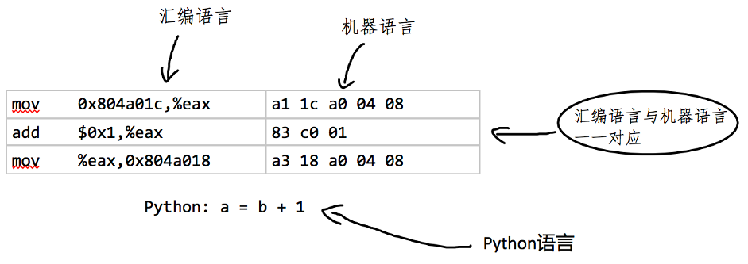
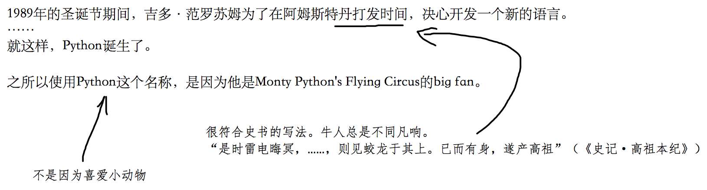

# 第1章 开始自学

>自学并不是什么神秘的东西，一个人一辈子自学的时间总是比在学校学习的时间长，没有老师的时候总是比有老师的时候多。
>——华罗庚


<center>华罗庚</center>

从现在开始，迈出自学Python的第一步。

本章内容主要是为自学Python作准备：认识准备、知识准备和设备准备。首先要认识到自学对个人职业生涯的重要性；然后简要介绍编程语言和程序运行原理，为后续学习Python知识奠定基本的知识准备；最后会完成开发环境的配置，这对部分初学者而言是具有挑战性的，也是自学本章内容的难点。


<center>第1章知识结构</center>

## 1.1 必须自学

自学，是成为一名优秀程序员的唯一途径，注意不是“途径之一”，而是“唯一途径”，舍此无他。

有幸遇到过很多优秀程序员，曾向他们请教了很多有关个人发展的问题，这些青年才俊，毫无例外都谈到了“自学”。用不完全归纳法，可以认为优秀程序都是“自学成才”的，或者至少说具有较强的自学能力。虽然此结论没有得到严格的证明，但它是多年的经验积累——人生经验不同于数学定理，往往不能证明。诚然，如果不认可，亦不能强求。

此外，我也接触了很多试图进入软件开发领域的初学者（多数是大学生或者大学毕业生），总有一部分人希望老师“手把手”地教，希望老师讲解得更细致，希望老师把各种知识点总结好发给他，……，他们说自己是初学者、自己是零基础。但他们忘记了，他们都是成年人，甚至于他们也是大学生或者大学毕业生。

通常而言，程序员的职业生涯不是三年五载就结束了。姑且按照当前某些媒体热炒的“三十五岁”危机来计算——这是无稽之谈，从大学毕业到危机时期，也大约十年。这十年中，软件开发技术相较于在学校所学，肯定会有很大变化——更何况学校所学是否匹配于工作实际，也是值得探讨的；这十年中，软件开发技术相较于职业生涯初期也肯定会有很大变化；这十年中，更可能是“不在学校学习，没有老师教”。那么，程序员应该如何应对这十年的变化？毫无疑问，必须自学！自学各种新知识、新技术，甚至于自学老知识、老技术。

如果这十年，没有自学，别说“三十五岁危机”，二十五岁也不会安全。是自学的十年，所谓“三十五岁”危机，也会迎刃而解。

不论如何，都要自学，这也不仅仅是对程序员而言。

>**自学建议**
>为了能让自学坚持长久，可以将"可视化管理"应用到自学过程中，附录A中提供了一张针对本书内容的自学管理表，读者可以借用它管理自学过程。

## 1.2 编程语言

可以将语言分为两类，一类是自然地随文化演化的语言，称为“自然语言”（Natural language），如汉语、英语、法语等；另一类是根据特定目的、用途，认为创造的语言，称为“人造语言”（或“人工语言”，Constructed language）。编程语言（或“程序设计语言”，Programming language）是用来定义计算机程序的形式语言，属于人造语言。

通常，编程语言可以划分为：

* 机器语言
* 汇编语言
* 高级语言

1.2.1 机器语言

机器语言（英文：machine language）是用二进制代码（一般为0、1）表示的计算机能够直接识别和执行的机器指令集合。如下图所示，就是用机器语言编写的表示"Hello World"的程序，是不是很有挑战性？


机器语言的最大优势是运行速度快，但它的劣势也很明显，比如下面的代码，如果不是非常仔细地分辨，会认为与上面的无异，其实是有区别的。


机器语言对人“不友好”，这是人类所不能忍受的。

另外，机器语言是计算机的设计生产者通过硬件结构赋予计算机的操作功能，所以，不同型号计算机的机器语言会有所差别。这就导致了另外一项不足，机器语言的通用性差。除了极少数专业人员之外，绝大多数程序员不需要学习机器语言。

1.2.2 汇编语言

汇编语言（英文：assembly language）是二进制代码的文本形式，即使用便于记忆的书写格式表达机器语言指令。如下图所示，是一段在X86的计算机、64位Linux操作系统运行的汇编语言程序。读者不需要理解这段程序，但从中可以看出来，相对于机器语言，对人的友好度已经有了很大提高。


<center>汇编语言示例</center>


但是，汇编语言依然非常靠近机器语言，用汇编语言“告诉”计算机干什么和计算机所干的之间（几乎）是一一对应的，即汇编语言的一条指令对应着一条机器指令。并且每种汇编语言专用于某种计算机系统，不能在不同系统之间移植。

现在，汇编语言依然有用武之地，因为它有一些独特之处，比如目标程序占用内存少、运行效率高等——当然，这些优点的代价就是开发效率低。

1.2.3 高级语言

“高级编程语言”（或“高级语言”，High-level programming language）是面向人的语言——It is for Humans，这不是某一种语言，而是一类语言。一般我们把“机器语言”和“汇编语言”归类为“低级语言”，除此之外的都称为高级语言（如下图所示）


高级语言之“高级”的原因是使用了大量的英语单词，对开发者而言，更容易理解。最重要的，高级语言摆脱了“硬件的拖累”，不需要与机器语言的指令对应，借助操作系统实现了对硬件的抽象。即使开发者“对硬件一窍不通”，也能利用高级语言开发程序。



<center>汇编语言与高级语言比较</center>

20世纪50年代，Fortran语言发明，这是一种至今还在使用的高级语言，自此之后，人类已经发明了好多种高级语言，它们各有千秋，而且这种不断产生新的编程语言的趋势还将持续下去。当然，也会有另外一些编程语言成为历史。在维基百科上专门有一个词条，列出了当前已知的编程语言（[https://en.wikipedia.org/wiki/List_of_programming_languages](https://en.wikipedia.org/wiki/List_of_programming_languages?fileGuid=XKXg6qp9q36yXqPv)）特别建议读者打开这个页面，浏览一番，从而体会编程语言的多样性。

>**自学建议**
>互联网是最大的参考资料库，为自学提供了应有尽有的资料。在自学过程中如果遇到不理解的概念、术语、名词等，都可以在互联网上找到相关解释说明。在搜索的时候，请恰当使用搜索引擎，不同的搜索引擎所提供的搜索服务有所偏差。在阅读本书的过程中，如果遇到了疑问，建议首先在网上搜索。
## 1.3 程序

计算机程序（Computer Program），或称为程序（Program），是一组指示计算机或其他具有信息处理能力的设备的每一步操作的指令集合。通常，程序是由某种编程语言编写而成。

程序编写出来之后，毫无疑问要在计算机上执行——俗称”跑“（run）起来，要达到这个目的，必须要让计算机能够“认识”程序，知道它让计算干什么。

如果程序是用机器语言编写的，那么计算机就能够直接“认识”了，就如同跟洋人说“No"——洋话对洋人而言不需要翻译（鲁迅《阿Q正传》：他却总说道No!——这是洋话，你们不懂的。）。否则，当然需要翻译，比如说”不“，洋人就听不懂了。

程序亦然。

如果程序是用Python、C等某种语言编写的，要让计算机“认识”，必须先将程序“翻译”成机器语言。目前，我们所使用的“翻译”方式有两种：编译或者解释。

先了解几个常用术语：

- 源代码：用某种高级语言写的程序就称为“源代码”。

- 源文件：保存源代码的文件称为源文件。

- 本地代码：计算机（具体就是CPU）能直接执行的机器语言的程序。用任何编程语言编写的源代码，最后都要翻译为本地代码。

再简介刚才提到的两种“翻译”方式：

**（1）编译**

用编译器（Complier，也是一种程序）将源代码全部翻译为本地代码的过程，就是“编译”。所谓编译器，则是执行这一过程的程序。

某些编程语言写的程序需要编译之后才能执行，这类语言常称为“编译型语言”，比如：C。

**（2）解释**

有的程序，不需要编译，在运行它的时候，直接用解释器（Interpreter，也是一种程序）对源代码进行解释和执行。

同样，用于编写这类程序的编程语言，称为“解释型语言”，比如BASIC等。

> **自学建议**
>
> 我在写这本书的时候，会假设读者具有某些前置知识和技能——其实不仅仅是我这样写书，可以说所有的书籍都如此。但是，具体到某个读者，并不一定完全符合假设，这就造成个人阅读中的一些困难，比如都某个内容感觉理解不透彻等。有的读者遇到这种情况，就开始发火乱喷，甚至于我看到过谩骂之言。这种做法有两大坏处，其一气大伤身，其二自己依然没有进步。比较可取的方法是充分利用互联网，解决自己不甚理解之处。这就是此处自学建议的“专题学习”，即把自己不很理解的内容作为一个专题项目，利用搜索引擎和其他网站，搜索相关资料，并根据各种不同来源、不同解释进行汇总，最终形成对内容的综述性文章，并对此文章认真阅读（如果你能把这样的文章发给我，我会将其发布到本书的在线扩展资料中，亦不胜感感激）。

## 1.4 Python语言

在1.2节中已经简要介绍了编程语言，读者借用本书将要自学的是一种名为Python的高级编程语言，至于为什么要学习这种编程语言，则是仁者见仁智者见智。既然你已经阅读到这里了，自己一定会有某种观点，哪怕就是道听途说“Python语言好”，也是一个学习理由。更何况，从当前流行的编程语言趋势来看，Python语言也日益成为“大众编程语言”。一种“已过而立之年”的编程语言，缘何有如此魅力？ 还要从“初心”开始谈起。

Python语言的发明人是吉多·范罗苏姆（Guido van Rossum）。


<center>Guido van Rossum<br>（源自：https://zh.wikipedia.org/wiki/Python）</center>

 关于他发明Python语言的过程有很多传奇地描写，下图是从“维基百科”的中文词条“Python”截取的一段，并且我做了一点点笔记，放松一下开始学习前的紧张心情。或许在“维基百科”英文词条（https://en.wikipedia.org/wiki/Python_(programming_language)）中，能看到比较令人信服的描述。



<center>Python诞生的故事节选</center>

不论吉多的发明过程被描述的多么神奇，Python语言终究诞生了，它的主要特点和“初心”还被总结为《Zen of Python》（中文翻译为《Python之禅》），下面列出英文和中文两个版本（中文翻译来自“维基百科”的“Python之禅”词条），读者可以对照阅读，从中初步了解Python语言的特点。在后续的学习过程中，读者还可以将所学Python语言知识与此处的诗句对照，感悟凝练词语中所蕴含的深刻含义。

| 英文版                                                       | 中文版                                                       |
| ------------------------------------------------------------ | ------------------------------------------------------------ |
| Beautiful is better than ugly.<br/>Explicit is better than implicit.<br/>Simple is better than complex.<br/>Complex is better than complicated.<br/>Flat is better than nested.<br/>Sparse is better than dense.<br/>Readability counts.<br/>Special cases aren't special enough to break the rules.<br/>Although practicality beats purity.<br/>Errors should never pass silently.<br/>Unless explicitly silenced.<br/>In the face of ambiguity, refuse the temptation to guess.<br/>There should be one-- and preferably only one --obvious way to do it.<br/>Although that way may not be obvious at first unless you're Dutch.<br/>Now is better than never.<br/>Although never is often better than *right* now.<br/>If the implementation is hard to explain, it's a bad idea.<br/>If the implementation is easy to explain, it may be a good idea.<br/>Namespaces are one honking great idea -- let's do more of those! | 优美优于丑陋，<br/>明瞭优于隐晦；<br/>简单优于复杂，<br/>复杂优于凌乱，<br/>扁平优于嵌套，<br/>稀疏优于稠密，<br/>可读性很重要！<br/>即使实用比纯粹更优，<br/>特例亦不可违背原则。<br/>错误绝不能悄悄忽略，<br/>除非它明确需要如此。<br/>面对不确定性，拒绝妄加猜测。<br/>任何问题应有一种，且最好只有一种，<br/>显而易见的解决方法。<br/>尽管这方法一开始并非如此直观，除非你是荷兰人。<br/>做优于不做，<br/>然而不假思索还不如不做。<br/>很难解释的，必然是坏方法。<br/>很好解释的，可能是好方法。<br/>命名空间是个绝妙的主意，<br/>我们应好好利用它。 |


现在的Python编程语言，由于遵循着“开源、开放”的原则，已经发展成为一个覆盖诸多领域的开发生态系统，例如在人工智能领域，每个深度学习框架都要发布“Python版”——这是标准配置。

下图是pypi.org网站的首页，这个网站专门用于开发者发布Python第三方库，截止编写这段内容为止，此网站上已经有 298,220 个项目（如图）。毫不夸张地说，此处的第三方库几乎涵盖了常规开发的各个领域——需要开发什么，先来这里搜一下，看看有没有“轮子”。正是有如此庞大的生态系统，才让程序员用Python语言实现了“以人为本，节省开发者时间”的要求。


 

> **自学建议**
>
> 自学，要独立思考，根据书中的内容以及其他资料，形成自己的认识。比如对编程语言的评价，有的人认为能够实现“程序执行速度快”的语言是“应该学的语言”——简称“节省机器时间”。前文中提到了Python语言“节省开发者时间”，那么二者如何选择？或许没有绝对意义上的“二选一”的答案，读者可以有自己的认识，也建议参考一些其他人的观点。当面对具体问题的时候，才有可能思虑周全，提出更合适的方案。
>
> 顺便提醒，不要忘记，最“节省机器时间”的编程语言是机器语言。

 ## 1.5 操作系统

本节的内容，不是全面介绍操作系统的知识，而是提醒读者从开发者的角度认识自己的操作系统——根据我多年的教学经验，这是必须的。

首先要区分硬件设备——这里只讨论比较小的、为个人应用而设计生产的计算机（Personal Computer，简称：PC，也翻译为：电脑，有的资料中亦称为“微机”），或许有的读者执着于要在手机或者其他移动智能终端设备上编写和调试程序，但这不在本书的讨论范围。

就目前常见的计算机而言，其操作系统包括：Windows、macOS、Linux。

### 1.5.1 Windows

Windows操作系统的全称是“Microsoft Windows”，翻译为“视窗操作系统”。这款操作系统可能是在个人计算机上应用最广泛的操作系统（没有之一），一般而言，从市场上购买的某品牌的笔记本计算机或者台式机，亦或自己组装的计算机，都会安装此操作系统。

经过中小学的有关计算机课程的学习，读者一定能够比较熟练地用鼠标在图形化界面上点来点去地完成各种操作。这只是Windows提供的一种操作模式，除此之外，Windows还支持通过命令完成操作，虽然这种操作很不直观，现在也不再“大众化”，但是在编写和调试程序的时候，倒是很方便。因此，学习开发的读者对此也要熟悉。

首先，要打开输入能够输入命令的窗口——俗称“CMD窗口”。以现在主流的版本Windows 10为例，可以有多种方法打开这个窗口。例如：在“开始菜单”中找到“Windows系统”里面的“命令提示符”，如图1-5-01所示：


<center>图1-5-01 开始菜单中的“命令提示符”</center>

用鼠标点击此项，打开类似图1-5-02所示的窗口，观察此时窗口界面中闪动的光标，提示我们可以在这里输入命令。


<center>图1-5-02 命令行输入窗口</center>

再比如使用按下快捷键“Win + R”，如图1-5-03所示：


<center>图1-5-03 快捷键“Win+R”</center>

在弹出的对话框中（如下图所示）输入“cmd”后点击“ok”（或者是“确定”）按钮，也可以呈现“CMD窗口”（如图1-5-02所示）。


<center>图1-5-04 运行“cmd”命令的窗口</center>

打开了“CMD窗口”之后，即可输入命令完成某项操作。

微软公司在推出Windows操作系统之前有一个名为“DOS”的操作系统，曾经在20世纪80、90年代，广泛安装在IBM PC兼容机上，乃至于后来Windows操作系统，也有几个版本至少部分地以DOS操作系统为基础。现在图1-5-02所示的界面中所输入的命令，基本上就继承自DOS操作系统的各种命令，下面的表1-5-01是部分常用的命令。

表1-5-01 几个DOS命令

| 命令 | 说明                                         |
| ---- | -------------------------------------------- |
| MD   | 创建子目录                                   |
| CD   | 改变当前目录，进入到指定的目录               |
| DIR  | 显示指定位置下的目录和文件（默认是当前位置） |
| TREE | 显示目录结构                                 |
| COPY | 复制文件                                     |
| REN  | 文件改名命令                                 |
| DEL  | 刪除文件命令                                 |
| DATE | 查看日期命令                                 |

注意，在Windows中输入命令，不区分大小写。如图1-5-05所示，当输入了“DIR”之后，敲回车，即可显示当前位置下的目录。


<center>图1-5-05 “DIR”命令和结果</center>

由于对Windows命令的操作和说明已经超出了本书的范畴，所以请读者参考下述的“自学建议”，自行进行研究。

> **自学建议**
>
> 利用互联网，搜索“DOS操作系统”等有关内容，了解这种”古老“的操作系统，特别是常用的命令。如果自己所用的计算机是Windows操作系统，按照上述介绍，在“CMD窗口”中练习用命令完成一些基本操作，比如：
>
> - 进入到指定目录
> - 查看目录中的文件

### 1.5.2 Linux


<center>图1-5-06 Linux吉祥物Tux</center>

Linux是一种开源操作系统，它以Unix为基础，发明人是Linus Torvalds（如图1-5-07所示）。这是一位令众多程序员膜拜的、为软件开发做出卓越贡献的开发者，他除了发明Linux操作系统之外，还发明了一种源码管理系统Git，是目前最广泛应用的源码管理工具。


<center>图1-5-07 Linux操作系统的发明人 Linus Torvalds</center>

Linux 被认为是开源软件的典型案例，只要遵循GNU通用公共许可证（GPL），任何个人和机构均可以自由地使用Linux的所有源代码，也可以自由地修改和再发布。由此，就诞生了很多基于 Linux 的操作系统，一般称它们是Linux发行版，比如应用于个人计算机的 Ubuntu 、Linux Mint ，应用于服务器的 Red Hat 、CentOS 等。还有一个知名度很高的移动终端操作系统 Android ，也是基于 Linux 内核。

图1-5-08所示为一种比较常用的 Linux 发行版 Ubuntu（https://ubuntu.com/）的桌面，它同样提供了“所见即所得”的视窗操作——只需要点鼠标，也有很多桌面应用软件供用户选择使用，比如办公套件LibreOffice、浏览器Firefox、图像编辑器GIMP等。可以说，在Windows系统中常用的应用软件，在Linux系统中都有功能雷同对应软件——除了杀毒软件，因为Linux的安全性高和病毒较少，乃至于不需要如同Windows那样再安装专门的杀毒软件。


<center>图1-5-08 Ubuntu桌面</center>

或许在个人计算机上使用Linux操作系统的数量不多——在专业的开发者群体中可能占比更高，但是要论及服务器上运行着的操作系统，Linux则有一统江湖的趋势。对于服务器上运行的操作系统，我们并特别在意它的视觉体验（也有评论文章专注于每一版的Ubuntu桌面图形的不变化，但这不是重点），更关心的是“安全性”、“可靠性”，当然，价格也是必须考虑的——不要忘记，Linux是开源的。另外一项重要因素是围绕Linux已经建立起了非常完善的基于服务器的应用生态系统，这也是开源带来的最大好处。

不论是管理服务器的、还是在个人计算机上跑着Ubuntu的，都是专业人士——本书的读者，将来也有必能成为专业人士。专业选手和业余选手对待操作系统的最大区别是前者以提高生产效率为焦点。又由于专业人士经过了专业训练，于是他们更喜欢用各种命令完成操作——手指不离开键盘，比用鼠标“点来点去”效率高很多——这是多么酷的场景，让很多业余人士和外行“虽不明，但觉厉”。

其实，只要摒弃恐惧心理，经过适当的练习，人人都可以成为专业人士，正所谓“人皆可以为尧舜”。

以Ubuntu为例，通常使用快捷键组合“Ctrl + Al t+ T”，即可打开终端（如图1-5-09所示），然后在终端输入命令，即可完成相应操作。


<center>图1-5-09 Ubuntu的终端</center>

表1-5-02列出了几个常用的Linux命令，建议首先与表1-5-01中的DOS命令对比，了解它们的差异，并对其中部分Linux命令按照“自学建议”中的方法进行练习。

表1-5-02 几个常用的Linux命令

| 命令     | 说明                                         |
| -------- | -------------------------------------------- |
| mkdir    | 创建子目录                                   |
| cd       | 改变当前目录，进入到指定的目录               |
| ls       | 显示指定位置下的目录和文件（默认是当前位置） |
| cp       | 复制文件                                     |
| rm       | 刪除文件命令                                 |
| cat      | 在显示器上查看文件内容                       |
| mv       | 移动文件或目录，还可以对其重命名             |
| find     | 在给定位置按照条件进行搜索                   |
| shutdown | 关闭计算机                                   |

特别提醒，在Linux中，区分命令名称的字母大小写，表1-5-02中所列命令，在实用中都要求小写字母。

> **自学建议**
>
> 如果读者现在用的计算机是Windows操作系统，建议从以下方式中选择一种，在自己的计算机上安装Ubuntu操作系统，并力争将其作为自己开发和学习的主要环境，至少要有所体验。
>
> 1. 卸载Windows操作系统后安装Ubuntu系统，特别是针对“老旧”计算机，运行Windows系统及应用软件，已经“慢吞吞”了，如果按照此方法，立刻会实现“飞一般”的操作。除了卸载原有Windows操作系统之外，还可以在性能较好的计算机上安装双系统，在开机时选择将要使用的操作系统。具体安装方法请参阅Ubuntu官方网站的安装指南（https://ubuntu.com/tutorials/install-ubuntu-desktop#1-overview）或者其他网络资料安装。
> 2. 在计算机上安装虚拟机软件，比如VMware、VirtualBox，然后在虚拟机上安装Ubuntu系统。
> 3. 由于Linux系统对开发者的友好型，Windows 10操作系统已经支持内置的Linux子系统，读者可以参阅相关资料，开启并使用子系统。
>
> 读者若有计划在软件开发这个方向上有所深入，针对计算机的操作行为，就不得不摆脱貌似简单实则低效的用鼠标“点来点去”的操作习惯，改为貌似复杂实则便捷高效的“命令行”。不论是1.5.1节的DOS命令，还是此处介绍的Linux命令，至少要熟悉一种。

### 1.5.3 macOS

macOS是美国苹果公司推出的操作系统（注意，历史上这个操作系统的名称有所变更，2011年及之前称为 Mac OS X，2012年至2015年称 OS X），主要用于其 Macintosh（简称 Mac）系列的个人计算机上。

macOS具有非常友好的视窗操作界面，并且与硬件配合堪称天衣无缝（毕竟是同一家生产的），这赢得了大众的欢迎（只是价格不怎么亲民）。对于开发者而言，图形化操作当然是必须的。除此之外，如前所述，“手指不离开键盘”完成各种操作，则是专业开发者追求的高效行为——节省“程序员时间”才是正道。那么，macOS是否具有类似前面提到过的命令行操作呢？当然有，并且因为macOS是基于Uninx的，它与Linux同宗同源，所以常用的Linux命令都可以用在macOS上。

> **自学建议**
>
> 如果读者现在使用的就是苹果公司生产的个人计算机，比如 MacBook Pro 等，那么就请打开 Launchpad（启动板），找到 Terminal（终端），打开之后，就显示了输入命令的窗口，但这个窗口内的视觉效果不好，所以，多数人更喜欢另外一个名为 iTerm 2的应用（如图1-5-10所示）。


<center>图1-5-10 iTerm 2 窗口</center>

> 如果读者尚未拥有此类计算机，也不用懊恼和羡慕，在认真学习了本书内容之后，特别是充分理解本书所倡导的“自学”，将来一定能够凭借个人能力拥有一台你喜欢的最好的计算机。

## 1.6 Python官方网站

关于Python编程语言最权威的资料当然来自其官方网站，因此，要对该网站有所了解。

网址：python.org

网站首页如图1-6-01所示，先注意观察网站的结构，在最醒目的 logo 之上有一行栏目（称为第一行）：Python、PSF、Docs、PyPI、Jobs、Community，并且用倒三角形的符号指示当前位置是“Python”。在 logo 之下还有一行栏目（称为第二行）：About、Downloads、Documentation、Community、Success Stories、News、Events。


<center>图1-6-01 Python官网首页</center>

下面我们一起浏览第二行栏目中的部分内容，通过这些内容，也可以对Python语言有所了解。

### 1.6.1 About

将鼠标移动到“About”上面，暂不要点击，即可看到图1-6-02所示内容，这里以最简洁的语言概述了Python语言特点：Python is a programming language that lets you work more quickly and integrate your systems more effectively。


<center>图1-6-02 介绍Python</center>

> **自学建议**
>
> 学习编程语言，肯定离不开英语，比如Python官网网站，就是英语为主要语言。作为一名理性的、有追求的读者，肯定不会因为语言问题而对本书或者Python语言给予某种偏激的评论。虽然有的人对于学习和使用英语有某种观点，但是那不应该成为一名具有独立思考能力的开发者应该迎合的。
>
> 就编程语言中的英文而言，通常语法难度不高，或许会有个别单词不认识，凭借翻译工具也能很快理解。就此，向读者提供如下应对方案：
>
> - 建立信心，破除恐惧。阅读本书的读者，至少经历过初中、高中、大学三个阶段的英语学习，甚至于从小学开始，优秀者已经通过大学四级或者六级英语考试。以这些英语基础，读者有足够的能力基础阅读Python语言学习中所遇到的英文资料。之所以你还敢困难，是因为首次接触，对其中的表达规律尚未掌握，对其中的某些词汇还感陌生而已。
> - 水滴石穿，坚持不懈。伴随着本书的学习进程，读者会经常要阅读英文资料，可以用翻译工具帮助理解个别词汇，但是不建议全文翻译，而是要坚持阅读原文。开始可能慢，只要“硬着头皮”坚持，光明的未来就属于你了。
>
> 最后，要郑重声明：本书中会引用很多来自Python官网或者帮助文档的内容，对于这些内容，也不会进行逐字逐句的翻译。若因此引起读者不适，本书作者不对此负责。

如图1-6-02所示，将鼠标滑动到“Applications”，并点击，即打开网址为 https://www.python.org/about/apps/ 的页面，在这个页面中列举了Python语言的一些应用领域，以及Python对该领域所提供的各种支持（专用的模块、库等工具），下面所列各项皆来自此页面，读者从中可以初步了解Python的基本应用。

- Web开发框架，常用的有Django、Flask等。
- 科学计算库，这是Python的重要应用领域，如SciPy、Pandans等。
- 机器学习和深度学习库，比如scikit learn、PyTorch、TensorFlow等。
- 桌面GUI开发框架，如Tkinter、kivy等。
- 嵌入式应用开发框架，如MicroPython。
- ERP应用框架，如Odoo、Tryton。

“About”栏目下的其他菜单项，读者可以自行查阅。

### 1.6.2 Downloads

这个栏目中的内容将在1.7节中使用，所以请读者要认真阅读。

当把鼠标滑动到“Downloads”栏目上（不点击鼠标）时，会自动出现如图1-6-03所示的效果，显示“Download for Mac OS X”及下面的下载按钮和有关说明。但是，若读者亲自操作，所看到的很可能与图示不同，这是因为此处是网站根据访问者所用的操作系统，显示当前可下载的最新的Python版本。图1-6-03所显示的内容，即表示我在编写本书的时候，使用的是 macOS 操作系统（参阅1.5.3节），网站针对此操作系统，在当时提供下载的最新的Python版本是“Python 3.9.4”，只要点击写有“Python 3.9.4”字样的按钮，就可以下载此版本的Python安装程序。也就是说，读者如果按照本书建议进行学习，通过此操作能够下载到与自己所用操作系统相匹配的最新发布的Python安装程序。


<center>图1-6-03 最新的Python安装程序下载</center>

- **All releases**

当把鼠标滑动到“Downlloads”栏目的下拉菜单中的“All releases”，并点击之，会打开网址 https://www.python.org/downloads/ ，这里列出了所有已经发布的各个版本的Python安装程序，图1-6-04即为我在编写本书的时候从此页面上得到的截图，其中显示了当时维护着的Python版本。请读者特别关注 Python 2.7 ，这是Python 2.x 的最高版，已经在2020年元旦停止支持，但是，这并不意味着此版本不可用，在有些项目中可能依然在使用它。

 

<center>图1-6-04 维护着的Python版本</center>

Python的版本可能会成为初学者的困扰，在1.7节会就此有比较完整的阐述。

- **Windows**

如果在图1-6-03所示的下拉菜单中，进入“Windows”，即打开网址 https://www.python.org/downloads/windows/ ，则显示所有针对 Windows 操作系统的各个版本的Python安装程序。图1-6-05是从此网页中获得的部分截图（读者打开此网址时，可能与截图显示的版本不同），其中显示了当前最新发布版本——包含Python 3 和 Python 2 两类。对于 Python 3.9.4 版，在列表中显示了不同的安装程序文件，点击超级链接即可下载。其中的“embeddable package”表示压缩文件；“installer”表示安装程序的可执行文件；“32-bit”和“64-bit”表示适用于不同位操作系统。


<center>图1-6-05 适用于 Windows 的 Python 各版本安装程序</center>

> **自学建议**
>
> 以 Windows 10 为例，右键点击“此电脑”，然后选择“属性”，即可看到图1-6-06所示窗口，从中可以看到：“系统类型”，“64为操作系统，基于 x64 的处理器”。这说明此台计算机中的 Windows 10 即为64位操作系统。


<center>图1-6-06 64位操作系统</center>

> 如果你所用计算机是比较陈旧的，也可能上面运行的操作系统是32位的。所谓32位和64位，表示的是该计算机CPU一次能处理的最大位数。在安装应用程序的时候，要注意区分，以便能最大限度发挥计算机的计算能力。

- **Mac OS X**

使用 macOS 操作系统的读者，自然要从图1-6-03所示的下拉菜单中进入“Mac OS X”项，打开 https://www.python.org/downloads/mac-osx/ 网址，该页面的部分截图如图1-6-07所示（此截图为读者编写本书时所见，与读者所见页面可能有异）。


<center>图1-6-07 适用于 macOS 的 Python 各版本安装程序</center>

如果读者使用的是苹果公司生产的个人计算机，就必须要关注一条信息，2020年11月苹果公司发布了 M1 芯片，并用于 Mac 系列的个人计算机上，这标志着苹果公司已经着手将 CPU 从 Intel 公司的迁移到自行设计的芯片。Python 语言为了适应此变化，在发布的安装程序中，就兼顾了当前的两种 CPU 。以图1-6-07所示的 Python 3.9.4 为例，列表中的

- Download macOS 64-bit Intel installer：对应的是应用于 Intel 公司CPU的安装程序；
- Download macOS 64-bit universal2 installer：对应的是应用于苹果公司自研CPU的安装程序（如图1-6-08所示，即为一款应用了苹果 M1 芯片的 MacBook Pro 计算机的“Finder - About This Mac”截图）。


<center>图1-6-07 使用了苹果 M1 芯片的计算机</center>

- **Source code**

进入图1-6-03所示的“Downloads”的下拉菜单“Source code”项，打开 https://www.python.org/downloads/source/ 网址（图1-6-09为编写本书式页面的部分截图），即可得到各个 Python 版本的源代码下载列表。


<center>图1-6-09 Python 各版本源码</center>

我们要源码有什么用？首先，总听有的朋友说他要阅读“源码”，可以通过这里得到；再者，在“Downloads”的下拉菜单中，我们没有看到针对 Linux 操作系统的安装程序，用 Ubuntu 的读者是不是有点迷惑，难道被区别对待了吗？非也。在1.7节会对此有详细阐述。

对于“Downloads”下拉菜单中的其他项不再一一说明了，读者可以自行了解。

### 1.6.3 Documentation

图1-6-10所示的是鼠标滑动到“Documentation”栏目的显示效果，在其下拉菜单中，对重要的就是“Docs”项，它是本书——也是所有关于Python语言的图书——的唯一权威参考资料，其他各项是为开发者、学习者提供的有关资料，读者可以参考。


<center>图1-6-10 Documentation 栏目及其下拉菜单</center>

在图1-6-10所示的菜单中点击“Docs”，即打开网址 https://www.python.org/doc/ ，可以根据 Python 的版本查看到相应的文档。

> **自学建议**
>
> 有人说学习编程语言，只需要看文档即可。现在读者不妨认真阅读上述显示的 Python 文档，看看它对初学者而言是否友好？我有一个关于文档的类比，请读者参考：编程语言的官方文档相当于《新华字典》，在学习语文这么学科时，主要的学习资料是语文课本，但是要经常查字典。本书以及其他有关 Python 的学习资料，就相当于“语文课本”，在学习过程中要经常翻看“官方文档”——类似查字典。
>
> 诚然，以上学习方式只适合于多数的普通人，少数天才除外——互联网上天才似的人物貌似超过正态分布的比例，请读者注意判断自己的特征。

后面还有其他四个栏目，请读者自行查看，此处不再赘述。

对 Python 官方网站有了基本了解之后，就开始尝试在自己的计算机上配置 Python 开发环境。

## 1.7 安装Python

由上一节对 Python 官方网站的浏览可知，对常用的各种操作系统，Python 语言都有相应的安装程序，也只有在自己的计算机上安装了从官方网站下载的对应安装程序，才能在那台计算机上使用 Python 编程语言编写程序，这就是常说的“配置开发环境”。

### 1.7.1 Python的版本

在浏览1.6.2节有关内容的时候，特别是图1-6-04，显示了 Python 语言目前的两大版本：Python 2 和 Python 3，这两个大版本之间比较明显的差别，并且互不兼容——用 Python 2 编写的程序，无法用 Python 3 直接运行，反之亦然。至于两者的差异到底在哪里？不是本书重点阐述的内容。在学习编程语言上，我们秉承着“喜新厌旧”的原则，因为新版本会相对就版本在语法、性能等方面有所改善——编程语言的发展方向就是对人越来越友好。所以，编程语言无所谓“经典永流传”，而是“长江后浪推前浪，一辈新人胜旧人”。

故，建议读者学习 Python 3 。但是 Python 3 还有那么多小版本呢？那就选择最新发布的。本书演示所用的是 Python3.9.4 ，如果读者使用的是其他小版本——统称为 Python 3.x.y ，也均适用于本书的学习需要。也就是说，只要在 Python 3 这个大版本范畴内，各个小版本之间的差异不很大，对于初学者而言，甚至可以忽略——不可忽略的部分，我会在书中进行提醒。

当读者学成之后，将来工作中如果遇到了 Python 2——处理古老的代码，也是开发者经常要遇到的工作内容，怎么办？不必惶恐，因为那时你已经练就了处理各种难题的能力——必须要按照本书要求学习，解决这个问题不在话下，现在不必杞人忧天。

最后总结，读者应当时候用的 Python 版本是在官方网站所看到的 Python 3 的最新正式发布版本，即执行了1.6.2节中图1-6-03所示的操作后看到的最新发布的 Python 3 版本。如果未来有了 Python 4，则不再适合用于本书学习需要。

> **自学建议**
>
> 从学习的角度看，建议使用最新发布的 Python 版本。但这并不意味着在工程实践中也如此，因为实际的项目所涉及到的问题要比学习场景复杂，比如需要考虑历史遗留的代码；需要考虑其他有关模块、库等所支持的版本；甚至还要考虑团队人员的情况等。

通过1.5节，读者对操作系统有了基本了解，特别是认识了运行在自己的计算机上的操作系统。在1.6节浏览 Python 官方网站的过程中，知道了如何从官方网站下载与指定操作系统相匹配的安装程序。注意，Python 安装程序一定要从官方网站下载，对任何来自于非官方渠道——包括但不限于某些搜索引擎——的安装程序，都要持审慎态度。在前两节的基础上，请读者确定：自己学习 Python 用什么操作系统。这要读者自己选择，别人无法包办代替。然后就根据自己选定的操作系统，选读如下对应的小节——若以下各小节没有针对读者所选定的操作系统，敬请联系本书作者（联系方法见本书前言）。

### 1.7.2 Windows

此处以 Windows 10 作为演示用操作系统，其他型号的 Windows 操作系统与这里演示的过程大同小异。

首先，从 Python 官方网站下载安装程序，如1.6.2节图1-6-05所示，点击图示的下载列表中“Python 3.9.4”下的“Download Windows installer(64-bit)”下载该程序（由于此网站服务器在国外，国内有些地区下载速度可能会稍慢，请耐心等待。若遇到链接超时等情况而下载失败，请自行更换网络多次尝试）。

> **自学建议**
>
> 从网络上下载东西，特别是服务器在国外的，往往由于“网速”问题，致使下载时间太长。对此，请读者要保持平常心，更不要抱怨，因为造成此问题的原因比较复杂，特别是请读者先搜索“网速”的概念，再测一测你本地的网速。
>
> 面对网络连接问题，你需要的不是抱怨，而是想办法解决问题。

下载完成之后，在本地能够看到一个名为 python-3.9.4-amd64.exe 的文件（如果读者下载其它版本的安装程序，同样会显示带有相应版本号的文件），然后开始安装。

1. 双击已经下载的安装文件，显示如图1-7-01所示的窗口，现在就开始安装。

   

   <center>图1-7-01 开始安装</center>

   注意，当看到图1-7-01所示界面时，不要贸然点击“Install Now”，而是要先将下面的复选框“Add Python 3.9 to PATH”选上（如图1-7-02所示），这样就意味着此时安装的 Python 程序会自动增加到系统的环境变量中。

   

   <center>图1-7-02 增选复选框</center>

   然后点击图1-7-02所示的“Customize installation”（自定义安装），进入到下一步。

2. 如图1-7-03所示，是点击“Customize installation”后的显示界面，在这个页面可以自定义安装的项目，一般情况建议选中所有项目，除非读者有特别需要或者有能力后期安装有关项目。

   
   
   <center>图1-7-03 自定义安装项目</center>
   
   然后点击“Next”按钮。
   
3. 承接上一步，进入“Advanced Options”界面（如图1-7-04所示）。

   

   <center>图1-7-04 高级选项</center>

   在此建议读者按照图1-7-05所示选中几个项目，并且要牢记程序的安装位置（可以自行指定，本示例的安装路径是：`C:\Program Files\Python39`）。

   

   <center>图1-7-05 选中的高级选项</center>

   然后点击“Install”按钮。

4. 安装过程大概需要几分钟（如图1-7-06所示），这个过程只需要等待，不用做任何操作。

   

   <center>图1-7-06 安装过程</center>

   如果幸运，会顺顺利利地完成安装过程，并最终出现图1-7-07所示结果：安装成功。然后点击“Close”按钮。

   

   <center>图1-7-07 安装成功</center>

   但是，由于计算机系统的环境复杂性，最终无法得到图1-7-07所示效果，或者安装中途出现某种错误等，都不稀奇，亦不要为此绝望，这些都是正常情况——“古来贤俊多坎坷”，代码人生就是在克服困难中成长。

> **自学建议**
>
> 安装过程中，如果出现了某些错误提示，一定要认真阅读提示内容——有的人不耐心阅读提示内容，而是寄希望于有别人能够帮助自己解决问题，本书读者至少不应该如此。每个自学者首先要有强大的内心，再者要善于应用网络帮助自己解决问题。最基本的方法是根据提示内容，到网络上搜索，参考他人提供的信息，然后自己的动手尝试。
>
> “人非生而知之者，孰能无惑？”，互联网是解决自学者之“惑”的最佳选择，无他。请抛弃“我是初学者，所以我不会”的心理（这与“我弱我有理”、“不跟我玩我就哭”有相通之处）。

5. 不论是一帆风顺，还是历尽千辛万苦，最终安装成功了，就可以在安装目录（前面提示要牢记的目录）中可以看到图1-7-8所示的内容。

   

   <center>图1-7-08 Python39 目录内容</center>

   打开其中的子目录“Scripts”，显示的内容如果是图1-7-09所示的文件列表，说明按照前述安装过程要求，将后面会用到的一个重要工具`pip`已经安装上了，否则，到后续内容的时候还要遇到点麻烦。

   

   <center>图1-7-09 pip 工具文件</center>

   打开图1-7-8中的子目录“Doc”，如图1-7-10所示，此处显示的文件 python394.chm 即为当前所安装的 Python 3.9.4 的文档，其内容与1.6.3节所看到的在线文档相当。

   

   <center>图1-7-10 安装在本地的文档</center>

6. 在说明图1-7-02所示的操作是，特别提醒要将“Add Python 3.9 to PATH”选上，如果那一步中没选，下面有补救机会；如果选了，也建议按照下面的流程了解操作效果。在“此电脑”上单击鼠标右键，选择“属性”，进入图1-7-11所示的界面。

   

   <center>图1-7-11 高级系统设置</center>

   点击图中的“高级系统设置”，进入图1-7-12所示界面，点击其中的“环境变量(N)”按钮，打开图1-7-13所示的界面。

   

   <center>图1-7-12 环境变量</center>

   

   <center>图1-7-13 编辑系统变量的 Path</center>

   在图1-7-13中，选中“系统变量”中的“Path”，并点击“编辑”按钮，显示图1-7-14界面，从中看到已经添加的环境变量“C:\Program Files\Python39\”和“C:\Program Files\Python39\Scripts\”——这就是执行了图1-7-02所示操作的效果，如果没有看到这两个环境变量，可以点击其中的“新建”按钮，将这两个路径添加到环境变量。

   

   <center>图1-7-14 查看和新建环境变量</center>

经过上述操作，自己的计算机中已经配置好了 Python 环境，如果要检查一下是否成功，可以用下面两种方式启动 Python 交互模式——第2章开始会经常使用“Python 交互模式”。

第一种，从“开始”菜单中找到刚刚安装的 Python 程序，如图1-7-15所示，点击其中的“IDLE(Python 3.9 64-bit)”，即可显示图1-7-16所示的界面。


<center>图1-7-15 “开始”菜单中的 Python</center>


<center>图1-7-16 IDLE 的交互模式界面</center>

第二种，按照1.5.1节所述，进入到“CMD窗口”（如图1-5-02所示的界面），不论当前位置在哪个目录，都可以输入“python”，并敲回车键，显示如图1-7-17所示的界面，也意味着进入到了 Python 交互模式中。


<center>图1-7-17 在 CMD 窗口进入交互模式</center> 

### 1.7.3 Linux

在1.5.2节中以 Ubuntu 为例简介了 Linux ，此处继续以此 Linux 的发行版为例，演示如何在它上面安装和运行 Python 。

Ubuntu 操作系统的最大特点是不需要单独安装 Python ，只要此操作系统在计算机上安装好了，Python 开发环境作为默认的配置已经安装好，正所谓“开箱即用”。打开1.5.2节中的图1-5-09所示的终端，直接输入“python3”并回车，显示效果图1-7-18所示，从图示中可以看到 Ubuntu 20.04 中默认支持的 Python 3.8.5 ——此处演示用的操作系统是 Ubuntu 20.04 。如果读者使用的是较早版本的 Ubuntu 操作系统，可能默认支持的是 Python 2 ，只有在使用“python3”指令才能进入到 Python 3 版本的环境，甚至于更早的（那是 Python 3 尚未得到主流支持）仅默认配置了 Python 2 。 


<center>图1-7-18 Ubuntu 默认的 Python</center>

不论所使用的是什么版本的 Ubuntu 操作系统，都可以将其中的 Python 环境进行重新配置，令其版本为 Python 3.9.4（如图1-6-09所示）。诚然，读者也可以不修改默认的 Python 版本，亦不会影响本书的学习。下面演示两种更新 Python 版本的方法，即满足“求新求变”的愿望，也能训练使用 Linux 命令配置开发环境的能力。

**方法1：用`apt`安装**

`apt`的全称是“Advanced Packaging Tool”，是 Linux 系统下的一款安装包管理工具。在 Ubuntu 的终端中（如图1-5-09所示，注意不是图1-7-18所示的 Python 交互模式。在图1-7-18的交互模式中输入`exit()`，并敲回车，就回到了图1-5-09所示的状态）输入如下指令，目的是更新当前系统的软件并安装一个组件 `software-properties-common`。

```
sudo apt update
sudo apt install software-properties-common
```

Ubuntu 自带的软件源的 Python 版本不是我们所要求的——当读者阅读本书的时候，也可能自带软件源的版本已经更新到此处演示的 Python3.9.4 ，但往往此时 Python 官方也发布了更新的版本，如果读者也更新到此最新版本，依然可以参考此方法，只是版本号进行修改。就需要增加一个软件源，下面增加的是名为“deadsnakes”的由第三方维护的软件源（https://launchpad.net/~deadsnakes/+archive/ubuntu/ppa），到编写本书此内容的为止，其 Python 版本已经更新到 Python 3.9.4 。继续在终端输入如下质量，即可为 Ubuntu 增加了一个软件源。

```
sudo add-apt-repository ppa:deadsnakes/ppa
```

在执行上述指令的过程中，会有提示出现，敲击“回车”（“retrun”）键即可。

然后用下面的指令安装我们所需要的 Python 版本。

```
sudo apt install python3.9
```

如图1-7-19所示，是上述指令的执行过程截图。


<center>图1-7-19 Python3.9 安装过程</center>

如果一帆风顺，就意味着 Python 3.9.4 已经在此 Ubuntu 系统上安装好了，按照如图1-7-20所示的方式，可以进入到它的交互模式——注意，如果使用`python`还不能进入到图示的交互模式，这是因为 Ubuntu 的软连接还没有修改。


 <center>图1-7-20 Python3.9.4 的交互模式</center>

**方法2：用源码安装**

打开 Ubuntu 的终端之后，首先要对已有软件进行升级，并安装 Python 环境所需要的依赖项。

```
sudo apt update
sudo apt install build-essential zlib1g-dev libncurses5-dev libgdbm-dev libnss3-dev libssl-dev libreadline-dev libffi-dev libsqlite3-dev wget libbz2-dev
```

然后从1.6.2节的图1-6-09显示的源码列表中下载 Python 源码，下面的指令是从 https://www.python.org/ftp/python/3.9.4/Python-3.9.4.tgz 下载此源码，并保存在当前目录中。

```
wget https://www.python.org/ftp/python/3.9.4/Python-3.9.4.tgz
```

下载完成之后，从下载的压缩包中提取存档文件。

```
tar -xf Python-3.9.4.tgz
```

解压缩之后，当前目录中即出现名为“Python-3.9.4”的子目录，进入此子目录：

```
cd Python-3.9.4
```

然后执行：

```
sudo ./configure --prefix=/usr/python
```

这样就规定了即将安装的 Python 3.9.4 的目录。然后执行：

```
make -j 12
```

开始编译 Python 3.9.4 ，上述命令中的参数`-j`表示并行编译，数字`12`表示允许同时执行的编译命令的数量。这个命令之后，终端会显得非常“繁忙”，并且要耐心地等待一段时间。之后执行：

```
sudo make altinstall
```

完成安装过程。但是，此时的 Python 3.9.4 只能进入到`/usr/python/bin/`目录执行才能有效，为了能够实现在任何地方只要键入命令`python`，就能执行 Python 3.9.4 ，还必须重新设置软连接。

```
sudo ln -s /usr/python/bin/python3.9 /usr/bin/python
sudo ln -s /usr/python/bin/pip3.9 /usr/bin/pip
```

这也是解决图1-7-20所示问题的方法。此时，不论在什么位置，只要执行`python`，即可启动 Python3.9.4（如图1-7-21所示）。


<center>图1-7-21 在 Ubuntu 中启用 Python 3.9.4</center>

> **自学建议**
>
> 在1.5.2节介绍 Linux 系统的时候，特别推荐读者对其要有所了解。从上面的安装过程，读者应该初步体会到，通常在 Linux 系统中安装软件的途径不止一种，这样就为解决问题提供了多种通道，从而受到专业人员的青睐。特别是全程用命令完成所有操作，不用鼠标“点来点去”，是不是更增加了一些“科技感”和“神秘感”？不管怎样，这是非常值得学习和使用的操作系统，更何况，当你换台 MacBook Pro 的时候，还能够平滑迁移，而不用像有的人那样非要在苹果计算机上跑着 Windows 系统才能工作。

### 1.7.4 macOS

根据1.6.2节的内容可知，Python 官方网站提供了针对 macOS 的安装程序（如图1-6-07所示）——特别提醒，下载安装程序之前要知道本地计算机所安装的是 Intel 还是苹果的芯片。

下载了安装程序之后，安装方法与安装其他应用类似。双击安装文件（本示例是“python-3.9.4-macosx10.9.pkg”），显示图1-7-22所示窗口，点击“Continue”按钮开始安装。


<center>图1-7-22 开始安装 Python</center>

随后就是继续“Continue”，直到最后安装成功（如图1-7-24所示）——如果遇到异常现象而未能正常安装，请参阅1.7.2节的“自学建议”。


 <center>图1-7-23 正在安装</center>


<center>图1-7-24 安装成功</center>

打开 Launchpad（启动板），会看到如图1-7-25所示的 IDLE 应用，点击它，即可进入与图1-7-16雷同的界面。


<center>图1-7-25 IDLE</center>

当然，通常专业人员很少使用上面所说的方法，一般是打开终端——常用的是 iTerm-2 ，输入命令 `python`启动其交互模式（如图1-7-26所示）


<center>图1-7-26 在 iTerm-2 中进入交互模式</center> 

至此，不论读者使用任何操作系统，都应该已经安装好 Python 编程语言的最基本开发环境了——这里没有介绍移动终端如何配置此环境，至少到本书编写之时，移动终端尚不是作为软件开发的主流设备。那么，是不是就可以开始学习编写程序了呢？可以了。有的资料就是基于前面所介绍的 IDLE 面向初学者讲授的。但是，我不准备那样做，因为有志于自学的读者将来必会鹏程万里，那么起飞的装备就不能是“玩具”的，而是要专业的。

## 1.8 IDE简介

所谓 IDE ，全称是 Integrated Development Environment ，或者 Integration Design Environment、Integration Debugging Environment ，中文全称是“集成开发环境”。一般来讲，它跟开发语言无关。参考“维基百科”的“集成开发环境”词条，对 IDE 可以如此解释：集成开发环境（IDE）是一种软件应用程序，为开发者提供软件开发所需的代码编写、自动化构建和调试等功能。

很早的编程语言是不需要用 IDE 开发的，因为那时是通过打孔卡给计算机编程的（如图1-8-01所示）。


<center>图1-8-01 IBM的80列标准打孔卡<br>图片源自“维基百科”的“打孔卡”词条</center>

1964年发明的 BASIC 编程语言是第一个有 IDE 的编程语言，只是那时的 IDE 是命令行界面（Command-Line Interface，CLI），类似的 IDE 现在仍然存在，比如 Vim 和 Emacs 。如今流行的 IDE 多是图形用户界面（Graphical User Interface，GUI），比如 Visual Studio Code、Eclipse 等。

一款适合的 IDE 能够提升开发者的生产力，将开发工作的各个环节密切地整合起来，例如编辑代码同时检查语法错误、代码自动补全；将源码管理工具（比如 Git ）融入到 IDE 等。

不同的开发者有不同的偏好，不同的项目有不同的需要，因此，一般而言没有哪一个 IDE 能够“一统江湖”，尽管有的 IDE 号称“普遍适用于”各种场景，也只能是在某个领域或者文化范围中的应用比例相对较高罢了。

> **自学建议**
>
> 面对多种多样的 IDE ，初学者容易迷茫。典型表现：
>
> - 有的人会在搜索引擎上搜索，发现前几个链接（或者前几页链接中）多数是某款 IDE ，于是就认定它是“好的”。前面已经说明，IDEs 各有千秋，开发者们也各有所爱。
> - 有的人会在 IDE 的各种配置上耗费很多时间，看到网上任何新奇的功能都想在自己的 IDE 上实现。这种好奇心和研究精神固然可贵，但应明确，IDE 终究只是写代码的工具，不能代替代码本身。阅读本书，还是要聚焦于编程语言，在拥有了基础功能之后，如果暂时不能顺利地将其他扩展功能实现，也无妨，可以先搁置“困难”，以后会有能力解决。现在的主要精力应该放在学习编程语言上——注意，本书不是《IDE 完全自学手册》。

前面对 IDE 的描述并非是严格定义，或者说现在很难用一个严谨的标准来判定某款编辑代码的软件程序是或者不是 IDE，也没有必要为此而争论——除非要做一个名词概念的“科研课题”。所以，本节介绍所介绍的几种可以用来编写代码的应用程序，并不是所有人都认为是 IDE ，但作者没有兴趣对此进行严格的辨析，读者如果认为将它们放在“IDE”之下不适合，就权当是介绍几个与编程有关的工具软件吧。并且，因才疏学浅，也只能介绍几个稍微了解的，仅供读者参考。至于读者选择什么作为自己写程序的 IDE ，应由读者个人决定——此处不要埋怨我不负责任，其中的缘由前面已经解释过了。

### 1.8.1 Vim

Vim 是一个很先进的文本编辑器，它是从另外一个名为 vi（visual 的不正规缩写）文本编辑器发展而来，最初的作者是布拉姆·米勒（Bram Moolenaar），1991年11月份发布了初始版本——此时 Vim 是 Vi IMitation 的简称。后来，Vim 被移植到 UNIX 和 MS-DOS 上——其全称又变成了 Vi IMproved 。自此之后，Vim 就跟 UNIX 形影不离，乃至于此后发展出来的 Linux 上，Vim 也是标配的文本编辑器。

随着时代的发展，Vim 也在不断增加新的功能，比如 Vim 4.0 开始实现 GUI ，Vim 5.0 实现了语法高亮，Vim 6.0 增加了代码折叠、分割视窗等，Vim 7.0 有了拼写检查、代码自动补全，编写本书时的最新版 Vim 8.2 ，有了更丰富的插件，并且在依然保持“小巧”的情况下，越来越向 Emacs 靠近——下一节介绍，并且 Vim 8.x 已经“现代化”了（如图1-8-02所示）。


<center>图1-8-02 Vim 8.0 界面</center>

Vim 很受 Python 开发者欢迎——更准确地说是早期的 Python 开发者，此间原因我没有进行探讨，读者可以分析。

如果要使用 Vim ，可以到其官方网站 vim.org 下载与操作系统匹配的安装程序（如图1-8-03所示）。


<center>图1-8-03 Vim 下载界面部分截图</center>

在 Vim 官方网站的首页，有一幅有意思的漫画，此处摘抄下来（如图1-8-04所示）。


<center>图1-8-04 关于 Vim 漫画</center>

漫画中，第一幅图就指出 Emacs 虽然功能强悍，但是“太重了”——下节详述；第二幅图则指出 Vi 是一个奇怪的家伙——不符合人体工学的要求；最好的就是 Vim ：短小精悍，还免费。

在开发者中，也流传着很多关于 Vim 和 Emacs 逸闻趣事。

### 1.8.2 Emacs

严格地说，Emacs 不是一个编辑器，而是一个编辑器家族。它自诞生以来，演化出了众多分支，比如 GNU Emacs、XEmacs，而且在这两个分支基础上还有更多的变种。

 Emacs 的拥趸常说它“像个操作系统”，这是因为 Emacs 除了具有文本编辑和其他编程常用的功能之外，还有（以下所列仅仅是部分，内容参考“维基百科”的“Emacs”词条）：

- 收发电子邮件、新闻组

- 登录远程主机

- 访问 Twitter

- 编辑电子表格

- 模拟其他编辑器，如 vi、WordStar、EDT、TPU 等

- 编辑维基百科

- 计算器

- 记笔记、日记

- 管理日程

- 浏览网站

等等。当然，每个功能都对应着相应的插件。通过此列表，就可以理解图1-8-03中第一幅的含义了。Emacs “像个操作系统”，的确“太重了”。但是，这并不能挡住拥趸们的狂热，冒昧揣测，或许是出身高贵——1970年诞生于 MIT 人工智能实验室。读者如果要体验 Emacs 的强悍，可以到官方网站 https://www.gnu.org/software/emacs/ 下载最新版本（如图1-8-05所示）


<center>图1-8-05 Emacs 下载页面部分截图</center>

已经了解 Vim 和 Emacs ，应该如何选用？不要着急做出决策，再看一个令人不寒而栗的“学习曲线图”。图1-8-06是网络上流传的这两款编辑器的学习曲线图对比：

- Vim ，起步就是山顶，但是后面一马平川。这意味着只要入门，以后轻松——但入门的门槛高。
- Emacs ，可以“零基础”起步，但要不停地“自我内卷”——用到老，学到老。


<center>图1-8-06 学习曲线对比</center>

所以，江湖上流传着这样说法：Vim 是“编辑器之神”——精悍、高效，Linux 必备；Emacs 是“神的编辑器”——只有“神”才能熟练应用所有功能。

对于这两款编辑器，如果读者望而生畏，也不为过。是否尝试，请自己决断。

> **自学建议**
>
> 在中学语文课本中，有一篇王安石的散文《游褒禅山记》，抄录其中的部分内容：
>
> *夫夷以近，则游者众；险以远，则至者少。而世之奇伟、瑰怪，非常之观，常在于险远，而人之所罕至焉，故非有志者不能至也。有志矣，不随以止也，然力不足者，亦不能至也。有志与力，而又不随以怠，至于幽暗昏惑而无物以相之，亦不能至也。然力足以至焉，于人为可讥，而在己为有悔；尽吾志也而不能至者，可以无悔矣，其孰能讥之乎？此余之所得也！*

### 1.8.3 其他

除了 Vim 和 Emacs 之外的代码编辑器，都归类到本节，也有的资料把它们才归类为真正的或狭义的 IDE  。这类 IDE 都是 GUI 类型，并且基本操作方法雷同——通常“鼠标+菜单”能完成所有操作。

**1. Visual Studio Code**

Visual Studio Code（简称：VS Code）是微软出品的免费代码编辑器，默认支持 JavaScript、TypeScript、CSS和HTML，通过下载扩展插件支持 Python、C/C++、Java 等多种编程语言，还具有语法高亮、代码自动补全、代码折叠等常用功能。

VS Code的官方网站是：https://code.visualstudio.com/ ，可以根据自己的操作系统下载相应的安装程序，图1-8-07所示的是其编辑界面。


<center>图1-8-07 VS Code 界面</center>

VS Code 的诱人之处在于任何人都可以开发扩展，并且背靠微软的大数，颇受开发者所欢迎（2019年 Stack Overflow 调查显示，在87317的受访者中有50.7%的声称正在使用 VS Code），如果读者在安装了 VS Code 之后，可以在 https://marketplace.visualstudio.com/VSCode 查看所需扩展，或者在 VS Code 内部进行搜索，如图1-8-08所示，确认本地计算机已经连接到国际互联网后，根据自己的需要，点击“Install”按钮即可安装该项。


<center>图1-8-08 搜索 Python 语言的扩展<br>第一项是作者的 VS Code 中已经安装的扩展</center>

**2. PyCharm**

在介绍 PyCharm 之前，要先了解 JetBrains 公司——一家捷克软件公司。特别声明：本书作者和出版社与此公司无任何利益关系——生产的面向开发者的工具：

- IntelliJ IDEA：Java 语言的 IDE；
- GoLand：Go 语言的 IDE；
- AppCode：Swfit 和 Objective-C 的 IDE；
- RubyMine：Ruby 的 IDE；
- PyCharm：Python 的 IDE；
- ……

PyCharm 是 JetBrains 公司开发的主要用于 Python 语言开发的 IDE，它具有 Windows、macOS和Linux 版本，并且发行有社区版和专业版。常规 IDE 的功能，如果代码分析、程序调试等 PyCharm 都具有，此外还特别对 Django、Flask 等常用的 Python 网络开发框架给予支持。

PyCharm 官方网站是 https://www.jetbrains.com/pycharm/ ，读者可以根据自己的需要至此下载。

> **自学建议**
>
> 由于本地计算机的操作系统经常会安装、卸载一些软件，难免会再安装另外软件程序时会出现一些异常，例如曾经有读者反馈，在 Windows 系统中安装 PyCharm 时出现异常。对此，可以将异常内容放到搜索引擎中，查找该异常的产生原因，并参考网络上给出的解决方案，尝试解决。

**3. Jupyter**

很多人并不将 Jupyter 视为 IDE，特别是做软件开发工作的程序员，他们往往依据 Eclipse（一款 IDE 软件） 或 VS Code 等来判断别人家是不是 IDE，未免狭隘。须知，在如今如火如荼的数据科学领域，Jupyter 是最受欢迎的代码编辑工具——从狭义的角度讲，可以加上“之一”

Jupyter 是一个基于 Web 的交互式计算环境，当创建一个 Jupyter Notebook 文档（简称： Notebook，以`.ipynb`为扩展名）后，即可在其中编写程序代码，并基于浏览器运行和返回运行结果。

目前，Jupyter 官方网站 https://jupyter.org/ 提供针对各种常用操作系统的安装程序，以及对应的安装方法、使用文档等。图1-8-09所示为已经运行并创建了Jupyter Notebook文档后的效果。


<center>图1-8-09 Jupyter Notebook 截图</center>

如图1-8-09所示，在 Notebook 中，每个单元格内可以进行文本编辑，比如编写 Markdown 格式的文本、编写 Python 代码等。

在本书中，不会使用 Jupyter 作为代码编辑工具，如果读者想深入了解其应用，可以参阅拙作《跟老齐学Python：数据分析》（电子工业出版社出版）。

**4. Anaconda**

Anaconda 是另外一款在数据科学、机器学习中常用的软件程序，其官方网站是 https://www.anaconda.com/ ，关于它的详细内容，读者可以自行浏览网页，此处不进行介绍，因为后面本书不使用它。

> **自学建议**
>
> 程序员们很愿意和很容易就“世界上最好的编程语言”而争论，之所以如此，其一是因为此问题没有标准答案，人人都可以理直气壮地发表见解。其二是因为“对某种编程语言的认识”和“工作实践中的应用”，两者相互作用，进而强化了认知，甚至出现了偏执。
>
> 读者怎么看待？——我说的不是谁是“世界上最好的编程语言”。
>
> 关于编程语言的问题，参阅1.2节——想起一个成语：一叶障目，不见泰山。

