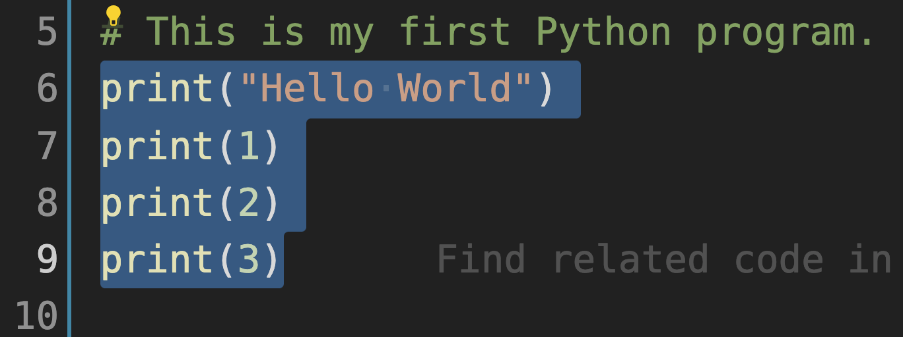

# 第2章 第一行代码

> 昨夜西风凋碧树，独上高楼，望尽天涯路。
>
> ——晏殊

经过上一章的自学，已经为编写代码做好了准备。现在即将开启编程的生涯，尽管“路漫漫其修远兮”，凭着内心对它的爱，一路走来，也无风雨也无晴。

## 2.1 Hello World

如果哪一本讲解编程语言、特别是面向初学者的书，不是从打印“ Hello World ”开始，可以说它忘记了“初心”。自从1978年出版的经典名著《The C Programming Language》开始（如图2-1-1所示），学习编程语言的第一行代码就是打印“ Hello World ”，这已经成为代代相传的光荣传统。


<center>图2-1-1 The C Programming Language</center>

### 2.1.1 在交互模式中打印

根据第1章1.7节所学技能，在本地计算机启动 **Python 交互模式**（ Interactive Mode ），如图2-1-2所示，出现 `>>>` 提示符，即为 Python 交互模式（请区别于 Windows 的 CMD 窗口 或者 Linux 和 macOS 的终端中所显示的命令行，参阅第1章1.5节）。


<center>图2-1-2 启动 Python 交互模式</center>

然后在光标所在位置，输入如下内容——请读者先阅读此内容以及对输入操作的解释，而后依法操作。

```python
>>> print("Hello World")
```

- 一定要将输入法切换为英文——牢记：编程语言中的任何符号都是在英文状态下输入的。
- 先输入 `print` ，它是一个 Python 内置函数——注意不要出现拼写错误，貌似多余的提醒，但经验表明很多初学者对拼写错误浑然不知，还会以“我就按照你书上的内容敲的，为什么会报错？！”来诘难。
- 然后在英文状态下——重要的要反复强调——输入圆括号 `( )` 。注意，圆括号 `( )` 与 `print` 之间没有空格——编程中的空格不能随便用，它是一个有意义的字符。因为所输入的圆括号是成对出现的，为了避免丢三落四，可以在输入了左边的 `(` 之后，立即就把右半边的 `)` 也输入。
- 圆括号里面的内容 `"Hello World"` 是用英文的一对双引号——关键词：“英文”、“一对”、“双引号”——包裹着两个单词。一般的输入流程是先写上英文的一对双引号 `""` ，然后将光标移动到两个引号之间，写上两个单词 `Hello World` ，此时两个单词之间的空格是单词与单词之间的分割—— `"Hello World"` 是一个字符串（参阅第4章4.2节）。
- 最后敲回车键，意味着将输入的内容提交给 Python 解释器，Python 解释器接收到这条指令之后，在当前行的下面呈现执行结果，如图2-1-3所示。


<center>图2-1-3 返回 Hello World</center>

> **自学建议**
>
> 用自然语言书写，如果行文中有错误，读者有可能根据上下文“猜到”作者的意图，比如本书中如果你看到“计酸机”，就会猜到本应是“计算机”，因为用汉语拼音输入法，误写为“计酸机”了。但是，用编程语言写程序，“读者”是计算机，如果将 `print` 拼写成 `pirnt` ，它不会推测出“作者”本意写的是 `print` 。
>
> 所以，在编写程序的时候一定要非常仔细，每一个通过键盘输入的字符，都会对程序产生影响。

若从交互模式退回到命令行状态，可以输入 `exit()` 函数，如图2-1-4所示——请注意区分两种状态：命令行和交互模式。


<center>图2-1-4 退出“交互模式”，返回到命令行</center>

### 2.1.2 在程序文件中打印

现在要利用第1章1.8节自学的技能，打开所选定的 IDE，并创建一个文件，将其命名为 `hello.py` ，这是一个 Python 程序文件。特别提醒：文件名用数字，如`1.py`，不是好习惯。如图2-1-5所示，用 VS Code 创建了此文件。


<center>图2-1-5 创建文件</center>

然后在文件中输入与2.1.1节在交互模式下所输入的同样内容：

```
print("Hello World")
```

其效果如图2-1-6所示，并保存此文件。


<center>图2-1-6 输入代码后的文件</center>

如此即编写好了一个 Python 程序的文件，下面就要让此程序运行起来。以下两种运行或调试程序的方法，读者可任选。

**方法1：利用 IDE 调试**

如图2-1-7所示，点击 VS Code 的菜单项中的“ Run ”，在下拉菜单选项中点击“ Start Debugging ”。


<center>图2-1-7 选择 Strat Debugging 项</center>

随即可以看到图2-1-8所示窗口，此处应该选择“ Python File ”项。


<center>图2-1-8 选择 Python File 项</center>

之后就会自动运行 `hello.py` 文件，其效果如图2-1-9所示，并在 VS Code 的 TERMINAL（终端）显示运行结果——打印出了“ Hello World ”字样。


<center>图2-1-9 程序运行结果</center>

如果读者使用的是其他 IDE，也有类似的操作，甚至于执行调试命令的快捷键（F5）都是一样的。

**方法2：利用命令行运行**

进入到命令行状态——注意不是交互模式，请参阅2.1.1节中的说明（如果用 Windows 操作系统，就要打开 CMD 窗口），然后进入到保存 `hello.py` 文件的目录（如果不进入该目录，应在文件名之前写明路径），如图2-1-10所示（提示：图示中的命令`ls`不是 Windows 的指令，请读者知悉）。


<center>图2-1-10 程序文件所在目录</center>

在图2-1-10所示状态，输入如下指令：

```
python hello.py
```

即可运行 `hello.py` 文件，其效果如图2-1-11所示，显示了运行效果——打印出“Hello World”字样。


<center>图2-1-11 运行 Python 程序文件</center>

> **自学建议**
>
> Debugging 或 Debug，翻译为“调试”，其目的是找出程序中的错误，进而对错误进行定位。而后研究产生错误的原因，提出解决方法。对于行数少的程序而言，用“观察法”即可轻易地确定错误的位置，但是，如果行数多就没那么简单了，所以，一般的 IDE 为了帮助开发者更容易地“找 bug ”，提供了一些专门针对 Debugging 的配置，例如下面的链接，就是 VS Code 关于 Debugging 的配置方法：https://code.visualstudio.com/docs/editor/debugging 。如果读者使用其他 IDE，亦有类似的配置方式。第10章10.4节会对调试程序的方法给予适当介绍，但不会兼顾各类 IDE 的调试工具。

### 2.1.3 解释器

自学了第1章的1.2节和1.3节后，已经知道计算机能“认识”的是机器语言，2.1.2节所编写的 `hello.py` 程序，是用高级语言编写而成，计算机不能直接“认识”，为此要经过“翻译”过程。对于 Python 程序而言，用于“翻译”的叫做 Python **解释器**（ Interpreter ）。目前常见的 Python 解释器包括：CPython、JPython、IPython、PyPy、IronPython 五个版本。当读者按照第1章1.4节所述，在本地计算机配置好了 Python 开发环境之后（参阅第1章1.7节），就已经将最常用的一个解释器 CPython 安装好了。CPython  是使用 C语言开发的 Python 解释器，也是标准的 Python 解释器，是使用最广泛的 Python 解释器。

解释器执行程序的方法有三种：

1. 直接执行程序；
2. 将高级语言编写的程序转化为字节码（ Bytecode ），并执行字节码；
3. 用解释器包含的编译器对程序进行编译，并执行编译后的程序。

Python 语言的解释器采用的是第2种方法，如2.1.2节中所编写的 `hello.py` 文件，不论通过 IDE 还是在命令行中执行 `python hello.py` ，Python 解释器都会将源代码转化为字节码，生成扩展名为`.pyc`的文件，此即为字节码文件，然后解释器执行字节码。

但是，如果按照图2-1-11的方式执行了该 Python 程序之后，并没有在当前目录中看到 `.pyc` 类型的字节码文件。这是因为用 `python hello.py` 的方式运行此程序，`.pyc` 文件运行之后并没有保存在硬盘中。需要换一种执行程序的方式。

```
qiwsir@qiwsirs-MBP codes % ls
hello.py
```

当前目录下只有一个 Python 文件 `hello.py` ，再执行：

```
qiwsir@qiwsirs-MBP codes % python -m py_compile hello.py
```

此指令的作用就是要生成 `hello.py` 对应的 `.pyc` 文件，并保存到硬盘中。

```
qiwsir@qiwsirs-MBP codes % ls
__pycache__	hello.py
```

比之前多了一个目录`__pycache__`，进入到此目录中。

```
qiwsir@qiwsirs-MBP codes % cd __pycache__
qiwsir@qiwsirs-MBP __pycache__ % ls
hello.cpython-39.pyc
```

这里有一个 `hello.cpython-39.pyc` 文件，就是前面所说的由 Python 解释器生成的字节码文件。

```
qiwsir@qiwsirs-MBP __pycache__ % python hello.cpython-39.pyc
Hello World
```

再执行这个字节码文件，打印出了“ Hello World ”字样，与图2-1-11的运行效果相同。

下面做一个有意思的探索。如果将 `hello.py` 中增加一行，其完整代码是：

```python
print("Hello World")
print("Life is short. You need Python.")
```

保存文件后，如果执行`python hello.py`，会打印出什么？先猜，后操作，看结果：

```shell
qiwsir@qiwsirs-MacBook-Pro codes % python hello.py
Hello World
Life is short. You need Python.
```

此结果当然不会出乎意料。

再执行那个`.pyc`文件，会是什么结果？

```shell
qiwsir@qiwsirs-MBP __pycache__ % python hello.cpython-39.pyc
Hello World
```

还是老样子。为什么？

虽然刚才修改了 `hello.py` 文件，在执行 `python hello.py` 的时候，肯定会生成新的 `.pyc` 文件，但是该文件并没有保存在硬盘中，现在所看到的 `hello.cpython-39.pyc` 还是未修改 `hello.py` 时生成的，故执行结果仍同以往。

再走一遍前面的流程，生成新的 `.pyc` 文件并保存，就会看到期望的结果了。

```
qiwsir@qiwsirs-MBP codes % python -m py_compile hello.py
qiwsir@qiwsirs-MBP codes % cd __pycache__
qiwsir@qiwsirs-MBP __pycache__ % ls
hello.cpython-39.pyc
qiwsir@qiwsirs-MBP __pycache__ % python hello.cpython-39.pyc
Hello World
Life is short. You need Python.
```

Python 解释器执行字节码文件的速度要快于执行源代码文件，因此有的时候会发布 `.pyc` 文件——当然，如果源代码修改了，还需要重新发布。例如将 `hello.cpython-39.pyc` 文件移动到上一级目录，并更名为`fasthello.pyc` （下面在命令行中使用的 `mv` 命令，不能用于 Windows 系统中）。

```
qiwsir@qiwsirs-MBP __pycache__ % mv ./hello.cpython-39.pyc ../fasthello.pyc
qiwsir@qiwsirs-MBP __pycache__ % cd ..
qiwsir@qiwsirs-MBP codes % ls
__pycache__	fasthello.pyc	hello.py
```

然后执行它：

```
qiwsir@qiwsirs-MBP codes % python fasthello.pyc
Hello World
Life is short. You need Python.
```

觉察到 `python fasthello.pyc` 的运行速度快于执行 `python hello.py` 了吗？如果能觉察到，不用阅读本书了——你就是超人。

> **自学建议**
>
> “循环上升”是一种比较好的学习方法，即开始接触该知识的时候，从浅显的入手，随着能力和知识的积累，再对同样的内容深入学习。这种学习方法在中小学教育中体现得非常明显，比如初中物理中讲到“力”的概念，往往比较直观、简单；到高中物理再讲到“力”时，引入了初等数学的方法来解决部分问题；在大学物理中，对“力”的认知就更复杂了，比如 $\pmb{F}=-\pmb{U} = -\left(\frac{\partial U}{\partial x}\pmb{e}_x+\frac{\partial U}{\partial y}\pmb{e}_y+\frac{\partial U}{\partial z}\pmb{e}_z\right)$​ ，用标量场 $U$​​ 的负梯度表示保守力。
>
> 本书第1章1.3节以及本节所介绍的关于高级语言的“编译”、“解释”等知识，并非严谨且全面，读者在这里接触到的仅仅是一个最基本的认识。在此基础上，如果读者学有余力，可以借助其他学习资料或者网络，对与此有关的知识进行系统化整理，并形成专题的学习笔记或者综述。

## 2.2 注释

之所以要学习高级编程语言，而不学习机器语言，是因为高级编程语言“对人友好”。现在高级编程语言的演化方向也是“对人更友好”、“更节省开发者时间”。

如今的软件开发实践，也不再是纯粹的“个体劳动”，已经越来越“流水线化”——偶尔也会有报道某软件是某个人凭一己之力开发的，事实上如今的孤胆英雄也仅存在于宣传稿或者自我介绍中，更多的是多人协作开发。既然如此，那么就要让写的程序更便于人“看懂”，为此要涉及到高级编程语言的变量、函数等的命名，以及代码的组织结构等等多方面问题，这些内容在本书后续内容中会逐步学习。本节先学习一种简单且非常重要的方法：写**注释**（ comment ）。

注释是程序的重要组成部分，良好的注释有助于增强程序的可读性、可维护性。注释是“给人看的”，所以，一定要用自然语言编写（至于用哪种自然语言，要根据项目的统一规定和人员的组成状况而定）。

以2.1节所创建的 `hello.py` 文件为例，在其中增加如下所示的内容：

```python
print("Hello World")    # print a string.
print("Life is short. You need Python.")    # 打印一行英文字符。
```

所增加的内容就是注释，其中：

- `#`是英文状态下输入的注释开始符号，表示此符号之后的内容都是注释，直到本行结束。
- “ `print a tring` ”和“ `打印一行英文字符。` ”是注释的具体内容，此内容与 `#` 符号之间的空格不是强制的，有此空格更便于阅读。

如此形式的注释，也称为“行注释”——从注释符号开始到本行结束，都是注释。

在上面的示例中，一行注释使用的是英文，另一行是中文。然后调试上述代码，正常地显示了打印的结果（如图2-2-1所示），这说明 Python 解释器在执行此程序的时候，并没有受到所增加的注释影响——注释是给人看的，“机器不看”。


<center>图2-2-1 调试增加注释后的程序</center>

可能有的读者在调试上述代码的时候报错，比如类似下面的错误提示：

```
SyntaxError: Non-UTF-8 code starting with '\xb4' in file /Users/qiwsir/codes/hello.py on line 2, but no encoding declared; see http://python.org/dev/peps/pep-0263/ for details
```

这是字符编码所致，如果删除了程序中的中文注释，就会消除此错误——这是方法之一。由报错信息可知，此问题是所用 IDE 编码类型导致的。不论读者使用哪一款 IDE 软件，通常都应当将其编码设置为 UTF-8 （参见第4章4.1节）。图2-2-2所示是 VS Code 中显示的编码配置。所以，将 IDE 编码设置为 UTF-8 也是一种解决方法。


<center>图2-2-2 VS Code 中设置 UTF-8 编码</center>

还有一个方法，就是在文件的顶部声明使用 UTF-8  编码。

```python
#coding:utf-8
print("Hello World")    # print a string.
print("Life is short. You need Python.")    # 打印一行英文字符。
```

新增 `#coding:utf-8`之后，调试此程序，就不再报错了。除了如上所示的写法之外，读者在其他资料中还会看到 `# -*- coding:utf-8 -*-` 和 `#coding=utf-8` ，都是声明本文件使用 UTF-8 编码，如此即可在文件中使用中文等非英文字符。

符号 `#` 发起的注释，可以如前面那样，在某行代码之后，用于注释该行；也可以单独占据一行，多用于说明下面若干行代码的含义，如：

```python
# This is my first Python program.
print("Hello World")
```

另外，在调试程序的时候，有可能要暂时不让计算机“看到”某些代码，也可以在该行代码前面加上 `#` ，将其暂时转换为注释，等需要的时候再转换回来。例如将 `hello.py` 文件中的代码修改为：

```python
#coding:utf-8
print("Hello World")    # print a string.
# print("Life is short. You need Python.") 
```

此时调试该程序，则会只打印“ `Hello World` ”字样。

常用的 IDE 提供了实现多行“注释”以及取消的快捷操作。以 VS Code 为例，如图2-2-3所示，将第6、7、8、9三行代码选中之后，使用快捷键组合“ COMMAND + / ”（或“ CTRL + / ”），即可将选中的多行“注释”了（此处的“注释”是动词，或者说是“名词用作动词”，意思是“将多行代码变成了注释”。如图2-2-4所示）。这个组合键可以实现“注释”和“取消注释”的切换，即选中多个已注释的行之后，通过此组合键可以取消注释。



<center>图2-2-3 选中多行</center>


<center>图2-2-4 实现对多行的注释</center>

除了 `#` 发起的是单行注释之外，还有多行注释。如下代码所示，使用三对英文状态的下输入的双引号或者单引号，能够实现多行注释，下面的代码依然是在 `hello.py` 中编辑，从第2行开始，输入了多行注释内容。

```python
#coding:utf-8
"""
This is my first Python program.
I like it.
I am learning it myself.
"""

print("Hello World")    # print a string.
# print("Life is short. You need Python.")    
```

这种注释是针对文件的，常称为“模块注释”（一个 `.py`文件，可以看做一个模块，关于模块的内容，参阅第11章11.1节）。

虽然代码的注释能够增强可读性，而且操作上简单易行，但是，对注释的争论向来没有消停，比如有的人说“好代码”不需要写注释（其本意是通过代码中变量、函数、类等命名以及恰当的代码组织实现高可读性），更多的争论则围绕着什么时候写注释、注释的内容是什么等展开。尽管很多所争论的话题没有标准答案，但是在开发实践中，也逐渐达成了一些经验性共识，比如：

- 注释内容不要重复代码。下面的注释就不提倡。

  ```python
  print('Hello World')   # print hello world
  ```

- 不要用注释替代丑陋的变量命名。例如打算创建一个表示我已经出版的图书的列表（列表，是 Python 的一类内置对象，参阅第4章4.3节），如果用下面的方式：

  ```python
  # a list of books
  a = ["机器学习数学基础", "数据准备和特征工程"]
  ```

  虽然用注释的方式说明变量 `a` 的含义（关于变量，请参阅2.3节），但此注释实则是丑陋代码的遮羞布，丝毫无法改变所命名变量致使程序的可读性降低的本质。如果改为：

  ```python
  books = ["机器学习数学基础", "数据准备和特征工程"]
  ```

  即使不用注释，代码的含义也一目了然。故首要的是写“好代码”，注释是对代码的辅助，而不要用注释替代晦涩的代码。

- 注释的用语简单明了，表达准确，且讲究文明礼貌。这是对开发者表达能力的基本要求。

> **自学建议**
>
> 编程是一类实践性非常强的工作，以本节介绍的“注释”为例，读者可以在网络上搜索到更多的相关内容，比如某些较知名机构发布的编程规范等，这些内容都可以作为工作实践的参考，但不能机械地奉为不可违背的金科玉律。

## 2.3 变量

如果本书是读者所阅读的第一本编程语言的书籍，我对此倍感荣幸。下面就以此类读者为对象，介绍 Python 中的**变量**（ Variable ）。

### 2.3.1 Python 语言中的变量

曾记否，在初等数学中，就引入了变量这个术语，例如函数式：$y=3x$​​​ ，这里的 $x$​​​ 是自变量（简称“变量”），常用它表示任意实数；$y$​​​ 是因变量，根据函数式得到的与 $x$​​​ 对应的值。此处的变量，通常是一个用来表示数的符号（在函数中，变量实则不仅仅可以表示数）。

那么，Python 中的变量是什么意思呢？请读者进入到本地计算机的 Python 交互模式中（参阅2.1.1节），按照如下方式输入：

```python
>>> x = 3.14    # (1)
>>> x           # (2)
3.14            # (3)
```

注释（1）和（2）是输入的内容（其中 `# (1)` 和 `# (2)` 不必输入，本书中用这种方式标记相应的行，即“注释（1）”是指注释（1）所标记的一个代码逻辑行 `x = 3.14` ）。

输入注释（1）之后，敲回车键，进入下一个命令行，再输入注释（2），敲回车键，返回了注释（3）所示的值（称为“返回值”）。同样方法，还可以令 `x` “等于”其他数，也均可以用注释（2）得到该数字。

这里的 `x` 就是 Python 中的变量，是不是跟数学中学过的变量一样呢？只能说貌似一样。为何？在数学中，变量用来表示一个数（ $x=3$ 的含义是当前变量 $x$ 是整数 $3$ ）， $x+1$ 的意思是 $x$ 所表示那个数与另外一个整数 $1$ 求和（即为 $4$ ），如果比较 $x$ 和 $x + 1$ ，显然不相等（即 $3\ne 4$ ）。

而在 Python 中，变量 `x` 引用了一个数字，注意这个词语：“引用”。此处需要发挥个人的想象力，形象地理解“引用”的含义。以上述代码中的注释（1）为例，如果将 `3.14` 看做为一个东西（严格术语是“对象”，请参阅2.4节。“东西”是一种通俗的说法，但不严谨，只适用于此处的初步理解），而变量就是一枚标签，注释（1）的作用效果就是将这枚标签贴到 `3.14` 这个东西上。注释（2）的作用就是通过这枚标签，找到它对应的东西，即得到了返回值。

接续上述代码，继续执行如下操作：

```python
>>> x + 2.1
5.24
```

如前所述，变量 `x` 引用了 `3.14` ，那么 `x + 2.1` 就实现了 `3.14` 和 `2.1` 的求和，返回值是 `5.24`——注意，在上述操作中，如果用其他数字与 `x` 相加，得到了莫名其妙的结果，暂时不用理会，后面会详解（参阅第3章3.4.2节）。

那么，这时候变量 `x` 是否还在引用 `3.14` 呢？从逻辑上看，没有对它做任何操作——将标签贴在了那个东西上，并没有对它执行“摘下来”的动作——应该维持原样。

```python
>>> x
3.14
```

果真如此。

继续下述操作，并尝试用“ Python 中的变量与对象之间是引用关系”这一认识解释操作结果。

```python
>>> x = 3    # (4)
>>> x + 1    # (5)
4
>>> x        # (6)
3
```

注释（4）表示变量 `x` 引用了 `3` ；注释（5）完成的实则是 `3 + 1` ；执行注释（6），返回的是 `3` ，而不是前面的 `3.14` 。

如果在交互模式中输入 `x = x + 1` 会是什么结果？从数学角度看，这个式子是不成立的，然而在 Python 中，会看到别样风景。

```python
>>> x = x + 1    # (7)
>>> x            # (8)
4
```

注释（7）是接续前面的注释（6）进行的操作，先看注释（8）返回的结果，变量 `x` 引用的东西不再是注释（6）中的 `3` ，而是 `4` ，这个变化是怎么发生的？应用“ Python 中的变量与对象之间是引用关系”的认识，结合图2-3-1来理解注释（7）的奥妙之处：

1. 计算 `x + 1` ，它的返回值是 `4`，如图2-3-1中的①所示；
2. 变量 `x` 引用上面计算结果，如图2-3-1中的②所示，相当于执行 `x =  4` ；
3. 所以，注释（8）的执行结果是 `4`。


<center>图2-3-1 变量与对象的关系</center>

Python 的变量除了可以引用数字之外，还可以引用其他任何 Python 对象，读者会随着本书的学习不断深入理解这句话的含义。

> **自学建议**
>
> 不同编程语言，有不同的创建变量方式。有的编程语言要求先声明变量（同时要指出其类型）；有的编程语言不用声明变量，而是“拿过来就用”。这是不同类型编程语言的规定，请读者在学习的时候进行分辨，但无所谓谁“好”谁“坏”。
>
> 有些 Python 语言的学习资料中，认为变量是一个“容器”，例如 `x = 4`，解释为创建了一个变量——就像一个容器，将 `4` 放到里面（或者说传给它）。本书没有采信这种说法，而是使用了“引用”的概念。

特别注意，Python 中的变量不能脱离所引用的对象（即前面所说的“东西”）而单独存在，比如创建一个变量 `y` ，试图以备后用，就会爆出 `NameError` 异常（关于异常，参阅第10章）。

```python
>>> y
Traceback (most recent call last):
  File "<stdin>", line 1, in <module>
NameError: name 'y' is not defined
```

这是 Python 中变量的一个特点，请读者使用的时候务必小心。

本节中特别强调的一个认识是“ Python 中的变量与对象之间是引用关系”，在牢固地树立了此观念之后，本书的行文表述中可能会用一些比较简略的说法，比如注释（8）中，变量 `x` 引用了整数 `4` ，简化为“ `x` 变量的值是 `4` ”，或者用 `x` 指代所引用的对象等。

### 2.3.2 变量命名

如果在 Python 语言中套用数学中变量的命名规则，就会出现2.2节中 `a = ["机器学习数学基础", "Python完全自学手册", "数据准备和特征工程"]` 这样可读性很差的“丑陋的变量名称”。在 Python 语言中——所有高级编程语言都如此，习惯于用意义明确的英文单词或者单词组合来命名变量，这样做的好处是可读性强——通过名称可知道其含义，胜过任何注释；坏处是拼写的字母多一些，不要吝惜为此而付出的更多次敲击键盘的时间，与可读性相比，那是值得的。

如果使用多个单词，这些单词如何连接也是一个问题，比如：

```python
mywebsite = "www.itdiffer.com"
```

这里的变量 `mywebsite` 虽然符合上述的命名建议，但可读性并没有增强，或者说不太“增强”。从自然语言的角度来说，“my website”的可读性才强呢，但是 Python 不允许在名称中有空格：

```python
>>> my website = "www.itdiffer.com"
  File "<stdin>", line 1
    my website = "www.itdiffer.com"
       ^
SyntaxError: invalid syntax
```

禁止有空格是有道理的，观察上面的代码是，能唯一确定写代码的人所命名的变量是`my website` 还是 `website` 吗？如果我们不能唯一确定，计算机也如此，故“面对不确定性，拒绝妄加猜测。”（参阅第1章1.4节的“ Python 之禅”）

为了解决这个问题——既要使用多个单词，又要有可读性，还不引入歧义，在编程语言中（包括 Python）通常有如下推荐命名形式（注意，是推荐，而非强制）：

- 驼峰式（ Camel Case ）：第一个单词首字母小写，第二个及其后的每个单词的首字母大写，其余字母均为小写，例如： `myWebsite` 、`firstUniveristyName` 。
- 帕斯卡式（ Pascal Case ）：每个单词首字母大写，其余字母小写，例如：`MyWebsite`、`FirstUniversityName` 。这种命名形式又称为“大驼峰式”，对应着上面的“驼峰式”则称为“小驼峰式”。
- 蛇形式（ Snake Case ）：每个单词的字母均为小写，单词之间用一个下划线 `_` 连接（注意，是英文输入法下的下划线，在英文状态下，按住“ shift ”键，再按“ - ”键），例如： `my_website` 、 `first_unviersity_name` 。
- 烤串式（ Kebab Case ）：每个单词的字母均为小写，单词之间用一个减号 `-` 连接（注意，是英文输入法下的减号），例如：`my-website`、`first-university-name`。

以上常见的四种变量命名形式，不同的开发团队会根据自己的喜好选择，开发者应该服从团队的规定——内部统一。在本书中，选择使用“蛇形式”，这也是 Python 中比较流行的命名普通变量的形式（ Python，即“蟒蛇”，图2-3-2为其图标）。


<center>图2-3-2 Python 语言的图标</center>

了解了变量的命名形式之后，其名称必须符合如下要求：

- 变量名称不以数字开头；

- 变量名称中可以包含英文字母（大写和小写）、数字以及下划线 `_` 。不允许有其他英文状态下的字符，如“+、-、#、!、@”等，也不能有空格。

- 一般不使用单个的`l`（字母 `L` 的小写）、`O`（字母 `o` 的大写）、`I`（字母 `i` 的大写）作为变量名称，这也是为了提高可读性，避免误解。

- 一般不用内置的 Python 函数来命名，这样会导致以后调用该函数的时候无法使用（关于内置函数，参阅第3章3.3.1节）。

- 变量名称的长度可以任意，但不宜太长。

- 不使用 Python 关键词命名。在交互模式，执行下述操作，查看关键词（或称“保留字”）。

  ```python
  >>> import keyword
  >>> print(keyword.kwlist)
  ['False', 'None', 'True', '__peg_parser__', 'and', 'as', 'assert', 'async', 'await', 'break', 'class', 'continue', 'def', 'del', 'elif', 'else', 'except', 'finally', 'for', 'from', 'global', 'if', 'import', 'in', 'is', 'lambda', 'nonlocal', 'not', 'or', 'pass', 'raise', 'return', 'try', 'while', 'with', 'yield']
  ```

下表列出若干个变量名称，读者可以自行在交互模式里测试，如此命名会出现什么结果。

| 变量名称        | 正确与否 | 说明                           |
| --------------- | -------- | ------------------------------ |
| `1abc`          | 错误     | 不能用数字开头                 |
| `__book__`      | 正确     | 允许以下划线开头               |
| `__book&code__` | 错误     | 不能含有`&`符号                |
| `int`           | 错误     | 不能用 Python 内置对象类型命名 |
| `class`         | 错误     | 不能用 Python 关键词           |

按照以上的要求和建议，是不是就能命名出非常“好”的变量了呢？非也。以上仅仅是形式上和个别字符、词语的规定，具体到一个变量怎么“取名字”，还要靠个人或者团队的其他规定，比如颇受一部分开发者推崇的“匈牙利命名法”，就规定了一些命名规则（开发者对“匈牙利命名法”并没有完全达成共识，仁者见仁智者见智，此处不单独对此进行介绍，供读者自行探究）。

前面所讨论的是 Python 中的普通变量，后续还会遇到其他变量，比如全局变量，其命名形式会有所差别，主要是为了突出它不是普通变量。命名的问题不仅仅局限于变量，还有函数、类、模块等，这些内容在本书后续章节中会逐步介绍。

> **自学建议**
>
> 对变量、函数、类、模块等命名，是一个兼有科学性和艺术性的问题，关系到代码的可读性。对于初学者而言，以下几点请注意：
>
> - 自己为自己的学习制定命名方案，并遵守；
> - 不推荐使用汉语拼音或者汉字命名；
> - 阅读其他代码的时候，注意体会别人的命名风格；
> - 搜索一些其他开发团队的命名规范，并参考；
> - 了解“匈牙利命名法”。

## 2.4 初识对象

物理学一直在探索着世界是由什么组成的，从眼睛看到的一些物体追究到了分子、原子、原子核以及电子、中子和质子，乃至于夸克等微小粒子。迄今为止，物理学家还没有确定组成物质的最小单元是什么——是否无限可分，是科学问题，也是哲学问题。

Python 没有背负寻找微观粒子的重任，虽然它通常解决的是各类现实问题，但同样要研究“物质组成”。比如，要写一个用于学生上学报到缴费的程序。这个现实问题涉及到哪些“组成”？不可缺少的“组成”包括：学生、学校、教师，每个“组成”有自己特征。例如：

- 学生：有钱（至少有学费钱）、有姓名、会支付、会乘车、会说话、……
- 学校：有名称、有地址、有收费标准、有教师名录、有学生名录、……
- 教师：有姓名、会说话、会收钱、……

如果把上述三个“组成”的特征描述清楚了，就如同制造了三个模型，那么剩下的事情只需要把三个“模型”组合起来，即能完成“上学报到缴费”的业务流程。

因此，Python 也研究“世界的组成”，并且，把这些组成统一命名为“**对象**”（ Object ），即在 Python 的语境中，“世界是由对象组成的” —— 2.3节曾用一个有点粗俗的词语“东西”来指代“对象”。

还是以刚才的问题为例。如果考察一下“学生”、“学校”、“教师”这三个对象，发现可以按照一定的规则划分为不同的“类型”。比如把“学生”和“教师”归为同一个类型，并且可以把此类型取名为“人类”。这样，要做的“模型”个数也就是有限的了——不是有多少个对象做多少个“模型”。可以先制作“类型”，根据类型可以得到具体的某“对象”。

为了使用方便，Python 中预先制作了一些对象的类型，称为“内置对象类型”。由这些对象类型直接产生的对象，就称为“内置对象”。

现在还没有给“对象”下一个严格的定义——此定义会在后续内容中阐明。但是读者通过上述例子也能总结出对象应该具有：

- 属性——描述对象是什么。
- 方法——描述对象能干什么。

关于对象，是一个听起来很复杂的概念，随着学习的深入，读者会在不知不觉中接受并使用它。本书的后续内容都会围绕“对象”展开。
