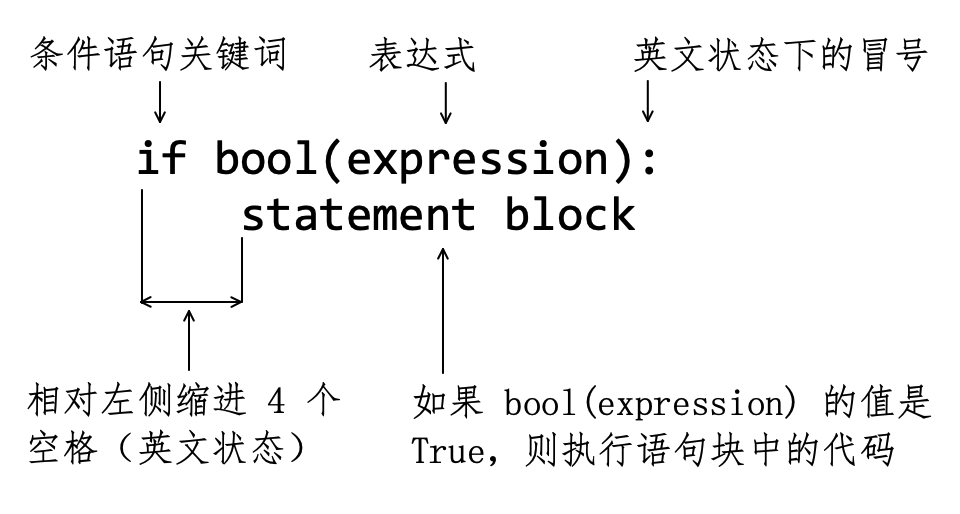
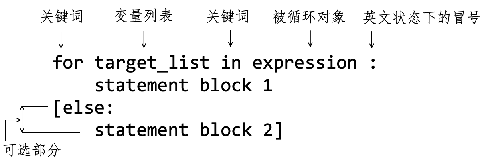
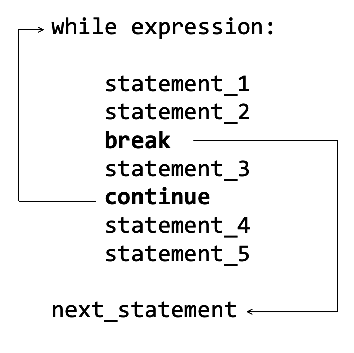

# 第6章 语句

> 故不积跬步，无以至千里；不积小流，无以成江海。骐骥一跃，不能十步；驽马十驾，功在不舍。锲而舍之，朽木不折；锲而不舍，金石可镂。
>
> ——荀子

**语句**（Statement）是程序中的最小独立单元，多个语句形成了一段可执行代码，即程序。本章将学习 Python 语言中的常见的部分语句，并综合运用学过的 Python 内置对象（类型）知识，逐步掌握用程序解决实际问题的方法。

## 6.1 简单语句

在编程中，常常遇到**表达式**（Expression）和**语句**（Statement）这两个概念，有很多资料对二者的区别进行了阐述，不一而足。根据数学知识可知，编程语言中的“表达式”应该是借鉴了或者延续了数学的同名概念。数学中的表达式是由数字、变量、算符、括号等依据上下文的规则而得的定义良好的组合，例如：$9x-5$​​ 、$\int_0^1\frac{2}{x}dx$​​​ 等等。显然，从数值计算的角度看，数学表达式最终可以得到相应计算结果。将此概念延续到编程语言中，则认为编程语言中的表达式也具有类似的特点，即能够执行并返回执行结果的一条指令。

编程语言中的语句，是指要执行的“动作”，它具有内部结构和语法要求。在 Python 语言中，有的语句比较简单，只需要一个逻辑行，称此类语句为**简单语句**；有的会包含多个简单语句，称之为**复合语句**。本节将要学习几个常见的简单语句，有部分内容之前已经在使用。

### 6.1.1 赋值语句

我们对**赋值语句**（Assignment Statement）已经不陌生，从第2章开始已经使用了，如：

```python
>>> book = 'Python Self-learning Tutorial by Qiwei'
>>> book
'Python Self-learning Tutorial by Qiwei'
```

更一般化地表述，Python 中的赋值语句就是将名称（如变量 `book` )与对象绑定——建立引用关系，这是自学习变量以来一直强调的。

在 Python 中，赋值语句还有其他表现形式，例如：

```python
>>> x, y, z = 1, "python", ["hello", "world"]
>>> x
1
>>> y
'python'
>>> z
['hello', 'world']
>>> x, *y = 1, "python", ["hello", "world"]    # (1)
>>> x
1
>>> y
['python', ['hello', 'world']]
>>> x = 1, "python", ["hello", "world"]        # (2)
>>> x
(1, 'python', ['hello', 'world'])
```

注释（1）中的 `*y` 表示“收集”除了第一对象（ `1` 被 `x` 引用或绑定）之外所有的对象，并“收集到”一个“容器”中—— `y` 引用列表（ `*y` 中的 `*` 符号此处不是“乘法”符号，关于它的介绍请参阅第7章7.2节）。注释（2）则用一个变量与等号右侧的三个对象“绑定”——将它们作为元组的成员，变量 `x` 引用此元组。

不同的编程语言，通过赋值语句所建立的名称与对象的关系略有不同，通常可以分为两类，用比较形象地方式说明，一类是“标签”型；另外一类是“盒子”型。下面一个典型示例来说明这两种类型的不同：假设有两个变量，其中 `a = 2` ，`b = 9` 。现在想让这两个变量的值对调，即最终得到 `a = 9` ，`b = 2` 。

对于“盒子”型语言，必须先创建两个整数类型的变量，就如同两个“盒子”，然后把数字 `2` 和 `9` 分别“装入”这两个盒子——每个“盒子”能且仅能装一个数字，伪代码如下：

```java
int a = 2；
int b = 9
```

要实现两个“盒子”中的对象对调，必须再创建一个中间的过度“盒子”，用于“中转”对象（因为每个盒子仅能装一个数字）：

```java
int temp;
temp = a    # 2 转到 temp
a = b       # a 中的值为 9
b = temp    # b 中的值为 2
```

这样才实现了数值对调的要求。

此问题如果用 Python 语言实现，就简洁多了。

```python
>>> a, b = 2, 9
>>> a
2
>>> b
9
>>> a, b = b, a    # (3)
>>> a
9
>>> b
2
```

核心代码就是注释（3），通过赋值语句，实现了变量所引用对象的对调——像“标签”那样，分别贴在不同物体上。

上述是为了叙述形象而给编程语言划分为“盒子”型和“标签”型两个类别，用专业的术语应该是“静态编程语言”和“动态编程语言”。有兴趣对这两个专业术语深入了解的读者，可以自行查找资料，本书点到为止。借用上面的示例，我们可以深入理解 Python 中的赋值语句特点和应用。

Python 中的赋值语句还有一种被称为“链式赋值”的形式。

```python
>>> you = me = 'life is short'    # (4)
>>> you
'life is short'
>>> me
'life is short'
```

注释（4）的“链式赋值”就是变量 `you` 和 `me` 同时引用同一个对象。

在第3章3.2节学习过算术运算，如：

```python
>>> a = 2        # (5)
>>> a = a + 3    # (6)
>>> a
5
```

按照现在所学，注释（5）（6）都是赋值语句。注释（5）中变量 `a` 引用整数 `2` ；注释（6）中先计算表达式 `a + 3` ，即 `2 + 3` ，然后变量 `a` 引用计算结果 `5` 。如果从表象上看，注释（6）实现的是“在变量 `a` 的原有值基础上增加 `3` ”，形象地说成“自增”。Python 语言为这种情况专门提供了一类新的实现形式：

```python
>>> a = 2
>>> a += 3    # (7)
>>> a
5
```

注释（7）与注释（6）等效。注意，有的语言提供的 `++` 操作符，至少在目前的 Python 版本（ Python 3.9 ）中不支持。

其他的算术运算符：`-` 、 `*` 、`/` 、`%` 也支持类似这种形式操作。

```
>>> b = 10
>>> b /= 2
>>> b
5.0
```

通过赋值语句，建立了“变量”和对象的引用关系——更一般地说，是“名称”与对象之间的引用关系。但是，在实际的编程中并非总是像此前所学那么简单，比如在第7章会遇到“作用域”问题，在第8章中还会出现对象属性与值之间的绑定问题。随着学习的深入，对赋值语句的理解也会不断深化。

### 6.1.2 import 语句

用 Python 关键词（保留字） `import` 发起的语句，即为 import 语句。对此我们不陌生，比如：

```python
>>> import math       # (8)
>>> math.pow(2, 3)    # (9)
8.0
```

 注释（8）将名为 `math` 的模块引入到当前环境，这是最常用的一种写法。注释（9）的可读性也很强，明确显示了 `pow()` 是 `math` 模块里的函数。由于用模块名称对其后的函数做了限定，如果不同模块有同名的函数，用这样的方式可以避免冲突。

虽然注释（8）已经很完美了，但如果某个程序中大量地反复使用 `math` 模块的函数，每次都输入全称是不是有点繁琐？特别是在很多专门领域中，已经对某些模块名称的简称的有了共识，于是就可以为引入的模块名称设置一个别称。

```python
>>> import math as mh   # (10)
>>> mh.pow(2, 3)
8.0
```

注释（10）的关键词 `as` 后面的 `mh` 就是模块 `math` 的别称，此后它就代表了 `math` 模块。这种用法在数据科学、机器学习业务中司空见惯（参阅第12章12.4节），例如：

```python
>>> import numpy as np                 # 引入 numpy 别称 np
>>> import torch as t                  # 引入 PyTorch 别称 t
>>> import matplotlib.pyplot as plt    # 引入 matplotlib 别称 plt
```

在某些情境中，还可能引入模块中某个特定对象，比如，常数 $\pi$​ 在程序中使用次数非常多，则可以这样引入：

```python
>>> from math import pi    # (11)
>>> pi
3.141592653589793
```

注释（11）将 `math` 模块的 `pi` 引入到当前环境中，这就意味着在当前程序中，规定 `pi` 作为专指常数 $\pi$​​​​ 的变量——此时，当前环境中通常不能再用名称 `pi` 引用其他对象。

```python
>>> from math import pow, e, pi
>>> pow(e, pi)
23.140692632779263
```

上面的代码从模块中同时引入多个对象。如果程序中所使用的模块比较单一，比如某程序仅使用来自 `math` 模块的函数，还可以用最“省事”的方法：

```python
>>> from math import *
>>> sqrt(9)
3.0
```

将 `math` 中的所有函数都引如到当前程序环境。不过，这种方式的结果是令可读性降低，比较适用于程序代码量较少，且不容易引起混淆的情况。

### 6.1.3 del 语句

由 Python 关键词 `del` 发起的语句，能解除名称和对象之间的引用关系。例如：

```python
>>> my_name = "laoqi"   
>>> del my_name           # (12)
>>> my_name               # (13)
Traceback (most recent call last):
  File "<stdin>", line 1, in <module>
NameError: name 'my_name' is not defined
```

注释（12）删除了 `my_name` ，其本质是解除了变量 `my_name` 与字符串 `'laoqi'` 之间的引用关系，而 Python 中不允许存在“游离”的变量，从表象上，就出现了注释（13）的结果——抛出异常：变量 `my_name` 没有定义。那个字符串呢？它由于不被变量引用，我们也无法得到它，就变成了“垃圾”。Python 语言有默认的垃圾收集器，能够自动地将成为垃圾的对象从内存中删除。

```python
>>> book = lang = ['python', 'java', 'rust', 'php']
>>> del book
>>> book
Traceback (most recent call last):
  File "<stdin>", line 1, in <module>
NameError: name 'book' is not defined
>>> lang
['python', 'java', 'rust', 'php']
```

这里有两个变量 `book` 和 `lang` 引用了同一个列表对象，当执行 `del book` 后，变量 `book` 与列表对象的引用关系被解除，但是引用列表的变量并未清零（还有 `lang` 引用），所以它不会被视为“垃圾”。

`del` 不仅能解除变量和对象间的引用关系，还能解除列表中成员位置索引与对象之间的引用关系——结合第5章5.3节内容理解。

```python
>>> del lang[0]
>>> lang
['java', 'rust', 'php']
>>> lang = ['java', 'rust', 'php']
>>> del lang[:2]
>>> lang
['php']
```

此处 `del` 语句与列表的 `pop()` 方法操作结果等效，但是 `pop()` 方法有返回值。

```python
>>> lst1 = [1, 2, 3]
>>> lst2 = lst1.copy()
>>> del lst1[0]      # (14)
>>> lst1
[2, 3]
>>> lst2
[1, 2, 3]
```

`lst2` 是 `lst1` 的浅拷贝（参阅第5章5.3节），注释（14）解除了 `lst1` 中索引为 `0` 的位置与对象的引用关系，从而使得它所引用的列表变成了 `[2, 3]` ，但注释（14）并没有解除 `lst2` 中索引为 `0` 的位置与整数 `1` 的引用关系，故其所引用列表依然是 `[1, 2, 3]`。

类似的操作也可用于字典对象：

```python
>>> dct = {'name': "laoqi", 'lang': 'python'}
>>> del dct['name']    # (15)
>>> dct
{'lang': 'python'}
```

注释（15）的效果是“删除”了一个键值对。

Python 的简单语句，不只是本节所介绍的三个，比如还有 return 语句、yield 语句等，在后续内容中我们会依次学习。

> **自学建议**
>
> 先把书“读厚”，是一种很重要的自学方法。以本节所学习的赋值语句、import 语句和 del 语句为例，这些都与之前所学的内容有关联，在学习的时候，既复习旧的，又学习新的，并且用各种方式验证某个语法规则的适用对象和使用方法。这样做虽然不能在 X  $(X\le 21)$​ 天内“翻完”所有书页，但可以保证每读过一页就能有所收获。这也是以后把书“读薄”的前提。
>
> 在这方面，我做了一个尝试，针对2022年出版的《机器学习数学基础》，提供了更多拓展资料网站，请参阅本站左侧【机器学习数学基础】栏目，旨在帮助阅读该书的读者“读厚”。

## 6.2 条件语句

所谓**条件语句**（Conditional Statement），顾名思义，就是依据某个条件来执行指定的程序。

首先看只有一个条件分支的语句结构，如图6-2-1所示：

- `if` ：发起条件语句的关键词，注意只能是小写字母。

- `bool(expression)` 如果表达式的布尔值是 `True` ，就执行此条件分支下面的语句块；否则不执行。

- `:` ，英文状态下的冒号，表示条件判断的逻辑行结束。

- **语句块**（Statement Block）是由至少一条语句组成的、为了实现某个特定目的的代码。不同的编程语言中会使用不同的符号定义语句块，比如 C 中使用 `{ }` 。Python 使用缩进定义语句块，根据 PEP（ PEP 是 Python Enhancement Proposals 的缩写。即增强功能的建议），通常缩进四个空格：

  - 代码块开始的逻辑行缩进四个空格；

  - 此后每个逻辑行与第一行左对齐；

  - 代码块最后一逻辑行结束后停止缩进。

  如此就实现了一个语句块（或代码块）。
  
  在此，特别建议读者老老实实地敲四次空格键实现“缩进四个空格”的要求，而不是用 `tab` 键实现缩进——这个建议是根据经验而来，当你调试过更多别人的代码之后，就会越来越觉得“敲四次空格键”是多么朴实无华，且稳健有效了。




<center>图6-2-1 if 条件语句结构</center>

打开自己选定的 IDE 软件（参阅第1章1.8节），创建名为 `myage.py` 的文件，按照上述结构说明，输入如下代码，体会条件语句的书写过程。

```python
#coding:utf-8
"""
filename: myage.py
"""
age = input('please input your age:')  # (1)
age = int(age)                         # (2)
if age < 60:                           # (3)
    print('你还没退休')                  # (4)
    delta = 60 - age
    print(f'再过{delta}年就退休了')       # (5)
centenarian = 100 - age                 # (6)
print(f'距离人瑞尚有{centenarian}年')
```

注释（1）使用了 Python 内置函数 `input()`，程序通过它可以得到由键盘输入的字符——在本程序中要求用键盘输入年龄。由于 `input()` 的返回值是字符串，注释（3）的比较表达式要用到的是整数，所以注释（2）使用 `int()` 函数将字符串转化为整数。

注释（3）使用了条件语句，当 `age < 60` 的返回值是 `True` 时，执行注释（4）到注释（5）的代码块。注意这里没有写成 `bool(age < 60)` ，`if` 会自动判断其后的表达式的布尔值，所以一般情况下只需要写一个表达式即可。

注释（4）是条件语句下所执行的语句块开始的逻辑行，相对左侧缩进四个空格，直到注释（5）的逻辑行，此语句块结束，下一逻辑行注释（6）不再缩进。如此就定义了从注释（4）到注释（5）的三条语句为一个语句块。当注释（3）中条件成立时执行此语句块。

编写好代码之后，保存文件，程序执行的效果如下（执行程序的方法，请参阅第2章2.1.2节）：

```shell
% python myage.py
please input your age:30
你还没退休
再过30年就退休了
距离人瑞尚有70年
```

或许你感到上面程序中的注释（3）所设立的条件太宽泛了，例如满足该条件的人还可以划分为成年人和儿童，是否可以在注释（3）之下再进行年龄的判断呢？即在条件语句的语句块内是否可以使用条件语句？将程序改写为：

```python
#coding:utf-8
"""
filename: myage.py
"""
age = input('please input your age:')  
age = int(age)                         
if age < 60:                           
    if age < 18:                       # (7)
        print("good good study")
    if age >= 18 and age < 50:         # (8)
        print("work hard")
    print('你还没退休')                
    delta = 60 - age
    print(f'再过{delta}年就退休了')    
centenarian = 100 - age                
print(f'距离人瑞尚有{centenarian}年')
```

条件 `age < 60` 的语句块自注释（7）开始，并且其中包括注释（7）（8）两个条件语句及其下面的语句块。用此例说明，条件语句可以进行嵌套。特别注意，在实际编程中不要嵌套太多层。

就上述程序而言，也可以改为没有嵌套的，那就是要使用条件语句的多分支的结构：

```python
if expression_1:
    statement block 1
elif expression_2:
    statement block 2
elif expression_3:
    statement block 3
...
else:
    statement block n
```

在这个多分支的结构中，除了 `if` 分支外，其他分支都是可选项，根据实际需要取舍。继续以前述程序为例，注释（1）获得了通过键盘输入的年龄，注释（2）将得到的 `age` 转换为整数类型。请注意，`int()` 要求参数必须全是由数字组成的字符串，如果注释（1）返回的字符串不满足此条件，程序执行到注释（2）就会报异常。

在真实的场景中，即使程序向用户提示操作规范，也会经常出现用户违反规范的现象。所以，读者务必要建立一个信念：用户的所有输入都不可信。既然如此，就要对用户的输入信息进行检查。在这里我们姑且用条件语句检查用户输入的年龄是否符合要求。继续修改上述程序：

```python
#coding:utf-8
"""
filename: myage.py
"""
age = input('please input your age:') 
if age.isnumeric():                       # (9)
    age = int(age)
    if age < 7:
        print('还没上学呢')
    elif age >=7 and age < 25:
        print('莫等闲，白了少年头，空悲切')
    elif age >= 25 and age < 35:
        print('关关雎鸠，在河之洲')
    elif age >=35 and age < 60:
        print('会当凌绝顶')
    else:
        print('廉颇老矣，尚能饭否')
else:                                     # (10)
    print("请输入数字")
```

上述程序中，注释（9）如果成立，则说明 `input()` 函数所得到的对象是由数字组成的字符串，否则，执行注释（10），这样就用一种比较简单的方式检查了用户输入的信息——这种方法仅用于此处练习条件语句，在真正的开发中，一般不这么做，开发实践中使用第10章所述之方法。

在注释（9）之下的代码中，使用了条件语句的多分支结构。在多分支结构中，要特别注意各个分支之间的逻辑关系（读者自行完成修改后的程序调试）。

条件语句除了可以在 IDE 中编写，还可以在交互模式中编写。此前在交互模式中写的语句或表达式都是一行的，现在要写多行了，请注意如下所示的操作。进入到交互模式中，按照说明输入以下代码：

```python
>>> name = "laoqi"
>>> if name == "laoqi":                                # (11)
...     print(f"Hi, {name}. I am reading your book.")  # (12)
... else:
...     print(f"Hi, who are you?")                     # (13)
...
Hi, laoqi. I am reading your book.                     # (14)
```

输入注释（11）的条件语句之后，敲回车，光标到注释（12）所在逻辑行的开头（前面的三个点，不用理会，是我的终端自带的，读者的终端不一定有），然后敲四个空格键缩进，再输入注释（12）所示的代码。当注释（13）输入完毕，敲回车键到下一行（注释（13）下面只显示三个小点的那一行）。如果在此处打算结束条件语句，且要立刻执行以上输入的代码，再敲回车键。注释（14）是执行结果。

显然，在交互模式内写这么多代码，是有很大风险的，稍有不慎，前功尽弃。不过，如果是单行的，交互模式用起来还是很方便的，哪怕是条件语句，也有写成单行的形式——**三元操作**，只不过条件分支不能太多。

```python
>>> page = 300
>>> price = 60 if page <= 300 else 100
>>> price
60

>>> page = 400
>>> price = 60 if page <= 300 else 100
>>> price
100
```

概括一下，“三元操作”的基本写法是：`Y if X else Z` ，可以把它看做一个表达式，如果 `X` 为 `True` ，则返回 `Y` ，否则返回 `Z` 。

条件语句结构简单，应用广泛，在后续的学习中，会经常出现。

> **自学方法**
>
> 从本章开始，要大量编写 Python 程序文件（ `.py` 文件），只有通过大量练习，才能熟练应用所学知识，除此没有其他方法。
>
> 为了给以后的自己留下美好的回忆，顺便再增加一项重要的技能——管理源码，建议读者在提供源码管理的网站注册（比如 github.com 、gitee.com 、gitlab.com 等等），并创建仓库，将自己在练习过程中创建的文件都托管到远程仓库中。如果你的源码仓库是公开的，更能为自己的学习生涯锦上添花。

## 6.3 for 循环语句

 for 循环语句普遍存在多种常见的高级编程语言，在 Python 中地位尤为重要，何以见得？学然后即知。

### 6.3.1 初步应用

很多编程语言都继承了 C 语言的 for 循环风格，例如 JavaScript 中这样实现（以下代码不需调试）：

```javascript
var numbers = [1, 2, 3, 5, 7]; 
for (var i = 0; i < numbers.length; i += 1) {
    print(numbers[i]) }
```

像这样的还有 Java、PHP 等编程语言。如果把这种类型的称为“传统”风格的话，Python 中的 for 循环则显得特立独行，它不是 C 语言风格的，它是 Python 风格的——别具一格。

```python
numbers = [1, 2, 3, 5, 7] 
for n in numbers:          # (1)
    print(n)
```

比较以上两段代码，后者是 Python 风格的 for 循环语句，与“传统”风格相比：

- 不需要创建索引变量、不需要对索引变量初始化，没有 `var i = 0` ；
- 不需要边界检查，没有 `i < numbers.length` ；
- 不需要索引递增，没有 `i += 1` 。

Python 的 for 循环不仅形式上与 C 语言风格的不同，工作原理也不同，但下面还是先从形式上学习，原理内容留给以后探究。

下面以注释（1）为例，结合图6-3-1，说明 Python 的 for 循环基本用法：

- `for` ：发起 for 循环的关键词；
- `n` ：引用被循环对象中成员的变量，注释（1）中的变量 `n` 依次引用列表中的每个成员；
- `in` ：关键词，右侧的 `numbers` 变量引用了被循环对象。

如果将 `for n in numbers` 看做自然语言中的一句话，其字面含义即意味着 `n` 引用 `numbers` 中的成员。



<center>图6-3-1 for 循环语句结构</center>

将注释（1）的循环语句在交互模式中执行，效果如下：

```python
>>> numbers = [1, 2, 3, 5, 7]
>>> for n in numbers:
...     print(n)
...
1
2
3
5
7
```

在 Python 中，只有可迭代对象才能够作为 for 循环语句中的被循环对象。关于可迭代对象，在第4章和第5章都有所介绍，第9章9.6节还会详细说明。

相传，高斯9岁时就证明了快速计算等差数列求和的技巧，即 $1+2+3+\cdots+99+100$ 。这里我们用 Python 程序计算，并向大师致敬。

```python
#coding:utf-8
'''
filename: sumhundred.py
'''
sum = 0
for i in range(1, 101):    # (2)
    sum += i               # (3)

print(f"the sum of 1 to 100 is: {sum}")
```

先看执行效果，再分析程序中的重点代码：

```python
% python sumhundred.py
the sum of 1 to 100 is: 5050
```

此结果与高斯计算的结果相同——是不是充满了成就感。不过，此处的方法和高斯的明显不同，高斯使用了等差数列求和公式，这里是逐个做加法——方法虽笨，但有计算机这个好工具，所以速度很快。下面就分解这个“笨方法”，理解每一部分含义：

- `range()` 是 Python 的内置函数，它的调用方式是 `rang(stop)` 或者 `range(start, stop[, step])` ，参数均为整数，生成由整数组成的等差数列——返回的对象不是列表，是 range 类型对象，这种类型的对象是一种“类列表”的序列，可以用 `list()` 函数将其转换为列表。

  ```python
  >>> range(10)
  range(0, 10)
  >>> list(range(10))
  [0, 1, 2, 3, 4, 5, 6, 7, 8, 9]
  >>> list(range(1, 20, 2))
  [1, 3, 5, 7, 9, 11, 13, 15, 17, 19]
  >>> 9 in range(10)
  True
  ```

  注释（2）中以 `range(1, 101)` 得到了由整数 $1,2,\cdots, 100$ 作为“潜在成员”的 range 对象，它是可迭代的，用于 for 循环（之所以是“潜在成员”，是因为如果没有读取某个数据，该数据不会存在于内存，详细解释请参阅第9章9.6节）。

- 变量 `i` 依次引用 `range(1, 101)` 中的每个整数，通过注释（3）实现“自增”计算（见6.1.1节），即完成 $1+2+3+\cdots+99+100$ 计算。

利用 `range()` 函数，可以解决一些与等差数列有关的问题。例如，要求选出 $50$ 以内能被 $3$ 整除的非负整数，可以这样实现：

```python
#coding:utf-8
"""
filename: divisibility.py
"""
lst = []
for i in range(50):
    if i % 3 == 0:
        lst.append(i)

print(f"numbers divisible by 3: {lst}")
```

执行结果是：

```shell
% python divisibility.py 
numbers divisible by 3: [0, 3, 6, 9, 12, 15, 18, 21, 24, 27, 30, 33, 36, 39, 42, 45, 48]
```

其实，如果读者认真阅读 `range()` 官方文档，还会找到另外一种更直接的方法：

```python
>>> list(range(0, 50, 3))
[0, 3, 6, 9, 12, 15, 18, 21, 24, 27, 30, 33, 36, 39, 42, 45, 48]
```

在慨叹其简洁之余，更要认识到阅读官方文档的重要性。

再来看一个将字符串作为 for 循环对象的示例。在这个示例中，要统计一个单词中每个字母的出现次数。

```python
#coding:utf-8
'''
filename: countchar.py
'''
word = input('please input an english word:')
result = {}                        # (4)
for e in word:                     # (5)
    if e in result:                # (6)
        result[e] += 1
    else:
        result[e] = 1
print(f'the word is: {word}')
print(f'count letter: {result}')
```

先看执行结果，再分析代码。

```python
% python countletter.py 
please input an english word:zoom
the word is: zoom
count letter: {'z': 1, 'o': 2, 'm': 1}
```

按照“用户的输入都不可信”原则，上述程序还有待优化。但是，这里我们要将注意力放在 for 循环语句，姑且认为“人之初，性本善”的假设是成立的。

统计单词中每个字母出现的次数，显然要建立字母与出现次数的对应关系——立刻想到了“键值对”，最适合的就是用字典类型的对象保存统计结果，于是注释（4）创建一个空字典。

注释（5）循环单词（字符串对象）中的每个成员——字母，然后在循环语句的语句块内，判断该字母是否已经是 `result` 的键：如果是，说明此前已经对该字母计数，所以让它对应的值“自增” `1` ；否则，在 `result` 中增加一个以该字母为键的键值对，并设置初始的值为 `1` 。

这样，就实现了记录对象出现次数的统计，这种方法在后续示例中还会用到。

列表和字符串都是序列，也都是可迭代对象，此外，字典虽然不是序列，但是可迭代对象，故也可以作为 for 循环语句中的被循环对象。

```python
>>> d = dict([("website", "www.itdiffer.com"), ("lang", "python"), ("author", "laoqi")])
>>> for k in d: print(k)    # (7)
...
website
lang
author
```

注释（7）是一种“偷懒”的写法，如果语句块中只有一行语句，就可以在冒号 `:` 后面跟一个空格，然后写上该语句（如 `print(k)` ）。注意：这种写法仅适用于语句块中只有一条语句的情况。当然，将 `print(k)` 写在下一行（前面有四个空格）依然可行，且效果相同。

从代码的运行结果可知，注释（7）中的变量 `k` 依次引用了字典 `d` 的键值对的键（key）。

```python
>>> for k in d.keys(): print(k)
...
website
lang
author
```

这段代码中使用了字典的方法 `keys()` （参阅第5章5.1.3节），与注释（7）等效，不过常用的还是注释（7）。

若要通过循环得到键值对中的值（value），不难想到字典的另外一个方法 `values()` 。

```python
>>> for v in d.values(): print(v)
...
www.itdiffer.com
python
laoqi
```

自然还会想到字典的 `items()` 方法返回值也可以用于被循环对象，但是要注意，`d.items()` 返回值有点特别。

```python
>>> d.items()
dict_items([('website', 'www.itdiffer.com'), ('lang', 'python'), ('author', 'laoqi')])
```

循环此种形式的对象，得到每组键值对的键和值：

```python
>>> for k, v in d.items():    # (8)
...     print(f'key:{k} --> value:{v}')
...
key:website --> value:www.itdiffer.com
key:lang --> value:python
key:author --> value:laoqi
```

注释（8）中 `(k, v)` 与 `d.items()` 返回值的每个成员依次循环对应引用，即 `k` 引用键值对的键，`v` 引用键值对的值。

此外，用注释（7）的循环方式，也能实现注释（8）的结果：

```python
>>> for k in d:
...     print(f'key:{k} --> value:{d[k]}')
...
key:website --> value:www.itdiffer.com
key:lang --> value:python
key:author --> value:laoqi
```

以上初步了解了 for 循环的基本应用。为了让 for 循环用得更妙，Python 中的两个内置函数必须要了解。 

### 6.3.2 zip() 和 enumerate() 

这两个函数不是仅供循环语句使用，但它们可以帮助循环语句更容易实现某些功能。

**1. zip()**

Python 内置函数 `zip()` 的基本调用形式是 `zip(*iterables)` ，其参数应为可迭代对象，且用符号 `*` 表示可以是多个可迭代对象（参阅第7章7.2节），例如：

```python
>>> zip("abc", "def")
<zip object at 0x7f8293d44f40>
```

函数的返回值是迭代器对象（ `zip object` 。关于迭代器，请参阅第9章9.6节），该对象的成员是由参数中的可迭代对象的成员依次对应地组成的元组。可以用 `list()` 函数将其转化为列表，从而显示迭代器对象的内部成员。

```python
>>> list(zip("abc", "def"))
[('a', 'd'), ('b', 'e'), ('c', 'f')]
```

由此可见，`zip()` 的作用就是将可迭代对象的成员进行“配对”，即：将可迭代对象中的成员相对应地建立映射关系。

如果长度不同，则“以短的为准”（帮助文档中表述为“This continues until the  shortest argument is exhausted”）。

```python
>>> a = ['python', 'ml']
>>> list(zip(a, range(4), {'name':'laoqi', 'age':30, 'book':'python'}))  # (9)
[('python', 0, 'name'), ('ml', 1, 'age')]
```

注释（9）中 `zip()` 的参数是不同类型的可迭代对象，并且每个可迭代对象的长度也不同。请认真观察返回结果。

理解了基本应用方法之后，用它来解决这样一个问题：分别有数列 `a = range(1, 6)` 和 `b = range(9, 4, -1)` ，计算两个数列中对应项的乘积。

```python
>>> a = range(1, 6)
>>> b = range(9, 4, -1)
>>> c = []
>>> for x, y in zip(a, b):    # (10)
...     c.append(x * y)
...
>>> c
[9, 16, 21, 24, 25]
```

注释（10）中以 `zip(a, b)` 得到 `a` 和 `b` 的对应项的“配对组合”，经循环语句之后，逐个求积，并追加到前面已经创建的空列表 `c` 中——在6.4节会对这种写法进行优化。

仿照上面的方法，再做一个练习：将字典 `myinfor = {"publish":"phei", "site":"itdiffer.com", "lang":"python"}` 变换成 `infor = {"phei":"publish", "itdiffer.com":"site", "python":"lang"}` ，即原字典的键值对中的键、值位置互换。

```python
# 方法 1
>>> myinfor = {"publish":"phei", "site":"itdiffer.com", "lang":"python"}
>>> infor = dict()
>>> for k, v in myinfor.items():
...     infor[v] = k
...
>>> infor
{'phei': 'publish', 'itdiffer.com': 'site', 'python': 'lang'}

# 方法 2
>>> dict(zip(myinfor.values(), myinfor.keys()))
{'phei': 'publish', 'itdiffer.com': 'site', 'python': 'lang'}
```

是否能理解方法2 ？如果有疑问，请参考 `dict()` 函数的使用方法，并结合 `zip()` 函数返回结果。除了上述两个方法之外，6.4节还会提供第三种。 

**2. enumerate()**

在学习使用这个函数之前，先做个练习——还是强调“温故而知新”的学习方法：使用标准库中的 random 模块，生成一个含有 20 个成员的列表，其成员从由 1 到 10 的整数中随机抽取，然后将此列表中的偶数用字符串 `even` 替换。

暂时不要看下面的代码，请读者自己尝试，是否能解决这个问题。

```python
#coding:utf-8
'''
filename: even.py
'''
import random

lst = []
for i in range(20):
    lst.append(random.randint(1, 10))    # (11)

print(lst)

for i in range(len(lst)):
    if lst[i] % 2 == 0:
        lst[i] = 'even'                  # (12)

print(lst) 
```

先看执行结果，再解释部分代码。

```shell
% python even.py
[3, 10, 9, 4, 2, 2, 4, 6, 1, 3, 3, 10, 1, 4, 4, 2, 9, 4, 1, 5]
[3, 'even', 9, 'even', 'even', 'even', 'even', 'even', 1, 3, 3, 'even', 1, 'even', 'even', 'even', 9, 'even', 1, 5]
```

从执行结果上看，上述代码已经解决了练习中的问题。下面对程序中的两处注释给予说明：

- 注释（11），`random.randint(1, 10)` 可以生成一个随机数——本质上是伪随机，并将该随机数追加到列表中（6.4节会有更优化的方法实现此操作）。
- 注释（12），通过条件语句判断某个索引所对应的数是不是偶数，如果是，则将该索引位置对应的对象更换为字符串 `'even'` 。

在理解了上面的程序之后，再介绍的函数 `enumerae()` ，并将其用于优化上述程序，从而体验此函数的作用。

```python
>>> seasons = ['Spring', 'Summer', 'Fall', 'Winter']
>>> enumerate(seasons)                # (13) 
<enumerate object at 0x7f82960069c0>
>>> list(enumerate(seasons))          # (14)
[(0, 'Spring'), (1, 'Summer'), (2, 'Fall'), (3, 'Winter')]
```

函数 `enumerate()` 的返回值是可迭代的 enumerate 对象（如注释（13）的返回对象），依据学习 `zip()` 的经验，按照注释（14）那样，用 `list()` 函数将其转化为列表，就能看到此对象里面的成员，是由原列表 `seasons` 的索引及其对应成员构成的元组——表示二者的映射关系。下面在循环语句中使用它：

```python
>>> for i, item in enumerate(seasons):
...     print(f"index: {i}, item: {item}")
...
index: 0, item: Spring
index: 1, item: Summer
index: 2, item: Fall
index: 3, item: Winter
```

用这个方法，优化注释（12），该程序可以修改为：

```python
#coding:utf-8
'''
filename: even.py
'''
import random

lst = []
for i in range(20):
    lst.append(random.randint(1, 10))

print(lst)

# for n in lst:
for idx, n in enumerate(lst):
    if n % 2 == 0:
#        idx = lst.index(n)
        lst[idx] = 'even'

print(lst) 
```

最后，建议读者认真阅读 `enumerate()` 函数的文档，将操作结果与文档叙述进行对照。

> **自学建议**
>
> 第4章4.4节的【自学建议】中曾建议读者“结对学习”，“独学而无友，则孤陋而寡闻”（《礼记·学记》），除了与周边人结对学习外，还可以加入学习讨论群。一般讨论群是基于社交软件建立的，有意愿学习的同道中人聚集在一起，一来可以通过观看其他人的讨论，了解大家的学习进度和遇到的问题，并反思自己是否能“有则改之无则加勉”；二来可以跟“同学”进行讨论，帮助“同学”解决问题，既能助人为乐，又能提升自己的水平。
>
> 最后要提醒诸位读者，不论是提问还是回答问题，都要注意“语言美”，《会说话的人运气都不会太差》（（日）矢野香 著，王军 译）。
>
> 我为本书也建立了一个供学习讨论的 QQ 群，群号是：26913719，名称是：Code Craft 。

## 6.4 解析

**解析**（Comprehension，或翻译为“推导”）是一种典型的 Python 语法，可以在列表、字典、元组、集合等可迭代的内置对象上使用（注意，Python 2 只有列表解析）。更广泛地讲，解析可以针对任何可迭代对象，即用一行代码，完成循环语句中多行代码的任务。

### 6.4.1 列表解析

创建列表并在其中添加某些成员，这是一种比较常见的操作，比如创建一个列表，其中的成员要求是1~9的整数的平方，用6.3节中学过的 for 循环，可以这样实现：

```python
>>> lst = []
>>> for i in range(1, 10):
...     lst.append(i * i)
...
>>> lst
[1, 4, 9, 16, 25, 36, 49, 64, 81]
```

如果用本节所要介绍的列表解析，就变成了：

```python
>>> [i * i for i in range(1, 10)]   # (1)
[1, 4, 9, 16, 25, 36, 49, 64, 81]
```

对比两部分代码，后者更简洁，此外，后者运行时间还更短。对此，可以写个程序检验一下。

```python
#coding:utf-8
'''
testcomprehension.py
'''
import time

start = time.time()
lst = [i * i for i in range(100000)]
end = time.time()
delta = end - start

print(f"list comprehension time: {delta}")

start2 = time.time()
lst2 = []
for i in range(100000):
    lst.append(i * i)
end2 = time.time()
delta2 = end2 - start2

print(f"for loop time: {delta2}")
print(f"(list comprehension) / (for loop) = {delta/delta2:.3f}")
```

执行程序，结果如下：

```shell
% python testcomprehension.py
list comprehension time: 0.01116490364074707
for loop time: 0.02745819091796875
(list comprehension) / (for loop) = 0.407
```

不同的机器，上述结果会有所差异。在我的机器上，如果要生成一个由 $100000$ 以内的正整数的平方为成员的列表，使用列表解析要比使用 for 循环速度快，而且还快不少。

所以，非常有必要认真学习这个强大的工具。

以注释（1）为例，列表解析的基本结构是：

```shell
[expression for member in iterable]
```

其中的“expression”意为表达式，不仅仅可以是注释（1）中所示的数学算式，还可以有其他形式，比如：

```python
>>> str_int = [str(i) for i in range(10)]
>>> str_int
['0', '1', '2', '3', '4', '5', '6', '7', '8', '9']
>>> [i for i in '521']
['5', '2', '1']
```

此外，也可以在列表解析中增加条件，语法结构为：

```python
[expression for member in iterable (if conditional)]
```

例如，选出列表 `['anwang', 'microsoft', 'ibm', 'compaq', 'lenovo', 'dell']` 中含有字母 `'a'` 的单词：

```python
>>> lst = ['anwang', 'microsoft', 'ibm', 'compaq', 'lenovo', 'dell']
>>> [word for word in lst if 'a' in word]    # (2)
['anwang', 'compaq']
```

特别注意，注释（2）中的列表解析，将条件判断放在了最后的位置，不要放在 `for` 关键词之前。

读者可以用此方法重写此前 for 循环中很多程序，比如6.3.1节的 `divisibility.py` ，求 $50$ 以内能被 $3$ 整除的非负整数：

```python
lst = [i for i in range(50) if i % 3 == 0]
print(f"numbers divisible by 3: {lst}")
```

以上介绍的是列表解析的基本形式，在此基础上，还可以有很多变化，比如嵌套列表解析。

```python
>>> matrix = [
... [1,2,3,4],
... [5,6,7,8],
... [9,10,11,12]]
>>> matrix
[[1, 2, 3, 4], [5, 6, 7, 8], [9, 10, 11, 12]]
```

变量 `matrix` 引用了一个嵌套列表，我们可以把它看做一个 $3\times4$​ 的矩阵，如果用已学过的知识，将这个矩阵转置，即实现：

$\begin{bmatrix}1&2&3&4\\5&6&7&8\\9&10&11&12\end{bmatrix}^{\rm{T}}=\begin{bmatrix}1&5&9\\2&6&10\\3&7&11\\4&8&12\end{bmatrix}$

在数据科学和机器学习中，对此类操作都有专用工具（如 Numpy ，参阅第12章12.4节），在真实的工程项目中，也一定要用专用工具。下面的代码仅仅是为了演示如何实现嵌套列表解析，故称之为“玩具代码”，勿要搬用到实际工作中。

```python
>>> [[row[i] for row in matrix] for i in range(4)]    # (3)
[[1, 5, 9], [2, 6, 10], [3, 7, 11], [4, 8, 12]]
```

注释（3）的列表解析有两层，`for row in matrix` 循环 `matrix` 的列表成员，相当于矩阵的行；`for i in range(4)` 依次得到每行——是一个列表——的成员索引。

同样的问题，常常有多个解决方法——真实世界的问题不是只有一个答案。

```python
>>> list(zip(*matrix))
[(1, 5, 9), (2, 6, 10), (3, 7, 11), (4, 8, 12)]
```

请读者结合6.3.2节中学过的 `zip()` 函数理解上述操作——又是“温故而知新”。

再看这样一个问题，更要读者熟练掌握已学知识。

```python
>>> gender = ['male', 'female', 'male', 'female', 'female', 'female']
>>> [0 if gen == 'female' else 1 for gen in gender]    # (4)
[1, 0, 1, 0, 0, 0]
```

列表 `gender` 由 `'male'` 和 `'female'` 组成，若将这类数据用于机器学习，必须转化为数字。通常用 `0` 表示 `'female'` ，`1` 表示 `'male'` 。注释（4）的列表解析就是要实现此目的。可能觉得它有点违背前述列表解析的结构，为什么 `if` 放在了 `for` 的前面？请务必仔细观察，在注释（4）中，“ `0 if gen == 'female' else 1` ”是一个单元，即6.2节中学过的“三元操作”，本质上它是一个表达式，对应着列表解析结构中的 expression 。

> 在数据科学和机器学习中，上述 `gender` 所引用的列表可以表示为某个特征（或属性）的数据，这种类型的数据通常要转化为数字，但这里的数字之间并没有大小之分。在机器学习中，对这类数据的处理方法通常不使用注释（4）的方法，相关内容请参阅拙作《数据准备和特征工程》（电子工业出版社）

### 6.4.2 字典和集合解析

除了列表解析之外，字典、集合也能应用于解析，例如：

```python
>>> lst = [random.randint(1, 10) for _ in range(100)]
>>> lst
[10, 4, 4, 1, 2, 5, 2, 2, 4, 3, 10, 4, 5, 6, 7, 6, 3, 4, 1, 6, 2, 9, 1, 5, 4, 4, 5, 6, 2, 10, 1, 9, 8, 5, 6, 7, 1, 1, 3, 10, 9, 4, 2, 5, 5, 9, 4, 7, 7, 8, 2, 6, 6, 8, 8, 10, 3, 9, 2, 3, 10, 1, 3, 5, 5, 5, 4, 6, 8, 5, 2, 4, 5, 7, 9, 6, 5, 4, 4, 7, 2, 5, 8, 2, 6, 2, 10, 2, 5, 4, 8, 8, 2, 4, 7, 1, 4, 8, 10, 6]
```

用列表解析得到了 100 个从 1~10 中随机选出的整数，其中 `for _ in range(100)` 表示重复 100 次，因为此过程中用不到循环语句中的变量，所以用下划线 `_` 表示——这是习惯写法。下面从列表中挑出大于 5 的数字，并组成一个集合。

```python
>>> {n for n in lst if n > 5}    # (5)
{6, 7, 8, 9, 10}
```

注释（5）即为集合解析，与列表解析相比，不同之处仅为外面包裹的符号变为了“ `{ }` ”，里面的结构完全一样。

字典解析亦与之类似。以6.3.2节中将 `myinfor = {"publish":"phei", "site":"itdiffer.com", "lang":"python"}` 的键、值对调练习为例：

```python
>>> myinfor = {"publish":"phei", "site":"itdiffer.com", "lang":"python"}
>>> {v: k for k, v in myinfor.items()}
{'phei': 'publish', 'itdiffer.com': 'site', 'python': 'lang'}
```

本节开头提到过，元组也可以用于解析，但是，此处不对此给予介绍，留待第9章9.7节学习，因为它还另有深意。

> **自学建议**
>
> 一口整洁坚硬牙齿，就能享受到很多人间美味——羡慕。本书倡导的自学能力，就是“啃”知识的牙，“一口一口”，通过咀嚼品味，才能将知识消化吸收，并且体会到它的魅力，从而增强自己的“力量”——知识就是力量。狼吞虎咽式学习，貌似进度很快，学得很多，实则容易“消化不良”，基础不牢。
>
> 怎么才能做到“一口一口”地“啃”呢？以代码为例，如果实现了如下所言，就能品味到“美味”了。
>
> - 代码中的每个字符，都是一个一个纯手工敲出来的，不是用“复制”、“粘贴”这种无脑操作完成的。
>
> - 耐心地调试代码，特别是遇到异常或错误时，能认真检查每个字符。
>
> - 理解代码中的蕴含的意义，能够用已经学过的知识解释代码中的每行语句、每个表达式。

## 6.5 while 循环语句

for 循环必须以可迭代对象作为被循环对象，while 循环则不同，它是依据一定的条件进行循环，即只要满足某条件，循环体中的语句“总跑着”。

### 6.5.1 基本格式

while 循环语句的基本格式是：

```shell
while <expression>:
    <statements>
```

如果 `<expression>` 的布尔值是 `True` ，则执行循环体内的语句块 `<statements>`——依然是以缩进标记语句块。

```python
>>> n = 3
>>> while n > 0:
...     n -= 1
...     print(n)
...
2
1
0
```

在这段代码中，`n` 的初始值是 `3` ，则 `while` 后的表达式 `n > 0` 的布尔值是 `True` ，于是执行下面的语句块。执行 `n -= 1` 后 `n` 的值为 `2` （见 `print(n)` 结果），`n > 0` 的布尔值还是 `True` ，继续执行循环体中的语句块，直到 `n = 0` ，表达式 `n > 0` 的布尔值是 `False` ，停止循环。

再如：

```python
>>> lst = ['java', 'python', 'julia']
>>> while lst:
...     print(lst.pop())
...
julia
python
java
```

依然要判断 `while` 后面的表达式 `lst` 的布尔值，因为在上一行定义了该列表不为空，故其布尔值是 `True` ，于是执行循环体中的语句块。`lst.pop()` 的功能是删除列表中最后的成员并返回删除对象，直到列表为空，其布尔值为 `False` ，则终止循环。

如果有兴趣在交互模式中输入下面的代码，会发现一个“神奇”的现象：

```python
>>> while 1:
...     print("laoqi")
...
```

观察到了吗？不看到终端不停地打印 `'laoqi'` ，就很难体会到什么叫做“死循环”——“循环到死”，无法靠程序自身的控制终止循环，也称“无限循环”。要停止上述“死循环”，最简单的方法就是关掉终端窗口。

### 6.5.2 break 和 continue 语句

在 Python 关键词中，`break` 和 `continue` 两个关键词构成了两个语句：

- break 语句：终止循环，并跳转到循环语句下面的语句；
- continue 语句：跳过此语句后面的循环体中的其他语句，回到循环的开始，并评估是否满足循环条件。

这两个语句可以用于 while 循环，也可以用于 for 循环。以 while 循环为例，其作用效果如图6-5-1所示。



<center>图6-5-1 brak 和 continue 语句</center>

用 break 语句改造前述“死循环”的程序，代码如下：

```python
#coding:utf-8
'''
whileloop.py
'''
n = 0
while 1:
    n += 1
    if n >= 3:       # (1)
        break
    print('laoqi')

print('loop end')    # (2)
```

执行效果：

```shell
% python whileloop.py 
laoqi
laoqi
loop end
```

对照程序代码和执行结果，当满足注释（1）时，即执行其下的 `break` ，从而避免无限循环，并跳转到循环语句下面的注释（2）。

下面写一个“猜数游戏”的程序，要求：（1）计算机随机生成一个100以内的正整数；（2）用户通过键盘输入数字，猜测计算机所生成的随机数。注意，用户的输入次数不进行限制。

相较于前述写过的程序，现在这个要求比较复杂，算是一个“大型程序”了。不过，不论面对多么复杂的程序，都要将需求分析清楚——本程序需求已明确，再针对需求制定实现策略。

- 生成随机数：用标准库的 random 模块；
- 获得用户输入的数字：用 `input()` 函数；
- 实现不限次数的操作：用 while 循环语句；
- 判断用户的输入是否等于生成的随机数：用 if 语句；
- 猜中了终止循环：用 break 语句。

接下来的工作，就是运用已经学过的知识，将上述策略编写成可执行的程序。建议读者先自己编写，而后与下面的示例代码进行对照，取长补短。此处的代码示例仅仅是一种实现方式，并不是标准答案。

```python
#coding:utf-8
'''
guessnumber.py
'''

import random
number = random.randint(1,100)
guess = 0
while True: 
    num_input = input("please input one integer that is in 1~100:") 
    guess += 1
    if not num_input.isdigit():
        print("Please input interger.") 
    elif int(num_input) < 0 or int(num_input) >= 100:
        print("The number should be in 1 to 100.") 
    else:
        if number == int(num_input): 
            print(f"OK, you’ve done well.It is only {guess} times.") 
            break
        elif number > int(num_input): 
            print("your number is smaller.") 
        else: 
            print("your number is bigger.")
```

 执行此程序，想一想怎么猜？观察我的猜测过程：

```python
% python guessnumber.py
please input one integer that is in 1~100:50
your number is bigger.
please input one integer that is in 1~100:25
your number is smaller.
please input one integer that is in 1~100:37
your number is smaller.
please input one integer that is in 1~100:44
your number is smaller.
please input one integer that is in 1~100:47
your number is bigger.
please input one integer that is in 1~100:46
your number is bigger.
please input one integer that is in 1~100:45
OK, you’ve done well.It is only 7 times.
```

这个猜的过程，其实运用了一种简单的算法——二分查找算法（Binary Search Algorithm）。当然，运气好了，随便输入一个就能猜中，“蒙着猜”毕竟耗费的时间不稳定，而运用二分查找算法，你可以估计出最坏的时间复杂度。

理解了 `break` 的作用之后，再看另外一个关键词发起的 continue 语句，由图6-5-1可知，它的作用是略过此后的语句，回到循环的初始判断行，例如：

```python
#coding:utf-8
'''
whilecontinue.py
'''
a = 11
while a > 0:
    a -= 1
    if a % 2 == 0:
        continue  # (3)
        print(a)  # (4)
    else:
        print(a)  # (5)
```

还是先看调试结果，再解释必要的部分。

```shell
% python whilecontinue.py
9
7
5
3
1
```

在 while 循环语句块内，当 `a` 是偶数时，执行注释（3）的 continue 语句，依据图6-5-1所示，略过其后的注释（4），即不打印偶数，然后转到 while 循环的开始，满足条件即再自减 `1` ，则 `a` 变为奇数，执行注释（5），将奇数打印出来。于是得到了上述只显示奇数的执行结果。

break 语句和 continue 语句不仅仅可以用在 while 循环中，也能用于 for 循环，其作用亦然。

```python
>>> for i in range(10):
...     if i % 2 == 0:
...         continue
...         print(i)
...     else:
...         print(i)
...
1
3
5
7
9
```

这是 continue 语句在 for 循环中的应用举例，读者可以对照前述 `whilecontinue.py` 中的程序理解。

```python
>>> for i in range(1, 10):
...     if i % 5 == 0:
...         break
...     else:
...         print(i)
...
1
2
3
4
```

注意，上述代码中的 `range(1, 10)` ——如果是 `rang(10)` 会是什么结果？为什么？

### 6.5.3 else 分支

在6.3.1节的图6-3-1中，显示 for 循环有一个可选的 else 分支。对于 while 循环，也可以有此分支，语法格式为：

```shell
while <expression>:
    statements
else:
    additional_statements
```

下面以 while 循环为例，理解 else 分支的作用。例如：

```python
>>> n = 5
>>> while n > 0:
...     n -= 1
...     print(n)
... else:
...     print("this is else")
...
4
3
2
1
0
this is else
```

对照程序和上面的语法格式，当 `n` 自减到 `0` 时，`n > 0` 的布尔值是 `False` ，即不再执行 while 循环，则开始执行 else 分支下的语句。这段程序中没有 `break` 中断循环——循环是寿终正寝的。不然，使用 break 语句让循环“夭折”，会如何？

```python
>>> n = 5
>>> while n > 0:
...     n -= 1
...     print(n)
...     if n == 2:
...         break
... else:
...     print('this is else')
...
4
3
2
```

在6.5.2节中学习 break 语句的时候，图6-5-1中显示，遇到 `break` 后就跳出 while 循环体，执行后面的语句（如果有）。上述程序结果说明，如果 while 后面有 else 分支， `break` 也会跳过它。

通过上述对比，了解了 else 分支的作用，但是，另外一个问题就来了，如果写成：

```python
while <expression>:
    statements

additional_statements
```

与上面包含 else 分支的语法有什么区别？

通过含有 `break` 的程序，就能看出区别：如果不使用 else 分支，`additional_statements` 的语句会总被执行，哪怕循环“夭折”也会执行。

事实上， else 分支在 while 循环中并非必要，Python 发明者吉多·范罗索姆甚至想剔除 while 的 else 分支。

在 for 循环中，else 分支会有如何表现？看下面的示例：

```python
#coding:utf-8
'''
filename: forelse.py
'''
nums = [60, 70, 30, 110, 90]
found = False
for n in nums:
    if n > 100:
        found = True
        print("There is a number bigger than 100")
        break

if not found:          # (6)
    print("Not found!")
```

判断列表 `nums` 中是否有大于 `100` 的整数，若有，则 `found = True` ，并执行 `break` 结束循环。那么，此时注释（6）的条件就不满足了。否则，如果列表 `nums` 中没有使 `n > 100` 成立的整数，则 `found = Fasle` ，注释（6）的条件语句就会执行。显然，程序中的 `found` 就相当于一个“开关”（常说的“flag”）。如果用 else 分支，则可以省掉这个“开关”。

```python
nums = [60, 70, 30, 110, 90]
for n in nums:
    if n > 100:
        print("There is a number bigger than 100")
        break
else:
    print("Not found!")
```

之所以能省掉 `found` ，也是因为循环被 `break` 后，else 分支不再执行。若修改 `nums` 中的数值，使 `if n > 100` 语句不执行，当循环完毕，则执行 else 分支——读者可以自行测试。 由此可见，else 分支不论在 while 循环还是 for 循环，执行它的条件都是一样的。

> **自学建议**
>
> 有的人惧怕自学或者自学失败，重要原因是遇到“不理解”、“看不懂”的地方，便不知如何是好。这里向能够用本书坚持自学的读者提供一个妙招：将不理解、看不懂等所有疑惑不解之处的前因后果用文字写出来——最好是写在纸上，然后自己反复看看，是不是准确地表达了自己的“不理解”、“看不懂”。如果没有，则反复修改，直到准确地表达出了自己头脑中模模糊糊的那些疑惑为止。经过此过程，甚至于自己就已经把疑惑之处解决了。如果还没有解决，则可以根据“准确地表达”去查找有关资料，或者与人讨论，届时只要稍加提示，定能豁然开朗。

## 6.6 嵌套循环

所谓嵌套循环，就是在循环语句的语句块里面还有循环语句，理论上说可以无限嵌套下去——但在实践中绝对不能这么做，甚至于嵌套很多层的代码都应该优化。

下面以常见的“打印九九乘方表”为例，演示嵌套 for 循环的基本写法。

```python
#coding:utf-8
"""
filename: multitable.py
"""
for i in range(1, 10):                    # (1)
    for j in range(1, i+1):               # (2)
        print(f"{j}x{i}={i*j}", end=" ")  # (3) 注意 end 的值是空格，不是空字符串
    print()
```

程序执行结果为：

```shell
% python multitable.py
1x1=1 
1x2=2 2x2=4 
1x3=3 2x3=6 3x3=9 
1x4=4 2x4=8 3x4=12 4x4=16 
1x5=5 2x5=10 3x5=15 4x5=20 5x5=25 
1x6=6 2x6=12 3x6=18 4x6=24 5x6=30 6x6=36 
1x7=7 2x7=14 3x7=21 4x7=28 5x7=35 6x7=42 7x7=49 
1x8=8 2x8=16 3x8=24 4x8=32 5x8=40 6x8=48 7x8=56 8x8=64 
1x9=9 2x9=18 3x9=27 4x9=36 5x9=45 6x9=54 7x9=63 8x9=72 9x9=81 
```

在注释（1）的 for 循环之内，还有注释（16）所示的 for 循环，这就是针对 for 循环的嵌套。对照输出结果，不难理解嵌套循环发生了如下过程：

1. 执行注释（1），从 `i = 1` 开始；
2. 执行注释（2），即 `for j in range(1, 2)` ，只有 `j = 1` 的情况，并执行注释（3），即 `print(f"1x1=1", end=" ")`。第一轮循环结束。
3. 执行注释（1），`i = 2` ；
4. 执行注释（2），即 `for j in range(1, 3)` ：
   1. 当 `j = 1` 时，执行注释（3），即  `print(f"1x2=2")` ;
   2. 当 `j = 2` 时，执行注释（3），即 `print(f"2x2=4")` 。执行完毕，第二轮循环结束。
5. 按照上面的循环方式，持续进行下去，直到循环结束。

在数学领域，找质数是貌似简单但蕴含着深刻数学原理的工作，也是学习编程语言常用的示例。质数（Prime number，又称为素数）是指在大于 1 的自然数中，除了 1 和它本身外，不能被其他自然数整除的数。比如 2、3、5、7 等。根据定义，用嵌套 for 循环，写出下面的程序：

```python
#coding:utf-8
'''
filename: nestfor.py
'''
num = []
i = 2
for i in range(2, 30):
    for j in range(2, i):
        if i % j == 0:
            break
    else:
        num.append(i)

print(num)
```

执行结果：

```python
% python nestfor.py
[2, 3, 5, 7, 11, 13, 17, 19, 23, 29]
```

建议读者利用已经学过的知识，解读此程序。诚然，这并非是唯一方法，如果就这个问题在网上搜索，可以找到很多其他方法，建议读者参考并编写其他有关质数的程序。

除了嵌套 for 循环之外，嵌套 while 循环也是许可的，仍然以找质数为例，程序如下：

```python
#coding:utf-8
'''
filename: nestwhile.py
'''
num = []
i = 2
while (i < 30):
    j = 2
    while j <= (i / j):
        if not (i % j):
            break
        j += 1
    if (j > i / j):
        num.append(i)
    i += 1

print(num)
```

执行结果：

```python
% python nestwhile.py
[2, 3, 5, 7, 11, 13, 17, 19, 23, 29]
```

甚至于还可以将 for 循环和 while 循环嵌套，比如打印九九乘法表的程序，还可以写成：

```python
#coding:utf-8
"""
filename: multitable2.py
"""
for i in range(1, 10):
    j = 1
    while j <= i:
        print(f"{j}x{i}={i*j}", end=' ')
        j += 1
    print()
```

执行结果：

```shell
% python multitable2.py
1x1=1 
1x2=2 2x2=4 
1x3=3 2x3=6 3x3=9 
1x4=4 2x4=8 3x4=12 4x4=16 
1x5=5 2x5=10 3x5=15 4x5=20 5x5=25 
1x6=6 2x6=12 3x6=18 4x6=24 5x6=30 6x6=36 
1x7=7 2x7=14 3x7=21 4x7=28 5x7=35 6x7=42 7x7=49 
1x8=8 2x8=16 3x8=24 4x8=32 5x8=40 6x8=48 7x8=56 8x8=64 
1x9=9 2x9=18 3x9=27 4x9=36 5x9=45 6x9=54 7x9=63 8x9=72 9x9=81 
```

通过上述几个示例可知，嵌套循环的规则是：执行一次外部循环之后，等待内部循环执行终止，再执行下一次外部循环。显然，如果“嵌套”的层级越多，执行程序所耗费的时间就越长。所以，通常不要多层嵌套。根据一般的经验，超过了三层嵌套，代码就应该结合实际业务进行优化了——这仅仅是经验，非金科玉律。

> **自学建议**
>
> 初学者总会有一种感觉：基础知识似乎已经学会了，但是遇到问题时自己仍然不知从何下手，还是写不出程序来。其实这个过程在小学阶段就经历过。当你学习了很多字、词、句之后，开始写作文，也会头脑空白，不知从何写起。或许由于时间久远，已经忘记了曾经的痛苦经历，不过“读书破万卷下笔如有神”的谆谆教诲肯定没忘记。写程序，与此类似，也要经过“读书破万卷”的过程，只是在这里变成了“阅读代码”。怎么“阅读代码”？一种“笨办法”是逐行给代码做注释，检查自己是否理解该逻辑行的含义。随着编程技能的提升，“读过的”“写过的”代码越多，“阅读代码”的速度越快，甚至于“一目十行”。这与读书是同样的道理。

## 6.7 海象运算符

Python3.8 引入了一种叫做**海象运算符**（Walrus Operator）的新语法，它其实是一种赋值语句，用于解决 Python 语言中长期存在的、可能导致代码重复的问题。

正常的赋值语句是 `a = b` ，海象赋值语句是

```shell
a := b
```

符号 `:=` 看起来像一对眼球和两只獠牙，类似于海象，故命名之。

先用一个简单示例，了解海象运算符的应用方法。

```python
>>> print(b=3.14)
Traceback (most recent call last):
  File "<stdin>", line 1, in <module>
TypeError: 'b' is an invalid keyword argument for print()
```

这样做报错，不能在 `print()` 函数里面进行赋值操作，必须先赋值，然后执行 `print()` 函数，即：

```python
>>> b = 3.14
>>> print(b)
3.14
```

但是，这样做，就多了一行赋值语句，本来这也没有什么大不了的，但是 Python 3.8 开始对这个不大不小的事情提供了另外一种解决方案：海象运算符——在原来不能实现赋值的地方能够进行赋值。

```python
>>> print(w := 3.14)
3.14
```

将此代码与前述代码比较，观察其差异。再次声明，这种海象运算符必须用于 Python 3.8 及更高版本中。

也许上面的示例太简单了，没有感觉到海象运算符的魅力——必须声明，不用它也能够完成程序，它的作用主要在于减少程序的行数。

```python
#coding:utf-8
'''
filename: whilewalrus.py
'''
value = input('please enter something:')        # (1)
while value != "":
    print('Nice! Again.')
    value = input('please enter something:')    # (2)
```

这段程序的意图是让用户输入一些内容，如果输入的不是“空”（直接敲回车，即输入了“空”），就允许继续不断地输入。注释（1）通过赋值语句得到了用户输入的字符串（用变量 `value` 引用），然后在 while 循环语句中进行判断，如果 `value != ""` 成立，则在注释（2）中继续让用户输入，并用变量 `value` 引用 `input()` 的返回值；再通过 while 循环语句判断，……，如此循环。其中，注释（1）和注释（2）是两行完全一样的赋值语句，只是位置不同。如果没有海象运算符，上述程序是说得过去的——至少能实现意图。然而，现在我们可以用海象运算法，将其改造得更优雅。

```python
while value := input('please enter something:') != "":    # (3)
    print('Nice! Agian.')
```

两行实现！在 while 循环中不能使用普通的赋值语句，但是能够像注释（3）那样使用有海象运算符的赋值语句，从而减少了代码行数。

类似的应用场景还很多，再比如：

```python
>>> lst = [-1, -2, -3, 1, 2, 3]
>>> [abs(x) for x in lst if abs(x) <= 2]    # (4)
[1, 2, 1, 2]
>>> [y for x in lst if (y := abs(x)) <= 2]  # (5)
[1, 2, 1, 2]
```

注释（4）的列表解析中，要计算两次 `abs(x)` ，在注释（5）中，使用海象运算符，只要计算一次即可。

```python
>>> a = [1, 2, 3, 4]
>>> n = len(a)
>>> if n > 3:
...     print(f"list is too long ({n} elements, expected <= 3)")
...
list is too long (4 elements, expected <= 3)

# 使用海象运算符
>>> if (m := len(a)) > 3:
...     print(f"list is too long ({m} elements, expected <= 3)")
...
list is too long (4 elements, expected <= 3)
```

上述示例显示了在 if 条件语句中使用海象运算符。

6.3.1节的程序 `sumhundred.py` 也可以用海象运算符改造。

```python
sum = 0
result = [sum := sum + i for i in range(1, 101)]
print(f"the sum of 1 to 100 is: {result[-1]}")
```

程序中的 `result` 是一个列表，它的最后一项 `result[-1]` 即为 1~100 的整数和，其它项是依次叠加的结果。

在许多情况下，海象运算符的赋值表达式可以消除代码中的冗余。通常，在多行中多次重复同一个表达式或赋值时，可以考虑使用海象运算符来提高可读性。当然，不用它也不会影响程序运行。

> **自学建议**
>
> Python 的软件版本号分 3 段：`A.B.C` ，其含义为：
>
> - `A` 表示大版本号。通常标志着 Python 整体有较大变化，甚至出现不向后兼容的改变。到目前就经历的大版本号为：1994年发布 Python 1.0 ，2000年发布 Python 2.0 ，2008年发布 Python 3.0 。
> - `B` 表示在大版本的范围内的功能更新，比如 Python 3.8 相对此前的 Python 3.x 版本，就增加了本节的海象运算符。
> - `C` 表示更小的修改，如修复某些 Bug 等。以本书演示用的版本 Python 3.9.4 为例，解决了 Python 3.9.3 中 ABI 不兼容的问题。
>
> 就学习者而言，通常建议在大版本的范畴内，尽可能以最新版本作为学习对象。如果在使用本书学习的时候，读者使用了其他 Python 3.8+ 的版本，一般而言对学习不会有影响。但是，如果使用的是 Python 3.8 以下的版本，除了如本节这样对版本做特别声明的，其他章节内容也不受影响。
>
> 如果读者还想了解每个版本的改进细节，可以参考官方网站发布的信息。