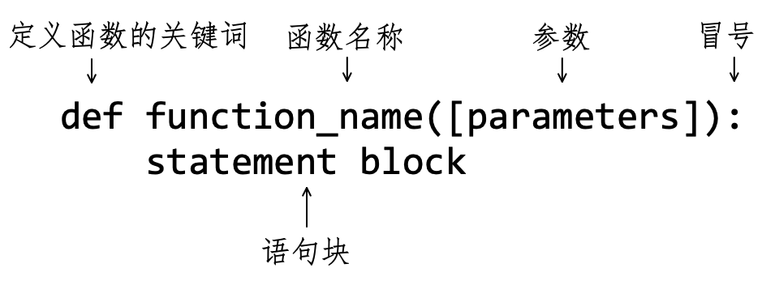
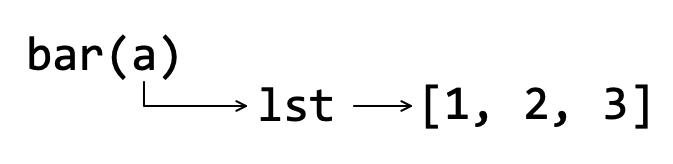
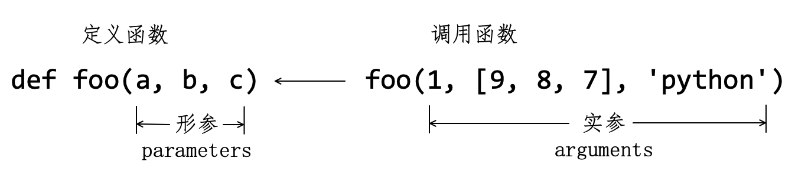
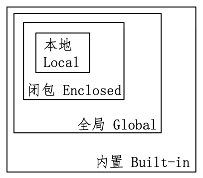

# 第7章 函数

> 子曰：三人行，必有我师焉。择其善者而从之，则其不善而改之。
>
> ——《论语》

函数是编程中应用非常多的一类对象（请注意这里的宾语“对象”，在本章7.3节会专门探讨）。此前我们已经多次使用过 Python 的内置函数，现在要亲自动手编写更有个性的函数。这是一件很有意思的事情，也伴随着一定的挑战。相信已经自学至此的读者能够攻克本章所遇到的难关。

## 7.1 定义函数

不论 Python 的内置函数还是模块中提供的函数（比如 `math.pow()` ），都是“别人”创造的，我们施行“拿来主义”，只是应用。但是，当“别人”定义的函数不能满足自己的需要时，就要“自力更生”，自己定义函数了。

### 7.1.1 基本格式

如图7-1-1所示，是自定义**函数**（Function）的基本格式。



<center>图7-1-1 定义函数</center>

按照此格式，写一个非常简单的函数（在 Python 交互模式中）：

```python
>>> def my_fun():       # (1)
...     print("this is a function")
...
>>> my_fun()
this is a function
```

注释（1）定义了一个名为 `my_fun` 的函数，此函数的功能非常简单，就是打印一行字符串。接下来的 `my_fun()` 是执行或者调用此函数，在 Python 交互模式中就显示了打印的结果。

有了初步体验之后，再对图7-1-1所示的定义函数的格式给予说明：

- `def` 是定义函数的关键词（英文 define 的前三个字母）。当 Python 解释器看到了这个关键词，就知道此处开始定义函数了。
- `function_name` 是函数的名称。按照 PEP 的要求，函数名称的命名方式与变量的命名方式和格式一样（参阅第2章2.3.2节）。
- 函数名称之后紧跟着 `([parameters])` ，函数名称和圆括号之间不能有空格，圆括号也不能省略。圆括号里面是这个函数的参数列表，如果此函数不需要参数，则可为空。例如注释（1）中定义的函数，就只有圆括号，其内部没有参数。
- 圆括号后面是英文状态下的冒号，表示此逻辑行结束，下面即将开始函数的语句块。
- 函数内部的语句块，由 Python 语句组成。

注释（1）所定义的函数的语句块只有一条语句，下面再定义一个有多条语句的函数。

```python
#coding:utf-8
"""
filename: myadd.py
"""
def add(x, y):
    '''
    This is an addition function.
    add(3, 4) -> 7
    '''
    r = x + y
    return float(r)
```

将这里定义的函数 `add()` 与图7-1-1所示的基本格式相对照，以下两点应特别注意：

- 在 `add()` 函数里面，用三个引号包裹的多行注释，称之为**函数的文档**。通常函数文档中编写对本函数的有关说明，如函数的作用、调用方法及返回值等——类似于 `.py` 程序文件开头的文档。

- 函数 `add()` 的语句块中有两个语句，其中 `return float(r)` 称为 **return 语句**。`return` 是 Python 的关键词，它的作用是将其后面的表达式的值返回到调用函数的位置。有的函数没有显示地写出 renturn 语句，Python 解释器会默认为 `return None` 。例如前面编写的函数 `my_func()` ：

  ```python
  >>> r = my_fun()
  this is a function
  >>> print(r)
  None
  ```

  注意，不要误认为 `my_fun()` 函数返回的是 `this is a function` ，这个字符串是 `print()` 的执行结果，不是 `my_fun()` 的返回值。上述代码已经显示，`my_fun()` 的返回值是 `None` 。

继续编写 `myadd.py` 程序，在前述函数的后面，编写如下代码：

```python
if __name__ == "__main__":    # (2)
    sum = add(2, 4)           # (3)
    print(sum)
```

注释（2）的内容姑且照抄（注意，`__name__` 和 `__main__` 中的下划线都是各侧有两个），在第11章11.1节中会给予解释。注释（3）中以 `add(2, 4)` 的方式调用所定义的函数，并且函数的返回值被变量 `sum` 引用。执行程序，结果如下：

```shell
% python myadd.py
6.0
```

初步了解了定义函数的基本格式之后，要想能熟练地写出自己所需要的函数，唯有多练习。

下面编写一个函数，实现字符串中字母大小写转化，即将某字符串中的大写字母，转化为小写字母；原来的小写字母则转化为大写字母。例如字符串 `'Python'` ，经此函数后转化为 `'pYTHON'` 。

请读者先按照要求自己尝试编写并调试，再参考下面的示例。

```python
#coding:utf-8
'''
filename: convertletter.py
'''
def convert(s):
    """
    convert upper and lower in a string.
    convert(string) -> string
    """
    lst = [e.upper() if e.islower() else e.lower() for e in s]
    return "".join(lst)

if __name__=="__main__":
    word = "Python"
    new_word = convert(word)
    print(f"{word} --> {new_word}")
```

程序执行效果：

```python
% python convertletter.py
Python --> pYTHON
```

当然，上述函数并非是实现需求的最佳选择，如果使用位运算（本书略去此内容，有兴趣的读者可以深入研究），会得到一个有点魔幻的函数：

```python
>>> def toggle(s):
...     return ''.join(chr(ord(c) ^ 32) for c in s)
...
>>> toggle("Python")
'pYTHON'
```

此处并不要求读者理解上述函数，只是想传达一个信息：本书中的代码，不是最优，希望读者能在学习过程中，探索优化方法——“尽信书，不如无书”（《孟子》）

> **自学建议**
>
> 编写函数，是对各类知识的综合运用，包括但不限于 Python 编程语言的知识、与问题相关的专业知识等。一般来讲，每个函数都是具有一定的抽象性，能够满足某一类常见的操作，比如前面所定义的加法函数 `add()` ，针对所有能够相加的两个对象并且所得的和能转化为浮点数的都适用。所以，在编写函数的时候，需要我们从具体的问题中抽象出一般的情况，分别设置好参数（数学中的的自变量）和返回值，在此基础上，编写“由参数到返回值”的语句。
>
> 说起来容易，要想真正掌握，必须要经过大量练习——熟能生巧。一定要避免“眼高手低”。

### 7.1.2 return 语句

了解了定义函数的基本格式之后，对其中的某些细节进行深入分析、透彻了解，才能定义出具有强大功能的函数。

以关键词 `return` 发起的语句，主要作用是终止当前函数，并返回指定的对象。

```python
>>> def foo():
...     print('before return')
...     return
...     print('after return')
...
>>> foo()
before return
```

在函数 `foo()` 中，关键词 `return` 后没有写任何对象，也构成了 return 语句，其作用与 `return None` 等效。观察对此函数的调用结果，发现 `return` 之前的语句被执行，之后的没有被执行。正如前所述，return 语句终止了当前函数，其后的语句不执行。

再看它能返回的对象，理论上说可以返回任意多个任何 Python 对象，当然，具体的数量以及对象类型要视实际情况而定。

```python
>>> def bar():
...     return 1, 2, 3
...
>>> a = bar()         # (4) 
>>> a
(1, 2, 3)
>>> b, c, d = bar()   # (5)
>>> b
1
>>> c
2
>>> d
3
```

这里定义的 `bar()` 函数返回了三个整数对象，以注释（4）的方式，变量 `a` 引用返回对象——自动将三个整数对象组装成元组，并通过赋值语句被变量 `a` 引用。注释（5）则使用三个变量，通过赋值语句依次对应引用 `bar()` 返回的每个整数对象。

```python
>>> def laoqi():
...     return dict(work='coder', age=30, gender='male')
...
>>> laoqi()['work']    # (6)
'coder'
```

函数 `laoqi()` 的 `return` 关键词后面是一个字典对象，注释（6）中 `laoqi()` 即调用此函数，并将字典对象返回到此位置，即得到了 `{'work': 'coder', 'age': 30, 'gender': 'male'}['work']` ，从而读取到键 `'work'` 的值 `'coder'` 。

高德纳（Donald Ervin Knuth）的名著《计算机程序设计艺术》（*The Art of Computer Programming*）被开发者奉为经典，其中记载了古老的斐波那契数列。1150年印度数学家 Gopala 首先描述了这个数列。在西方，最先研究这个数列的人是比萨的列奥那多（全名为： Leonardo Fibonacci ），他借用描述兔子生长的数目介绍了这个数列。

第一个月初有一对刚诞生的兔子， 第二个月之后（第三个月初）它们可以生育，每月每对可生育的兔子会诞生下一对新兔子（假设兔子永不死去）。假设在 $n$ 月总共有 $a$ 对兔子，$n+1$月总共有 $b$ 对兔子。那么在 $n+2$ 月必定总共有 $a+b$ 对兔子：因为在 $n+2$ 月的时候，前一月（ $n+1$ 月）的 $b$ 对兔子可以存留至第 $n+2$ 月（在当月属于新诞生的兔子，尚不能生育）；而新生育出的兔子对数等于所有在 $n$ 月就已存在的 $a$ 对。

将此过程写成数学式，即：

$$
\begin{split}\begin{cases}a_0 = 0&(n=0)\\a_1=1&(n=1)\\a_n=a_{n-1}+a_{n-2}&(n\ge2)\end{cases}\end{split}
$$

根据此数学式得到的数列，如：$0,1,1,2,3,5,8,13,21,\cdots$​​​ ，就是斐波那契数列。接下来的任务是研究如何用 Python 编写计算斐波那契数列的函数。

此问题相对之前的函数，显然有了一点点难度，但仍然希望读者能首先独立思考并尝试，之后再参考下文中的代码。

关于斐波那契数列的函数，本书中结合不同的学习内容给出多种写法，此处暂且提供其中的一个，请参考。

```python
#coding:utf-8
'''
filename: fibonacci.py
'''

def fibo_loop(n):
    result = [0, 1]
    for i in range(n-2):
        result.append(result[-2] + result[-1])
    return result

if __name__ == "__main__":
    fib_lst = fibo_loop(10)
    print(fib_lst)
```

程序调试结果：

```shell
% python fibonacci.py
[0, 1, 1, 2, 3, 5, 8, 13, 21, 34]
```

函数 `fibo_loop()` 中用循环语句实现了斐波那契数列（读者也可以将其中的 for 循环改为 while 循环）。这种方法简单，而且直接与数学表达式对应，容易理解。除了此方法之外，更常见的或许是用“递归”的方法来实现。

```python
def fibo_recur(n):
    if n <= 1:
        return n
    else:
        return (fibo_recur(n-1) + fibo_recur(n-2))

if __name__ == "__main__":
    fib_lst = [fibo_recur(i) for i in range(10)]
    print(fib_lst)
```

**递归**（Recursion）是一种算法，在函数的定义中使用函数自身，如上面定义的函数 `fibo_recur()` 所示，在函数体内的语句中使用本函数。虽然只要讲解递归算法，必然会以斐波那契数列函数为例，但不能由此认为斐波那契数列只能用递归方法实现，也不能认为用递归方法所实现的斐波那契数列函数就是最好的——恰恰相反。更何况，Python 发明人吉多·范罗索姆更讨厌在 Python 中使用递归（http://neopythonic.blogspot.com/2009/04/tail-recursion-elimination.html）。当然，对他的观点，业界也是有争论的。从学习者的角度看，以上列举的两种方法都应当理解和掌握——艺不压身，为此本书在7.5节专门介绍递归。

### 7.1.3 参数

图7-1-1所示的函数基本格式中，圆括号里面的参数是可选项。如果为空，即没有参数，如前面使用过的函数 `laoqi()` 那样。如果不为空，如7.1.2节中定义的 `fibo_loop()` 函数那样，在调用它的时候就要“向函数传对象”——注意带有引号的说法。在 Python 中，“向函数传对象”或者“向函数传值”、“向函数传参数”，这些说法的含义都是一样的，也都是简化了的俗语——不严格，但形象直接。

**1. 位置参数**

根据位置“向函数传值”是最常见的一种方式，并且也非常直接、简单——简称**位置参数**。例如：

```python
>>> def foo(a, b, c):
...     print(f"a = {a}, b = {b}, c = {c}")
...
>>> foo(1, "python", [9, 8, 7])
a = 1, b = python, c = [9, 8, 7]
```

函数 `foo()` 有多个参数，每个参数之间用逗号（英文状态）隔开。在 `foo(1, "python", [9, 8, 7])` 的圆括号内，有多个成员对象，每个对象依次与 `foo(a, b, c)` 中的 `a, b, c` 对应，即：

| Parameter |      | Argument    |
| --------- | ---- | ----------- |
| `a`       | ←    | `1`         |
| `b`       | ←    | `'python'`  |
| `c`       | ←    | `[9, 8, 7]` |

**Parameter**（参数）列中的是函数 `foo()` 的“参数”，**Argument**（论据）列中的是“对象”（或者称“实例”），通过位置对应关系，将 Parameter 与 Argument 建立映射关系。换个角度，函数中的 Parameter（参数）就是变量，所谓“向函数传值”就是将这些变量与对象建立引用关系——还是变量与对象的关系。诸如下面的说法都是在具体语境中的一种形象、简便且不很严谨的表述：

- “将 `1` 传给函数 `foo()` ”；
- “向函数 `foo()` 传入列表”；
- “给函数 `foo()` 传参数”；
- ……

类似的表述在本书中还会使用，但读者要了解其本质：建立参数（变量）与对象的引用关系。

```python
>>> lst = [1, 2, 3]       
>>> def bar(a):
...     print(f"a is {a}, id is {id(a)}")
...     a.append(99)                         # (7)
...     print(f"a is {a}, id is {id(a)}")
...
>>> bar(lst)
a is [1, 2, 3, 99], id is 140374963517312
a is [1, 2, 3, 99, 99], id is 140374963517312
>>> id(lst)
140374963517312
>>> lst
[1, 2, 3, 99, 99]
```

以上操作示例中，充分体现了“变量与对象之间的引用关系”：

- 在函数 `bar()` 外面创建了一个列表对象 `lst` ——这也是一种简化说法，本质是变量 `lst` 引用列表对象。
- 在函数 `bar()` 里面对参数 `a` 追加一个对象（如注释（7）所示）——实质上是调用参数或变量 `a` 所引用的对象的 `append()` 方法。
- “将 `lst` 传给函数 `bar(a)` ”的本质就是参数 `a` 与变量 `lst` 都引用了列表对象 `[1, 2, 3]` （如图7-1-2所示），因此，当函数内部注释（7）向该列表追加成员之后，函数外面的 `lst` 引用的列表内的成员也随之变化——内外列表本质是同一个对象。



<center>图7-1-2 参数与对象关系</center>

显然，“位置参数”强调位置对应关系，例如 `foo(1, [9, 8, 7], 'python')` 与前述示例的结果必然不同。

```python
>>> foo(1, [9, 8, 7], 'python')
a = 1, b = [9, 8, 7], c = python
```

不仅强调位置的顺序，对于类似于 `foo()` 那种形式的参数而言，对应的对象一个都不能少。

```python
>>> foo(1, [9, 8, 7])
Traceback (most recent call last):
  File "<stdin>", line 1, in <module>
TypeError: foo() missing 1 required positional argument: 'c'
```

读者如果阅读更多关于编程语言函数资料，常会看到**形参**（Formal Parameter）和**实参**（Actual Parameter）这两个术语。以函数 `foo()` 为例，如图7-1-3所示，当调用它时，圆括号内的对象就是函数的实参，即 Arguments（论据、实例）；定义它时，圆括号内的就是形参，即 Parameters（参数）。



<center>图7-1-3 形参与实参</center>

**2. 关键词参数**

如果像下面这样调用函数 `foo()` ：

```python
>>> foo(a=1, b='python', c=[9,8,7])
a = 1, b = python, c = [9, 8, 7]
>>> foo(a=1, c=[9,8,7], b='python')
a = 1, b = python, c = [9, 8, 7]
```

将形参与实参绑定，则不论次序如何，对象的引用关系不受影响。像这样“向函数传参数”的方式简称为**关键词参数**。注意，在关键词参数中，不能使用函数中不存在的形参，比如：

```python
>>> foo(a=1, c=[9,8,7], d='book')
Traceback (most recent call last):
  File "<stdin>", line 1, in <module>
TypeError: foo() got an unexpected keyword argument 'd'
```

并且数量也不能少。

```python
>>> foo(a=1, c=[9,8,7])
Traceback (most recent call last):
  File "<stdin>", line 1, in <module>
TypeError: foo() missing 1 required positional argument: 'b'
```

此外，关键词参数和位置参数可以混用。

```python
>>> foo(1, 'python', c=[9,8,7])
a = 1, b = python, c = [9, 8, 7]
```

特别要注意，在既有位置参数，又有关键词参数时，务必要将位置参数放在关键词参数前面，否则就会报错。

```python
>>> foo(1, b='python', [9,8,7])
  File "<stdin>", line 1
    foo(1, b='python', [9,8,7])
                              ^
SyntaxError: positional argument follows keyword argument
```

关键词参数的本质与前述一样，依然是建立了“参数（变量）与对象的引用关系”。

**3. 设置默认参数**

有的情况下，在定义函数的同时为形参设置一个默认的值，例如：

```python
>>> def bar(book, age, name='laoqi'):
...    print(f"{name}, a {age}-year-old coder, his book is {book}.")
...
>>> bar('ML', 30)
laoqi, a 30-year-old coder, his book is ML.
>>> bar('ML', 30, 'zhangsan')
zhangsan, a 30-year-old coder, his book is ML.
```

为 `bar()` 的形参 `name` 设置了默认值——注意，要放在未赋值的参数后面。如果以 `bar('ML', 30)` 的方式调用此函数，则使用此默认值。也可以用 `bar('ML', 30, 'zhangsan')` 修改 `name` 的默认值。

### 7.1.4 不检查类型

读者是否发现，在前述所写过的函数中，对参数的类型——形参应该引用什么类型的实参——没有要求声明，也没有在函数中检查类型。比如编写一个实现加法的函数：

```python
>>> def add(x, y): return x+y
...
```

因为在函数体内只有一条语句，所以可以写成一行。

用下面的方式调用此函数：

```python
>>> add(3, 4)
7
>>> add('learn', 'python')
'learnpython'
>>> add([1,2,3], [4,5,6])
[1, 2, 3, 4, 5, 6]
```

分别让 `add()` 的形参 `x, y` 引用了不同类型的 Python 对象，只要它们能够执行 “ `+` ” 运算符，函数就能正常执行，且返回值的类型也各不相同。这就是 Python 中函数的特点（这种特征在第8章8.6节会深入探讨）：

- 在定义函数的时候，不强制要求形参类型和返回值类型；
- 在调用函数的时候，不强制检查实参类型。

当然，这个特点有时候会带来一点点麻烦，比如：

```python
>>> add(4, 'book')
Traceback (most recent call last):
  File "<stdin>", line 1, in <module>
  File "<stdin>", line 1, in add
TypeError: unsupported operand type(s) for +: 'int' and 'str'
```

由于不强制参数类型，如果按照上述方式调用函数，就会报出异常。此类问题将运用第10章10.2节中所介绍的方法给予处理。

Python 为了照顾有其他编程语言习惯的开发者，以及“追求明确的强迫症”开发者，允许在定义函数的时候，对参数和函数返回值的类型给予说明。

```python
>>> def new_add(x:int, y:int)->int:
...     return x + y
...
>>> new_add(2, 4)
6
```

但是，这也只是“君子协定”和必要注释，旨在告知或者提醒开发者，而非强制执行，即使不遵守“君子协定”，只要符合 Python 语法，也依然“通行无阻”。

```python
>>> new_add('book', 'python')
'bookpython'
```

更甚者，还可以在定义函数时用类似形式对各参数及返回值给予更多注释，这并非总是画蛇添足，例如：

```python
>>> def kinetic_energy(m:'in kg', v:'in m/s')->'Joules':
...     return (m*v**2)/2
...
>>> kinetic_energy(10, 2)
20.0
```

这里定义了一个计算物体动能的函数 `kinetic_energy()` 。在物理量的计算中，特别强调单位。在定义此函数时，就以 `m:'in kg'` 的方式明确声明物体质量的单位——虽然也不是强制，但是提醒使用此函数的人，只有按照此处规定的单位制，才得到以焦耳（ Joules ）为单位的动能。

最后声明，是否要在函数中使用上述形式注释，根据具体情形而定。

> **自学建议**
>
> “以为上了书的就是对的，文化落后的中国农民至今还存着这种心理”（毛泽东，《反对本本主义》）。开发者亦如此，也很容易认为“权威”说的都是对的——某“大厂”的人说算法才是开发者的命根子，于是天天捧着一本漫画的入门读物；某“知名教授”说要知道前沿研究成果，于是装模作样读论文；某“大牛”说汇编语言才能让你懂得底层原理，于是自己就晕头转向了；……；这些都是应该反对的“本本主义”。
>
> 从更小的范畴来说，定义函数也要反对本本主义。自己所定义的函数，只要符合函数定义的基本格式，只要符合开发规范（不同开发团队会有各自的开发规范），只要能解决问题，就是一个“好”函数——“好”函数首先是可以用的、可以解决问题的函数，在此基础上，若能优化，再给予优化。

## 7.2 星号的作用

星号（ `*` ）已经在此前的学习中出现过，它可以作为乘法和乘方的运算符，也可以实现序列中的成员重复。对于函数而言，它的作用则体现在收集参数上。

### 7.2.1 收集参数

如果函数的参数个数是确定的，就用7.1节中的方式定义函数，但这个假设并不总成立。例如写一个计算人体一天所摄入能量的函数，参数为这一天所吃的东西，显然每一天所吃的食物的种类数并不都一样，即不能确定要提供多少个参数。这种情况下，就要“收集参数”。

**1. 收集位置参数**

定义函数时，参数前用一个星号（ `*` ）表示收集位置参数。

```python
>>> def computer_language(*lang):
...     print(lang)
...
>>> computer_language('python', 'java', 'rust', 'php')
('python', 'java', 'rust', 'php')
>>> computer_language('pascal', 'python')
('pascal', 'python')
```

函数 `computer_language()` 的参数 `lang` 前面有一个星号，当调用此函数时，可以输入任意多个位置参数——实参，这些实参都被收集到一个元组中，并被变量 `lang` 引用。

还可以这样：

```python
>>> def computer_language(lang, *others):
...     print(f"lang={lang}")
...     print(f"others = {others}")
...
>>> computer_language('python', 'php', 'c#')     # (1)
lang=python
others = ('php', 'c#')
```

函数 `computer_language()` 的形参由两部分组成，`lang` 同之前的参数含义，`*others` 则表示用 `others` 收集其余的实参。从注释（1）的调用中可知，`lang` 对应第一个对象 `'python'` ，其余对象则被收集到元组中，并被 `others` 引用。

下面编写一个函数，用它来挑选诸多数字中的质数（第6章6.6节曾编写了一个关于质数的程序，此处则使用另外一种判断质数的方法）。“诸多”表明个数不确定——当然，可以放到序列中循环，一个一个地判断。

```python
#coding:utf-8
'''
filename: choiceprime.py
'''
import math

def is_prime(n):
    if n <= 1:
        return False
    for i in range(2, int(math.sqrt(n))+1):
        if n % i == 0:
            return False
    return True

def choice(*args):
    return [i for i in args if is_prime(i)]

if __name__ == "__main__":
    prime_number = choice(1,3,5,7,9,11,13,15,17,19,21,23)
    print(prime_number)
```

函数 `is_prime()` 用于判断一个自然数是否为质数，参数的个数很明确（此函数的数学原理，请读者自行解决，此处不赘述）。函数 `choice()` 用于从若干个自然数中选择质数，备选的自然数的个数不确定，故使用 `*args` 收集参数。

执行程序，结果如下：

```shell
% python choiceprime.py 
[3, 5, 7, 11, 13, 17, 19, 23]
```

**2. 收集关键词参数**

对于关键词参数，可以使用两个星号 `**kwargs` 的形式收集。

```python
>>> def foo(**kwargs):
...     print(kwargs)
...
>>> foo(name='laoqi', age=30)
{'name': 'laoqi', 'age': 30}
>>> foo(a=1, b=2, c=3)
{'a': 1, 'b': 2, 'c': 3}
```

对函数 `foo()` 不论传入多少个关键词参数，均能收集为一个字典类对象——关键词参数创建了变量与对象的对应关系，并用两个星号后面的变量引用。

如果定义这样一个函数：

```python
>>> def bar(*args, **kwargs):
...     print(f"args = {args}")
...     print(f"kwargs = {kwargs}")
...
>>> bar(1, 2, 3, lang="python", author="laoqi")
args = (1, 2, 3)
kwargs = {'lang': 'python', 'author': 'laoqi'}
```

是不是囊括一切，很“万能”了。的确能够收集任何多个位置参数和关键词参数，但是不要认为这种“万能法宝”可以肆无忌惮地使用。在很多函数中，我们能够明确知道参数的个数，就不需要这种“万能”方式，毕竟在函数体内如果要用到那些对象，还必须给元组或字典“解包”（见7.2.2节）。

用一个星号或者两个星号收集参数，并不一定非要提供数量大于等于 $1$​ 的实参，也可以这样做：

```python
>>> bar(1, 2, 3)
args = (1, 2, 3)
kwargs = {}
>>> bar()
args = ()
kwargs = {}
```

不会报错，只是元组或字典为空罢了。

特别注意，下面的定义方式是错误的：

```python
>>> def bar(**kwargs, *args):
  File "<stdin>", line 1
    def bar(**kwargs, *args):
                      ^
SyntaxError: invalid syntax
```

7.1.3节提到过，位置参数必须在关键词参数之前，收集参数的写法也遵循这个原则。

### 7.2.2 解包

所谓**解包**，就是获得容器类对象中的成员。星号用于对容器的解包，其方法与7.2.1的收集参数类似。

```python
>>> lst = [1, 2, 3, 4, 5]
>>> *a = lst               # (2)
  File "<stdin>", line 1
SyntaxError: starred assignment target must be in a list or tuple
```

注释（2）的写法不正确，请注意如何修改：

```python
>>> *a, = lst
>>> a
[1, 2, 3, 4, 5]
```

虽然这么写没有报错，但根本没有实现“解包”的目的。“天生我材必有用”，它可以用在这里：

```python
>>> range(10)
range(0, 10)
>>> *r, = range(10)    # (3)
>>> r
[0, 1, 2, 3, 4, 5, 6, 7, 8, 9]
```

Python 内置函数 `range()` 返回的是可迭代的 range 对象，第6章6.3.1节曾用 `list()` 函数对其进行类型转换，才能读取到成员，这里使用注释（3）也可得到 range 对象中的成员。

根据列表的知识，如果要截取列表中的部分项，可以用切片操作实现，此外，还可以用下面的方式完成：

```python
>>> a, *b, c = lst    # (4)
>>> a
1
>>> b
[2, 3, 4]
>>> c
5
```

注释（4）分别用变量 `a` 和 `c` 引用了列表中第一项和最后一项，其余成员用 `b` 引用。

以此前写过的加法函数为例，会看到更精彩的解包操作：

```python
>>> def add(x, y):
...     return x + y
...
>>> num = [2, 3]
>>> add(*num)     # (5)
5
```

函数 `add()` 用以实现两个对象的 `+` 运算，列表 `num` 中有两个整数，如果让它们两个相加，一种解决方案是通过索引分别得到这两个数，即 `add(num[0], num[1])` 。现在用星号对这个容器解包，以注释（5）中的 `*num` 作为函数的实参，即可将其中的两个成员从序列中提取出来，作为函数 `add()` 的位置参数。

此外，还能以 `add()` 中的形参名称为键，创建一个字典，然后以下述代码中注释（6）的形式调用函数，从字典中解包出键值对，实现以关键词参数形式向函数传值。

```python
>>> d = {"x": 2, "y": 3}
>>> add(**d)    # (6)
5
```

在第4章4.2.7节学过字符串的一个方法 `format()` ，用于字符串格式化输出，其参数也可以用两个星号对字典解包（如下述代码注释（7）所示）。

```python
>>> painter = {'name': 'Laoqi', 'city': "Soochow"}
>>> "{name} is from {city}".format(**painter)    # (7)
'Laoqi is from Soochow'
```

此外，在容器的合并上，也能使用星号，让代码显得更简洁紧凑。

```python
>>> lst1 = [1, 2, 3]
>>> lst2 = [4, 5, 6]
>>> new_lst = [*lst1, *lst2]    # (8)
>>> new_lst
[1, 2, 3, 4, 5, 6]
```

将列表 `lst1` 和 `list2` 合并为同一个列表，可以使用 “ `+` ” 将两个列表链接起来，也可以使用注释（8）实现同样的操作。对于其他类型的容器，也可以：

```python
>>> t1 = (1, 2, 3)
>>> t2 = (3, 4, 5)
>>> (*t1, * t2)
(1, 2, 3, 3, 4, 5)
>>> s1 = {1,2,3}
>>> s2 = {3,4,5}
>>> {*s1, *s2}
{1, 2, 3, 4, 5}
```

对于字典，当然要用两个星号：

```python
>>> d1 = {'author': 'laoqi', 'lang':'python'}
>>> d2 = {'price': 66, 'age': 30}
>>> d = {**d1, **d2}
>>> d
{'author': 'laoqi', 'lang': 'python', 'price': 66, 'age': 30}
```

> **自学建议**
>
> 适时总结，是一种非常重要的自学方法。以本节所学习的“星号”为例，从乘法到解包操作，本书中都零零散散介绍过了。在学习过程中，如果觉得内容有点凌乱，很希望有人能将所有的东西总结到一张纸上的话，那么本书的读者就不要期望别人做这件事，要自己动手，才能构建起完整的、清晰的、能更新的知识结构。

## 7.3 函数是对象

从本书一开始，就在使用“对象”这个术语，并且前面几章一直在学习 Python 内置对象。本章学习的函数，在 Python 中也是对象。也正是由于这个特点，使得 Python 中的函数有很多更优异的表现，减少了编程的苦恼——保持秀发。


<center>图7-3-1 几种编程语言发明者</center>

### 7.3.1 第一类对象

**第一类对象**（First-class Object）这个术语是英国的计算机科学家克里斯托弗·斯特雷奇（Christopher Strachey）于20世纪60年代提出来的，意指能够作为参数传给其他函数或者“存入”一个变量的对象（对于 Python 语言就是能够被变量引用的对象）。前面所学习过的数字、字符串等内置类型的对象，都是第一类对象。而对于函数，在 Python 语言中是第一类对象，但在其他语言中，比如 C、C++语言中就不是第一类对象。

**1. 函数名称引用函数对象**

下面定义一个极简函数：

```python
>>> def foo(): pass  
...
```

函数 `bar()` 的函数体中只有 `pass` ，这是一个 Python 关键词，它也形成一个语句，表示在当前函数体中什么事情也不做。

```python
>>> foo
<function foo at 0x7fe70c6424c0>
```

`foo` 是函数名称，从上述返回结果可知，这个名称就引用（代表）了函数对象，`<function foo at 0x7fe70c6424c0>` 说明函数作为一个对象存在于内存之中，其内存地址是 `0x7fe70c6424c0` （以十六进制表示）。如果与一种内置对象对比，比如 `x = 3` ，其中的 `3` 是对象，变量 `x` 引用了此对象；此处的 `foo` 的作用与 `x` 相当，它是函数的名称，引用了函数对象。

**2. 函数对象用于赋值语句**

```python
>>> y = foo    # (1)
>>> y
<function foo at 0x7fe70c6424c0>
```

通过注释（1）的赋值语句——注意，不能写成 `y = foo()` ——变量 `y` 也引用了 `foo` 所引用的函数对象。下面是我们熟知的验证方法：

```python
>>> id(foo)
140630322062528
>>> id(y)
140630322062528
>>> hex(id(foo))    # 转化为十六进制
'0x7fe70c6424c0'
>>> hex(id(y))
'0x7fe70c6424c0'

>>> type(foo)
<class 'function'>
>>> type(y)
<class 'function'>
```

由此我们可以进一步理解“名称引用对象”的提法，不论是变量名称还是定义函数时所用的函数名称，在注释（1）中，它们引用了同样的对象，并且该对象能够被调用（关于对象的“可调用”，参阅第9章9.5.1节）。为了更清晰地理解“对象能够被调用”的效果，写一个能够打印信息的函数。

```python
>>> def bar():
...     print('calling a function')
...
>>> bar()
calling a function
```

再通过赋值语句，用另外一个变量引用上述定义的函数对象。

```python
>>> z = bar
```

名称 `z` 与名称 `bar` 引用了同一个函数对象，既然前面用 `bar()` 执行了此函数对象，那么 `z()` 也应该实现同样的操作效果。

```python
>>> z()
calling a function
```

果然如此。

在 Python 里有个统一的规定，只要在对象后面写上圆括号 `( )` ——有的时候圆括号中需要提供参数，就表示调用或者执行该对象。

当然，并非所有对象多能被调用，例如：

```python
>>> 3()
<stdin>:1: SyntaxWarning: 'int' object is not callable; perhaps you missed a comma?
Traceback (most recent call last):
  File "<stdin>", line 1, in <module>
TypeError: 'int' object is not callable
```

在异常信息中就明确告知，整数 `3` 这个对象不能调用——其原因请参阅第9章9.5.1节。

在本书中，通常用 `bar()` 这种形式表示函数，除了是跟普通变量名称区别之外，也是为了表示该对象可调用。

**3. 函数对象作为实参**

函数的实参，可以是任何 Python 对象，那么作为第一类对象的函数，自然也可以作为实参。

```python
>>> def inner_func():
...     print("this is inner function.")
...
>>> def out_func(f):
...     f()
...
```

函数 `inner_func()` 很平常，函数 `out_func()` 则不同以往，特殊之处就是函数内的 `f()` ，根据7.3.1所学可知，这是表示要执行 `f` 引用的对象。那么，在调用 `out_func()` 函数的时候，必须让 `f` 引用一个能够像这样 `f()` 执行的对象，否则就会报错，比如：

```python
>>> out_func(3)
Traceback (most recent call last):
  File "<stdin>", line 1, in <module>
  File "<stdin>", line 2, in out_func
TypeError: 'int' object is not callable
```

哪个函数适合呢？近在眼前：

```python
>>> inner_func()
this is inner function.
```

于是将此函数对象传给 `out_func()` ，即 `inner_func` 引用的函数对象做实参。

```python
>>> out_func(inner_func)    # (2)
this is inner function.
```

注释（2）中，将 `inner_func` 作为函数 `out_func()` 的实参——不要写成 `inner_func()` 。

不仅可以用自己定义的函数对象，还可用任何其他对象，只要能够用 `f()` 样式调用即可。

```python
>>> lst = [1, 2, 3, 4]
>>> out_func(lst.pop)    # (3)
>>> lst
[1, 2, 3]
```

`lst.pop` 也是函数对象——严格说是列表的方法，类似函数，也是对象。`lst.pop()` 能够删除列表最后一个成员，注释（3）就执行了此对象（没有显示返回值，是因为函数中没有将返回值用变量引用和打印），将列表的最后一个成员删除了。

还可以：

```python
>>> out_func(list)
```

函数 `list()` 是内置函数，它的名称 `list` 也同样引用的是该函数对象，`list()` 则是执行此函数对象，并创建空列表。

上述示例说明，函数对象可以作为函数的参数。

### 7.3.2 嵌套函数

嵌套函数，也是函数作为对象的体现：可以作为函数返回值，即 return 语句中的对象。

```python
>>> def out():
...     def inner():
...         print("this is inner.")
...     print("this is out.")
...     return inner
...
```

这里定义了两个函数：`out()` 和 `inner()` 。只不过这两个函数不是并列关系，而是函数 `inner()` 在函数 `out()` 里面，像这样的称为**嵌套函数**（Nested Function）。

```python
>>> inner()
Traceback (most recent call last):
  File "<stdin>", line 1, in <module>
NameError: name 'inner' is not defined
```

函数 `inner()` 没有在当前位置被定义（其原因参阅7.3.3节）。

```python
>>> out()
this is out.
<function out.<locals>.inner at 0x7fe70f9430d0>
```

执行了 `out()` 函数之后，将其内部定义的函数对象作为返回值返回到当前位置。跟其他函数返回值一样，也可以用一个变量引用返回的函数对象 `inner` 。

```python
>>> f = out()
this is out.
>>> f
<function out.<locals>.inner at 0x7fe70f9431f0>
>>> f()
this is inner.
```

变量 `f` 引用了函数对象 `inner` ，通过 `f()` 就可以调用（或执行）该对象，这样被定义在函数 `out()` 内部的 `inner()` 就能在当前位置执行了。

嵌套函数除了能说明函数是对象之外，还有别的什么用途吗？

有一类函数，能够产生其他函数，我们形象地称之为**工厂函数**（Factory Functions）。显然，嵌套函数就是工厂函数。

```python
#coding:utf-8
'''
filename: nestfunc.py
'''

def power_generator(num):
    def power_n(power):
        return num ** power
    return power_n

if __name__ == "__main__":
    power_two = power_generator(2)    # (4)
    power_three = power_generator(3)  # (5)
    print(power_two(8))               # (6)
    print(power_three(2))
```

此处定义了一个嵌套函数，函数 `power_n()` 实现了指数运算，但底数 `num` 是由外层函数 `power_generator()` 决定的，通过执行 `power_generator()` 能够得到计算指定底数的乘方运算函数，例如：

- 注释（4）生成了以 $2$​​ 为底的函数，即通过函数 `power_two()` 计算 $2^n$​​ ，其中 $n$​​ 是 `power_two()` 的参数，也就是 `power_n()` 的参数 `power` 。如 `power_two(8)` 计算 $2^8$ ；`power_two(10)` 计算 $2^{10}$ 等。 
- 同理，注释（5）生成了以 $3$​​ 为底的函数，专门用于计算 $3^n$​​ 。

当然，纯粹的指数运算，别的方法也可行。

如果再深入分析这个工厂函数，还会发现“与众不同”之处。例如注释（4），形参 `num` 引用了整数 `2` ，当该函数执行完毕，`num` 依然存在，体现在注释（6）的 `pwoer_two(8)` 中。这是因为嵌套在 `power_generator()` 内部的函数 `power_n()` 引用了 `num` 。用一种形象的方法描述此过程，注释（4）得到了一个包裹——函数对象 `power_n` ，`num` 是一个封闭在此包裹中的变量，不论包裹被快递送到哪里——比如注释（6），`num` 都会形影不离（因为被封闭在里面了）。像 `num` 这样的变量（即参数），称之为**自由变量**——随着包裹可以自由移动。像 `power_n()` 这样的类似于包裹的函数，称之为**闭包**（Closure）。

闭包这个术语是由英国计算机科学家彼得·约翰·兰丁（Peter John Landin）于1964年提出，后来因为在 Scheme 语言中的应用而广为流传。在现代编程语言中，所有将函数作为第一类对象的都可以实现闭包，Python 语言就是典型代表。其他没有将函数作为第一类对象的语言，比如 Java ，若要使用闭包，则需要通过类或者接口。

> **自学建议**
>
> 编程语言中有很多专门术语和概念，有的或许“望文生义”，能理解得差不多，有的则无法通过字面正确理解其含义。出现这种情况的原因，根本在于这些术语都是翻译过来的，由于历史、文化，特别是语言演变造成了“词不达意”的现象。比如最常见的“有理数”，是不是指“有道理的数”？，那么“无理数”就是“没道理的数”吗？显然不能如此望文生义。
>
> 所以，在学习的时候，务必要弄清楚每个术语的准确含义，理解其内涵。建议读者可以在学习的同时，在网上搜索有关术语的中文和英文，多阅读一些其他人对该术语的解读，特别是要阅读更接近于原始地、准确地表述的资料（多数是英文资料）。例如前面提到的“参数”，在中文资料中，“Parameter”和“Argument”都会翻译为“参数”，而其内涵则大相径庭（参阅7.1.3节）。

### 7.3.3 作用域

以7.3.2节定义的 `out()` 函数内的 `inner()` 函数为例，在 `out()` 函数所在的区域不能调用 `inner()` 函数（见7.3.2节中的报错信息），其根源即为这里介绍的**作用域**（Scope）。每个名称所引用的对象，都有各自的创建位置，也都有各自能够产生作用的区域，此区域称为作用域——在 Python 中，名称的作用域由其所在位置决定。Python 解释器会根据名称定义的位置和及其在代码中的引用位置来确定作用域，以下按照搜索顺序列出各个作用域（如图7-3-2所示）：

1. 本地作用域（或称“局部作用域”）：假设在一个函数中引用 `x`，解释器首先在该函数本地的最内部作用域内搜索它。
2. 闭包作用域（或称“嵌套作用域”）：如果 `x` 不在本地作用域中，Python 解释器将会在嵌套函数内部的函数中，即闭包作用域中搜索。
3. 全局作用域：姑且简单理解为一个 `.py` 文件中顶层所声明的变量能产生作用的区域。如果以上两个搜索都没有结果，那么解释器接下来会查看全局作用域。
4. 内置作用域：是由 Python 解释器定义的内置对象，Python 解释器启动时直接创建，结束时终止。如果在上述三个作用域找不到 `x` ，那么解释器将尝试搜索内置作用域。



<center>图7-3-2 作用域</center>

这就是 Python 语言中关于作用域搜索的 LEGB 规则。按照此顺序，如果找不到该变量或名称，则会抛出 `NameError` 异常。比如：

```python
>>> wo_xihuan_kan_laoqi_xiede_book
Traceback (most recent call last):
  File "<stdin>", line 1, in <module>
NameError: name 'wo_xihuan_kan_laoqi_xiede_book' is not defined
```

变量 `wo_xihuan_kan_laoqi_xiede_book` 肯定不会出现在当前的交互模式中的任何地方，Python 解释器依照 LEGB 规则找不到它。

又如：

```python
>>> x = 'global'
>>> def f():
...     print(x)    # (7)
...
>>> f()
global
```

根据 LEGB 规则，注释（7）中的 `x` 能在全局作用域中搜索到，故打印出 `'global'` 。如果创建一个嵌套函数，其内部的变量与全局作用域变量同名，如下述代码：

```python
>>> x = 'global'
>>> def f():
...     x = 'enclosing'
...     def g():
...         print(x)    # (8)
...     return g
...
>>> out = f()
>>> out()
enclosing
```

按照 LEGB 规则在闭包作用域中搜索到变量 `x` ，则 注释（8）打印的结果是 `'enclosing'` ，而不是 `'global'` 。

如果在 `g()` 里面再定义 `x` ，结果会如何？

```python
>>> def f():
...     x = 'enclosing'
...     def g():
...         x = 'local'    # (9)
...         print(x)
...     return g
...
>>> out = f()
>>> out()
local
```

在 `g()` 内部增加了注释（9），搜索的时候，先在本地作用域内找到了它，于是打印的结果为 `'local'` 。

理解了 Python 解释器对名称的搜索规则之后，再看如下示例：

```python
>>> a = 1
>>> def foo():
...     print(a + 1)    # (10)
...
>>> foo()
2
>>> a
1
```

毫无疑问，注释（10）中的变量 `a` 即为全局作用域中的 `a = 1` 。但是，如果这样做：

```python
>>> a = 1
>>> def bar():
...     a = a + 1
...     return a
...
>>> bar()
Traceback (most recent call last):
  File "<stdin>", line 1, in <module>
  File "<stdin>", line 2, in bar
UnboundLocalError: local variable 'a' referenced before assignment
```

对比函数 `foo()` 和 `bar()` ，逻辑上似乎没有什么差别，都是要将 `a` 增加 `1` ，在这里却报错了。

情节还会继续反转，稍加改动，就免除了异常（请仔细观察下面代码与上述代码的异同）：

```python
>>> def bar():
...     a = 1
...     a = a + 1
...     return a
...
>>> bar()
2
```

要想知其所以然，必须要从两个内置函数 `globals()` 和 `locals()` 说起。先看对这两个函数的最权威说明（分别来自之后 `help(globals)` 和 `help(locals)` 后的帮助文档）。

```
globals()
    Return the dictionary containing the current scope's global variables.
    # 返回含有当前作用域全局变量的字典
locals()
    Return a dictionary containing the current scope's local variables.
    # 返回含有当前作用域的局部（本地）变量的字典
```

下面就用这两函数一探究竟。为了看得清爽，请重启交互模式，再按照如下演示进行操作：

```python
Python 3.9.4 (v3.9.4:1f2e3088f3, Apr  4 2021, 12:32:44)
[Clang 6.0 (clang-600.0.57)] on darwin
Type "help", "copyright", "credits" or "license" for more information.
>>> x = 'foo'
>>> globals()
{'__name__': '__main__', '__doc__': None, '__package__': None, '__loader__': <class '_frozen_importlib.BuiltinImporter'>, '__spec__': None, '__annotations__': {}, '__builtins__': <module 'builtins' (built-in)>, 'x': 'foo'}
```

首先创建一个名为 `x` 的变量，然后执行 `globals()` 函数，返回的是一个字典，在这个字典中包含了刚才创建的变量及其所引用的对象。这就是 `globals()` 的作用，它以字典的形式返回当前全局作用域的成员（除了 `x` 之外，其他都是 Python 默认生成的）。

通常，我们通过变量的名称 `x` 访问它引用的对象，现在看到了上述返回的字典，可以通过它间接得到：

```python
>>> x
'foo'
>>> globals()['x']
'foo'
```

当然，一般的代码中是不会用 `globals()['x']` 的，这里只是在说明 `globals()` 函数的返回值。由此肯定会想到，如果给这个字典增加一个键值对，是不是相当于增加了一个全局作用域的变量?

```python
>>> globals()['y'] = 1000
>>> globals()
{'__name__': '__main__', '__doc__': None, '__package__': None, '__loader__': <class '_frozen_importlib.BuiltinImporter'>, '__spec__': None, '__annotations__': {}, '__builtins__': <module 'builtins' (built-in)>, 'x': 'foo', 'y': 1000}
>>> y
1000
```

的确如此。因为 `globals()` 的返回值就是字典，甚至于还可以通过它修改全局作用域变量的值（建议读者自己尝试）。

另外一个内置函数 `locals()` ，与 `globals()` 类似：

```python
>>> def f(p, q):
...     s = "python"
...     print(locals())
...
>>> m, n = 1, 2
>>> f(m, n)
{'p': 1, 'q': 2, 's': 'python'}
```

在函数 `f()` 中调用 `locals()` 时，`locals()` 返回了表示函数的本地作用域的字典。注意，除了本地定义的变量 `s` 之外，本地作用域还包括函数参数 `p` 和 `q` ，它们也在 `f()` 的本地作用域内。

现在回到前面反复反转的问题上：

```python
>>> a = 1
>>> def bar():
...     a = 1
...     print(locals())    # (11)
...     a = a + 1
...     print(locals())    # (12)
...     return a
...
>>> bar()
{'a': 1}
{'a': 2}
2
>>> globals()
{'__name__': '__main__', '__doc__': None, '__package__': None, '__loader__': <class '_frozen_importlib.BuiltinImporter'>, '__spec__': None, '__annotations__': {}, '__builtins__': <module 'builtins' (built-in)>, 'a': 1, 'bar': <function bar at 0x7fc34c65d430>}
```

为了观察方便，增加了注释（11）和（12）两行，分别打印出执行到该行时的本地作用域字典。从输出结果中可知，在 `bar()` 函数内的本地作用域中有变量 `a` 及其相应的值。此外，`globals()` 的返回值显示，在全局作用域中有 `a = 1` 。这说明，在本地作用域不能修改全局作用域中的变量。

如果去掉注释（11）前面 `a = 1` ，即成为执行后会报错的那个函数：

```python
>>> def bar():
...     print(locals())
...     a = a + 1        # (13)
...     print(locals())
...     return a
...
>>> bar()
{}
Traceback (most recent call last):
  File "<stdin>", line 1, in <module>
  File "<stdin>", line 3, in bar
UnboundLocalError: local variable 'a' referenced before assignment
```

注释（13）之前，在本地作用域中没有变量 `a` ，注释（13）试图通过赋值语句创建一个本地作用域的变量 `a` ，然而该赋值语句右侧又用到变量 `a` ，由于与在本地试图创建的变量同名，故将它视为本地作用域的变量，又因为这个变量此前没有定义，这就相当于用一个没有定义的变量与整数 `1` 做加法。故必然报错。

或许读者会说，“我的意思是注释（13）中等号右侧的变量 `a` 是全局作用域中定义的 `a = 1`”，可惜 Python “不懂我的心”。《Python 之禅》中有这样一句：“明瞭优于隐晦”（参阅第1章1.4节），所以那些“你懂得我的意思就是意思意思”的表述，不要出现在程序中。

```python
>>> a = 1
>>> def bar():
...     global a        # (14)
...     print(locals())
...     a = a + 1
...     print(locals())
...     return a
...
>>> bar()
{}
{}
2
>>> globals()
{'__name__': '__main__', '__doc__': None, '__package__': None, '__loader__': <class '_frozen_importlib.BuiltinImporter'>, '__spec__': None, '__annotations__': {}, '__builtins__': <module 'builtins' (built-in)>, 'a': 2, 'bar': <function bar at 0x7fc34c65d430>}
>>> a
2
```

注释（14）是一条语句，用以声明在 `bar()` 中出现的变量 `a` 指向全局作用域中的变量 `a`。虽然本地作用域中依然没有变量 `a` ，也不会影响 `a = a + 1` 的执行。并且，当使用 `globals()` 查看全局作用域时，发现 `a` 的值已经是 `2` 。

`global` 是 Python 关键词，它的作用就是声明某变量为全局作用域变量。再如：

```python
>>> name
Traceback (most recent call last):
  File "<stdin>", line 1, in <module>
NameError: name 'name' is not defined
>>> def book():
...     global name
...     name = 'learn python'
...
>>> book()
>>> name
'learn python'
```

本来全局作用域中不存在变量 `name` ，但是在函数 `book()` 中用 global 语句声明了一个名为 `name` 的全局作用域变量，当此函数执行之后，在全局作用域中就有 `name` 了。这说明 `global` 语句可以在任何需要的地方指定全局作用域的变量。

```python
>>> def f():
...     x = 20      # (15)
...     def g():
...         x = 40  # (16)
...     g()
...     print(x)
...
>>> f()
20
```

注释（15）的变量 `x` 在 `f()` 内（闭包作用域），不是全局作用域内。注释（16）的 `x = 40`（本地作用域）不会对注释（15）中的同名变量做出修改。当 `g()` 执行之后，闭包作用域中的 `x` 仍然是 `20` 。即使在注释（16）前面增加 `global x` 也不能修改 `x` 的值。

```python
>>> def f():
...     global x
...     x = 20
...     def g():
...         x = 40
...     g()
...     print(x)
...
>>> f()
20

>>> def f():
...     x = 20
...     def g():
...         global x
...         x = 40
...     g()
...     print(x)
...
>>> f()
20
```

有没有办法在 `g()` 内部修改闭包作用域中的 `x` 呢？当然有，使用另外一个关键字 `nonlocal` ，用它发起一个语句。

```python
>>> def f():
...     x = 20
...     def g():
...         nonlocal x    # (17)
...         x = 40
...     g()
...     print(x)
...
>>> f()
40
```

在注释（17）之后，当 `g()` 中创建 `x` 时，它指的是最近的闭包作用域内的 `x` ，其定义在 `f()` 中。于是 `print()` 的结果显示为 `40` 。

必须要说明，在程序中使用 `global` 或 `nonlocal` 一定要谨慎，因为它们都会产生副作用。一般认为修改全局作用域中的变量不是明智之举，这不仅针对 Python ，其他编程语言亦如此。

### 7.3.4 装饰器

在理解了嵌套函数的基础上，请读者耐心阅读以下代码。

```python
#coding:utf-8
'''
filename: decorate.py
'''

def book(name):
    return f"the name of my book is {name}"

def p_decorate(func):
    def wrapper(name):
        return f"<p>{func(name)}</p>"
    return wrapper

if __name__ == "__main__":
    my_book = p_decorate(book)    # (18)
    result = my_book("PYTHON")    # (19)
    print(result)
```

先看执行结果，再解释程序。

```shell
% python decorate.py 
<p>the name of my book is PYTHON</p>
```

函数 `book()` 是一个普通的函数，函数 `p_decorate()` 是嵌套函数，外层函数的参数 `func` 所引用的对象必须可执行，并且是 `func(name)` 形式，正好 `book()` 函数可以满足（其它满足要求的函数亦可，这里仅以 `book()` 为例）。根据对嵌套函数的理解，注释（18）得到了闭包，注释（19）执行写在 `p_decorate()` 函数里面的 `wrapper()` 函数对象。最后打印返回值。

注意观察注释（19）执行后的返回值，已经与 `book()` 函数中的返值不同。由此结果可以说，函数 `book()` 的行为（例如返回对象）经过注释（18）后发生了改变，即被函数 `p_decorate()` 改变了——这种改变并不是重写 `book()` 函数，而是基于该函数原内容的变化。就如同一个女子或是“对镜贴花黄”或是“云鬓蓬松眉黛浅”，皆因化妆不同而看起来有不同的状态。于是可将函数 `p_decorate()` 类比于“花黄”，也给它取了一个形象的名字，称它是 `book()` 函数的**装饰器**（Decorator）。根据注释（18）可知，装饰器包裹一个函数之后，即改变其行为。

英国计算机科学家彼得·约翰·兰丁在研究闭包的同时（参阅7.3.2节），发明了**语法糖**（Syntactic Sugar）这个术语，意指编程语言中的一种语法，该语法只是让程序更简洁，可读性更强，并不影响功能。Python 语言中有以 `@symbol` 的形式实现装饰器语法糖。

将 `decorate.py` 中的程序修订如下，注意其中语法糖的运用。

```python
#coding:utf-8
'''
filename: decorate.py
'''

def p_decorate(func):
    def wrapper(name):
        return f"<p>{func(name)}</p>"
    return wrapper

@p_decorate                         # (20)
def book(name):
    return f"the name of my book is {name}"

if __name__ == "__main__":
    # my_book = p_decorate(book)
    # result = my_book("PYTHON")
    result = book("Learn Python")    # (21)
    print(result)
```

函数 `p_decorate()` 必须在 `book()` 之前，然后在函数 `book()` 上面增加了注释（20），即装饰器语法糖，再用注释（21）调用 `book()` 函数，其效果与修改前的程序等同。

```python
% python decorate.py
<p>the name of my book is Learn Python</p>
```

甚至于可以编写多个装饰器，以语法糖的形式，将其作用于一个函数，例如：

```python
#coding:utf-8
'''
filename: moresugar.py
'''
def p_decorate(func):
    def wrapper(name):
        return f"<p>{func(name)}</p>"
    return wrapper

def div_decorate(func):
    def wrapper(name):
        return f"<div>{func(name)}</div>"
    return wrapper

@div_decorate
@p_decorate
def book(name):
    return f"the name of my book is {name}"

if __name__ == "__main__":
    result = book("PYTHON")
    print(result)
```

执行结果是：

```python
% python moresugar.py 
<div><p>the name of my book is PYTHON</p></div>
```

学习了装饰器和语法糖的基本用法之后，就要看看它们在实践中如何使用。下面就编写一个用于测量函数执行时间的装饰器。

```python
#coding:utf-8
'''
filename: timing.py
'''
import time

def timing_func(func):
    def wrapper():
        start = time.time()
        func()
        stop = time.time()
        return (stop - start)
    return wrapper

@timing_func
def test_list_append():
    lst = []
    for i in range(0, 100000):
        lst.append(i)

@timing_func
def test_list_compre():
    [i for i in range(0, 100000)]

if __name__ == "__main__":
    a = test_list_append()
    c = test_list_compre()
    print("test list append time:", a)
    print("test list comprehension time:", c)
    print("append/compre:", round(a/c, 3))
```

程序执行结果（不同性能的计算机，以下结果的数值可能有所不同）：

```python
% python timing.py 
test list append time: 0.012425422668457031
test list comprehension time: 0.004575967788696289
append/compre: 2.715
```

将装饰器语法糖分别作用于两个函数，测量它们的执行时间。不仅程序显得简洁，且可读性强。另外，执行结果再次说明列表解析是必须要掌握的（参阅第6章6.4节）。

虽然我们是在嵌套函数的基础上引入了装饰器，但装饰器并不完全等同于嵌套函数，普通函数也能够作为装饰器，比如：

```python
#coding:utf-8
'''
filename: decosimplyfunc.py
'''

import random
PLUGINS = dict()     # (22)

def register(func):
    PLUGINS[func.__name__] = func
    return func

@register
def say_hello(name):
    return f"Hello {name}"

@register
def be_awesome(name):
    return f"Yo {name}, together we are the awesomest!"

def randomly_greet(name):
    greeter, greeter_func = random.choice(list(PLUGINS.items()))
    print(f"Using {greeter!r}")
    return greeter_func(name)

print(PLUGINS)
calling_func = randomly_greet('laoqi')
print(calling_func)
```

先看执行结果，再解释代码：

```shell
% python decosimplyfunc.py
{'say_hello': <function say_hello at 0x7ff4b2d52700>, 'be_awesome': <function be_awesome at 0x7ff4b2d52790>}
Using 'say_hello'
Hello laoqi

# 再次执行
% python decosimplyfunc.py
{'say_hello': <function say_hello at 0x7fb36d652700>, 'be_awesome': <function be_awesome at 0x7fb36d652790>}
Using 'be_awesome'
Yo laoqi, together we are the awesomest!
```

注释（22）中以 `PLUGINS` 命名变量，通常用它表示“全局变量”，即在整个程序中都使用的变量。这也是约定俗成，并非强制。

以函数 `register()` 为装饰器，用语法糖的形式“装饰”了函数 `say_hello()` 和 `be_awesom()` ，则 `PLUGINS` 引用的字典中含有这两个函数对象（请观察执行结果）。函数`randomly_greet()` 从字典中随机选出一个函数，并执行。

这里仅介绍了装饰器的初步知识，读者在理解本节内容基础上，可以于此后对相关应用进行深入研究。

> **自学建议**
>
> 回想以前学习数学、物理的时候，对于基本概念、定理、定律，以及老师讲解的例题，都能听懂，但自己解题的时候，总是错不少，可以概括为“一听就懂，一做就错”（天才除外）。现在学习编程，也有会有类似的经历（天才除外）。基本语法容易掌握，但面对实际问题时总感觉不知所措。
>
> 如何破解？
>
> 方法就是师长们谆谆教诲“要努力、要勤奋”——他们没有打诳语，倒是我们总觉得会有“成功的捷径”，甚至觉得那些都是陈词滥调，不如“名人”们热销的“我的成功可以复制”。除了天才、神童和有奇遇者之外，一般都要“闻鸡起舞奏晨曲，悬梁刺股伴灯黄”，才能对某个方向的知识“了然于胸”，并运用自如。

## 7.4 函数式编程

**函数式编程**（Functional Programming）是一种编程范式，虽然不是本书重点阐述的内容，但 Python 语言很早就已经采用了一些函数式编程的概念，如1994年发布的 Python 版本中就已经有了 `map()`、`reduce()`、`filter()` 和 `lambda` 运算。之所以 Python 能支持函数式编程，是因为函数在 Python 中是第一类对象（参阅7.3.1节）。

本书不会深入介绍函数式编程（本节的命名显然有所夸大），如果对这种编程范式有兴趣，或者今后工作中会用到，建议自行阅读有关专业资料。下面只介绍与 Python 函数式编程有关的几个函数，这些函数在通常的程序中也较为常见。

### 7.4.1 lambda 函数

Python 语言中用 `def` 定义的函数无一例外都有函数名称（也可以用于函数式编程），而用关键词 `lambda` 所创建的函数是一个匿名函数，可以把它看做是一个 lambda 表达式。其语法如下：

```shell
lambda <parameter_list>: <expression>
```

- `lambda` ：关键词；
- `<parameter_list>` ：用逗号（英文）分割的参数（即形参）；
- `:` ，英文状态下的冒号，分割参数与表达式；
- `<expression>` ：使用参数的表达式。

例如，有这样的函数（用 `def` 创建）：

```python
>>> def add(x, y): return x + y
...
>>> add
<function add at 0x7fae31d44550>
>>> add(2, 3)
5
```

根据 lambda 表达式的语法，将函数 `add()` 改写为：

```python
>>> lambda x, y: x + y
<function <lambda> at 0x7fae31d44430>
```

由此可知，由 `lambda` 关键词所创建的所谓表达式，实际上是一个函数对象，称为 **lambda 函数**，只不过由于它没有名字，我们不能像 `add()` 函数那样，使用其名称 `add` 来引用它。但是，既然它是对象，就可以通过赋值语句将它用变量引用。所以：

```python
>>> add_lam = lambda x, y: x + y
>>> add_lam
<function <lambda> at 0x7fae31d44430>
```

现在变量 `add_lam` 引用了一个 lambda 函数对象，如果调用该对象，与之前调用函数的方法则无异。

```python
>>> add_lam(2, 3)
5
```

此外，也可以这样给 lambda 函数传实参。

```python
>>> (lambda x, y: x + y)(2, 3)
5
```

显然，第一组圆括号内的就是 lambda 函数对象本身。

lambda 函数的最大特点就是以一个逻辑行代码创建了匿名函数。在某些应用中这样的代码会更简洁，应用得当可读性也很好。 

例如判断 `range(-5, 5)` 中每个数是否大于 `0` ，用 lambda 函数可以写成：

```python
>>> [(lambda x: x>0)(n) for n in range(-5, 5)]
[False, False, False, False, False, False, True, True, True, True]
```

如果这样写：

```python
>>> [x > 0 for x in range(-5, 5)]
[False, False, False, False, False, False, True, True, True, True]
```

会显得更简洁，可读性更强。

所以，不要有了锤子，看任何东西都是钉子。

关于 lambda 函数，后续还会用到。

### 7.4.2 map() 函数 

`map()` 是 Python 内置函数，它的基本调用格式是（来自于帮助文档）：

```shell
map(func, *iterables) --> map object
```

- 参数 `func` 引用一个函数对象；
- 参数 `*iterables` 收集多个可迭代对象，对象的成员依次作为 `func` 的实参。
- 返回值 `map object` 是一个迭代器对象（关于迭代器对象，请参见第9章9.6节）。 

例如7.4.1节中演示过的一个并不太好的写法：

```python
>>> [(lambda x: x>0)(n) for n in range(-5, 5)]
[False, False, False, False, False, False, True, True, True, True]
```

用 `map()` 函数改写，会显得更紧凑简洁。

```
>>> m = map(lambda x: x > 0, range(-5, 5))
>>> m
<map object at 0x7fe1585559a0>
>>> list(m)
[False, False, False, False, False, False, True, True, True, True]
```

变量 `m` 引用的对象即为 `map()` 函数的返回值——迭代器对象，通过 `list(m)` 可以查看迭代器对象的成员，与之前所得一样。类似的操作还可以有：

```python
>>> r = map(lambda x: x**2, range(0, 20, 2))
>>> list(r)
[0, 4, 16, 36, 64, 100, 144, 196, 256, 324]
```

显然，上述结果也可以使用列表解析的方式得到：

```python
>>> [i ** 2 for i in range(0, 20, 2)]
[0, 4, 16, 36, 64, 100, 144, 196, 256, 324]
```

很多时候，列表解析与 `map()` 函数可以互相替代，在实际应用时读者可以根据情况选择。

再举一个例子，假设有三个列表，`lst1 = [1, 2, 3, 4, 5],  lst2 = [6, 7, 8, 9, 0], lst3 = [7, 8, 9, 2, 1]` ，将这三个列表中对应成员相加。根据前面的经验，至少可以有两种实现方式（请读者自行先尝试，再看下面的代码）。

```python
>>> lst1 = [1, 2, 3, 4, 5]
>>> lst2 = [6, 7, 8, 9, 0]
>>> lst3 = [7, 8, 9, 2, 1]

# 列表解析
>>> [x + y + z for x, y, z in zip(lst1, lst2, lst3)]
[14, 17, 20, 15, 6]

# map() 函数
>>> r = map(lambda x, y, z : x + y + z, lst1, lst2, lst3)
>>> list(r)
[14, 17, 20, 15, 6]
```

这个示例中 `map()` 函数的 `*iterables` 参数收集了三个可迭代对象。

此外，参数 `func` 不一定总是 lambda 函数，任何函数对象均可以。

```python
>>> def add(x):
...     return x ** 2
...
>>> list(map(add, range(0, 10)))
[0, 1, 4, 9, 16, 25, 36, 49, 64, 81]
```

### 7.4.3 filter() 函数

单词 filter 的中文含义是“过滤器”，在 Python 中，内置 `fileter()` 函数的作用也是如此，其帮助文档显示：

```shell
filter(function or None, iterable) --> filter object
```

第一个参数是函数对象或者 `None` ，第二个参数是可迭代对象。执行 `filter()` 函数，可迭代对象中的成员传给前面的函数对象，作为其实参。如果该函数返回的是 `True` ，那么这个成员就被放到一个名为“filter object”的迭代器中， `filter()` 函数最后返回的就是这个迭代器对象。

例如：

```python
>>> f = filter(lambda x: x > 0, range(-5, 5))
>>> f
<filter object at 0x7fe15822a700>
>>> list(f)
[1, 2, 3, 4]
```

 变量 `f` 引用的对象就是 `filter()` 函数返回的 filter 对象，通过 `list()` 转化之后看到所包含的成员，的确是根据所定义的 lambda 函数筛选之后的数值。

当然，时刻不要忘记，列表解析还是继续可用。

```python
>>> [i for i in range(-5, 5) if i > 0]
[1, 2, 3, 4]
```

 对于 `filter()` 的 `function` 的实参，除了 lambda 函数之外，也可以是任何函数对象。

```python
>>> langs = ['python', 'PHP', 'Java', 'PER', 'Go']
>>> def all_caps(s):
...     return s.isupper()
...
>>> list(filter(all_caps, langs))
['PHP', 'PER']
```

当然，上面的代码也可以用 lambda 函数改写，请读者自行尝试。

本节借用函数式编程的名义，介绍了 `map()` 和 `filter()` 两个内置函数以及 lambda 函数。从内容中读者也能认识到，这些函数均可以用以往学过的函数、列表解析等替代。所以，它们并非编程中的必须，只是可选项。

### 7.4.4 运用内置函数

第3章3.3.1节曾简要介绍了与数学运算相关的 Python 内置函数，其实本节中的 `map()` 和 `filter()` 也是内置函数的一员。Python 内置函数所针对的通常是一些基础需求，在自定义函数中，如果恰当使用内置函数，不仅能缩短代码行数，更能增强可读性，乃至于优化性能。例如写一个函数判断列表容器中的字符串成员是否有回文（关于回文，请参阅第4章4.2.5节)，下面的函数 `contains_palindrome()` 是一种可行的方法：

```python
#coding:utf-8
'''
filename: palindrome.py
'''

def contains_palindrome(words):
    for word in words:
        if word == ''.join(reversed(word)):
            return True
    return False

if __name__ == '__main__':
    lst = ['why', 'your', 'eye', 'is', 'large']
    print(contains_palindrome(lst))
```

程序的执行结果：

```shell
% python palindrome.py
True
```

字符串 `lst` 中的成员 `'eye'` 是回文，因此 `contains_palindrome()` 返回了 `True` 。下面要用内置函数 `any()` 改造 `contains_palindrome()` 函数内的代码。

```python
def contains_palindrome_s(words):
    return any(word == ''.join(reversed(word)) for word in words)
```

读者通过 `help(any)` 不难理解 `any()` 的作用。

```python
>>> lst = ['why', 'your', 'eye', 'is', 'large']
>>> b = [word == ''.join(reversed(word)) for word in lst]
>>> b
[False, False, True, False, False]
>>> any(b)
True
```

`[word == ''.join(reversed(word)) for word in lst]` 以列表解析得到了一个用布尔值标识 `lst` 中的成员是否是回文的列表，并可以将此列表作为 `any()` 的参数。

但是，在函数 `contains_palindrome_s()` 中并没有使用列表解析，而是使用了第9章9.7节将要学习的生成器解析，其中道理请参阅该节内容。

与 `any()` 函数类似的另外一个内置函数是 `all()` ，留个读者探索使用它的时机。

除了这两个内置函数之外，其他内置函数也当然要在编程中恰当应用。

> **自学建议**
>
> 不使用本节的内容，也可以完成编程任务。为什么还要单独用一节来介绍呢？首先是给读者们以“装酷”的工具，本节的所介绍的这三个函数在形式上都非常简洁，能够让你的代码看起来更紧凑。再有，在编程实践中也经常用到，这些内容即使你不用，别人可能会用，特别是阅读一些代码的时候，看到了这三个函数不应诧异。
>
> 还要注意，代码写出来之后，很多时候是给人看的，所以，其“可读性”永远占据重要地位的，不能追求让人“不明白但觉得很厉害”。

## 7.5 递归

在7.1.2节编写斐波那契数列函数的时候，使用了 Python 中的**递归**（Recursion）。固然 Python 创始人对递归有个人的看法，此处还是要用单独一节专门给予介绍。等读者阅读完本节内容，也能理解之所以如此重视递归的原因了。

### 7.5.1 了解递归

递归的英文单词 “recursion” 来自拉丁语中的 recurre，意思是：匆匆而归、返回、还原或重现。各类资料中对递归的定义虽有所不同，但综合来看，都有“在被定义的对象中使用定义本身”的含义，例如：

```python
>>> def func():
...     x = 7
...     func()
...
```

在所定义的函数 `func()` 内调用 `func()` 自身，这就是递归的表现形式。运用7.3.3节有关变量作用域的知识来理解函数 `func()` 的执行过程，第一次执行的时候，会创建 `x = 7` ；然后调用 `func()` 自身，这是第二次运行，再次创建 `x = 7` ，但是与前面的 `x` 处于不同的作用域，所以二者不会发生冲突。

不幸的是，如果真的执行执行上面的所定义的 `func()` 函数，会得到不太好的结果，如下所示：

```python
>>> func()
Traceback (most recent call last):
  File "<stdin>", line 1, in <module>
  File "<stdin>", line 3, in func
  File "<stdin>", line 3, in func
  File "<stdin>", line 3, in func
  [Previous line repeated 996 more times]
RecursionError: maximum recursion depth exceeded
```

理论上讲，`func()` 函数会永远执行，一遍又一遍地调用自己，而没有任何返回值。在实践中，绝对不允许出现这样的递归。Python 解释器会自动限制递归的深度，当达到该极限值时，会引发 `RecursionError` 异常，如上所示。如果想了解当前 Python 解释器的限制是多少，可以使用 sys 模块中的 `getrecursionlimit()` 函数。

```python
>>> from sys import getrecursionlimit
>>> getrecursionlimit()
1000
```

以上所得到的返回值 `1000` 是 Python 解释器默认的对递归次数的限制值，即最多能够重复调用 `func()` 函数自身的次数。也可以用此模块中的 `setrecursionlimit()` 函数修改此值。

```python
>>> from sys import setrecursionlimit
>>> setrecursionlimit(200)
>>> getrecursionlimit()
200
>>> func()
Traceback (most recent call last):
  File "<stdin>", line 1, in <module>
  File "<stdin>", line 3, in func
  File "<stdin>", line 3, in func
  File "<stdin>", line 3, in func
  [Previous line repeated 196 more times]
RecursionError: maximum recursion depth exceeded
```

从返回的异常信息中，可以看到修改后的效果。

在真正的递归算法中，如同7.1.2节的斐波那契数列函数那样，必须有一个终止条件，即不需要进一步递归，就可以直接得到结果。在不满足终止条件时，每次递归都要逐渐接近此终止条件。例如编写一个“倒数计数”的函数——所谓“倒计时”，如： `5, 4, 3, 2, 1, 0` 。

```python
>>> def count_down(n):
...     print(n)
...     if n == 0: return     # (1)
...     else:
...         count_down(n-1)   # (2)
...
>>> count_down(5)
5
4
3
2
1
0
```

其中，注释（1）就是终止条件，当 `n` 为 `0` 时停止递归；否则，如注释（2），调用所定义的函数，其参数为 `n-1` ，逐渐接近终止条件。

注意，上面的写法纯粹是为了突出递归和终止条件，还可以有一种更简洁的表达方式：

```python
>>> def count_down(n):
...     print(n)
...     if n > 0: count_down(n-1)
...
>>> count_down(5)
5
4
3
2
1
0
```

当然，因为以上函数中没有对 `n` 做任何检查和限制，如果执行 `count_down(-5)` ，则不会执行“倒计时”。读者如果有兴趣，可以继续对上述函数进行优化。

其实，在大多数情况下，编程中可以不用递归，即递归通常是不必须的——所以会有“递归已死”的观点。比如上面的“倒计时”，也可以用 while 循环实现。

```python
>>> def count_down(n):
...     while n >= 0:
...         print(n)
...         n -= 1
...
>>> count_down(5)
5
4
3
2
1
0
```

比较两种不同的实现方式，从可读性角度来看，都一样清晰直观。

### 7.5.2 阶乘

阶乘是所有介绍递归的资料中都必须要选择的案例，本书也不免俗。其数学定义如下：

$$
n! = 1\times2\times\cdots\times n
$$

如果用适合于应用递归的方式表示，则为：

$$
n!=\begin{cases}1 & n=0,1\\n\times(n-1)! & n\ge 2\end{cases}
$$

与上面的示例一样，基本事件是不需要递归就可以实现的；更复杂的事件则可简化，也就是将其简化为基本事件之一:

其中：

- $n = 0$​ 或 $n = 1$​ 时是终止条件，此时不需要递归就可以得到阶乘的结果。

- 如果 $n\ge2$​ ，要调用 $(n - 1)!$​  ，通过递归逐步接近终止条件。

例如计算 $4!$​​ ，用递归算法，其过程如图7-5-1所示。依次计算 $4!$​​ 、$3!$​​ 和 $2!$​​  ，直到 $n = 1$​​ 时的终止条件，无需进一步递归就可以计算 $1!$​​ 。


<center>图7-5-1 4! 递归计算过程</center>

根据上述分析，编写如下实现函数：

```python
>>> def factorial(n):
...     return 1 if n <= 1 else n * factorial(n-1)
...
>>> factorial(4)
24
```

在 `factorial()` 函数中使用了第6章6.2节的“三元操作”，将条件语句写成了一行。要想看到函数内部的执行过程，可以增加 `print()` 函数，将参数 `n` 以及返回值打印出来。

```python
>>> def factorial(n):
...     print(f"factorial() called with n = {n}")
...     value = 1 if n <= 1 else n * factorial(n-1)
...     print(f"--> factorial({n}) returns {value}")
...     return value
...
>>> factorial(4)
factorial() called with n = 4
factorial() called with n = 3
factorial() called with n = 2
factorial() called with n = 1
--> factorial(1) returns 1
--> factorial(2) returns 2
--> factorial(3) returns 6
--> factorial(4) returns 24
24
```

将上述输出结果与图7-5-1进行对比，从而理解此函数中的递归过程。

同样，不用递归，也能实现阶乘，下面的示例就是用 for 循环编写的阶乘函数。

```python
>>> def factorial_for(n):
...     value = 1
...     for i in range(2, n+1):
...         value *= i
...     return value
...
>>> factorial_for(4)
24
```

除此之外，还可以用一个名为 `reduce()` 的函数实现阶乘——注意，`reduce()` 在当前版本的 Python 中已经不是内置函数，它在模块 `functools` 内。

```python
>>> from functools import reduce
>>> reduce(lambda x, y: x+y, [1, 2, 3, 4, 5])
15
```

在上述示例中，使用 `reduce()` 函数，将列表 `[1, 2, 3, 4, 5]` 中的各项从左向右，依次累加，即实现计算 ` ((((1+2)+3)+4)+5)` 的结果。将之用于阶乘函数：

```python
>>> def factorial_reduce(n):
...     return reduce(lambda x, y: x*y, range(1, n+1) or [1])
...
>>> factorial_reduce(4)
24
```

一个阶乘问题，可以有多个解决方案——现实世界没有标准答案，如何选择？要具体问题具体分析。如要从函数的执行速度角度进行选择，可以使用7.3.4节中创建的文件 `timing.py` 中的装饰器 `timing_func()` 测量以上三种实现阶乘的函数的性能——这仅仅是一种方法。测量程序执行速度也有多种方法，下面介绍另外一种：使用 `timeit` 模块中的 `timeit()` 的函数，这个函数支持多种不同的调用形式，此处用下面的方式调用:

```python
timeit(<command>, setup=<setup_string>, number=<iterations>)
```

执行 `timeit() ` 函数时，首先调用 `setup` 参数的值 `<setup_string>` 中的指令，然后按照 `number` 参数的值执行 `<command>` 操作  `<iterations>` 次，并报告累计的执行时间（以秒为单位）。

```python
>>> timeit('print(s)', setup="s='python'", number=3)
python
python
python
2.855300044757314e-05
```

不同的本地计算机，所显示的执行时间会有所差异。上述代码中，`setup` 参数实现了对变量 `s` 赋值为字符串 `'python'` 的操作。然后将 `print(s)` 指令执行 `number=3` 次。最终显示执行时间是 `2.855300044757314e-05` s （大于 $2.8553\times 10^{-5} s$​​ ）。

如下所示，用 `timeit()` 来比较实现阶乘的三种方式的性能。

```python
>>> setup_string = """
... print("recursive:")
... def factorial(n):
...     return 1 if n <= 1 else n * factorial(n-1)
... """
>>> timeit("factorial(4)", setup=setup_string, number=10000000)
recursive:
5.70697866699993
```

变量 `setup_string` 是字符串，其中定义了相关的 ` factorial()` 函数。然后，`timeit()` 执行 `factorial(4)` 总共1000万次，得到上述结果（不同计算机会有差异）。

再用同样的形式，测试另外两个实现阶乘的函数。

```python
# for 循环
>>> setup_string = """
... print('for loop:')
... def factorial(n):
...     value = 1
...     for i in range(2, n+1):
...         value *= 1
...     return value
... """
>>> timeit("factorial(4)", setup=setup_string, number=10000000)
for loop:
4.367680199000461

# reduce() 函数
>>> setup_string = """
... from functools import reduce
... print("reduce():")
... def factorial(n):
...     return reduce(lambda x, y: x*y, range(1, n+1) or [1])
... """
>>> timeit("factorial(4)", setup=setup_string, number=10000000)
reduce():
8.28644317600265
```

从上述测试可知，用 for 循环的最快，递归解决方案也不算太慢，倒是 `reduce()` 的实现是最慢的。当然，必须要注意，上述测试是在执行了1000万次 `factorial(4)` 才显现出来的。是否以此为编程实际中的取舍依据，是值得讨论的。毕竟在编程实践中，“可读性”的原则要优先于“执行速度”（也有的开发者不认同此观点）。

总而言之，递归可能会导致代码执行时间变长。

其实，真正的 Python 开发中，根本不需要我们编写一个实现阶乘的函数，因为标准库的 `math` 模块中已经提供了。

```python
>>> from math import factorial
>>> factorial(4)
24
>>> setup_string = "from math import factorial"
>>> timeit("factorial(4)", setup=setup_string, number=10000000)
0.4651583060003759
```

是不是很惊讶，`math.factorial()` 的运行时间大约是 for 循环的十分之一，因为用 C 语言实现的函数几乎总是比用纯 Python 实现的相应函数运行速度更快。

### 7.5.3 快速排序算法

算法，对于编程而言，其重要性不言而喻，只是不在本书的范畴之内。由于本节旨在介绍递归，用递归理解快速排序算法又是一件顺手牵羊的事情，故安排本小节。

**快速排序**（Quicksort）是英国计算机科学家 Tony Hoare 于1959年提出的。下面通过一个示例理解这个算法的基本步骤。假设有列表  `lst = [1, 3, 9, 7, 2, 5, 4, 8]` ，根据快速排序算法：

1. 从列表中选出一项，称之为**基准**（Pivot）。基准可以是列表中的任何一项，理论上可以任意选择，但实践中有一定的规则——留待后话。此处先从 `lst` 列表中任选一项，假设是 `lst[5]` ，其所对应的成员 `5` 。

2. 根据基准 `5` ，可以将列表 `lst` 分为三个子列表，一个子列表中的成员都小于 `5` ，另一个子列表的成员都大于 `5` ，将这两个列表称为**分区**（Partition）；第三个是由基准 `5` 组成的列表。

   1. `lst_1 = [1, 3, 2, 4]`

      继续使用前述方法，从 `lst_1` 中选定基准（假设是 `3`），并生成如下列表：

      1. `lst_11 = [1, 2]`

         继续使用前述方法，从 `lst_11` 中选定基准（假设是 `1` ），并生成如下列表：

         1. `lst_111 = []`
         2. `lst_112 = [1]`
         3. `lst_113 = [2]`

      2. `lst_12 = [3]`

      3. `lst_13 = [4]`

   2. `lst_2 = [5]`

   3. `lst_3 = [9, 7, 8]`

      继续使用前述方法，从 `lst_3` 中选定基准（假设是 `8` ），并生成如下列表：

      1. `lst_31 = [7]`
      2. `lst_32 = [8]`
      3. `lst_33 = [9]`

当最终得到的子列表中为空或只有一个成员时，就达到了递归的终止条件。然后将所有达到终止条件的非空子列表连接起来，即得到了对 `lst` 的排序结果：`lst_112 + lst_113 + lst_12 + lst_13 + lst_2 + lst_31 + lst_32 + lst_33 = [1, 2, 3, 4, 5, 7, 8, 9]` 。

由上述演示过程可知：

- 快速排序中使用了递归；

- 基准的选择，关系到递归的次数，不能太任性。比如 `lst_3` ，如果用 `9` 做基准，在得到了子列表之后，还要再次迭代，才能最终达到终止条件。

  `lst_3 = [9, 7, 8]` ，以 `9` 为基准，生成子列表：

  1. `lst_31 = [7, 8]`

     以 `7` 为基准，生成子列表：

     1. `lst_311 = []`
     2. `lst_312 = [7]`
     3. `lst_313 = [8]`

  2. `lst_32 = [9]`

  3. `lst_33 = []`

在快速排序中，基准往往“只有更好，没有最好”，但也不意味着可以随意选。如果待排序的数据是随机分布的，以第一项与最后一项为基准是常见的选择；如果数据已经或者几乎已经有一定的顺序，通常会选择中间项作为基准。如果无法提前预知，则可以用一种较为常用的方法：找到数据序列中第一项、最后一项和中间项，计算这三项的中位数，并以其作为基准（参考下面的程序）。

理解了快速排序基本原理之后，就可以编写实现程序了。

```python
#coding:utf-8
'''
filename: quicksort.py
'''
import statistics

def quick_sort(numbers):
    if len(numbers) <= 1:                        # (3)
        return numbers
    else:
        pivot = statistics.median([
            numbers[0], 
            numbers[len(numbers)//2], 
            numbers[-1]])                        # (4)
        items_less, pivot_items, items_greater = (
            [n for n in numbers if n < pivot],
            [n for n in numbers if n == pivot],
            [n for n in numbers if n > pivot])    # (5)
        return (
            quick_sort(items_less) + \
                pivot_items + \
                    quick_sort(items_greater))    # (6)
```

上述程序中定义的函数 `quick_sort()` 就是按照前述快速排序算法编写，有关解释如下：

- 注释（3）判断实参的序列长度，如果为空或者只有一个元组，则到达了递归的终止条件，返回该序列。
- 注释（4）的逻辑行，通过计算序列的第一项、中间项、最后一项三个成员的中值，确定基准的值。
- 注释（5）的逻辑行，根据基准对序列分区。
- 注释（6）的逻辑行，对分区所得到的序列进行递归，然后组合成排好序的序列

注意，以上只是为了与前述快速排序算法保持一致而编写的代码，其本身还有继续优化的空间，比如注释（5）的逻辑行就不是最佳方案——有兴趣的读者可以深入研究。总之，从 `quick_sort()` 函数中已经看到递归的身影了。

为了便于测试，可以定义一个简短的函数来生成一个由 `1` 到 `100` 的随机数字列表（继续在 `quicksort.py` 文件中写入下述代码）。

```python
import random

def get_random_numbers(length, minimum=1, maximum=100):
    return [random.randint(minimum, maximum) for _ in range(length)]

if __name__=='__main__':
    nums = get_random_numbers(10, -50, 50)
    print(nums)
    nums_sorted = quick_sort(nums)
    print(nums_sorted)
```

执行程序，查看输出结果。

```shell
% python quicksort.py
[-18, 31, 23, -14, -31, 25, -28, 16, -13, -41]
[-41, -31, -28, -18, -14, -13, 16, 23, 25, 31]
```

用简短的语言概括递归：对自身的调用。

最后要强调，递归并非对所有的任务都适用。如果递归能够让程序的可读性非常好，这时应该毫不犹豫地使用——递归没有死。如果与循环等相比较，递归并没有显示出很高的可读性，那么就要谨慎从事了，它毕竟牺牲了执行速度并占用了更多内存。

> **自学建议**
>
> 瑞士计算机科学家维尔特（德语姓名：Niklaus Emil Wirth）有一本书，书名比较奇特：*Algorithms + Data Structures = Programs* 。很多讲授算法的资料也都借用此形式以彰显算法在编程中的重要性。
>
> 维尔特是著名的 Pascal 语言发明者，他还设计过 Algol W、Modula、Oberon、Euler 等编程语言，1984年获得图领奖。如此大师关于算法的名言，当然值得我等后辈谨记，并在学习和工作实践中践行其思想。
>
> 维尔特在1995年还提出了一条“幽默”定律：“软件变慢的速度永远快过硬件变快的速度”。