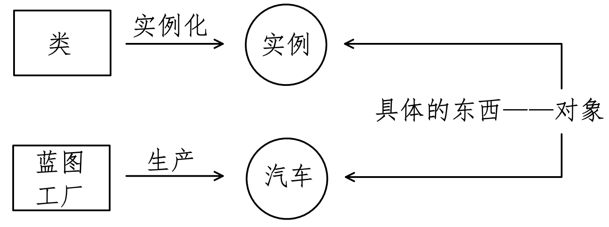
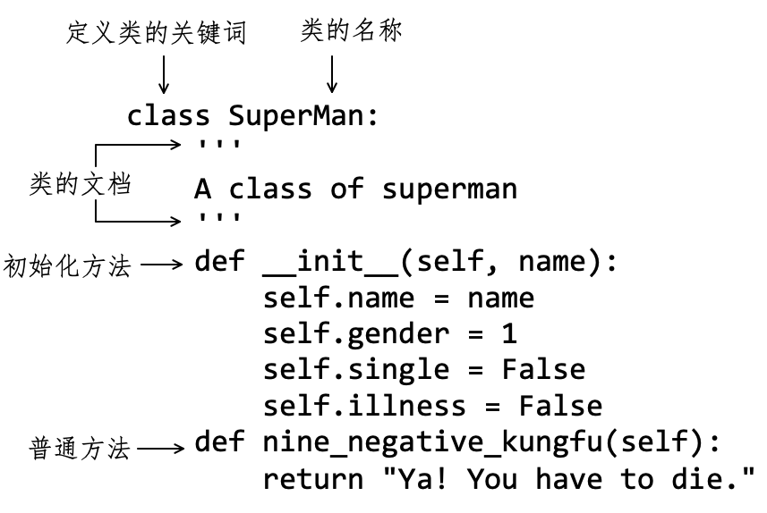
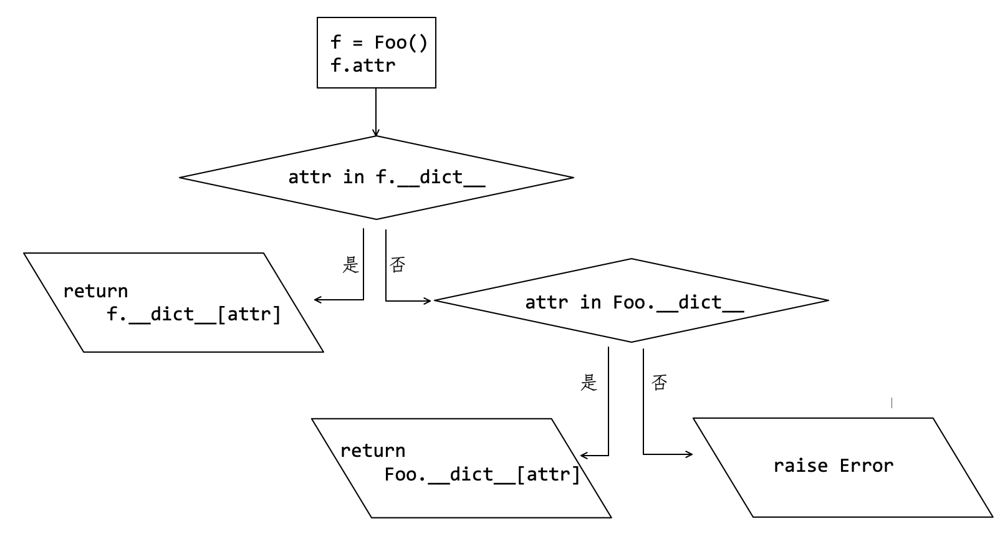
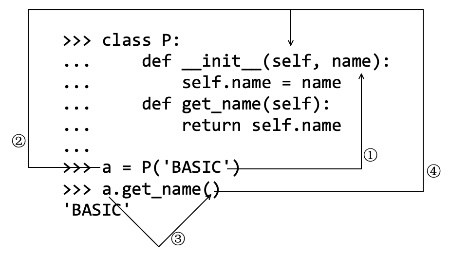
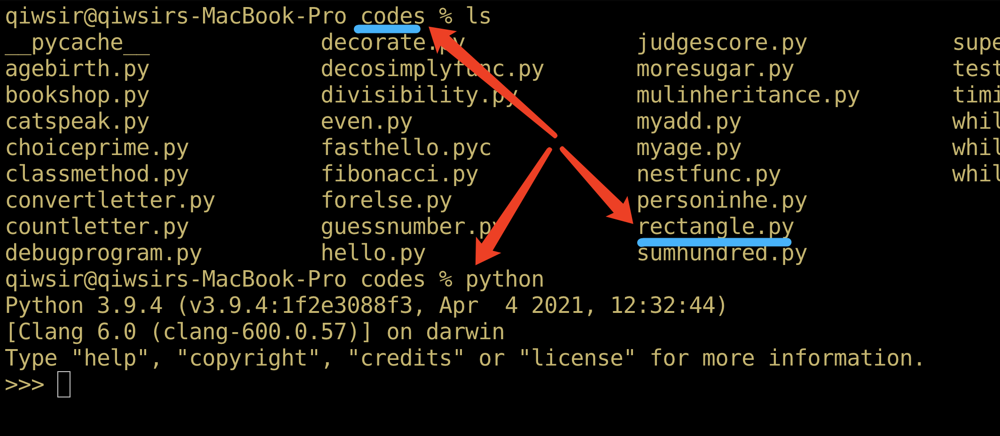

# 第8章 类基础

> 众里寻他千百度，蓦然回首，那人却在灯火阑珊处
>
> ——辛弃疾

有的资料将这一章内容命名为“面向对象”，虽然没有错误，但这并不很 Pythonic ，因为 Python 中的函数是第一类对象，在前一章中已经开始“面向对象”了。其实不仅仅是第7章，从本书开始，就在“面向对象”。那么，本章的类与对象有什么关系？为什么很多自学者会在学到本章的时候遇到困难？如何跨过这个难关？请读者满怀信心阅读本章，并严格地执行本章中的各项学习建议。


## 8.1 面向对象

在第2章2.4节曾初步了解过“对象”的概念，并且通过前面各章节的学习，读者已经对 Python 中的对象，比如内置对象和作为第一类对象的函数有了初步基本认识。从现在开始，将要在原有基础上，更深入地理解对象。

### 8.1.1 对象和面向对象

“对象”虽然是计算机科学中的专业术语，但不同的资料对其表述略有不同，例如《维基百科》中关于“对象”的词条内容是“对象（Object），台湾译作物件，是面向对象（Object Oriented）中的术语，既表示客观世界问题空间中的某个具体的事物，又表示软件系统解空间中的基本元素。”

计算机科学家Grandy Booch（被业界尊为“面向对象”领域中的大师）所定义的“对象”包括以下要点：

- 对象：一个对象有自己的状态、行为和唯一的标识；所有相同类型的对象所具有的结构和行为在它们共同的类中被定义。
- 状态（State）：包括这个对象已有的属性（通常是类里面已经定义好的），再加上对象具有的当前属性值（这些属性往往是动态的）。
- 行为（Behavior）：是指一个对象如何影响外界及被外界影响，表现为对象自身状态的改变和信息的传递。
- 标识（Identity）：是指一个对象所具有的区别于所有其他对象的属性。

将上述要点可以概括为：对象应该具有属性（即“状态”）、方法（即“行为”）和标识。Python 中对象的标识即在创建对象的时候自动在内存空间所提供存储地址，所以，平时编写程序主要关注的是属性和方法。在 Python 语言中，任何一个对象都要包括属性和方法这两部分，在2.4节曾对二者给予通俗解释：

- 属性——描述对象“是什么”。
- 方法——描述对象“能干什么”。

再来看“面向对象”是什么意思，这是现在编程的主流思潮。还是引用《维基百科》中词条内容：

面向对象程序设计（Object-oriented programming，OOP）是一种程序设计范式，同时也是一种程序开发的方法。对象指的是类的实例。它将对象作为程序的基本单元，将程序和数据封装其中，以提高软件的重用性、灵活性和扩展性。

在此，对“面向对象”的理解姑且局限于这个表述。既然它是一种编程方法，就必须在编程实践中理解这个方法。所以，在后续的内容中，我们所学习和练习的，都是以“面向对象”为基本思想和方法——其实前面的学习和练习也如此，只是没有特别强调罢了。

### 8.1.2 类

编程语言中所说的“类”，其英文是“class”，“类”是中文翻译名称。对于初学者而言，听到这个名词会感觉怪怪的，因为不是很符合现代汉语的习惯。在汉语中，常说“鸟类”、“人类”等词语。当然，作为专门术语，不是不行，只是不太习惯罢了。诚然，在计算机科学中，类似的翻译还有不少，造成这种现象的原因很多，建议读者以“英汉结合”的方式来理解。

类，就是用来自定义对象的。

在目前流行的高级编程语言中，类是必须的。借用《维基百科》的定义：“在面向对象程序设计中，类（class）是一种面向对象计算机编程语言的构造，是创建对象的蓝图，描述了所创建的对象共同的属性和方法。”

据此定义，重点理解：

- “蓝图”，一种比喻说法，意思是根据“类”可以得到对象。这就好比一个汽车制造工厂，有了一个生产汽车的设计（包含图纸和生产线），根据这个设计就可以生产出很多汽车。“设计”（或“蓝图”）就相当于“类”，而“汽车”就相当于根据“类”而创建的“对象”——也称之为“实例”，这个过程叫做“实例化”或者“创建实例”（如图8-1-1所示）。
- 在“类”中，要定义“属性”和“方法”。



<center>图8-1-1 类与蓝图的对比</center>

“工厂中汽车的设计”绝对不是白纸一张，其中规定很多关于未来要造出来的“汽车对象”的“属性”和“方法”，比如车的颜色、车的性能等。如果抽象来看“类”，也是如此，要在类中规定好经过实例化而创建的实例应该具有的属性和方法。

例如，把江湖上的一等一的大侠高手的特点总结一下，发现他们有很多共同之处（以下皆为杜撰，若有雷同，纯属巧合，请勿对号入座）：

- 都会“九阴真经”；
- 都吃过毒蛤蟆或者被毒蛇咬过，因此“百毒不侵”；
- 都不是单身；
- 都是男的；
- 都不使用阴招。

假设达到这个标准——“蓝图”——的就是大侠，那么在写小说的时候，给某个人物赋予上述各项内容——创建实例，就将这个人物塑造为大侠了。

为了让生产“大侠”的过程更“数学”化，需要在表述上精准，所以要把上述大侠的各项特征写到“类”里面——设计“蓝图”。用类似 Python语言的代码可以这样写：

```python
class 大侠：
    性别 = 男
    是否单身 = 否
    中毒 = 百毒不侵
    是否阴狠 = 否
    九阴真经()
```

在这个名为“大侠”的类中，有属性——描述大侠的特征，即“是什么”，如：`性别 = 男` 。“性别”是属性，“男”是此属性的值。还有“方法”——描述大侠会什么功夫，即“做什么”，用形如“九阴真功()”的方式表示，类似前面学习过的函数，表示它可以被调用——功夫当然是要用来执行的。

那么，接下来就可以用所定义的类“生产”大侠——不是文学作品中塑造大侠，而是用编程语言创建大侠“实例”。

```python
laoqi = 大侠()
```

我们所使用的符号体系与上一章中函数雷同，`大侠()` 也是名称——类的名称——后面紧跟一对圆括号 `()` ，表示要执行这个名称所引用的对象，即“执行类”，可以形象地理解为让“工厂的生产线按照蓝图运行起来”，结果就应该是生产出产品了。于是 `大侠()` 即可得到“一个具体的大侠”——实例，并将该实例对象用变量 `laoqi` 引用，也可以简单说成实例 `laoqi` 。

如此，在程序中创建了一个符合“大侠类”中设计规范的“真实的大侠”实例——`laoqi` 。那么这个大侠的属性怎么访问？先想想以前学过的内置对象属性怎么访问？基本格式是“对象.属性”（注意中间的英文状态的符号），然后得到它的值。对实例 `laoqi` 也是如此，例如：

```python
>>> laoqi.中毒    # (1)
百毒不侵
```

注释（1）表示请求属性“中毒”的值，所返回的“百毒不侵”即是类中规定的此属性的值。任何用这个类所创建的大侠，其“中毒”的属性默认值都是“百毒不侵”。

还可以使用大侠具有的武功：

```python
>>> laoqi.九阴真经()
```

上述只是“伪装成”代码来演示。真正在Python中定义类，自有其严格规定。

> **自学建议**
>
> 从本章开始，读者会感到所学内容的抽象性更强了，开始的时候会略有不适应。“行百里者半九十”，这是最容易放弃的时候，请读者务必坚持，再坚持一会儿，就能在编程之路上跨出一大步。如何坚持学习？以下建议供参考：
>
> - 反复阅读和练习。由于内容的抽象性，不再是“阅读”后即能理解的了，建议读者对每部分内容反复阅读，对其中的代码反复调试，在“反复琢磨”中领悟其含义。
> - “发展是硬道理”。即使用了上面的方法，也难免有不理解之处，对这些内容可以暂时“不求甚解”，继续向后学习，往往是后面的知识能帮助你解决前面的疑惑。

## 8.2 简单的类

请读者务必注意，本书讲述的是 Python 3 中类的创建方法，与 Python 2 相比，两个版本在定义类的时候稍有差别，如果读者看到Python 2 写的代码，请注意区分。

### 8.2.1 创建类

打开你已经熟练使用的 IDE，把8.1.2节中的“大侠”，用真正的 Python 程序实现。

```python
#coding:utf-8
"""
filename: superman.py
"""

class SuperMan:                      # (1)
    '''                              # (2)
    A class of superman
    '''
    def __init__(self, name):        # (3)
        self.name = name             # (4)
        self.gender = 1              # (5)
        self.single = False    
        self.illness = False
    def nine_negative_kungfu(self):  # (6)
        return "Ya! You have to die."
```

下面结合代码和图8-2-1，学习简单的、常见的类如何定义。



<center>图8-2-1 简单类的结构</center>

注释（1）逻辑行是类的头部，其组成部分是：

- `class` 是定义类的关键词；
- `SuperMan` 是这个类的名称。通常，类名称的命名中每个单词的首字母要大写，如果是多个单词组合，单词之间不插入其它符号。切记，“代码通常是给人看的”，类的名称也尽可能本着“望文生义”的原则命名。
- 类的名称后面紧跟着是英文半角状态下的冒号 “ `:` ”。注意，与定义函数不同，这里没有圆括号，圆括号会在后面讲到“继承”的时候出现。

从注释（2）的逻辑行开始是类的代码块，依然是用四个空格表示代码块。

在注释（2）的三引号以及后面的配对三引号，这之间是关于当前类的帮助文档，不是必须的。在通常的工程项目中，都要写，原因依然是“代码通常是给人看的”。

注释（3）和（6）所定义的是“类的方法”。它们都是由 `def` 这个关键词定义的，其实就是函数，只不过写在类里面罢了。习惯上，把写在类里面或者实例对象所具有的那个由 `def` 所定义的东西，叫做方法——跟函数类似，8.4.1节会对它们进行比较。

不过，仔细观察类中的方法，其参数有一个特别的要求，第一个参数必须是 `self` ，而且它必须要有，即每个方法至少要有一个名为`self` 的参数—— `self` 这个参数名称，不是强制的，可以用别的名称，但使用 `self` 是惯例。提醒注意，方法的参数中必须有 `self` 的规定并非是不能变化的，在8.4节会看到不这样做的情况。

既然方法和函数本质一样，那么方法的名称命名及其内部代码书写规范，就与函数一样了，此处不赘述，读者可以复习第7章关于函数的知识。

比较注释（3）和注释（6）两个逻辑行，所定义的方法虽然本质一样，但形式和命名还有差别。

注意方法名称 `__init__` 的写法，是以双下划线开始和结尾。除了这个方法之外，在后续学习中，还会看到很多其他以双下划线开头和结尾的方法名称，Python 语言中将这些方法统称为“特殊方法”（special method。或者称为“魔法方法”，magic method。第9章中会介绍更多这类方法）。根据英文知识容易知晓，`__init__()` 方法的名称中的 “init” 来自单词 “initial” ，它是在用类创建实例的时候，首先访问这个方法（如果它存在的话），通过这个方法让实例具有其中所规定的属性。比如注释（4）的逻辑行：

- `self` 表示实例化时创建的实例对象；
- `self.name` 表示实例对象具有名称为`name` 的属性；
- `self.name = name` 表示实例对象的 `name` 属性（左侧的 `name` ）的值是实例化时参数 `name` 的实参（引用对象）。注意，符号 `=` 左侧所表示的实例属性的名称和右侧的参数（变量）名称不是非要求一样的。也可以使用注释（5）所示的那样，不用参数给实例属性赋值。

由于 `__init__()` 方法是在创建实例开始就被调用，再结合“initial”这个单词，于是将这个方法翻译为“初始化方法”。

请读者注意，在有的中文资料中，把 `__init__()` 方法翻译为“构造方法”。本书作者认为这种翻译易引起混乱，误导读者。因为在 Python 的类中，真正具有“构造”作用的方法是 `__new__()` 方法，不是 `__init__()` 。因此本书使用“初始化方法”与 `__init__()` 方法对应，而“构造方法”则是 `__new__()` 方法的中文名称（参阅第9章9.4节）。

对于“初始化方法”，最后要提示读者注意的是，它没有返回值，不要写 return 语句（如果非要写，就写 `return None` ）。

注释（6）所定义的是一个普通方法，除了它必须要有 `self` 参数，并且要将此参数放在参数列表第一个之外，其它方面与第7章学过的函数没有差别。

创建了 `SuperMan` 类之后，就可以用它创建实例——形象地说，“类是实例的工厂”，用它可以塑造无限多个“超人”。

### 8.2.2 实例

承接8.2.1所创建的 `superman.py` 文件中的 `SuperMan` 类，将它实例化，如下述代码：

```python
#coding:utf-8
"""
filename: superman.py
"""

class SuperMan:                
    '''                        
    A class of superman
    '''
    def __init__(self, name):  
        self.name = name       
        self.gender = 1              
        self.single = False    
        self.illness = False
    def nine_negative_kungfu(self):  
        return "Ya! You have to die."

zhangsan = SuperMan("zhangsan")                           # (7)
print("superman's name is:", zhangsan.name)               # (8)
print("superman is:(0-female, 1-male) ",zhangsan.gender)  # (9)

result = zhangsan.nine_negative_kungfu()                  # (10)
print("If superman play nine negative kungfu, the result is:")
print(result)
```

程序中注释（7）的语句实现了依据 `SuperMan` 类创建一个实例，或说成“实例化”。所生成的实例是一个对象，或称为“实例对象”，并用变量 `zhangsan` 引用此对象。

在第7章7.3.1节曾借函数说明了对象后面紧跟圆括号的作用，可概括为“名称引用对象，圆括号才是执行”。对于类 `SuperMan` 而言，它也是一个对象——类也是对象，Python 中万物皆对象。例如：

```python
>>> class Foo:
...     def __init__(self):
...         self.f = 'foo'
...
>>> Foo         # (11)
<class '__main__.Foo'>
>>> type(Foo)
<class 'type'>
>>> id(Foo)
140693620290736
```

定义一个比较简单的类 `Foo` ——`Foo` 是类的名称。观察注释（11）及后续的操作，结合已学知识，可以总结出，类的名称与函数的名称引用函数对象雷同，类的名称也引用了类对象。

既然如此，如果要在后面增加一个圆括号，就应该表示“执行类”了，“类是实例的工厂”、“类是实例的蓝图”，执行类，就意味着产生实例。

```python
>>> fo = Foo()
>>> fo
<__main__.Foo object at 0x7ff5c9622700>
>>> type(fo)
<class '__main__.Foo'>
```

由操作结果可知，`Foo()` 是一个实例对象。

再回到注释（7），执行类 `SuperMan` ，从而得到实例对象。注意，后面的圆括号中要有参数。这是因为 `SuperMan` 类的初始化方法的参数（形参）除了 `self` 之外，还有一个 `name` ，那么实例化（或者说“创建实例”）的时候，要为参数 `name` 传一个对象引用（实参）。

在实例化的时候，不需要给初始化方法中的 `self` 参数传对象引用。注释（7）执行之后，Python 解释器以“隐式传递”的方式，令 `self` 引用刚刚所创立的实例。

在类 `SuperMan` 里面所定义的初始化方法，在执行注释（7）即创建实例时，首先要被调用，并执行其内部程序。本例中，创建了实例对象的一些属性并完成相应地赋值。例如实例的 `name` 属性值是 `'zhangsan'` ，`gender` 属性值是 `1` 。注释（8）和（9）中，获取了所创建的实例 `zhangsan` 的两个属性 `zhangsan.name` 和 `zhangsan.gender` 的值。

注释（10）的 `zhangsan.nine_negative_kungfu()` 表示调用了实例 `zhangsan` 的 `nine_negative_kungfu()` 方法，调用方式和函数一样。但是要注意参数，在类 `SuperMan` 中，方法的第一参数是 `self` ，通过实例调用此方法的时候，不需要在圆括号中为 `self` 提供对象引用，这是因为 Python 解释器以“隐式传递”的方式向 `self` 参数传了 `zhangsan` 这个实例对象的引用（严格说法是变量 `zhangsan` 引用的实例对象）。

很容易理解，以注释（7）的方式，通过修改形参 `name` 的值，还可以创建无数个 `SuperMan` 类的实例，这些实例之间的差别在于其 `name` 属性的值不同。此即“类是实例工厂”的含义，工厂可以根据一个生产模型生产出很多产品，例如汽车制造厂生产汽车。

> **自学建议**
>
> 有人将“学问”解释为“学会提问”，在学习过程中，能够将自己不会的东西，整理成别人能理解的问题并准确地表达出来，对学习者的确是一项挑战。特别是通过网络在社交媒体中提问，比如微信群、QQ群、论坛中，大家彼此之间不甚了解，如果问题问得不好，别人即便是有意回答也是爱莫能助。那么，如何能提出别人能理解并愿意回答的问题呢？
>
> - 用语要委婉，“会说话的人运气总不会太差”；
> - 问题背景、前因后果要描述清楚；
> - 自己的疑问或者诉求不要太大、不要笼统、不要模糊。比如有人问我“怎么进行数据清洗”，这就不是一两句能说清楚的问题，而社交媒体中也不适合长篇大论，所以这个问题充其量会得到“请看拙作《数据准备和特征工程》（电子工业出版社）”的回复——除非提问者就想要这个答案。
>
> 最后特别提醒，会思考的学习者不会在网上“乱喷”和“打唾沫仗”，“不争论”，静下心来敲代码，必能“直挂云帆济沧海”。

能够构建简单的类之后，下面要对其重要不成部分——属性和方法——分别进行详细说明。

## 8.3 属性

Python 语言中对象的属性，可以分为类属性（Class Attribute）和实例属性（Instance Attribute）两类。在8.2节所演示的初始化方法中定义的属性，都属于实例属性。本节要对类属性和实例属性分别进行深入阐述。

### 8.3.1 类属性

在交互模式下，创建一个简单的类。

```python
>>> class Foo:
...     lang = 'python'       # (1)
...     def __init__(self, name):
...         self.name = name
...
```

这里定义的类 `Foo` 中有一个独立于方法之外的赋值语句（注释（1）），这个赋值语句中的变量 `lang` 称为类 `Foo` 的类属性。顾名思义，“类属性”就是“从属于类的属性”，故可以通过类名称访问。

```python
>>> Foo.lang
'python'
```

从本质上看，注释（1）就是赋值语句，因此可以理解为 `Foo.lang` 这个变量引用了字符串对象 `'python'` 。

不妨将“类属性”类比于产品的标准配置——每个产品在生产出来之后都具有的特性。在创建实例的时候，类属性会自动配置到每个实例中，即：通过实例也可以访问该属性——但它不是从属于实例的属性，切记！。

```python
# 第一个实例
>>> j = Foo('java')
>>> j.lang
'python'
# 第二个实例
>>> r = Foo('ruby')
>>> r.lang
'python'
```

而在初始化方法 `__init__()` 中所创建的 `self.name` 属性，则会因为实例化时提供不同的实参，其值不相同，即这个属性会随实例而改变，故称之为实例属性——从属于实例的属性。

```python
>>> j.name
'java'
>>> r.name
'ruby'
```

但 `name` 属性不能用类名称访问：

```python
>>> Foo.name
Traceback (most recent call last):
  File "<stdin>", line 1, in <module>
AttributeError: type object 'Foo' has no attribute 'name'
```

类属性可以通过类名称访问，也可以通过类名称进行修改，如：

```python
>>> Foo.lang = 'pascal'    # (2)
>>> Foo.lang
'pascal'
```

注释（2）是一个赋值语句——参考注释（1），所谓“修改”，本质上变量 `Foo.lang` 引用了另外一个对象。

通过类名称（或者说类对象）修改了类属性的值，如果再用实例访问这个属性，发现其值也已经改变。

```python
>>> j.lang
'pascal'
>>> r.lang
'pascal'
```

这再次说明，属性 `lang` 不是在实例化的时候创建的，而是随着类的创建存在的。

还可以通过类名称增加类属性。

```python
>>> Foo.author = 'laoqi'
>>> hasattr(Foo, 'author')    # 判断对象 Foo 是否有属性 author
True
>>> Foo.author
'laoqi'
>>> j.author
'laoqi'
>>> r.author
'laoqi'
```

如果删除类属性，可以使用 del 语句（参阅第6章6.1.3节）。

```python
>>> del Foo.author
>>> hasattr(Foo, 'author')
False
```

`Foo.author` 属性已经删除，不论是类名称还是实例名称，都不能访问到此属性。

```python
>>> j.author
Traceback (most recent call last):
  File "<stdin>", line 1, in <module>
AttributeError: 'Foo' object has no attribute 'author'
```

在 Python 中，不论什么对象，其属性都在该对象的 `__dict__` 属性中—— `__dict__` 名称是双下划线开始和结束。

```python
>>> Foo.__dict__
mappingproxy({'__module__': '__main__', 'lang': 'pascal', '__init__': <function Foo.__init__ at 0x7ff5cae445e0>, '__dict__': <attribute '__dict__' of 'Foo' objects>, '__weakref__': <attribute '__weakref__' of 'Foo' objects>, '__doc__': None})
```

在返回结果中，以类字典的方式列出了对象 `Foo` 的所有属性——类属性， `'lang': 'pascal'` 也在其中。而如果访问实例的 `__dict__` 属性，所得结果有所不同。

```python
>>> j.__dict__
{'name': 'java'}
```

这里只有在实例化是创建的属性——实例属性，下面就重点研习它。

### 8.3.2 实例属性

继续使用上一节定义的类 `Foo` 及所创建的两个实例 `j` 和 `r`，来探讨实例属性。

在类 `Foo` 实例化时，通过类的初始化方法 `__init__()` 所创建的实例属性，因实例不同而不同，故此属性也称为“动态属性”，对应于类属性的“静态”特征——类属性也称为“静态属性”。

```python
>>> r.name
'ruby'
>>> j.name
'java'
```

若无特别规定，实例属性也能修改和增加、删除。

```python
>>> j.name = 'javascirpt'
>>> j.name
'javascirpt'
```

还是用赋值语句修改 `j.name` 的值。此处修改了 `j.name` 的值，`r.name` 的值是否因此而变化？

```python
>>> r.name
'ruby'
```

因为 `j` 和 `r` 是两个对象，只是从同一个类实例化而得，它们具有同样名称的 `name` 属性罢了，而此属性的值互不影响。

继续使用赋值语句，也能为实例增加属性。

```python
>>> j.__dict__    # 已有属性
{'name': 'javascirpt'}
>>> j.book = 'learn python'
>>> j.__dict__
{'name': 'javascirpt', 'book': 'learn python'}
>>> r.__dict__    # 未受影响
{'name': 'ruby'}
```

使用 del 语句也能删除实例属性：

```python
>>> del j.name
>>> j.__dict__
{'book': 'learn python'}
>>> r.__dict__
{'name': 'ruby'}
```

通过实例名称能对该实例的属性进行修改、增加、删除操作。在8.3.1节已经看到，通过实例名称也能访问到类属性名称。那么，是否可以对该类属性的值进行修改呢？比如：

```python
>>> j.lang
'pascal'
```

若做如下操作，结果会如何？

```python
>>> j.lang = 'c++'    # (3)
```

未出现异常，说明上述操作是允许进行的。这是不是意味着 `Foo.lang` 的值因此而被修改了呢？非也！

```python
>>> Foo.lang
'pascal'
>>> Foo.__dict__
mappingproxy({'__module__': '__main__', 'lang': 'pascal', '__init__': <function Foo.__init__ at 0x7ff5cae445e0>, '__dict__': <attribute '__dict__' of 'Foo' objects>, '__weakref__': <attribute '__weakref__' of 'Foo' objects>, '__doc__': None})
```

注释（3）并没有影响到类属性，真实的情况是：

```python
>>> j.__dict__
{'book': 'learn python', 'lang': 'c++'}
```

建立了一个与类属性 `lang` 同名的实例属性 `lang` ，当使用实例名称访问 `lang` 属性的时候，就返回了此实例属性的值。

对于实例而言，其实例属性通常按照图8-3-1所示的顺序读取。因此，首先要检查 `j.__dict__` 中是否含有 `lang` 属性，如果有则返回相应的值；否则检查 `Foo.__dict__` 。



<center>图8-3-1 搜索实例属性</center>

再用 del 语句，将 `j.lang` 删除，若再次读取 `j.lang` ，则会返回 `Foo.__dict__` 中的值。

```python
>>> del j.lang
>>> j.__dict__
{'book': 'learn python'}
>>> Foo.__dict__
mappingproxy({'__module__': '__main__', 'lang': 'pascal', '__init__': <function Foo.__init__ at 0x7ff5cae445e0>, '__dict__': <attribute '__dict__' of 'Foo' objects>, '__weakref__': <attribute '__weakref__' of 'Foo' objects>, '__doc__': None})
>>> j.lang
'pascal'
```

由以上操作，可以认为，不论类属性还是实例属性，都是变量——只不过变量的命名方式有点特别，这些变量引用了某个对象。

还要注意，前面演示中所引用的对象是不可变对象。如果引用了可变对象，结果会不一样。

```python
>>> class Bar:
...     lst = []
...
>>> m, n = Bar(), Bar()
>>> m is n
False
>>> Bar.__dict__
mappingproxy({'__module__': '__main__', 'lst': [], '__dict__': <attribute '__dict__' of 'Bar' objects>, '__weakref__': <attribute '__weakref__' of 'Bar' objects>, '__doc__': None})
>>> m.__dict__
{}
>>> n.__dict__
{}
```

两次实例化类 `Bar` ，分别得到了变量 `m` 和 `n` 引用的两个实例对象，且这两个实例下均没有名为 `lst` 的属性。按照图8-3-1所示的搜索顺序，`m.lst` 的值应该是 `Bar.__dict__['lst']` 的值：

```python
>>> m.lst is Bar.lst
True
```

如果执行：

```python
>>> m.lst.append(9)
```

并不会修改 `m.__dict__` 的值：

```python
>>> m.__dict__
{}
```

但 `Bar.__dict__` 中 `lst` 的值不再是空列表了，即 `Bar.lst` 的值发生了变化。

```python
>>> Bar.__dict__
mappingproxy({'__module__': '__main__', 'lst': [9], '__dict__': <attribute '__dict__' of 'Bar' objects>, '__weakref__': <attribute '__weakref__' of 'Bar' objects>, '__doc__': None})
>>> Bar.lst
[9]
>>> m.lst
[9]
```

不仅如此，还有收到影响的：

```python
>>> n.__dict__
{}
>>> n.lst
[9]
```

这也不难理解，根据图8-3-1的所示，`n.lst` 的返回值也是 `Bar.__dict__['lst']` 。

遵照“循环上升”学习方法，关于对象属性问题，至此暂告一段，到8.8节还会再次提及它，那将是更高层次的探讨。

### 8.3.3 关于 self

在8.2.1节说明类的基本结构时，特别指出类里面所定义的方法的第一个参数必须是 `self`，并且是不可缺少的。当然，如果不使用这个名称，也可以，`self` 只是 Python 中的惯例。但是，惯例还是要遵守，这样才能让别人也能容易阅读你的代码。

下面写一个专门研究 `self` 是什么的类。

```python
>>> class P:
...     def __init__(self, name):
...         self.name = name
...         print(self)
...         print(type(self))
...         print(f'id of self:{id(self)}')
...
```

如果用类 `P` 创建实例，会执行 `__init__()` 方法，于是就能看到上述 `print()` 函数的执行结果：

```python
>>> a = P('Assembly')
<__main__.P object at 0x7ff5cad34be0>    # (4)
<class '__main__.P'>                     # (5)
id of self:140693646560224               # (6)
```

有此结果可知：

- 注释（4）所示的返回值说明 `self` 引用的对象是类 `P` 的实例，其内存地址的十六进制形式是 `0x7ff5cad34be0` ；
- 注释（5）所示的返回值说明 `self` 引用的对象类型是 `P` （类也是类型）；
- 注释（6）所示的结果说明 `self` 引用的对象的内存地址的十进制形式是 `140693646560224` 。

```python
>>> a
<__main__.P object at 0x7ff5cad34be0>
>>> type(a)
<class '__main__.P'>
>>> id(a)
140693646560224
>>> hex(id(a))
'0x7ff5cad34be0'
```

以上显示的是实例 `a` 的有关内容，经过对比，可以下结论：`self` 与 `a` 引用了同一个实例对象——类 `P` 实例化。简单说，`self` 就是实例对象。

当创建实例的时候，实例变量作为第一个参数，被 Python 解释器传给了 `self` ，即8.2.2节所说过的“隐式传递”，所以初始化函数 `__init__` 中的 `self.name` 是实例的属性。

```python
>>> a.__dict__
{'name': 'Assembly'}
```

重写类 `P` ，增加一个方法，通过此方法的调用进一步理解 `self` 的作用。

```python
>>> class P:
...     def __init__(self, name):
...         self.name = name
...     def get_name(self):
...         return self.name
...
>>> a = P('BASIC')
>>> a.get_name()
'BASIC'
```

结合图8-3-2，理解执行 `a.get_name()` 过程中实例对象通过 `self` “传递”的过程。



<center>图8-3-2 关于 self </center>

创建实例的时，`'BASIC'` 传给了参数 `name` （如图示中的①）。实例对象（实例名称所引用）传给了参数 `self` ，如图示中的②所示。当用执行 `a.get_name()` 时，实例也被隐式地作为第一个参数传给该方法，如图示中的③和④所示。

总之，读者应该理解，定义类的时候，参数 `self` 就是预备用来实例化后引用实例的变量。

> **自学建议**
>
> 本书为了让读者能够在理解基本概念基础上有大量的练习机会，在配套的在线资料中特别提供了练习题。对于类，读者必须通过大量的练习才能理解其含义，才能掌握创建类的方法。所以，凡是已经学习到此的读者，切不可仅仅阅读本书的内容，务必使用在线资料中的练习项目。俗话说，“练拳不练功，到老一场空”。

下面通过一个练习，理解类在编程实践中的应用。读者或许是在网上购买的本书，通常商家会根据消费者购物的金额多少确定快递费（“包邮区”除外）。要求为某网上书店编写程序，能够根据图书的单价、消费者购买数量以及快递费，计算买家应支付总金额。

老生常谈，请读者自行尝试后再看下面的代码示例。

```python
#coding:utf-8
'''
filename: bookshop.py
'''

class Book:
    prices = {"A":45.7, "B":56.7, "C":67.8, "D":78.9, "E":90.1}
    shipping = 5    # 快递费单价：5元/本
    
    def __init__(self, book_name, num, free_ship):
        self.book_name = book_name
        self.num = num
        self.free_ship = free_ship    # 免快递费的阈值

    # 计算总价
    def totals(self):
        price = Book.prices.get(self.book_name) 
        if price:
            t = price * self.num
            return (t + Book.shipping) if t < self.free_ship else t
        return "There is NO this book."

if __name__ == "__main__":
    book_a = Book('A', 2, 100)
    a_total = book_a.totals()
    print(a_total)
```

程序执行结果参考：

```python
% python bookshop.py
96.4
```

## 8.4 方法

类的方法，其基本结构与第7章中自学过的函数近似，就普通的方法而言，仿照函数编写即可。然而类里面还会有一些不普通的方法，比如本节将要介绍的“类方法”和“静态方法”。这些方法都是为了让程序更简洁、紧凑而创立的。如果不使用这些方法，也能编写程序，但是用了它们，会锦上添花。

### 8.4.1 比较方法和函数

函数和方法有很多相似处，比如都是使用 `def` 关键词来定义，除了某些特殊方法外（比如 `__init__()` ），普通方法和函数一样，都使用 return 语句作为结束。

除了相同之处，两者的区别要特别关注。

函数是由函数名引用的一个独立对象（第一类对象），通过函数名称可以调用这个对象，它不依赖于其他东西。

```python
>>> def func(x): return x+7
...
>>> func
<function func at 0x7ff148d5f430>
>>> type(func)
<class 'function'>
>>> func(4)
11
```

在调用函数的时候，如果函数有参数，必须很明确地（或者说是“显式地”）给每个参数提供对象或引用。

而方法，必须要依赖于对象。因为它写在了类里面，如果要调用它，就要使用某个对象。前面已经学习过的知识是使用类的实例对象调用它，即通过实例名称：

```python
>>> class Foo:
...     def my_method(self, x):
...         return x ** 2
...
>>> f = Foo()
>>> f.my_method(9)
81
```

在类 `Foo` 中定义了方法 `my_method()` ，此方法有两个参数（形参）。根据8.3.3节说明可知，第一个参数 `self` 总引用类的实例，且通过实例调用方法的时候，不再显式地传入实参。

此外，对于类中的方法，也可以不通过实例名称调用，而是通过类名称调用：

```python
>>> Foo.my_method(f, 9)    # (1)
81
```

此时，必须要显式地为 `self` 提供实例参数。

尽管方法必须与通过实例名称或者类名称调用，但每个方法在 Python 中也是一个对象，比如：

```python
>>> f.my_method
<bound method Foo.my_method of <__main__.Foo object at 0x7ff14892a730>>
```

像这样的对象在 Python 中叫做“绑定方法”对象，即当前调用的方法绑定在了一个实例上。如果：

```
>>> Foo.my_method
<function Foo.my_method at 0x7ff148d5f550>
```

显然 `Foo.my_method` 与普通函数无异（如前面编写的函数 `func()` ）——其实就是一个函数，注释（1）显示的调用方式与函数形式完全一样。那么，这个方法是否可以称为“非绑定方法”——尚未与实例绑定。在 Python 3 中没有这个名词了，因为它本质是函数，只是“函数名称”有点特别罢了。

### 8.4.2 类方法

Python 的内置函数 `classmethod()` 的作用就是应用到类中，以装饰器语法糖的形式定义“类方法”（class method），例如：

```python
#coding:utf-8
'''
filename: clssmethod.py
'''
class Message:
    msg = "Python is a smart language."                    # (2)
    def get_msg(self):
        print("the self is:", self)  
        print("attrs of class(Message.msg):", Message.msg)  # (3)

    @classmethod                                            # (4)
    def get_cls_msg(cls):
        print("the cls is:", cls)                           # (5)
        print("attrs of class(cls.msg):", cls.msg)

if __name__ == "__main__": 
    mess = Message()
    mess.get_msg()
    print("-" * 20)
    mess.get_cls_msg()
```

先执行程序，再对照结果解释：

```shell
% python classmethod.py
the self is: <__main__.Message object at 0x7ff8ddb32d00>
attrs of class(Message.msg): Python is a smart language.
--------------------
the cls is: <class '__main__.Message'>                       # (6)
attrs of class(cls.msg): Python is a smart language.
```

在类 `Message` 中定义了类属性 `msg`（如注释（2）所示），在普通方法中调用这个类属性（如注释（3）所示），使用的是 `Message.msg` ，没有使用 `self.msg` ，虽然在上述程序中，如果读者在注释（3）的表达式中使用 `self.msg` 也一样。根据8.3.2节图8-3-1所示的实例属性搜索顺序，如果该实例没有 `msg` 属性，则会读取 `Message.__dict__['msg']` 的值。注意前提条件：“实例没有 `msg` 属性”。在简单的程序中，我们能够很容易判断实例是否已经有 `msg` 属性，但在复杂情况下，不能明确地控制实例属性时，在注释（3）的语句中使用 `self.msg` 就会有较大风险。“稳定压倒一切”，这是编程的基本原则。所以，注释（3）处最佳选择是使用 `Message.msg` 。

但是，`Message.msg` 这种写法并不好。假如某天开发者一激动，觉得 `class Message` 中所用的类的名称不妥，修改成为了其他名称，但把注释（3）处给忘了——这是常见的。那么，程序就会报错。像这种把类名称“写死”的方式，在编程中会称为“硬编码”（Hard Code）。在这里，如果要避免硬编码，就使用类方法。

注释（4）用装饰器装饰了一个名为 `get_cls_msg()` 的方法，这个方法的参数使用了 `cls` ——这也是管理，使用其它参数名称亦可，不过还是遵守惯例较好。这个方法——被装饰器 `@classmethod` 装饰的方法——中如果调用类属性，不需要“硬编码”，改为 `cls.msg` 的样式。那么，方法中的 `cls` 是什么呢？

注释（5）打印了 `cls` ，其结果显示在注释（6），即 `cls` 引用了对象 `<class '__main__.Message'>` ——类 `Message`（类也是对象）。所以，从效果上看，`cls.msg` 和`Message.msg` 是一样的，但显然 `cls.msg` 避免了将类名称“写死”的硬编码。能够令 `cls` 引用当前类对象的就是注释（4）的装饰器语法糖。

在 Python 中，通过装饰器 `@classmethod` 装饰的方法称为“类方法”。类方法的参数有且至少有一个，并且第一个参数通常命名为 `cls` ，它引用的就是当前所在的类对象。

在上述程序中，类 ` Message` 里面的普通方法 `get_msg()` 通常是通过实例名称调用，如 `mess.get_msg()` ，像这样的方法称为“实例方法”（instance method）。

在下面的示例中，能更深入理解类方法的应用。

在定义一个类时，只能有一个初始化方法 `__init__()` 。在某些情况下，会有捉襟见肘之感。比如，有一个名为 `Person` 的类，可以根据姓名（ `name` ）和年龄（ `age` ）实例化。如果要求还能用姓名和出生日期（ `birthday` ）实例化，应该如何写初始化方法？多写一个吗？肯定不能有重名的方法。

运用类方法就能解决此问题。

```python
#coding:utf-8
'''
filename: agebirth.py
'''
import datetime

class Person:
    def __init__(self, name, age):
        self.name = name
        self.age = age

    @classmethod
    def by_birth(cls, name, birth_year):
        this_year = datetime.date.today().year
        age = this_year - birth_year
        return cls(name, age)              # (7)
    def get_info(self):
        return "{0}'s age is {1}".format(self.name, str(self.age))

if __name__ == "__main__":
    newton = Person('Newton', 26)           # (8)
    print(newton.get_info())
    hertz = Person.by_birth("Hertz", 1857)  # (9)
    print(hertz.get_info())
```

注释（8）实例化 `Person` 类时，默认首先调用初始化方法 `__init__()` ，并且将参数传给初始化方法。但是，如果用出生年份作为注释（8）的参数，比如 `Person('Hertz', 1857)` 显然是不对的。为了能用年份创建实例，又不破坏已经定义的初始化方法 `__init__()` ，于是使用类方法装饰器，定义了类方法 `by_birth()` 。在这个方法中，计算了 `age` 之后，以注释（7）中的 `cls(name, age)` 创建实例对象。此处不需要使用 `Person` 类名称，而是使用 `cls` 代表当前类名称。注释（9）则直接通过类名称调用类方法创建实例。

特别要注意，注释（9）通过类名称调用类方法，本来在类中所定义的类方法有三个参数，第一个是`cls` ，它引用的就是当前类对象。那么在注释（9）中调用这个方法的时候，不再显式地在参数列表中传入类对象，`Person.by_birth()` 就表示类 `Person` 作为第一个参数传给了 `cls` 。

### 8.4.3 静态方法

先看这样一个问题。

写一个关于猫的类，就正常的猫而言，都有两个耳朵和四条腿，这可以作为其共有的属性，即类属性。不同的猫，颜色可能不同，所以这个属性应该是实例属性。另外，正常的猫都会叫，所以在猫的类中要有一个方法，但是，不管什么猫，叫声都一样（至少对人而言如此）。那么这个方法就不是实例方法，应该做特殊处理了。也就是要在类里面写一个比较特殊的方法，不因实例而有差别。这个方法就是本节要探讨的“静态方法”（static method）——顾名思义，“静态”即不因实例而变化，类比于8.3.2节的“静态属性”。

Python 语言的内置函数 `staticmethod()` 为编写静态方法提供了简介的形式，类似8.4.2节的类方法，在方法前面用 `@staticmethod` 装饰即可。

```python
#coding:utf-8
'''
filename: catspeak.py
'''
class Cat:
    ears = 2
    legs = 4
    def __init__(self, color):
        self.color = color

    @staticmethod
    def speak():              # (10)
        print("Meow, Meow")

if __name__ == "__main__":
    black_cat = Cat("black")
    white_cat = Cat("white")
    black_cat.speak()
    white_cat.speak()
    if black_cat.speak is white_cat.speak and black_cat.speak is Cat.speak:
        print('black_cat.speak, white_cat.speak, Cat.speak are the same objects.')
```

程序执行结果如下：

```python
% python catspeak.py
Meow, Meow
Meow, Meow
black_cat.speak, white_cat.speak, Cat.speak are the same objects.
```

注释（10）所定义的方法，既没有以 `self` 也没有以 `cls` 作为第一个参数，所以这个方法不是实例方法，也不是类方法。如果不用 `@staticmethod` 装饰 `speak()` 方法，在类里面是不许可的。当一个方法用 `@staticmethod` 装饰后，就构成了静态方法。

从执行结果可以得知，以 `black_cat.speak` 、`white_cat.speak` 、`Cat.speak` 三种不同方式调用同一个静态方法，该方法对象是同一个对象——所有猫叫声都一样。

在下面的示例中，综合应用类方法和静态方法，请读者注意体会它们的应用时机。

```python
#coding:utf-8
'''
filename: judgescore.py
'''
class Score:
    def __init__(self, scores):
        self.scores = scores

    @classmethod
    def from_csv(cls, score_csv_str):
        scores = list(map(int, score_csv_str.split(',')))
        return cls(scores) if cls.validate(scores) else cls(False)

    @staticmethod
    def validate(scores):
        for g in scores:
            if g < 0 or g > 100:
                return False
        return True

if __name__ == '__main__':
    # Try out some valid scores
    class_scores_valid = Score.from_csv('90, 80, 85, 94, 70')
    print('Got scores:', class_scores_valid.scores)

    # Should fail with invalid scores
    class_scores_invalid = Score.from_csv('92, -15, 99, 101, 77, 65, 100')
    print(class_scores_invalid.scores)
```

程序执行结果：

```python
% python judgescore.py
Got scores: [90, 80, 85, 94, 70]
False
```

在 `Score` 类中，三个方法的作用依次是：

- 初始化方法 `__init__()` 只实现了实例属性的赋值；
- 类方法 `from_csv()` 用于创建实例，并且对字符串参数进行转换和判断，如果有不符合要求（小于零或大于一百）的整数，则认为输入数据不合规（返回 `False` ）
- 静态方法 `validate()` 用于判断数据是否合规。

在类方法 `from_csv()` 中以 `cls.validate()` 的形式调用了当前类中的静态方法，显然此静态方法不需要与实例绑定。

至此，学习了类中的三种方法：

- 实例方法：最常用的，第一个参数 `self` 是实例，用实例名称调用。
- 类方法：第一个参数 `cls` 是当前的类，必须用 `@classmethod` 装饰。
- 静态方法：不需要引用实例或类的参数，必须用 `@staticmethod` 装饰。

> **自学建议**
>
> 或许已经对类的基本结构有所了解，并且也能编写简单的类。但是，如果将自己写出的程序与“人家的代码”比较，总感觉自己的太幼稚、“人家的代码”显得那么“高深”——乃至于看不懂。对此，不必妄自菲薄，那些能编写“优雅代码”的高手们非天生的，也是经历了从“丑陋”到“优雅”的磨砺过程。根据经验，读者首先能够编写最基本形式的程序（比如只是用初始化方法和实例方法），经过一段时间练习和学习后，就会觉得所写的程序还有待优化，并且也能够进行适当的修改，这就是巨大的进步。气定神闲、日拱一卒、坚持不懈，必然能写出“优雅代码”。

## 8.5 继承

继承（Inheritance）是 OOP（Object-oriented programming，面向对象程序设计）中的一个重要概念，也是类的三大特性之一（另外两个特性分别是多态和封装）。

OOP 中的“继承”概念和人类自然语言中的“继承”含义相仿。当对象 C 继承了对象 P，C 就具有了对象 P 的所有属性和方法。通常 C 和 P 都是类对象，称 C 为“子类”，称 P 为“父类”。

```python
>>> class P: p = 2
...
>>> class C(P): pass
...
```

定义类 `P` （注意写法，因为代码块只有一行，所以可以如上所示书写），里面只有一个类属性。然后定义类 `C` 。为了能够让类 `C` 实现对类 `P` 的继承，在类 `C` 的名称后面紧跟一个圆括号，圆括号里面写父类 `P` 的名称。

虽然类 `C` 的代码块只有 `pass` ，在其中没有定义任何属性和方法，但是由于它继承了类 `P` ，则父类中所定义的类属性 `p` 及其值就会被“代入”到类 `C`  ：

```python
>>> hasattr(C, 'p')
True
>>> C.p
2
```

当子类继承父类之后，不需要再次编写相同的代码，实现了代码重用——减少重复代码，是编程的一项基本原则。另外，子类继承父类的同时，也可以重新定义父类中的某些属性或方法，即用同名称的属性和方法覆盖父类的原有的对应部分，使其获得与父类不同的功能。

```python
>>> class D(P):
...     p = 222
...     q = 20
...
>>> D.p
222
```

类 `D` 继承了类 `P` ，在类 `D` 中定义了类属性 `p = 22` ，与父类 `P` 中所定义的类属性重名，则 `D.p` 的值即为子类中所定义的值。这样的效果称为对父类中属性 `p` 重写或覆盖。

从继承方式而言，Python 中的继承可以分为“单继承”和“多继承”。

### 8.5.1 单继承

所谓单继承，就是只从一个父类那里继承。前面列举的继承，都是单继承，可以用类对象的属性 `__base__` 查看该类的父类：

```python
>>> C.__base__
<class '__main__.P'>
```

类 `C` 的父类是类 `P` ，这是毫无疑问的，前面定义类 `C` 是就已经说明了。再看：

```python
>>> P.__base__
<class 'object'>
```

在定义类 `P` 时，并没有注明它继承什么对象，实际上，它也有上一级，那就是类 `object` 。在Python 3中所有的类都是 `object` 的子类，所以，就不用在定义类的时候写这个“公共的父类”了（读者在阅读代码的时候，还可能遇到如此定义类的情况：`class MyCls(object)` ，在 Python 3 中，其效果与 `class MyCls` 等同。但是，如果在 Python 2 中，要将 `object` 作为定义类时显示继承的对象，即写成 `class MyCls(object)` 的样式。请注意 Python 版本）。

下面列举一个示例，从中既能理解单继承的含义，也能明白为什么要继承——本节开篇未解释为什么，而是单刀直入介绍继承的写法，读者可以通过此示例理解“为什么”。

```python
#coding:utf-8
'''
filename: personinhe.py
'''
class Person:
    def __init__(self, name, age):  
        self.name = name
        self.age = age
    
    def get_name(self):
        return self.name
    
    def get_age(self):
        return self.age

class Student(Person):
    def grade(self, n):
        print(f"{self.name}'s grade is {n}")

 
if __name__ == "__main__":
    stu1 = Student("Galileo", 27)    # (1)
    stu1.grade(99)                   # (2)
    print(stu1.get_name())           # (3)
    print(stu1.get_age())            # (4)
```

执行结果：

```python
% python personinhe.py
Galileo's grade is 99
Galileo
27
```

类 `Student` 继承了类 `Person` ，相当于将类 `Person` 的代码完全搬到了类 `Student` 里，即如同定义了下面的类：

```python
class Student:
    def __init__(self, name, age):  
        self.name = name
        self.age = age
    
    def get_name(self):
        return self.name
    
    def get_age(self):
        return self.age

    def grade(self, n):
        print(f"{self.name}'s grade is {n}")
```

注释（1）实例化 `Student` 类，其效果即等同于上述代码——参数 `name` 和 `age` 皆来自于父类 `Person` 的初始化方法。

注释（2）的 `grade()` 方法是子类 `Student` 中定义的；注释（3）和（4）的两个示例方法，均在父类中定义。

试想，如果还要定义一个名为 `Girl` 的类，其中也有一部分代码与 `Person` 类相同，就可以继续继承 `Person` 类。如此，`Person` 类中的代码可以被多次重用。这就是继承的意义所在。

继承，并不以为这子类失去个性。例如，子类 `Student` 需要再增加一个实例属性 `school` ，用以说明所属学校。于是对子类 `Student` 进行修改：

```python
class Student(Person):
    def __init__(self, school):    # 增加初始化方法
        self.school = school

    def grade(self, n):
        print(f"{self.name}'s grade is {n}")
```

而后实例化类 `Student` ，但是会遇到疑惑。按照此前所说，类 `Student` 继承了类 `Person` ，那么父类中的 `__init__()` 方法也就被“搬运”到子类中，而现在子类中又有了一个同名的 `__init__()` 方法，这就是所谓的重写了父类的该方法，即子类的 `__init__()` 方法覆盖了父类的此方法，那么在子类中，父类的 `__init__()` 方法不再显现。按照此逻辑，实例化应当这样做：

```python
if __name__ == "__main__":
    # stu1 = Student("Galileo", 27)
    stu1 = Student("Social University")
    stu1.grade(99) 
    print(stu1.get_name()) 
    print(stu1.get_age())  
```

再执行程序：

```python
 % python personinhe.py
Traceback (most recent call last):
  File "/Users/qiwsir/Documents/my_books/Python完全自学教程/codes/personinhe.py", line 27, in <module>
    stu1.grade(99) 
  File "/Users/qiwsir/Documents/my_books/Python完全自学教程/codes/personinhe.py", line 21, in grade
    print(f"{self.name}'s grade is {n}")
AttributeError: 'Student' object has no attribute 'name'
```

报错！

在程序开发中，出现错误很正常，这并不可怕，可怕的是没有耐心阅读报错信息。

从输出的异常信息中不难看出，错误在于类 `Student` 中没有属性 `name` 。

从前面的程序中可知，属性 `name` 是类 `Person` 的 `__init__()` 方法中所定义的实例属性，现在新写的类 `Student` 虽然继承了类 `Person` ，但因为重写了父类的 `__init__()` 方法，且子类的该初始化方法中没有定义 `name` 属性，故在实例化 `Student` 类的时候，报出没有此属性的异常。

现在就提出了一个问题，子类重写或覆盖了父类的方法，但还要在子类中继续使用被覆盖的父类方法——颇有些“儿子打算脱离老子独立，但是还想要老子给予财政支持”的味道。在单继承中，为了解决此问题，可以使用 Python 的一个内置 `super()` 函数。再次修改 `Student` 类：

```python
class Student(Person):
    def __init__(self, school, name, age):    # 增加参数
        self.school = school
        super().__init__(name, age)   # (5) 

    def grade(self, n):
        print(f"{self.name}'s grade is {n}")
```

注释（5）即表示在子类中调用父类中被覆盖的 `__init__()` 方法——注意此处初始化方法的形参，不再显式地写出 `self` 。这样，在实例化 `Student` 类的时候，就需要 `school, name, age` 三个参数——注意类 `Student` 的 `__init__()` 方法中的参数。继续修改程序：

```python
if __name__ == "__main__":
    # stu1 = Student("Galileo", 27)
    stu1 = Student("Social University", "Galileo", 27)
    stu1.grade(99) 
    print(stu1.get_name()) 
    print(stu1.get_age()) 
    print(stu1.school)              # 增加一行
```

执行程序：

```python
% python personinhe.py
Galileo's grade is 99
Galileo
27
Social University
```

注释（5）还有两种替代写法，分别是：

- `super(Student, self).__init__(name, age)`
- `Person.__init__(self, name, age)`

在这两种替代写法中，都使用了父类的名称。对于单继承而言，推荐使用注释（5），在后续的多继承中，会使用到替代写法的形式。

不妨将单继承的知识运用到下面的代码优化中。假设有如下所示的两个类：

```python
#coding:utf-8
'''
filename: rectangle.py
'''
class Rectangle:
    def __init__(self, length, width):
        self.length = length
        self.width = width

    def area(self):
        return self.length * self.width

    def perimeter(self):
        return 2 * self.length + 2 * self.width

class Square:
    def __init__(self, length):
        self.length = length

    def area(self):
        return self.length * self.length

    def perimeter(self):
        return 4 * self.length
```

很显然，类 `Rectangle` 和类 `Square` 有很多类似之处——数学上也告诉我们，正方形可以看成是长宽相等的矩形。因此，可以将类 `Square` 利用单继承的知识进行优化——请读者先试试，再看后面的代码。

```python
class Square(Rectangle):
    def __init__(self, length):
        super().__init__(length, length)
```

顿感简洁，可以发出一声惊叹了。

在此基础上，再设计一个计算正方体（六个面都是正方形，也称立方体、正六面体）的体积和表面积的类，继续使用单继承，当如何编写？思考、尝试后再看参考代码。

```python
class Cube(Square):
    def surface_area(self):
        face_area = super().area()
        return face_area * 6

    def volume(self):
        face_area = super().area()
        return face_area * self.length
```

有了继承，是不是感觉编写程序的工作量减少了很多，再也不会“白头搔更短”了。

### 8.5.2 多继承

顾名思义，“多继承”是指某一个子类的父类不止一个，而是多个。比如：

```python
>>> class P1: p1 = 1
...
>>> class P2: p2 = 2
...
>>> class C(P1, P2): pass
...
>>> dir(C)
['__class__', '__delattr__', '__dict__', '__dir__', '__doc__', '__eq__', '__format__', '__ge__', '__getattribute__', '__gt__', '__hash__', '__init__', '__init_subclass__', '__le__', '__lt__', '__module__', '__ne__', '__new__', '__reduce__', '__reduce_ex__', '__repr__', '__setattr__', '__sizeof__', '__str__', '__subclasshook__', '__weakref__', 'p1', 'p2']
```

子类 `C` 继承了两个父类 `P1` 和 `P2` ，它也就具有了两个父类中所定义的类属性 `p1, p2` 。

继续改造8.5.1节创建的 `rectangle.py` 文件，在其中实现多继承。增加如下两个类：

```python
class Triangle:
    def __init__(self, base, height):
        self.base = base
        self.height = height

    def area(self):
        return 0.5 * self.base * self.height

class RightPyramid(Triangle, Square):
    def __init__(self, base, slant_height):
        self.base = base
        self.slant_height = slant_height

    def area(self):
        base_area = super().area()       # (6)
        perimeter = super().perimeter()  # (7)
        return 0.5 * perimeter * self.slant_height + base_area
```

类 `RightPyramid` 表示一个地面是正方形、侧面是三角形的正四棱锥。从几何的角度看，这个锥体由正方形和三角形组成，于是让它继承类 `Triangle` 和 `Square` 也顺理成章，此即为多继承的应用。 `RightPyramid` 类的 `__init__()` 方法的参数 `base` 为组成棱锥的正方形边长，`slant_height` 为组成棱锥的三角形的高。方法 `area()` 计算正四棱锥的表面积。

为了能清晰地观察到类 `RightPyramid` 实例化和调用方法的过程，还是进入到交互模式一步一步地执行。注意，现在要求在 `rectangle.py` 文件所在的目录进入到交互模式中，如图8-5-1所示。



<center>图8-5-1 在当前目录进入交互模式</center>

> **自学建议**
>
> 在后续内容中，我们会学到“模块”概念，即每一个 `.py` 文件。这里所演示的方式，将自己编写的文件作为模块引入到交互模式中，有利于我们通过“分解动作”理解程序的含义。
>
> 如果读者使用的是 windows 操作系统，也可以代开 cmd，使用 DOS 命令，仿照图8-5-1那样，进入到 `.py` 文件所在目录，并开启 Python 交互模式。
>
> 此外，还可以在 IDE 中实现类似操作，以 VS Code 为例，通过“终端”也能实现类似的操作（如图8-5-2所示）
>
> 

然后执行下述语句（其原因详见后续内容）。

```python
>>> from rectangle import *
>>> pyramid = RightPyramid(2, 4)
```

顺利地得到了一个实例 `pyramid` ，再计算它的面积。

```python
>>> pyramid.area()
Traceback (most recent call last):
  File "<stdin>", line 1, in <module>
  File "/Users/qiwsir/Documents/my_books/Python完全自学手册/codes/rectangle.py", line 53, in area
    base_area = super().area()
  File "/Users/qiwsir/Documents/my_books/Python完全自学手册/codes/rectangle.py", line 45, in area
    return 0.5 * self.base * self.height
AttributeError: 'RightPyramid' object has no attribute 'height'
```

执行实例的 `area()` 方法后报错，异常信息显示 `RightPyramid` 对象没有 `height` 属性。然而，我们分明在它所继承的一个父类 `Triangle` 中定义了此属性了，为什么这里还会报错？难道没有“成功”地继承？

问题的根源在于 “方法解析顺序”（method resolution order），简称 MRO。

在定义 `RightPyramid` 类时，继承了 `Triangle` 类和 `Square` 类，注释（6）使用 `super()` 调用 `RightPyramid` 的父类，就要根据 MRO 确定按照什么顺序在父类中搜索有关方法和属性。当然，MRO 是 Python 中已经规定好的，可以用对象的 `__mro__` 属性查看：

```python
>>> RightPyramid.__mro__
(<class 'rectangle.RightPyramid'>, <class 'rectangle.Triangle'>, <class 'rectangle.Square'>, <class 'rectangle.Rectangle'>, <class 'object'>)
```

上述结果说明，对于类 `RightPyramid` 而言，首先会搜索它自己内部是否有该方法和属性；然后按照继承顺序，分别搜索两个父类 `Triangle` 和 `Square` （注意顺序）；如果仍然未果，则继续搜索 `Square` 的父类 `Rectangle` ；还是一无所获，则最终要搜索 `object` 类。

按照上述顺序，在 `RightPyramid` 类中的注释（6）的 `super().area()` 就会在父类 `Triangle` 中搜索到，即 `Triangle.area(self)` 。这个方法中用到两个实例属性 `self.base` 和 `self.height` ，`self.base` 在实例化的时候已经建立（ `self.base = 2` ），但是 `self.height` 没有定义。所以抛出了前述 `AttributeError` 异常。

怎么修改？

注释（6）实则是要计算四棱锥的底面正方形的面积，所以，就可以通过调整父类的顺序，先搜索 `Square` 类，并且通过调用 `Square` 类中的初始化方法，为正方形的边长属性（ `self.base` ）赋值。在 IDE 中按照下述方式修改代码。

```python
class RightPyramid(Square, Triangle):         # 修改父类顺序
    def __init__(self, base, slant_height):
        self.base = base
        self.slant_height = slant_height
        super().__init__(self.base)           # 调用 Square.__init__()

    def area(self):
        base_area = super().area()            # (6)
        perimeter = super().perimeter()       # (7)
        return 0.5 * perimeter * self.slant_height + base_area
```

修改之后，回到交互模式。如果仍然没有退出交互模式，需要将修改之后的模块文件 `rectangle.py` 重新加载——简称“重载”，其方法如下）：

```python
>>> import importlib
>>> import rectangle
>>> importlib.reload(rectangle)
```

然后才能使用 `rectangle.py` 文件中更新之后的代码。另外一种更简单的重载方法，就是退出当前交互模式，然后依据前述方式重新进入，再引入模块。

如果在修改 IDE 中的类时，已经退出了交互模式，现在又重新进入交互模式，则不需要上述重加载，直接进入下面的操作。

```python
>>> from rectangle import *
>>> RightPyramid.__mro__
(<class 'rectangle.RightPyramid'>, <class 'rectangle.Square'>, <class 'rectangle.Rectangle'>, <class 'rectangle.Triangle'>, <class 'object'>)
```

现在我们看到，MRO 的顺序发生了变化：`RightPyramid -> Square -> Rectangle -> Triangle` 。

```python
>>> pyramid = RightPyramid(2, 4)
>>> pyramid.area()
20.0
```

综上，可以总结一下，在多继承中，如果使用 `super()` 函数调用父类的属性和方法，务必要了解 MRO 的查找顺序。

如果读者仔细观察上述 `RightPyramid` 类，会发现一个问题，虽然继承了 `Triangle` 类，实际上所有的 `super()` 都没有真正调用到它。

对于四棱锥的三角形面积，为什么不使用 `Triangle` 类中的 `area()` 方法计算呢？当然可以，但是由于在类 `Rectangle` 和 `Triangle` 中都有 `area()` 方法，且两个都要在 `RightPyramid` 中调用，如果还用 `super()` ，势必造成混乱。于是可以换一种方法，直接用类名称调用对应方法。

```python
class RightPyramid(Triangle, Square):
    def __init__(self, base, slant_height):
        self.base = base
        self.slant_height = slant_height
        Square.__init__(self, self.base)
        Triangle.__init__(self, self.base, self.slant_height)

    def area(self):
        base_area = super(Square, self).area()
        tri_area = Triangle.area(self)
        return tri_area * 4 + base_area
```

诚然，这也有了“硬编码”的迹象。

如你所见，多继承虽然在编程中很有用，但也会导致非常复杂的情况，甚至于让开发者感到困惑。所以，在实践中，用到多继承时都会非常谨慎，尽可能找到其他解决问题的方法，最大程度减少应用多继承的可能。其中，有一种被称为 mixin 的技术形式，深受开发者喜欢。

所谓 mixin （或 mix-in），是 OOP 编程语言中的一个类，它包含供其他类使用的方法。例如：

```python
#coding:utf-8
'''
filename: volume.py
'''
class Rectangle:
    def __init__(self, length, width):
        self.length = length
        self.width = width

    def area(self):
        return self.length * self.width

class Square(Rectangle):
    def __init__(self, length):
        super().__init__(length, length)

class VolumeMixin:       # (8)
    def volume(self):
        return self.area() * self.height

class Cube(VolumeMixin, Square):
    def __init__(self, length):
        super().__init__(length)
        self.height = length

    def surface_area(self):
        return super().area() * 6

if __name__ == '__main__':
    cube = Cube(2)
    print(cube.surface_area())
    print(cube.volume())       # (9)  
```

程序执行结果：

```python
% python volume.py
24
8
```

总体上与 `rectangle.py` 的程序差不多，区别在于注释（8）定义了一个 mixin 类 `VolumeMixin` ，它的作用即在于向 `Cube` 类提供 `volume` 方法，即注释（9）中实例所调用的方法。

通常，mixin 类不会单独使用（如 `VolumeMixin` ），一个 mixin 类实现一个功能。用于实例化的类继承 mixin 类，可以认为是将若干个功能组装起来，这样使得编程思路清晰，也避免了多继承容易引起的混乱。

> **自学建议**
>
> “代码只能做你让它做的事，而不是你想让它做的事”。
>
> 不记得这句话的来源，如果有读者知道，敬请告知。之所以在这里引用，是想提醒初学者，编程中，务必要明确声明某个对象干什么，而不是让计算机去“猜你的心思”——它不会猜。

将继承的概念拓展到其他领域，凡是有性生殖的生物体都采用了“多继承”，比如人。人拥有23对不同的染色体，其中有一对染色体决定性别，称为“性染色体”，即 X 染色体和 Y 染色体。女性染色体的组成为 XX，男性染色体的组成为 XY。在自然状态下，夫妇生男生女，就是双方的染色体随机组合的结果。若含 X 染色体的精子与卵子（含有 X 染色体）结合，受精卵性染色体为 XX 型，发育成女胎；若含 Y 染色体的精子与卵子结合，受精卵性染色体为 XY 型，发育成男胎。

对这个生理过程，写成一个程序，从而能显示“生男生女”——注意，不是预测。

```python
#coding:utf-8
'''
filename: chromosome.py
'''
import random

class Father:
    def __init__(self):
        self.father_chromosome = 'XY'
    
    def do(self):
        print("Make money.")

class Mother:
    def __init__(self):
        self.mother_chromosome = "XX"
    
    def do(self):
        print("Manage money.")

class Child(Father, Mother):
    def child_gender(self):
        fat = random.choice(self.father_chromosome)
        mot = 'X'
        chi = fat + mot
        if "Y" in chi:
            return 1
        return 0

if __name__ == "__main__":
    p = Child()
    if p.child_gender():
        print('is a BOY.')
    else:
        print("is a GIRL.")
```

## 8.6 多态

多态（polymorphism），是OOP的一个重要概念。不少学习或使用 Python 的人，特别他们曾经了解过 Java 之后，对 Python 中的多态往往有不同的解读。为了避免因人微言轻，在本节将更多地引述一名权威对 Python 语言的多态的阐述，这位大神就是《Thinking in Java》的作者 Bruce Eckel ——将 Java 奉为圭皋的特别注意，这位可真是大神，如果学习 Java 而没有阅读他的书，借用 Java 界的朋友所说，“那就不算学过 Java”。

Bruce Eckel 在2003年5月2日发表了一篇题为《Strong Typing vs. Strong Testing》（https://docs.google.com/document/d/1aXs1tpwzPjW9MdsG5dI7clNFyYayFBkcXwRDo- qvbIk/preview）的博客，将 Java 和 Python 的多态特征进行了比较。

先来欣赏 Bruce Eckel 在文章中所撰写的一段说明多态的 Java 代码：

```java
// Speaking pets in Java:
interface Pet {
    void speak();
 }
 
class Cat implements Pet {
    public void speak() { System.out.println("meow!"); }
 }
 
class Dog implements Pet {
    public void speak() { System.out.println("woof!"); }
 }
 
public class PetSpeak {
    static void command(Pet p) { p.speak(); }

    public static void main(String[] args) {
        Pet[] pets = { new Cat(), new Dog() };
        for(int i = 0; i < pets.length; i++)
            command(pets[i]);
    }
}
```

如果读者没有学习过 Java ，那么对上述代码理解可能不是很顺畅，不过这不重要，主要观察`command(Pet p)` ，这种写法意味着 `command()` 所能接受的参数类型必须是 `Pet` 类型，其他类型不行。所以，必须创建 `interface Pet` 这个接口并且让类 `Cat` 和 `Dog` 继承它，然后才能用于 `command()` 方法（原文：I must create a hierarchy of Pet, and inherit Dog and Cat so that I can upcast them to the generic command() method）。

然后，Bruce  Eckel 又写了一段实现上述功能的 Python 代码：

```python
# Speaking pets in Python:
class Pet:
    def speak(self): pass
 
class Cat(Pet):
    def speak(self):
        print "meow!"
 
class Dog(Pet):
    def speak(self):
        print "woof!"
 
def command(pet):
    pet.speak()
 
pets = [ Cat(), Dog() ]
 
for pet in pets:
    command(pet)
```

在这段 Python 代码中的 `command()` 函数，其参数 `pet` 并没有要求必须是前面定义的 `Pet`类型（注意区分大小写），仅仅是一个名字为 `pet` 的形参，用其他名称亦可。Python 不关心引用的对象是什么类型，只要该对象有 `speak()` 方法即可。提醒读者注意的是，因为历史原因（2003年），Bruce Eckel 当时写的是针对 Python 2 的旧式类，不过适当修改之后在 Python 3 下也能“跑”，例如将 `print "meow!"` 修改为 `print("meow!")` 。

根据已经学习过的知识，不难发现，上面代码中的类 `Pet` 其实是多余的。是的，Bruce Eckel 也这么认为，只是因为此代码是完全模仿 Java 程序而写的。随后，Bruce Eckel 就根据 Python 语言的特性对代码进行了优化。

```python
# Speaking pets in Python, but without base classes:
class Cat:
    def speak(self):
        print "meow!"
 
class Dog:
    def speak(self):
        print "woof!"
 
class Bob:
    def bow(self):
        print "thank you, thank you!"
    def speak(self):
        print "hello, welcome to the neighborhood!"
    def drive(self):
        print "beep, beep!"
 
def command(pet):
    pet.speak()
 
pets = [ Cat(), Dog(), Bob() ]
 
for pet in pets:
    command(pet)
```

去掉了多余的类 `Pet` ，增加了一个新的对象类 `Bob` ——人类，这个类根本不是 `Cat` 和 `Dog` 那样的类型，只是它碰巧也有一个名字为 `speak()` 的方法罢了。但是，也依然能够在 `command()` 函数中被调用。

这就是Python中的多态特点，大师 Brue Eckel 通过非常有说服力的代码阐述了 Java 和 Python 的区别，并充分展示了 Python 中的多态特征。

诚如前面所述，Python 不检查传入对象的类型，这种方式被称为“隐式类型”（Laten Typing）或者“结构式类型”（Structural Typing），也被通俗地称为“鸭子类型”（Duck Typeing）。其含义在《维基百科》中被表述为：

在程序设计中，鸭子类型（Duck Typing）是动态类型的一种风格。在这种风格中，一个对象有效的语义，不是由继承自特定的类或实现特定的接口决定，而是由当前方法和属性的集合决定。这个概念的名字来源于由 James Whitcomb Riley 提出的鸭子测试。“鸭子测试”可以这样表述：“当看到一只鸟走起来像鸭子，游泳起来像鸭子，叫起来也像鸭子时，那么这只鸟就可以被称为鸭子。”

鸭子类型就意味着可以向任何对象发送任何消息，只关心该对象能否接收该消息，不强求该对象是否为某一种特定的类型。这种特征其实在前面函数部分就已经有所体现了。

```python
>>> lam = lambda x, y: x + y
>>> lam(2, 3)
5
>>> lam('python', 'book')
'pythonbook'
```

对于 Python 的这种特征，有一批程序员不接受，他们认为在程序被执行的时候，可能收到错误的对象，而且这种错误还可能潜伏在程序的某个角落。

对于此类争论，大师 Brue Eckel 在上面所提到的博客中，给出了非常明确的回答。下面将原文恭录于此（注：读者如果阅读有困难，可以借用有关工具。之所以不翻译，是避免因个人才疏学浅而导致误传。）：

Strong testing, not strong typing.

So this, I assert, is an aspect of why Python works. C++ tests happen at compile time (with a few minor special cases). Some Java tests happen at compile time (syntax checking), and some happen at run time (array-bounds checking, for example). Most Python tests happen at runtime rather than at compile time, but they do happen, and that's the important thing (not when). And because I can get a Python program up and running in far less time than it takes you to write the equivalent C++/Java/C# program, I can start running the real tests sooner: unit tests, tests of my hypothesis, tests of alternate approaches, etc. And if a Python program has adequate unit tests, it can be as robust as a C++, Java or C# program with adequate unit tests (although the tests in Python will be faster to write).

读完大师的话，犹如醍醐灌顶，豁然开朗，再也不去参与那些浪费口舌的争论了。

对于多态问题，最后还要告诫读者，类型检查是毁掉多态的利器，如 `type()` 、`isinstance()` 及`isubclass()` 这些检查类型的函数，一定要慎用。

> **自学建议**
>
> 本来编程语言是用来解决问题的工具，没有高低贵贱之分。但是，由于用工具的人，时间长了会对自己常用的东西有感情，再加上其他因素，就导致了对编程语言的价值判断。比如，有这样一条编程语言鄙视链（大于号右边的是被左边所鄙视的对象）：C > C++ > Java > Python > PHP > HTML 。如果根据学习的难度可以创建一条鄙视链，那么历史上曾经用0、1二进制编码的老前辈是不是也在天上鄙视晚辈后生们呢？
>
> 作为本书读者和志存高远的自学者，不论以哪一种编程语言作为自己开始学习的对象，都要充分理解并应用该语言的特性，而不是用其他语言的特征对某语言进行“点评”。在实际的项目中，我们会根据实际情况，选用不同的编程语言，不是根据当事人会什么语言或者喜好什么语言。

## 8.7 封装和私有化

在程序设计中，封装（Encapsulation）是对具体对象的一种抽象，即将某些部分隐藏起来，在程序外部看不到，其含义是其他程序无法调用（不是人用眼睛看不到那个代码。如果让代码变成人难以阅读和理解的形式，这种行为称作“代码混淆”（obfuscation））。

### 8.7.1 下划线

Python 中的下划线是一种含义很丰富的符号。

此前的内容中，已经使用过下划线（ `_` ），比如变量名称如果是两个单词，中间用下划线连接；再比如类的初始化方法 `__init__()` 是以双下划线开始和结束。现在探讨对象的封装，也可以用下划线实现，方式非常简单，即在准备封装的对象名字前面加双下划线。例如：

```python
>>> class Foo:
...     __name = "laoqi"    
...     book = 'python'
...
>>> f = Foo()
>>> f.book
'python'
>>> f.__name
Traceback (most recent call last):
  File "<stdin>", line 1, in <module>
AttributeError: 'Foo' object has no attribute '__name'
```

在类 `Foo` 中有两个类属性，`__name` 是用双下划线开始命名的类属性；`book` 是通常见到的类属性命名。

创建实例 `f` ，`f.book` 能正确地显示属性的值；但是，`f.__name` 则显示了 `AttributeError` 异常。这说明在类 `Foo` 之外，无法调用 `__name` 属性。

```python
>>> Foo.__name
Traceback (most recent call last):
  File "<stdin>", line 1, in <module>
AttributeError: type object 'Foo' has no attribute '__name'
>>> hasattr(Foo, "__name")
False
>>> hasattr(Foo, "book")
True
```

除了用实例无法调用 `__name` 属性，用类名称 `Foo` 也无法调用。在类的外部检测 `Foo` 类是否具有 `__name` 属性时，返回了 `False` ，而检测 `book` 属性，则返回了 `True` 。与 `book` 相比，`__name` 就被隐藏了起来，在类 `Foo` 无法调用它。

```python
>>> class Foo:
...     __name = "laoqi"
...     book = 'python'
...     def get_name(self):
...         return Foo.__name
...
```

再给类 `Foo` 增加一个方法 `get_name` ，在这个方法中，通过类名称调用 `__name` 属性。

```python
>>> f = Foo()
>>> f.get_name()
'laoqi'
```

再次实例化之后，执行 `f.get_name()` 后返回了类属性 `__name` 的值，但此属性是在类内部的方法中被调用的。

在 Python 中以双下划线开始命名的属性或方法，都会像 `__name` 那样，只能在类内部调用，在外部无法调用。将这种行为称为私有化，亦即实现了对该名称所引用对象的封装。

下面的代码是一个比较完整的示例，请读者认真阅读，并体会“私有化”的作用效果。

```python
# coding=utf-8
'''
filename: private.py
'''
class ProtectMe: 
    def __init__(self):
        self.me = "qiwsir"
        self.__name = "laoqi"

    def __python(self):  
        print("I love Python.")

    def code(self):
        print("What language do you like?")
        self.__python()   

if __name__ == "__main__": 
    p = ProtectMe()
    p.code()
    print(p.me)
    p.__python()  
```

 执行程序，看看效果：

```shell
% python private.py
What language do you like?
I love Python.
qiwsir
Traceback (most recent call last):
  File "/Users/qiwsir/Documents/my_books/Python完全自学手册/codes/private.py", line 21, in <module>
    p.__python()  
AttributeError: 'ProtectMe' object has no attribute '__python'
```

执行到 `p.__python()` 时报 `AttributeError` 异常，说明方法 `__python()` 不能调用，因为它的名称用双下划线开始，表明是一个私有化的方法。在 `code()` 方法内，调用了 `__python()` 方法，在执行 `p.code()` 时得到了正确结果，即再次表明被封装的对象只能在类的内部调用。

那么，为什么只要在命名属性或方法时，只要以双下划线开始就能实现封装呢？其原因在于，Python 解释器会对以这种形式命名的对象重命名，在原来的名称前面增加前缀形如 `_ClassName` 的前缀。以在交互模式中创建的 `Foo` 类为例：

```python
>>> Foo.__name
Traceback (most recent call last):
  File "<stdin>", line 1, in <module>
AttributeError: type object 'Foo' has no attribute '__name'
>>> Foo._Foo__name    # (1)
'laoqi'
```

其类属性 `__name` 被封装，其实是被 Python 解释器重命名为 `_Foo__name` （ `Foo` 前面是单下划线），若改用注释（1）形式，就可以得到 `Foo` 类的私有化类属性 `__name` 的值。

若在 `Foo` 类内调用 `__name` ——正在写类内部代码块，类对象尚未经 Python 解释器编译。当类的代码块都编写完毕，Python 解释器将其中所有的 `__name` 都更名为 `_Foo__name` ，即可顺利调用其引用的对象。

而在类外面执行 `Foo.__name` 时，Python 解释器没有也不会将 `__name` 解析为 `_Foo__name` ，所以在调用`__name` 时就显示 `AttributeError` 。

读者在这里又看到了另外一种符号：单下划线。

在有的 Python 资料中，并不将上述的方式称为“私有化”——本质是改个名称嘛。而是用单下划线，“约定”该名称引用的对象作为私有化对象——注意是“约定”。

```python
>>> class Bar:
...     _name = "laoqi"
...     def get_name(self):
...         return self._name
...
```

这里“约定” `_name` 只在类内部调用。诚然，如果你不履约，施行“霸权主义”，Python 也不惩戒该行为——没有抛出异常。

```python
>>> Bar._name
'laoqi'
```

因此，也有的开发者认为 Python 并不支持真正的私有化，不能强制某对象私有化。于是将“单下划线”视为该对象宜作为内部使用的标记符。

以上两种私有化的观点和写法，此处并不强制读者采信哪一种，因为这都是编程的形式——不用这些也能写程序。

### 8.7.2 property 装饰器

或许，读者也认为，Python 不能实现真正意义上的对象封装，从上一节内容已经看到，以单下划线开始的命名是“君子约定”，以双下划线开始的命名是“虚晃一枪”。如果来“真”的，Python 能行吗？

Python 没有像 Java 等某些语言那样，以 `public` 和 `private` 关键词定义类，可以说所有的类都是 pbulic 的，8.7.1节介绍的以命名“私有化”形式实现封装，也不是 Java 语言中的 `private` 。但是，Python 中有一种方法，能够让程序中的对象更接近“封装”。

在 IDE 中先编写名为 `mypassword.py' 的程序文件，其代码如下：

```python
#coding:utf-8
'''
filename: mypassword.py
'''
class User:
    def __init__(self):
        self.password = 'default'

    def get_pwd(self):
        return self.password

    def set_pwd(self, value):
        self.password = value
        print("you have set your password.")
```

然后在此文件所在目录，进入到 Python 交互模式（参阅8.5.2节所示方法）。

```python
>>> from mypassword import *
>>> laoqi = User()
>>> laoqi.password
'default'
>>> laoqi.get_pwd()
'default'
>>> laoqi.set_pwd('123')
you have set your password.
>>> laoqi.password
'123'
>>> laoqi.password = '456'
>>> laoqi.get_pwd()
'456'
```

从上面的操作可知，实例 `laoqi` 的密码可以通过属性 `password` 或者方法 `get_pwd()` 读取，也可以通过属性 `password` 或者方法 `set_pwd()` 重置。显然，这样对密码的管理是非常不安全的——要进行适当的“封装”，基本要求是：密码只能通过属性读取，不能通过属性重置，即是只读的。

将 `mypassword.py` 中的文件按照下面方式进行修改。

```python
#coding:utf-8
'''
filename: mypassword.py
'''
class User:
    def __init__(self):
        self.__password = 'default'
    
    @property                # (1)
    def password(self):      # (2) 
        return self.__password

    def set_pwd(self, value):
        self.__password = value
        print("you have set your password.")
```

为了实现密码只读的需求，使用了注释（1）所示的装饰器 `@property` ——这个装饰器是基于内置函数 `property()` ，并且将原来的方法 `get_pwd()` 更名为 `password()` （如注释（2））。此外，将原来的实例属性 `password` 重命名为 `__password` 。重新载入 `mypassword` 模块（参阅8.5.2节）之后：

```python
>>> from mypassword import *
>>> laoqi = User()
>>> laoqi.password
'default'
>>> laoqi.password = '123'           # (3)
Traceback (most recent call last):
  File "<stdin>", line 1, in <module>
AttributeError: can't set attribute
>>> laoqi.__password = '123'         # (4)
>>> laoqi.password
'default'
```

通过实例 `laoqi` 调用 `password` ——注意，不是 `laoqi.password()` 方法。虽然注释（2）定义的是 `password()` 方法，但是此方法被 `@property` 装饰之后，就可以用同名的属性形式调用，并得到了默认的密码值。

注释（3）试图通过赋值语句修改密码，结果失败。但，注释（4）成功了，其实这也没有修改 `laoqi.password` 的值，只是为实例 `laoqi` 增加了一个名为 `__password` 的实例属性。如此，即实现密码的“只读”功能。

当然，因为还遗留了 `laoqi.set_pwd()` 方法，如果把它没有被删除，调用它还是能重置密码的。

```python
>>> laoqi.set_pwd('456')
you have set your password.
>>> laoqi.password
'456'
```

但是，这样实现重置，有点“太丑”了，还是用 `laoqi.password = '456'` 的方式重置更优雅——注释（3）的执行结果已经说明，不能用赋值语句重置。还有，明码保存是不是太不安全？重置密码之后，最好是能加密保存。

于是有了第二个需求：能够用赋值语句（类似注释（3））那样重置密码（从用户角度将，重置密码是非常必要的），并且密码要加密保存——否则不称之为“密”码。

根据这些需要，再次修改 `mypassword.py` 文件中的代码。

```python
#coding:utf-8
'''
filename: mypassword.py
'''
class User:
    def __init__(self):
        self.__password = 'default'
    
    @property
    def password(self):
        return self.__password

    @password.setter                 # (5)
    def password(self, value):       # (6)
        value = int(value) + 728     # 最低级的加密方法
        self.__password = str(value)
        print("you have set your password.")
```

注意观察修改内容。注释（5）增加了一个装饰器，它的作用就是让注释（6）所定义的方法变成以属性赋值的形式。在注释（6）的方法里面，用了一种最拙劣的加密方法。

重载模块 `mypassword` 后（参阅8.5.2节），在交互模式中继续操作：

```python
>>> from mypassword import *
>>> laoqi = User()
>>> laoqi.password
'default'
>>> laoqi.password = '456'     # (7)
you have set your password.
>>> laoqi.password             # (8)
'1184'
```

注释（7）实现了用赋值语句重置密码的需求，并且从注释（8）的返回值可知，注释（7）所提交的密码已经被“加密”。

由上述内容，已经初步理解了 `@property` 装饰器的一个作用：将方法转换为属性访问。就凭这个功能，它就能让程序“优雅”很多。比如：

```python
#coding:utf-8
'''
filename: computearea.py
'''
class Rectangle:
    def __init__(self, width, height):
        self.width = width
        self.height = height

    def area(self):
        return self.width * self.height

if __name__ == "__main__":
    rect = Rectangle(7, 8)     # (9)
    rect_area = rect.area()    # (10)
    print(f"width = {rect.width}, height = {rect.height}")
    print(f"call rect.area() method to rectangle area = {rect_area}")
```

在此程序中，注释（9）创建了一个矩形实例，注释（10）得到了此实例的面积。虽然这种写法能够实现功能，但是在追求“优雅”的 Python 开发者心目中，注释（10）是“丑陋的”。实例的宽度和长度，分别用属性 `rect.width` 和 `rect.height` 得到，那么面积，也应该是实例的属性，不应该是方法，所以用 `rect.area()` 计算面积，本身就不很“OOP”。如果用 `rect.area` 这样的属性形式得到实例的面积，那才符合 OOP 思想，并体现着 Python 的优雅，更蕴含着开发者的智慧。

用 `@property` 对程序稍作修改：

```python
#coding:utf-8
'''
filename: computearea.py
'''
class Rectangle:
    def __init__(self, width, height):
        self.width = width
        self.height = height
    @property                          # 增加装饰器
    def area(self):
        return self.width * self.height

if __name__ == "__main__":
    rect = Rectangle(7, 8)
    #rect_area = rect.area()          # 不再调用方法
    print(f"width = {rect.width}, height = {rect.height}")
    print(f"call rect.area attribute to rectangle area = {rect.area}")
```

执行结果：

```python
% python computearea.py
width = 7, height = 8
call rect.area attribute to rectangle area = 56
```

装饰器 `@property` 是基于内置函数 `property()` ，这方面类似于8.4.2和8.4.3节使用过的类方法、静态方法装饰器。它不仅能能实现“属性”的读、写，还能实现删除功能。下面的示例中，读者进一步体会 `@property` 的作用，并增加了“删除属性”的功能。

```python
#coding:utf-8
'''
temperature.py
'''
class Celsius:
    def __init__(self, temperature=0):
        self.__temperature = temperature

    @property
    def temperature(self):
        return self.__temperature

    @temperature.setter
    def temperature(self, value):
        if value < -273.15:       # (11)
            raise ValueError("Temperature below -273 is not possible")
        self.__temperature = value

    @temperature.deleter
    def temperature(self):
        raise AttributeError("Can't delete attribute")
```

进入到交互模式（参阅8.5.2节），进行如下操作：

```python
>>> from temperature import *
>>> person = Celsius()
>>> person.temperature
0
>>> person.temperature = 36

>>> person.temperature = -300      # (12)
Traceback (most recent call last):
  File "<stdin>", line 1, in <module>
  File "/Users/qiwsir/Documents/my_books/Python完全自学手册/codes/temperature.py", line 16, in temperature
    raise ValueError("Temperature below -273 is not possible")
ValueError: Temperature below -273 is not possible
  
>>> del person.temperature         # (13)
Traceback (most recent call last):
  File "<stdin>", line 1, in <module>
  File "/Users/qiwsir/Documents/my_books/Python完全自学手册/codes/temperature.py", line 21, in temperature
    raise AttributeError("Can't delete attribute")
AttributeError: Can't delete attribute
```

重点看注释（12）的操作结果，之所抛出异常，是因为在程序中注释（11）对值的大小进行了判断，如果条件满足，就执行 `raise` 语句（参阅后续内容）。

再看注释（13）的执行结果，抛出了 `AttributeError` 异常，是因为用装饰器 `@temperature.deleter` 所装饰的方法中，执行了 `raise` 语句，即禁止删除 `person.temperature` ，如此对该对象给予“保护”。

> **自学建议**
>
> 随着学习的深入，会觉得各种“招式”似乎理解了，但是在“实战”中不知道怎么用。没有别的原因，就是“实战”太少。如何增加自己的实战经历呢？
>
> 首先，是基于本书中的代码，在此前内容中，不断鼓励读者先自己思考、尝试，然后参考我提供的代码示例。现在读者还可以“回头看”，或许对同样的问题又有了新的思考，甚至于认为书中的代码也不怎样——这说明你已经有了较高的欣赏和评价能力。除了批判之外，更要自己动手，先把我写的示例代码进行优化——别忘了告诉我，让我和其他读者都能进步。
>
> 然后，要“胆子大一些”，敢于自己设计（或者是“想象”）一些项目，并动手尝试“做一做”，哪怕最后不成功，自己也有了经验。

