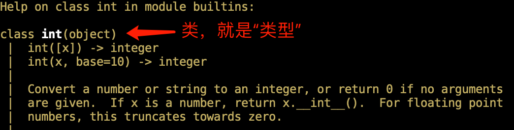

# 第9章 类进阶

> 白日依山尽，黄河入海流。欲穷千里目，更上一层楼。
>
> ——王之涣

如果只用第8章所学得的知识编写类，已经能解决绝大部分问题，只不过代码可能会不优雅、形式不紧凑，安全性不高等。总而言之是能实现功能，但未达到对编程的较高要求。本章将进一步介绍一些关于类的编写技术，这些内容并非是为了锦上添花，而是为了进一步优化代码。

## 9.1 对象类型

在 Python 中，类就是类型——务必牢记。

```python
>>> class MyType: pass
...
>>> a = MyType()
>>> type(a)
<class '__main__.MyType'>
>>> type(1)
<class 'int'>
```

定义类 `MyType` ，然后创建实例 `a` ，`type(a)` 的返回值就是 `a` 的类型；同样，`type(1)` 的返回值是 `1` 的类型。对比发现，`'__main__.Mytype'` 与 `'int'` 分别表示了 `a` 和 `1` 的类型。我们既然说 `1` 是 `int` 类型，也就可以说 `a` 是 `MyType` 类型。注意， `MyType` 还是类，故“类就是类型”。

如果读者用 `help()` 函数查看已经学过的内置对象类型，比如 `help(int)` ，会看到它们也是以类的形式定义的（如图9-1-1所示）。



<center>图9-1-1 整数的类就是整数类型</center>

但是，如果这样操作：

```python
>>> 1
1
>>> a
<__main__.MyType object at 0x7f8bc8f2a700>
```

两者的外在表现差异还是挺大的。这是因为我们所自定义的类“太简陋”了——在帮助文档中看看 `int` 类的内容，会发现还有很多方法，那些方法都让类 `int` 表现得更优雅。本节将要学习的内容就是让类的结构复杂起来，从而能更接近我们希望的样子。

### 9.1.1 定义表示形式

如果用 `print()` 函数打印前面创建的实例 `a` 和整数 `1` 会有什么差异？

```python
>>> print(1)
1
>>> print(a)
<__main__.MyType object at 0x7f8bc8f2a700>
```

这种差异是如何造成的？必须要搞明白 `print()` 函数在实施“打印对象”时，实例或类的哪个方法实现了此操作。

```python
#coding:utf-8
'''
filename: reprstr.py
'''
class Book:
    def __init__(self, author, book_name):
        self.author = author
        self.book_name = book_name

    def __str__(self):
        return self.book_name

    def __repr__(self):
        return f"{self.book_name} by {self.author}"
```

在 IDE 中编写 `reprstr.py` 文件的代码。文件中定义了一个类 `Book` ，其方法除了熟知的初始化方法 `__init__()` ，又增加了两个此前没有遇到过的特殊方法 `__str__()` 和 `__repr__()` 。之所以在方法前面冠之以“特殊”修饰，也是因为这两个方法的命名与初始化方法类似，都是以双下划线为前缀和后缀。

然后在该文件当前位置进入到交互模式（参阅第8章8.5.2节），执行如下操作：

```python
>>> from reprstr import *
>>> py = Book('laoqi', 'PYTHON')
>>> type(py)
<class 'reprstr.Book'>
```

这里显示，实例对象 `py`——严格地说是变量 `py` 引用的对象——的类型是 `reprstr.Book` ，即 `reprstr` 模块里面的 `Book` 类型。

```python
>>> print(py)
PYTHON
>>> str(py)
'PYTHON'
```

打印对象 `py` 的效果与将它转化为字符串类型等同，这是由 `print()` 函数本身决定的。简单地理解，`print()` 函数将参数转化为字符串——执行 `str(py)`——并写入文本流（注意，这是非常简单且简陋的理解，读者若有兴趣深入理解，请参阅 `print()` 的官方文档或其他有关专门资料）。如果让 `str()` 函数能够执行，则要求类中必须定义了特殊方法 `__str__()` ——其实，任何自定义的类中，默认都有 `__str__()` 方法（如下操作示例），只是如果不重写它，显示结果不能按照需要的形式表达出来。

```python
>> class Foo: pass
... 
>>> str(Foo())
'<__main__.Foo object at 0x7f8252030580>'
>>> dir(Foo)
['__class__', '__delattr__', '__dict__', '__dir__', '__doc__', '__eq__', '__format__', '__ge__', '__getattribute__', '__gt__', '__hash__', '__init__', '__init_subclass__', '__le__', '__lt__', '__module__', '__ne__', '__new__', '__reduce__', '__reduce_ex__', '__repr__', '__setattr__', '__sizeof__', '__str__', '__subclasshook__', '__weakref__']
```

回到 `print()` 函数，如果要问一句：谁需要打印结果？是人还是计算机？。当然是人，计算机不需要“看”显示什么内容，更不关心显示的形式。因此，为了让自定义的类型能够“对人友好”或者“让人更容易阅读其内容”，在定义类的时候往往重写 `__str__()` 方法，像`reprstr.py` 中的 `Book` 类中那样。

类 `Book` 中定义的另外一个特殊方法 `__repr__()` 会在什么时候被调用？

```python
>>> repr(py)
'PYTHON by laoqi'
>>> py
PYTHON by laoqi
>>> [py]
[PYTHON by laoqi]
```

`repr()` 是一个内置函数，它返回的是以“对象”为字面量的字符串，例如：

```python
>>> repr(Foo())
'<__main__.Foo object at 0x7f8bcd8a3c10>'
```

如果在类中定义了 `__repr__()` 方法，`repr()` 返回的就是此方法中规定的内容——参照 `repr(py)` 和方法 `__repr__()` 的定义。

在交互模式中输入 `py` ，目的是让 Python 解释器读取到此对象，形象地说是“让机器读到”。机器所读到的内容是 `repr()` 返回的内容，即 `__repr__()` 中定义的。同理 `[py]` 亦如此。

由此可见，Python 给开发者提供了很大的自由，可以定义对象类型在“对机器”和“对人”两种不同情境下的不同表示形式。

在数学中，所谓“有理数”是指能够以分数形式表示的数字，比如 $1.5 = \frac{3}{2}$​ 。但是，在默认的 Python 中无法表示 `3/2` （其他编程语言也不支持，都将 `3/2` 视为 “3 除以 2”的表达式，最终返回 `1.5` ），看来很有必要定义一个专门的“分数类型”——假装不知道第3章3.3.2节所介绍过的标准库模块。

不妨自己先利用前述已学知识尝试编写程序，而后参考下面的示例：

```python
#coding=utf-8
'''
filename: fraction.py
'''
class Fraction:
    def __init__(self, number, denom=1):
        self.number = number
        self.denom = denom
 
    def __str__(self):
        return str(self.number) + '/' + str(self.denom)
 
    __repr__ = __str__       # (1)

if __name__ == "__main__":
    f = Fraction(3, 2)
    print(f)
    print([f])               # (2)
```

程序执行结果：

```python
% python fraction.py
3/2
[3/2]
```

这里定义了一个简单的分数类（或类型），比较“粗糙”，还有很多问题没有考虑，比如没有考虑分子分母约分的情况。在 `Fraction` 类中，以 `__str__()` 定义了分数的显示形式。特别注意注释（1），因为名称 `__str__` 代表了对应的方法对象，这里用赋值语句的方式，令名称 `__repr__` 也引用了 `__str__()` 方法对象，即方法 `__repr__()` 内的代码块与 `__str__()` 的一样。由此就理解了注释（2）的执行结果。

### 9.1.2 定义运算符

以加法运算符 “ `+` ” 为例，不仅仅用于数字，还可以用于序列，比如：

```python
>>> 2 + 3
5
>>> 'python' + "book"
'pythonbook'
```

如果考察能够用于 “ `+` ” 的对象，会发现它们都必须有 `__add__()` 方法，否则（如下操作中的字典类型）就不能实现 “ `+` ” 运算。

```python
>>> hasattr(2, "__add__")
True
>>> hasattr("python", "__add__")
True
>>> hasattr(list, "__add__")
True
>>> hasattr(dict, "__add__")
False
>>> {1:2} + {3:4}
Traceback (most recent call last):
  File "<stdin>", line 1, in <module>
TypeError: unsupported operand type(s) for +: 'dict' and 'dict'
```

所以，在自定义的对象类型中，如果也重写了 `__add__()` 方法，就会按照指定规则进行 `+` 运算。

在9.1.2节创建的 `fraction.py` 已有代码基础上，可以继续对分数问题进行研究，考虑分数相加，以此说明 `__add__()` 方法的编写和应用。

先复习一下分数加法的计算过程（以 $\frac{1}{2} + \frac{1}{3}$​ 为例）：

（1）通分，即分母为原来两个分数的分母的最小公倍数，得到 $\frac{3}{6}+\frac{2}{6}$ 。

（2）分子相加，得到上述两个分数的和。

据此可知，计算分数加法的关键点是“通分”，而通分的关键是找出两个整数的最小公倍数。

如何找最小公倍数？步骤如下：

（1）计算两个数的最大公约数，假设 `a` 和 `b` 两个整数，最大公约数（Greatest Common Divisor）用 `gcd(a, b)` 表示。

（2）最小公倍数和最大公约数的关系是：`lcm(a, b) = |ab| / gcd(a, b)` ，`lcm(a, b)` 表示这两个数的最小公倍数（Lowest Common Multiple）。

于是，在9.1.2节的 `fraction.py` 基础上，按照上面所列的方法，增加计算最大公约数和最小公倍数的静态方法——请读者思考，为什么要用静态方法？然后重写特殊方法 `__add__()` ，即实现了分数加法。详细代码示例如下：

```python
#coding=utf-8
'''
filename: fraction.py
'''
class Fraction:
    def __init__(self, number, denom=1):
        self.number = number
        self.denom = denom
 
    def __str__(self):
        return str(self.number) + '/' + str(self.denom)
 
    __repr__ = __str__

    @staticmethod
    def gcd(a, b):
        if not a > b:
            a, b = b, a
        while b != 0:
            remainder = a % b
            a, b = b, remainder
        return a

    @staticmethod
    def lcm(a, b):
        return (a * b) / Fraction.gcd(a, b)

    def __add__(self, other):
        lcm_num = Fraction.lcm(self.denom, other.denom)
        number_sum = (lcm_num / self.denom * self.number) \
                     + (lcm_num / other.denom * other.number)
        return Fraction(number_sum, lcm_num)

if __name__ == "__main__":
    m = Fraction(1, 3)
    n = Fraction(1, 2)
    print(m + n)
```

以上代码内容不再解释，留给读者对其进行注释，以便练习解读代码的能力——其中各个方法的基本原理参阅之前所学内容。

除了加法运算符之外，其他运算符也都有相应的特殊方法，如有必要，可以在类中重写这些特殊方法，以实现有关计算。表9-1-1中列出了几种常见运算符所对应的特殊方法，供读者参考。

表 9-1-1 运算符和方法名称

| 二元运算符 | 特殊方法                                                 |
| ---------- | -------------------------------------------------------- |
| `+`        | `__add__` ,  `__radd__`                                  |
| `-`        | `__sub__` ,  `__rsub__`                                  |
| `*`        | `__mul__` ,  `__rmul__`                                  |
| `/`        | `__div__` ,  `__rdiv__` , `__truediv__` , `__rtruediv__` |
| `//`       | `__floordiv__` ,  `__rfloordiv__`                        |
| `% `       | `__mod__` ,  `__rmod__`                                  |
| `**`       | `__pow__` ,  `__rpow__`                                  |
| `<<`       | `__lshift__` ,  `__rlshift__`                            |
| `>>`       | `__rshift__` ,  `__rrshift__`                            |
| `&`        | `__and__` ,  `__rand__`                                  |
| `==`       | `__eq__`                                                 |
| `!=,<>`    | `__ne__`                                                 |
| `>`        | `__get__`                                                |
| `<`        | `__lt__`                                                 |
| `>=`       | `__ge__`                                                 |
| `<= `      | `__le__`                                                 |

> **自学建议**
>
> 本章的内容中，会遇到很多特殊方法，当然，在 Python 语言中，并不仅限于本章所遇到的这些。在自定义类（或类型）时，重写这些特殊方法，能够让所定义的类具备特有的功能。
>
> 本书中以几种常见的特殊方法为例，向读者介绍重写方法以及它们的作用。但是，即使通读了全部内容，也不意味着就能在实践中熟练应用这些特殊方法。只有结合自己的理解，进行反复练习，方能有所顿悟。“拳不离手曲不离口”，代码只有不停地敲才能心领神会。

## 9.2 操控属性

实例的属性可以进行更改、创建和删除，比如：

```python
>>> class Foo:
...     def __init__(self, book):
...         self.book = book
...
>>> f = Foo("learn python")
>>> f.__dict__                     # 显示实例的所有属性和值
{'book': 'learn python'}
```

实例 `f` 目前有一个属性 `book` ，此属性的值是 `'learn python'` 。下面演示已经学习过的修改属性值、增加新属性、删除属性的操作，借以温故知新。

```python
>>> f.book = 'give up python'       # 修改属性值
>>> f.__dict__
{'book': 'give up python'}
>>> f.author = "laoqi"              # 增加新属性
>>> f.__dict__
{'book': 'give up python', 'author': 'laoqi'}
>>> del f.book                      # 删除属性
>>> f.__dict__
{'author': 'laoqi'}
```

如果访问实例不存在的属性时，还会抛出异常。

```python
>>> f.book                          # 已经删除
Traceback (most recent call last):
  File "<stdin>", line 1, in <module>
AttributeError: 'Foo' object has no attribute 'book'
```

但是，如此自由地对属性进行操作，必然存在不可预知的危险——容易“埋雷”。所以，非常有必要对某些“重点对象”限制对其属性的操作，这就是本节要解决的问题。

在 Python 中，可以通过重写如下几个特殊方法，实现操控属性的目的：

- `__getattr__(self, name)` ：访问实例的 `name` 属性，若它不存在，则此方法被调用。
-  `__getattribute__(self, name)` ：访问实例的 `name` 属性，不论此属性是否存在，都要调用本方法。
- `__setattr__(self, name, value)` ：如果给实例的 `name` 属性赋值，就调用这个方法。
-   `__delattr__(self, name)` ：如果删除实例的属性 `name` ，则调用此方法。

注意，为了便于在交互模式中调试，请读者先创建名为 `editattr.py` 文件，并依照说明编写有关代码，然后根据第8章8.5.2节所示的方法在文件的当前位置进入到交互模式，将文件当做模块，调用其中的类。

**1. `__getattr__()`**

如同“寻隐者不遇”，能“松下问童子”一样，`__getattr__()` 方法就是专门响应不存在的实例属性。在 `editattr.py` 中编写类 `Book` ：

```python
#coding:utf-8
'''
filename: editattr.py
'''
class Book:
    def __init__(self, name):
        self.name = name
    def __getattr__(self, attr):
        print("you should learn from Laoqi.")
```

进入交互模式后，操作如下：

```python
>>> from editattr import *
>>> py = Book("learn python")
>>> py.__dict__
{'name': 'learn python'}
>>> py.name
'learn python'
>>> py.author
you should learn from Laoqi.
>>> py.price
you should learn from Laoqi.
```

实例化类 `Book` 后，在实例 `py` 中有实例属性 `name` ，没有实例属性 `author` 和 `price` ，但如果访问它们并不抛出异常，而是被 `Book` 类中的 `__getattr__()` 方法截获。这样就解决了“寻隐者不遇”问题。

另外一个特殊方法 `__getattribute__()` 与 `__getattr__()` 有类似的功能，只不过它截获所有被访问的属性。读者可以自行仿照上述代码了解其应用。

**2. `__setattr__()` **

继续编辑 `editattr.py` 文件，在类 `Book` 中增加 `__setattr__()` 方法：

```python
class Book:
    def __init__(self, name):
        self.name = name
    def __getattr__(self, attr):
        print("you should learn from Laoqi.")
    def __setattr__(self, attr, value):    # 新增
        super().__setattr__(attr, value)
```

注意上述代码中， `super().__setattr__(attr, value)` 也等效于 `object.__setattr__(attr, value)` ， `super()` 指当前类 `Book` 所继承的类，即 `object` 类（参阅第8章8.5.1节）。

在交互模式中重载模块（参阅第8章8.5.2节）后，执行如下操作：

```python
>>> from editattr import *
>>> ml = Book('mathematics for machine learning')
>>> ml.__dict__
{'name': 'mathematics for machine learning'}
>>> ml.author
you should learn from Laoqi.
>>> ml.author = 'laoqi'       # (1)
>>> ml.__dict__
{'name': 'mathematics for machine learning', 'author': 'laoqi'}
```

用注释（1）的赋值语句为实例 `ml` 增加了属性，操作之后没有什么反应，其实已经执行了增加实例属性的操作，从 `ml.__dict__` 的结果中可见一斑。

如果认为“某些属性”有特别要求，，可以在 `__setattr__()` 方法中对属性进行判断，如下述代码中注释（2）所示。

```python
class Book:
    def __init__(self, name):
        self.name = name
    def __getattr__(self, attr):
        print("you should learn from Laoqi.")
    def __setattr__(self, attr, value):
        # super().__setattr__(attr, value)
        if attr == 'author':                # (2)
            super().__setattr__(attr, 'Laoqi')
        else:
            super().__setattr__(attr, value)
```

在交互模式中重载模块，并执行：

```python
>>> from editattr import *
>>> ml = Book('mathematics for machine learning')
>>> ml.__dict__
{'name': 'mathematics for machine learning'}
>>> ml.author = "Newton"                      # (3)
>>> ml.__dict__
{'name': 'mathematics for machine learning', 'author': 'Laoqi'}
>>> ml.painter = "Dynami"
>>> ml.__dict__
{'name': 'mathematics for machine learning', 'author': 'Laoqi', 'painter': 'Dynami'}
```

注释（3）虽然用赋值语句增加一个属性，但是在新修订的 `Book` 类中，`__setattr__()` 方法对属性名称进行了判断，凡是遇到 `author` 属性，其值必须是 `Laoqi` （如注释（2）所示），其他属性不做限制。由此可见，`__setattr__()` 方法能控制实例属性的赋值结果。

**3. `__delattr__()`**

如果实例的某个属性很重要，就不能删除，可以用 `__delattr__()` 给予控制。在 `editattr.py` 中再次修改 `Book` 类：

```python
class Book:
    def __init__(self, name):
        self.name = name
        self.book = "mathematics for ML by laoqi"    # 新增
    def __getattr__(self, attr):
        print("you should learn from Laoqi.")
    def __setattr__(self, attr, value):
        # super().__setattr__(attr, value)
        if attr == 'author':                # (2)
            super().__setattr__(attr, 'Laoqi')
        else:
            super().__setattr__(attr, value)

    def __delattr__(self, attr):                     # 新增
        if attr == 'book':
            raise AttributeError("你必须看老齐的这本书.")
        else:
            super().__delattr__(attr)
```

在交互模式中重载模块，并执行：

```python
>> from editattr import *
>>> math = Book('learn python')
>>> math.__dict__
{'name': 'learn python', 'book': 'mathematics for ML by laoqi'}
>>> del math.book                 # (4)
Traceback (most recent call last):
  File "<stdin>", line 1, in <module>
  File "/Users/qiwsir/Documents/my_books/codes/editattr.py", line 20, in __delattr__
    raise AttributeError("你必须看老齐的这本书.")
AttributeError: 你必须看老齐的这本书.
>>> del math.name                 # (5)
>>> math.__dict__
{'book': 'mathematics for ML by laoqi'}
```

在注释（4）试图删除 `math.book` ，抛出了 `AttributeError` 异常，说明在 `Book` 类中定义的 `__delattr__()` 方法起作用了。当执行注释（5）的删除时，也会调用 `__delattr__()` 方法，将该属性删除。

下面通过一个简单的示例，进一步理解操控属性的必要性和实施方法。示例的需求是：对于矩形实例（令变量 `rect` 引用此实例），可以通过 `rect.width = 2` 和 `rect.length = 3` 的形式为该矩形实例设置宽度和长度，还可以通过 `rect.size = （2, 3)` 的形式设置；反之，也可以通过这三个属性获得实例的宽度、长度或者由它们构成的元组。

依然建议思考、动手尝试后再参考如下代码。

```python
#coding:utf-8
'''
filename: newrectangle.py
'''

class NewRectangle:
    def __init__(self):
        self.width = 0
        self.length = 0
        
    def __getattr__(self, name):
        if name == "size": 
            return self.width, self.length
        else:
            raise AttributeError
    
    def __setattr__(self, name, value):
        if name == "size": 
            self.width, self.length = value
        else:
            super().__setattr__(name, value)

if __name__ == "__main__":
    rect = NewRectangle()
    rect.width = 3
    rect.length = 4
    print(f"rect.size: {rect.size}")
    rect.size = 30, 40
    print(f"with: {rect.width}")  
    print(f"length: {rect.length}")
```

如此定义的 `NewRectangle` 类代码更紧凑、简洁，且意义明确——老王卖瓜，自卖自夸。

> **自学建议**
>
> “这是最好的时代，这是最坏的时代；这是智慧的时代，这是愚蠢的时代；……；人们面前有着各样事物，人们面前一无所有；人们正在直登天堂，人们正在直下地狱。”（狄更斯《双城记》）
>
> 互联网已经无所不在的今天就是这样的时代。在这样的时代，是约束自我，驾驭网络；还是放纵任性，耽于逸乐，对自学者而言是考验。自学之路必然伴随着枯燥无味、艰难险阻、孤独无助，甚至成为别人眼中的“怪人”。
>
> “海内存知己，天涯若比邻”，在这样的时代已经实现，自学之路不是一人独行，志同道合者会通过网络汇聚在一起，互相支持、鼓励，从网络中汲取能量。
>
> 欢迎加入本书的学习讨论 QQ 群：26913719（群名称：Code Craft）。

## 9.3 类列表和类字典对象

列表和字典都是 Python 的内置对象，且在 Python 中应用比较普遍，也是序列和容器类对象的代表。本节要介绍的类列表和类字典，即“类似”列表和字典的对象。为什么要定义这种类型的对象，内置的对象不能满足要求吗？有时候不能。因为内置对象类型照顾到了最普遍的情况，在编程实践中，常常要面对个性化的问题，难免遇到要定义一个“类似”某种内置对象、又有个性化要求的对象。

比如这样一个问题：在直角坐标中，会用数字对表示一个点，如  $(2, 3)$​​​  ，将这种表示方式视为对象，本质上是序列。下面的代码就定义此对象。

```python
#coding:utf-8
'''
filename: cartesianpoint.py
'''
class Point:
    def __init__(self):
        self.x = 0
        self.y = 0
    
    def __str__(self):
        return f"Point is ({self.x}, {self.y})"
    
    __repr__ = __str__

    def __setitem__(self, key, value):                # (1)
        print("you are calling __setitem__() method.")
        self.__dict__[key] = value                    # (2)
        
    def __getitem__(self, item):                      # (3)
        print("you are calling __getitem__() method.")
        if item == "x":
            return f"{self.x}"
        elif item == 'y':
            return f"{self.y}"
        else:
            return "There is no this item."
```

在当前位置进入到交互模式（参阅第8章8.5.2节），执行下述操作，以便理解注释（1）和（3）两个方法的作用。

```python
>>> from cartesianpoint import *
>>> p = Point()
>>> p.__dict__
{'x': 0, 'y': 0}
>>> p.x = 9
>>> p.__dict__
{'x': 9, 'y': 0}
>>> p
Point is (9, 0)
```

创建实例 `p` 后，依照初始化方法 `__init__()` 中的设置，实例属性 `x, y` 的值均为 `0` ，即默认实例表示的点是坐标系的原点。如果执行 `p.x = 9` 的赋值语句，则重新设置了实例属性 `x` 的值，此时实例表示的是点 `(9, 0)` 。但是，这种设置坐标的方法太“随性”了，也不“数学”，更不“Pythonic”。在实际的业务中，通常坐标的范围是要受到限制的，所以类似 `p.x` 这样的操作应该用9.2节的方法给予限制。再考虑到习惯，最好的方式是以 `p['x']` 、`p['y']` 分别表示横纵坐标——因为点 `p` 是序列。

```python
>>> p['x'] = 7
you are calling __setitem__() method.
>>> p
Point is (7, 0)
```

当用 `p['x'] = 7` 的形式为实例属性 `x` 赋值时，则隐式地调用了注释（1）定义的特殊方法，此特殊方法内的操作亦为该实例属性 `x` 赋值，如果有必要还可以在此方法内对 `value` 做各种限制性判断，比如不允许超过某个范围等。此外，还可以：

```python
>>> p['z'] = 28
you are calling __setitem__() method.
>>> p.__dict__
{'x': 7, 'y': 0, 'z': 28}
```

用 `p['z'] = 28` 的形式为实例增加了属性和对应的值。之所以能如此，是因为注释（2）的作用。

总而言之，特殊方法 `__setitem__()` 会在执行 `self[key] = value` （ `self` 表示实例对象）时被隐式地调用。特别注意，如果是 `self.key = value` 的形式，则不会调用此特殊方法——这其实是实例属性的问题，参阅9.2节。

再看注释（3）所定义的 `__getitem__()` 方法：

```python
>>> p.x
7
>>> p.k
Traceback (most recent call last):
  File "<stdin>", line 1, in <module>
AttributeError: 'Point' object has no attribute 'k'
```

实例 `p` 有属性 `x` ，而以 `p.x` 形式访问属性并没有执行注释（3）定义的方法；访问不存在的属性 `p.k` 时也没有执行该方法。

```python
>>> p['x']
you are calling __getitem__() method.
'7'
>>> p['k']
you are calling __getitem__() method.
'There is no this item.'
```

 观察此操作结果，当以 `self[key]` （ `self` 表示实例）形式访问时，就会隐式地调用 `__getitem__()` 方法——区别于访问属性的形式（参阅9.2节）。

在学习列表的时候，特别强调索引的编号，从左向右是自 `0` 开始——其他序列都如此。那时候可能对此感觉不习惯，因为小时候学习数数，就是从 `1` 开始的，几乎无人是从 `0` 开始数的——从 `1` 开始比较符合日常生活需要，比如数百元钞票，数了一张就已经有一张。若对此依然念念不忘，在第4章4.3节无可奈何，不得不按照 Python 的规定“死记硬背”，但是现在“翅膀硬了”，可还原记忆中的数数方法了。先自己试试，自定义一个索引从 `1` 开始的新的列表类型（从左向右）。

示例代码如下，仅供参考。

```python
#coding:utf-8
'''
filename: customlist.py
'''
class Mylist(list):                             # (4) 
    def __getitem__(self, index):
        if index == 0:
            raise IndexError
        if index > 0:
            index = index - 1
            return list.__getitem__(self, index) 
                                                 
    def __setitem__(self, index, value):
        if index == 0:
            raise IndexError
        if index > 0:
            index = index - 1
            list.__setitem__(self, index, value)

if __name__ == "__main__":
    lst = Mylist(['python', 'java', 'julia'])   # (5)
    print(lst)                                  
    lst.append('PHP');                          # (6)
    print(f"lst[1] is {lst[1]}")                
    print (f"lst[4] is {lst[4]}")               
    lst[2] = 'R'                                # (7)
    print(lst)
```

执行结果：

```python
% python customlist.py
['python', 'java', 'julia']
lst[1] is python
lst[4] is PHP
['python', 'R', 'julia', 'PHP']
```

反复阅读程序，并对照执行结果，参考如下说明理解 `Mylist` 类和类型。

- 注释（4）继承内置的列表类型 `list` ，这样我们所熟知的列表方法在当前所定义的新列表中都能使用。
- 形式 `self[key]` 对于列表而言，即以 `lst[index]` 读取索引 `index` 所对应的列表实例 `lst` 中的成员。因此，重写特殊方法 `__getitem__()` ，在其中规定索引 `index` 的值必须大于 `0` 。然后将索引自减 `1` ，再用内置对象类型的 `list.__getitem__()` 方法，即可实现以 `lst[1]` 访问列表第一个元素的要求（从左向右）。
- 在 `__setitem__()` 方法中采用类似上述的方案。
- 注释（5）创建 `Mylist` 实例 `lst` ，其中初始化方法 `__init__()` 继承自内置类型 `list` 。
- 实例 `lst` 的 `append()` 方法继承自内置类型 `list` （如注释（6）所示）。
- `lst[1]` 隐式地调用 `Mylist.__getitem__()` ，即返回新型列表 `lst` 的第一个成员。
- 注释（7）修改新型列表 `lst` 中第二个成员，即隐式地调用 `Mylist.__setitem__()` 方法。

与访问 `self[key]` 相关的特殊方法除了 `__getitem__()` 和 `__setitem__()` 之外，还有 `__delitem__()` ，从方法名称可知，一定是在执行 `del self[key]` 时调用此方法。下面以定义类字典对象为例，再理解这些方法的应用。

```python
#coding:utf-8
'''
filename: customdict.py
'''
class Simdict:
    def __init__(self, k, v):
        self.__dct = dict([(k, v),])
    
    def __setitem__(self, k, v):
        self.__dct[k] = v
    
    def __getitem__(self, k):
        return self.__dct[k]
    
    def __delitem__(self, k):
        del self.__dct[k]
    
    def __str__(self):
        return f"{self.__dct}"

    __repr__ = __str__

    def __len__(self):
        return len(self.__dct)
    
if __name__ == "__main__":   
    d = Simdict('name', 'Laoqi')
    print(d)
    d['lang'] = 'python'
    d['city'] = 'Soochow'
    print(d['city'])
    print(len(d))
    print(d)
    del d['city']
    print(d)
```

程序执行结果：

```python
% python customdict.py
{'name': 'Laoqi'}
Soochow
3
{'name': 'Laoqi', 'lang': 'python', 'city': 'Soochow'}
{'name': 'Laoqi', 'lang': 'python'}
```

上述程序中增加了 `__delitem__()` 特殊方法，对应于 `del d['city']` 形式的删除语句。另外一个特殊方法 `__len__()` 则是为了实现内置函数 `len()` 而写——注意上述程序中的 `Simdict` 类并没有继承内置对象类 `dict` 。

对于 `self[key]` 形式的操作，不仅仅用于列表和字典，也用于其他序列和容器。本节所介绍的特殊方法 `__setitem__()` 、`__getitem__()` 、`__delitem__()` 可用于定义任何对象（和对象类型），并令其实现形式为 `self[key]` 的操作。

> **自学建议**
>
> Python 中一切皆对象，从本节开始，应该更进一步地讲：“一切对象皆可定义”，包括但不限于内置对象类型、实际问题中抽象的对象。本节以自定义类列表和类字典对象为例，读者可以在此基础上，进一步研究“个性化”的整数、浮点数、元组、集合等对象的定义方法。
>
> 如此实现了 Python 技能的进阶。

## 9.4 构造方法

在第8章8.2.1节中曾指出，特殊方法 `__init__()` 是初始化方法，另外一个特殊方法 `__new__()` 是构造方法。那么，这两个方法有何异同？构造方法起到什么作用？

### 9.4.1 理解构造方法

由前述所学可知，初始化方法 `__init__()` 会在类实例化的时候调用。在初始化方法的语句块中，通常会用赋值语句给实例属性赋值，但注意，这不是必须的，比如：

```python
>>> class Foo: pass
...
>>> f = Foo()
>>> f.__dict__
{}
```

在类 `Foo` 中没有显式地定义 `__init__()` 方法，因此就没有定义任何实例属性。但是，这并不意味着类 `Foo` 中就没有 `__init__()` 方法。

```python
>>> dir(Foo)
['__class__', '__delattr__', '__dict__', '__dir__', '__doc__', '__eq__', '__format__', '__ge__', '__getattribute__', '__gt__', '__hash__', '__init__', '__init_subclass__', '__le__', '__lt__', '__module__', '__ne__', '__new__', '__reduce__', '__reduce_ex__', '__repr__', '__setattr__', '__sizeof__', '__str__', '__subclasshook__', '__weakref__']
```

之所以 `Foo` 中会有 `__init__()` 方法，是因为 Python 中所有类都必然继承了一个名为 `object` 的基类（base class）——在第8章8.5.1节对此有详细说明。

```python
>>> dir(object)
['__class__', '__delattr__', '__dir__', '__doc__', '__eq__', '__format__', '__ge__', '__getattribute__', '__gt__', '__hash__', '__init__', '__init_subclass__', '__le__', '__lt__', '__ne__', '__new__', '__reduce__', '__reduce_ex__', '__repr__', '__setattr__', '__sizeof__', '__str__', '__subclasshook__']
```

由 `dir(object)` 的输出结果可知，基类 `object` 中有 `__init__()` 方法，所以 `Foo` 类中虽然没有显示地定义但也具有此特殊方法。顺便多看一眼，也有构造方法 `__new__()` ——本节的主角出现了。

并且，不论是哪个类里面的 `__init__()` 方法，第一个参数必然是实例 `self` ——第8章8.3.3节对此有详细介绍。但是，有一个特别要强调的，在 `__init__()` 方法中不使用 return 语句（或者可以用 `return None` ），于是就有这样的问题产生了：

- 类似 `f = Foo()` 的形式是一个赋值语句，`Foo()` 表示执行类 `Foo` 。初始化方法中没有 return 语句，如何将实例对象返回到调用类 `Foo` 的位置？
- 创建实例对象的时候才执行 `__init__()` 方法，但是此方法中还同时要求第一个参数 `self` 必须是实例对象，它是从哪里来的？

显然在第8章8.3.3节或其他章节，并没有解决上述问题，那时我们仅仅是描述了 `self` 的表象效果。

其实，Python 创建实例经过了两步：

- 第一步是创建实例对象，
- 第二步对实例对象进行初始化。

此前研究创建实例的过程中，关注的是第二步，即通过初始化方法 `__init__()` 对实例对象进行初始化配置。

先用下面的示例，拓展原有的一种认识。

```python
>>> class Foo:
...     def __new__(cls):
...         return 3.14
...     def __init__(self, value):
...         self.value = value
...
>>> f = Foo(7)
Traceback (most recent call last):
  File "<stdin>", line 1, in <module>
TypeError: __new__() takes 1 positional argument but 2 were given
>>> f = Foo()
>>> f
3.14
```

在类 `Foo` 中定义了构造方法 `__new__()` 和初始化方法 `__init__()` ，按照以前的经验，如果将这个类实例化，应该使用 `f = Foo(7)` 的形式，其中实数 `7` 被形参 `value` 引用，并创建了实例属性 `f.value` ，它的值是 `7` 。然而，事实证明这是错的。

如果用 `f = Foo()` 的形式创建实例，不仅可以，而且结果显示得到的实例对象就是 `3.14` 。

是不是颠覆了以往的认识？这是为什么？请继续学习。再构建一个类，以便能认真观察实例化的过程。

```python
>>> class Bar:
...     def __new__(cls, *args, **kwargs):    # (1)
...         print("__new__ is called.")
...         print(f"cls is {cls}")
...         return 728                        # 不可缺少
...     def __init__(self, name):
...         print("__init__ is called.")
...         print(f"self is {self}")
...         self.name = name
...
>>> b = Bar()                                 # (2)
__new__ is called.                      
cls is <class '__main__.Bar'>                 # (3)
>>> b2 = Bar('python')                        # (4)
__new__ is called.
cls is <class '__main__.Bar'>
```

不论用注释（2）还是注释（4）对类 `Bar` 进行实例化，都是允许的，这是因为在注释（1）中以 `*args, **kwargs` 为参数，可以对任意多个位置参数和关键词参数进行收集，这与前面所定义的 `Foo` 类中的构造方法有很大区别。

用类 `Bar` 创建实例的时候，打印出了 `__new__ is called` ，说明实例化时构造方法 `__new__()` 被调用。注释（3）的结果进一步显示 `__new__()` 的第一参数 `cls` 是当前的类，不是实例——因此，我们称构造方法 `__new__()` 是类级别的静态方法（参阅第8章8.4.3节）。

然而，初始化方法 `__init__()` 没有被调用，这就是前面示例中 `f = Foo(7)` 报错的原因——查看报错信息，也显示执行此实例化语句的时候，调用的是 `__new__()` 方法。如果继续考察注释（2）所创建的实例：

```python
>>> b
728
>>> type(b)
<class 'int'>
```

没错，它就是整数 `728` ，这是由构造方法中的 `return 728` 所决定。实例化 （ `Bar()` ）的第一步是通过调用 `__new__()` 创建实例对象，此实例对象就是 return 语句所返回的对象。以注释（2）为例，`728` 返回到 `Bar()` 所在位置，并通过赋值语句被变量 `b` 引用。这样，一切就与之前所学过的知识相和谐了。实例对象不是由 `__init__()` 返回，而是由 `__new__()` 中的 return 语句返回。

似乎前述问题有了回答，但若进一步思考，为什么以往写的类实例化是都调用了 `__init__()` 方法，现在写的为什么就不调用了？初始化方法怎么调用？下面手动执行：

```python
>>> Bar.__init__(b, 'python')
__init__ is called.
self is 728                                 # (5)
Traceback (most recent call last):
  File "<stdin>", line 1, in <module>
  File "<stdin>", line 8, in __init__
AttributeError: 'int' object has no attribute 'name'
```

不要看到报错信息，就心烦意乱，一定要气定神闲地认真阅读，才能有所收获。注释（5）的打印结果说明此时 `__init__()` 的第一个参数 `self` 是变量 `b` 所引用的实例对象 `728` ，但它是一个整数，此整数不可能有 `name` 属性，故在执行 `self.name = name` 抛出异常是理所应当的。

继续对构造方法 `__new__()` 深入探究（在 IDE 中编写如下文件）。

```python
#coding:utf-8
'''
filename: newmethod.py
'''
class Human:
    def __new__(cls, name=None):
        obj = super().__new__(cls)     # (6)
        if name:
            obj.name = name
        else:
            obj.name = "Laoqi"
        print(type(obj)) 
        print(id(obj))
        return obj
```

在当前位置进入交互模式（参阅第8章8.5.2节），并操作如下：

```python
>>> from newmethod import *
>>> me = Human()
<class 'newmethod.Human'>
140699831115392
>>> id(me)
140699831115392
>>> me
<newmethod.Human object at 0x7ff73b741e80>
```

注释（6）调用了 `Human` 的父类（即类 `object` ）的构造方法，从而为实例对象分配内存空间，并以 `return obj` 返回此实例。从交互模式所显示的结果可知， `obj` 和 `me` 所引用的对象就是实例 `Human()` 。

在 `__new__()` 方法内部定义了实例的属性 `obj.name` 及其值（见条件语句），因此以上所创建的实例对象 `me` 具有 `name` 属性。

```python
>>> me.__dict__
{'name': 'Laoqi'}
>>> he = Human('zhangsan', 'lisi')    # (7)
Traceback (most recent call last):
  File "<stdin>", line 1, in <module>
TypeError: __new__() takes from 1 to 2 positional arguments but 3 were given
```

若用注释（7）创建实例，由于其参数与 `__new__(cls, name=None)` 的规定不相符，抛出异常。

虽然能通过遵循 `__new__()` 方法的要求创建实例，但是，我们还是喜欢在初始化方法 `__init__()` 中为设置实例的属性，为此就不要在 `__new__()` 的参数中做限制。将 `newmethod.py` 做如下修改：

```python
#coding:utf-8
'''
filename: newmethod.py
'''
class Human:
    def __new__(cls, *args, **kwargs):          # 修改参数
        obj = super().__new__(cls) 
        print(type(obj)) 
        print(id(obj))
        return obj
    
    def __init__(self, first_name, last_name):  # 增加初始化方法
        print("Inside __init__ method")
        self.first_name = first_name
        self.last_name = last_name
        print(f"{self}")
        print(id(self))
```

还是进入到交互模式：

```python
>>> from newmethod import *
>>> me = Human("lao", "qi")
<class 'newmethod.Human'>
140344957345408
Inside __init__ method
<newmethod.Human object at 0x7fa49b541e80>
140344957345408
```

将操作结果与类 `Human` 的代码对照，不难得出如下结论：

- 实例化时，首先调用构造方法 `__new__()` ；
- 构造方法生成实例，并返回该实例；
- 实例被传给了随后调用的初始化方法 `__init__()` ；
- 在初始化方法 `__init__()` 完成对实例属性的设置——虽然也能在构造方法 `__new__()` 中实现，但我们习惯在 `__new__()` 完成一些类级别的设置，`__init__()` 则主要完成实例级别的设置。

理解了构造方法 `__new__()` 的基本原理，那么它在编程实践中怎么用？

### 9.4.2 单例

所谓**单例**（Singleton），就是某一个类只有一个实例存在。

“类是实例工厂”，一个类可以创建无数个实例，在计算机中，每个实例都会占用一定的内存空间。但是，在有的时候，没有必要这样做，甚至于绝对不能这样做。

比如：在服务器中，其配置信息存放在一个文件中，这些配置数据由一个单例对象统一读取，服务进程中的其他对象，再通过这个单例对象获取这些配置信息。这种方式简化了在复杂环境下的配置管理。

再比如：对某个共享文件（如日志文件）的控制，对计数器的同步控制等。这些情况都要求“只有一个实例”，才能实现真正的“同步”。

用 Python 语言实现单例的方法有多种，这里介绍的一种：重写构造方法 `__new__()` 。

```python
#coding:utf-8
'''
filename: singleton.py
'''
class Singleton:
    _instance = None                               # (8)
    def __new__(cls, *args, **kwargs):
        if not cls._instance:
            cls._instance = super().__new__(cls)   # (9)
        return cls._instance 

class MyBook(Singleton): 
    def __init__(self, name):
        self.name = name

 
if __name__ == "__main__":
    b1 = MyBook("learn python")
    b2 = MyBook("mathematics for ML")
    print(b1)
    print(b2)
    print("b1 is b2: ", b1 is b2)
    print(f"b1.name = {b1.name}")
    print(f"b2.name = {b2.name}")
    print("b1.name is b2.name:", b1.name is b2.name)
```

执行结果：

```python
% python singleton.py 
<__main__.MyBook object at 0x7fe103d5ef70>
<__main__.MyBook object at 0x7fe103d5ef70>
b1 is b2:  True
b1.name = mathematics for ML
b2.name = mathematics for ML
b1.name is b2.name: True
```

类 `Singleton` 实现了单例。注释（8）创建一个类属性，并赋值为 `None` 。在满足条件语句时，类属性 `cls._instance` 的值是 `super().__new__(cls)` （如注释（9）所示语句）。由9.4.1节所学可知，`super().__new__(cls)` 是一个实例对象。

当类 `MyBook` 继承了 `Singleton` 类之后，实例化 `MyBook` 都会先执行 `Singleton` 类中所定义的构造方法，该方法返回的是 `cls._instance` 所引用的对象。貌似创建了 `b1` 和 `b2` 两个实例，但由于由于最终都是返回了 `cls._instance` 所引用的对象，因此两个实例实则是同一个对象。

> **自学建议**
>
> 在学校学习中经常会有这样的经历，老师一遍又一遍地耐心地把某个知识点掰开了、揉碎了讲解（典型的“灌输”教学），学生也非常认真地聆听，但最终还是不理解，抑或“似曾相识”，非大彻大悟。
>
> 深究其中缘由，老师不懂学生的“心”是不能忽略的，更为深层的是二者都没有觉察到彼此隔阂——老师认为自己已竭尽所能讲授、学生认为自己也努力学习。
>
> 解决之道还要学生积极行动。第一个方法是向老师表达自己的思想——有的时候无从表达，很难用语言组织起自己的迷茫，“欲说还休，却道天凉好个秋”，结果老师还是不能理解。那就用第二个方法，广泛查阅相关资料。自己的迷茫深藏内心，虽无法用语言准确表达，但自己能感觉到它。在广泛查阅相关资料时，由于不同的作者会根据各自的研究从不同角度或用不同方式进行阐述，极有可能在阅读到某句话时豁然开朗，一扫多日的苦闷。“仰天大笑出门去，我辈岂是蓬蒿人。”

## 9.5 元类

元类是在之前的基础上，对类的更深入研究。当然，也可能会造成更大学习难度。所以，要坚定自学的信心，“梦想还是要有的，万一实现了呢？”

### 9.5.1 可调用对象

老生常谈，Python 中“万物皆对象”，且这些对象均可定义。函数是第一类对象（参阅第7章7.3.1节），其名称引用了函数对象；类是对象，其名称引用了类对象。

```python
>>> def func(x):
...     return x + 3
...
```

对于函数对象，有一个名为 `__call__()` 的特殊方法，正是因为它的存在，才让对象可以调用（或执行）。

```python
>>> hasattr(func, "__call__")
True
```

然而：

```python
>>> hasattr(3, "__call__")
False
```

这就是第7章7.3.1节执行 `3()` 后抛出异常的本质原因。 

对于类，也如此：

```python
>>> hasattr(object, "__call__")
True
```

在自定义的任何类中，即使不显示地写出 `__call__()` 方法，也会由于基类 `object` 含有此方法而使得所定义的类可调用——调用类后得到实例对象。

```python
>>> class Foo:
...     def __init__(self, n):
...         self.n = n
...     def __call__(self, m):
...         return self.n + m
...
```

在类 `Foo` 中定义了特殊方法 `__call__()` ，意味着通过它所创建的实例是可调用的。

```python
>>> f = Foo(7)
>>> hasattr(f, "__call__")
True
```

依照经验，在对象名称后面加上 `()` 就表示调用或执行该对象。

```python
>>> f()
Traceback (most recent call last):
  File "<stdin>", line 1, in <module>
TypeError: __call__() missing 1 required positional argument: 'm'
```

从异常信息中可知，当在对象后面增加 `()` 后——执行 `f()` ，就是调用该对象的 `__call__()` 方法，所以，必须要兼顾此方法的参数。

```python
>>> f(5)
12
>>> f.__call__(5)
12
```

由此可知，对象的调用方式，可以通过定义 `__call__()` 方法给予规定。例如，自定义一个计算一阶导数的类。

```python
#coding:utf-8
'''
filename: derivative.py
'''
class Derivative:
    def __init__(self, f, h=1E-5):
        self.f = f
        self.h = float(h)

    def __call__(self, x):
        f, h = self.f, self.h      
        return (f(x+h) - f(x))/h
```

在文件的当前位置进入交互模式，调试上述所定义的类。

```python
>>> from derivative import *
>>> import math
>>> dfunc = Derivative(math.sin)    # sin 的一阶导数是 cos
>>> dfunc(math.pi)                  # 即 cos(pi) ，返回结果是近似值
-0.9999999999898844
>>> round(dfunc(math.pi), 2)
-1.0
>>> math.cos(math.pi)               # 返回结果是精确值
-1.0
```

变量 `dfunc` 所引用的对象就是函数 `math.sin()` 的一阶导数，即 `math.cos()` 。所以，`dfunc(math.pi)` 计算结果近似于 `math.cos(math.pi)` 。

```python
>>> def f(x): return x ** 2
... 
>>> df = Derivative(f)
>>> df(1)
2.00001000001393
>>> round(df(1), 2)
2.0
```

自定义函数 $f(x) = x^2$ ，其一阶导数 $f'(x) = 2x$ ，若 $x = 1$ ，$f'(x)|_{x=1} =2$ 。上述结算结果与此近似。

### 9.5.2 类是元类的实例

什么是“元类”？按照孔夫子所说的“温故而知新”，先温故，顺着“温故”的操作，会发现新问题。 

```python
>>> type(7)
<class 'int'>
```

这是熟悉的操作，`int` 是实例 `7` 的类型，也是整数类。它必然是一个对象——万物皆对象。既然如此，它也应该有类型。

```python
>>> type(int)
<class 'type'>
```

类或类型（对象）`int` 的类型是 `type` 。按照上述思路，还可以继续执行 `type(type)` ——`type` 也是对象。

```python
>>> type(type)
<class 'type'>
```

类 `type` 是 `type` 类型的对象——好像很拗口了。

再看：

```python
>>> class Foo: pass
...
>>> f = Foo()
>>> type(f)
<class '__main__.Foo'>
>>> type(Foo)
<class 'type'>
>>> type(type)
<class 'type'>
```

对于实例 `f` ，`type(f)` 的返回值此前已经解释了。继续追查 `Foo` 这个自定义的类，它也是 `type` 类型，且类 `type` 也是 `type` 类型。或者用如下方式，更方便对上述规律进行归纳：

```python
>>> f.__class__
<class '__main__.Foo'>
>>> f.__class__.__class__
<class 'type'>
>>> f.__class__.__class__.__class__
<class 'type'>
>>> f.__class__.__class__.__class__.__class__
<class 'type'>
```

用不完全归纳，可得：

- 实例是类的实例；

- 类是 `type` 类的实例；

- `type` 类是 `type` 类的实例。


一切最终归结到 `type` ，它就是开始。在汉语中，描述这种特征的时候，常用一个字：“元”。从哲学上说，“元”指世界统一的基础、世界的组织细胞、世界的具体存在和表现形式。那么，对于 `type` 而言，也可以用“元”来命名了，且 `type` 还是类，故称之为**元类**（Metaclass）。图9-5-1显示了 `type` 等类与实例之间的关系。


<center>图9-5-1 实例、类和元类</center>

在 `help(type)` 显示的帮助文档中，`type` 有三种使用方法：

```python
class type(object)
 |  type(object_or_name, bases, dict)
 |  type(object) -> the object's type
 |  type(name, bases, dict) -> a new type
```

其中的第三种 `type(name, bases, dict)` 能返回一个新的类型，即新的类——类型就是类。

- `name` ：引用新类的名称；
- `bases` ：以元组的形式，声明父类；
- `dict` ：以字典的形式声明类属性。

```python
>>> Foo = type("Foo", (), {})
```

用 `type` 创建了一个名为 `Foo` 的类——注意，`Foo` 所引用的对象是类。

```python
>>> Foo.__bases__
(<class 'object'>,)
```

虽然没有为参数 `bases` 赋值，但 Python 中所有的类都是以 `object` 为基类，所以查看类 `Foo` 的父类，会得到上述结果。但这个类其实是“空空如也”的，它与之前定义过的 `class Foo:  pass` 一样。顺便提示，即使是 `type` 类也继承了 `object` 类（见前面执行 `help(type)` 后的显示结果）。

再将类 `Foo` 实例化，当然能看到实例 `f` 是 `Foo` 类型，并且还可以仿照前面那样，不断查找下去，直到元类 `type` 。

```python
>>> f = Foo()
>>> f.__class__
<class '__main__.Foo'>
>>> f.__class__.__class__
<class 'type'>
```

如果对 `type` 的另外两个参数 `bases` 和 `dict` 赋值，所生成的类就不是“空”的了。

```python
>>> class Book:
...     def __new__(cls, *args, **kwargs):
...         cls.website = "www.itdiffer.com"
...         return super().__new__(cls)
...
>>> Bar = type('Bar', (Foo, Book), {'name':'learn python'})
>>> Bar.__bases__
(<class '__main__.Foo'>, <class '__main__.Book'>)
>>> Bar.__dict__
mappingproxy({'name': 'learn python', '__module__': '__main__', '__doc__': None, 'website': 'www.itdiffer.com'})
```

利用元类 `type` 所创建的类 `Bar` 继承了 `Foo` 和 `Book` 两个类，其类属性中除了在创建时设置的 `name` 之外，还有从 `Book` 类继承来的 `website` 。

```python
>>> b = Bar()
>>> b.name
'learn python'
>>> b.website
'www.itdiffer.com'
>>> b.__class__
<class '__main__.Bar'>
>>> b.__class__.__class__
<class 'type'>
```

类 `Bar` 实例化之后，也可以读取到实例的 `name` 和 `website` 两个属性的值，且实例类型为 `Bar` 。

现在不妨简要比较 `object` 和 `type` 两个类：从继承关系上看，所有对象，包括 `type` ，都是以 `object` 为“祖”；从类的创建角度看，所有类都是以 `type` 为起点。

虽然用  `type(name, bases, dict)` 形式，能定义出所需要的各种类型的类。但，在实践中，这种形式并不常用，而是喜欢用下面的方式：

```python
>>> class Meta(type): pass
...
```

类 `Meta` 继承了 `type` ，我们也称之为**元类**，以上示例的类的代码块只写了 `pass` 。如果有更复杂的需要，就可以利用已学知识，在类代码块中编写更多语句。这种方式所定义的元类在可扩展性和可读性都超过了直接使用  `type(name, bases, dict)` 的形式。

如果用现在所创建的元类 `Meta` 创建一个新的类，就使用下面的方式：

```python
>>> class Spam(metaclass=Meta): pass
...
>>> s = Spam()
```

这里定义的类 `Spam` 与以往所定义类不同之处在于类名称之后紧跟圆括号，圆括号里面用参数 `metaclass` 说明元类（注意，这不是继承），这样就利用元类 `Meta` 创建了类 `Spam` 。还可以用如下语言描述上述过程：

- 类 `Spam` 是元类 `Meta` 的实例；
- 元类 `Meta` 实例化得到了类 `Spam` 。

```python
>>> s.__class__
<class '__main__.Spam'>
>>> s.__class__.__class__
<class '__main__.Meta'>
>>> s.__class__.__class__.__class__
<class 'type'>
```

下面将元类里的内容丰富起来，让所定义的元类具有某种特殊功能。可以在元类里面写各种属性和方法——元类也是类，所以此前定义类的各种方法在这里依然有效（以下代码用 IDE 编写）。

```python
#coding:utf-8
'''
filename: metaclass.py
'''
class AuthorMeta(type):
    def __new__(cls, name, bases, attrs):
        print("AuthorMeta is called.")
        attrs['__author__'] = "laoqi" 
        return type.__new__(cls, name, bases, attrs)
```

在 9.4 节介绍过的构造方法 `__new__()` ，不仅可以用在定义普通的类中，也可以用在元类中，其作用依然是“构造”所在类的结构，比如属性。

然后在当前位置进入交互模式（参阅第8章8.5.2节），将刚才所创建的元类实例化，得到一个“普通”类。

```python
>>> from metaclass import *
>>> class Foo(metaclass = AuthorMeta): pass
... 
AuthorMeta is called.
```

我们知道，实例化的第一步就是调用构造方法生成实例（详见9.4.1节），这也适用于元类实例化得到“普通”类的过程—— `Foo` 就是元类 `AuthorMeta` 的实例。所以，在定义 `Foo` 类之后，即刻执行了元类 `AuthorMeta` 中的构造方法 `__new__()` 。

继续在 IDE 中编辑 `metaclass.py` 文件，输入如下代码：

```python
class Python(metaclass=AuthorMeta):
    def __init__(self, bookname):
        self.bookname = bookname
        
    def author(self):
        return self.__author__
```

下面的操作再回到交互模式中，重载模块之后执行下述操作（参阅第8章8.5.2节）。

```python
>>> from metaclass import *
AuthorMeta is called.
>>> Python.__author__
'laoqi'
>>> Python.__dict__
mappingproxy({'__module__': 'metaclass', '__init__': <function Python.__init__ at 0x7fcf3df3b700>, 'author': <function Python.author at 0x7fcf3df3b790>, '__author__': 'laoqi', '__dict__': <attribute '__dict__' of 'Python' objects>, '__weakref__': <attribute '__weakref__' of 'Python' objects>, '__doc__': None})
```

执行 `from metaclass import *` 时，Python 解释器已经编译了 `metaclass.py` 文件，由元类 `AuthorMeta` 生成了实例 `Python` 类。并且，在元类 `AuthorMeta` 的构造方法 `__new__()` 中定义的属性 `__author__` 已经成为了实例 `Python` 类的类属性——正是我们所希望的，元类中定义了更通用的对象，它们应该“代代相传”。

继续把类 `Python` 实例化，之后的操作就很熟悉了。

```python
>>> book = Python("learn python")
>>> book.bookname
'learn python'
>>> book.author()
'laoqi'
>>> book.__author__
'laoqi'
```

在本节中，一再强调“类是元类的实例”。基于这个认识，下面在元类中定义 `__call__()` 方法。

```python
>>> class Meta(type):
...     def __call__(cls, *args, **kwargs):
...         print(f"cls in Meta.__call__ is  {cls}")
...         return type.__call__(cls, *args, **kwargs)
...
>>> class Painter(metaclass=Meta):
...     def __init__(self, name, age):
...         self.name = name
...         self.age = age
...
>>> p = Painter('Picasso', 30)
cls in Meta.__call__ is  <class '__main__.Painter'>
>>> p.name
'Picasso'
```

类 `Painter` 是一个对象，在此名称后增加圆括号就是执行，而执行它的结果是创建了实例 `p` 。

元类中所定义的 `__call__()` 方法会在元类的实例（ `Painter` 类）执行的时候才被调用，即当类`Painter` 实例化时执行元类 `Meta` 中的方法 `__call__()` 。

再观察元类中的方法 `__call__()` 的参数列表，第一个参数 `cls` 就是元类的实例 `Painter` 。在9.4.1节中，定义“普通”类中的 `__call__()` 方法时，第一参数用 `self`表示，`self` 表示的是当前类的实例。两者比较，抽象地说，都表示实例—— `Painter` 是 `Meta` 的实例。

理解了上述内容，就可以在元类中重写 `__call__()` ，用以实现单例（参阅9.4.2节，这里不使用构造方法 `__new__()` ）。

```python
>>> class SingletonMeta(type):
...     _instance = {}
...     def __call__(cls, *args, **kwargs):
...         if cls not in cls._instance:
...             cls._instance[cls] = type.__call__(cls, *args, **kwargs)   # (1)
...         return cls._instance
...
>>> class Spam(metaclass=SingletonMeta): pass                              # (2)
...
>>> x = Spam()
>>> y = Spam()
>>> x is y
>>> x
{<class '__main__.Spam'>: <__main__.Spam object at 0x7f86d1969f40>}
>>> y
{<class '__main__.Spam'>: <__main__.Spam object at 0x7f86d1969f40>}
```

当类 `Spam` 被执行，也就是实例化的时候，调用元类中的 `__call__()` 方法。注释（1）逻辑行实现了类属性`_instance` 的赋值，以当前实例对象为键，即以 `Spam` 对象为键，值则是类 `type` 的 `__call__()` 方法返回值。其中的 `cls` ，在注释（2）创建了类 `Spam` 之后，无论是 `x` 还是 `y` ，都引用的是`Spam` 对象。所以，实则得到的是同一个对象，这样就实现了所谓单例。

因为元类是定义类的类，如果巧妙应用，能让代码简洁紧凑，更优雅，调用某些类的时候非常方便。

但是，读者也不必担心没有完全掌握元类会影响自己的工作。毕竟大多数情况下，不用本节的知识照样能实现所需要的功能。所以，如果一时没有理解元类，也没关系。它只是你进入高手之列的入场券。

> **自学建议**
>
> 在定义类的时候，通过重写某些特殊方法，能够让所定义的类更具有“个性”，从而将类设计得优雅且强大。所有特殊方法均采用了“ `__<name>__` ”命名格式，`<name>` 前后是双下划线，因此在英文中，也称其为“dunder method”（dunder：double-underscore）。在官方文档（https://docs.python.org/3/reference/datamodel.html#special-method-names）中列出了若干类特殊方法，供有意深入研究的读者参考。

## 9.6 迭代器

自从第4章4.2.6节出现了“可迭代的”（Iterable）一词之后，就不断遇到具有此特征的对象，比如列表、字符串、字典等。判断一个对象是否是可迭代的，主要看它是否具有 `__iter__()` 方法。

```python
>>> hasattr(list, '__iter__')
True
>>> hasattr(int, '__iter__')
False
```

此外，在第4章4.3.3节还首次遇到了“迭代器”这个名词，此后它也反复出现，例如：

```python
>>> map(lambda x, y: x*y, [1, 2, 3], [4, 5, 6])
<map object at 0x7f86d1969c70>
```

函数 `map()` 所返回的对象就是**迭代器**（Iterator）。

显然，“迭代器”一定是“可迭代的”，但“可迭代的”对象，不一定是“迭代器”。

定义迭代器的一种最简单的方式是用内置函数 `iter()` 。

```python
>>> lst = [1, 2, 3, 4]
>>> iter_lst = iter(lst)
>>> iter_lst
<list_iterator object at 0x7f86d194ccd0>
```

从返回结果中可以看出，`iter_lst` 引用的是迭代器对象。那么，`iter_lst` 和 `lst` 有什么异同？

```python
>>> hasattr(lst, '__iter__')
True
>>> hasattr(iter_lst, '__iter__')
True
```

首先，它们都有 `__iter__()` 方法，即它们都是可迭代的。但差异也是明显的：

```python
>>> hasattr(lst, '__next__')
False
>>> hasattr(iter_lst, '__next__')
True
```

有无 `__next__()` 方法是 `iter_lst` 和 `lst` 两个对象的区别，迭代器必须有 `__next__()` 方法，它的作用是什么？

```python
>>> iter_lst.__next__()
1
>>> iter_lst.__next__()
2
>>> iter_lst.__next__()
3
>>> iter_lst.__next__()
4
>>> iter_lst.__next__()
Traceback (most recent call last):
  File "<stdin>", line 1, in <module>
StopIteration
```

每执行一次 `__next__()` 方法，就将 `iter_lst` 中的一个成员呈现出来，也就是将该成员读入到内存——这是迭代器的特点，也是与列表、字典等可迭代对象的不同之处。迭代器 `iter_lst` 比列表 `lst` 节省内存。对于迭代器对象，内存中虽然已经有了该迭代器，但它里面的成员还没有被“创建”，只有在执行了迭代器的 `__next__()` 方法之后才被创建，即读入内存。而列表、字典之类的对象，一经创建之后，其所有成员已经被读入了内存。

要想使用迭代器的成员，必须执行迭代器的 `__next__()` 方法，且需要多少个成员就执行多少次（按照从左向右的方向排序），当读取到最后一个成员之后，到了迭代器结束位置，再执行 `__next__()` 方法，就抛出 `StopIteration` 异常。

一个一个地执行 `__next__()` 方法太麻烦，替代方法就是使用循环语句。如接续上述操作（这句话很重要，必须是接续上面的操作，才能有下面操作的效果），继续执行：

```python
>>> for i in iter_lst: print(i)
...
```

没有任何打印结果——如果打印出了 `iter_lst` 的成员，说明你一定搞错了或者没有按照前面的要求做。

为什么会没有任何结果？甚至连异常信息都没有。

这又是 `iter_lst` 与 `lst` 的另一项区别。在迭代器中，有一个“指针”（注意，这里加了引号），它指到哪个成员，在执行 `__next__()` 方法时就将该成员读入内存，“指针”随后指向下一个成员。当最后一个成员被读入内存后，“指针”也移动到了迭代器的最后。但是，这个“指针”不会自动“掉头”回到最开始的位置，犹如“过河的卒子”。

再来看前面的操作，在执行若干次 `iter_lst.__next__()` 后，“指针”已经移动到了 `iter_lst` 最后。若用 for 循环再次试图从 `iter_lst` 读取成员，但“指针”不走回头路，所以什么也读不到。

另外，没有抛出异常，其原因在于 for 循环会自动捕获 `StopIteration` 异常信息，并进行处理——后面会看到这个效果。

```python
>>> iter_lst = iter(lst)         # (1)
>>> for i in iter_lst: print(i)  # (2)
...
1
2
3
4
>>> for i in iter_lst: print(i)  # (3)
...
```

注释（1）重新生成一个迭代器，然后用注释（2）的 for 循环读取其成员。如果再次循环（如注释（3）所示），也没有读到内容，原因同前。

列表 `lst` 则不然，可以反复多次使用循环语句读取其成员，每次都“不走空”。

```python
>>> for i in lst: print(i, end=",")
...
1,2,3,4,>>>
>>> for i in lst: print(i, end=",")
...
1,2,3,4,>>>
```

使用迭代器的 `__next__()` 方法能够将迭代器成员读入内存，在 Python 中还有一个内置函数也实现此功能，即 `next()` 函数。以下是接续注释（3）操作：

```python
>>> next(iter_lst)
Traceback (most recent call last):
  File "<stdin>", line 1, in <module>
StopIteration
```

此处抛出异常的原因与执行 `iter_lst.__next__()` 抛出异常一样。

```python
>>> iter_lst = iter(lst)
>>> next(iter_lst)
1
>>> next(iter_lst)
2
>>> iter_lst.__next__()
3
```

内置函数 `next()` 就是迭代器的 `__next__()` 方法的函数实现，如同内置函数 `len()` 实现了 `__len__()` 方法一样（参阅9.3节）。

从第6章6.3节学习了 for 循环之后，它就经常出现在程序中，现在要基于对迭代器的理解，从更深层次研究 for 循环。

```python
>>> lst
[1, 2, 3, 4]
>>> import dis
>>> dis.dis("for i in lst: pass")
  1           0 LOAD_NAME                0 (lst)
              2 GET_ITER
        >>    4 FOR_ITER                 4 (to 10)
              6 STORE_NAME               1 (i)
              8 JUMP_ABSOLUTE            4
        >>   10 LOAD_CONST               0 (None)
             12 RETURN_VALUE
```

此处使用的 `dis` 模块是 Python 标准库一员，其作用是将 Python 代码反汇编成字节码，字节码类似汇编指令，一个 Python 语句会对应若干字节码指令，虚拟机一条一条执行字节码指令，从而完成程序执行。

通过 `dis.dis("for i in lst: pass")` 所得到的就是执行 for 循环的字节码。主要看其中的两处：

-  `GET_ITER` ，其作用等同于 `iter(lst)` ；
-  `FOR_ITER` ，其相当于使用了 `next()` ，依次获取每个成员。

这说明 for 循环会先将被循环对象转化为迭代器，然后调用 `__next__()` 方法（即使用 `next()` 函数）依次获取每个成员。

前面操作中使用的迭代器是用 `iter()` 函数生成，注意该函数的参数必须是可迭代对象，或者说这个函数只能将可迭代对象转化为迭代器。“任何对象都可以自定义”，这是我们从第8章以来已经逐步确立的观念。那么如何自定义一个迭代器？ 

```python
#coding:utf-8
'''
filename: iterator.py
'''
class MyRange:
    def __init__(self, n):
        self.i = 1
        self.n = n
    
    def __iter__(self):  
        return self

    def __next__(self): 
        if self.i <= self.n:
            i = self.i
            self.i += 1
            return i
        else:
            raise StopIteration()

if __name__ == "__main__":
    print(f"range(7): {list(range(7))}")
    print(f"MyRange(7): {[i for i in MyRange(7)]}")
```

执行结果：

```python
% python iterator.py
range(7): [0, 1, 2, 3, 4, 5, 6]
MyRange(7): [1, 2, 3, 4, 5, 6, 7]
```

此处定义的类 `MyRange` 的实例对象有点类似 `range()` 函数返回的对象，但二者也有差别，通过比较执行结果很容易看出来。造成此区别的操作之一是在类 `MyRange` 的初始化方法中以 `self.i = 1` 确定以整数 `1` 作为计数起点，而不是 `0` 。

另外，在 `__next__()` 方法中以 `self.i <= self.n` 作为判断条件（注意等号），从而将实例化参数值也包含在了迭代器返回值范围。

再观察类 `MyRange` 内的方法，`__iter__()` 和 `__next__()` 是迭代器的标志，在类中定义了这两个方法，就得到了能生成迭代器的类。

在第7章7.1.2节曾经写过斐波那契数列函数。这里再次编写一个实现斐波那契数的程序，只不过是用迭代器实现。

参考代码如下：

```python
#coding: utf-8
'''
filename: fibsiterator.py
'''
class Fibs:
    def __init__(self, max):
        self.max = max
        self.a = 0
        self.b = 1

    def __iter__(self):
        return self

    def __next__(self):
        fib = self.a
        if fib > self.max:
            raise StopIteration
        self.a, self.b = self.b, self.a + self.b
        return fib

if __name__ == "__main__":
    fibs = Fibs(100000)  # (4)
    lst = [ fibs.__next__() for i in range(10)]
    print(lst)
```

运行结果如下：

```shell
% python fibsiterator.py 
[0, 1, 1, 2, 3, 5, 8, 13, 21, 34]
```

注释（4）利用定义的类 `Fibs` 创建的斐波那契数列对象，包含了很多项（读者还可以设置更大的参数）。但是，因为迭代器的特点，那些斐波那契数在执行后面的列表解析之前没有一个被读入内存。只有当执行了后面的列表解析，才有指定数量的数字被读入内存，并组合成了一个列表。

在 Python 标准库中，还有一个与迭代器密切相关的模块 `itertools` ，在此也简要给予介绍。

```python
>>> import itertools
>>> counter = itertools.count(start = 7)
```

变量 `counter` 所引用的对象是从整数 `7` 开始，步长为 `1` 的迭代器对象，即通过它可以得到从 `7` 开始的整数。

```python
>>> next(counter)
7
>>> next(counter)
8
>>> next(counter)
9
```

其实，`counter` 是生成器（参阅9.7节），读者可以通过帮助文档查阅其详细说明。

除了能“线性迭代”之外，还能创建“循环迭代”的迭代器。

```python
>>> colors = itertools.cycle(["red", "yellow", "green"])
>>> next(colors)
'red'
>>> next(colors)
'yellow'
>>> next(colors)
'green'
>>> next(colors)
'red'
>>> next(colors)
'yellow'
```

现在得到的 `colors` 迭代器就能实现“循环迭代”。

> **自学建议**
>
> 随着掌握的知识越来越多，可能有一种跃跃欲试的感觉，急切地盼望着开发一个“改变世界”的程序。
>
> 心情可以理解，行动还要谨慎。如果有了一个创意，特别建议先用自己所熟悉的自然语言写出来，并用严格的逻辑描述解决问题的过程。写完之后，还要反复斟酌，检查自己的逻辑是否有问题。这是编程的基础。

## 9.7 生成器

**生成器**（Generator）在 Python 中总是以优雅、简洁的方式存在，从它身上能看到函数是“第一类对象”的影子，还能感悟“大道至简”的编程理念。

定义生成器的方法非常简单，只要使用 `yield` 关键词即可。yield 这个词在汉语中有“生产、出产”之意，在 Python 中，它作为一个关键词，是生成器的标志。

```python
>>> def gen():
...     yield 0
...     yield 1
...     yield 2
...
>>> g = gen()
>>> g
<generator object gen at 0x7f86d1936ac0>
>>> type(g)
<class 'generator'>
>>> g.__class__
<class 'generator'>
>>> g.__class__.__class__
<class 'type'>
```

定义函数 `gen()` 之后，执行 `g = gen()` 即得到了生成器——此处的函数 `gen()` 显然不同于第7章所习得的函数。而且，生成器 `g` 是对象——万物皆对象。

```python
>>> hasattr(g, '__iter__')
True
>>> hasattr(g, '__next__')
True
```

虽然在函数 `gen()` 体内并没有显式地写出 `__iter__()` 和 `__next__()` ，仅仅写了 `yield` 语句，但由它所得的对象 `g` 已经成为迭代器了——第一条结论：生成器必是迭代器（显然，迭代器不一定是生成器）。

既然如此，当然可以进行如下操作：

```python
>>> next(g)
0
>>> next(g)
1
>>> next(g)
2
>>> next(g)
Traceback (most recent call last):
  File "<stdin>", line 1, in <module>
StopIteration
```

这些表现，与9.6节所学习的迭代器完全一样。

在函数 `gen()` 中，关键词 `yield` 发起了一条语句，其作用是返回指定对象。从这点来看，颇类似于 `return` 。当然，二者肯定有区别的，下面就将它们进行对比。

```python
>>> def r_return(n):
...     print("you took me.")
...     while n > 0:
...         print("before return.")
...         return n
...         n -= 1
...         print('after return.')
...
>>> rreturn = r_return(3)
you took me.
before return.
>>> rreturn
3
```

在函数 `r_return()` 中，`return n` 语句前后还有其他语句。从执行效果来看，当遇到 `return` 后，即将值返回，并结束函数体内代码块的执行。所以 return 语句后面的两条语句根本没有执行。

将 `return` 改为 `yield` ：

```python
>>> def y_yield(n):
...     print("you took me.")
...     while n > 0:
...         print("before yield.")
...         yield n
...         n -= 1
...         print('after yield.')
...
>>> yyield = y_yield(3)    # (1)
>>> yyield.__next__()      # (2)
you took me.
before yield.
3                          # (3)
```

注释（1）得到了变量 `yyield` 引用的生成器对象，但是，函数 `y_yield()` 内的语句并没有执行，而是直到注释（2）执行生成器对象的 `__next__()` 方法才开始执行函数体内语句。从返回结果中可以看出，当执行到 yield 语句，返回了此时的结果 `3`（如注释（3）所示）。此时并没有跳出函数体，还可以继续执行下一次 `__next__()` 方法。

```python
>>> yyield.__next__()      # (4)
after yield.
before yield.
2
>>> yyield.__next__()
after yield.
before yield.
1
>>> yyield.__next__()      # (5)
after yield.
Traceback (most recent call last):
  File "<stdin>", line 1, in <module>
StopIteration
```

当执行注释（4）的时候（注意观察返回结果，并结合 `gen()` 函数体内代码），在函数 `gen()` 内部，从上次 `yield` 的位置继续向下执行。

这说明 `yield` 的作用不仅仅是返回指定对象，还有一个作用，就是让函数“暂停”，可以形象地说是“挂起”，但不是结束函数。当再次“激活”，就从“挂起”位置继续执行了。

直到注释（5），当 `n` 不再满足循环条件的时候结束，并报异常——此异常与迭代器中的异常相同。

下面就使用 `yield` ，编写用于生成斐波那契数列的生成器，看看这个写法比9.6节的有什么特别之处。

代码示例：

```python
#coding:utf-8
'''
filename: fibsgenerator.py
'''
def fibs():
    prev, curr = 0, 1
    while True:
        yield prev
        prev, curr = curr, prev + curr

if __name__ == "__main__": 
    import itertools
    print(list(itertools.islice(fibs(), 10)))
```

执行结果：

```python
% python fibsgenerator.py 
[0, 1, 1, 2, 3, 5, 8, 13, 21, 34]
```

从代码行数和形式上看，简洁、直白，可读性强，容易理解！

再看功能。`fibs()` 得到了“能生成斐波那契数”的生成器。注意，此处没有提供任何参数，意味着我们得到这个生成器，包含了无限多项的斐波那契数（关键在于 `fibs()` 函数中的 `while True` 无限循环）。 `itertools.islice()` 是一个从无限序列中截取有限序列的函数，然后使用 `list()` 将得到的有限数量的生成器元素读入内存，转化为列表。

在 Python 中，除了通过写含有 `yield` 关键词的函数，并用以得到生成器之外，还可以使用“生成器解析式”得到生成器对象。

```python
>>> [x ** 2 for x in range(10)]
[0, 1, 4, 9, 16, 25, 36, 49, 64, 81]
```

这是列表解析（参阅第6章6.4.1节），得到的是一个列表，不是生成器对象。只需稍作更改：

```python
>>> gt = (x ** 2 for x in range(10))
>>> gt
<generator object <genexpr> at 0x7f86d1936b30>
```

仅仅是把列表解析中的 `[]` 改为了 `()` 就得到了生成器对象。但是注意，通常不称之为“元组解析”，而叫做**生成器解析**。

```python
>>> gt.__next__()
0
>>> gt.__next__()
1
>>> gt.__next__()
4
>>> list(gt)
[9, 16, 25, 36, 49, 64, 81]
```

用“生成器解析”得到的生成器对象，与之前的生成器对象完全一样。

生成器很强大，它允许使用较少的中间变量和数据结构编写流代码，让内存效率更高。

> **自学建议**
>
> 类，是面向对象编程的重要内容，每个开发者都应该掌握并熟练应用。虽然第8章和第9章已经介绍了诸多有关类的知识，但这也仅仅是入门的水平（不要被第9章的标题所迷惑，所谓“进阶”是相对第8章而言）。更多的知识还有待读者结合实践中的需要，借助官方文档或者其他资料学习——学无止境。面对“无涯学海”，唯具备自学能力才能“乘风破浪”，这正是本书倡导自学的初衷，也请读者时刻持守自己的信念。
