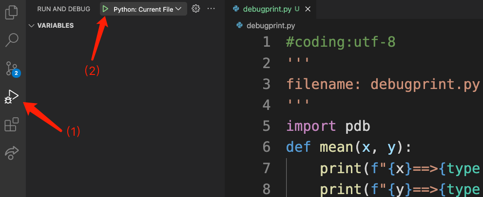
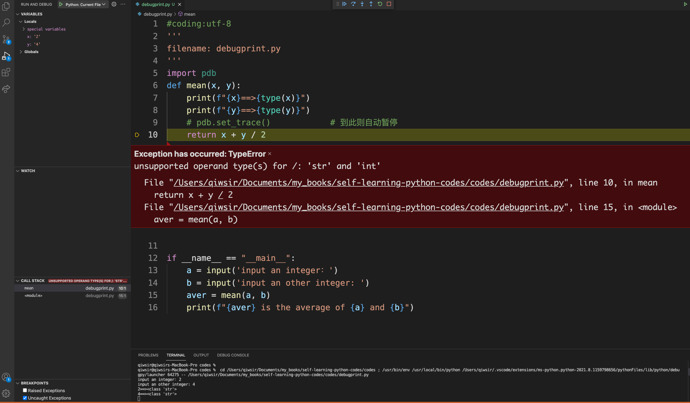
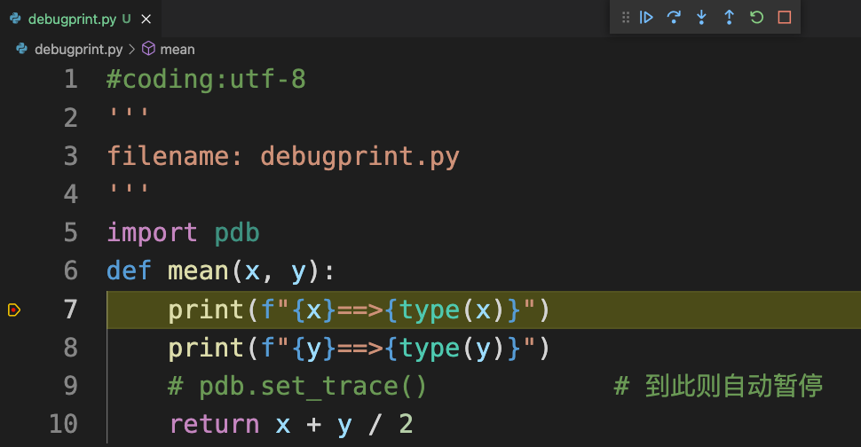

# 第10章 异常和调试

> 万里归来颜愈少，微笑，笑时犹带岭梅香。试问岭南应不好，却道：此心安处是吾乡。
>
> ——苏轼

程序编写好之后，必须调试。在调试的过程中，不仅要“直面”各类错误和异常，还要解决它们。本章要开启的学习内容就是让读者了解到“真的开发者”——真的猛士——所要直面的“惨淡人生”：随处可见的 Bug 和无穷无尽的 Debug。

## 10.1 错误

在程序员的话语中，经常会听到“bug”这个单词。其实，早在计算机出现之前，“bug”已经成为了机械工程中描述“错误”的术语。例如爱迪生在一封信中就曾将发明中遇到故障称为“Bugs” （原文：It has been just so in all of my inventions. The first step is an  intuition, and comes with a burst, then difficulties arise—this thing  gives out and [it is] then that "Bugs"—as such little faults and  difficulties are called—show themselves and months of intense watching,  study and labor are requisite before commercial success or failure is  certainly reached. 源自：https://en.wikipedia.org/wiki/Software_bug）。

至于“bug”用于计算机中，是从一个有意思的故事开始的。根据《维基百科》网站“Software bug”的描述，开发者在调试哈佛的 Mark II 计算机时，发现了一个因为飞蛾（英文：bug）而引起的错误，并将那个幸运的小蛾子取出来贴在了日志记录本上——这个本子被博物馆收藏了，图10-1-1就是贴有 bug 的那一页。从此，单词“bug”就被引入了计算机科学，泛指硬件或软件中导致系统不能正常运行的各类错误、异常、故障等。


<center>图10-1-1 贴有 bug 的日志</center>

在 Python 语言中，导致程序不能运行的原因通常划分为两类：错误和异常。所谓**错误**，指的是**语法错误**，例如：

```python
>>> while 1 print('laoqi')
  File "<stdin>", line 1
    while 1 print('laoqi')
            ^
SyntaxError: invalid syntax
```

解释器会显示有语法错误的代码行，并用 `^` 标记出错误的位置。

除了语法错误之外，程序中还有另一类名为“逻辑错误”的错误。比如：

```python
>>> def mean(x, y): return x + y / 2   # (1)
...
>>> mean(1, 2)
2.0
```

本意是要创建计算两个数的平均值的函数，如果写成注释（1）那样，在调用的时候不会出现 bug，但结果是错误的。类似这样的错误就是**逻辑错误**（logic error）。

程序中的逻辑错误往往不容易发现，因为它并不会让程序停止工作，一切看起来都那么正常，只是结果可能会非常恶劣。例如1999年9月23日，美国的“火星气候轨道器”与地面控制中心失去联系，事故调查结果竟然是因为国际单位制和英制转换出现了问题，导致探测器未能进入预定轨道。探测器制造商以英制单位“磅力”计算推力，而 NASA 的系统中使用的是国际单位制“牛顿”。NASA 工程师未对制造商所提供的数据进行换算就输入了计算机系统，导致数据混乱，进而导航错误，致使造价高达1.93亿美元的探测器迷航。

所以，特别提醒读者，在写程序的时候，要注意检查逻辑错误，“1.93亿美元”并不是这类错误的最高价格。然而，逻辑错误不是由 Python 解释器来检查的，所以此处不探讨逻辑错误，尽管它很“贵”。

对于初学者而言，引起语法错误的原因通常是细节——魔鬼藏在细节中，比如在语句中使用中文标点符号、代码块的缩进混乱、丢掉冒号或逗号等符号、单词拼写错误，等等。

> **自学建议**
>
> 在励志领域，有一句广为传颂的话：态度决定一切。至少在编程中，这句话还是有道理的。要避免错误（包括逻辑错误和语法错误），态度是第一位的。鲁迅说过，“弄文学的人，只要一坚韧，二认真，三韧长，就可以了”。这三点对“弄代码的人”也适用。

## 10.2 内置异常

异常也是程序中的 bug 。在 Python 中，异常与10.1节中的错误并不相同。例如：

```python
>>> 1 / 0
Traceback (most recent call last):
  File "<stdin>", line 1, in <module>
ZeroDivisionError: division by zero
>>> a
Traceback (most recent call last):
  File "<stdin>", line 1, in <module>
NameError: name 'a' is not defined
>>> '7' + 28
Traceback (most recent call last):
  File "<stdin>", line 1, in <module>
TypeError: can only concatenate str (not "int") to str
```

从语法上分析，它们都没有错误，但是由于其他的各种限制，比如数字 0 不能做分母、不同类型的对象不能相加等，导致程序不能正常执行。像这样的 bug 在 Python 中称为**异常**（Exception）。

当解释器抛出异常的时候，同时会显示“跟踪记录”（Traceback），更优雅地说是“回溯”。后面显示异常的详细信息，包括异常所在位置（文件、行、在某个模块）。最后一行是异常类型及相关说明。

Python 语言将常见的异常列为内置类型，表10-2-1列举了几种常见的内置异常，更多内容推荐参阅官方文档（https://docs.python.org/3/library/exceptions.html#built-in-exceptions）。

表10-2-1 常见异常举例

| 异常                | 描述                                    |
| ------------------- | --------------------------------------- |
| `NameError`         | 尝试访问一个没有申明的变量              |
| `ZeroDivisionError` | 除数为 0                                |
| `SyntaxError`       | 语法错误                                |
| `IndexError`        | 索引超出序列范围                        |
| `KeyError`          | 请求一个不存在的字典关键字              |
| `IOError`           | 输入/输出错误（比如你要读的文件不存在） |
| `AttributeError`    | 尝试访问未知的对象属性                  |

在程序中如果遇到了异常，为了能让程序继续运行，需要对异常进行处理。Python 提供了专门用于处理异常的语句——捕获异常，基本结构如图10-2-1所示。

./images/chapter10-2-1.png)

<center>图10-2-1 捕获异常的语句</center>

### 10.2.1 try 和 except 分支

利用 `try` 和 `except` 分支是最常用的捕获异常方式，其中 `try` 分支下是期望正常执行的代码。如果这部分代码遇到了异常，就由 `except` 分支“接管”，继续执行此分支下的代码。从外在表现看，相当于 `except` “捕获”了异常，并做出相应地处理，比如进行友好提示等。例如：

```python
>>> while 1:
...     try:
...         n = int(input("enter integer:"))    # (1)
...         print(n)
...         break
...     except:
...         print("Watch out! Try again.")
...
enter integer:d
Oo! Try again.
enter integer:7
7
```

在 `try` 分支下，期望用户能按照要求输入整数，注释（1）将用户输入的（ `input()` 函数返回字符串）内容转化为整数，并打印出来，然后终止循环。但，“用户的输入不可信”，如果用户不按照期望输入，执行 `int()` 函数就会抛出异常，例如：

```python
>>> int('a')
Traceback (most recent call last):
  File "<stdin>", line 1, in <module>
ValueError: invalid literal for int() with base 10: 'a'
```

为了不至于因用户“不听劝”而导致程序终止执行，必须对可能的 `ValueError` 异常进行处理，于是使用 `except` 捕获此异常——当出现 `try` 分支下的代码抛出异常时执行 `except` 分支下的代码。捕获异常后，本程序还是“友好地”提醒用户。直到用户按照要求输入了整数，才结束程序。

在 `except` 分支后面，可以明确地声明所捕获的异常类型，从而针对不同异常做不同的处理——精准处理异常。

```python
#coding:utf-8
'''
calculator.py
'''
class Calculator:
    is_raise = True
    def calc(self, expression):
        try:
            return eval(expression)                 # (2)
        except ZeroDivisionError:                   # (3)
            if self.is_raise:
                return "零不能做分母，小学生都知道。"    # (4)
            else:
                return "zero can not be division."  # (5)

if __name__ == "__main__":
    cal = Calculator()
    result = cal.calc("7 / 0")
    print(result)
```

注释（2）应用了一个内置函数 `eval()` ，它能执行字符串形式的表达式，如：

```python
>>> eval("5 / 2")
2.5
>>> eval("7 - 3")
4
```

于是，用实例调用方法 `calc()` 时，给参数 `expression` 提供的就可以是一个字符串形式的表达式，通过注释（2）得到运算结果——这是我们所期望的正常代码。

注释（3）是捕获异常的 `except` 分支，注意这里的写法，在 `except` 后是一个空格，然后是异常类型的名称 `ZeroDivisionError` ，表示此分支仅捕获这种类型的异常，对其他异常不在此分支处理。

在 `except` 分支下的代码中，根据 `self.is_raise` 的“真假”，返回规定的异常信息。在当前的程序中，`self.is_raise` 的值是 `True` ，故会返回注释（4）的信息。执行结果如下：

```shell
% python calculator.py
零不能做分母，小学生都知道。
```

如果对 `calculator.py` 做如下修改：

```python
if __name__ == "__main__":
    cal = Calculator()
    result = cal.calc("7 / a")    # 将 0 替换为 a
    print(result)
```

再次执行：

```python
% python calculator.py 
Traceback (most recent call last):
  File "/Users/qiwsir/Documents/my_books/codes/calculator.py", line 19, in <module>
    result = cal.calc("7 / a")
  File "/Users/qiwsir/Documents/my_books/codes/calculator.py", line 9, in calc
    return eval(expression)
  File "<string>", line 1, in <module>
NameError: name 'a' is not defined
```

程序没有对 `NameError` 异常进行处理，原因就在于注释（3）的 `except` 后面所声明的异常类型不包含 `NameError` ，为了也能处理这种异常，可以这样修改：

```python
#coding:utf-8
'''
calculator.py
'''
class Calculator:
    is_raise = True
    def calc(self, expression):
        try:
            return eval(expression)
        except (ZeroDivisionError, NameError):     # 以元组，包括多种异常
            return "the expression is not right."  # 修改返字符串

if __name__ == "__main__":
    cal = Calculator()
    result = cal.calc("7 / a")
    print(result)
```

然后执行程序：

```python
% python calculator.py
the expression is not right.
```

如此两个异常就都被捕获并处理。但是，这种做法有点粗糙，能不能针对两种不同异常做不同的处理呢？可以设置多个 `except` 分支，每个分支捕获一种类型的异常。

```python
class Calculator:
    is_raise = True
    def calc(self, expression):
        try:
            return eval(expression)
        except ZeroDivisionError:
            return "零不能做分母，小学生都知道。"
        except NameError:
            return "表达式不正确。"
```

如此即实现了对不同类型的异常给予不同处理之目的。

Python 的内置异常，都能输出比较详细的异常信息，有助于开发者修改程序。于是，用下面代码中注释（6）（7）将异常信息打印出来，以便调试程序。

```python
#coding:utf-8
'''
calculator.py
'''
class Calculator:
    is_raise = True
    def calc(self, expression):
        try:
            return eval(expression)
        except ZeroDivisionError:
            return "零不能做分母，小学生都知道。"
        except NameError as e:      # (6)
            print(e)                # (7)
            return "表达式不正确。"
           
if __name__ == "__main__":
    cal = Calculator()
    result = cal.calc("7 / a")
    print(result)
```

执行效果如下：

```shell
% python calculator.py
name 'a' is not defined
表达式不正确。
```

注释（6）的 `NameError as e` ，变量 `e` 引用了异常实例，且异常类中业已定义了 `__str__()` 方法，故可以用注释（7）将异常信息打印出来。

特别提醒，在实际的编程业务中，如果要处理异常，一定不要像此处示例那样返回一个很随意的字符串，通常都要打印异常信息，如注释（6）和（7）那样，或者 `return e` ，如后续代码中所示。

在 `try` 分支下，除了 Python 解释器在编译代码时会遇到异常，有时候还要人为安排异常，即满足某个条件时让程序抛出异常。例如有人就是不喜欢数字 4，就需要对 `expression` 的组成进行判断：

```python
#coding:utf-8
'''
calculator.py
'''
class Calculator:
    is_raise = True
    def calc(self, expression):
        try:
            if '4' in expression:
                raise Exception("4 should not be in the expression.")  # (8)
            return eval(expression)
        except ZeroDivisionError:
            return "零不能做分母，小学生都知道。"
        except NameError as e:
            print(e)
            return "表达式不正确。"
        except Exception as e4:          # (9)
            return e4

if __name__ == "__main__":
    cal = Calculator()
    result = cal.calc("4 / 2")           # (10)
    print(result)
```

先观察执行效果：

```python
% python calculator.py
4 should not be in the expression.
```

注释（10）中输入的参数含有数字 `4` ，被实例方法 `calc()` 中的 `try` 分支下条件语句判断出来后，执行注释（8）所示的语句。其中 `raise` 是 Python 关键词，它能强制抛出任何类型的异常，比如：

```python
>>> raise ZeroDivisionError("零不能做分母")    # (11)
Traceback (most recent call last):
  File "<stdin>", line 1, in <module>
ZeroDivisionError: 零不能做分母
>>> raise ZeroDivisionError                  # (12)
Traceback (most recent call last):
  File "<stdin>", line 1, in <module>
ZeroDivisionError
```

在 `raise` 发起的语句中，可以像注释（11）那样，为异常类型提示信息参数 `"零不能做分母"` ；也可以像注释（12）那样，只抛出异常类型。此外，仅一个 `raise` 也能构成抛出异常的语句，即将当前的异常抛出。

```python
#coding:utf-8
'''
calculator.py
'''
class Calculator:
    is_raise = True
    def calc(self, expression):
        try:
            if '4' in expression:
                raise Exception("4 should not be in the expression.")
            return eval(expression)
        except ZeroDivisionError:
            print("零不能做分母，小学生都知道。")   # 修改
            raise                              # (13)
        except NameError as e:
            print(e)
            return "表达式不正确。"
        except Exception as e4:
            return e4

if __name__ == "__main__":
    cal = Calculator()
    result = cal.calc("7 / 0")                  # 修改
    print(result)
```

注释（13）只用 `raise` 形成了一个语句，即抛出该分支所捕获的异常。执行效果如下：

```python
% python calculator.py
零不能做分母，小学生都知道。
Traceback (most recent call last):
  File "/Users/qiwsir/Documents/my_books/codes/calculator.py", line 23, in <module>
    result = cal.calc("7 / 0")
  File "/Users/qiwsir/Documents/my_books/codes/calculator.py", line 11, in calc
    return eval(expression)
  File "<string>", line 1, in <module>
ZeroDivisionError: division by zero
```

以上通过 if 语句进行判断，满足条件则触发异常，执行 raise 语句。在 Python 中还有一个关键词，用它构造一个语句，能够免去 if 语句。

```python
#coding:utf-8
'''
calculator.py
'''
class Calculator:
    is_raise = True
    def calc(self, expression):
        try:
            # if '4' in expression:
            #     raise Exception("4 should not be in the expression.")
            assert ('4' not in expression), "assert: 4 should not be in the expression."
            return eval(expression)
        except ZeroDivisionError:
            print("零不能做分母，小学生都知道。")
            raise
        except NameError as e:
            print(e)
            return "表达式不正确。"
        except Exception as e4:
            return e4

if __name__ == "__main__":
    cal = Calculator()
    result = cal.calc("4 / 2")
    print(result)
```

将原来的条件语句及 raise 语句注释掉，改用关键词 `assert` 发起的语句，其基本结构是：

```python
assert expression_1 [, expression_2]
```

如果只有 `expression_1` ，等效于：

```python
if not expression_1:
    raise AssertionError
```

例如：

```python
>>> author = 'laoqi'
>>> assert author == 'zhangsan'
Traceback (most recent call last):
  File "<stdin>", line 1, in <module>
AssertionError
```

如果有 `expression_2` ，则等效于：

```python
if not expression_1:
    raise AssertError(expresion_2)
```

例如：

```python
>>> assert author == 'zhangsan', 'author is not other'
Traceback (most recent call last):
  File "<stdin>", line 1, in <module>
AssertionError: author is not other
# 等效
>>> if not author == 'zhangsan':
...     raise AssertionError("author is not other")
...
Traceback (most recent call last):
  File "<stdin>", line 2, in <module>
AssertionError: author is not other
```

理解了上述内容之后，再回头阅读刚刚在 `calculator.py` 中增加的 assert 语句，肯定能理解了。

### 10.2.2 else 和 finally 分支

在图10-2-1所示的结构中，else 和 finally 两个分支是可选项。其中 else 分支会在没有发生异常时执行：

```python
# 执行 else 分支
>>> try:
...     print('this is try.')
... except:
...     print('this is except.')
... else:
...     print('this is else.')
...
this is try.
this is else.

# 不执行 else 分支
>>> try:
...     print(1/0)
... except:
...     raise
... else:
...     print('this is else.')
...
Traceback (most recent call last):
  File "<stdin>", line 2, in <module>
ZeroDivisionError: division by zero
```

可以说 `else` 是 `try` 的跟随者；另外一个 `finally` 则是“终结者”，不论前面执行哪个分支，最后都要执行它。例如：

```python
>>> try:
...     print('this is try.')
... except:
...     print('this is except.')
... else:
...     print('this is else.')
... finally:
...     print('this is finally.')
...
this is try.
this is else.
this is finally.
>>> try:
...     print(1/0)
... except:
...     print('this is except')
... else:
...     print('this is else.')
... finally:
...     print('this is finally.')
...
this is except
this is finally.
```

通过图10-2-1所示的语句结构，可以捕获代码中的异常，而后根据需要对异常做出不同的处理。此处所探讨的异常均为 Python 内置异常，它们是 Python 的内置对象，也是对象类型。比如 `NameError` ，可以用之前的方法查看它所继承的父类以及它的类型，或者它在内存中的地址。

```python
>>> NameError.__bases__
(<class 'Exception'>,)
>>> NameError.__class__
<class 'type'>
>>> NameError
<class 'NameError'>
>>> id(NameError)
4407854000
```

> **自学建议**
>
> 从开始自学到现在，磕磕碰碰，必定遇到了很多错误和异常。现在回头看看，不免自己对其中某些错误和异常会感到羞愧，它可能是因为单词拼写错误、可能是因为少些了冒号、可能是因为用了中文标点符号、可能是因为字母大小写弄错了，等等，都是“比较初级的错误”。但当时就无论如何也发现不了，而且非常气恼，或者自责为什么这么“笨”，或者痛骂这本书的作者为什么写得这么垃圾，更甚者在网上对作者狂喷——我隔着屏幕都感觉到迎面而来的唾沫。发泄不满之后，还能回到计算机前继续认真地敲代码，常常会“柳暗花明又一村”。若极端地一气之下就不学了，则会痛失“改变世界的机会”——最后只能在网上传播自己的失败原因：书太烂了。这其实彻底承认自己失败了。
>
> 真正有志于自学者，当牢记“吾日三省吾身：为人谋而不忠乎？与朋友交而不信乎？传不习乎？”——只需三分之一，“传不习乎”，必能成就未来。

## 10.3 自定义异常对象

虽然内置异常已经涵盖了通常的需求，毕竟不能面面俱到，在实际情况中，还有力所不及之处。例如就没有专门针对负数的异常，这应该是实际中比较常见的一类需要吧，年龄、体重、身高等都不能是负数。为了解决内置异常所不及的问题，必须自定义异常。

由于异常也是对象或对象类型，那么自定义异常的方法就与第8章和第9章自定义对象类型的方法一样。

```python
>>> class CustomError(Exception): pass    # (1)
...
>>> raise CustomError
Traceback (most recent call last):
  File "<stdin>", line 1, in <module>
__main__.CustomError
>>> raise CustomError('寡人有疾')
Traceback (most recent call last):
  File "<stdin>", line 1, in <module>
__main__.CustomError: 寡人有疾
```

在注释（1）中定义了异常类 `CustomError` ，它是 `Exception` 类的子类——自定义的异常至少要继承 `Exception` 。在自定义的异常类 `CustomError` 中只有 `pass` 语句，表示此异常类不做其他操作。

从两个 raise 语句的执行结果可知，这个自定义的异常能够被 `raise` 抛出，并且像之前使用过的内置异常那样，显示异常类型和信息。

了解了自定义异常的基本形式之后，打开 IDE，编写一个较为复杂的异常类型。

```python
#coding:utf-8
'''
filename: customexception.py
'''

class MyCustomError(Exception):
    def __init__(self, *args):
        if args:
            self.message = args[0]
        else:
            self.message = None

    def __str__(self):
        print('calling str')
        if self.message:
            return 'MyCustomError, {0} '.format(self.message)
        else:
            return 'MyCustomError has been raised'
```

在文件当前位置进入交互模式（参阅第8章8.5.2节），执行如下操作：

```python
>>> from customexception import *
>>> raise MyCustomError
Traceback (most recent call last):
  File "<stdin>", line 1, in <module>
calling str
customexception.MyCustomError: MyCustomError has been raised

>>> raise MyCustomError('I have a problem')
Traceback (most recent call last):
  File "<stdin>", line 1, in <module>
calling str
customexception.MyCustomError: MyCustomError, I have a problem 
```

对于 Python 的内置对象字典，读者一定相当熟悉了。下面要定义一种有特殊要求的字典，它的键值对的值只能是整数或浮点数，如果不满足这个条件就要抛出异常——显然内置异常类型中没有此种异常，为此就需要自定义。

首先自定义有特殊要求的字典：

```python
#coding:utf-8
'''
filename: mydict.py
'''
class CustomIntFloatDict(dict):
    empty_dict = {}
    
    def __init__(self, key=None, value=None):
        if key is None or value is None:
            self.get_dict()
        elif not isinstance(key, (tuple, list,)) or \
             not isinstance(value, (tuple, list)):    # (2)
            raise KeyValueContructError(key, value)
        else:
            zipped = zip(key, value)
            for k, val in zipped:
                if not isinstance(val, (int, float)):   # (3)
                    raise IntFloatValueError(val)
                dict.__setitem__(self, k, val)

    def get_dict(self):
        return self.empty_dict

    def __setitem__(self, key, value):
        if not isinstance(value, (int, float)):        # (4)
            raise IntFloatValueError(value)
        return dict.__setitem__(self, key, value)
```

在初始化方法 `__init__()` 中，注释（2）的条件分支判断所输入的 `key` 和 `value` 的参数（注意区别于 `dict` 类型中的键和值），如果不是元组或列表，则抛出异常 `KeyValueContructError` ——此异常需要定义，即只能用类似 `CustomIntFloatDict(['a', 'b'], [1, 2])` 的形式创建这个类的实例（自定义的类字典对象）。

注释（3）和（4）中判断实例中键值对的值是否是整数或浮点数，若不满足条件则抛出异常 `IntFloatValueError` ——另外一个待定义的异常类。

下面就定义两个异常类。注意，写在 `CustomIntFloatDict` 类前面。

```python
#coding:utf-8
'''
filename: mydict.py
'''
class IntFloatValueError(Exception):
    def __init__(self, value):
        self.value = value

    def __str__(self):
        return f'{self.value} is invalid input, CustomIntFloatDict can only accept integers and floats as its values'

class KeyValueContructError(Exception):
    def __init__(self, key, value):
        self.key = key
        self.value = value

    def __str__(self):
        return 'keys and values need to be passed as either list or tuple' + '\n' + f' {self.key} is of type: {str(type(self.key))}' + '\n' + f' {self.value} is of type: {str(type(self.value))}'


class CustomIntFloatDict(dict):
    empty_dict = {}
    
    def __init__(self, key=None, value=None):
        if key is None or value is None:
            self.get_dict()
        elif not isinstance(key, (tuple, list,)) or \
             not isinstance(value, (tuple, list)):    # (2)
            raise KeyValueContructError(key, value)
        else:
            zipped = zip(key, value)
            for k, val in zipped:
                if not isinstance(val, (int, float)):   # (3)
                    raise IntFloatValueError(val)
                dict.__setitem__(self, k, val)

    def get_dict(self):
        return self.empty_dict

    def __setitem__(self, key, value):
        if not isinstance(value, (int, float)):         # (4)
            raise IntFloatValueError(value)
        return dict.__setitem__(self, key, value)
```

在文件的当前位置进入交互模式，进行如下测试：

```shell
>>> from mydict import *

# 空“类字典”对象
>>> d1 = CustomIntFloatDict()
>>> d1
{}

# 创建实例的参数中，key 不是元组或列表
>>> d2 = CustomIntFloatDict({"a", "b"}, [7, 28])
Traceback (most recent call last):
  File "<stdin>", line 1, in <module>
  File "/Users/qiwsir/Documents/my_books/codes/mydict.py", line 30, in __init__
    raise KeyValueContructError(key, value)
mydict.KeyValueContructError: keys and values need to be passed as either list or tuple
 {'b', 'a'} is of type: <class 'set'>
 [7, 28] is of type: <class 'list'>
 
 # 创建实例的参数中，value 不都是整数或浮点数
 >>> d3 = CustomIntFloatDict(("a", "b"), ['seven', 28])
Traceback (most recent call last):
  File "<stdin>", line 1, in <module>
  File "/Users/qiwsir/Documents/my_books/codes/mydict.py", line 35, in __init__
    raise IntFloatValueError(val)
mydict.IntFloatValueError: seven is invalid input, CustomIntFloatDict can only accept integers and floats as its values

# 正确操作
>>> d3 = CustomIntFloatDict(("a", "b"), [7, 28])
>>> d3
{'a': 7, 'b': 28}
>>> d3['c'] = 11.11
>>> d3
{'a': 7, 'b': 28, 'c': 11.11}

# 这样不允许
>>> d3['d'] = 'laoqi'
Traceback (most recent call last):
  File "<stdin>", line 1, in <module>
  File "/Users/qiwsir/Documents/my_books/codes/mydict.py", line 43, in __setitem__
    raise IntFloatValueError(value)
mydict.IntFloatValueError: laoqi is invalid input, CustomIntFloatDict can only accept integers and floats as its values
```

在编程中，捕获并处理各种异常是在所难免、司空见惯的，引用《维基百科》中对“异常处理”词条的说明，读者可以更全面地理解异常处理的必要性：

> 异常处理，是编程语言或计算机硬件里的一种机制，用于处理软件或信息系统中出现的异常状况（即超出程序正常执行流程的某些特殊条件）。

通过异常处理，可以对用户在程序中的非法输入进行控制和提示，以防程序崩溃。

> **自学建议**
>
> 正在写本节内容时，收到一位读者的信息，他（在 QQ 群里的不晓得性别）问是否能提供一些经典的代码案例，让他来深入研读，从而掌握写代码的常用技能。就如参加“考研”辅导的时候，老师在考试前提供了一些经典的英语作文，只要背下来，考试的时候就能用上。
>
> 或许还会有其他人有类似的需要吧。对那种“应试”之法是否有利于个人发展，此处不给予评论，但是若把该方法搬到学习编程上，还有待商榷。用本书学习，不是为了考试（如果以考试为目的，请参阅考试指定的考试专用资料），是为了提升个人的编程能力，进而能解决实际问题。实际问题，不能依靠“背诵本本”解决（参阅第7章7.1.4节【自学建议】）。所谓的“经典代码”，在致力于解决实际问题的程序中，是不存在的。所有代码都是因着某个具体情况（包括人、物等）而出现的。
>
> 没有“经典代码”，并不意味着没有“相对好的代码”。对初学者而言，有经验开发者编写的代码就是“相对好的代码”，可供参考学习。当学习者站在了有经验开发者的肩膀上之后，还会发现自己佩服过的那些代码也是可以或者应该继续优化的。
>
> 在编程领域，没有“经典代码”，不要奢望“代码大全”能解决问题。“三更灯火五更鸡”，唯闻鸡起舞，方一览众山小。

## 10.4 调试

在计算机程序中，**调试**（Debug）是发现和减少程序错误的过程。显然，这是一项实践性非常强的工作，不是看几页书就能完全掌握的，需要“久经考验”，不断总结经验，才能练就火眼金睛。但是，这也不意味着调试的技巧就无从学起。本节就根据经验介绍几种常用方法，供读者参考练习——当然是以 Python 程序为例，其他编程语言的程序会有所不同。

**1. 使用 print() 函数**

这是一种非常简单、直观的调试方法，也是在开发实践中应用最普遍的方法。使用 `print()` 函数，将代码中必要的内容输出到控制台，通过观察输出结果，判断代码可能存在的问题。例如：

```python
#coding:utf-8
'''
filename: debugprint.py
'''
def mean(x, y):
    return x + y / 2

if __name__ == "__main__":
    a = input('input an integer：')
    b = input('input an other integer: ')
    aver = mean(a, b)
    print(f"{aver} is the average of {a} and {b}")
```

如果运行上述程序，会抛出异常。

```python
% python debugprint.py
input an integer：2
input an other integer: 4
Traceback (most recent call last):
  File "/Users/qiwsir/Documents/my_books/codes/debugprint.py", line 11, in <module>
    aver = mean(a, b)
  File "/Users/qiwsir/Documents/my_books/codes/debugprint.py", line 6, in mean
    return x + y / 2
TypeError: unsupported operand type(s) for /: 'str' and 'int'
```

根据已学知识，“一眼”就知道异常出现的原因了。暂请佯装不知，以便能“演下去”。

从回溯（Traceback）中可知，最终出问题的在 `line 6 ` 中的 `return x + y / 2` 。因为这里就是用到了函数的两个参数，所以应该先看看传给函数 `mean()` 的两个参数的值是什么。于是可以在函数中增加 `print()` （注意，只增加打印输出，不对程序做任何其他修改）。

```python
#coding:utf-8
'''
filename: debugprint.py
'''
def mean(x, y):
    print(f"{x}==>{type(x)}")
    print(f"{y}==>{type(y)}")
    return x + y / 2

if __name__ == "__main__":
    a = input('input an integer：')
    b = input('input an other integer: ')
    aver = mean(a, b)
    print(f"{aver} is the average of {a} and {b}")
```

执行后的结果为：

```python
% python debugprint.py
input an integer：2
input an other integer: 4
2==><class 'str'>
4==><class 'str'>
Traceback (most recent call last):
  File "/Users/qiwsir/Documents/my_books/self-learning-python-codes/codes/debugprint.py", line 13, in <module>
    aver = mean(a, b)
  File "/Users/qiwsir/Documents/my_books/self-learning-python-codes/codes/debugprint.py", line 8, in mean
    return x + y / 2
TypeError: unsupported operand type(s) for /: 'str' and 'int'
```

从上述输出结果可知，传给 `mean()` 的两个实参，与输入的一样，其类型是字符串类型。这就找到了导致 `TypeError: unsupported operand type(s) for /: 'str' and 'int'` 异常的原因，也就能制定修改方案了。

当将输入变量 `a` 和 `b` 分别转化为整数或浮点数之后，虽然没有上述异常信息了，但程序还有“逻辑错误”——请读者自行调试并修改。

**2. 使用 pdb 模块**

Python 标准库中的 pdb 模块是一个交互式的代码调试器，利用它能实现设置断点、单步执行等操作（官方文档：https://docs.python.org/zh-cn/3/library/pdb.html）。

在 Python 交互模式中，执行如下操作。

```python
>>> import pdb
>>> def fun(x, y):
...     z = x + y
...     k = x * y
...     r = z / k
...     return r
...
>>> pdb.run("fun(1, 0)")      # (1)
> <string>(1)<module>()->None
(Pdb)
```

注释（1）用 `pdb.run()` 函数来执行前面定义的函数 `fun()` ——必须要给函数提供实参。写入注释（1）所示的代码之后，敲回车，出现后面的信息，光标停留在 `(Pdb)` 的后面，等待输入指令。输入 `n` （next），表示继续运行，出现如下所示结果：

```python
>>> pdb.run("fun(1, 0)")       # (1)
> <string>(1)<module>()->None
(Pdb) n
ZeroDivisionError: division by zero
> <string>(1)<module>()->None
(Pdb)
```

说明函数中抛出了 `ZeroDivisionError` 异常。继续输入 `n` 直到调试结束，返回到 `>>>` 状态。

```python
> <string>(1)<module>()->None
(Pdb) n
--Return--
> <string>(1)<module>()->None
(Pdb) n
Traceback (most recent call last):
  File "<stdin>", line 1, in <module>
  File "/Library/Frameworks/Python.framework/Versions/3.9/lib/python3.9/pdb.py", line 1597, in run
    Pdb().run(statement, globals, locals)
  File "/Library/Frameworks/Python.framework/Versions/3.9/lib/python3.9/bdb.py", line 580, in run
    exec(cmd, globals, locals)
  File "<string>", line 1, in <module>
  File "<stdin>", line 4, in fun
ZeroDivisionError: division by zero
>>>
```

如果用 `pdb` 模块调试程序，以前面编写的 `debugprint.py` 文件为例，在文件所在位置，执行下述指令，并进入到 `(Pdb)` 状态。

```shell
% python3 -m pdb debugprint.py
> /Users/qiwsir/Documents/my_books/codes/debugprint.py(2)<module>()
-> '''
(Pdb) 
```

显示已经执行到 `debugprint.py` 文件的第二行的程序文档。而后等待输入后续调试指令。

输入 `l` ，显示当前所调试程序的所有代码（此处省略显示）。

输入 `n` ，进行单步执行。

```shell
(Pdb) n
> /Users/qiwsir/Documents/my_books/codes/debugprint.py(5)<module>()
-> def mean(x, y):
(Pdb) 
```

这样就进入到函数 `mean()` 部分。如此，一步一步地调试下去。

```shell
> /Users/qiwsir/Documents/my_books/codes/debugprint.py(10)<module>()
-> if __name__ == "__main__":
(Pdb) n
> /Users/qiwsir/Documents/my_books/codes/debugprint.py(11)<module>()
-> a = input('input an integer：')
(Pdb) n
input an integer：2
> /Users/qiwsir/Documents/my_books/codes/debugprint.py(12)<module>()
-> b = input('input an other integer: ')
(Pdb) n
input an other integer: 4
> /Users/qiwsir/Documents/my_books/codes/debugprint.py(13)<module>()
-> aver = mean(a, b)
(Pdb) n
2==><class 'str'>
4==><class 'str'>
TypeError: unsupported operand type(s) for /: 'str' and 'int'
> /Users/qiwsir/Documents/my_books/codes/debugprint.py(13)<module>()
-> aver = mean(a, b)
(Pdb) n
--Return--
> <string>(1)<module>()->None
(Pdb) 
```

直到发现异常。

在 `(Pdb)` 状态下输入 `q` 退回到命令行状态。

除了一步一步地调试，也可以在程序中使用 `pdb` 模块，例如下面的修改：

```python
#coding:utf-8
'''
filename: debugprint.py
'''
import pdb
def mean(x, y):
    print(f"{x}==>{type(x)}")
    print(f"{y}==>{type(y)}")
    pdb.set_trace()            # (2) 到此则自动暂停
    return x + y / 2

if __name__ == "__main__":
    a = input('input an integer：')
    b = input('input an other integer: ')
    aver = mean(a, b)
    print(f"{aver} is the average of {a} and {b}")
```

 执行此程序，到注释（2）处程序会自动暂停。

```shell
% python debugprint.py
input an integer：2
input an other integer: 4
2==><class 'str'>
4==><class 'str'>
> /Users/qiwsir/Documents/my_books/self-learning-python-codes/codes/debugprint.py(10)mean()
-> return x + y / 2
(Pdb) 
```

输入 `p a` 则会显示变量 `a` 的值，输入 `p b` 显示变量 `b` 的值。

```python
(Pdb) p a
'2'
(Pdb) p b
'4'
(Pdb) n
TypeError: unsupported operand type(s) for /: 'str' and 'int'
> /Users/qiwsir/Documents/my_books/self-learning-python-codes/codes/debugprint.py(10)mean()
-> return x + y / 2
```

这样也定位到了问题之所在。

此处仅以简要的示例说明 `pdb` 模块在调试中的应用，更复杂的有关调试命令，请参阅官方文档。

**3. 使用 IDE 的调试功能**

目前常用的 IDE 都提供了非常友好的调试功能，恐怕这才是除了 `print()` 之外，开发者更常用的。下面就以 Visual Studio Code（简称 VS Code） 为例，说明调试方法（其他 IDE 也有调试功能，可以参阅有关专门资料）。

如果已经按照第1章1.8.3节所述，在 Visual Studio Code 上安装了 Python 扩展，其中就包含了调试功能。

如图10-4-1所示，单击左侧活动栏的 Run and Debug（运行和调试，如箭头（1）所示）按钮，进入到调试界面，点击箭头（2）所示的按钮或者按下快捷键 `F5` ，即可运行当前的 Python 程序（仍然以 `debugprint.py` 为例）。



<center>图10-4-1 VS Code 的调试按钮</center> 

注意观察终端，会提示输入两个整数，依次输入之后，呈现图10-4-2所示的状态。



<center>图10-4-2 VS Code 调试效果</center>

中间最显眼的地方，显示当前抛出异常的行和有关异常信息；左侧显示了有关调试信息；顶部还有几个按钮，能够实现单步执行。

**打断点**（Breakpoint）是调试程序的重要技能，在 VS Code 中，可以在任意逻辑行左侧点一下鼠标（如图10-4-3所示），则设置改行为断点，程序运行到此即暂停。


<center>图10-4-3 打断点</center>

执行程序，当运行到图10-4-3所示的断点位置是，即显示图10-4-4所示的效果。



<center>图10-4-4 在断点处暂停</center>

此后可以继续通过点击顶部的按钮向下执行。

在 VS Code 中，可以通过配置 launch.json 文件，制定更复杂的调试功能。对 VS Code 的应用介绍，已经超出了本书范畴，读者可以参考有关专门资料。总之，各种 IDE 提供了简单、直观调试功能，是调试程序的好工具。

> **自学建议**
>
> 第1章1.8.3节的【自学建议】中不推荐读者把太多精力花在对 IDE 的选择和配置上，因为那是刚刚开始编程，注意力不能过于分散。时过境迁，现在已经敲过很多代码了，有了足够的编程经验，且对自己的计算机也比较熟悉了，非常有必要将生产代码的工具弄得先进一些。故特别建议读者应该花一些时间深入研究一番自己选定的 IDE ，配置好各种提升效率的功能，并应用于编写代码、调试程序的实践。
