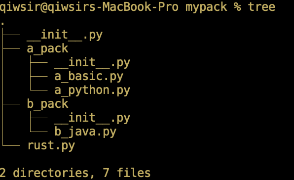
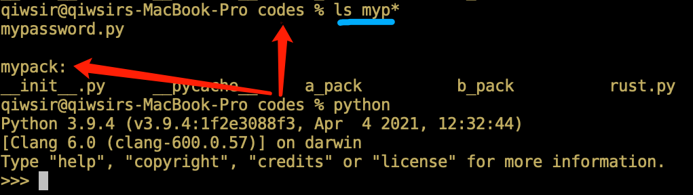
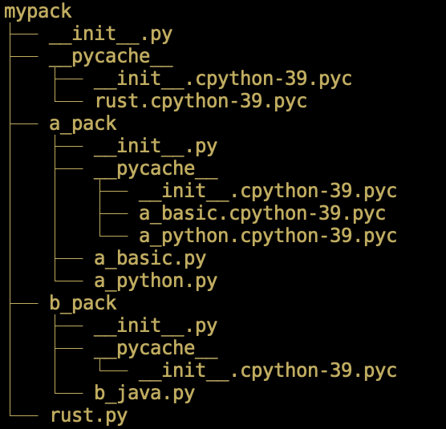
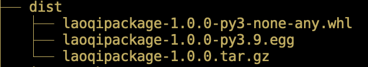
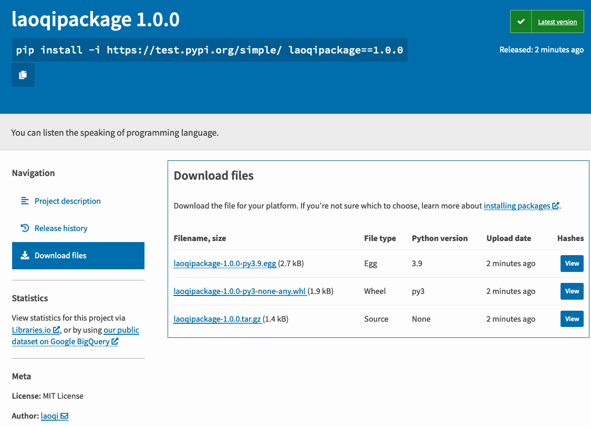

# 第11章 模块和包

> 好雨知时节，当春乃发生。随风潜入夜，润物细无声。
>
> ——杜甫

Python 语言如今能居于各类编程语言排行榜前列，除了它简单易学之外，开放的生态系统也是不容忽视的因素。所谓“开放”，就是每个人都可以根据自己的意愿编写和发布 Python 模块或包；所谓“生态系统”，是指基于 Python 语言的模块和包已经涵盖了能够编写软件的各个领域，不论做哪方面的开发，都能找到可以使用的 Python 模块和包作为“轮子”。虽然“是否重复造轮子”在开发者中争论不休，但作为开始自学的读者，还是应该掌握“造轮子”的基本方法——是不是要亲自动手造，应该“具体问题具体分析”。

## 11.1 模块

Python 的**模块**（Module）就是扩展名为 `.py` 的文件。是不是觉得太简单了？还有更简单的，其实各位读者此前已经使用过它了。自从第8章8.5.2节开始，不止一次“在文件当前位置进入交互模式”，而后执行形式为 `from filename import *` 的操作，于是就可以使用文件 `filename.py` 中所定义的类、函数、变量等对象。这里的 `filename.py` 文件，就是一个模块，而 `from filename import *` 就是从该文件中引入所定义的对象，即模块里面的对象。

尽管已经熟悉，还是用一个示例给予完整说明，温故而知新。在 IDE 中编写如下文件：

```python
#coding:utf-8
'''
filename: mymodule.py
'''
class Book:
    __lang = "python"
    def __init__(self, author):
        self.__author = author
    
    def get_name(self):
        return (self.__author, self.__lang)

def foo(x):
    return x * 2

python = Book("laoqi")
python_name = python.get_name()
x = 2
mul_result = foo(x)
```

保存文件后，要牢记文件所在目录。本书中所使用的代码目录是：`/Users/qiwsir/Documents/my_books/codes` （请特别注意，如此路径表示形式为 Linux 或 MacOS 操作系统中的，如果是 Windows 操作系统，会与此不同。请读者熟悉自己的操作系统）。

然后进入到 Python 交互模式——不一定非要按照第8章8.5.2节中那样“在当前位置进入交互模式”，可以在任何目录位置，进入到 Python 交互模式。执行如下操作：

```python
>>> import sys
>>> sys.path
['', '/Library/Frameworks/Python.framework/Versions/3.9/lib/python39.zip', '/Library/Frameworks/Python.framework/Versions/3.9/lib/python3.9', '/Library/Frameworks/Python.framework/Versions/3.9/lib/python3.9/lib-dynload', '/Library/Frameworks/Python.framework/Versions/3.9/lib/python3.9/site-packages']
```

模块 `sys` 是标准库中的一员（就如同此前用过的 `math` 模块一样，参阅第3章3.3.2节），执行 `sys.path` 后显示的内容会因不同的计算机和操作系统而异。返回值以列表的形式显示了搜索模块的路径，即在这些目录中查找程序所使用的模块（和包）。搜索路径列表的第一项 `sys.path[0]` 是一个空字符串（ `' '` ），表示进入交互模式时的目录，即所谓的“当前位置”——所以在第8章8.5.2节以及之后的很多操作中，强调“从当前位置进入交互模式”。后续其他项都是在本地安装 Python 后默认的搜索目录。

```python
% pwd
/Users/qiwsir
```

上面使用的是 Linux 命令，如果读者使用的是 Windows 操作系统，可以在 CMD 窗口使用 `chdir` 命令。所显示的结果为当前所在位置，注意此位置与之前保存 `mymodule.py` 文件的目录不同。然后在此位置进入到交互模式，并用 `import` 语句在当前环境中引入 `mymodule` 模块：

```python
% pwd
/Users/qiwsir

% python
Python 3.9.4 (v3.9.4:1f2e3088f3, Apr  4 2021, 12:32:44)
[Clang 6.0 (clang-600.0.57)] on darwin
Type "help", "copyright", "credits" or "license" for more information.
>>> import mymodule
Traceback (most recent call last):
  File "<stdin>", line 1, in <module>
ModuleNotFoundError: No module named 'mymodule'
```

Python 解释器会按照 `sys.path` 列表中的搜索目录顺序，依次查找是否有 `mymodule.py` 文件，即 `mymodule` 模块。首先看当前位置 `/Users/qiwsir` 目录，肯定没有 `mymodule.py` 文件，然后是后面个各个目录，也当然没有。最后就抛出了 `ModuleNotFoundError` 异常，虽然已经编写并保存了 `mymodule.py` 文件，但它所在的目录没有列入 `sys.path` 中，Python 解释器还是找不到的——这是一个常见的异常，只要出现此异常，就说明是“搜索路径问题”。

如何解决 `ModuleNotFoundError` 异常？既然 `sys.path` 是一个列表，就可以通过列表的方法，将文件 `mymodule.py` 所在的目录加入其中。接着前面继续操作：

```python
>>> import sys
>>> sys.path
['', '/Library/Frameworks/Python.framework/Versions/3.9/lib/python39.zip', '/Library/Frameworks/Python.framework/Versions/3.9/lib/python3.9', '/Library/Frameworks/Python.framework/Versions/3.9/lib/python3.9/lib-dynload', '/Library/Frameworks/Python.framework/Versions/3.9/lib/python3.9/site-packages']

# 追加 mymodule.py 所在目录 
>>> sys.path.append('/Users/qiwsir/Documents/my_books/codes')
>>> sys.path
['', '/Library/Frameworks/Python.framework/Versions/3.9/lib/python39.zip', '/Library/Frameworks/Python.framework/Versions/3.9/lib/python3.9', '/Library/Frameworks/Python.framework/Versions/3.9/lib/python3.9/lib-dynload', '/Library/Frameworks/Python.framework/Versions/3.9/lib/python3.9/site-packages', '/Users/qiwsir/Documents/my_books/codes']
```

在 Python 搜索目录中增加了 `mymodule.py` 文件所在的目录，再在当前的交互模式中引入模块 `mymodule` ——不要写成 `import mymodule.py` ：

```python
>>> import mymodule
>>> dir(mymodule)
['Book', '__builtins__', '__cached__', '__doc__', '__file__', '__loader__', '__name__', '__package__', '__spec__', 'foo', 'mul_result', 'python', 'python_name', 'x']
```

如此则达成愿望。但要注意，必须是在执行了 `sys.path.append()` 之后的当前交互模式中执行上述操作（也可以用列表的 `insert()` 方法）。否则，`sys.path` 没有该搜索路径。

正确地引入自己编写的模块之后，执行 `dir(mymodule)` 可以查看此模块能提供的东西，与 `mymodule.py` 文件对照：

- `Book` 是文件中定义的类；
- `foo` 是文件中定义的函数；
- `python` 是文件中实例化 `Book` 类时用的一个变量；
- `python_name` 也是文件中的一个变量；
- `x` 和 `mul_result` 都是文件中定义的变量。

接下来，在当前的 Python 交互模式中，就可以使用文件 `mymodule.py` 中定义的类 `Book` 和函数 `foo()` ：

```python
>>> my_book = mymodule.Book("qiwei")
>>> my_book.get_name()
('qiwei', 'python')
>>> f = mymodule.foo(3)
>>> f
6
```

其他的变量，如 `python` 、`python_name` 、`mul_result` 、`x` ，实则没有什么用，因为它们是在 `mymodule.py` 文件中调用类 `Book` 和函数 `foo()` 时所使用的，对于使用该模块的程序环境而言，它们都是多余的。所以，在 `mymodule.py` 中就不应该有它们，可以将其删除，只保留类 `Book` 和函数 `foo()` ，并保存 `mymodule.py` 文件。再次引入模块：

```python
>>> import mymodule
>>> dir(mymodule)
['Book', '__builtins__', '__cached__', '__doc__', '__file__', '__loader__', '__name__', '__package__', '__spec__', 'foo', 'mul_result', 'python', 'python_name', 'x']
```

会发现，引入的模块内容并没有因为修改了 `mymodule.py` 文件而改变，这里必须要使用第8章8.5.2节中所提到的“重载”模块方法——最灵验的方法是退出交互模式，重新进入，并将 `mymodule.py` 的路径加入到 `sys.path` 中。

```python
>>> import sys
>>> sys.path.append('/Users/qiwsir/Documents/my_books/codes')
>>> import mymodule
>>> dir(mymodule)
['Book', '__builtins__', '__cached__', '__doc__', '__file__', '__loader__', '__name__', '__package__', '__spec__', 'foo']
```

现在看到的 `mymodule` 模块不再包含那些变量了。这才达到了创建和引入 `mymodule` 的最终目的。

其实，之前我们写的程序文件，都不是像前面那样使用该文件中的函数或者类，而是这样做的（参阅第7章7.1.1节的注释（2），从那之后的很多程序都如法炮制）：

```python
#coding:utf-8
'''
filename: mymodule.py
'''
class Book:
    __lang = "python"
    def __init__(self, author):
        self.__author = author
    
    def get_name(self):
        return (self.__author, self.__lang)

def foo(x):
    return x * 2

if __name__ == '__main__':
    python = Book("laoqi")
    python_name = python.get_name()
    x = 2
    mul_result = foo(x)
```

将增加了 `if__name__ == '__main__'` 的 `mymodule.py` 文件作为模块引入，会有什么不同？再次重载之后，执行下述操作。

```python
>>> import mymodule
>>> dir(mymodule)
['Book', '__builtins__', '__cached__', '__doc__', '__file__', '__loader__', '__name__', '__package__', '__spec__', 'foo']
```

条件语句下面的那些变量都没有作为模块 `mymodule` 中的一员，与不在 `mymodule.py` 中写调用类和函数的情况完全一样。那么， `if__name__ == '__main__'` 有何神奇之处？

先创建一个名为 `foo.py` 的文件，并输入如下内容：

```python
#coding:utf-8
'''
filename: foo.py
'''
print(f"foo __name__ is set to {__name__}")
```

然后执行此文件：

```shell
% python foo.py
foo __name__ is set to __main__
```

在 `foo.py` 中使用了一个变量 `__name__` ，但其中的用法有点特殊，因为并没有将该变量引用任何对象，像这样的情况如果出现在其他变量中必然会抛出 `NameError` 异常，同时会提示该变量没有定义。然而，`__name__` 是一个特殊的变量，更准确地说，它是当前模块（文件 `foo.py` 就是一个 Python 模块）的一个属性，当在模块文件的空间执行时（此处即在 `foo.py` 的空间），`__name__` 的值是 `__main__` 。

再创建一个名为 `bar.py` 的文件，并与 `foo.py` 在同一个目录中。

```python
#coding:utf-8
'''
filename: bar.py
'''
import foo
```

执行之后，显示结果如下：

```python
% python bar.py
foo __name__ is set to foo
```

依照前面所述，在 `bar.py` 文件空间，`__name__` 的值应该为 `__main__` 。然而，在 `bar.py` 中实施了 `import foo` ，则此时 `__name__` 的值就变为了 `foo` 。

再修改 `foo.py` 文件，最终代码如下所示：

```python
#coding:utf-8
'''
filename: foo.py
'''
print(f"foo __name__ is set to {__name__}")

def main():
    print('The main() function was executed.')

if __name__ == '__main__':
    main()
else:
    print('Do not execute main() funciton!')
```

执行此文件，结果是：

```python
% python foo.py
foo __name__ is set to __main__
The main() function was executed.
```

在 `bar.py` 中，引入 `foo` 模块，再执行 `bar.py` ，效果如下：

```shell
% python bar.py
foo __name__ is set to foo
Do not execute main() funciton!
```

从执行结果的比较中会发现，当 `foo.py` 作为模块在另外一个文件中被引入后（不在同一个文件空间），`__name__` 的值不再是 `__main__` ，if 分支下的代码块不再被执行，因此它们所产生的各种对象都不会代入到 `foo` 模块中。

所以，可以在 `.py` 文件中用 `if __name__ == '__main__'` 调用本文件中的各类对象，当本文件作为模块被其他文件引入是，并不会为模块增加累赘之物。有的资料，会仿照 C 语言等的说法，称“ `if __name__ == '__main__'` ”是 Python 程序的入口，当然这并不是典型的 Python 开发者的术语。 

> **自学建议**
>
> 每一个 `.py` 文件都可以作为一个模块，因此开发实践中，常常会把功能类似的代码组织到一个文件中，或者每个文件实现某类功能（可能是一个，也可能是多个）。这样做的优势在于：
>
> - 便于代码的维护。
> - 将每个文件当做模块，在最终执行的程序中引入后即可使用，使得代码更整洁、便于阅读。
>
> 所以，工程实践中提倡以模块为单元组织代码。

## 11.2 包

**包**（Package），顾名思义，应该比模块“大”。

通常，“包”是有一定层次的目录结构，它由一些 `.py` 文件或者子目录组成，并且，每个目录中要包含名为 `__init__.py` 的文件。如图11-2-1所示，创建了一个名为 `mypack` 的目录，在该目录内有一个`__init__.py` 文件和一个名为 `rust.py` 的文件，另外有两个子目录 `a_pack` 和 `b_pack` ——即两个“子包”，在这两个子目录中分别创建了图中所显示的 `.py` 文件（注意：图示中的 `tree` 是 Linux 命令，用于显示目录结构。使用 Windows 操作系统的读者不要搬用）。



<center>图11-2-1 mypack 包的目录结构</center> 

然后在 `rust.py` 、 `a_basic.py` 、` a_python.py` 、`b_java` 文件中分别写入如下代码。

```python
#coding:utf-8
'''
filename rust.py
'''
def rust_func():
    return "I learn Rust."
```

```python
#coding:utf-8
'''
filename a_basic.py
'''
def a_basic_func():
    return "I learn BASIC."
```

```python
#coding:utf-8
'''
filename a_python.py
'''
def a_python_func():
    return "I learn Python."
```

```python
#coding:utf-8
'''
filename b_java.py
'''
def a_java_func():
    return "I learn Java."
```

这样就创建了一个包 `mypack` ，它里面包括一个模块 `rust.py` ；还有两个“子包”，其中也包含由 `.py` 文件构成的模块。

如何使用这个包？下面在交互模式中演示，特别注意进入交互模式的位置，因为这关系到搜索路径的问题。

首先，在 `mypack` 所在目录中进入到交互模式（如图11-2-2所示，目录 `./codes` 里有包 `mypack` ，即在 `./codes` 处进入 Python 交互模式）。



<center>图11-2-2 在当前位置进入交互模式</center>

然后引入包 `mypack` ，如下操作，并用内置函数 `dir()` 显示包的内容：

```python
>>> import mypack
>>> dir(mypack)
['__builtins__', '__cached__', '__doc__', '__file__', '__loader__', '__name__', '__package__', '__path__', '__spec__']
```

在结果中没有看到 `mypack` 包里面的模块，也没有子包。如果非要访问包里面的模块 `rust` ：

```python
>>> mypack.rust
Traceback (most recent call last):
  File "<stdin>", line 1, in <module>
AttributeError: module 'mypack' has no attribute 'rust'
```

抛出了 `AttributeError` 异常。分明已经定义了，为什么找不到？——此时请不要怀疑是 Python 的问题，更不要怀疑是本书写错了。其原因在于我们没有告诉 Python 解释器模块 `rust` 在哪里——难道它不会自己找吗？不会。Python 不知道贵计算机中有几个 `rust.py` 文件，也不知道贵开发者想要的是哪一个 `rust` 模块。所以，在《Python 之禅》中有一句：面对不确定性，拒绝妄加猜测（参阅第1章1.4节）。

```python
>>> import mypack.rust    # (1)
>>> dir(mypack.rust)
['__builtins__', '__cached__', '__doc__', '__file__', '__loader__', '__name__', '__package__', '__spec__', 'rust_func']
>>> mypack.rust.rust_func()
'I learn Rust.'
```

注释（1）用 `mypack.rust` 的方式指明了模块的明确路径，并将该模块引入。类似的，还可以这样做：

```python
>>> from mypack import rust   # (2)
>>> dir(rust)
['__builtins__', '__cached__', '__doc__', '__file__', '__loader__', '__name__', '__package__', '__spec__', 'rust_func']
>>> rust.rust_func()
'I learn Rust.'
```

注释（1）和注释（2）本质是一样的方法，均是以 `mypack` 包为路径，指明所引入的模块位置和名称。

如果用 `import mypack` 就没有什么价值了吗？至少目前是。为了让 `import mypack` 能有价值，需要编辑其下的 `__init__.py` 文件（注意，是 `./mypack` 目录下的，不是子目录下的）。

```python
'''
filename: ./mypack/__init__.py
'''
from . import rust    # (3)
```

在执行 `import mypack` 的时候，会首先检查其下的 `__init__.py` 文件是否有应该执行的代码。现在文件中增加注释（3）所示代码，注意书写的时候，不要丢掉 `.` 符号，它表示当前位置，即从当前位置引入模块 `rust` 。保存文件之后，重新加载包 `mypack` （最简单的方法是退出当前交互模式后再键入 `python` ，或参考第8章8.5.2节的方法）：

```python
>>> import mypack
>>> dir(mypack)
['__builtins__', '__cached__', '__doc__', '__file__', '__loader__', '__name__', '__package__', '__path__', '__spec__', 'rust']
>>> mypack.rust       # (4)
<module 'mypack.rust' from '/Users/qiwsir/Documents/my_books/codes/mypack/rust.py'>
>>> mypack.rust.rust_func()
'I learn Rust.'
```

现在查看包 `mypack` 里的内容，就能显示模块 `rust` 了，并且以注释（4）的方式能够调用模块。

再进一步，子包 `a_pack` 和 `b_pack` 如何引入？方法也类似：

```python
>>> from mypack import a_pack            # (5)
>>> dir(a_pack)
['__builtins__', '__cached__', '__doc__', '__file__', '__loader__', '__name__', '__package__', '__path__', '__spec__']
>>> from mypack.a_pack import a_basic    # (6)
>>> dir(a_basic)
['__builtins__', '__cached__', '__doc__', '__file__', '__loader__', '__name__', '__package__', '__spec__', 'a_basic_func']
>>> a_basic.a_basic_func()
'I learn BASIC.'
```

注释（5）又如同在注释（1）之前的 `import mypack` 那样，看不到子包里的模块；注释（6）则以明确的路径声明了子包模块的位置，与注释（2）含义一样。如果想用注释（5）引入子包，并能看到子包的模块，可以仿照注释（3），在 `./mypack/a_pack/__init__.py` 中增加如下代码：

```python
'''
filename: ./mypack/a_pack/__init__.py
'''
from . import a_basic
from . import a_python
```

在交互模式中重新加载之后，执行如下操作：

```python
>>> from mypack import a_pack
>>> dir(a_pack)
['__builtins__', '__cached__', '__doc__', '__file__', '__loader__', '__name__', '__package__', '__path__', '__spec__', 'a_basic', 'a_python']
>>> a_pack.a_python.a_python_func()
'I learn Python.'
```

前面编辑了 `./mypack/__init__.py` 文件，就能在 `import mypack` 之后，通过 `mypack` 找到模块 `rust` ，即 `mypack.rust` 。那么，如果通过这种方式找到两个子包，该怎么办？继续编辑此文件：

```python
'''
filename: ./mypack/__init__.py
'''
from . import rust
from . import a_pack
from . import b_pack
```

进入交互模式并重载后执行：

```python
>>> import mypack
>>> dir(mypack)
['__builtins__', '__cached__', '__doc__', '__file__', '__loader__', '__name__', '__package__', '__path__', '__spec__', 'a_pack', 'b_pack', 'rust']
>>> dir(mypack.a_pack)
['__builtins__', '__cached__', '__doc__', '__file__', '__loader__', '__name__', '__package__', '__path__', '__spec__', 'a_basic', 'a_python']
>>> mypack.a_pack.a_python.a_python_func()
'I learn Python.'
```

这样，从包 `mypack` 到子包 `a_basic` ，再到子包内的模块，就“畅通无阻”了，可以使用多种方式引入（关于子包 `b_pack` 中的 `__init__.py` 文件的编辑，请读者自行完成）。

如果读者按照前面的流程进行了操作，再看看此时的目录 `./mypack` ，其结构变成了图11-2-3所示：



<center>图11-2-3 含有字节码的目录结构</center>

与图11-2-1相比，多了扩展名为 `.pyc` 的文件，这是什么？请参阅第2章2.1.3节的内容。

> **自学建议**
>
> 包比模块有更复杂的代码组织结构，读者可以到 github.com 等代码托管网站，浏览其他人或机构开源的程序，很多都是以包的方式提供。特别建议读者选择一款不太大、不太复杂的包，对其中的结构进行深入研究，初步理解该程序的代码组织方式。

## 11.3 标准库举例

**库**（Library）听起来是一个比包还要“大”的概念了。事实上，这两个概念没有什么区别，“库”可以看作“包”的集合（当然，看作是“模块”的集合也未尝不可）。也有资料认为“库”不是 Python 的概念，是从其他语言中借过来的说法。

“不争论”，重点看它对编程有什么作用。

Python 有一个很重要的库：**标准库**（Standard Library）。选择一些重要的 Python 模块，将它们视为 Python 语言的重要组成部分，在安装 Python 的同时也将它们安装在本地计算机。这就构成了标准库。

被选入 Python 标准库的模块都是编程中常用的，为通常的开发工作带来了便利。标准库包括但不限于以下内容：

- 基本支持模块
- 操作系统接口
- 网络协议
- 文件格式
- 数据转换
- 线程和进程
- 数据存储

在 Python 官方文档中，对标准库有非常完整的归类索引和内容介绍，读者可以参考（网址：https://docs.python.org/3/library/）。本节仅选择标准库中的三个模块，主要是以它们为载体，简要介绍如何学习使用标准库中的模块。

### 11.3.1 sys

前面已经使用过标准库中的 `sys` 模块，用于显示 Python 对模块的搜索路径，即 `sys.path` 。下面再使用模块中的 `sys.argv` 捕获命令行参数。

从已经编写过的 Python 程序中任选一个文件，比如选择第7章7.1.2节创建的 `fibonacci.py` 文件，然后执行这个程序文件。在第2章2.1.2节学习过执行此文件的途径有二：一是利用 IDE 提供的命令（通常快捷键是 F5 或 Ctrl+F5），二是在命令行中，执行如下所示的命令（这是本书演示中最常用的方法）。

```shell
% python fibonacci.py
[0, 1, 1, 2, 3, 5, 8, 13, 21, 34]
```

虽已司空见惯，但神奇会在平淡中产生。在 IDE 中创建一个名为 `test.txt` 的文件，并在其中写入如下内容：

```tex
我最喜欢读老齐写的书
```

然后，执行：

```python
% python test.txt
Traceback (most recent call last):
  File "/Users/qiwsir/Documents/my_books/codes/test.txt", line 1, in <module>
    我最喜欢读老齐写的书
NameError: name '我最喜欢读老齐写的书' is not defined
```

看到这里，估计你会用一个非常简洁的“鄙视流行语”评价我了。我真的如你所说吗？继续看：

```tex
# 我最喜欢读老齐写的书
print("只有他的书才有那么多神奇")
```

修改了刚才的 `test.txt` 文件，在之前的那句话前面增加 `#` ——即 Python 程序中所用的行注释符号，然后写上 Python 中的一条语句——你是不是觉得应该在“流行语”前面加一个“更”字了？看结果吧！

```python
% python test.txt
只有他的书才有那么多神奇
```

就这么神奇！只有在这里才能看到这样地神奇。

还要延续。再创建一个 C 语言的程序文件 `test2.c` ，但是在里面不写 C 语言程序（可以认为我不会），而是写上 Python 程序——是张冠李戴，还是鸠占鹊巢？

```python
#coding:utf-8
'''
filename: test2.c
'''
print('hello, I am in c file.')
```

看执行效果：

```python
% python test2.c 
hello, I am in c file.
```

这个程序居然也能跑！

总结上面不管是“平凡的”还是“神奇的”操作，`python fibonacci.py` 、`python test.txt` 、`python test2.c` ，其中 `python` 是一条指令，它意味着要将后面文件中的内容送给 Python 解释器来执行，不论是什么类型的文本文件，只要其中的文本是 Python 解释器能够执行的 Python 语句或表达式即可——注意，必须是文本文件，不能是二进制文件（关于文件的类型，参阅第12章12.1.2节），比如编写了一个 `test3.docx` 的文件，其中内容是：

```python
print(“I am in word.docx”)
```

然后执行：

```python
 % python test3.docx
/usr/local/bin/python: can't find '__main__' module in '/Users/qiwsir/Documents/my_books/codes/test3.docx'
```

这就不再“神奇”了，此时可以很痛快地说出“流行语”。

形如 `python filename.extension` 的指令中的 `filename.extension` 就类似于第7章中所学过的函数的参数，只不过它是在命令行中，称之为**命令行参数**（Command line parameter）。指令 `python` 会把命令行参数交付给 Python 解释器。

指令 `python` 后面的命令行参数，还可有其他形式，比如：

```shell
% python -c "print('hello, I am in command line')"
hello, I am in command line
```

这里以 `-c` 后面跟随 Python 语句，则在命令行——没有进入到 Python 交互模式——执行了此语句。如果读者在命令行中执行 `python -h` 可以看到更多类似参数的说明，或者阅读官方文档（https://docs.python.org/3/using/cmdline.html），对此本书不在这里详解。

下面要研究 Python 程序如何捕捉到命令行参数，因为这种操作在现实应用中时常遇到。例如编写名为 `comdlinearg.py` 的文件代码：

```python
#coding:utf-8
'''
filename: cmdlinearg.py
'''
import sys

x = sys.argv[1]     # (1)
y = sys.argv[2]     # (2)
print(f"{x} + {y} = {float(x) + float(y)}")
```

此程序就是实现两个浮点数的和，但是，在程序中没有对变量 `x` 和 `y` 明确设置它们各自引用的对象，只是以注释（1）和（2）定义了这两个变量。如果用以往的方式执行此程序：

```python
% python cmdlinearg.py
Traceback (most recent call last):
  File "/Users/qiwsir/Documents/my_books/codes/cmdlinearg.py", line 7, in <module>
    x = sys.argv[1]
IndexError: list index out of range
```

抛出了 `IndexError` 异常，由此可知 `sys.argv` 是一个列表，并且目前它的索引最大值不会大于 1 ，当然就是 0 了，即当前 `sys.argv` 列表中只有一个成员。为什么？继续看，就会理解。

```shell
% python cmdlinearg.py 7 28   
7 + 28 = 35.0
```

现在指令 `python` 后面的命令行参数不再是一个，而是三个，从程序运行结果可知，后面两个 `7` 和 `28` 分别被 `sys.argv[1]` 和 `sys.argv[2]` 捕获，或者说，`sys.argv` 能够将 `python` 指令的命令行参数捕获并“装入”列表。

不妨在 `cmdlinearg.py` 中增加如下所示两行：

```python
#coding:utf-8
'''
filename: cmdlinearg.py
'''
import sys

x = sys.argv[1]
y = sys.argv[2]
print(f"{x} + {y} = {float(x) + float(y)}")
print(f'sys.argv = {sys.argv}')        # 新增
print(f'the file is {sys.argv[0]}')    # 新增
```

执行结果是：

```python
% python cmdlinearg.py 7 28
7 + 28 = 35.0
sys.argv = ['cmdlinearg.py', '7', '28']
the file is cmdlinearg.py
```

`sys.argv` 收集了所有的命令行参数，`sys.argv[0]` 表示第一个参数 `cmdlinearg.py` 。

由此可知，如果程序需要从命令行参数中获得运行所需的数据，即可利用 `sys.argv` 捕获。若读者有意深入了解 `sys` 模块中其他函数，建议参阅官方文档（https://docs.python.org/3/library/sys.html）。

### 11.3.2 os

os 提供了面向操作系统的访问接口，其官方文档（https://docs.python.org/3/library/os.html）的说明比较详细，此处对常用的几个函数给予简要说明，供读者参考。

```python
>>> import os
>>> os.getcwd()
'/Users/qiwsir/Documents/my_books/codes'
```

用 `os.getcwd()` 得到了当前的位置（对于 Python 交互模式，即进入交互模式时所在的位置）。

```python
>>> os.mkdir("./newdir")    # (3)
>>> os.chdir("./newdir")    # (4)
>>> os.getcwd()
'/Users/qiwsir/Documents/my_books/codes/newdir'
```

注释（3）在当前目录内创建一个名为 `newdir` 的子目录，注释（4）即从当前位置进入到指定的目录，以 `./newdir` 表示相对路径。

至此读者可能想在这个目录中创建新文件了，此处用如下方式创建，并写入相应内容（在第12章12.1.1节还会介绍另外一种创建文件的方法）。

```python
>>> command = "echo 'I learn Python' > python.txt"
>>> os.system(command)
0
```

变量 `command` 所引用的是一个 shell 的 echo 命令，将字符串 `'I learn Python'` 输出到（或者说写入到）当前目录中的 `python.txt` 文件（此文件不存在，则新建）。

以 `command` 作为 `os.system()` 的参数，即在 Python 环境中执行 shell 命令，然后查看当前目录：

```python
>>> os.listdir(os.getcwd())
['python.txt']
```

已经有了刚才创建的文件。其内容可以看吗？

```python
>>> os.system("cat python.txt")
I learn Python
0
```

此处的参数 `"cat python.txt"` 所包含的是 Linux 中的命令（若读者在 Windows 操作系统中调试，则不能如本示例这样执行）。

以上演示了两次调用 `os.system()` 函数，在返回值中都有一个默认的值 `0` ，它不是程序执行的返回值，它是什么呢？此问题留给读者利用网络资料进行探究。

由此可知，操作系统的任何命令都可以作为 `os.system()` 的参数，从而能在 Python 程序中执行系统的命令。再如，显示当前目录的内容，如果使用 Linux 命令：

```python
>>> os.system("ls")
python.txt
0
```

与 `os.listdir(os.getcwd())` 显示内容相同。有了 os 模块，就能轻易地在 Python 程序中实现操作系统的各种指令。

### 11.3.3 json

**JSON**（JavaScript Object Notation）是一种轻量级的数据交换格式，以文字为基础，且易于让人阅读。从名称上就可以得知，这是一种受到 JavaScript 启发的数据格式，并得到了多种编程语言的支持。Python 标准库的 json 模块，实现了将对象编码为 JSON 格式的数据（**序列化**，encoding）和将 JSON 格式的数据转化为 Python 数据对象（**反序列化**，decoding）的功能。

```python
>>> import json
>>> data = ["python", {"author": "laoqi", "age":"30"}]
>>> data_json = json.dumps(data)
>>> data_json
'["python", {"author": "laoqi", "age": "30"}]'
>>> type(data_json)
<class 'str'>
```

`data` 是一个列表（Python 数据），使用 `json.dumps()` 函数，将其编码为 JSON 数据，即变量 `data_json` 所引用的对象，在 Python 中它是字符串类型，故也称之为“JSON 字符串”。

这就是所谓的序列化过程。对 JSON 字符串的反序列化过程，也比较简单：

```python
>>> de_data = json.loads(data_json)
>>> de_data == data
True
>>> de_data
['python', {'author': 'laoqi', 'age': '30'}]
```

使用 `json_loads()` 函数将 JSON 字符串转化为了 Python 数据对象，且与原始的数据 `data` 相等。

刚才已经看到，当把 Python 数据序列化为 JSON 格式后，`data_json` 是 `str` 类型，这与直接用 `str()` 函数将 `data` 进行类型转换有何不同？下面通过操作进行对比。

```python
>>> data_str = str(data)
>>> data_str
"['python', {'author': 'laoqi', 'age': '30'}]"
>>> data_json
'["python", {"author": "laoqi", "age": "30"}]'
```

目前看来——注意时间状语——模样相同，但是：

```python
>>> data_str == data_json
False
>>> data_str is data_json
False
```

它们既不相同又不相等，`data_str` 还不能用 `json.loads()` 反序列化：

```python
>>> json.loads(data_str)
Traceback (most recent call last):
  File "<stdin>", line 1, in <module>
  File "/Library/Frameworks/Python.framework/Versions/3.9/lib/python3.9/json/__init__.py", line 346, in loads
    return _default_decoder.decode(s)
  File "/Library/Frameworks/Python.framework/Versions/3.9/lib/python3.9/json/decoder.py", line 337, in decode
    obj, end = self.raw_decode(s, idx=_w(s, 0).end())
  File "/Library/Frameworks/Python.framework/Versions/3.9/lib/python3.9/json/decoder.py", line 355, in raw_decode
    raise JSONDecodeError("Expecting value", s, err.value) from None
json.decoder.JSONDecodeError: Expecting value: line 1 column 2 (char 1)
```

此外，在使用 `json.dumps()` 对 Python 数据对象进行序列化的时候，还有其他参数，可以对序列化之后的 “JSON 字符串”的形式进行控制。

```python
>>> d = {"author": "laoqi", 
         "age": 30, 
         'book':{1: "跟老齐学Python系列", 
                 2: "数据准备和特征工程", 
                 3: "机器学习数学基础"}, 
         "city":"soochow"}
>>> dj = json.dumps(d, sort_keys=True, indent=2, ensure_ascii=False)
>>> print(dj)
{
  "age": 30,
  "author": "laoqi",
  "book": {
    "1": "跟老齐学Python系列",
    "2": "数据准备和特征工程",
    "3": "机器学习数学基础"
  },
  "city": "soochow"
}
```

这里使用了参数 `sort_keys = True` ，让序列化之后的“JSON字符串”中的数据能够实现排序，如 `print(dj)` 的结果所示。参数 `indent=2` 的作用在于“对人友好”，`print(dj)` 的结果自动实现缩进。在数据 `d` 中，因为有中文，在 `json.dumps()` 中使用参数 `ensure_ascii=False` 能保证字符的原样输出，否则默认为 `ensure_ascii=True` 。

> **自学建议**
>
> Python 标准库的模块数量足够多——据不完全统计，目前已经超过了 200 个；所涵盖的领域也足够广——涉及到常见的各个开发领域。因此，形象地称 Python “自带电池”。这对学习者和开发者而言既是好事情，也带来了“富人的烦恼”：这么多钱（模块）怎么花（学）？
>
> 古人慨叹“吾生也有涯，而知也无涯”，如今我们也遇到了同样的困境。怎么办？最重要的就是本书一贯倡导的：提升自学能力，会读文档。当然，这不是提倡就能有的能力，读者必须在学习中不断实践。所以，根据开发需要阅读官方文档，就是应对琳琅满目的标准库的不二法门。

## 11.4 第三方包

在 Python 的生态系统中，如果仅有官方认定的标准库，还不能说它是一个开放系统。开放系统的重要特征是每个开发者都有权编辑和发布模块（或包），人人能够为这个系统增砖添瓦。因此就有了标准库之外的模块（或包），统称为**第三方包**。

Python 第三方包都会在指定网站 https://pypi.org/ 上发布，图11-4-1为网站首页截图，从中可以看到当前网站的项目数量（读者阅读本书时，此数量会有所不同。在第1章1.4节也提到了 PyPI 网站，编写那部分内容时对网站的截图如第1章1.4节的图1-4-3所示，图中所显示的项目数量与图11-4-1所示不同，这两张截图的时间间隔大约半年左右，由此读者可以体会到 Python 生态体系的快速发展之势）。


<center>图11-4-1 PyPI 首页截图</center>

### 11.4.1 管理第三方包

标准库的模块不需要单独安装，第三方包则要在用到时单独安装到本地计算机。本书推荐使用 `pip` 安装。

pip 是 Python 的包管理工具，一般在安装 Python 的时候，它已经被安装到本地了。可以用下面的方式检查本地是否已经安装（注意，在命令行中执行如下操作）：

```shell
% pip --version
pip 21.1.3 from /Library/Frameworks/Python.framework/Versions/3.9/lib/python3.9/site-packages/pip (python 3.9)
```

返回结果中显示了当前所安装的 pip 版本（读者在本地计算机上所安装的可能与此不同）以及所在的位置——第三方包都会安装在 `./site-packages` 目录内。

如果本地没有安装 pip 包管理工具，可以选择如下两种方式中的一种进行安装：

- 方式一：使用标准库的 `ensurepip` 模块安装。

  ```shell
  % python -m ensurepip 
  ```

  还可以用这个模块对 pip 升级。

  ```shell
  % python -m ensurepip --upgrade
  ```

- 方式二：下载安装脚本文件 `get-pip.py` （下载地址：https://bootstrap.pypa.io/get-pip.py），然后在终端运行此文件安装：

  ```shell
  % python get-pip.py
  ```

pip 安装好之后，就可以用它管理本地的第三方包，比如安装、卸载等操作。

在安装某个第三方包之前，特别建议先到 PyPI 官方网站找到该包，了解其基本情况，特别是它能支持的 Python 版本，以及最新版本的发布时间。例如 `requests` 包（提醒：要非常认真地在搜索结果中观察名称，避免“李鬼”冒充“李逵”），在 PyPI 上显示了如图11-4-2所示的内容。


<center>图11-4-2 requests 包页面部分截图</center>

从图11-4-2所示的截图中，可以得到如下基本信息（读者阅读本书时，此页面的信息会有所不同）

- 当前最新版本是 2021年7月13日发布的 2.26.0 版——说明此包仍在维护，可以放心使用。
- 安装方法，可以用 `pip install requests` （顶部所示），也可以用 `python -m pip install requests` （截图底部所示）
- 所支持的 Python 版本是 2.7 或者 3.6 以上——本书演示所用的是 3.9 ，在此支持范围。
- 点击导航（Navigation）的 Release history ，可以查看所发布的历史版本，如果需要安装某个历史版本，可以在此查找。
- 点击导航（Navigation）的 Download files ，可以下载当前发布版的分发文件（distribution file） `.whl` 文件和 `.tar.gz` 文件。
- 点击项目链接（Project links）的 Homepage ，可以打开包的官方网站（https://docs.python-requests.org/en/master/），其中包括对包的完整说明和使用文档——有中文链接。
- 点击项目链接（Project links）的 Source ，可以打开包的源码仓库（https://github.com/psf/requests，一般情况下 PyPI 的源码在 github.com 网站）。这里的源码一般是最新开发版（注意，开发版可以正常使用，只是尚未正式发布，可能会在发布之前对某些项目进行调整）

从安装的角度来看，可以用以下三种安装方法安装 requests 包：

1. 使用 `pip` 指令安装，这是最常用的安装方法。

```shell
% pip install requests
```

特别注意——很多初学者容易犯的错误——不要在 Python 交互模式中执行此指令（如下操作所示），这不是 Python 语言的语句。

```python
>>> pip install requests
  File "<stdin>", line 1
    pip install requests
        ^
SyntaxError: invalid syntax
```

如果你确信本地已经安装了 `pip` ，但是用上面正确的方式安装，仍然提示找不到 `pip` ——特别是使用 Windows 操作系统的读者，可能是因为没有将 `pip` 命令纳入系统环境变量，解决方法之一就是将它加入到环境变量。还有另外一种可以尝试方法：

```shell
% python -m pip install requests
```

这两种方法没有本质的区别。如果 `pip` 没有在本地计算机的系统环境变量中，使用后者可以让 Python 解释器自动在 `sys.path` 的路径范围内查找 `pip` 模块，并执行安装。

用上面的方式安装，其实是要从 PyPI 的服务器上下载有关程序，但有时因为不可抗力，访问该服务器会出现连接超时等某些问题。对此，也是为了服务国内用户，有不少机构做了 PyPI 的国内镜像（或国内源），比如清华大学开源软件镜像站的 PyPI 地址是：https://mirrors.tuna.tsinghua.edu.cn/help/pypi/ （如图11-4-3所示），读者可以根据说明使用该网站的进行安装。


<center>图11-4-3 PyPI 镜像使用方法</center>

有的情况下，因为特殊需要，不一定要安装模块的最新版本，比如要安装 requests 2.25.0 ：

```shell
% pip install requests == 2.25.0
```

2. 使用分发文件安装

在图11-4-2所示页面中点击导航（Navigation）的 Download files ，可以看到图11-4-4所示的分发文件，将它们下载到本地。


<center>图11-4-4 下载分发文件</center>

然后进入下载的文件所在的目录，并执行：

```shell
% ls *.whl
requests-2.26.0-py2.py3-none-any.whl
% pip install requests-2.26.0-py2.py3-none-any.whl
Processing ./requests-2.26.0-py2.py3-none-any.whl
Requirement already satisfied: urllib3<1.27,>=1.21.1 in /Library/Frameworks/Python.framework/Versions/3.9/lib/python3.9/site-packages (from requests==2.26.0) (1.26.5)
Requirement already satisfied: certifi>=2017.4.17 in /Library/Frameworks/Python.framework/Versions/3.9/lib/python3.9/site-packages (from requests==2.26.0) (2021.5.30)
Requirement already satisfied: charset-normalizer~=2.0.0 in /Library/Frameworks/Python.framework/Versions/3.9/lib/python3.9/site-packages (from requests==2.26.0) (2.0.3)
Requirement already satisfied: idna<4,>=2.5 in /Library/Frameworks/Python.framework/Versions/3.9/lib/python3.9/site-packages (from requests==2.26.0) (2.10)
Installing collected packages: requests
Successfully installed requests-2.26.0
```

如此就成功地安装了。如果下载的是 `requests-2.26.0.tar.gz` 文件，安装方法亦类似：

```shell
% pip install requests-2.26.0.tar.gz
```

3. 使用 github 网站的源码安装

首先，本地要已经安装了 git （对 git 的介绍超出本书范畴，请读者自行查找有关资料）。仍然以 `requests` 模块为例，它在 github.com 网站的仓库地址是：https://github.com/psf/requests.git 。

```shell
% pip install git+https://github.com/psf/requests.git
```

如此即可使用 requests 源码仓库进行安装。另外，还可以将源码克隆（clone）到本地，然后通过执行其中的 `setup.py` 程序进行安装（参阅11.4.2节）。

在上述各个方法中，最常用的还是第一种。安装好之后，可以执行以下操作，查看安装结果。

```shell
% pip show requests
Name: requests
Version: 2.26.0
Summary: Python HTTP for Humans.
Home-page: https://requests.readthedocs.io
Author: Kenneth Reitz
Author-email: me@kennethreitz.org
License: Apache 2.0
Location: /Library/Frameworks/Python.framework/Versions/3.9/lib/python3.9/site-packages
Requires: urllib3, certifi, charset-normalizer, idna
Required-by: translate
```

这里显示了 requests 模块的有关信息，特别要关注 Location 一项，显示了此模块安装在本地的目录。

如果已经安装的包或模块需要升级，也可以用 `pip` 轻松实现，例如对 requests 升级：

```shell
% pip install --upgrade requests
```

由于 `pip` 本身也在不断地维护发展，所以用它安装第三方包的时候，如果当前所使用的 `pip` 版本低于最新发布版，会提示对 `pip` 升级，可以这样完成升级：

```shell
% pip install --upgrade pip
Requirement already satisfied: pip in /Library/Frameworks/Python.framework/Versions/3.9/lib/python3.9/site-packages (21.1.3)
Collecting pip
  Downloading pip-21.2.1-py3-none-any.whl (1.6 MB)
     |████████████████████████████████| 1.6 MB 612 kB/s
Installing collected packages: pip
  Attempting uninstall: pip
    Found existing installation: pip 21.1.3
    Uninstalling pip-21.1.3:
      Successfully uninstalled pip-21.1.3
Successfully installed pip-21.2.1
```

现在就将 `pip` 从 21.1.3 升级到了 21.2.1 。

```shell
 % pip --version
pip 21.2.1 from /Library/Frameworks/Python.framework/Versions/3.9/lib/python3.9/site-packages/pip (python 3.9)
```

有的第三方包或者模块需要卸载，其指令如下（以卸载 requests 模块为例）：

```shell
% pip uninstall requests
```

会提示是否需要卸载此模块，输入 `y` 则卸载。如果确定无疑要卸载，还可以用：

```shell
% pip uninstall requests -y
```

以上介绍了用 pip 管理本地第三方包和模块的常用操作，此外，pip 还有其他一些命令，读者可以通过官方文档（https://pip.pypa.io/en/stable/cli/pip_list/）了解，以备不时之需。

当第三方包或模块被安装到本地之后，其使用方法与标准库中的模块使用方法一样，请参阅11.3节，不再赘述。

### 11.4.2 发布包

PyPI 网站的第三方包都是开发者发布的，本节就向读者介绍发布包的方法。如果能够有更多人使用自己写的程序，是一件非常爽的事情。

在本地找个适当位置，创建一个目录（例如： `laoqipackage` ），此目录的结构如下所示（其中的文件均为空文件）：

```shell
qiwsir@qiwsirs-MacBook-Pro laoqipackage % tree
.
├── README.md
├── javaspeak
│   ├── __init__.py
│   ├── __pycache__
│   │   ├── __init__.cpython-39.pyc
│   │   └── javaspeak.cpython-39.pyc
│   └── javaspeak.py
├── langspeak.py
└── setup.py

2 directories, 7 files
```

然后，按照以下所示，依次在各个文件中写入对应的内容。

```python
#coding:utf-8
'''
filename: langspeak.py
'''
class LangSpeak:
    def speak(self):
        return "Everyone should learn programming language."
```

```python
#coding:utf-8
'''
filename: javaspeak.py
'''
class JavaSpeak:
    def speak(self):
        return "Java! Java!"
```

完成以上文件代码之后，重点是 `setup.py` 文件的编写：

```python
import setuptools
import os
os.chdir(os.path.normpath(os.path.join(os.path.abspath(__file__), os.pardir)))  # (1)
with open("README.md", "r") as fh:  # (2)
    long_description = fh.read()
setuptools.setup(
    name="laoqipackage",  
    version="1.0.0",
    author="laoqi", 
    author_email="laoqi@mail.com",    # 个人邮箱
    description="You can listen the speaking of programming language.",
    long_description=long_description,
    long_description_content_type="text/markdown",
    url="",
    py_modules = ['langspeak',],
    packages=setuptools.find_packages(),
    classifiers=(
        "Programming Language :: Python :: 3",
        "License :: OSI Approved :: MIT License",
        "Operating System :: OS Independent",
        ),
    )
```

在 `setup.py` 文件中，主要实现包的有关参数配置。注释（2）中利用内置函数 `open()` 打开 `README.md` 文件（这种打开文件的方式，在第12章12.1节会详细讲述），这个文件不是必须的，但通常要有。在此文件中，对包或模块的功能进行必要说明，`.md` 表示文件是 markdown 类型的文件。

对于 `setuptools.setup()` 的参数配置，是这个“包”能不能成功的关键，以下几项特别要注意：

- name：将来发布到 PyPI 上之后显示的名称。注意，不是安装这个包后引入的名称，也不一定与表示本包的顶级目录名称相同。
- py_modules：在目录结构中，`langspeak.py` 与 `setup.py` 在同一级目录中，这一级的 `.py` 文件就是模块。如果这个包安装成功之后，可以使用 `import langspeak` 的方式直接引入模块。`py_modules` 的值就是声明包中的模块。
- packages：用于声明包里面的“子包”。在目录结构中可以看到，`javaspeak`  是子目录，即“子包”，需要在这里进行声明。如果子包数量较少，声明方式可以使用 `packages = [ “javaspeak”, ]` 的模式。如果数量多了，可以使用 `packages = setuptools.fin_packages()` 的方式，同时要辅之以注释（1）。

`setup.py` 文件配置好之后，就可以先在本地尝试一下，能不能作为包来安装。进入到 `laoqiproject` 目录，执行 `setup.py` 文件进行安装。

```shell
% python setup.py install
```

在很多提示信息之后，会显示：

```shell
Processing dependencies for laoqipackage==1.0.0
Finished processing dependencies for laoqipackage==1.0.0
```

这就说明我们所创建的包已经安装到了本地，并可以在 Python 程序中使用。用11.4.1节学习过的方法查看这个包的详细信息：

```python
% pip show laoqipackage
Name: laoqipackage
Version: 1.0.0
Summary: You can listen the speaking of programming language.
Home-page: UNKNOWN
Author: laoqi
Author-email: laoqi@mail.com
License: UNKNOWN
Location: /Library/Frameworks/Python.framework/Versions/3.9/lib/python3.9/site-packages/laoqipackage-1.0.0-py3.9.egg
Requires:
Required-by:
```

不妨将上述显示的内容与前面在 `setup.py` 中所做的各项设置进行比较，从而理解 `setuptools.setup()` 中各项的实现效果。

也可以进入到交互模式，引入所安装的包中的模块。

```python
>>> import langspeak
>>> dir(langspeak)
['LangSpeak', '__builtins__', '__cached__', '__doc__', '__file__', '__loader__', '__name__', '__package__', '__spec__']
>>> lang = langspeak.LangSpeak()
>>> lang.speak()
'Everyone should learn programming language.'
>>> from javaspeak import javaspeak
>>> java = javaspeak.JavaSpeak()
>>> java.speak()
'Java! Java!'
```

以上测试说明，本地安装和使用这个包都没有问题，下面就开始把它发到 PyPI 上。

先将源码上传到 github 的仓库上（其他源码托管网站也可以，这里以 github 为例）。上传之后，还可以将 `setup.py` 中的 url 值补充完整。

再为所编写的包增加许可（英文：LICENSE）。其实，在 `setup.py` 的配置中，已经设定了包的许可，即 `classifiers` 的值中所定义的 “License”。此外，还要在与 `setup.py` 同一级的目录中创建一个名为 LICENSE 的文件，并且从网站 https://choosealicense.com/ 中将MIT License的内容复制过来，放到此文件中。https://choosealicense.com/ 是专门提供各种开源许可的网站，如果读者使用其它许可，可以到这里来查找。

以上都是准备工作。接下来生成所发布包的文档，具体操作如下。

- 确认本地已经安装的 `setuptools` 和 `wheel` 是最新版本，如果没有安装或者搞不清楚是否是最新版，就执行下面的命令：

  ```shell
  % pip install --upgrade setuptools wheel
  ```

- 在 `laoqiproject` 目录中（即 `setup.py` 所在的目录层级）执行如下命令：

  ```shell
  laoqipackage % python setup.py sdist bdist_wheel
  ```

  执行此命令之后，会自动做一些事情，最终在 `./dist` 目录中会看到 `.whl` 和 `.gz` 文件（如图11-4-5所示）。



  <center>图11-4-5 生成分发文件</center>

终于要发布了。不过，还要装一个专门用来发布包的工具—— twine （https://pypi.org/project/twine/）：

```shell
% pip install twine
```

作为练习项目，建议读者到 https://test.pypi.org/ 注册账号，后面的演示中，也是使用这个网站。它区别于正式的 PyPI网站 https://pypi.org 的账号，以后读者如果想向 PyPI 正式发布包，可以到其网站再次注册。

确认当前所在位置，注意观察如下操作（注意，`pwd` 是 Linux 命令）：

```shell
laoqipackage % pwd
/Users/qiwsir/Documents/my_books/codes/laoqipackage
```

前面提到的 `./dist` 目录就在当前位置。然后执行（需要输入在网站 https://test.pypi.org 上注册的用户名和密码）：

```shell
laoqipackage % twine upload --repository-url https://test.pypi.org/legacy/ ./dist/*
Uploading distributions to https://test.pypi.org/legacy/
Enter your username: laoqi
Enter your password:
Uploading laoqipackage-1.0.0-py3-none-any.whl
100%|████████████████████████████████████████████████████████████████████████████████████████████████████████████████████████████████████████████| 4.88k/4.88k [00:03<00:00, 1.47kB/s]
Uploading laoqipackage-1.0.0-py3.9.egg
100%|████████████████████████████████████████████████████████████████████████████████████████████████████████████████████████████████████████████| 5.71k/5.71k [00:02<00:00, 2.76kB/s]
Uploading laoqipackage-1.0.0.tar.gz
100%|████████████████████████████████████████████████████████████████████████████████████████████████████████████████████████████████████████████| 4.39k/4.39k [00:01<00:00, 2.86kB/s]

View at:
https://test.pypi.org/project/laoqipackage/1.0.0/
```

当看到以上执行结果的最后一行，说明包已经成功地发布了，打开网址 https://test.pypi.org/project/laoqipackage/1.0.0/ 查看效果，如图11-4-6所示。



<center>图11-4-6 已经发布的包</center>

将上述流程掌握之后，待读者自己开发了一个有分享价值的包或模块之后，即可发布到 PyPI 的官方网站上。

> **自学建议**
>
> 善于思考，敢于尝试和实践，是开发者的优秀品质。如果读者在学习过程中有了“灵光乍现”的思维火花，一定要立刻记录下来，而后到网上搜索，检查自己的想法是否“前无古人”。
>
> 在确定了独创性，欣喜之后，还要冷静对待。首先将创意分解为可实施的若干部分，然后用已有知识判断实现该部分的可能性，并且还要利用网络搜索是否有对应的第三方包支持，有则实行“拿来主义”。若有必要，自己编写第三方包发布到 PyPI 网站，填补空白。

## 11.5 创建虚拟环境

在实际的项目中，是不是一定要用“最新版”的模块或包呢？不一定。实际的项目要求往往比较复杂，比如有一个比较“古老的”网站项目中使用了 Django 2.2（参阅第12章12.3节），现在又要新建一个网站，要求使用 Django 3 。如此，在本地计算机的开发环境中就出现了同一个包的不同版本冲突，如何解决？

我们希望是每个项目都有相对独立的开发环境，与系统配置、其他项目的配置之间相隔离，从而能在该项目中“为所欲为”。这种相对独立的开发环境就是 Python 中的**虚拟环境**（Virtual Environment）。

在 Python 标准库中已经提供了创建虚拟环境的模块 `venv` ，下面就应用此模块演示创建虚拟环境的过程。

虚拟环境，其表现是一个目录，首先要创建此目录。以下演示中，准备将虚拟环境的目录放在 `/Users/qiwsir/Documents/my_books/codes` 内，并且虚拟环境目录的名称是 `myvenv` 。然后执行：

```shell
 % python -m venv /Users/qiwsir/Documents/my_books/codes/myvenv
```

为了避免那么长的路径，可以先进入到目录 `../codes` 内，再执行：

```shell
 % python -m venv myvenv
```

同样也是在 `../codes` 目录内创建了一个名为 `myvenv` 的子目录，这就是虚拟环境目录。

进入到 `myvenv` 子目录中：

```shell
qiwsir@qiwsirs-MacBook-Pro codes % cd myvenv
qiwsir@qiwsirs-MacBook-Pro myvenv % ls
bin		include		lib		pyvenv.cfg
```

指令 `ls` 是 Linux 命令，即查看本目录中的文件和子目录（用 Windows 操作系统的用户不能照抄此命令，改用 `dir` ，并且显示出的目录名称可能稍有差别），发现这个目录里面非空，而是已经有了基本配置。

在子目录 `bin` 中（ Windows 系统是 `Scripts` ），会看到如下内容：

```shell
qiwsir@qiwsirs-MacBook-Pro myvenv % cd bin
qiwsir@qiwsirs-MacBook-Pro bin % ls
Activate.ps1		activate.csh		easy_install		pip			pip3.9			python3
activate		activate.fish		easy_install-3.9	pip3			python			python3.9
```

这说明此虚拟环境已经配置了 Python 3.9 ，这是因为在创建虚拟环境的时候，指令 `python` 即 Python 3.9 。

在子目录 `lib` 中，读者会发现有 `./python3.9/site-packages` 子目录（ Windows 系统上是 `Lib\site-packages` ），以后在本虚拟环境中安装的第三方包都会放在这里。

下面启动虚拟环境（没启动不能用），执行如下操作（目前在 `./myeven` 目录中）：

```shell
qiwsir@qiwsirs-MacBook-Pro myvenv % source ./bin/activate
(myvenv) qiwsir@qiwsirs-MacBook-Pro myvenv %
```

执行了 `source ./bin/activate` 指令之后，当前的命令行前面出现了 `(myvenv)` ，表示已经进入了（或者已经启动了）`myvenv` 虚拟环境。

```shell
(myvenv) qiwsir@qiwsirs-MacBook-Pro myvenv % pip list
Package    Version
---------- -------
pip        20.2.3
setuptools 49.2.1
WARNING: You are using pip version 20.2.3; however, version 21.2.1 is available.
You should consider upgrading via the '/Users/qiwsir/Documents/my_books/codes/myvenv/bin/python -m pip install --upgrade pip' command.
```

由上述操作发现，当前虚拟环境中除了列出来的两项，尚未安装其它模块，并且此环境中的 pip 版本是 20.2.3 。在11.4.1节，已经将本地计算机系统所安装的 pip 升级到 21.2.1 ，而此处还是 Python 3.9 默认的 pip 版本，由此可见，虚拟环境相对系统环境是隔离的。

```shell
(myvenv) qiwsir@qiwsirs-MacBook-Pro myvenv % pip install django
Collecting django
  Downloading Django-3.2.5-py3-none-any.whl (7.9 MB)
     |████████████████████████████████| 7.9 MB 1.1 MB/s
Collecting pytz
  Using cached pytz-2021.1-py2.py3-none-any.whl (510 kB)
Collecting asgiref<4,>=3.3.2
  Downloading asgiref-3.4.1-py3-none-any.whl (25 kB)
Collecting sqlparse>=0.2.2
  Downloading sqlparse-0.4.1-py3-none-any.whl (42 kB)
     |████████████████████████████████| 42 kB 509 kB/s
Installing collected packages: pytz, asgiref, sqlparse, django
Successfully installed asgiref-3.4.1 django-3.2.5 pytz-2021.1 sqlparse-0.4.1
```

在这个虚拟环境中安装了 Django 3.2.5 ——记住这个安装方法，在第12章12.3节会用到。

如果不在 `myvenv` 目录里面，是不是就意味着退出了虚拟环境？

```shell
(myvenv) qiwsir@qiwsirs-MacBook-Pro myvenv % cd
(myvenv) qiwsir@qiwsirs-MacBook-Pro ~ %
```

并没有，只要前面还显示 `(myvenv)` 标记，就意味着仍然在该虚拟环境中，不论处于哪个目录中，即使在上述所示的位置，如果安装第三方包，也被安装到虚拟目录里面。

```shell
(myvenv) qiwsir@qiwsirs-MacBook-Pro ~ % pip install Flask
```

安装了另外一个常用于 web 项目开发的框架 Flask ，然后查看一下在当前虚拟环境中已经具有的第三方包。

```shell
(myvenv) qiwsir@qiwsirs-MacBook-Pro ~ % pip list
Package      Version
------------ -------
asgiref      3.4.1
click        8.0.1
Django       3.2.5
Flask        2.0.1
itsdangerous 2.0.1
Jinja2       3.0.1
MarkupSafe   2.0.1
pip          20.2.3
pytz         2021.1
setuptools   49.2.1
sqlparse     0.4.1
Werkzeug     2.0.1
```

虽然前面仅仅演示安装了两个，由于这两个包都是 web 开发框架，它们还有一些依赖的包，也一同自动安装了。以上显示的就是当前虚拟环境中已经具有包和模块——这点内容远远少于本地计算机系统中所安装的包。

有了一个相对独立的环境后，在此环境内进行各项开发，就避免了不同项目之间的干扰。关于更详细的开发过程，参阅第12章有关章节内容。

当虚拟环境中的工作结束了，就必须退出，基本操作是：

```shell
(myvenv) qiwsir@qiwsirs-MacBook-Pro ~ % deactivate
qiwsir@qiwsirs-MacBook-Pro ~ %
```

现在没有了 `(myvenv)` 标记，回到了系统环境中。

> **自学建议**
>
> 到目前为止，读者已经学完了 Python 的基础知识，这些知识虽然已经能够支持一般的项目开发，但我认为重点不在于此，而在于通过借助本书学习，自学能力得到了培养和提升，才是最大的收获。从此之后，读者面对项目中所遇到的任何新知识，都有有信心和能力快速掌握。